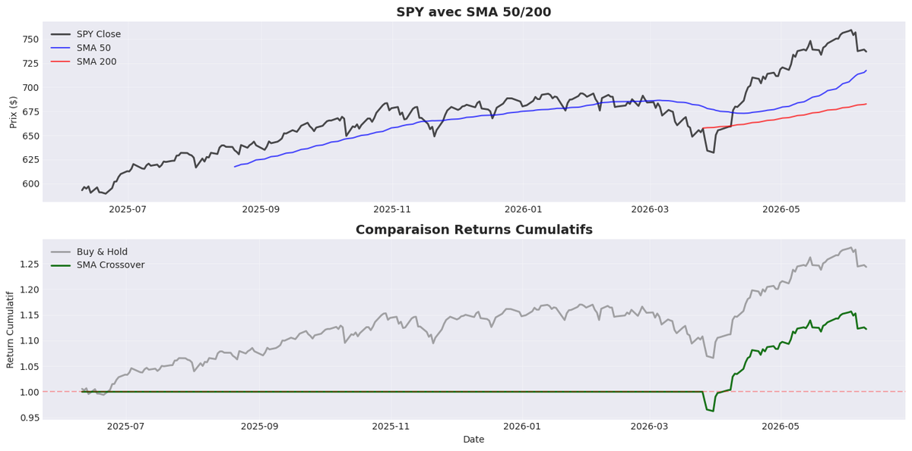
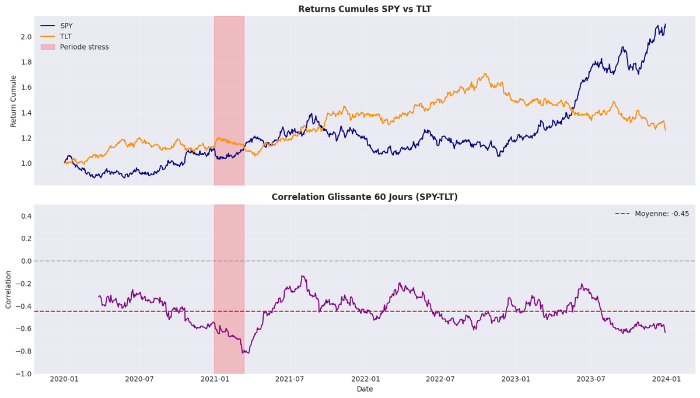
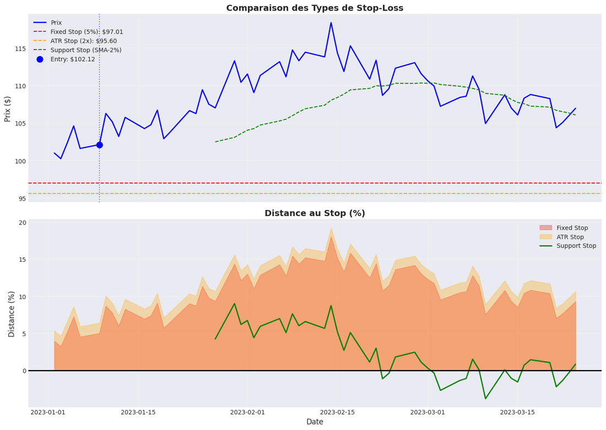
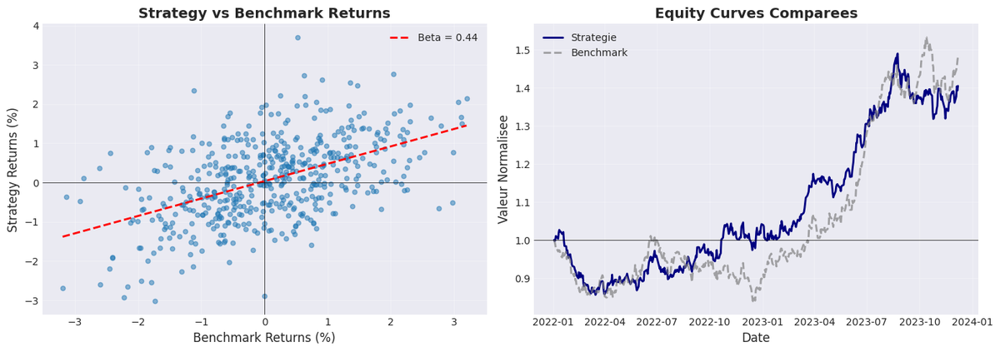
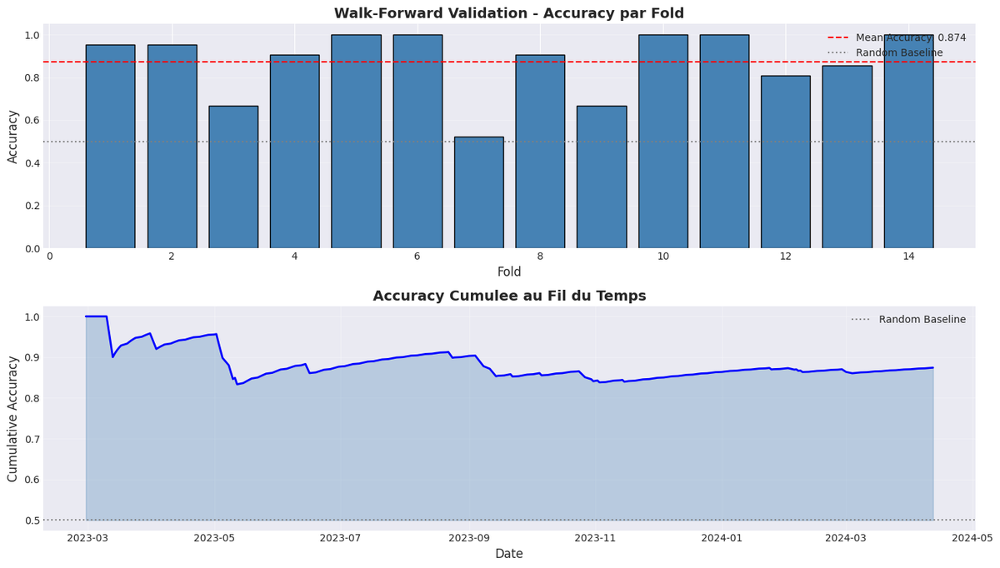
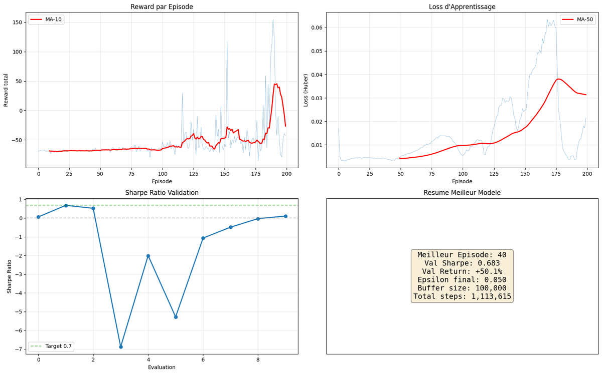

# QuantConnect Python Notebooks

Supports de cours pour l'apprentissage du trading algorithmique avec QuantConnect LEAN.

> **Note** : Ces notebooks sont des supports de cours à lire sur GitHub ou en local.
> Pour exécuter les backtests, copiez le code dans un projet [QuantConnect Cloud](https://www.quantconnect.com/lab).

## 4-Type Classification

| Type | Count | Description |
|------|-------|-------------|
| **(a)** quantbook QC Cloud | 18 | QuantBook research or cloud-deploy descriptors (inclut Cloud-06-PCA-StatArb, Cloud-07-TemporalCNN ajoutés 2026-05, Cloud-08-ValueFactor-ZScore, Cloud-09-OptionWheel ajoutés 2026-06) |
| **(b)** research companion | 2 | QuantBook research paired with a course notebook |
| **(c)** standalone research | 6 | Local yfinance/sklearn training |
| **(d)** pedagogical placeholder | 33 | Course material with embedded QCAlgorithm strings |

**Récapitulatif** : 18+2+6+33 = 59 entrées de classification. Le nombre total de fichiers `.ipynb` dans le dossier est **55** : la différence reflète les notebooks classés dans plusieurs catégories (ex. course material exécuté localement = (c)+(d)). Voir [docs/archive/qc-strategies-status.md](../../../docs/archive/qc-strategies-status.md) pour la classification détaillée.

> **Note — écarts de classification 4-types (hub vs feuille)** : la classification ci-dessus (a/b/c/d) classe les notebooks Python du dossier par **modalité d'exécution** (quantbook QC Cloud, research companion, standalone local, placeholder pédagogique). Le dossier [`projects/`](../projects/) — catalogué dans [`projects/README.md`](../projects/README.md) et référencé depuis le hub [`QuantConnect/README.md`](../README.md) — utilise un 4-types **distinct** par **robustesse** (Robuste / Historique / Exploratoire / ML-DL-RL). Les deux classifications ont des **périmètres disjoints** : ce dossier = supports de cours (notebooks pédagogiques), `projects/` = stratégies déployables (code backtest). Toute lecture transversale doit garder cette distinction à l'esprit : un notebook (c) « standalone research » n'est pas pour autant une stratégie de production, et inversement un projet « Robuste » n'a pas forcément de notebook pédagogique ici. Alignement non forcé volontairement (cf. note tracker `#5661`).

Full classification: [docs/archive/qc-strategies-status.md](../../../docs/archive/qc-strategies-status.md)

---

## État réel d'exécution (audit 2026-05-05, mise à jour 2026-07-02)

Suite à l'audit du 5 mai 2026, voici l'état honnête de chaque notebook. **Aucun output theatrical** (cellules qui printent des métadonnées en se faisant passer pour une exécution) ne subsiste après nettoyage de la PR `chore/qc-strip-fake-outputs`. Mise à jour 2026-05-28 : ajout des 5 notebooks créés depuis l'audit initial (RL avancé + 2 Cloud). Mise à jour 2026-07-02 : réalignement des comptes « A/B cellules avec outputs » sur l'état réel des `.ipynb` (convention A = cellules avec outputs non vides, B = cellules code totales) — 17 lignes mises à jour après les ré-exécutions post-audit (RL PPO/SAC-A2C/DQN, training LSTM/Transformer, paper-trading, Cloud-Risk-Parity, etc.).

**Légende** :
- **EXÉCUTÉ** : cellules avec outputs réels issus d'une vraie exécution kernel
- **NON EXÉCUTÉ** : code source réel mais jamais exécuté (commit attendu après run kernel — préférable au théâtre)
- **doc cloud** : notebook markdown-only documentant un backtest QC Cloud (résultats sur la plateforme, pas dans le notebook)

| Notebook | Statut | Détail |
|----------|--------|--------|
| QC-Py-01-Setup | NON EXÉCUTÉ | 7 cellules code, 0 output |
| QC-Py-02-Platform-Fundamentals | NON EXÉCUTÉ | 5 cellules code, 0 output |
| QC-Py-03-Data-Management | NON EXÉCUTÉ | 10 cellules code, 0 output |
| QC-Py-04-Research-Workflow | NON EXÉCUTÉ | 25 cellules code, 0 output |
| QC-Py-05-Universe-Selection | NON EXÉCUTÉ | 11 cellules code, 0 output |
| QC-Py-06-Options-Trading | NON EXÉCUTÉ | 10 cellules code, 0 output |
| QC-Py-07-Futures-Forex | NON EXÉCUTÉ | 15 cellules code, 0 output |
| QC-Py-08-Multi-Asset-Strategies | NON EXÉCUTÉ | 17 cellules code, 0 output |
| QC-Py-09-Order-Types | NON EXÉCUTÉ | 17 cellules code, 0 output |
| QC-Py-10-Risk-Portfolio-Management | NON EXÉCUTÉ | 17 cellules code, 0 output |
| QC-Py-11-Technical-Indicators | NON EXÉCUTÉ | 15 cellules code, 0 output |
| QC-Py-12-Backtesting-Analysis | NON EXÉCUTÉ | 31 cellules code, 0 output |
| QC-Py-13-Alpha-Models | NON EXÉCUTÉ | 15 cellules code, 0 output |
| QC-Py-14-Portfolio-Construction-Execution | NON EXÉCUTÉ | 21 cellules code, 0 output |
| QC-Py-15-Parameter-Optimization | NON EXÉCUTÉ | 29 cellules code, 0 output |
| QC-Py-16-Alternative-Data | NON EXÉCUTÉ | 15 cellules code, 0 output |
| QC-Py-17-Sentiment-Analysis | NON EXÉCUTÉ | 19 cellules code, 0 output |
| QC-Py-18-ML-Features-Engineering | EXÉCUTÉ | 22/25 cellules avec outputs |
| QC-Py-19-ML-Supervised-Classification | NON EXÉCUTÉ | 24 cellules code, 0 output |
| QC-Py-20-ML-Regression-Prediction | NON EXÉCUTÉ | 22 cellules code, 0 output |
| QC-Py-21-Portfolio-Optimization-ML | NON EXÉCUTÉ | 20 cellules code, 0 output |
| QC-Py-22-Deep-Learning-LSTM | NON EXÉCUTÉ | 26 cellules code, 0 output |
| QC-Py-23-Attention-Transformers | EXÉCUTÉ | 14/17 cellules avec outputs |
| QC-Py-23b-PatchTST-iTransformer | EXÉCUTÉ | 13/13 cellules avec outputs |
| QC-Py-24-Autoencoders-Anomaly | EXÉCUTÉ | 18/21 cellules avec outputs |
| QC-Py-25-Reinforcement-Learning | EXÉCUTÉ | 12/15 cellules avec outputs |
| QC-Py-26-LLM-Trading-Signals | NON EXÉCUTÉ | 11 cellules code, 0 output |
| QC-Py-27-Production-Deployment | NON EXÉCUTÉ | 9 cellules code, 0 output |
| QC-Py-28-Market-Regime-Detection | NON EXÉCUTÉ | 14 cellules code, 0 output |
| QC-Py-30-LSTM-Training | EXÉCUTÉ | 19/19 cellules avec outputs |
| QC-Py-31-Transformer-Training | EXÉCUTÉ | 17/17 cellules avec outputs |
| QC-Py-32-RL-DQN-Trading | EXÉCUTÉ | 15/15 cellules avec outputs |
| QC-Py-40-PaperTrading-Binance | EXÉCUTÉ | 11/12 cellules avec outputs |
| QC-Py-41-PaperTrading-IBKR | EXÉCUTÉ | 12/12 cellules avec outputs |
| QC-Py-Cloud-01-FinBERT-Sentiment | EXÉCUTÉ | 6/9 cellules avec outputs |
| QC-Py-Cloud-01-RiskParity-Composite | doc cloud | markdown-only — backtest sur QC Cloud |
| QC-Py-Cloud-02-ML-Classification | EXÉCUTÉ | 2/6 cellules avec outputs |
| QC-Py-Cloud-02-SectorRotation-Momentum | doc cloud | markdown-only — backtest sur QC Cloud |
| QC-Py-Cloud-03-DualMomentum | doc cloud | markdown-only — backtest sur QC Cloud |
| QC-Py-Cloud-03-Risk-Parity | EXÉCUTÉ | 6/6 cellules avec outputs |
| QC-Py-Cloud-04-MeanReversion | doc cloud | markdown-only — backtest sur QC Cloud |
| QC-Py-Cloud-04-RL-DQN-Trading | EXÉCUTÉ | 2/5 cellules avec outputs |
| QC-Py-Cloud-05-MLP-Forecasting | EXÉCUTÉ | 2/5 cellules avec outputs |
| QC-Py-Cloud-05-RegimeSwitching | doc cloud | markdown-only — backtest sur QC Cloud |
| QC-Py-Cloud-06-VolTargeting | doc cloud | markdown-only — backtest sur QC Cloud |
| QC-Py-Cloud-06-PCA-StatArb | doc cloud | markdown-only — backtest sur QC Cloud |
| QC-Py-Cloud-07-TemporalCNN | doc cloud | markdown-only — backtest sur QC Cloud |
| QC-Py-Cloud-08-ValueFactor-ZScore | doc cloud | markdown-only — backtest sur QC Cloud |
| QC-Py-Cloud-09-OptionWheel | doc cloud | markdown-only — backtest sur QC Cloud |
| QC-Py-33-RL-PPO-Trading | EXÉCUTÉ | 15/16 cellules avec outputs |
| QC-Py-34-RL-SAC-A2C-Trading | EXÉCUTÉ | 14/17 cellules avec outputs |
| QC-Py-35-RL-Portfolio-Construction | EXÉCUTÉ | 7/9 cellules avec outputs |
| QC-Py-Dataset-Workflow | NON EXÉCUTÉ | 11 cellules code, 0 output |

**Récapitulatif** : 53 notebooks total — 18 exécutés, 25 non exécutés, 10 doc cloud.

**Politique** : un notebook NON EXÉCUTÉ avec du code réel est préférable à un notebook avec des outputs théâtraux (print de métadonnées prétendant être une exécution). Les patterns théâtraux suivants sont désormais détectés comme erreur par [`scripts/validate_qc_notebooks.py`](../scripts/validate_qc_notebooks.py) :
- `print("Algorithme charge : {len(qc_code)} caracteres")` — métadonnée d'une string, pas une exécution
- `print("Workflow de deploiement...")` — workflow MCP imprimé comme texte
- `print("Placeholder pour les resultats")` — résultats hardcodés
- `print("Resultats sync depuis QC Cloud projet XXXX")` — sans fetch réel

Les notebooks NON EXÉCUTÉS doivent être exécutés (kernel local pour les indépendants, QC Cloud pour ceux qui requièrent QuantBook) avant de pouvoir être marqués EXÉCUTÉ. Aucun raccourci toléré.

---

## Aperçu — le trading quantitatif en images

Chaque notebook de la série rend visible un geste quantitatif distinct, dans une figure extraite des sorties réelles des notebooks. Plutôt qu'une galerie séparée du propos, ces figures sont replacées ci-dessous dans leur progression pédagogique — du premier backtest QuantBook aux agents de renforcement profond — au plus près du concept qu'elles illustrent. La provenance détaillée (cellule, poids, alt-text) est documentée dans [`assets/readme/MANIFEST.md`](assets/readme/MANIFEST.md).

**[04 — Le workflow de recherche QuantBook.](QC-Py-04-Research-Workflow.ipynb)** Le `QuantBook` autorise l'exploration interactive avant l'algorithmation : on y confronte une stratégie simple (croisement de moyennes mobiles) au buy-and-hold de référence sur SPY. La courbe de capital révèle quand la stratégie bat le marché passivement et quand elle le suit — le premier geste de la recherche quantitative.

**[08 — Corrélations glissantes, ou la faillite du modèle statique.](QC-Py-08-Multi-Asset-Strategies.ipynb)** La corrélation moyenne entre deux actifs cache sa vérité : elle évolue dans le temps et s'effondre précisément lors des périodes de stress où la diversification était censée protéger le portefeuille. La corrélation glissante rend ce risque visible — pourquoi l'allocation statique est un leurre.

**[10 — Le coût d'un stop-loss.](QC-Py-10-Risk-Portfolio-Management.ipynb)** Protéger une position a un prix. Les stops fixes coupent net, les stops trailing suivent la hausse mais se déclenchent sur le bruit, les stops volatilité s'adaptent au régime de marché. Sur un même prix simulé, les trois types laissent des traces différentes — choisir un stop, c'est choisir quel risque on accepte.

**[12 — Le profil risque-rendement d'un backtest.](QC-Py-12-Backtesting-Analysis.ipynb)** La richesse d'un backtest ne tient pas dans un seul Sharpe : le scatter des rendements quotidiens de la stratégie contre son benchmark expose la dispersion, les queues et la fréquence des bons et mauvais jours. C'est la signature statistique complète du comportement de la stratégie.

**[19 — La validation walk-forward, ou l'honnêteté temporelle.](QC-Py-19-ML-Supervised-Classification.ipynb)** Un modèle entraîné une fois puis testé sur tout l'échantillon triche avec le temps. La validation walk-forward décale une fenêtre d'entraînement puis re-teste, fold après fold, en mimant le retrain périodique qu'exige un trading réel. L'accuracy par fold révèle la robustesse — ou l'effondrement — hors échantillon.

**[32 — L'agent qui apprend à trader.](QC-Py-32-RL-DQN-Trading.ipynb)** Le deep reinforcement learning entraîne un agent par essais et erreurs : chaque épisode ajuste sa politique pour maximiser la récompense cumulée. La courbe des récompenses par épisode montre la transition de l'exploration vers l'exploitation — le moment où l'agent cesse de tâtonner et commence à exploiter ce qu'il a appris.

## Phase 1 : Fondations LEAN (QC-Py-01 à 04)

| Notebook | Contenu |
|----------|---------|
| [QC-Py-01-Setup](QC-Py-01-Setup.ipynb) | Compte QC, premier backtest, architecture LEAN |
| [QC-Py-02-Platform-Fundamentals](QC-Py-02-Platform-Fundamentals.ipynb) | QCAlgorithm lifecycle, Initialize/OnData |
| [QC-Py-03-Data-Management](QC-Py-03-Data-Management.ipynb) | History API, consolidators, multi-timeframe |
| [QC-Py-04-Research-Workflow](QC-Py-04-Research-Workflow.ipynb) | QuantBook, pandas, notebook vers algorithme |

## Phase 2 : Classes d'actifs (QC-Py-05 à 10)

| Notebook | Contenu |
|----------|---------|
| [QC-Py-05-Universe-Selection](QC-Py-05-Universe-Selection.ipynb) | Univers dynamiques, filtres fondamentaux |
| [QC-Py-06-Options-Trading](QC-Py-06-Options-Trading.ipynb) | Chaînes d'options, greeks, stratégies couvertes |
| [QC-Py-07-Futures-Forex](QC-Py-07-Futures-Forex.ipynb) | Contrats à terme, devises, hedging |
| [QC-Py-08-Multi-Asset-Strategies](QC-Py-08-Multi-Asset-Strategies.ipynb) | Portefeuilles multi-classes d'actifs |
| [QC-Py-09-Order-Types](QC-Py-09-Order-Types.ipynb) | Market, limit, stop, trailing, combo orders |
| [QC-Py-10-Risk-Portfolio-Management](QC-Py-10-Risk-Portfolio-Management.ipynb) | Risk management, position sizing, drawdown |

## Phase 3 : Analyse et Stratégie (QC-Py-11 à 17)

| Notebook | Contenu |
|----------|---------|
| [QC-Py-11-Technical-Indicators](QC-Py-11-Technical-Indicators.ipynb) | Indicateurs techniques, indicateurs custom |
| [QC-Py-12-Backtesting-Analysis](QC-Py-12-Backtesting-Analysis.ipynb) | Mesures de performance, Sharpe, drawdown |
| [QC-Py-13-Alpha-Models](QC-Py-13-Alpha-Models.ipynb) | Framework Alpha, signaux, combinaison |
| [QC-Py-14-Portfolio-Construction-Execution](QC-Py-14-Portfolio-Construction-Execution.ipynb) | Construction portefeuille, exécution |
| [QC-Py-15-Parameter-Optimization](QC-Py-15-Parameter-Optimization.ipynb) | Optimization, grid search, walk-forward |
| [QC-Py-16-Alternative-Data](QC-Py-16-Alternative-Data.ipynb) | données alternatives, sentiment, fundamentals |
| [QC-Py-17-Sentiment-Analysis](QC-Py-17-Sentiment-Analysis.ipynb) | NLP, analyse sentiment, signaux textuels |

## Phase 4 : Machine Learning (QC-Py-18 à 28)

| Notebook | Contenu |
|----------|---------|
| [QC-Py-18-ML-Features-Engineering](QC-Py-18-ML-Features-Engineering.ipynb) | Feature engineering pour trading |
| [QC-Py-19-ML-Supervised-Classification](QC-Py-19-ML-Supervised-Classification.ipynb) | Classification, signaux d'achat/vente |
| [QC-Py-20-ML-Regression-Prediction](QC-Py-20-ML-Regression-Prediction.ipynb) | Régression, prédiction de prix |
| [QC-Py-21-Portfolio-Optimization-ML](QC-Py-21-Portfolio-Optimization-ML.ipynb) | Optimisation ML de portefeuille |
| [QC-Py-22-Deep-Learning-LSTM](QC-Py-22-Deep-Learning-LSTM.ipynb) | Réseaux LSTM pour séries temporelles |
| [QC-Py-23-Attention-Transformers](QC-Py-23-Attention-Transformers.ipynb) | Transformers, attention mechanism |
| [QC-Py-23b-PatchTST-iTransformer](QC-Py-23b-PatchTST-iTransformer.ipynb) | PatchTST, iTransformer — transformers spécialisés séries temporelles |
| [QC-Py-24-Autoencoders-Anomaly](QC-Py-24-Autoencoders-Anomaly.ipynb) | Détection d'anomalies, autoencodeurs |
| [QC-Py-25-Reinforcement-Learning](QC-Py-25-Reinforcement-Learning.ipynb) | RL, DQN, environnement trading |
| [QC-Py-26-LLM-Trading-Signals](QC-Py-26-LLM-Trading-Signals.ipynb) | LLM pour signaux de trading |
| [QC-Py-27-Production-Deployment](QC-Py-27-Production-Deployment.ipynb) | Déploiement live, monitoring |
| [QC-Py-28-Market-Regime-Detection](QC-Py-28-Market-Regime-Detection.ipynb) | Détection de régimes de marché |

## Entraînement ML (QC-Py-30 à 32)

Notebooks d'entraînement de modèles avec checkpoints GPU.

| Notebook | Modèle | Sortie |
|----------|--------|--------|
| [QC-Py-30-LSTM-Training](QC-Py-30-LSTM-Training.ipynb) | LSTM | Checkpoint PyTorch |
| [QC-Py-31-Transformer-Training](QC-Py-31-Transformer-Training.ipynb) | Transformer | Checkpoint PyTorch |
| [QC-Py-32-RL-DQN-Trading](QC-Py-32-RL-DQN-Trading.ipynb) | DQN | Checkpoint PyTorch |

## Reinforcement Learning Avancé (QC-Py-33 à 35)

Approfondissement RL au-delà du DQN de la Phase 8 : PPO, SAC/A2C, application portfolio.

| Notebook | Algorithme | Contenu |
|----------|------------|---------|
| [QC-Py-33-RL-PPO-Trading](QC-Py-33-RL-PPO-Trading.ipynb) | PPO | Proximal Policy Optimization, clipped surrogate, Stable-Baselines3 |
| [QC-Py-34-RL-SAC-A2C-Trading](QC-Py-34-RL-SAC-A2C-Trading.ipynb) | SAC + A2C | Soft Actor-Critic + A2C, comparatif algorithmes RL |
| [QC-Py-35-RL-Portfolio-Construction](QC-Py-35-RL-Portfolio-Construction.ipynb) | RL multi-asset | RL pour allocation multi-asset, contraintes de risque |

## Paper Trading (QC-Py-40 à 41)

| Notebook | Courtier |
|----------|----------|
| [QC-Py-40-PaperTrading-Binance](QC-Py-40-PaperTrading-Binance.ipynb) | Binance |
| [QC-Py-41-PaperTrading-IBKR](QC-Py-41-PaperTrading-IBKR.ipynb) | Interactive Brokers |

## Stratégies Cloud (QC-Py-Cloud-*)

Notebooks de recherche et stratégies exécutées sur QuantConnect Cloud.

| Notebook | Stratégie |
|----------|-----------|
| [QC-Py-Cloud-01-FinBERT-Sentiment](QC-Py-Cloud-01-FinBERT-Sentiment.ipynb) | NLP FinBERT sentiment |
| [QC-Py-Cloud-01-RiskParity-Composite](QC-Py-Cloud-01-RiskParity-Composite.ipynb) | Risk Parité composite |
| [QC-Py-Cloud-02-ML-Classification](QC-Py-Cloud-02-ML-Classification.ipynb) | ML classification |
| [QC-Py-Cloud-02-SectorRotation-Momentum](QC-Py-Cloud-02-SectorRotation-Momentum.ipynb) | Rotation sectorielle |
| [QC-Py-Cloud-03-DualMomentum](QC-Py-Cloud-03-DualMomentum.ipynb) | Dual Momentum |
| [QC-Py-Cloud-03-Risk-Parity](QC-Py-Cloud-03-Risk-Parity.ipynb) | Risk Parité |
| [QC-Py-Cloud-04-MeanReversion](QC-Py-Cloud-04-MeanReversion.ipynb) | Mean Reversion |
| [QC-Py-Cloud-04-RL-DQN-Trading](QC-Py-Cloud-04-RL-DQN-Trading.ipynb) | RL DQN |
| [QC-Py-Cloud-05-MLP-Forecasting](QC-Py-Cloud-05-MLP-Forecasting.ipynb) | MLP Forecasting |
| [QC-Py-Cloud-05-RegimeSwitching](QC-Py-Cloud-05-RegimeSwitching.ipynb) | Régime Switching |
| [QC-Py-Cloud-06-VolTargeting](QC-Py-Cloud-06-VolTargeting.ipynb) | Volatility Targeting |
| [QC-Py-Cloud-06-PCA-StatArb](QC-Py-Cloud-06-PCA-StatArb.ipynb) | PCA Statistical Arbitrage |
| [QC-Py-Cloud-07-TemporalCNN](QC-Py-Cloud-07-TemporalCNN.ipynb) | Temporal CNN |
| [QC-Py-Cloud-08-ValueFactor-ZScore](QC-Py-Cloud-08-ValueFactor-ZScore.ipynb) | Value Factor Z-Score |
| [QC-Py-Cloud-09-OptionWheel](QC-Py-Cloud-09-OptionWheel.ipynb) | Option Wheel (risk education) |

## Utilitaires

| Notebook | Usage |
|----------|-------|
| [QC-Py-Dataset-Workflow](QC-Py-Dataset-Workflow.ipynb) | Workflow de gestion des datasets QC |

---

## Conclusion / Prochaines étapes

### Ce que vous avez appris

Cette sous-série Python couvre **l'éventail complet** du trading algorithmique sur QuantConnect, des fondations LEAN aux frontières de l'IA, organisé en 5 arcs pédagogiques :

- **Fondations & Asset Classes (Phases 1-2)** : le `QCAlgorithm` lifecycle, l'universe selection, et les classes d'actifs (equities, options, futures, forex). On apprend à *structurer un algo propre* via l'Algorithm Framework modulaire.
- **Analyse & Stratégie (Phase 3)** : indicateurs techniques, risk/portfolio management (Kelly, Risk Parity), backtesting rigoureux (Sharpe, Sortino, drawdown). On apprend que **la métrique seule ne fait pas la stratégie** — le walk-forward et l'out-of-sample sont obligatoires.
- **Machine Learning (Phase 4)** : feature engineering, classification/régression directionnelle (Random Forest, XGBoost), portfolio optimization ML-enhanced. On apprend que le ML classique est solide en regime stable mais fragile aux coûts de transaction réels.
- **Deep Learning & RL (QC-Py-30 à 35)** : LSTM, Transformers, puis Reinforcement Learning (DQN, PPO, SAC/A2C). On apprend que les modèles de profondeur exigent une validation multi-seed et walk-forward — un Sharpe spectaculaire en backtest court est presque toujours un artefact d'overfitting.
- **Production (Paper Trading + Cloud)** : déploiement paper/live (IBKR, Binance), stratégies cloud-native (FinBERT sentiment, ML classification, Temporal CNN, Option Wheel). On apprend que **la stratégie ne se juge que sur le Sharpe net** après frais, slippage et impact de marché.

Le fil rouge : la **rigueur méthodologique** — l'audit d'exécution honnête (section ci-dessus) et les 36 baselines vérifiées du catalogue enseignent que la plupart des edges apparents ne survivent pas à un backtest aligné.

### Prochaines étapes

1. **Suivre l'ordre des phases** : les notebooks sont conçus pour être lus séquentiellement (chacun suppose la maîtrise du précédent). Commencer par QC-Py-01 si vous débutez.
2. **Exécuter sur QC Cloud** : les notebooks marqués `[QC CLOUD]` nécessitent QuantConnect Cloud (gratuit) — copier le code dans un projet QC Lab.
3. **Consulter les projets associés** : chaque notebook pédagogique a un `main.py` correspondant dans `../projects/` pour exécution backtest réelle.
4. **Approfondir le RL** : si le trading RL vous intéresse, enchaîner QC-Py-25 (intro RL) → 32 (DQN) → 33 (PPO) → 34 (SAC/A2C) dans l'ordre.
5. **Lire le livre** : *Hands-On AI Trading* (Jared Broad, 2025), dont les 22 exemples sont mappés à ces notebooks (cf. `../BOOK_MAPPING.md`).
6. **Retour au README principal** : pour la vue d'ensemble de la série QuantConnect complète (incluant les 50+ projets de stratégies backtestées) et les cross-series bridges.

> **Rappel honnête** : le trading algorithmique est un domaine où l'overfitting est la règle. La discipline du walk-forward, du multi-seed et du out-of-sample strict — enseignée tout au long de cette sous-série — est ce qui sépare une stratégie robuste d'une illusion statistique.

---

**Navigation** : [README principal](../README.md) | [Livre de référence](https://www.hands-on-ai-trading.com/)
