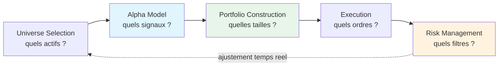
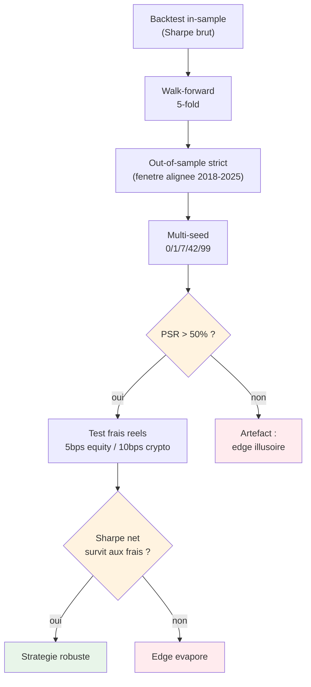
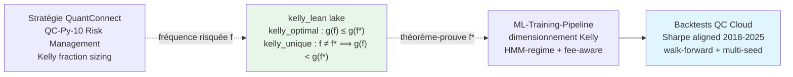

# QuantConnect AI Trading - Série Éducative CoursIA

<!-- CATALOG-STATUS
series: QuantConnect
pedagogical_count: 105
breakdown: Python=53, projects=49, ML-Training-Pipeline=2, kelly_lean=1
maturity: PRODUCTION=59, ALPHA=36, BETA=7, DRAFT=2, TEMPLATE=1
-->

[← Notebooks](../README.md) | [↑ ..](../README.md) | [→ CaseStudies](../CaseStudies/README.md)

Le trading algorithmique transforme les marchés financiers : aujourd'hui, plus de 60% des volumes aux États-Unis sont générés par des algorithmes. Cette série vous apprend à construire, tester et déployer vos propres stratégies de trading automatisées sur la plateforme **QuantConnect LEAN** — un framework open-source utilisé par des milliers de quants professionnels. Le parcours va des fondements (lifecycle d'un algorithme, gestion des données) aux frontières de l'IA (Transformers, RL, LLMs pour signaux de trading).

La série couvre huit phases progressives. Les **fondements** (phases 1-4) maîtrisent l'écosystème QuantConnect : architecture LEAN, universe selection, options/futures, risk management, et l'Algorithm Framework modulaire. La **préparation ML** (phase 5) intègre les données alternatives et le feature engineering. Le **machine learning** (phases 6-7) applique les modèles classiques (Random Forest, XGBoost) puis le deep learning (LSTM, Transformers, autoencoders) aux séries temporelles financières. La **production** (phase 8) couvre le RL, les LLMs pour le trading, et le déploiement live. Chaque notebook est exécutable sur le cloud QuantConnect (free tier) sans installation locale.

**À qui s'adresse cette série** : étudiants en finance quantitative, ingénieurs ML souhaitant appliquer leurs compétences aux marchés, et développeurs curieux de trading algorithmique. Les notebooks Python s'exécutent sur QuantConnect Cloud (gratuit) ou localement avec le LEAN engine. Le livre de référence est *"Hands-On AI Trading"* (Jared Broad, 2025). Aucun capital de départ nécessaire : tout se passe en backtest et paper trading.

> **Visiteur ?** Lire le [Quick Tour](QUICK_TOUR.md) (2 min) pour comprendre l'ampleur du travail.

---

## Pour Commencer (4 étapes)

1. **Créer un compte gratuit** : [https://www.quantconnect.com/signup](https://www.quantconnect.com/signup)
2. **Créer un projet Python** dans QC Lab (File > New Project)
3. **Copier un `main.py`** depuis `projects/` (ex: `EMA-Cross-Stocks/`) dans votre projet
4. **Cliquer Backtest** pour exécuter

**Temps estimé** : 5-10 minutes

> **Note** : Les notebooks QC-Py-XX sont des supports de cours à lire sur GitHub, pas à uploader dans QC Lab.

---

## Structure de la Série

### Phase 1 : Fondations LEAN (4 notebooks, ~4.5h)

Maîtriser les bases de QuantConnect : architecture, lifecycle d'algorithme, gestion des données, workflow de recherche.

| # | Notebook | Durée | Contenu |
|---|----------|-------|---------|
| 01 | [QC-Py-01-Setup](Python/QC-Py-01-Setup.ipynb) | 45 min | Compte QC, premier backtest cloud, architecture LEAN |
| 02 | [QC-Py-02-Platform-Fundamentals](Python/QC-Py-02-Platform-Fundamentals.ipynb) | 60 min | QCAlgorithm lifecycle, Initialize/OnData, Moving Average Crossover |
| 03 | [QC-Py-03-Data-Management](Python/QC-Py-03-Data-Management.ipynb) | 75 min | History API, data normalization, consolidators, multi-timeframe |
| 04 | [QC-Py-04-Research-Workflow](Python/QC-Py-04-Research-Workflow.ipynb) | 75 min | QuantBook, pandas integration, notebook→algorithm transition |

**Objectifs** : Créer compte gratuit, maîtriser cycle de vie algorithme, gestion des données.

---

### Phase 2 : Universe et Asset Classes (4 notebooks, ~5h)

Sélection dynamique d'univers, comprendre les particularités de chaque classe d'actifs (Equities, Options, Futures, Forex).

| # | Notebook | Durée | Contenu |
|---|----------|-------|---------|
| 05 | [QC-Py-05-Universe-Selection](Python/QC-Py-05-Universe-Selection.ipynb) | 75 min | Manual universe, coarse/fine selection, dynamic rebalancing |
| 06 | [QC-Py-06-Options-Trading](Python/QC-Py-06-Options-Trading.ipynb) | 75 min | Options chains, Greeks, covered calls, protective puts |
| 07 | [QC-Py-07-Futures-Forex](Python/QC-Py-07-Futures-Forex.ipynb) | 75 min | Futures contracts, rollover, Forex pairs, leverage |
| 08 | [QC-Py-08-Multi-Asset-Strategies](Python/QC-Py-08-Multi-Asset-Strategies.ipynb) | 75 min | Portfolio Equity + Options + Futures, corrélations |

**Objectifs** : Maîtriser sélection dynamique d'univers, comprendre chaque classe d'actifs.

---

### Phase 3 : Trading Avancé et Risk Management (4 notebooks, ~5.5h)

Gestion du risque professionnelle, types d'ordres avancés, analyse approfondie de backtests.

| # | Notebook | Durée | Contenu |
|---|----------|-------|---------|
| 09 | [QC-Py-09-Order-Types](Python/QC-Py-09-Order-Types.ipynb) | 75 min | Market, Limit, Stop, Stop-Limit, combo orders |
| 10 | [QC-Py-10-Risk-Portfolio-Management](Python/QC-Py-10-Risk-Portfolio-Management.ipynb) | 90 min | Position sizing (Kelly, fixed fractional), stop-loss, take-profit |
| 11 | [QC-Py-11-Technical-Indicators](Python/QC-Py-11-Technical-Indicators.ipynb) | 75 min | Indicateurs intégrés, custom indicators, signal generation |
| 12 | [QC-Py-12-Backtesting-Analysis](Python/QC-Py-12-Backtesting-Analysis.ipynb) | 75 min | Performance metrics (Sharpe, Sortino, max drawdown), equity curve |

**Objectifs** : Maîtriser gestion du risque, ordres avancés, analyse de backtests.

---

### Phase 4 : Algorithm Framework (3 notebooks, ~4h)

Architecture modulaire QuantConnect pour stratégies scalables (Alpha, Portfolio Construction, Execution, Risk).



Le flux de données traverse cinq modules Découplables : l'**Universe** sélectionne les actifs, l'**Alpha** produit les signaux directionnels, la **Portfolio Construction** transforme les signaux en tailles cibles, l'**Execution** route les ordres, et le **Risk Management** filtre/ajuste en continu. Chaque module est remplaçable indépendamment — c'est ce qui permet de composer une stratégie complexe sans réécrire l'ensemble.

| # | Notebook | Durée | Contenu |
|---|----------|-------|---------|
| 13 | [QC-Py-13-Alpha-Models](Python/QC-Py-13-Alpha-Models.ipynb) | 75 min | Algorithm Framework intro, Alpha models, insights |
| 14 | [QC-Py-14-Portfolio-Construction-Execution](Python/QC-Py-14-Portfolio-Construction-Execution.ipynb) | 90 min | Portfolio construction models, execution models, risk models |
| 15 | [QC-Py-15-Parameter-Optimization](Python/QC-Py-15-Parameter-Optimization.ipynb) | 75 min | Parameter sets, optimization targets, overfitting prevention |

**Objectifs** : Maîtriser architecture modulaire, optimisation systématique.

---

### Phase 5 : Alternative Data et Préparation ML (3 notebooks, ~4h)

Intégrer données alternatives (news, sentiment, fundamentals), préparer datasets pour Machine Learning.

| # | Notebook | Durée | Contenu |
|---|----------|-------|---------|
| 16 | [QC-Py-16-Alternative-Data](Python/QC-Py-16-Alternative-Data.ipynb) | 75 min | NewsAPI (gratuit), fundamentals, custom data sources |
| 17 | [QC-Py-17-Sentiment-Analysis](Python/QC-Py-17-Sentiment-Analysis.ipynb) | 75 min | Sentiment scoring (TextBlob, VADER), news aggregation |
| 18 | [QC-Py-18-ML-Features-Engineering](Python/QC-Py-18-ML-Features-Engineering.ipynb) | 90 min | Feature extraction, labeling, train/test split, feature importance |

**Objectifs** : Intégrer données alternatives, préparer datasets pour ML.

---

### Phase 6 : Machine Learning Traditionnel (3 notebooks, ~4h)

Appliquer ML classique au trading : classification directionnelle, régression pour prédiction de prix.

| # | Notebook | Durée | Contenu |
|---|----------|-------|---------|
| 19 | [QC-Py-19-ML-Supervised-Classification](Python/QC-Py-19-ML-Supervised-Classification.ipynb) | 75 min | Random Forest, XGBoost, direction prediction, walk-forward |
| 20 | [QC-Py-20-ML-Regression-Prediction](Python/QC-Py-20-ML-Regression-Prediction.ipynb) | 75 min | Linear regression, SVR, price target prediction |
| 21 | [QC-Py-21-Portfolio-Optimization-ML](Python/QC-Py-21-Portfolio-Optimization-ML.ipynb) | 90 min | ML-enhanced Markowitz, covariance estimation via ML |

**Objectifs** : Appliquer ML classique au trading, persistence modèles avec ObjectStore.

---

### Phase 7 : Deep Learning (4 notebooks, ~6h)

Deep Learning pour séries temporelles : LSTM, Transformers, PatchTST/iTransformer, Autoencoders.

| # | Notebook | Durée | Contenu |
|---|----------|-------|---------|
| 22 | [QC-Py-22-Deep-Learning-LSTM](Python/QC-Py-22-Deep-Learning-LSTM.ipynb) | 90 min | LSTM time series, TensorFlow/Keras, CPU-first |
| 23 | [QC-Py-23-Attention-Transformers](Python/QC-Py-23-Attention-Transformers.ipynb) | 90 min | Transformer architecture, multi-head attention, temporal fusion |
| 23b | [QC-Py-23b-PatchTST-iTransformer](Python/QC-Py-23b-PatchTST-iTransformer.ipynb) | 90 min | PatchTST patching, iTransformer inverted axes, prévision financière |
| 24 | [QC-Py-24-Autoencoders-Anomaly](Python/QC-Py-24-Autoencoders-Anomaly.ipynb) | 75 min | Autoencoders pour détection anomalies, regime change |

**Objectifs** : Maîtriser deep learning pour séries temporelles, design CPU-optimized.

---

### Phase 8 : IA Avancée et Production (4 notebooks, ~5.5h)

État de l'art : Reinforcement Learning, LLM pour trading signals, déploiement production, détection de régime de marché.

| # | Notebook | Durée | Contenu |
|---|----------|-------|---------|
| 25 | [QC-Py-25-Reinforcement-Learning](Python/QC-Py-25-Reinforcement-Learning.ipynb) | 90 min | PPO/DQN agents, Stable-Baselines3, Gym environment custom |
| 26 | [QC-Py-26-LLM-Trading-Signals](Python/QC-Py-26-LLM-Trading-Signals.ipynb) | 90 min | OpenAI/Anthropic API, prompt engineering, LLM+indicators hybrid |
| 27 | [QC-Py-27-Production-Deployment](Python/QC-Py-27-Production-Deployment.ipynb) | 75 min | Paper trading, live trading setup, monitoring, deployment |
| 28 | [QC-Py-28-Market-Regime-Detection](Python/QC-Py-28-Market-Regime-Detection.ipynb) | 75 min | HMM, regime detection, allocation adaptative |

**Objectifs** : IA state-of-the-art pour trading, déploiement production, détection régime.

---

### Compléments Reinforcement Learning Avancé (3 notebooks, ~4h)

Approfondissement RL au-delà du DQN de la Phase 8 : PPO, SAC/A2C, et application portfolio construction.

| # | Notebook | Durée | Contenu |
|---|----------|-------|---------|
| 33 | [QC-Py-33-RL-PPO-Trading](Python/QC-Py-33-RL-PPO-Trading.ipynb) | 90 min | Proximal Policy Optimization, clipped surrogate, Stable-Baselines3 |
| 34 | [QC-Py-34-RL-SAC-A2C-Trading](Python/QC-Py-34-RL-SAC-A2C-Trading.ipynb) | 75 min | Soft Actor-Critic + A2C, comparatif algorithmes RL |
| 35 | [QC-Py-35-RL-Portfolio-Construction](Python/QC-Py-35-RL-Portfolio-Construction.ipynb) | 75 min | RL pour allocation multi-asset, contraintes de risque |

**Objectifs** : Comparer les algorithmes RL modernes, appliquer au portfolio multi-asset.

---

## Résumé de la Progression

**Total cours linéaire** : **29 notebooks Python** (QC-Py-01 à QC-Py-28 + le 23b, ~33 heures de contenu) + **24 notebooks compléments** (Phase 4b-RL avancé QC-Py-33..35, paper trading QC-Py-40..41, Cloud strategies QC-Py-Cloud-*, training QC-Py-30..32, dataset workflow).

**Répartition cours linéaire (Phases 1-8)** :
- **18 notebooks non-ML** (Fondations, Universe, Trading Avancé, Framework, Alternative Data) : ~18h
- **11 notebooks ML/DL/AI** (Supervised Learning, Deep Learning, RL, LLM, Régime) : ~15h

**Progression pédagogique** : Maîtriser les fondations QuantConnect **avant** d'aborder le Machine Learning.

---

## Notebooks Progressifs

**Recommandé pour débuter** :

1. **Phase 1** : Fondations LEAN (4.5h)
2. **Phase 2** : Universe et Asset Classes (5h)
3. **Phase 3** : Trading Avancé et Risk (5.5h)
4. **Notebooks 13-15** : Algorithm Framework (4h)
5. Premier projet : Stratégie momentum avec risk management

**Intermédiaire** (40h) : Phases 4-6 complètes + ML traditionnel

**Expert** (60h) : Phases 6-8 complètes + Deep dive LSTMs, Transformers, RL + déploiement

---

## Projets de Stratégies

Le dossier [`projects/`](projects/) contient le catalogue complet des stratégies de trading prêtes à backtester, classées par robustesse (Robuste / Historique / Exploratoire / ML-DL-RL). Le compte exact et la classification à jour se trouvent dans le README canonique [`projects/README.md`](projects/README.md).

### Comment utiliser les projets

1. Choisir une stratégie dans [`projects/README.md`](projects/README.md)
2. Copier le `main.py` dans votre projet QuantConnect Lab
3. Lancer le backtest
4. Analyser les résultats (Sharpe, Max Drawdown, CAGR)

### Exemples de stratégies populaires

| Stratégie | Description | Niveau |
|-----------|-------------|--------|
| [EMA-Cross-Stocks](projects/EMA-Cross-Stocks/) | EMA 20/50 multi-stock (AAPL/MSFT/GOOGL/AMZN/NVDA) | Débutant |
| [TrendStocksLite](projects/TrendStocksLite/) | EMA20/50 + SMA200 trend 15 large-caps | Intermédiaire |
| [SectorMomentum](projects/SectorMomentum/) | Dual Momentum SPY/TLT/GLD (Antonacci) | Intermédiaire |
| [ML-RandomForest](projects/ML-RandomForest/) | Random Forest classification multi-asset | Avancé |
| [Option-Wheel](projects/Option-Wheel/) | Wheel strategy SPY (sell puts/calls) | Avancé |

---

## 4-Type Notebook Classification

Each notebook in the QC tree falls into one of four types:

| Type | Label | Execution | Count |
|------|-------|-----------|-------|
| **(a)** | quantbook QC Cloud | QC Cloud only | 59 |
| **(b)** | research linked to quantbook | QC Cloud + local | ~76 |
| **(c)** | standalone research | Local (yfinance/sklearn) | 24 |
| **(d)** | pedagogical placeholder | Read-only / copy-paste | 33 |

See [docs/archive/qc-strategies-status.md](../../docs/archive/qc-strategies-status.md) for the exhaustive classification.

## Cours partenaire — Exemples de Recherche

Le dossier **partner-course-quant-trading/** contient des exemples de recherche avancée utilisés dans le cours partenaire.

### Structure

```
partner-course-quant-trading/
├── examples/           # Projets d'exemples du professeur
├── kit-transitoire/    # 3 stratégies ML/Framework progressives (RandomForest, XGBoost, Framework Composite)
├── scripts/            # Scripts utilitaires du cours
├── templates/          # Templates pour projets étudiants
│   ├── starter/        # Niveau débutant
│   ├── intermediate/   # Niveau intermédiaire
│   └── advanced/       # Niveau avancé
```

Voir [partner-course-quant-trading/README.md](partner-course-quant-trading/README.md) pour le détail des exemples, du kit de transition et des templates.

---

## Transient Directories

| Directory | Status | Description |
|-----------|--------|-------------|
| `_pending_execution/` | Local-only | Transient QuantBook workspace (untracked local files); committed placeholder purged |
| `projects/_archive/` | Purged | Dedup-archive removed; canonical strategies retained in `projects/` (commit `#1815`, `#1627`) |
| `_archive/` | Purged | Superseded reports moved to `docs/audits/` (commit `#1626`) |
| `_esgf_cours_5mai/` | Purged | Course 5 May 2026 backtest results archived to G drive (commit `#1626`) |

## Documentation Complémentaire

### Guides de démarrage

- **[GETTING-STARTED.md](GETTING-STARTED.md)** : Guide de démarrage détaillé
- **[docs/HANDSON_AI_TRADING_MAPPING.md](docs/HANDSON_AI_TRADING_MAPPING.md)** : Mapping avec le livre "Hands-On AI Trading"
- **[BOOK_MAPPING.md](BOOK_MAPPING.md)** : Mapping notebooks ↔ chapitres
- **[docs/qc_strategies_catalog.md](docs/qc_strategies_catalog.md)** : Catalogue strategies QC Cloud
- **[docs/HANDSON_DATA_REQUIREMENTS.md](docs/HANDSON_DATA_REQUIREMENTS.md)** : Datasets requis
- **[docs/PAPER_TRADING_ARCHITECTURE.md](docs/PAPER_TRADING_ARCHITECTURE.md)** / **[docs/PAPER_TO_LIVE_TRANSITION.md](docs/PAPER_TO_LIVE_TRANSITION.md)** : Paper trading
- **[docs/PROCEDURE_DEPLOIEMENT.md](docs/PROCEDURE_DEPLOIEMENT.md)** : Procédure de déploiement
- **[docs/audits/](docs/audits/)** : Rapports d'audit historiques (AUDIT_QC_CLOUD, AUDIT_QC_ORG, VALIDATION-REPORT, AUDIT_RAPPORT)

### Bibliothèques partagées

Le dossier [`shared/`](shared/) contient des modules Python réutilisables :

- **features.py** : Feature engineering ML
- **indicators.py** : Custom indicators QuantConnect
- **ml_utils.py** : ML training, persistence (ObjectStore)
- **plotting.py** : Visualisations standardisées
- **backtest_helpers.py** : Helpers configuration backtests

Documentation détaillée : [`shared/SHARED_LIBRARY.md`](shared/SHARED_LIBRARY.md).

### Scripts de validation

| Script | Description |
|--------|-------------|
| `scripts/validate_qc_notebooks.py` | Validation structure notebooks |
| `scripts/test_algorithms.py` | Automated backtest runner |

---

## Ressources Externes

### Documentation QuantConnect

- [Documentation officielle](https://www.quantconnect.com/docs)
- [LEAN Engine GitHub](https://github.com/QuantConnect/Lean)
- [Algorithm Framework](https://www.quantconnect.com/docs/v2/writing-algorithms/algorithm-framework/overview)

### Livre de référence

**"Hands-On AI Trading with Python, QuantConnect, and AWS"** (Janvier 2025, Wiley)

- [Site officiel](https://www.hands-on-ai-trading.com)
- [GitHub du livre](https://github.com/QuantConnect/HandsOnAITradingBook)
- [Amazon (livre)](https://www.amazon.com/dp/1394268432)

### Communauté

- [QuantConnect Forum](https://www.quantconnect.com/forum)
- [LEAN Discussions](https://github.com/QuantConnect/Lean/discussions)
- [CoursIA Main README](../../README.md)

---

## Configuration

### Variables d'environnement (.env)

Copiez `.env.example` vers `.env` et configurez :

```bash
# Authentification QuantConnect Cloud
QC_API_USER_ID=your_user_id_here
QC_API_ACCESS_TOKEN=your_access_token_here

# APIs IA/ML (optionnel, pour notebooks 17, 26)
OPENAI_API_KEY=sk-...
ANTHROPIC_API_KEY=sk-ant-...
HUGGINGFACE_TOKEN=hf_...

# NewsAPI (gratuit, pour notebook 17)
NEWSAPI_KEY=your_newsapi_key_here
```

### Dépendances Python

```bash
# Créer environnement virtuel
python -m venv venv
venv\Scripts\activate  # Windows
source venv/bin/activate  # Linux/macOS

# Installer dépendances
pip install -r requirements.txt

# Installer kernel Jupyter
python -m ipykernel install --user --name=quantconnect --display-name "Python (QuantConnect)"
```

---

## FAQ

### Peut-on trade avec de l'argent réel directement ?

Techniquement oui (QC supporte les brokers live : IBKR, Binance, etc.), mais **pas dans le cadre de cette série**. Tous les notebooks et projets sont conçus pour le backtest et le paper trading. Le passage en live nécessite un compte broker, du capital, et une discipline de validation stricte (walk-forward, multi-seed, OOS).

### Comment choisir une première stratégie ?

Pour débuter : **EMA-Cross-Stocks** (Sharpe 0.872, débutant) ou **AllWeather** (Sharpe 0.667, débutant). Ces stratégies sont simples, robustes, et pédagogiques. Les stratégies avancées (BTC-ML, Framework_Composite) ont des Sharpes plus élevés mais requièrent une compréhension plus profonde des risques.

### Quelle est la différence entre Sharpe et CAGR ?

Le **CAGR** (Compound Annual Growth Rate) mesure le rendement annualisé. Le **Sharpe ratio** mesure le rendement ajusté au risque : Sharpe = (Rendement - Taux_sans_risque) / Volatilité. Un CAGR élevé avec un Sharpe faible signifie une stratégie volatile (gros gains, grosses pertes). Un Sharpe > 0.5 est considéré robuste dans cette série.

### Les performances backtestées sont-elles réalistes en live ?

Non, ou avec une discount significative (20-30% en moins). Les backtests souffrent de biais connus : look-ahead, survivorship, overfitting, et ignorent le slippage et le market impact réels. Les Sharpes annoncés sont in-sample. La série inclut des notebooks sur le walk-forward et les coûts de transaction pour évaluer la robustesse hors-échantillon.

### Peut-on exécuter les notebooks localement sans compte QuantConnect ?

Non. Les notebooks Python de cette série utilisent `QuantBook()` qui nécessite une connexion au cloud QuantConnect. Les notebooks C# (.NET) exécutent du code LEAN en local mais n'ont pas accès aux données de marché sans connexion QC. Créez un compte gratuit sur [quantconnect.com](https://www.quantconnect.com/) pour obtenir votre token API (variable `QC_API_TOKEN` dans `.env`).

### Quelle est la différence entre un notebook Python et un projet C# ?

Les **notebooks Python** (QC-Py-01 à QC-28) sont des explorations interactives avec `QuantBook()` : chargement de données, analyses, visualisations, prototypage rapide. Les **projets C#** sont des algorithmes complets (`QCAlgorithm`) destinés au backtesting production dans l'IDE QuantConnect. Le workflow standard est : explorer en notebook Python -> implémenter en C# ou Python projet.

### Comment limiter le coût en heures de calcul ?

- **Backtesting** : limiter la période historique (2-3 ans suffit pour un prototype) et la fréquence (Daily plutôt que Minute)
- **Notebooks** : utiliser `qb.history()` avec des dates précises plutôt que charger l'historique complet
- **Deep Learning** : les notebooks QC-22/23/24 sont CPU-optimized pour le free tier
- **Rate limiting** : max 10 appels API/min entre tous les agents du cluster

### Pourquoi utiliser LEAN plutôt qu'un framework comme Backtrader ?

LEAN est le moteur de production de QuantConnect : il gère les données corporates (splits, dividends, spinoffs), le slippage, les frais réels, le margin, et le live trading. Backtrader et Zipline sont d'excellents outils pédagogiques mais ne gèrent pas ces aspects en production. Cette série enseigne LEAN pour que les compétences soient directement transférables au trading réel.

### Qu'est-ce qu'un QuantBook et comment se différencie-t-il d'un algorithme ?

`QuantBook` est l'API interactive de QuantConnect pour les notebooks Jupyter. Elle permet de charger des données, calculer des indicateurs, et analyser des résultats sans écrire un algorithme complet. Un `QCAlgorithm` est la version production avec des callbacks (`OnData`, `OnEndOfDay`), un portefeuille, et un moteur d'exécution. Les notebooks de cette série utilisent `QuantBook` pour l'exploration ; les projets utilisent `QCAlgorithm` pour le backtesting.

## Free Tier vs Paid

| Fonctionnalité | Free Tier | Paid (Team/Premium) |
|----------------|-----------|---------------------|
| **Backtesting** | ✅ Illimité (8h calcul/mois) | ✅ Illimité (plus d'heures) |
| **Paper trading** | ✅ | ✅ |
| **Données Equity/Crypto/Forex** | ✅ Depuis 2010 | ✅ Depuis 1998 |
| **Alternative data** | ❌ (workaround : NewsAPI gratuit) | ✅ TiingoNews, etc. |
| **GPU pour Deep Learning** | ❌ (CPU local) | ✅ GPU cloud |
| **Live trading** | ❌ | ✅ |

**Workarounds Free Tier** :
- **QC-17 Sentiment** : NewsAPI gratuit au lieu de TiingoNews payant
- **QC-22/23/24 Deep Learning** : CPU-optimized
- **QC-27 Production** : Paper trading (simulation gratuite)

---

## Résultats Attendus

Après completion de cette série, vous maîtriserez :

### Compétences Techniques

- ✅ **QuantConnect LEAN** : Architecture, lifecycle, Universe selection
- ✅ **Risk Management** : Position sizing, stop-loss, take-profit
- ✅ **Algorithm Framework** : Alpha, Portfolio Construction, Execution, Risk
- ✅ **Machine Learning** : Supervised (RF, XGBoost), Deep Learning (LSTM), RL (PPO)
- ✅ **LLM Integration** : Prompt engineering, LLM-augmented signals
- ✅ **Production Deployment** : Paper trading, live trading, monitoring

### Projets Réalisables

- 🎯 Stratégie momentum multi-actifs avec risk management
- 🤖 Bot ML directionnel avec Random Forest + XGBoost
- 🧠 Stratégie LSTM pour prédiction prix court-terme
- 💡 LLM-augmented strategy combinant GPT-4 + indicateurs
- 🏭 Déploiement production en paper trading

---

## Stratégies Vérifiées — Baselines Comparatives

Les 50+ projets du dossier `projects/` ont été backtestés sur des périodes standardisées via QC Cloud API. Le tableau ci-dessous présente les **meilleures performances vérifiées** (Sharpe, CAGR, MaxDD, PSR) : [catalogue complet](../../docs/qc/qc-comparative-backtests.md).



Le **fil rouge** de la série : un Sharpe spectaculaire en backtest court est presque toujours un artefact. La validation ci-dessus — walk-forward, OOS strict aligné, multi-seed, PSR > 50%, puis test des frais réels — est ce qui sépare une stratégie robuste d'une illusion statistique. Les stratégies du tableau Top 5 ci-dessous sont celles qui ont survécu à ce pipeline.

### Top 5 stratégies (Sharpe aligned, 2018-2025)

| # | Stratégie | Type | Sharpe | CAGR% | MaxDD% | PSR% |
|---|-----------|------|--------|-------|--------|------|
| 1 | LeveragedETFMomentum* | IND | **1.779** | 126.4 | 53.3 | 79.8 |
| 2 | TrendFollowing | IND | **1.072** | 23.2 | 9.3 | 81.8 |
| 3 | Framework_Composite_TrendWeather | COMP | 0.948 | 24.6 | 27.5 | 56.6 |
| 4 | EMA-Cross-Stocks | IND | **0.891** | 26.2 | 35.7 | 40.5 |
| 5 | VolTarget-Momentum | COMP | 0.648 | 14.7 | 21.2 | 22.3 |

**Lecture** : PSR (Probabilistic Sharpe Ratio) > 50% = statistiquement significatif. *LeveragedETFMomentum utilise des ETF à levier 3x : profil de risque extrême (MaxDD 53%), non comparable aux stratégies non-leveragées. **TrendFollowing (1.072)** : caveat de reproductibilité — ce Sharpe vient d'un état du code cloud antérieur (backtest `7792ae0a`, 2018-2025) **non reproductible depuis le code versionné du dépôt**. Baseline-clone du `main.py` repo (2015-2024, IBKR margin) = **Sharpe 0.36 / PSR 6.3%** (backtest `486eb064`, #1630 item 8). À citer avec ce caveat, pas comme leader incontesté.

**Enseignements clés** :
- **TrendFollowing** : Sharpe 1.072 publié (2018-2025, état cloud antérieur) — **non reproductible par le code repo actuel** qui donne 0.36 (2015-2024, PSR 6.3%). La tendance persiste conceptuellement, mais le chiffre exact dépend de la version du code et de la fenêtre (cf [diagnostic reproductibilité](../../docs/qc/qc-comparative-backtests.md), finding 18).
- **EMA-Cross-Alpha** : Sharpe -0.010 en aligned (vs 0.996 en backtest court) = overfitting sever. Démonstration pédagogique du danger des backtests courts.
- **Composites : tout dépend de l'architecture** : Framework_Composite_TrendWeather tient (0.948, PSR 56.6%) là où MomentumRegime (combinaison SectorMom + Regime) obtient seulement 0.185 ("double-defense").
- **Les stars du catalogue ne survivent pas toutes à l'alignement** : PuppiesOfTheDow (1.99 → 0.302) et HighBookToMarketFScore (2.09 → 0.411) s'effondrent sur 2018-2025 — leurs Sharpe catalogue venaient d'une fenêtre glissante non standardisée.
- **Crypto = diversification stable** : MaxDD maitrisé (~17%), rendement modéré.

> Voir [docs/qc/qc-comparative-backtests.md](../../docs/qc/qc-comparative-backtests.md) pour les 36 baselines vérifiées, les comparaisons best-vs-aligned, et les diagnostics détaillés (See #1630).

---

## Pont vers les Preuves Formelles (Lean 4) — différenciant CoursIA

Le dépôt ne se limite pas aux notebooks Python : il embarque une **couche de preuves Lean 4** qui ancre mathématiquement les résultats phares des séries. Le bridge QuantConnect ↔ Lean est [`kelly_lean`](kelly_lean/) — un lake Lean 4 (Mathlib, toolchain `v4.31.0-rc1`) qui prouve l'**optimalité du critère de Kelly** pour le *position sizing*. Le théorème : pour un pari de Bernoulli (probabilité `p` de gain, cote nette `b`, `q = 1 − p`), la fraction optimale du capital à risquer est

> **f\* = (b·p − q) / b**

qui maximise de façon unique le taux de croissance espéré du capital composé. Tout sur-pari (`f > f*`) ou sous-pari (`f < f*`) est **strictement sous-optimal**. Référence : J. L. Kelly Jr., *A New Interpretation of Information Rate*, BSTJ (1956).



Le pipeline complet relie donc trois familles du dépôt : la **théorie** (Lean prouve `kelly_optimal` + `kelly_unique`), la **pratique** (ML-Training-Pipeline dimensionne Kelly HMM-regime, fee-aware, multi-asset, cap-relaxed — voir `ML-Training-Pipeline/docs/M11*`), et la **validation empirique** (backtests QC Cloud walk-forward + multi-seed, comparatif dans [`docs/qc/qc-comparative-backtests.md`](../../docs/qc/qc-comparative-backtests.md)). Sans la couche Lean, la pratique risquerait de s'appuyer sur une formule réputée « standard » mais jamais démontrée. Avec elle, la justification du fractionnement du capital est formellement garantie — pas seulement empiriquement ajustée.

Pour aller plus loin : [EPIC #4038](https://github.com/jsboige/CoursIA/issues/4038) (Roadmap Lean — un théorème-phare par série), [issue #4052](https://github.com/jsboige/CoursIA/issues/4052) (kelly_lean Tier 2), [`kelly_lean/README.md`](kelly_lean/README.md), [`kelly_lean/Kelly.en.md`](kelly_lean/Kelly.en.md).

---

## Cross-series Bridges

| Serie | Lien | Connection |
|-------|------|------------|
| [ML](../ML/README.md) | Machine Learning | Les modèles de prédiction ML (régression, classification, XGBoost) s'appliquent directement aux stratégies de trading (QC-Py-19 à QC-Py-21) |
| [GenAI](../GenAI/README.md) | IA générative | L'analyse de sentiment (QC-Py-17) et les signaux de trading par LLM (QC-Py-26) utilisent les LLMs couverts dans GenAI/Texte |
| [RL](../RL/README.md) | Apprentissage par renforcement | Les stratégies RL (QC-Py-25 DQN/PPO, QC-Py-33 PPO, QC-Py-34 SAC/A2C, QC-Py-35 portfolio) prolongent les fondamentaux RL de cette série |
| [Probas](../Probas/README.md) | Programmation probabiliste | La modélisation bayésienne des rendements et la gestion du risque s'appuient sur les modèles probabilistes de la série Probas |
| [Search](../Search/README.md) | Recherche et optimisation | L'optimisation des hyperparamètres de stratégies (grid search, bayésienne) rejoint les techniques de recherche |
| [ML](../ML/ML.Net/README.md) | Séries temporelles ML.NET | L'analyse technique (QC-Py-11 Technical-Indicators) partage les mêmes fondements que le forecasting par SSA (ML-5) |
| **Lean 4 (kelly_lean)** | **Preuves formelles** | **Le théorème de Kelly est prouvé formellement dans `kelly_lean/` (Mathlib, toolchain v4.31.0-rc1) — fondement du position sizing enseigné dans QC-Py-10** |

---

## Conclusion / Prochaines étapes

### Ce que vous avez appris

Cette série vous a fait traverser **l'arc complet du trading algorithmique moderne** — de la gestion d'un événement de marché à la production d'un agent RL déployé en live. L'arc pédagogique :

- **Les fondations LEAN** (phases 1-4) : maîtriser le `QCAlgorithm` lifecycle, l'univers selection, les asset classes (equities, crypto, options, futures), le risk management (drawdown, exposure, stop-loss) et l'Algorithm Framework modulaire (Alpha + Portfolio Construction + Risk Management). On apprend à *écrire un algo propre*, pas à empiler des règles ad hoc.
- **La préparation ML** (phase 5) : les données alternatives (sentiment, fundamentals, FRED) et le feature engineering. On apprend que **80% de la performance ML vient de la qualité des features**, pas du modèle.
- **Le machine learning** (phases 6-7) : Random Forest et XGBoost classiques, puis deep learning (LSTM, Transformers, autoencoders pour l'anomaly detection). On apprend que les modèles de deep learning sont **fragiles aux coûts de transaction réels** et au changement de régime — un edge apparent en backtest peut s'évaporer une fois les frais appliqués (cf. les baselines vérifiées dans le tableau comparatif ci-dessus).
- **La production** (phase 8 + compléments RL) : Reinforcement Learning (DQN, PPO, SAC/A2C), LLMs pour signaux de trading, et déploiement live (paper trading, brokers IBKR/Binance). On apprend que **la stratégie ne se juge pas sur le Sharpe brut mais sur le Sharpe net** après frais, slippage et impact de marché.

Le fil rouge : **la rigueur méthodologique**. Le catalogue de 36 baselines vérifiées (PSR, walk-forward, fenêtres alignées) enseigne que la plupart des Sharpe spectaculaires ne survivent pas à un backtest honnête — un Lehmann pédagogique aussi important que les techniques elles-mêmes.

### Prochaines étapes

1. **Approfondir une voie** : choisir un domaine (RL, Transformers, factor investing) et creuser les notebooks avancés correspondants (QC-Py-30/31 pour le DL, QC-Py-32/33/34 pour le RL, QC-Py-21/24 pour l'optimisation de portefeuille).
2. **Construire un composite** : combiner plusieurs Alpha Models via l'Algorithm Framework (cf. `Framework_Composite_TrendWeather`, le leader robuste du catalogue) — la diversification batte l'optimisation fine d'un signal unique.
3. **Paper trading** : déployer une stratégie sur QuantConnect Paper Brokerage ou IBKR/Binance (cf. `docs/PAPER_TRADING_ARCHITECTURE.md`) pour valider en temps réel avant tout capital réel.
4. **Suivre le livre** : *Hands-On AI Trading* (Jared Broad, 2025) — les 22 exemples du livre sont mappés aux notebooks de cette série (cf. `BOOK_MAPPING.md`).
5. **Explorer les cross-series bridges** ci-dessus : les techniques ML, GenAI, Probas et Search se combinent toutes avec le trading algorithmique.
6. **Consulter le catalogue** : [docs/qc/qc-comparative-backtests.md](../../docs/qc/qc-comparative-backtests.md) pour les 36 baselines vérifiées, leurs diagnostics de robustesse et les caveats de reproductibilité.

> **Rappel honnête** : le trading algorithmique est un domaine où l'overfitting est la règle, pas l'exception. Un Sharpe > 2 sur un backtest court est presque toujours un artefact. La discipline du walk-forward, du multi-seed et du out-of-sample strict — enseignée tout au long de cette série — est ce qui sépare une stratégie robuste d'une illusion statistique.

---

*Version 1.1.0 - Juin 2026*
