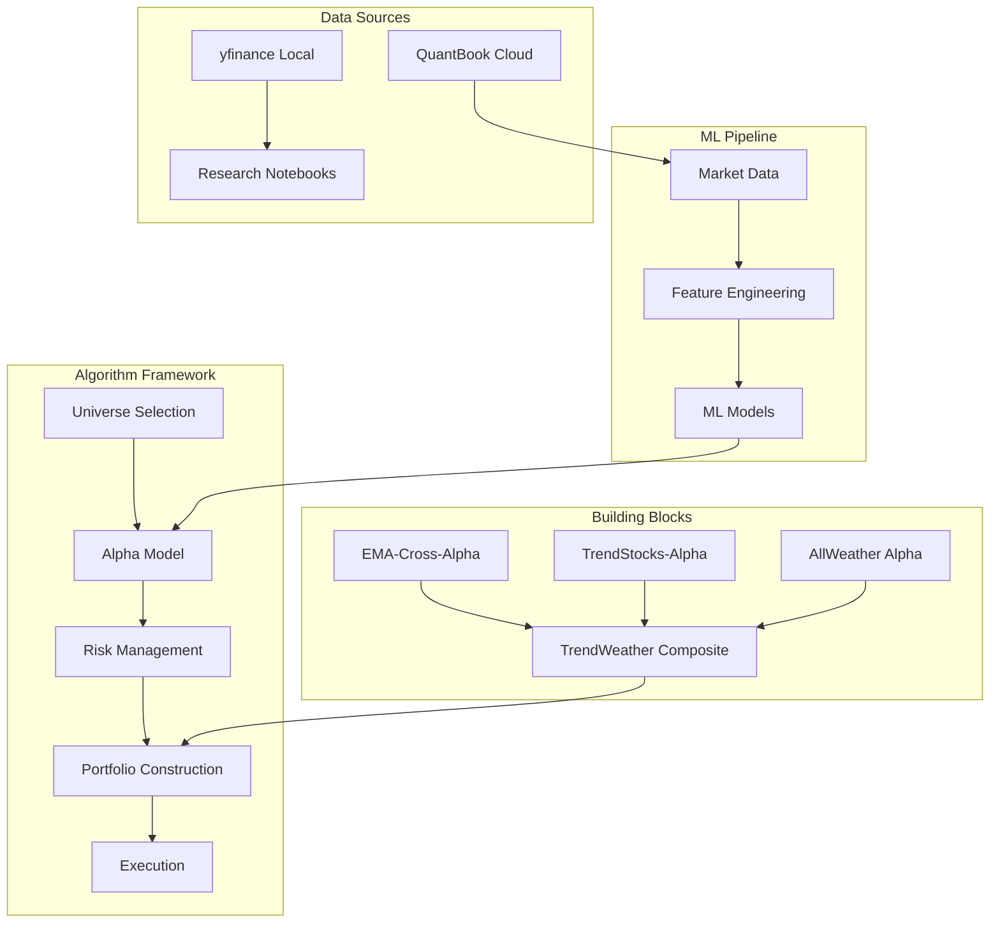

# QuantConnect Trading — Overview

Vue d'ensemble architecturale et resultats du projet QuantConnect (95+ strategies, 51 notebooks).

## Architecture Algorithm Framework

Le projet utilise le **LEAN Algorithm Framework** de QuantConnect, une architecture modulaire separant les preoccupations :



### Composants cles

| Composant | Role | Exemples |
|-----------|------|----------|
| **Universe** | Selectionne les actifs | SPY/IWM/XLF rotation, top-600 equity |
| **Alpha Model** | Genere les insights (direction, magnitude, confiance) | EMA crossover, MACD+ADX, ML classifiers |
| **Risk Management** | Filtre/ajuste les insights | Stop-loss -8/-12%, ATR trailing, ACI overlay |
| **Portfolio Construction** | Alloue le capital | Equal-weight, inverse-vol, Black-Litterman |
| **Execution** | Place les ordres | Market, limit, trailing stop |

## Sharpe Ratios par categorie

```
Catégorie              Mediane  Max     # Stratégies
─────────────────────────────────────────────────────
QC Library Clones      1.90    3.39    8    ████████████████████
Composites Framework   1.16    1.16    1    ████████████
Trend Following        1.65    1.65    2    █████████████████
EMA Crossover          0.87    1.09    6    █████████
ML/DL/RL               0.47    1.74   35+   █████
Portfolio Construction 0.60    0.60    6    ██████
Momentum/Rotation      0.47    0.62    5    █████
Mean Reversion         0.29    0.29    4    ███
Options/Volatilite     0.12    0.52    6    ██
Calendar Anomalies     0.13    0.13    1    ██
Forex                  -0.32   -0.32   1    ▏
```

### Top 5 resultats

| # | Strategie | Sharpe | CAGR | MaxDD | Insight |
|---|-----------|--------|------|-------|---------|
| 1 | LongShortHarvest-QC | **3.39** | 57.9% | — | Long-short equity ML overlay, Hurst regime (OOS QC Library) |
| 2 | HighBookToMarketFScore-QC | **2.09** | 18.4% | — | Piotroski F-Score >= 8 + book-to-market (OOS QC Library) |
| 3 | BTC-MACD-ADX | **1.65** | 38.1% | 48.8% | MACD + ADX filter sur BTC daily (C#) |
| 4 | Positive-Negative-Splits-ML | **1.74** | — | — | LinearRegression split-event prediction (Hands-On AI Trading) |
| 5 | Framework Composite TrendWeather | **1.16** | 27.4% | 27.7% | TrendStocks 75% + AllWeather 25%, ROC63 momentum weighting |

### Top 5 lecons apprises (30+ iterations)

| # | Lecon | Impact | Source |
|---|-------|--------|--------|
| 1 | **Skip-month momentum** : exiger 1 mois entre signal et execution evite le overfitting récent | +0.3 Sharpe | SectorMomentum iterations |
| 2 | **Monthly rebalancing** bat weekly et daily sur la plupart des strategies | Stabilite | Multiple strategies |
| 3 | **Stop-loss asymetrique -8%/-12%** (trailing) optimal vs -5% ou -15% | Réduit MaxDD | Portfolio construction |
| 4 | **Modeles action (DT)** surpassent modeles prediction rendement (PatchTST) | AUC 0.56 vs 0.50 | L4 vs L5 Ladder ML |
| 5 | **yfinance != QC Cloud** : les resultats locaux ne reproduisent pas QC (dividends, splits, fills) | 20+ patterns | docs/quantconnect.md |

## Timeline des iterations majeures

```
2025-02  ████ Début QuantConnect — 1er backtest (EMA-Cross-Crypto)
2025-03  ██████ ECE 2025 cours QC — 15 strategies, 27 notebooks Python
2025-05  ████████████ EPITA-IS + ESGF — expansion à 95+ projets
2025-06  ████████ Hands-On AI Trading — 22 strategies ML (Ch06)
2025-08  ██████████ Algorithm Framework — composites TrendWeather
2025-10  ██████████████ ML Training Pipeline — L1-L5 ladder (RF/GB/DT/LSTM/PatchTST)
2025-11  ████ QC Strategy Library — 8 clones de reference
2026-01  ████████████████ L4 Decision Transformer — seul BEATS du ladder
2026-02  ████ QC Cloud MCP — automatisation backtests via API
2026-03  ████████████████████████ Catalogue 116 projets — README + docs
2026-04  ████████████████████████████████ SymbolicAI PROD — 116 notebooks
2026-05  ████ L6 Dual-Head DT — sweep 104 combos en cours
```

## Structure du repertoire

```
QuantConnect/
├── README.md                    # Vue d'ensemble
├── QUICK_TOUR.md                # Visite guidee (2 min)
├── BOOK_MAPPING.md              # Mapping livre Jared Broad (63 exemples)
├── projects/                    # 116 strategies de trading
│   ├── catalog.json             # Catalogue machine-readable
│   ├── README.md                # Tableau performance
│   ├── STRATEGIES_DETAIL.md     # Descriptions par categorie
│   └── <StrategyName>/          # 1 dir par strategy
│       ├── main.py / Main.cs    # Algorithme QC Cloud
│       ├── research.ipynb       # Recherche locale
│       └── quantbook.ipynb      # QuantBook QC Cloud
├── Python/                      # 51 notebooks pedagogiques (8 phases)
├── datasets/                    # Panier anti-bias (gitignored)
├── ML-Training-Pipeline/        # Scripts training GPU
├── shared/                      # Utilitaires partages
└── docs/                        # Documentation technique
    ├── qc_strategies_catalog.md # Catalogue avec Cloud IDs
    └── OVERVIEW.md              # Ce fichier
```

## Notebooks ↔ Projets (liens croises)

Les notebooks pedagogiques `Python/QC-Py-*` couvrent les concepts ; les projets `projects/<Name>/` implementent les strategies.

| Notebook pedagogique | Projets connexes |
| ---------------------- | ------------------ |
| QC-Py-11 (Technical Indicators) | EMA-Cross-*, BTC-MACD-ADX, Multi-Layer-EMA |
| QC-Py-13 (Alpha Models) | EMA-Cross-Alpha, TrendStocks-Alpha, Framework Composites |
| QC-Py-14 (Portfolio Construction) | Framework_Composite_TrendWeather, AllWeather, RiskParity, BlackLitterman-Momentum |
| QC-Py-15 (Parameter Optimization) | MomentumStrategy, SectorMomentum |
| QC-Py-18 (ML Features) | ML-FeatureEngineering, ML-RandomForest, ML-XGBoost |
| QC-Py-19 (Deep Learning) | ML-Temporal-CNN, LSTM-Forecasting, DL-LSTM |
| QC-Py-20 (Reinforcement Learning) | RL-DQN-Trading, RL-Portfolio |
| QC-Py-Cloud-02 (Sector Rotation) | SectorMomentum, DualMomentum |
| QC-Py-Cloud-03 (Risk Parity) | RiskParity, RegimeSwitching |
| QC-Py-Cloud-05 (MLP Forecasting) | Portfolio-Optimization-ML, ML-Regression |
| QC-Py-Cloud-06 (PCA StatArb) | PCA-StatArbitrage, ETF-Pairs |

## Pour aller plus loin

- [Quick Tour](../QUICK_TOUR.md) — Vue d'ensemble en 2 minutes
- [Patterns confirmes](../../../docs/qc/quantconnect.md) — 20 patterns + 10 anti-patterns
- [Catalogue detaille](../projects/STRATEGIES_DETAIL.md) — Toutes les strategies par categorie
- [Livre Jared Broad](../BOOK_MAPPING.md) — 63 exemples du livre *Hands-On AI Trading*
- [Catalogue QC Cloud](qc_strategies_catalog.md) — Metriques par strategy avec Cloud IDs
