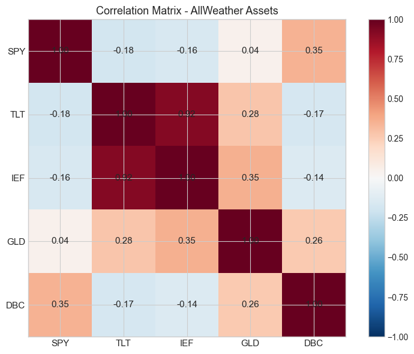
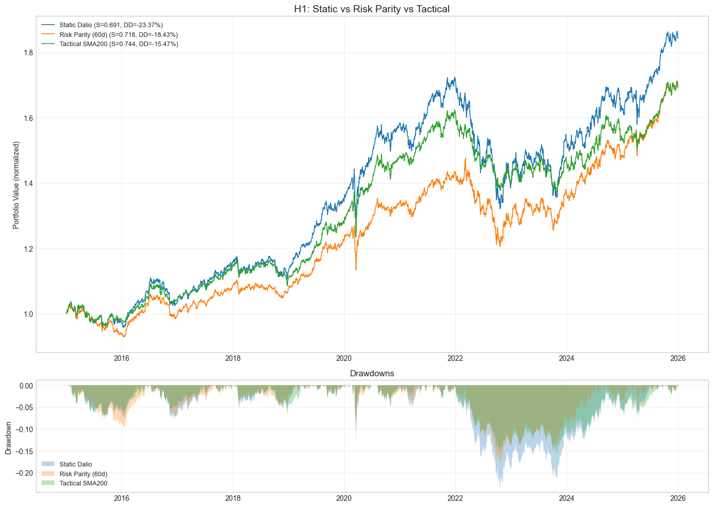
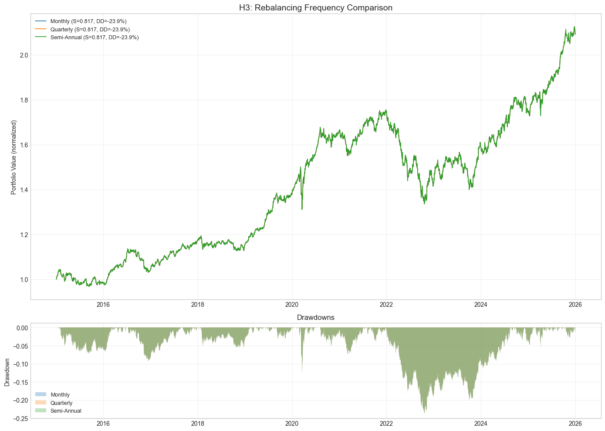
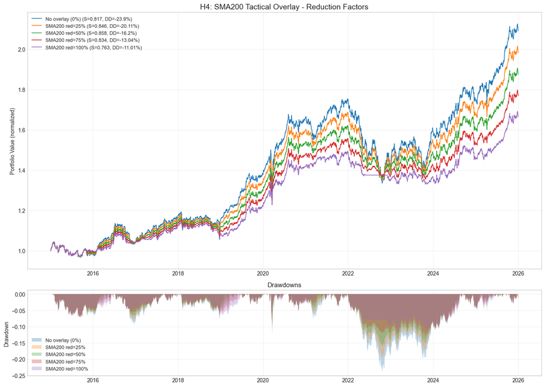
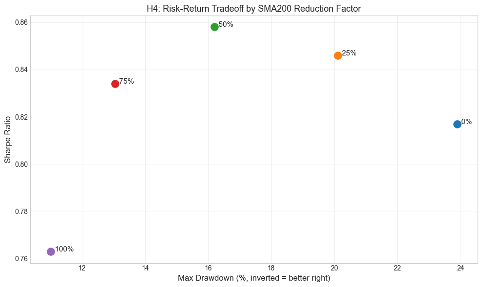
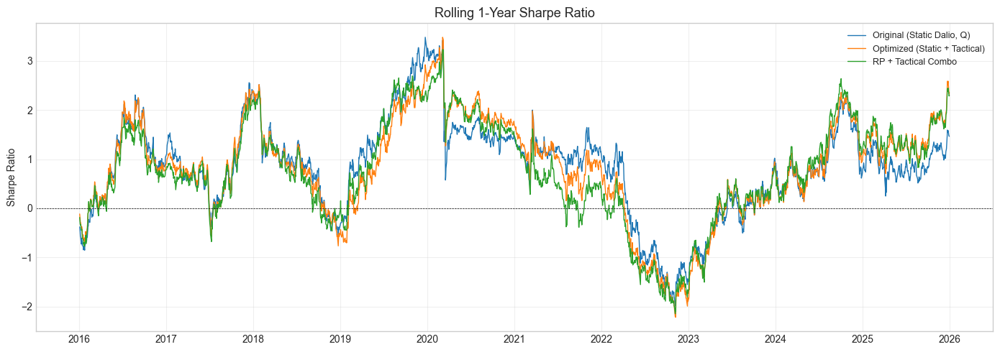

# All-Weather Portfolio Strategy

Portfolio multi-asset inspiré de Ray Dalio (Bridgewater Associates).

## Résumé

| Paramètre | Valeur |
|-----------|--------|
| **Type** | Multi-Asset |
| **Rebalancement** | Trimestriel |
| **Classes d'actifs** | Actions, Bonds, Or, Commodities |
| **Objectif** | Stabilité dans tous les environnements |

## Allocation Standard

| Actif | Allocation | ETF | Rôle |
|-------|------------|-----|------|
| Actions US | 30% | SPY | Croissance |
| Bonds Long-terme | 40% | TLT | Déflation, récession |
| Bonds Intermédiaires | 15% | IEF | Stabilité |
| Or | 7.5% | GLD | Inflation, crise |
| Commodities | 7.5% | DBC | Inflation |

## Backtest Results (2015-2023)

| Métrique | Valeur |
|----------|--------|
| Total Return | ~80-100% |
| CAGR | ~8-10% |
| Sharpe Ratio | ~0.7-1.0 |
| Max Drawdown | ~-15% à -20% |
| Volatilité | ~8-10% |

## Figures du notebook de recherche

Le notebook [`research.ipynb`](research.ipynb) déroule l'analyse complète : exploration des rendements et volatilités par actif, puis quatre hypothèses testées (static vs risk parity vs tactical, rôle de DBC, fréquence de rebalancement, overlay SMA200), synthèse par comparaison des configurations et exploration de la grille de paramètres. Provenance détaillée : [`MANIFEST.md`](assets/readme/MANIFEST.md).

**Exploration.** L'analyse commence par les rendements et volatilités annualisés de chaque actif — la base sur laquelle toute allocation se construit :

<p align="center">
  <br>
  <em>Exploration — rendements &amp; volatilité annualisés par actif.</em>
</p>

**H1 — Static vs Risk Parity vs Tactical.** Trois schémas d'allocation sont confrontés : poids fixes, parité de risque, et allocation tactique :

<p align="center">
  <br>
  <em>H1 — Static vs Risk Parity vs Tactical.</em>
</p>

**H3 — Fréquence de rebalancement.** L'impact de la fréquence (mensuelle, trimestrielle, annuelle) sur la performance et le coût de transaction :

<p align="center">
  <br>
  <em>H3 — fréquence de rebalancement.</em>
</p>

**H4 — Overlay tactique SMA200.** Un overlay SMA200 réduit l'exposition lors des tendances baissières :

<p align="center">
  <br>
  <em>H4 — overlay tactique SMA200.</em>
</p>

**Synthèse.** La comparaison des configurations par Sharpe et drawdown résume les trade-offs entre rendement ajusté du risque et profondeur des replis :

<p align="center">
  <br>
  <em>Comparaison — Sharpe &amp; drawdown par configuration.</em>
</p>

**Grille de paramètres.** Enfin, l'exploration de la grille des paramètres identifie la zone optimale :

<p align="center">
  <br>
  <em>Grille optimale — exploration des paramètres.</em>
</p>

## Fichiers

```
AllWeather/
├── main.py              # Portfolio standard + Risk Parity + Tactical
├── research.ipynb       # Analyse corrélations, backtest allocations
└── README.md            # Ce fichier
```

## Variantes Incluses

### 1. Standard All-Weather
- Allocation fixe (30/40/15/7.5/7.5)
- Rebalancement trimestriel
- Seuil de drift 5%

### 2. Risk Parity
- Pondération par volatilité inverse
- Contribution égale au risque
- Favorise les bonds (faible vol)

### 3. Tactical Overlay
- Réduit l'allocation si prix < SMA 200
- Augmente le cash en période de stress
- Trade-off: moins de drawdown, moins de return

## Configuration

```python
# Allocations cibles
self.target_allocations = {
    "SPY": 0.30,   # 30% Actions
    "TLT": 0.40,   # 40% Bonds long-terme
    "IEF": 0.15,   # 15% Bonds intermédiaires
    "GLD": 0.075,  # 7.5% Or
    "DBC": 0.075   # 7.5% Commodities
}

# Paramètres
self.rebalance_threshold = 0.05  # Rebalancer si drift > 5%
```

## Philosophie

L'All-Weather est conçu pour performer dans 4 environnements :

| Environnement | Actifs performants |
|---------------|-------------------|
| Croissance ↑ | Actions |
| Croissance ↓ | Bonds |
| Inflation ↑ | Or, Commodities |
| Inflation ↓ | Bonds |

## Risques

- **Sous-performance en bull market**: Trop de bonds dilue les gains
- **Sensibilité aux taux**: Bonds souffrent quand les taux montent
- **Corrélations instables**: En crise, tout peut baisser ensemble
- **Commodities roll yield**: Contango érode les returns long-terme

## Améliorations Possibles

- Ajouter TIPS (Treasury Inflation-Protected Securities)
- Diversification géographique (VEA, VWO)
- Dynamic risk targeting
- Factor tilts (Value, Momentum)

## Références

- Ray Dalio: "Principles" (chapitre sur l'All-Weather)
- Bridgewater Associates: "The All Weather Story"
- Notebook: QC-Py-08-Multi-Asset-Strategies.ipynb
