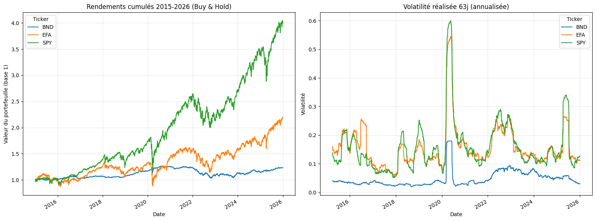
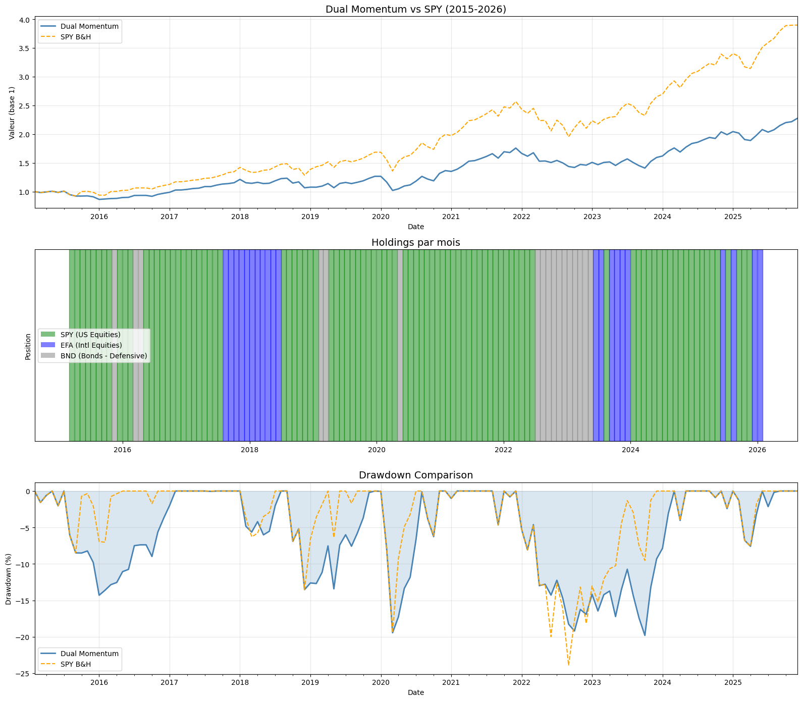
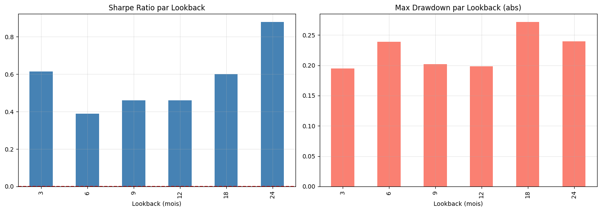
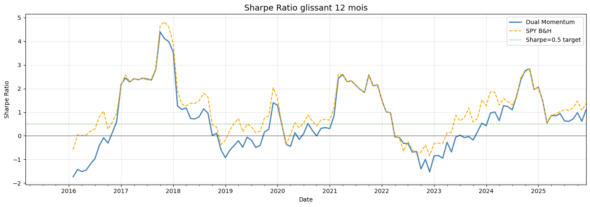

# DualMomentum Strategy

**Statut** : ⚠️ REMPLACÉE par DualMomentumNoTLT — contre-exemple à visée pédagogique.

## Performance

| Métrique | Valeur | Note |
|----------|--------|------|
| Sharpe Ratio | **0.350** | Plus faible que le remplacement |
| CAGR | 9.2 % | Similaire au remplacement |
| Max Drawdown | **33.6 %** | Pire que le remplacement |
| Période | 2015-2026 | |

## Figures du notebook de recherche

Le notebook [`research.ipynb`](research.ipynb) documente l'analyse du dual momentum : exploration, comparaison des drawdowns entre configurations, robustesse au lookback (H2) et comparaison du Sharpe. La stratégie est remplacée par DualMomentumNoTLT (échec de TLT en 2022) — contre-exemple pédagogique. Provenance détaillée : [`MANIFEST.md`](assets/readme/MANIFEST.md).

**Exploration — cartographier les régimes avant de calibrer.** L'analyse exploratoire examine la dynamique des actifs de l'univers (rendements, volatilité, corrélations) pour distinguer les régimes où le signal de momentum est fiable de ceux où il se retourne — le diagnostic préalable à tout calibrage.

<p align="center">
  <br>
  <em>Exploration — analyse exploratoire des données (§2).</em>
</p>

**Drawdowns — où la stratégie saigne.** La comparaison des drawdowns entre configurations isole les épisodes de perte maximale (crash COVID de 2020, cycle de hausse des taux de 2022) et montre lesquels pèsent sur le Max DD de 33,6 % — l'origine structurelle qui motive le remplacement par DualMomentumNoTLT.

<p align="center">
  <br>
  <em>Drawdown — comparaison entre configurations.</em>
</p>

**H2 — robustesse au *lookback*, ou la stabilité du signal.** La deuxième hypothèse teste si la performance tient quand on改变 la fenêtre de momentum (*lookback period*). Une courbe plate signe un signal robuste ; une courbe qui s'effondre révèle un sur-ajustement à une fenêtre unique.

<p align="center">
  <br>
  <em>H2 — robustesse par <i>lookback period</i>.</em>
</p>

**Sharpe — rendement ajusté au risque, configuration par configuration.** La comparaison du ratio de Sharpe clôt le diagnostic : elle quantifie le gain (ou la perte) de rendement ajusté au risque au fil des variantes et confirme le verdict — DualMomentum (0,350) dominé par DualMomentumNoTLT (0,469).

<p align="center">
  <br>
  <em>Sharpe — comparaison entre configurations.</em>
</p>

## Pourquoi cette stratégie a été remplacée

### Cause racine : échec du TLT (obligations long terme) en risk-off

Cette stratégie utilise **TLT** comme actif risk-off pendant les marchés baissiers :
- **Hypothèse** : TLT offre une valeur refuge pendant les baisses actions
- **Réalité (2022)** : TLT s'est effondré de -26 % pendant le cycle de hausse des taux
- **Impact** : Max drawdown de 33.6 % (surtout issu de COVID + 2022)

### Le problème COVID (mars 2020)

| Événement | Baisse SPY | Baisse TLT | Impact stratégie |
|-----------|------------|------------|------------------|
| Crash COVID (mars 2020) | -34 % | +2 % | TLT a fonctionné comme prévu |
| Cycle de hausse des taux (2022) | -25 % | **-26 %** | TLT a ÉCHOUÉ comme valeur refuge |

**Le problème structurel** : TLT est un **risque de duration**, pas une vraie diversification :
- En cycle de hausse des taux, TLT se corrèle AVEC les actions (les deux baissent)
- 2022 a cassé l'hypothèse « obligations = valeur refuge »
- Le Max DD de 33.6 % est structurel (ne peut pas être corrigé par ajustement de paramètres)

### Remplacement : DualMomentumNoTLT

| Stratégie | Sharpe | CAGR | Max DD | Amélioration |
|-----------|--------|------|--------|--------------|
| DualMomentum (original) | 0.350 | 9.2 % | 33.6 % | Référence |
| **DualMomentumNoTLT** | **0.469** | **11.0 %** | **23.6 %** | **+34 % Sharpe, -10 % Max DD** |

**Ce qui a changé** :
- Retrait du TLT, remplacé par des **actifs défensifs** (XLP, IEF, GLD)
- Max DD réduit de 33.6 % → 23.6 %
- Sharpe amélioré de 0.350 → 0.469

### Leçons retenues

1. **TLT n'est pas une valeur refuge dans tous les régimes** : le risque de duration crée une corrélation avec les actions pendant les hausses de taux
2. **Le Max DD est structurel** : un drawdown de 33.6 % est inacceptable pour la plupart des investisseurs
3. **Le choix d'actif compte** : le choix de l'actif risk-off est aussi important que le signal
4. **Sensibilité au régime** : les stratégies doivent tenir compte des différents régimes de marché (hausse vs. baisse des taux)
5. **Ne pas sur-ajuster à une période** : TLT a fonctionné sur 2015-2020 mais a cassé en 2022

## Quand DualMomentum (avec TLT) PEUT fonctionner

Cette approche originale peut fonctionner dans :
- **Environnements de baisse des taux** : TLT bénéficie des baisses de taux
- **Périodes déflationnistes** : les obligations offrent une vraie diversification
- **Backtests plus courts** : 2015-2020 montre de bons résultats (mais 2022 le casse)

**Pour le cycle complet (2015-2026)** : utiliser DualMomentumNoTLT à la place.

## Valeur pédagogique

Cette stratégie sert de contre-exemple pour :
- ⚠️ **Risque de sélection d'actif** : l'actif « valeur refuge » peut devenir une source de risque
- ⚠️ **Dépendance au régime** : une stratégie qui fonctionne dans un régime peut échouer dans un autre
- ⚠️ **Le Max DD compte** : un drawdown de 33.6 % est psychologiquement et financièrement dommageable
- ⚠️ **L'importance du backtest sur période complète** : 2015-2020 paraît bon, 2022 le casse

## Comparaison au remplacement

```python
# Original (DualMomentum)
UNIVERSE = [SPY, QQQ, IEF, GLD, XLP, TLT]  # TLT inclus
RISK_OFF_ASSETS = [TLT, IEF, GLD, XLP]

# Remplacement (DualMomentumNoTLT)
UNIVERSE = [SPY, QQQ, IEF, GLD, XLP]  # TLT retiré
RISK_OFF_ASSETS = [IEF, GLD, XLP]  # Défensif, sans risque de duration
```

## Références

- **DualMomentumNoTLT** : la version améliorée sans TLT
- **SectorMomentum** : approche dual-momentum similaire avec actifs défensifs
- **OPTIMIZATION_BACKLOG.md** : historique complet des itérations

---

**Note** : cette stratégie est conservée comme contre-exemple. Pour un usage en production, voir **DualMomentumNoTLT** qui retire le TLT et atteint de meilleurs rendements ajustés au risque.
