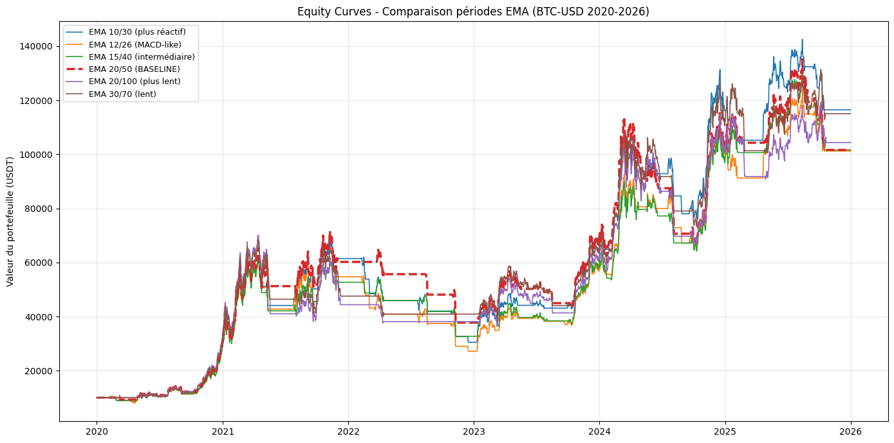
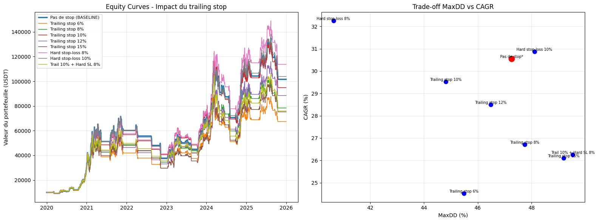
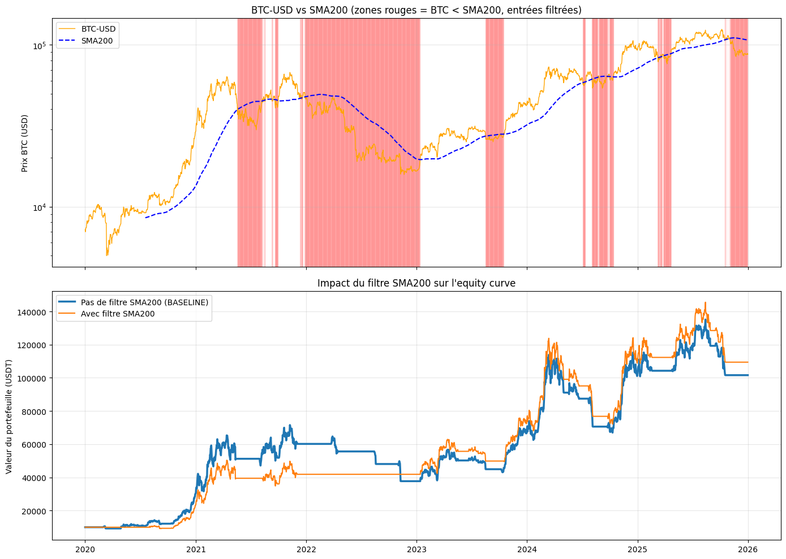
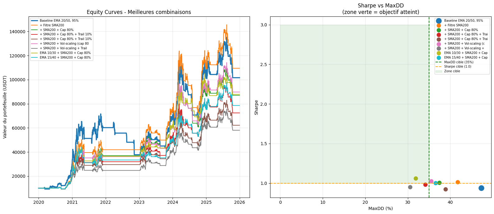
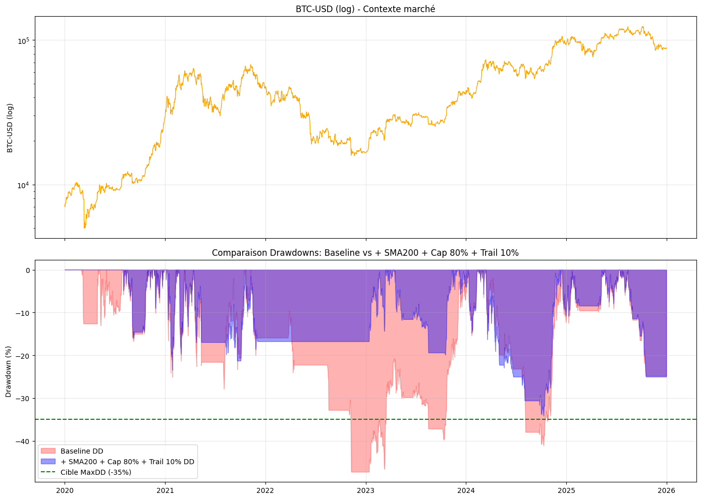

# EMA-Cross-Crypto

**Classe d'actifs :** Crypto (BTC, ETH)
**ID projet Cloud :** Aucun (local uniquement)

## Description

Croisement dual EMA sur crypto. Prend position long quand EMA(20) > EMA(60) sur BTC/ETH.

## Figures du notebook de recherche

Le notebook [`research.ipynb`](research.ipynb) analyse le comportement du croisement EMA sur BTC : cours et moyennes mobiles, comparaison des configurations testées (CAGR, Sharpe, drawdown) et analyse des drawdowns par période. Provenance détaillée : [`MANIFEST.md`](assets/readme/MANIFEST.md).

<table>
<tr>
<td align="center"> BTC — cours &amp; moyennes mobiles (EMA 20/60)</td>
<td align="center"> CAGR — comparaison des configurations</td>
</tr>
<tr>
<td align="center"> Métriques — Sharpe / CAGR / drawdown</td>
<td align="center"> Sharpe — comparaison des configurations</td>
</tr>
<tr>
<td align="center"> Drawdowns — analyse par période (§9)</td>
<td align="center"></td>
</tr>
</table>

## Comment exécuter

**Lean CLI :** `lean backtest "MyIA.AI.Notebooks/QuantConnect/projects/EMA-Cross-Crypto"`
**QC Cloud :** Pas encore déployée. Copier les fichiers dans un nouveau projet QC Cloud pour l'exécuter.

## Métriques de backtest

| Métrique | Valeur |
|----------|--------|
| Méthode | Croisement EMA 20/60 |
| Univers | BTC, ETH |
| Rebalance | Quotidien |

## Fichiers

- main.py - Stratégie
