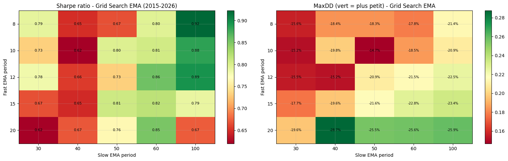
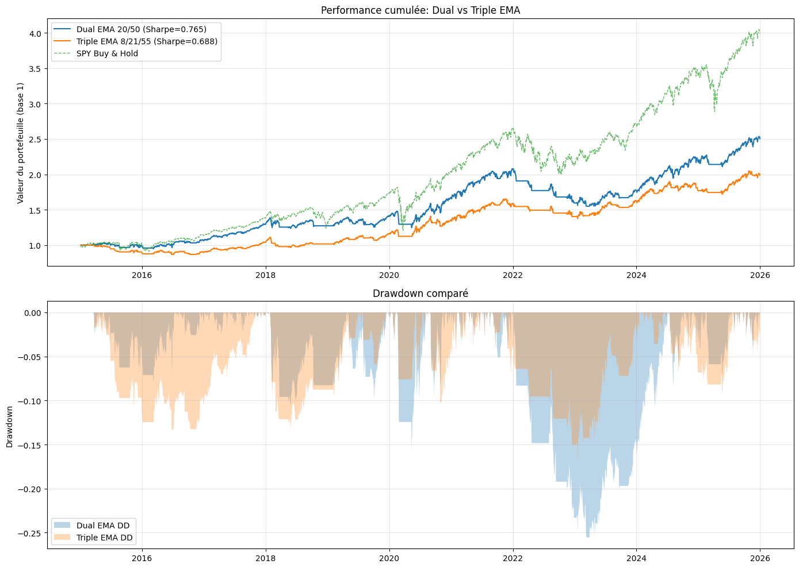
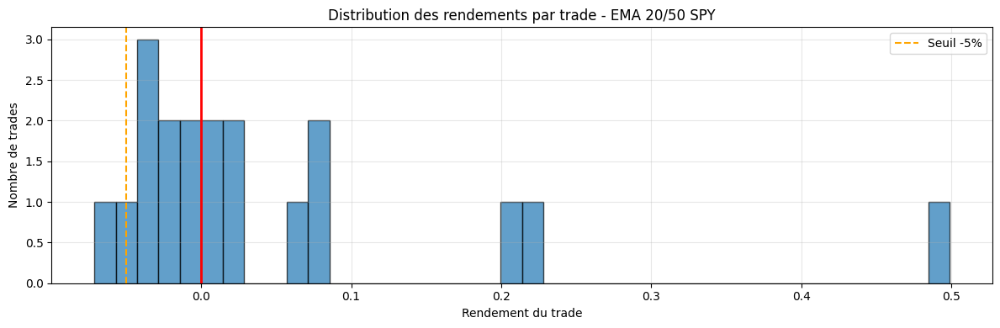
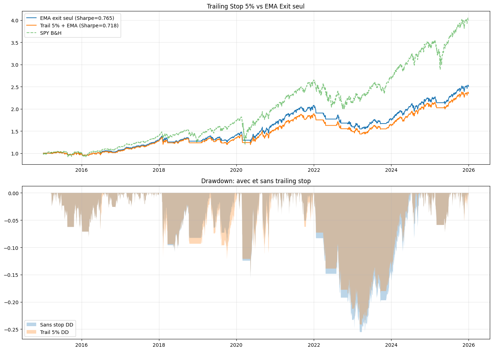
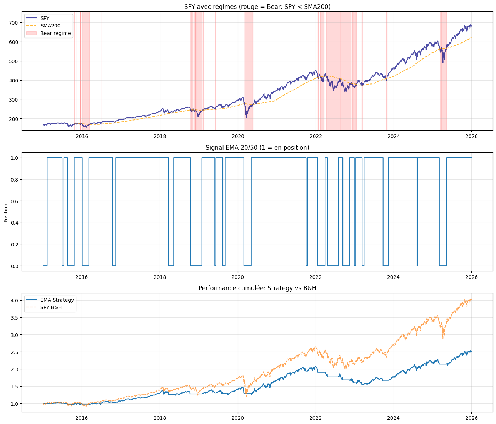
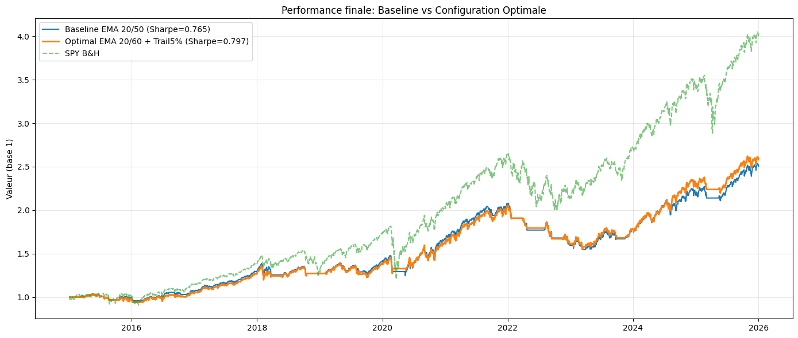

# EMA-Cross-Index

**Asset class:** US Equities (S&P 500 ETF)
**Cloud project ID:** None (local only)

## Description

Dual EMA crossover on SPY (S&P 500 index ETF). Long when EMA(20) > EMA(60), flat otherwise.
Includes a 3-day cooldown after exit to prevent immediate re-entry on false signals.

EMA 20/60 selected over 20/50 based on robustness testing (IS/OOS ratio = 1.55).
Slow=60 captures quarterly trends and reduces whipsaws compared to the standard 50-period.

## Figures du notebook de recherche

Le notebook [`research.ipynb`](research.ipynb) documente la sélection des périodes EMA et la validation de robustesse : grille de Sharpe par périodes (fast/slow), backtest de référence, hypothèses H4 (cooldown post-faux-signal) et H5 (trailing stop vs sortie EMA), classification des régimes de marché et filtre SPY SMA200. Provenance détaillée : [`MANIFEST.md`](assets/readme/MANIFEST.md).

<table>
<tr>
<td align="center"><br/><sub>Grille — heatmap du Sharpe ratio par périodes EMA (fast vs slow)</sub></td>
<td align="center"><br/><sub>Backtest — rendement cumulatif &amp; drawdown</sub></td>
</tr>
<tr>
<td align="center"><br/><sub>H4 — cooldown après faux signal</sub></td>
<td align="center"><br/><sub>H5 — trailing stop vs sortie EMA</sub></td>
</tr>
<tr>
<td align="center"><br/><sub>Régimes — tendanciel vs retour à la moyenne</sub></td>
<td align="center"><br/><sub>Filtre SMA200 — Sharpe &amp; CAGR avec/sans</sub></td>
</tr>
</table>

## How to Run

**Lean CLI:** `lean backtest "MyIA.AI.Notebooks/QuantConnect/projects/EMA-Cross-Index"`
```bash
lean backtest --project .
```

**QC Cloud:** Not yet deployed. Copy files to a new QC Cloud project to run.

## Backtest Metrics (2015-2026)

| Metric | Value |
|--------|-------|
| OOS Sharpe (2010-2015) | 1.325 |
| IS/OOS Robustness | 1.55 |
| Beta | ~0.42 |
| Cooldown | 3 days post-exit |

## Files

- `main.py` - Strategy (v2.0, EMA 20/60 with cooldown)
- `research.ipynb` - EMA period grid search and robustness validation

## References

- Brock et al. (1992), "Simple Technical Trading Rules and the Stochastic Properties of Stock Returns"
- research.ipynb: H1-H5 hypothesis testing on EMA parameters
