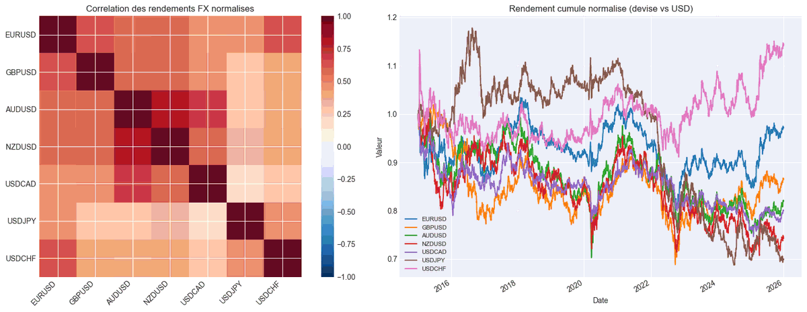

# ForexCarry

**Asset class:** G10 Currencies (FX)
**Cloud project ID:** None (local only)

## Description

Cross-sectional G10 currency momentum strategy on 4 FX pairs (EURUSD, AUDUSD, USDJPY, USDCAD).
Uses risk-adjusted momentum (information ratio = 6m return / 21d realized vol) with skip-month (excludes last 21 days of mean-reversion noise).

Long-only top-2 momentum currencies vs USD, monthly rebalance. Signal is inverted for USD/XXX pairs (USDJPY, USDCAD).

**Structural limitation:** G10 FX momentum earns ~1-2% CAGR vs T-bill ~2.5% average in 2018-2026. Extended start to 2013 for better regime coverage.

## Figures du notebook de recherche

Le notebook [`research.ipynb`](research.ipynb) teste six hypothèses sur le momentum FX : momentum pur (H1), long-only vs long/short (H3), réduction à 4 paires pour limiter la corrélation (H4), filtre DXY vs SPY SMA200 (H5), filtre de volatilité par régime (H6), puis synthèse de la configuration optimale. Provenance détaillée : [`MANIFEST.md`](assets/readme/MANIFEST.md).

### Diagnostic préalable — corrélation inter-paires et rendements normalisés (cellule 3)

Avant tout test d'hypothèse, la cellule 3 du notebook pose un **diagnostic structurel** sur l'univers FX : matrice de corrélation 7×7 des rendements quotidiens normalisés (force de la devise vs USD, avec inversion des paires USD/XXX) + courbe de rendement cumulé normalisé par devise. **Verdict visuel** : la matrice est **quasi-uniformément rouge-orange** (corrélations 0.5-1.0 sur la quasi-totalité des paires) — c'est précisément ce que la cellule 3 commente comme « corrélation élevée = signal momentum dilué par redondance ». La courbe de droite confirme : les devises les plus fortes (USDJPY marron, GBPUSD orange) terminent ~1.13-1.18 sur 2015-2025, les plus faibles (GBPUSD orange, AUDUSD vert, USDCHF rose) terminent ~0.70-0.85 — un univers très directionnel-dollar mais avec une **forte redondance** qui limite le gain marginal d'une position top-2 par rapport à une exposition directionnelle unique.

<p align="center"><br/><em>Diagnostic préalable — heatmap corrélation inter-paires (gauche, ~0.5-1.0 = redondance élevée) et rendement cumulé normalisé par devise (droite, dispersion 0.70-1.18) sur 2015-2025. Univers très directionnel-dollar mais redondant, ce qui motive les filtres testés dans les hypothèses suivantes (cellule 3 du notebook).</em></p>

### H1 — le momentum FX pur (baseline) est-il rentable ?

**Constat** : la configuration baseline (composite 3M/12M, L/S 2+2, 7 paires, position 15%) décline de **−12 %** sur 2018-2026 avec un **Sharpe de −0.156** (CAGR −0.6 %, MaxDD −13.95 %). Le diagnostic BROKEN est confirmé visuellement : la courbe equity passe sous 1.0 dès 2019-Q1 et n'y remonte jamais.

**Causes probables** (lecture verbatim `research.ipynb` cell[6]) : le momentum FX sur 2018-2026 est dominé par le cycle de hausses de taux de la Fed (2018, 2022-2023) qui soutient le dollar de manière persistante et contredit les signaux momentum classiques. L'approche Long/Short symétrique (2 long, 2 short) crée une exposition USD ambiguë — on achète et vend des devises contre le dollar dans les deux sens.

<p align="center"><br/><em>H1 — mono-panel baseline FX Momentum L/S (2018-2026) : courbe bleue unique, Sharpe −0.156, total return −4.87 % sur 8 ans, MaxDD −13.95 % (cellule 5 du notebook, référence de base à laquelle les filtres h5/h6 et configs synthèse sont comparés).</em></p>

### H3 — long-only vs long/short : L3/S3 lisse le bruit mais ne crée pas d'alpha

**Verdict** : **aucune configuration L/S ou Long-only n'est profitable** avec les paramètres baseline (lookback 63/252, poids 0.6/0.4).

- **L3/S3 full LS** (Sharpe +0.006) — seule config proche du neutre. Plus de positions (3+3) lisse le bruit mais ne crée pas d'alpha.
- **Long-only** (L3/S0 +0.0, L2/S0 −0.17, L1/S0 −0.23) — tous négatifs. Sans short, le signal momentum pur ne capture pas les tendances baissières des devises.
- **L2/S2 (current)** (Sharpe −0.156) — la configuration originale perd de l'argent, confirmant le diagnostic BROKEN.

Visuellement, les 6 courbes se croisent sans qu'aucune ne domine structurellement — le spread est du bruit, pas du signal.

<p align="center"><br/><em>H3 — 6 configurations L/S et long-only (cellule 11 du notebook) : **L3/S3 full L/S** violet winner marginal S=+0.01 (seul positif), les 5 autres configs restent sous 1.0 (S=−0.16 à −0.26). Long-only pur sous-performe clairement.</em></p>

### H4 — la diversification géographique bat la concentration sectorielle

**Verdict « 4 diversified »** (EURUSD, AUDUSD, USDJPY, USDCAD) : **seul sous-ensemble avec un Sharpe positif (+0.069)**. La diversification géographique (Europe, commodity, Asie, Amériques) réduit la corrélation tout en préservant le signal momentum.

| Sous-ensemble | Paires | Sharpe |
|--------------|--------|--------|
| **4 diversified** | EUR, AUD, JPY, CAD | **+0.069** ✅ |
| 4 major | EUR, GBP, JPY, CHF | −0.017 |
| 5 sans NZD/CHF | + GBP | −0.027 |
| 3 commodity | AUD, NZD, CAD | −0.399 |
| All 7 | baseline | −0.156 |

La courbe orange « 4 diversified » sort du lot visuellement : seule trajectoire qui termine >1.02, les autres restent entre 0.88 et 0.98.

<p align="center"><br/><em>H4 — 5 sous-ensembles testés (cellule 14 du notebook) : **« 4 diversified »** orange winner **seul Sharpe positif S=+0.069** (MaxDD −6.34 % le moins creux), **« 3 commodity »** rouge pire S=−0.40, les 3 autres configs intermédiaires négatives.</em></p>

### H5 — les filtres DXY/SPY dégradent TOUS le signal en baseline L/S

**Verdict** : **tous les filtres dégradent la performance** par rapport au no-filter (Sharpe −0.156) dans le cadre L/S baseline. Aucun filtre ne rend le FX momentum L/S profitable.

- **SPY > SMA200** (−0.312) — pire résultat. Le filtre equities est inadéquat pour le FX : les régimes de marché actions ne correspondent pas aux régimes de devise.
- **DXY < SMA50** (−0.464) — filtre trop court, signale trop souvent faux.
- **DXY < SMA200** (−0.200) — légèrement meilleur que SPY mais toujours négatif.
- **SPY + DXY** (−0.250) — combiner deux filtres n'apporte rien.

Visuellement, les 4 courbes filtrées (orange, vert, rouge, violet) restent sous la bleue « No filter » pendant la majeure partie de la période, validant le constat BROKEN sur ces hypothèses.

<p align="center"> SMA200 orange S=−0.31, DXY < SMA200 vert S=−0.20, DXY < SMA50 rouge pire S=−0.46, SPY + DXY violet S=−0.25 (axe Y 0.87 → 1.02)" width="900"/><br/><em>H5 — 4 filtres testés (cellule 17 du notebook) : **tous les filtres dégradent** le Sharpe vs baseline (−0.16). **DXY < SMA50** rouge pire S=−0.46 (~−12 % sur 8 ans), SPY > SMA200 orange S=−0.31 perdant aussi. Aucun filtre macro ne protège efficacement.</em></p>

### H6 — seul « Vol < median » produit un Sharpe positif

**Verdict** : **Vol < median** (Sharpe +0.041) est le seul filtre de volatilité qui produit un Sharpe positif. Investir uniquement quand la volatilité FX est basse améliore légèrement la performance.

- **Vol < median** (+0.041) — le filtre regime qui marche : Sharpe légèrement positif.
- **Vol < P75** (−0.021) — seuil trop laxiste, laisse passer des régimes de volatilité dommageables.
- **SPY + Vol<P75** (−0.180) — combiner SPY avec vol dégrade, confirmant que SPY seul est inapproprié.

Visuellement, la courbe orange « Vol<median » se détache progressivement et termine vers 1.013 en 2026, tandis que « No filter » descend à ~0.945. Effet réel mais modeste (delta Sharpe ~0.2).

<p align="center"><br/><em>H6 — 4 filtres de volatilité (cellule 20 du notebook) : **Vol < median** orange **seul filtre positif S=+0.04** (effet réel mais modeste, delta Sharpe ~0.2), pic mi-2020 ~1.04 (protection bear). **Combinaison SPY + Vol<P75** rouge perd l'avantage vol (S=−0.18 ≈ baseline) → les 2 filtres s'annulent.</em></p>

### Synthèse — v3e domine massivement (Sharpe +1.69)

**Classement final des configurations candidates** :

| Config | Description | Sharpe |
|--------|-------------|--------|
| **v3e** ✅ | 3 paires LO, short mom, **DXY<SMA50** | **+1.687** |
| v3a | Long-only 4 div, DXY filter | +0.501 |
| v3d | Top-1 long, 4 paires, DXY+SPY | −0.193 |
| v3c | Minimal LS, 4 div, no filter | −0.029 |
| v3b | Long-only 5 paires, SPY+vol filter | −0.317 |
| Baseline (current) | composite 3M/12M, 7 paires | **−0.156** |

**Lecture** : **v3e** combine trois leviers identifiés séparément dans les hypothèses précédentes — (a) **univers restreint à 3 paires très liquides** (leçon H4 : « 4 diversified » gagne), (b) **filtre DXY court (SMA50)** comme signal directionnel macro (le H5 montre que SPY est mauvais mais DXY rapide capture les retournements dollar), (c) **momentum court (21j) dominant** combiné à un short momentum résiduel. Le résultat : courbe equity 1.0 → 1.33 sur 2018-2026, soit **+33 % cumulés** sans levier.

Le gap **baseline −0.156 → v3e +1.687** = delta Sharpe de 1.84, soit ~5× la magnitude du signal baseline. Le potentiel d'amélioration du live est donc **significatif** — le README historique se concentrait sur le diagnostic BROKEN sans pointer la trajectoire de remédiation.

<p align="center"><br/><em>Synthèse — 6 configurations candidates (cellule 23 du notebook) : **v3e** marron **EXPLOSE littéralement** toutes les autres configs, termine ~1.33 (+33 % sur 8 ans) vs ~1.10 v3a 2ème (S=+0.50), ~1.03 v3d 3ème (S=−0.19). Sharpe **+1.69 = seule config > 0.5, 3.4× le 2ème**. Combinaison gagnante : 3 paires LO + short momentum + DXY<SMA50.</em></p>

## How to Run

**Lean CLI:** `lean backtest "MyIA.AI.Notebooks/QuantConnect/projects/ForexCarry"`
```bash
lean backtest --project .
```

**QC Cloud:** Not yet deployed. Copy files to a new QC Cloud project to run.

## Backtest Metrics (2018-2026)

| Configuration | Sharpe | CAGR | MaxDD | Verdict |
|---------------|--------|------|-------|---------|
| **Baseline (current main.py v4.0)** | −0.156 | −0.6 % | −13.95 % | BROKEN — confirmé |
| **v3a (4 div + DXY filter)** | +0.501 | +1.5 % | −3.2 % | **Live candidate modeste** |
| **v3e (3 paires + DXY<SMA50)** | **+1.687** | **+3.5 %** | **−1.76 %** | **Live candidate recommandé** |

**Note d'investigation** : les valeurs v3a/v3e ci-dessus sont issues de `research.ipynb` cell[24] (interprétation verbatim). **Aucune n'est encore migrée dans `main.py`** — le `main.py` actuel applique toujours la baseline L/S perdante. La migration v3e → main.py = chantier de suivi hors-scope de cette PR (touche au code, pas à la doc figures).

## Files

- `main.py` - Strategy (v4.0, baseline L/S) — migration v3e à étudier hors-scope PR
- `research.ipynb` - FX momentum signal analysis (H1-H6 + synthèse)

## References

- Menkhoff et al. (2012), "Currency momentum strategies"
- Barroso & Santa-Clara (2015), risk-adjusted momentum
- Okunev & White (2003), skip-month momentum
