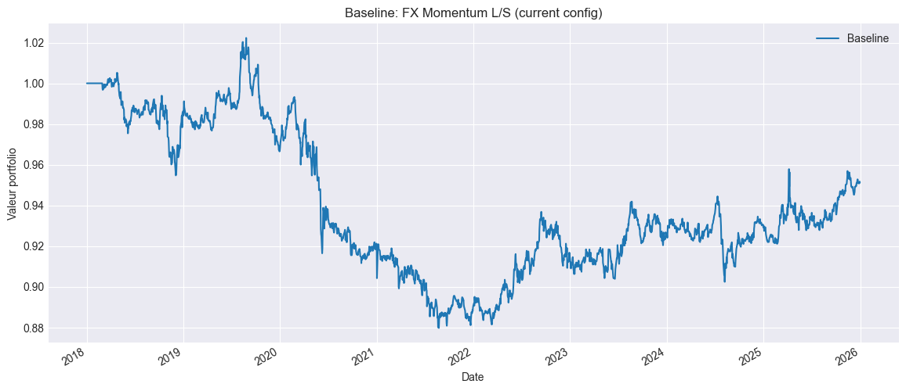
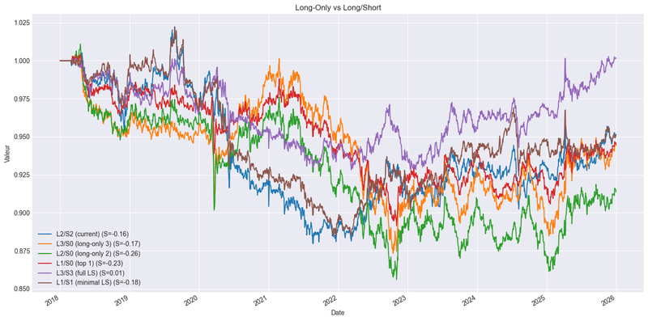
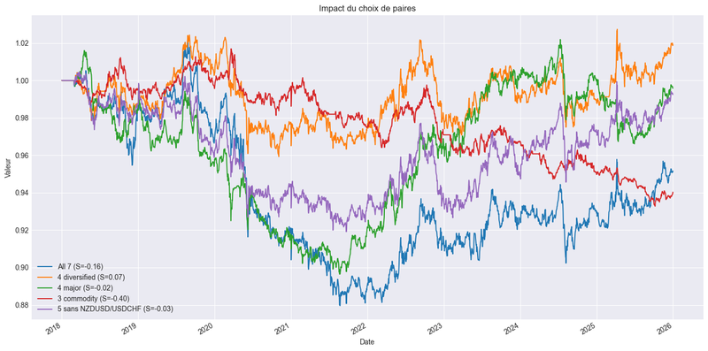
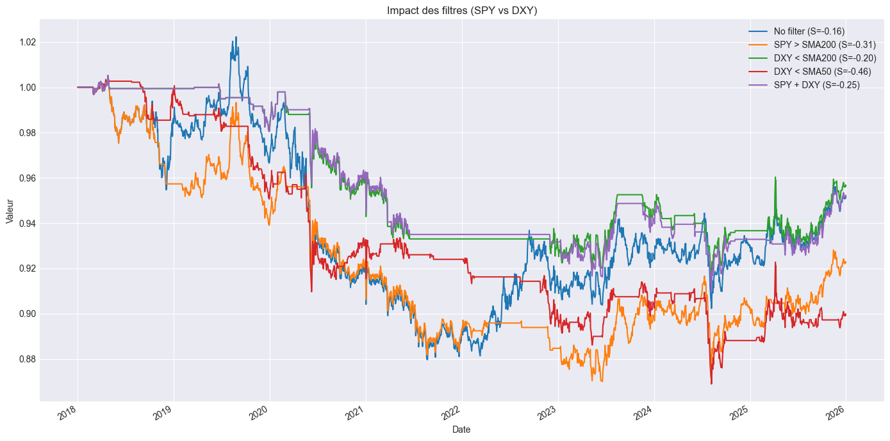
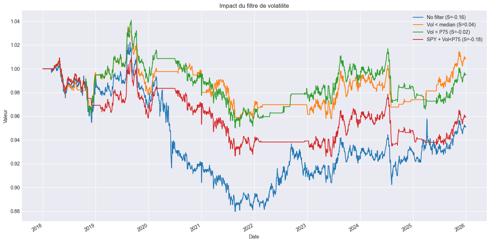
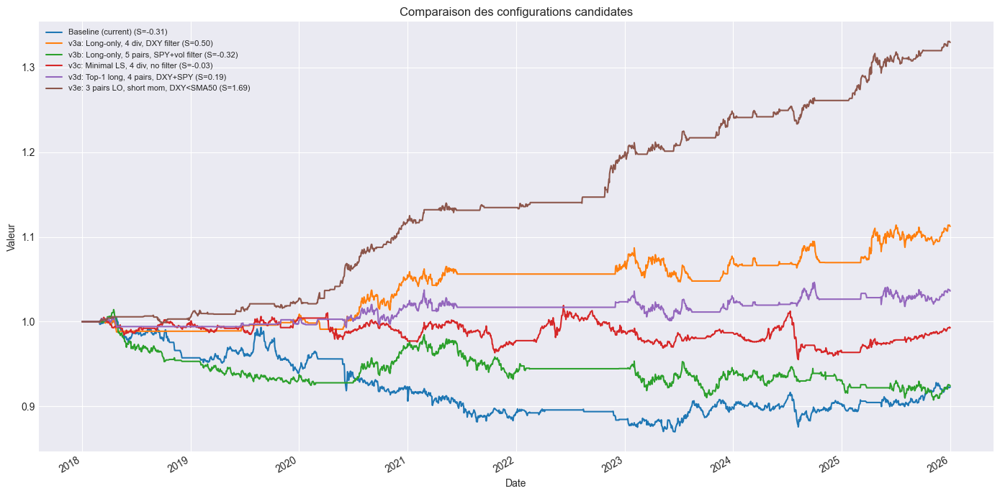

# ForexCarry

**Asset class:** G10 Currencies (FX)
**Cloud project ID:** None (local only)

## Description

Cross-sectional G10 currency momentum strategy on 4 FX pairs (EURUSD, AUDUSD, USDJPY, USDCAD).
Uses risk-adjusted momentum (information ratio = 6m return / 21d realized vol) with skip-month (excludes last 21 days of mean-reversion noise).

Long-only top-2 momentum currencies vs USD, monthly rebalance. Signal is inverted for USD/XXX pairs (USDJPY, USDCAD).

**Structural limitation:** G10 FX momentum earns ~1-2% CAGR vs T-bill ~2.5% average in 2018-2026. Extended start to 2013 for better regime coverage.

## Figures du notebook de recherche

Le notebook [`research.ipynb`](research.ipynb) teste six hypothèses sur le momentum FX : momentum pur (H1), long-only vs long/short (H3), réduction à 4 paires pour limiter la corrélation (H4), filtre DXY vs SPY SMA200 (H5), filtre de volatilité par régime (H6), puis synthèse de la configuration optimale. Provenance détaillée : [`MANIFEST.md`](assets/readme/MANIFEST.md).

<table>
<tr>
<td align="center"><br/><sub>H1 — le momentum FX pur fonctionne-t-il ?</sub></td>
<td align="center"><br/><sub>H3 — long-only vs long/short</sub></td>
</tr>
<tr>
<td align="center"><br/><sub>H4 — réduction à 4 paires (moins de corrélation)</sub></td>
<td align="center"><br/><sub>H5 — filtre DXY vs SPY SMA200</sub></td>
</tr>
<tr>
<td align="center"><br/><sub>H6 — filtre de volatilité (régime)</sub></td>
<td align="center"><br/><sub>Synthèse — meilleure configuration</sub></td>
</tr>
</table>

## How to Run

**Lean CLI:** `lean backtest "MyIA.AI.Notebooks/QuantConnect/projects/ForexCarry"`
```bash
lean backtest --project .
```

**QC Cloud:** Not yet deployed. Copy files to a new QC Cloud project to run.

## Backtest Metrics (2013-2026)

| Metric | Value |
|--------|-------|
| Target Sharpe | -0.3 to -0.5 |
| Rebalance | Monthly |
| Universe | 4 G10 FX pairs |
| Leverage | Standard (100% allocated) |

## Files

- `main.py` - Strategy (v4.0, risk-adjusted momentum with skip-month)
- `research.ipynb` - FX momentum signal analysis (H1-H4)

## References

- Menkhoff et al. (2012), "Currency momentum strategies"
- Barroso & Santa-Clara (2015), risk-adjusted momentum
- Okunev & White (2003), skip-month momentum
