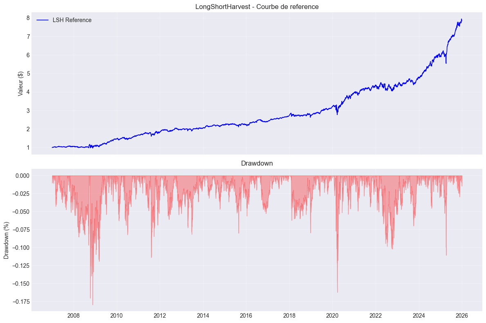
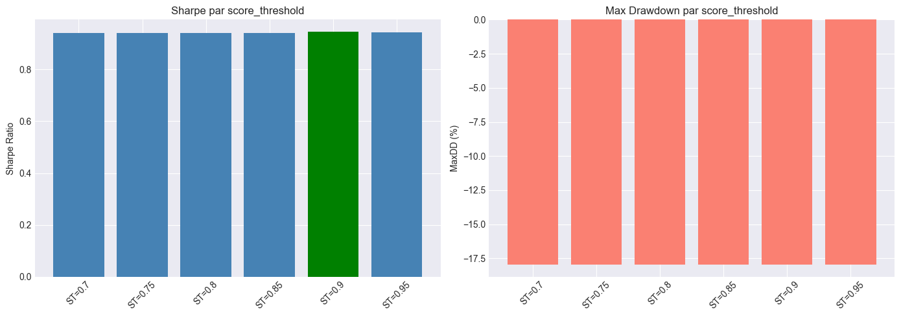
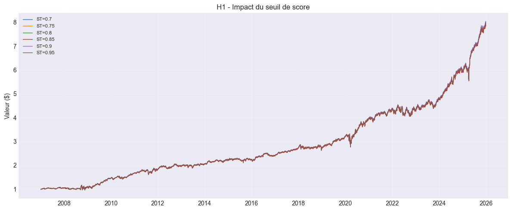
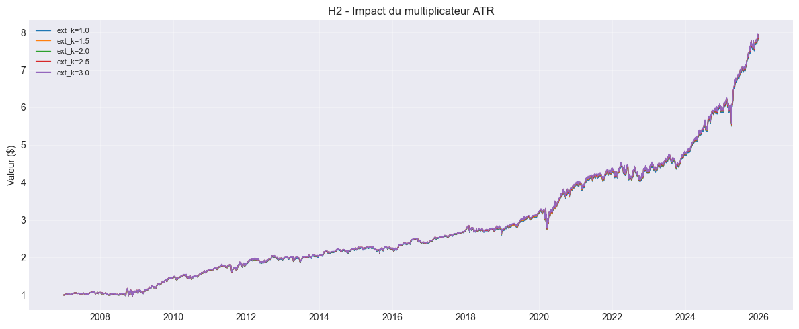
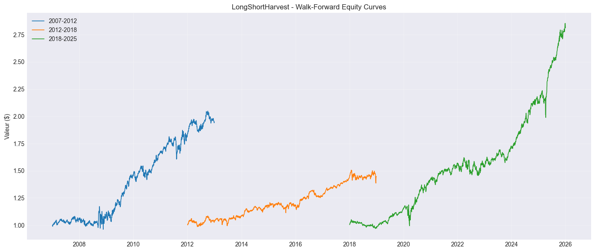
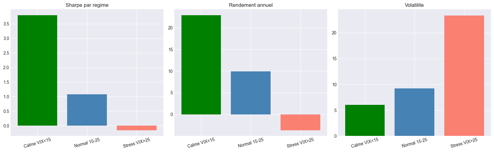

# LongShortHarvest-QC

**Asset class:** US Equities (long/short)
**Cloud project ID:** None (local only)

## Description

QC Strategy Library clone. Long/short equity strategy harvesting alpha from both directions via pairs-style mean reversion.

## Figures du notebook de recherche

Le notebook [`research.ipynb`](research.ipynb) documente l'analyse complète : backtest de référence sur SPY/GLD/VIX, sensibilité aux hyperparamètres (sweep `score_threshold` H1, `ext_k` H2), validation walk-forward et performance par régime de marché. Provenance détaillée : [`MANIFEST.md`](assets/readme/MANIFEST.md).

<table>
<tr>
<td align="center"> Backtest de référence — cours SPY/GLD/VIX &amp; courbe de capital</td>
<td align="center"> Sweep H1 — sensibilité au seuil de score</td>
</tr>
<tr>
<td align="center"> H1 — courbes de capital par seuil</td>
<td align="center"> H2 — courbes de capital par <code>ext_k</code></td>
</tr>
<tr>
<td align="center"> Validation walk-forward — rendements par fenêtre</td>
<td align="center"> Performance par régime de marché</td>
</tr>
</table>

## How to Run

**Lean CLI:** `lean backtest "MyIA.AI.Notebooks/QuantConnect/projects/LongShortHarvest-QC"`
**QC Cloud:** Not yet deployed. Copy files to a new QC Cloud project to run.

## Backtest Metrics

| Metric | Value |
|--------|-------|
| Sharpe Ratio | 3.39 |
| CAGR | 57.94% |
| Max Drawdown | 15.20% |
| Source | QC Strategy Library clone |
| Note | Metrics from original library, not locally reproduced |

## Files

- main.py - Strategy (QC Library clone)

## References

- QuantConnect Strategy Library
