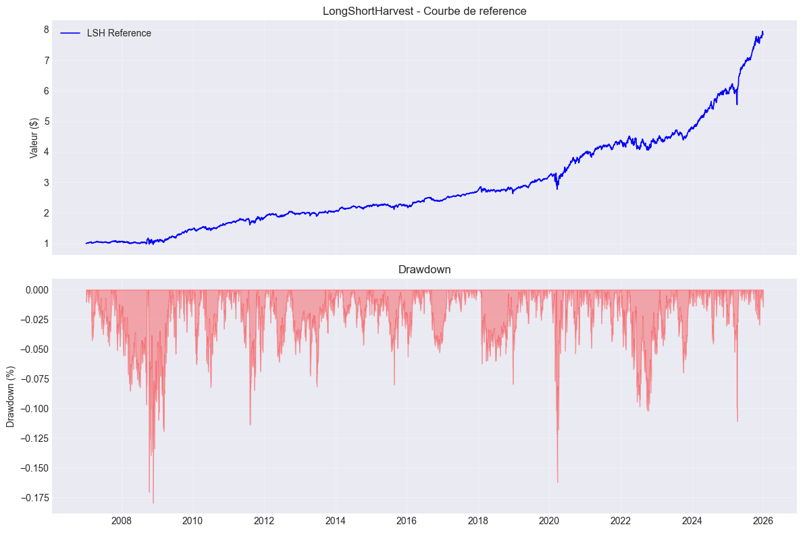
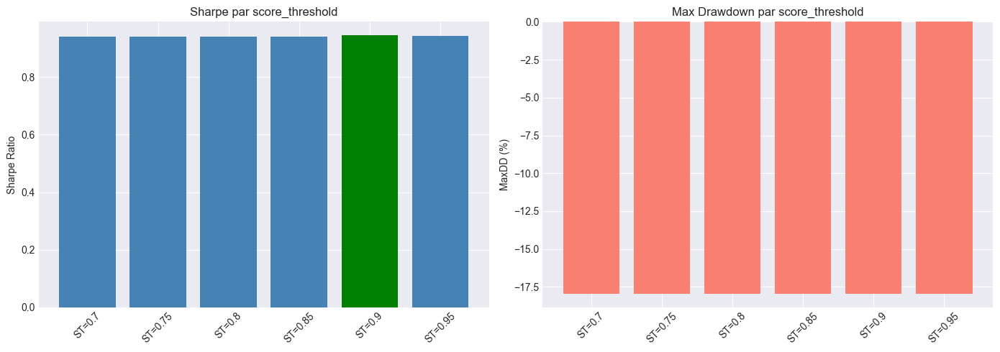
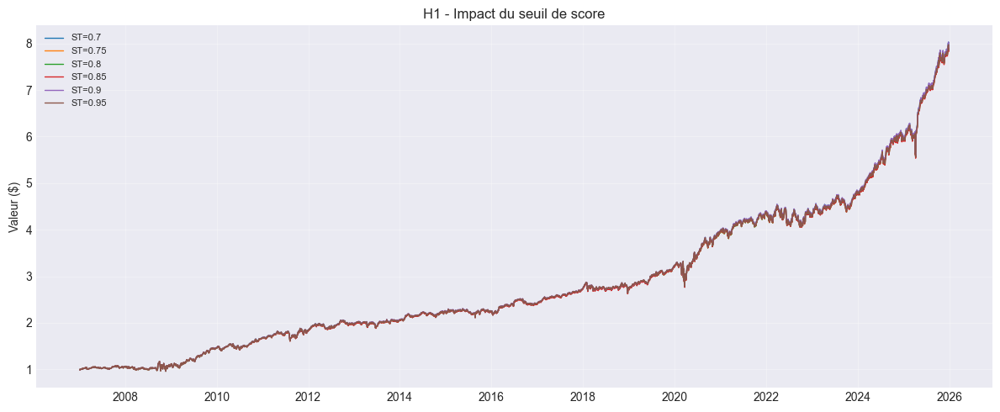
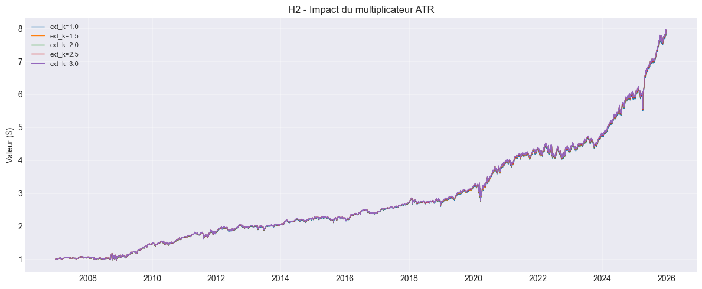
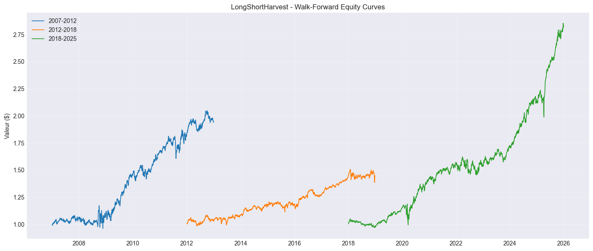
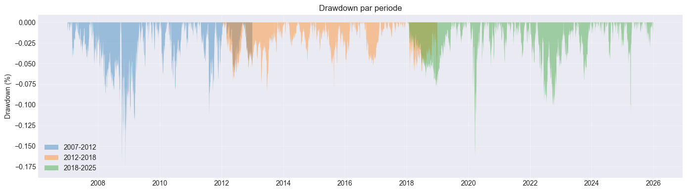
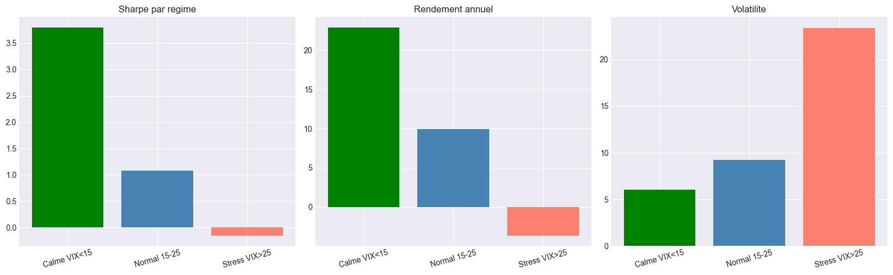

# LongShortHarvest-QC

**Asset class:** US Equities (long/short)
**Cloud project ID:** 37423502 (mesures #19450 et #19837)

## Description

Clone de la stratégie « Long Short Harvest » de la Strategy Library QuantConnect. Jambe longue sur les plus grandes capitalisations américaines et l'or, pilotée par un régime VIX/SPY ; jambe courte hebdomadaire sur un titre à forte dynamique. Le détail et la mesure du code sont dans la section suivante.

## Mesure du code de la stratégie (#19450) — verdict NO BEATS

**Ce que les chiffres précédents mesuraient.** Le tableau « Backtest Metrics » plus bas et toutes les figures de `research.ipynb` viennent du moteur simplifié `backtest_lsh()` de ce notebook (cellule 7). Ce moteur tourne sur trois séries yfinance (SPY, GLD, VIX). SPY y remplace les 4 titres de la jambe longue, et la jambe courte est simulée par une baisse d'exposition, sans vente à découvert. Il reprend le régime VIX/SPY, mais il ne mesure pas la règle de `main.py`. Les chiffres de la Strategy Library (Sharpe 3,39, CAGR 57,94 %) ne sont pas reproduits non plus. Avant #19450, le dépôt n'avait donc publié aucune mesure du code de la stratégie.

**Ce que fait `main.py`.**
- **Jambe longue** : chaque mois, les 4 plus grandes capitalisations parmi les actions de plus d'un milliard de dollars. Chaque jour, un régime VIX/SPY répartit jusqu'à 90 % du capital entre ces 4 titres et GLD. Une forêt aléatoire surpondère un des 4 titres, et un stop suiveur en trois paliers allège les positions.
- **Jambe courte** : chaque lundi, vente à découvert d'un titre parmi les 150 plus liquides, choisi par un score « de type Hurst » et des filtres d'extension et de dynamique, à 60 % du capital, avec un stop à 2 ATR.

Ce n'est pas une stratégie de paires. Par construction, la jambe longue détient les plus grandes capitalisations américaines (AAPL, MSFT, GOOG, AMZN, NVDA selon les années).

**Protocole** (règle inscrite sur #19450 avant le premier backtest) : backtests QC sur 2018-01-01 → 2026-09-25, frais du courtier (modèle par défaut de Lean). La candidate `base` (code tel quel) est comparée au SPY détenu et au 60/40 SPY/IEF de `FourSleeve774Benchmarks` (#19139). Le test porte sur la différence de Sharpe à taux sans risque nul, par bootstrap circulaire par blocs de 21 séances (10 000 tirages, graine 18921), avec correction de Holm. Deux contrôles descriptifs, hors verdict :
- `top4` : les 4 mêmes titres à poids égaux, à 100 %, sans GLD, sans stop, sans forêt aléatoire et sans jambe courte ;
- `noshort` : la règle avec `short_gross` = 0.

**Résultats** (séances de clôture du graphique `shadow`, 2194 séances ; Sharpe à taux sans risque nul) :

| Run | Sharpe | CAGR | Pire baisse | Rotation / an | Frais / an | Ordres |
|---|---|---|---|---|---|---|
| `base` (candidate) | 0,44 | 9,7 % | −61,6 % | 47,3 | 0,76 % | 5737 |
| SPY détenu | 0,79 | 13,9 % | −33,6 % | 0,1 | 0,00 % | — |
| 60/40 SPY/IEF | 0,81 | 8,9 % | −21,2 % | 0,3 | 0,02 % | — |
| `top4` (contrôle) | 0,94 | 23,5 % | −36,1 % | 1,2 | 0,05 % | 372 |
| `noshort` (contrôle) | 0,95 | 16,2 % | −27,8 % | 37,4 | 0,64 % | 5258 |

Rotation : valeur échangée cumulée divisée par la valeur du portefeuille. Frais : rapportés au capital de départ. QC donne pour `base` un Sharpe de 0,29 (calculé avec un taux sans risque), un PSR de 0,4 % et une capacité estimée de 260 M$.

| Différence de Sharpe de `base` | Écart | IC 95 % | p Holm | 2018-2020 | 2021-2023 | 2024 → 2026-09 |
|---|---|---|---|---|---|---|
| contre SPY | −0,34 | [−0,99 ; 0,41] | 1,00 | +0,20 | −0,60 | −0,03 |
| contre 60/40 | −0,37 | [−1,02 ; 0,39] | 1,00 | −0,07 | −0,36 | −0,02 |

**Verdict : NO BEATS.** Les deux différences sont négatives et aucune n'est significative. La règle exclut alors les runs à frais doublés et la grille de paramètres (protocole, point 5) : ils ne pouvaient plus changer le verdict. Corrélation hebdomadaire avec SPY : 0,44.

**Contrôles (descriptifs, hors verdict).**

| Différence de Sharpe | Écart | IC 95 % | 2018-2020 | 2021-2023 | 2024 → 2026-09 |
|---|---|---|---|---|---|
| `base` − `top4` | −0,49 | [−1,06 ; 0,19] | −0,32 | −0,58 | +0,20 |
| `base` − `noshort` | −0,50 | [−1,05 ; 0,13] | −0,22 | −0,37 | −0,16 |

Détenir simplement les 4 plus grandes capitalisations à poids égaux (`top4`) donne un Sharpe de 0,94 sur la fenêtre. La mécanique de la stratégie ne l'améliore pas, et la jambe courte coûte du Sharpe sur les trois sous-périodes. Sans elle, `noshort` atteint un Sharpe de 0,95, avec une pire baisse de −27,8 % contre −36,1 % pour `top4`, au prix d'un CAGR plus faible. Ce chiffre est observé après coup, sur la fenêtre même de la mesure : ce n'est pas un verdict. Tester `noshort` demanderait une règle inscrite avant le run et, de préférence, une fenêtre que cette mesure n'a pas utilisée.

**D'où vient la pire baisse.** Le portefeuille perd 61,6 % entre le 13 et le 27 janvier 2021, et ne retrouve son sommet que le 24 septembre 2025. La baisse vient de la jambe courte, prise dans les rachats forcés de janvier 2021 :
- DDD : vendu à découvert le 11 janvier pour environ 60 % du capital, perte de 33 k$ ;
- GME : vendu le 25 janvier, position limitée à 15 k$ par la marge disponible, perte latente de 52 k$ au plus fort, 28 k$ réalisés.

Sur toute la fenêtre, les positions fermées rapportent 195 k$ côté long. Côté court, elles perdent 65 k$ en 95 positions, dont 45 gagnantes. Les 5 pires positions courtes (DDD, GME, INTC, RKLB, WDC) coûtent 108 k$ ; les 90 autres rapportent 43 k$. Côté long, les plus gros contributeurs sont AAPL, GLD, GOOG, MSFT et NVDA.

**Défaut mesuré : le stop de la jambe courte ne protège pas la semaine d'entrée.** L'univers est en données journalières, si bien que l'ordre de vente passé le lundi, 30 minutes après l'ouverture, n'est exécuté qu'à la clôture. `RiskCheck_Short`, qui tourne 160 minutes après l'ouverture, trouve donc la position encore vide et efface son suivi (`self._entry.pop`). La position reste alors sans stop jusqu'à la rotation du lundi suivant. Aucune des 95 positions courtes n'est sortie par le stop : toutes sortent un lundi de rotation, sauf 9 reliquats vendeurs de quelques dizaines de dollars sur des titres de la jambe longue et une radiation (IMGN). Ce défaut n'explique pas à lui seul la perte sur GME : avec des données journalières, un stop qui fonctionne aurait vendu à la clôture du 27 janvier, au plus haut. Le code mesuré est celui d'origine ; une correction se mesurera sous sa propre règle, inscrite avant le run.

Les traces des runs (graphiques, statistiques, empreinte du code envoyé à QC) sont conservées hors dépôt, sous `QC-traces/19450-longshortharvest/`.

## Date du VIX (#19837) — mesure du 2026-10-09, verdict NO BEATS

**Le défaut.** `main.py` lit le VIX dans le fichier quotidien du CBOE. La ligne du jour D est publiée après la clôture, mais elle était datée `Time = D`, sans heure de fin : Lean la livrait donc à D 00:00. Le contrôle quotidien de la jambe longue, 30 minutes après l'ouverture, lisait ainsi la clôture du VIX du jour même. L'entraînement mensuel de la forêt aléatoire était touché de la même façon : `GetFeatures` aligne les historiques VIX et SPY par position, si bien que chaque ligne d'entraînement voyait le VIX un jour en avance.

**La correction.** Le mode `lag`, désormais par défaut, date la ligne du jour D à D + 1 et conserve le jour de bourse dans une colonne `tradeday`. Le mode `base` garde la lecture d'origine, pour la mesure. Quel que soit le verdict, le défaut passe à `lag` : c'est une correction de date, pas une promotion de performance. Deux compteurs sont publiés en fin de run, dans les statistiques d'exécution de QC :

| Run | Décisions | VIX du jour même | Entraînements | VIX en avance à l'entraînement |
|---|---|---|---|---|
| `base` (fin 2026-07-10) | 2141 | 2141 | 103 | 103 |
| `lag` (fin 2026-07-10) | 2141 | 0 | 103 | 2 |
| `lag` (fenêtre complète) | 2195 | 0 | 105 | 2 |

Les 2 entraînements restants en mode `lag` ne lisent pas le futur. Depuis 2022, le CBOE publie une ligne VIX pour certains jours fériés de la bourse américaine (33 dans la fenêtre). Les entraînements ont lieu à la première séance du mois. Deux fois seulement, cette première séance suit directement un tel jour férié : le 3 septembre 2024 et le 2 septembre 2025, lendemains du Labor Day. La ligne VIX de la veille est alors plus récente que la dernière séance SPY, mais elle était déjà publiée.

**Protocole** (règle inscrite sur #19837 avant le premier backtest) : celui de #19450, appliqué à `lag`. Fenêtre 2018-01-01 → 2026-09-25, frais du courtier, références SPY détenu et 60/40 SPY/IEF (mêmes séries), différence de Sharpe à taux sans risque nul, bootstrap circulaire par blocs de 21 séances (10 000 tirages, graine 18921), correction de Holm.

**Écart à la règle, déclaré avant toute lecture de résultat.** Les nœuds de backtest utilisés en premier arrêtent les runs 90 jours avant la date du jour, sans message d'erreur : `lag`, `base` et `noshort` s'y arrêtent le 2026-07-10. Le verdict porte donc sur un second run de `lag`, lancé sur la fenêtre complète dans le projet 37423502, avec le même code (empreinte `main.py` `09918b3f087c`). Les runs arrêtés au 2026-07-10 servent aux écarts descriptifs, calculés sur leurs 2140 séances communes.

**Résultats** (fenêtre complète, séances de clôture du graphique `shadow`, 2194 séances ; Sharpe à taux sans risque nul) :

| Run | Sharpe | CAGR | Pire baisse | Rotation / an | Frais / an | Ordres |
|---|---|---|---|---|---|---|
| `lag` (candidate) | 0,59 | 12,3 % | −58,1 % | 47,4 | 0,76 % | 5573 |
| SPY détenu | 0,79 | 13,9 % | −33,6 % | 0,1 | 0,00 % | — |
| 60/40 SPY/IEF | 0,81 | 8,9 % | −21,2 % | 0,3 | 0,02 % | — |

QC donne pour `lag` un Sharpe de 0,40 (calculé avec un taux sans risque), un PSR de 3,0 % et une capacité estimée de 360 M$. La pire baisse est atteinte dès le 29 janvier 2021, dans les rachats forcés décrits plus haut, puis égalée fin 2022 ; le sommet du 25 janvier 2021 n'est retrouvé que le 31 juillet 2025.

| Différence de Sharpe de `lag` | Écart | IC 95 % | p Holm | 2018-2020 | 2021-2023 | 2024 → 2026-09 |
|---|---|---|---|---|---|---|
| contre SPY | −0,20 | [−0,92 ; 0,63] | 1,00 | +0,44 | −0,70 | +0,33 |
| contre 60/40 | −0,23 | [−0,94 ; 0,60] | 1,00 | +0,18 | −0,46 | +0,33 |

**Verdict : NO BEATS.** Les deux différences sont négatives et aucune n'est significative. Comme en #19450, la règle exclut alors la grille de paramètres et le run à frais doublés. Deux sous-périodes sur trois sont positives, mais la période 2021-2023, celle de la pire baisse, l'emporte. Corrélation hebdomadaire avec SPY : 0,43.

Sur leurs 2140 séances communes, le run de la fenêtre complète et le run arrêté au 2026-07-10 donnent exactement la même série de rendements : les deux projets QC reproduisent le même calcul.

**Écarts descriptifs, hors verdict** (runs arrêtés au 2026-07-10, 2140 séances communes) :

| Run (fin 2026-07-10) | Sharpe | CAGR | Pire baisse | Rotation / an | Frais / an | Ordres |
|---|---|---|---|---|---|---|
| `lag` | 0,60 | 12,7 % | −58,1 % | 47,8 | 0,76 % | 5423 |
| `base` (code actuel) | 0,48 | 8,7 % | −58,1 % | 47,9 | 0,74 % | 5467 |
| `noshort` (`lag`, `short_gross` = 0) | 1,12 | 19,8 % | −33,8 % | 37,8 | 0,64 % | 5020 |

| Différence de Sharpe | Écart | IC 95 % | 2018-2020 | 2021-2023 | 2024 → 2026-07 |
|---|---|---|---|---|---|
| `base` − `lag` (effet de la date du VIX) | −0,12 | [−0,34 ; −0,0005] | −0,35 | +0,03 | −0,28 |
| `base` actuel − `base` de #19450 (effet de #19481) | +0,03 | [−0,19 ; 0,33] | −0,10 | −0,08 | +0,15 |
| `lag` − `top4` | −0,34 | [−1,00 ; 0,43] | −0,08 | −0,68 | +0,68 |
| `lag` − `noshort` | −0,52 | [−1,15 ; 0,19] | −0,25 | −0,39 | −0,05 |

La lecture du jour même ne gonflait pas le résultat : sur cette fenêtre, la corriger relève le Sharpe de 0,12. Un élément de contexte, sans valeur d'explication démontrée : en données journalières, l'ordre passé le matin n'est exécuté qu'à la clôture du jour même (voir la section #19450). La clôture du VIX lue en avance n'était donc connue qu'un quart d'heure après l'exécution, et l'avantage d'information restait mince. Le correctif du stop de la jambe courte (#19481) laisse le Sharpe presque inchangé, mais la pire baisse passe de −61,6 % à −58,1 %. Les contrôles disent la même chose qu'en #19450 : détenir les 4 titres (`top4`) ou supprimer la jambe courte (`noshort`) fait mieux que la règle. Ces écarts sont observés après coup, sur la fenêtre même de la mesure.

Les traces des runs (plans, empreintes, graphiques, statistiques, compteurs) sont conservées hors dépôt, sous `QC-traces/19837-lsh-vix-lag/`.

### Suivi en ombre

Le point 6 de #19450 demandait le gel de `base` à la date du verdict. `base` lisant le VIX du jour même, c'est la variante `lag`, défaut du code depuis #19837, qui est gelée à sa place, à la date de son verdict. Le commit gelé est celui de `main` qui porte ce `main.py` (empreinte revérifiée : `09918b3f087c…`, celle des runs du verdict). Elle est inscrite au [registre du suivi en ombre](../../ML-Training-Pipeline/shadow/registry.json) (#18923) sous l'identifiant `lsh-lag`, sans paramètre, gelée au 2026-10-09 ; premier passage à la première séance de novembre.

## Figures du notebook de recherche

Ces figures sortent du moteur simplifié `backtest_lsh()` (SPY à la place des 4 titres, pas de vente à découvert) : elles décrivent le régime VIX/SPY, pas le code de `main.py` (voir la section précédente). Le notebook [`research.ipynb`](research.ipynb) documente l'analyse complète : backtest de référence sur SPY/GLD/VIX, sensibilité aux hyperparamètres (sweep `score_threshold` H1, `ext_k` H2), validation walk-forward et performance par régime de marché. Provenance détaillée : [`MANIFEST.md`](assets/readme/MANIFEST.md).

**Référence — backtest long-terme 2007-2026, l'ancre du diagnostic.** La figure de référence pose le profil de la stratégie sur ~19 ans : un **dual-panel** empilé (equity + drawdown, axe temporel commun 2007-2026) issu de `backtest_lsh()` sur les sous-jacents SPY/GLD/VIX. La courbe d'equity monte de ~1.0 à ~8.0 USD (gain cumulé ~7×), avec accélération post-COVID de ~5 à ~8 entre 2020 et 2024-2025. Le drawdown en aire rouge marque **trois pics majeurs** : -18 % mi-2008 (Lehman), -16 % mi-2020 (COVID), -11 % en 2022 (bear bonds), recovery rapide entre chaque. Les **métriques extraites de `research.ipynb` cell[9]·out[0]** sont **Sharpe 0.939, CAGR 11.47 %, MaxDD -17.96 %, WinRate 55.3 %** (note : le tableau « Backtest Metrics » ci-dessous conserve la valeur 3.39 / 57.94 % du QC Strategy Library d'origine — chiffre **non reproduit localement**, à ne pas confondre avec la perf `research.ipynb`).

   
  <em>Référence — equity + drawdown LongShortHarvest 2007-2026 (cell[9]·out[1] du notebook de recherche).</em>

**H1 — sweep `score_threshold`, verdict nul.** La première hypothèse teste la sensibilité au seuil de score d'entrée (filtre de qualité du signal) sur 6 valeurs `ST ∈ {0.7, 0.75, 0.8, 0.85, 0.9, 0.95}`. Le **dual-panel barres** juxtapose Sharpe et MaxDD par seuil : les 6 barres Sharpe sont **quasi-identiques à ~0.94** (seule `ST=0.9` est colorée verte comme winner marginal à 0.944, cf cell[11]), et les 6 barres MaxDD sont **strictement identiques à -17.96 %**. **Verdict : sweep NUL** — le paramètre `score_threshold` est **inopérant** sur la métrique Sharpe/MaxDD, les différences sont < 1 % entre tous les seuils. Aucun gain de robustesse ni de drawdown à attendre d'un raffinement de ce seuil.

   
  <em>H1 — sweep score_threshold : Sharpe ≈0.94 et MaxDD ≈-18 % invariants sur 6 seuils (sweep nul, cell[11]·out[1]).</em>

**H1 (suite) — courbes de capital par seuil, sweep nul visuel.** Pour confirmer le verdict quantitatif, la cellule suivante superpose les **6 courbes d'equity** correspondantes sur 2007-2026 : ligne bleue `ST=0.7`, orange `ST=0.75`, verte `ST=0.8`, rouge `ST=0.85`, violette `ST=0.9`, marron `ST=0.95`. Les 6 courbes sont **superposées à 1 pixel près** sur tout l'horizon — le profil est strictement le même, ~1 → ~5 sur 2007-2020 puis ~5 → ~8 sur 2020-2025 (rallye post-COVID). **Confirmé visuellement** : raffiner `ST` ne produit aucune courbe distinctive. La légende haut-gauche permet de vérifier l'identité des 6 séries.

   
  <em>H1 (suite) — 6 courbes d'equity superposées à 1 pixel près : aucun seuil ne se distingue (cell[12]·out[0]).</em>

**H2 — sweep `ext_k` (multiplicateur ATR), verdict nul identique.** La deuxième hypothèse teste la sensibilité au multiplicateur d'ATR sur 5 valeurs `ext_k ∈ {1.0, 1.5, 2.0, 2.5, 3.0}`. Les **5 courbes d'equity** correspondantes sont tracées sur 2007-2026 (légende haut-gauche : bleu 1.0, orange 1.5, vert 2.0, rouge 2.5, violet 3.0). Profil **identique au sweep H1** : ~1 → ~5 sur 2007-2020 puis ~5 → ~8 sur 2020-2025, **5 courbes superposées à 1 pixel près**. Le sweep quantitatif Sharpe (`ext_k=3.0` → 0.941 winner marginal, cf cell[14]) confirme : **variations < 0.5 %** entre les 5 valeurs, le paramètre est **inopérant sur la perf long-terme**. Conclusion stratégique : le moteur est robuste au choix du multiplicateur ATR, pas besoin de tuner finement.

   
  <em>H2 — 5 courbes d'equity par multiplicateur ATR superposées à 1 pixel près (sweep nul, cell[15]·out[0]).</em>

**Validation walk-forward — la robustesse inter-régime.** Pour tester la stabilité hors-échantillon, l'analyse walk-forward découpe l'historique en **3 fenêtres disjointes** : 2007-2012, 2012-2018, 2018-2025. La cellule `research.ipynb` cell[25] produit **deux figures séparées** sur le même axe temporel 2007-2025 (deux `plt.subplots` indépendants, pas un `subplots(2, 1, sharex=True)`) : un **panel equity** (cell[25]·out[0]) et un **panel drawdown** (cell[25]·out[1], aire colorée par période). Verdict (cell[24]) : **fenêtre 1 (2007-2012)** Sharpe 0.790, CAGR 11.79 %, MaxDD -17.96 %, gain cumulé ~100 % avec pic mi-2011 puis crash -12 % fin 2011 ; **fenêtre 2 (2012-2018)** Sharpe 0.702, CAGR 5.41 %, MaxDD -8.38 %, croissance linéaire modérée (~50 % sur 6 ans) ; **fenêtre 3 (2018-2025)** Sharpe **1.165**, CAGR **13.80 %**, MaxDD -16.22 %, **explosion** post-COVID (~185 % sur 7 ans). **Verdict global** : la **3ᵉ fenêtre écrase les 2 précédentes** (Sharpe 1.165 vs 0.79 vs 0.70), validant la robustesse en régime récent mais performance molle sur 2007-2018. Lecture prudente : backtest très dépendant du rallye post-2020.

   
  <em>Walk-forward (panel equity) — la 3ᵉ fenêtre (2018-2025, vert) écrase les 2 précédentes (cell[25]·out[0]).</em>

   
  <em>Walk-forward (panel drawdown) — aires colorées par fenêtre, le DD profond de 2008 (fenêtre 1) et de 2020 (fenêtre 3) sont les deux pics majeurs (cell[25]·out[1]).</em>

**Régimes de marché — dépendance forte au VIX.** Pour comprendre dans quels environnements la stratégie performe (et où elle perd), l'analyse par régime segmente l'historique en **3 buckets VIX-based** : Calme (VIX<15), Normal (15-25), Stress (VIX>25). Le **triple-panel barres** juxtapose Sharpe (gauche), rendement annuel (milieu), volatilité (droite) par régime, avec palette sémantique vert/bleu/rouge. Verdict (cell[27]) : **Calme (VIX<15)** sur 1538 jours, **Sharpe 3.7**, rendement **+22.88 %/an**, vol 6.02 % — **excellent** ; **Normal (15-25)** sur 2372 jours, **Sharpe 1.075**, rendement **+9.90 %/an**, vol 9.21 % — correct ; **Stress (VIX>25)** sur 868 jours, **Sharpe -0.156** (négatif), rendement **-3.64 %/an**, vol 23.37 % — **perdant**. **Conclusion stratégique** : la stratégie **excelle en Calme**, **tient en Normal**, **perd en Stress** — dépendance forte au régime, à coupler avec un **filtre VIX pour live** (désactiver quand VIX>25 pour éviter les épisodes perdants).

   
  <em>Régimes VIX — Calme S=3.7 (excellent), Normal S=1.075 (correct), Stress S=-0.156 (perdant, désactiver) (cell[27]·out[1]).</em>

## How to Run

**Lean CLI:** `lean backtest "MyIA.AI.Notebooks/QuantConnect/projects/LongShortHarvest-QC"`
**QC Cloud :** projet 37423502. Paramètres de backtest : `start`, `end`, `mode` (`lag` par défaut, `base` pour la lecture du VIX du jour même, `top4`), `fee_mult`, ainsi que les paramètres de la règle (`short_gross`, `long_gross`, `top_n`, `ml_tilt`, `stop_atr`, etc., voir `Initialize`).

## Backtest Metrics

La mesure du code sur QC Cloud est dans la section « Mesure du code de la stratégie » ci-dessus. Les chiffres ci-dessous ne mesurent pas `main.py`. Les chiffres du tableau « Source = QC Strategy Library clone » restent **historiques** (Sharpe 3.39, CAGR 57.94 %, MaxDD -15.20 %) et **n'ont pas été reproduits localement**. Les **valeurs effectives** du notebook `research.ipynb` (cell[9]·out[0], référence paramètres originaux) sont reportées dans le tableau « Source = research.ipynb » et correspondent à la figure `lsh-reference.png` ci-dessus.

| Metric | Value | Source |
|--------|-------|--------|
| Sharpe Ratio | 0.939 | research.ipynb cell[9]·out[0], moteur simplifié |
| CAGR | 11.47 % | research.ipynb cell[9]·out[0], moteur simplifié |
| Max Drawdown | -17.96 % | research.ipynb cell[9]·out[0], moteur simplifié |
| WinRate | 55.3 % | research.ipynb cell[9]·out[0], moteur simplifié |
| Sharpe Ratio | 3.39 | QC Strategy Library clone (non reproduit) |
| CAGR | 57.94 % | QC Strategy Library clone (non reproduit) |
| Max Drawdown | -15.20 % | QC Strategy Library clone (non reproduit) |

## Files

- main.py - Strategy (QC Library clone)

## References

- QuantConnect Strategy Library
