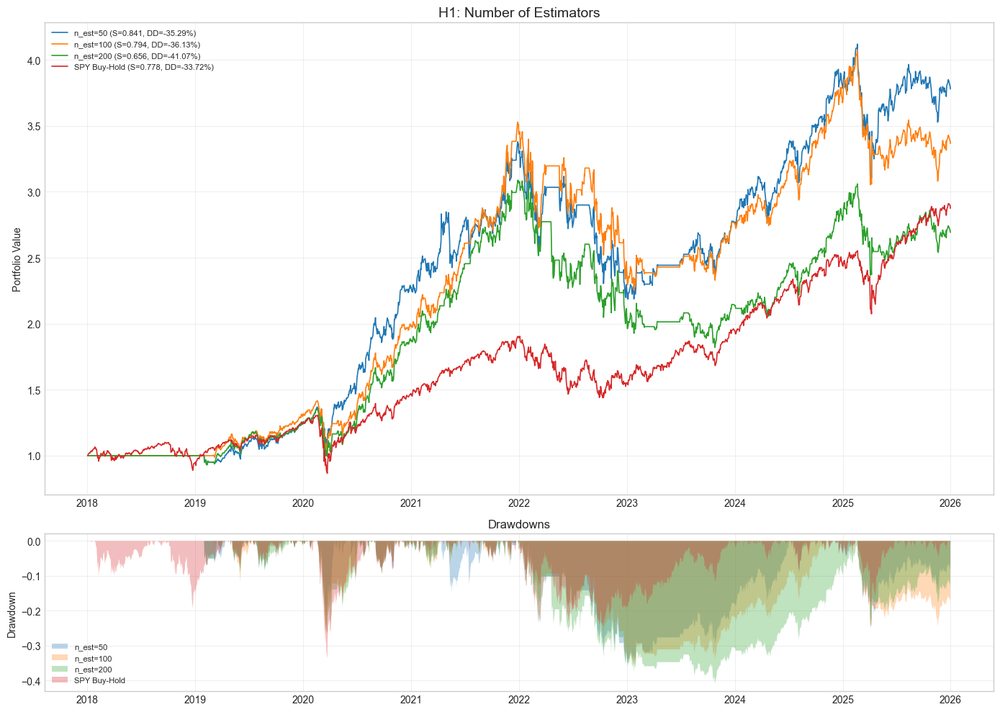
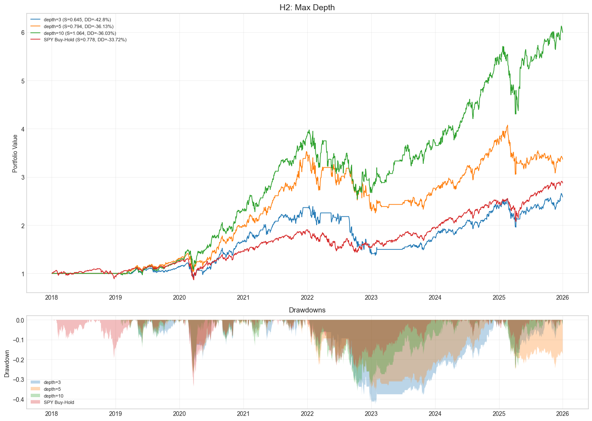
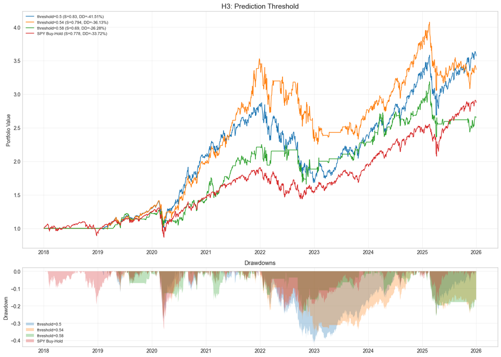
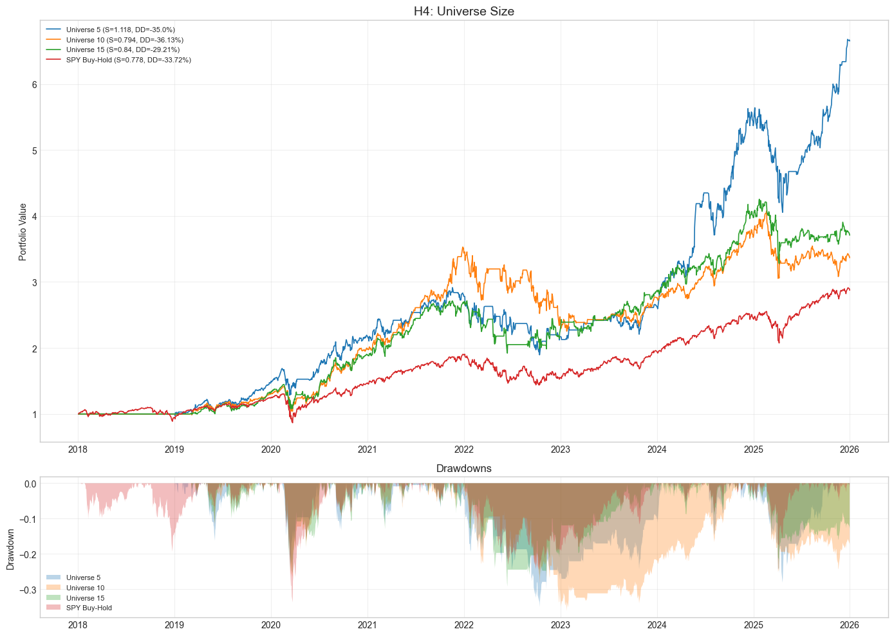
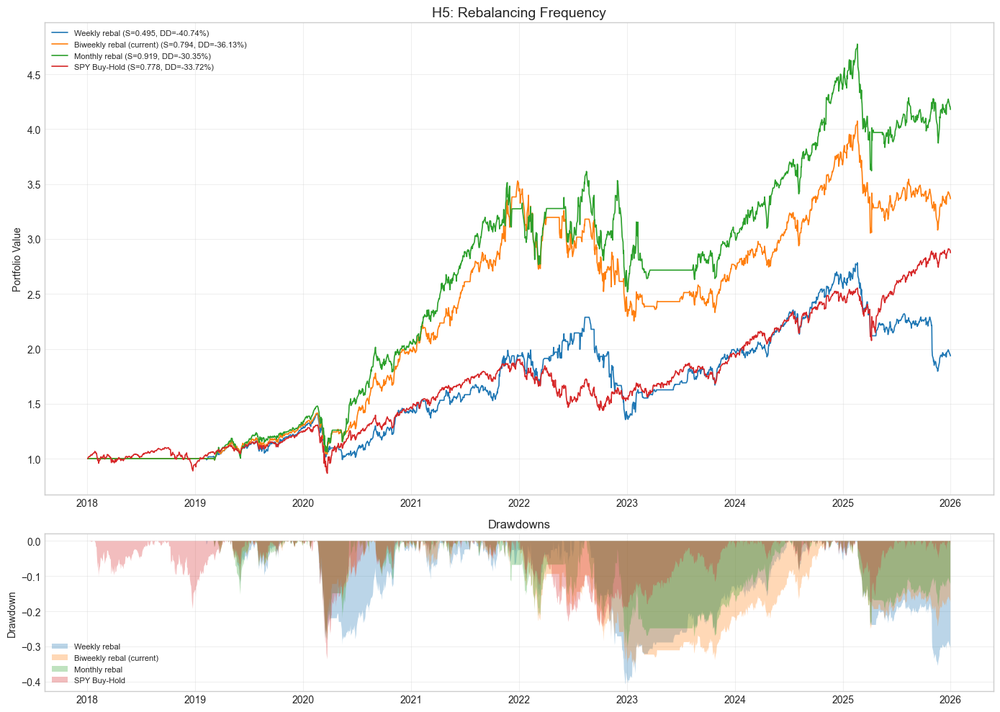
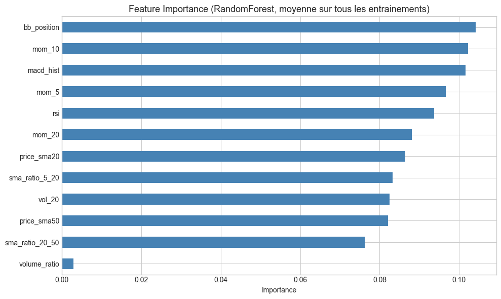

# ML-RandomForest

**Asset class:** US Equities (Large-cap)
**Cloud project ID:** 29434751

## Description

Random Forest (sklearn `RandomForestClassifier`) strategy on 10 large-cap US stocks.
Uses 12 technical features (RSI, Bollinger Bands, MACD, momentum, volatility, volume, price ratios) to predict 10-day forward returns.

Monthly model training with biweekly rebalance (every other Monday). Prediction threshold of 0.54 with max 5 concurrent positions at 18% weight each.

## Figures du notebook de recherche

Le notebook [`research.ipynb`](research.ipynb) teste cinq hypothèses sur les hyperparamètres du Random Forest — nombre d'estimateurs, profondeur maximale, seuil de prédiction, taille de l'univers et fréquence d'entraînement — puis synthétise l'importance des features. Provenance détaillée : [`MANIFEST.md`](assets/readme/MANIFEST.md).

<table>
<tr>
<td align="center"><br/><sub>H1 — nombre d'estimateurs</sub></td>
<td align="center"><br/><sub>H2 — profondeur maximale des arbres</sub></td>
</tr>
<tr>
<td align="center"><br/><sub>H3 — seuil de prédiction</sub></td>
<td align="center"><br/><sub>H4 — taille de l'univers d'actifs</sub></td>
</tr>
<tr>
<td align="center"><br/><sub>H5 — fréquence d'entraînement</sub></td>
<td align="center"><br/><sub>Synthèse — importance des features</sub></td>
</tr>
</table>

## How to Run

**Lean CLI:** `lean backtest "MyIA.AI.Notebooks/QuantConnect/projects/ML-RandomForest"`
```bash
lean backtest --project .
```

**QC Cloud:** Open project 29434751 in the QuantConnect IDE and click "Backtest".

## Backtest Metrics (2015-2026)

| Metric | Value |
|--------|-------|
| Sharpe Ratio | 0.68 |
| CAGR | 20.1% |
| Max Drawdown | 36.4% |
| Rebalance | Biweekly |

## Files

- `main.py` - Strategy (v3, RandomForestClassifier)
- `research.ipynb` - Feature engineering and hyperparameter research

## References

- Breiman (2001), "Random Forests"
- Hands-On AI Trading, Section 06 Example
