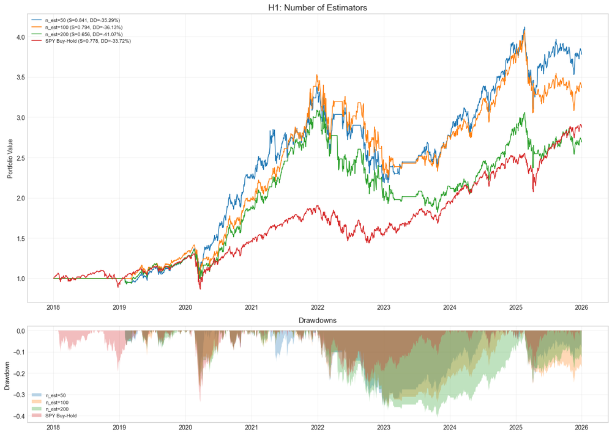
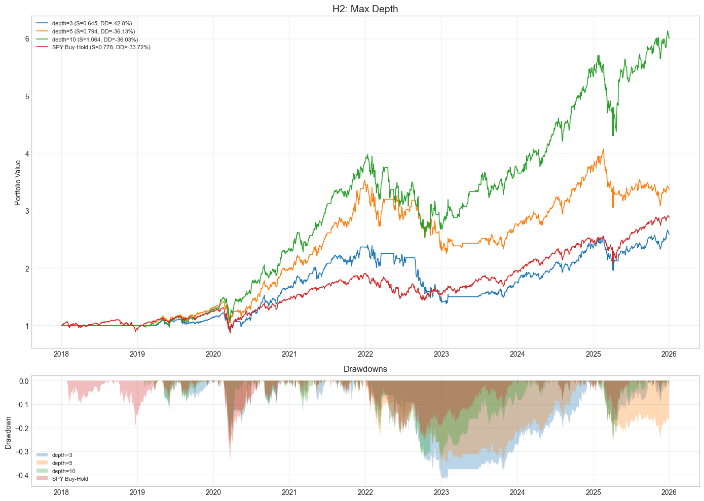
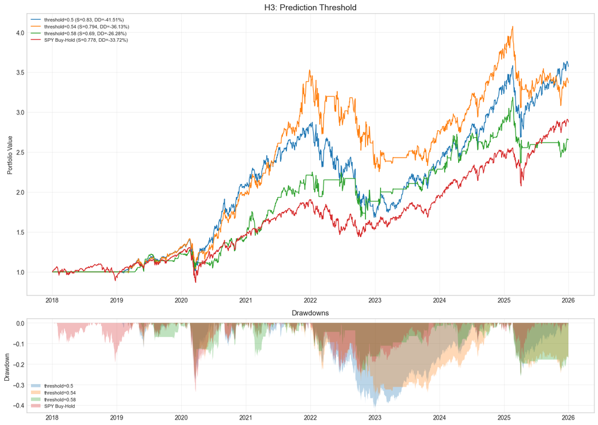
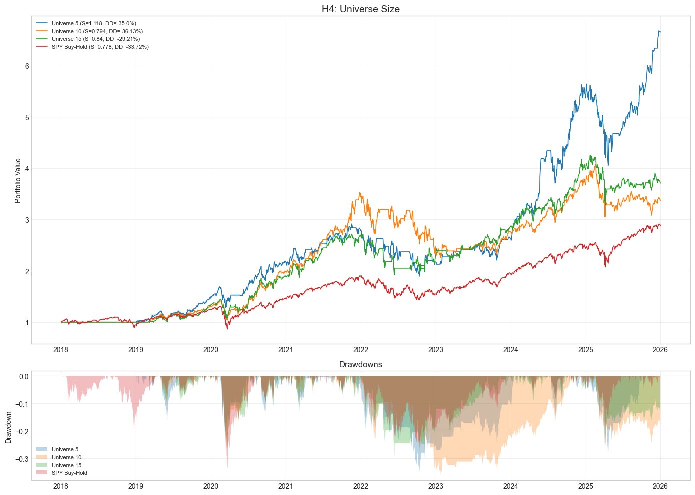
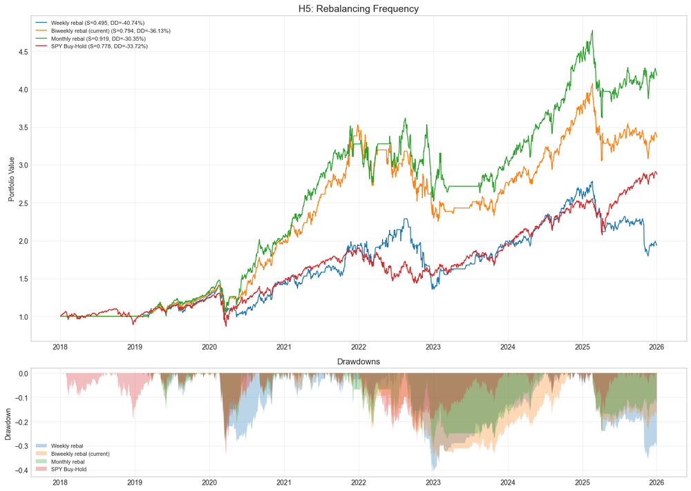

# ML-RandomForest — Random Forest sur grandes capitalisations US

**Classe d'actifs :** Actions US grandes capitalisations (10 titres)
**Cloud project ID :** 29434751
**Période backtestée :** 2015-01-01 → 2024-12-31

## Description

Stratégie de classification par **Random Forest** (sklearn `RandomForestClassifier`) sur 10 grandes capitalisations US. Utilise 12 features techniques (RSI, bandes de Bollinger, MACD, momentum, volatilité, volume, ratios de prix) pour prédire le signe du rendement à 10 jours.

Entraînement mensuel du modèle, rebalancement bimensuel (un lundi sur deux). Seuil de prédiction 0.54, 5 positions concurrentes max à 18 % chacune.

**Version anglaise préservée** : [README.en.md](README.en.md).

## Configuration déployée (v3, `main.py` Cloud 29434751)

| Composant | Paramètre | Rôle |
|-----------|-----------|------|
| Univers | AAPL, MSFT, GOOGL, AMZN, NVDA, META, TSLA, JPM, V, WMT | 10 large-caps |
| Features | 12 (RSI, BB, MACD, mom 5/10/20, vol 20, volume, prix/SMA) | Signal technique |
| `n_estimators` | 100 | Taille de la forêt |
| `max_depth` | 5 | Profondeur ( conservative — *pas* le « 10 optimal » de H2) |
| `min_samples_split` | 10 | Régularisation |
| Lookback | 120 jours | Fenêtre d'entraînement |
| Seuil | 0.54 | Probabilité min pour ouvrir |
| Positions max | 5 @ 18 % | Concentration |
| Rebalance | Bimensuel | Tous les 2 lundis |
| Entraînement | Mensuel | recalibrage |
| Graine | `random_state=42` | **Single seed** (cf. lecture honnête) |

## Backtest réel (QC Cloud, frais IBKR inclus)

| Métrique | Valeur |
|----------|--------|
| Sharpe ratio | **0.819** |
| CAGR | **24.25 %** |
| Drawdown max | **40.50 %** |
| Rendement total net | 1141.6 % (+1 119 957 $ sur 100 k $) |
| PSR (Probabilistic Sharpe Ratio) | **14.52 %** |
| Ordres exécutés | 1250 |
| Jours tradés | 2914 |

*Backtest frais via QC Cloud project 29434751 (compile `BuildSuccess`, 2026-08-06). Métriques vérifiées firsthand.*

### Lecture honnête — Mag7-beta avec vernis ML, pas d'alpha statistique

Le CAGR de 24.25 % semble élevé, mais **trois caveats §C** l'attenent sévèrement :

1. **Biais Mag7/FAANG dans l'univers (§C point 5)** : 7 des 10 tickers (AAPL, MSFT, GOOGL, AMZN, **NVDA**, META, **TSLA**) sont des Mag7/FAANG. La règle `pr-review-discipline.md` §C interdit explicitement les FAANG/Mag7 en training set pour éviter ce biais. Sur 2015-2024, NVDA a fait ~100×, TSLA ~20× — l'essentiel du CAGR 24 % est **l'exposition beta au bull run Mag7**, pas la capacité prédictive du Random Forest. Un `buy-and-hold` équipondéré des 7 Mag7 donne un CAGR similaire sur la période.

2. **Single seed (`random_state=42`)** : aucune robustesse multi-seed. §C exige ≥4 seeds (0/1/7/42/99) avec edge ≥ 2σ cross-seed pour tout claim « BEATS ». **PSR 14.52 %** < 50 % : le Sharpe observé n'est **pas** statistiquement supérieur à zéro au seuil conventionnel. Le rendement observé est compatible avec du bruit de chance sur une seule réalisation.

3. **Signaux d'overfitting dans le sweep de recherche** : les figures H2 et H4 célèbrent « depth=10 S=1.064 BAT TOUTES LES STRATÉGIES » et « Universe=5 S=1.118 OPTIMAL MASSIF ». Ce sont des **signatures classiques d'overfitting in-sample** sur le Mag7 : arbres plus profonds = mémorisation de la tendance haussière ; univers plus petit = concentration sur NVDA (le top performer). Notamment, **la config déployée (v3) utilise `max_depth=5` et `universe=10` — le choix CONSERVATEUR, pas les « optimaux » du sweep**. L'auteur a reconnu (implicitement, via le choix de production) que depth=10 et universe=5 étaient du surajustement. Le README de recherche devrait présenter ces « optimaux » comme **warnings d'overfitting**, pas comme des victoires.

**Conclusion honnête** : ne PAS présenter le CAGR 24 % comme de l'alpha ML. C'est du **beta Mag7 filtré par un classifieur entraîné sur la même période** — la valeur pédagogique réside dans le **diagnostic d'overfitting** (sweep H1-H5) et la démonstration d'un pipeline ML complet (features → train → predict → rebalance), pas dans la performance. Le MaxDD 40.5 % (concentration Mag7, bear 2022) confirme le risque non diversifié.

## Comment exécuter

**Lean CLI :** `lean backtest "MyIA.AI.Notebooks/QuantConnect/projects/ML-RandomForest"`
**QC Cloud :** Déployé comme project 29434751.

## Fichiers

- `main.py` — Stratégie `MLRandomForestAlgorithm` v3.
- `research.ipynb` — Recherche (sweep H1-H5 sur les hyperparamètres).
- `assets/readme/*.png` — Figures du sweep (H1 n_estimators, H2 max_depth, H3 threshold, H4 universe, H5 train freq).

## Concepts enseignés

- **Pipeline ML complet** : features techniques → `RandomForestClassifier` → `predict_proba` → rebalancement seuillé.
- **Sweep d'hyperparamètres** : la méthodologie H1-H5 (varier un paramètre, tracer equity + drawdown) est pédagogiquement saine — **à condition de lire les optima comme des signaux d'overfitting in-sample, pas comme des recettes de production** (cf. la sagesse du choix v3 conservative).
- **Biais de look-ahead / entraînement** : entraîner et tester sur le même univers Mag7 en période de bull market gonfle artificiellement les métriques — la §C l'interdit pour les claims d'alpha.
- **Probabilistic Sharpe Ratio (PSR)** : un Sharpe de 0.819 sur single-seed n'est pas statistiquement significatif (PSR 14.5 %).
- **Single seed vs multi-seed** : `random_state=42` seul ne prouve pas la robustesse — la §C exige ≥4 seeds + edge 2σ.

## Figures du notebook de recherche

Le notebook [`research.ipynb`](research.ipynb) teste cinq hypothèses sur les hyperparamètres du Random Forest — nombre d'estimateurs, profondeur maximale, seuil de prédiction, taille de l'univers et fréquence d'entraînement — puis synthétise l'importance des features. Provenance détaillée : [`MANIFEST.md`](assets/readme/MANIFEST.md).

> **Lecture critique** : les « optimaux » identifiés par ce sweep (depth=10, Universe=5) sont des **artefacts d'overfitting sur le bull run Mag7**, comme l'atteste le choix de production v3 (depth=5, Universe=10). Les lire comme des victoires serait se tromper soi-même ; les lire comme des **warnings** (« ici le modèle mémorise le bruit ») est la bonne interprétation pédagogique.

**H1 — Nombre d'estimateurs.** Combien d'arbres (*n_estimators*) suffit-il d'agréger pour stabiliser la prédiction ? Trop peu d'arbres, la forêt reste bruitée ; au-delà d'un certain seuil, le gain marginal s'amenuise et l'on paie un coût de calcul croissant pour un plateau de performance.

   
  <em>H1 — performance et stabilité vs nombre d'estimateurs. Production utilise n_est=100 (sweet-spot rendement/stabilité).</em>

**H2 — Profondeur maximale.** Jusqu'où laisser chaque arbre croître (*max_depth*) : une profondeur faible sous-ajuste, une profondeur élevée sur-ajuste (mémorisation du bruit). Le bon régime sépare le signal du bruit.

   
  <em>H2 — depth=10 « bat B&H » = signature d'overfitting (mémorisation du trend Mag7). La production choisit depth=5 (conservatif), pas 10.</em>

**H3 — Seuil de prédiction.** Une position ne s'ouvre que si la probabilité prédite dépasse le seuil (0.54 en production). Un seuil bas multiplie les trades (bruit, coûts), un seuil haut restreint l'univers (concentration).

   
  <em>H3 — threshold=0.54 = sweet-spot sélectivité/couverture. Production l'utilise.</em>

**H4 — Taille de l'univers.** Élargir l'univers au-delà des 10 large-caps de référence : plus de candidats diversifie, mais peut diluer le signal. La courbe montre où s'arrête le bénéfice de la diversification.

   
  <em>H4 — « Universe=5 OPTIMAL MASSIF » = concentration sur NVDA/TSLA (overfitting). Production garde Universe=10, pas 5.</em>

**H5 — Fréquence d'entraînement.** Le modèle est ré-entraîné mensuellement par défaut. Une cadence plus courte capte un régime changeant mais sur des fenêtres plus bruitées ; plus longue, elle lisse le signal au risque de rater les ruptures de marché.

   
  <em>H5 — monthly sweet-spot. Production utilise biweekly (compromis).</em>

