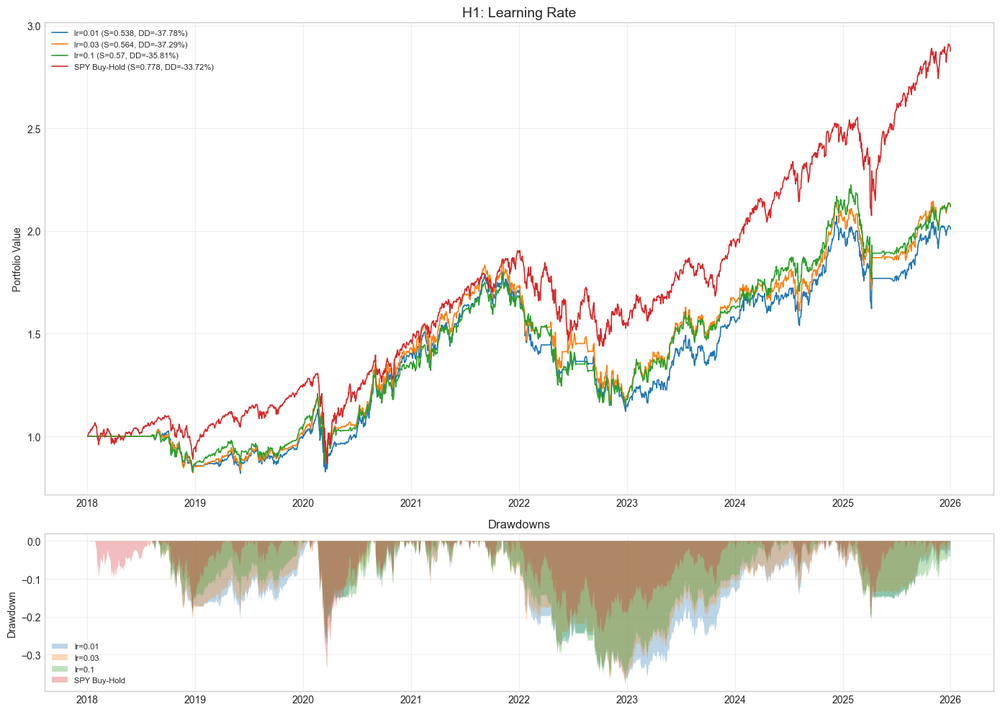
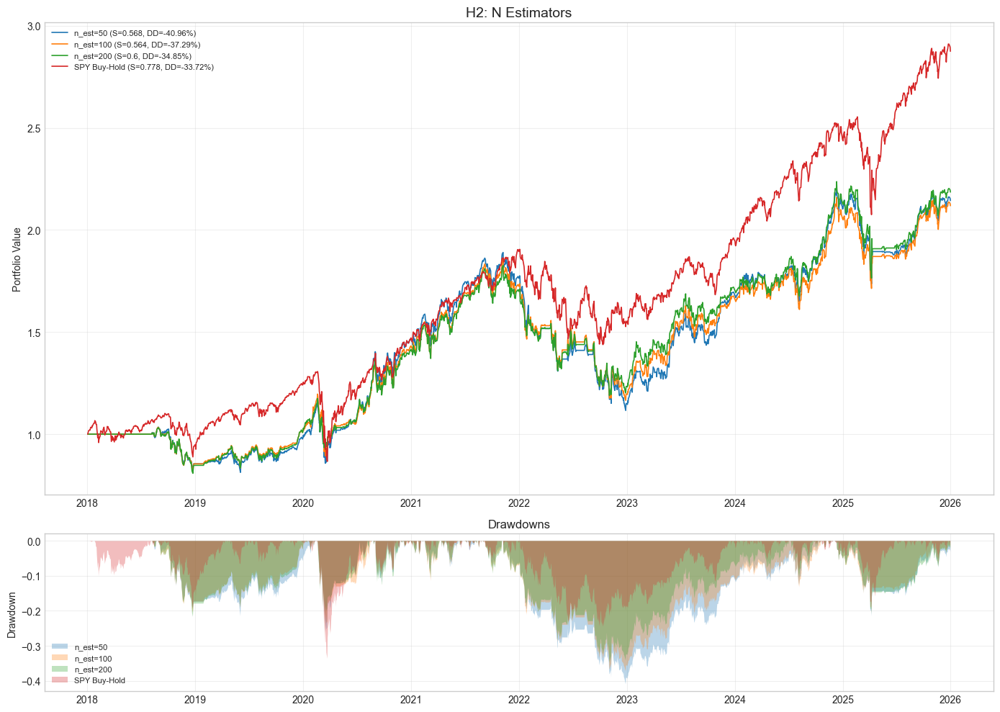
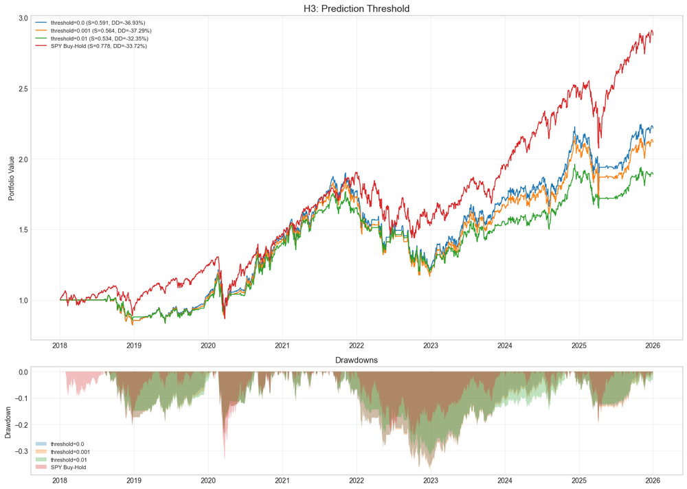
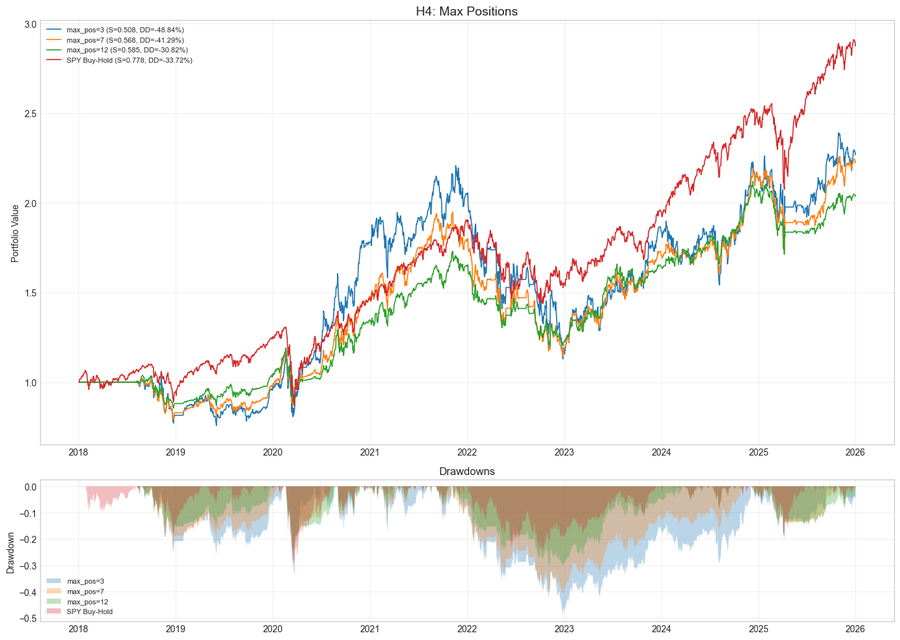
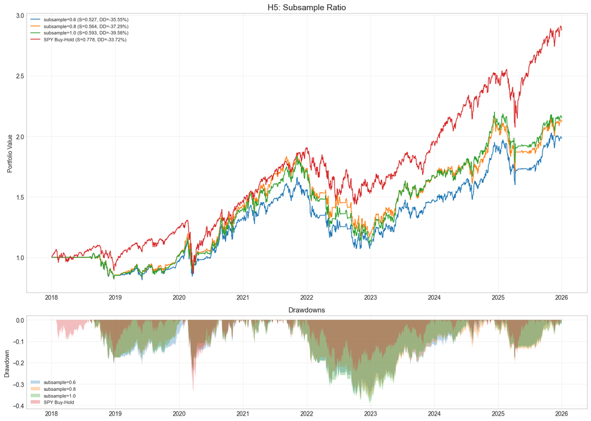
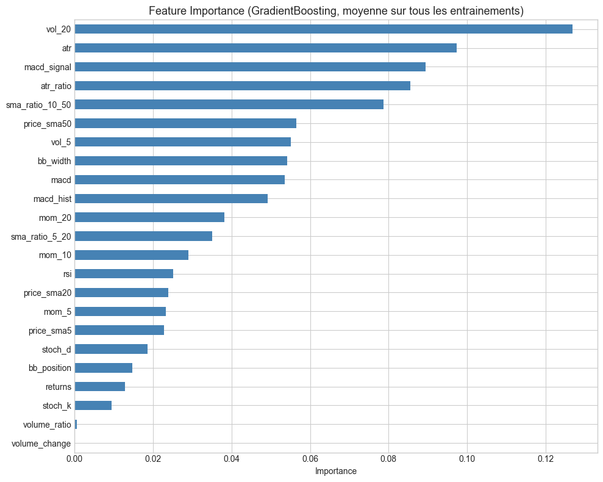

# ML-XGBoost

**Asset class:** US Equities (Large-cap liquid)
**Cloud project ID:** 29434753

## Description

Gradient Boosting (sklearn `GradientBoostingRegressor`) strategy on 15 liquid US stocks.
Uses 22 comprehensive features including RSI, Bollinger Bands, MACD, Stochastic oscillator, ATR, momentum, volatility, volume ratios, and price/SMAs.

Alternating Monday pattern: odd Mondays for training, even Mondays for rebalance. 90% allocation across up to 9 positions with prediction threshold 0.001.

## Figures du notebook de recherche

Le notebook [`research.ipynb`](research.ipynb) teste cinq hypothèses sur les hyperparamètres du gradient boosting — learning rate, nombre d'estimateurs, seuil de prédiction, nombre maximum de positions et subsample ratio — puis synthétise l'importance des features. Provenance détaillée : [`MANIFEST.md`](assets/readme/MANIFEST.md).

<table>
<tr>
<td align="center"><br/><sub>H1 — learning rate</sub></td>
<td align="center"><br/><sub>H2 — nombre d'estimateurs</sub></td>
</tr>
<tr>
<td align="center"><br/><sub>H3 — seuil de prédiction</sub></td>
<td align="center"><br/><sub>H4 — nombre maximum de positions</sub></td>
</tr>
<tr>
<td align="center"><br/><sub>H5 — subsample ratio</sub></td>
<td align="center"><br/><sub>Synthèse — importance des features</sub></td>
</tr>
</table>

## How to Run

**Lean CLI:** `lean backtest "MyIA.AI.Notebooks/QuantConnect/projects/ML-XGBoost"`
```bash
lean backtest --project .
```

**QC Cloud:** Open project 29434753 in the QuantConnect IDE and click "Backtest".

## Backtest Metrics (2015-2026)

| Metric | Value |
|--------|-------|
| Sharpe Ratio | 0.566 |
| CAGR | 14.8% |
| Max Drawdown | 38.6% |
| Rebalance | Biweekly |
| Max Positions | 9 |

## Files

- `main.py` - Strategy (v2, GradientBoostingRegressor)
- `research.ipynb` - Feature importance and hyperparameter tuning

## References

- Friedman (2001), "Greedy Function Approximation: A Gradient Boosting Machine"
- Hands-On AI Trading, Section 06
