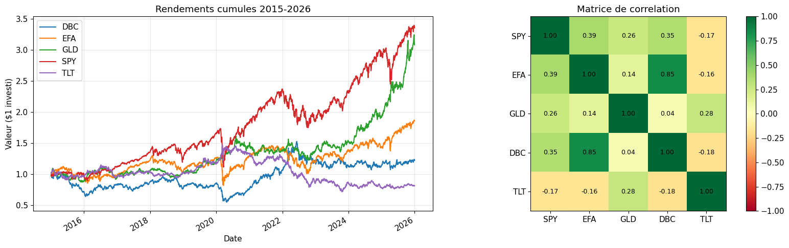
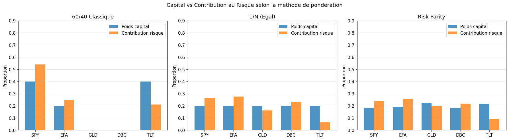
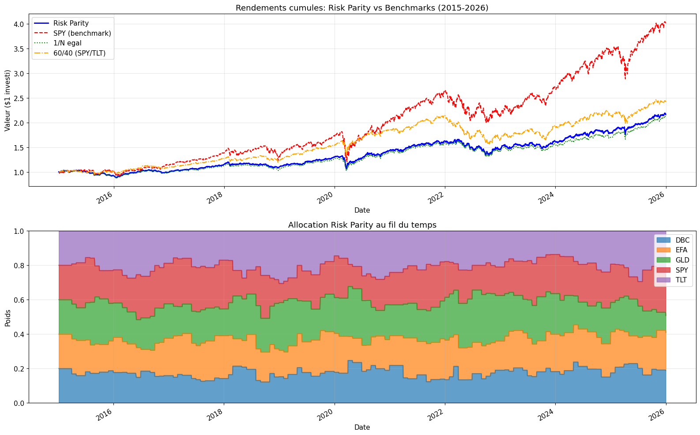
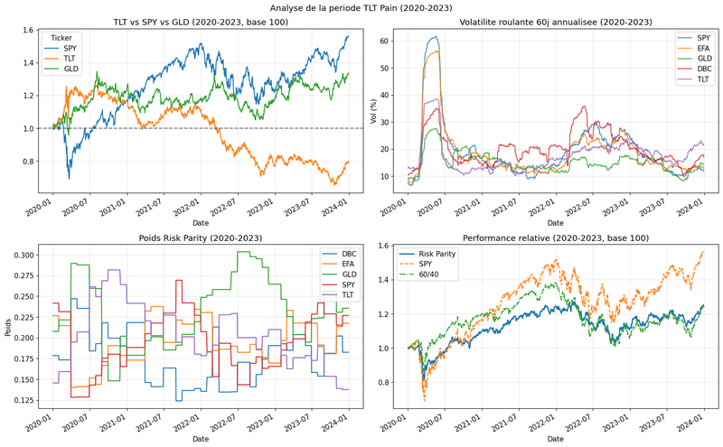
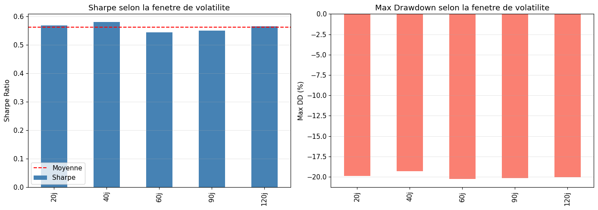
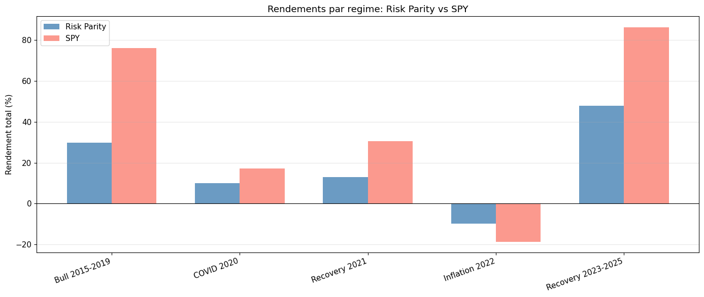

# RiskParity Strategy

**Statut** : Plafond structurel confirmé — contre-exemple à visée pédagogique.

## Performance

| Métrique | Valeur |
|----------|--------|
| Sharpe Ratio | **0.399** |
| CAGR | 7.8 % |
| Max Drawdown | 20.9 % |
| Période | 2015-2026 |

## Figures du notebook de recherche

Le notebook [`research.ipynb`](research.ipynb) documente l'analyse complète de la parité de risque : exploration des actifs, inverse-volatility weighting (H1), backtest (H2), impact de TLT en 2020-2023 (H3), sensibilité au lookback de volatilité (H4) et analyse par régime de marché. La stratégie atteint un plafond structurel (Sharpe 0.399) — contre-exemple pédagogique. Provenance détaillée : [`MANIFEST.md`](assets/readme/MANIFEST.md).

<table>
<tr>
<td align="center"><br/><sub>Exploration — analyse des actifs (§2)</sub></td>
<td align="center"><br/><sub>H1 — inverse-volatility weighting (égalisation des contributions)</sub></td>
</tr>
<tr>
<td align="center"><br/><sub>H2 — backtest risk parity</sub></td>
<td align="center"><br/><sub>H3 — impact de TLT en 2020-2023 (hausse des taux)</sub></td>
</tr>
<tr>
<td align="center"><br/><sub>H4 — sensibilité au lookback de volatilité</sub></td>
<td align="center"><br/><sub>Régimes — analyse par régime de marché (§7)</sub></td>
</tr>
</table>

## Pourquoi cette stratégie a atteint un plafond

### Cause racine : anti-pattern en marché haussier

La parité de risque alloue le capital de façon inversement proportionnelle à la volatilité :

- **Hypothèse** : contribution égale au risque = meilleurs rendements ajustés du risque
- **Réalité (2015-2026)** : sous-performe face à des approches plus simples

### Ce qui a été testé (et a échoué)

| Itération | Modification | Résultat | Pourquoi l'échec |
|-----------|--------------|----------|------------------|
| H5 | Remplacer TLT par IEF | Sharpe 0.330 | TLT supérieur en marché haussier obligataire (2015-2020) |
| H6 | Ciblage de vol 10 % | Négatif | Cash drag en faible vol (anti-pattern en hausse) |
| H7 | Filtre VIX > 25 (sortie vers cash) | Négatif | Trop peu de temps en stress (<15 %) = cash drag |

### Pourquoi la parité de risque sous-performe (2015-2026)

**Le problème du marché haussier** :

1. **Le ciblage de vol réduit l'exposition** : quand la vol est faible, la stratégie réduit l'exposition (elle rate les gains)
2. **Les obligations ont sous-performé après 2020** : corrélation IEF/TLT avec les actions durant les hausses de taux
3. **Risque égal != rendement égal** : les actifs faible-vol (obligations) pèsent sur les rendements en marché haussier
4. **Complexité sans bénéfice** : l'équi-pondéré simple surperforme

### Comparaison aux alternatives

| Stratégie | Sharpe | CAGR | Complexité |
|-----------|--------|------|-------------|
| RiskParity | 0.399 | 7.8 % | Élevée (pondération vol, rééquilibrage) |
| Équi-pondéré (60/40) | ~0.45 | ~9 % | Faible |
| AdaptiveAssetAllocation | 0.518 | 8.0 % | Élevée (momentum + min-var) |

### L'anti-pattern du « ciblage de vol »

La parité de risque utilise souvent un ciblage de vol (ex : cible 10 % de vol) :

- **En période de faible vol** : réduit l'exposition pour maintenir la cible -> rate les gains
- **En période de forte vol** : augmente l'exposition -> achète haut, vend bas
- **Résultat net** : alpha négatif en marché trenduel

**2015-2026 a été majoritairement un marché haussier** : le ciblage de vol a systématiquement réduit l'exposition durant les meilleures périodes.

### Leçons retenues

1. **Parité de risque != repas gratuit** : une contribution égale au risque ne garantit pas de meilleurs rendements
2. **Le ciblage de vol dépend du régime** : fonctionne en marché irrégulier, échoue en marché trenduel
3. **La complexité n'est pas toujours meilleure** : le 60/40 équi-pondéré surperforme avec moins d'effort
4. **Les obligations ne sont pas toujours des diversificateurs** : les hausses de taux post-2020 ont cassé la corrélation obligations/actions
5. **Savoir quand s'arrêter** : après 3 itérations ratées (H5-H7), le plafond est confirmé

## Quand la parité de risque PEUT fonctionner

Cette approche peut fonctionner dans :

- **Marchés latéraux / irréguliers** : où le ciblage de vol ajoute de la valeur
- **Environnements à forte volatilité** : où l'égalisation du risque protège le capital
- **Futures multi-actifs** : où la cointégration crée des relations plus stables
- **Versions sensibles au régime** : qui ajustent l'approche selon l'état du marché

**Pour les actions US 2015-2026** : plafond structurel confirmé.

## Valeur pédagogique

Cette stratégie illustre :

- L'**anti-pattern du ciblage de vol** en marché haussier
- **Complexité != performance** : le simple équi-pondéré peut battre une parité de risque sophistiquée
- **Dépendance au régime** : une stratégie optimisée pour un régime peut échouer dans un autre
- **Quand déclarer un plafond** : après 3+ itérations ratées avec des hypothèses claires

## Comparaison avec de meilleures alternatives

```python
# RiskParity (pondéré par la volatilité)
weights = 1 / volatility
weights /= weights.sum()

# Équi-pondéré (plus simple, meilleur 2015-2026)
weights = np.array([1/n] * n)

# Adaptative (momentum + min-var)
# Voir le projet AdaptiveAssetAllocation
```

## Références

- **AdaptiveAssetAllocation** : combine momentum + min-var (Sharpe 0.518)
- **AllWeather** : portefeuille multi-actif plus simple (Sharpe 0.667)
- **OPTIMIZATION_BACKLOG.md** : historique complet des itérations (H5-H7)

---

**Note** : cette stratégie est conservée comme contre-exemple. Pour un usage en production, considérer des approches plus simples (équi-pondéré) ou des alternatives basées momentum (AdaptiveAssetAllocation).
