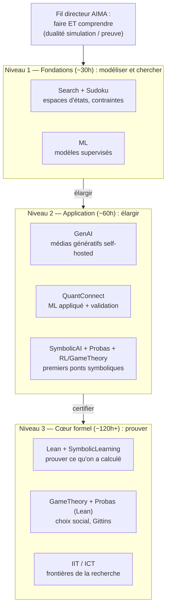
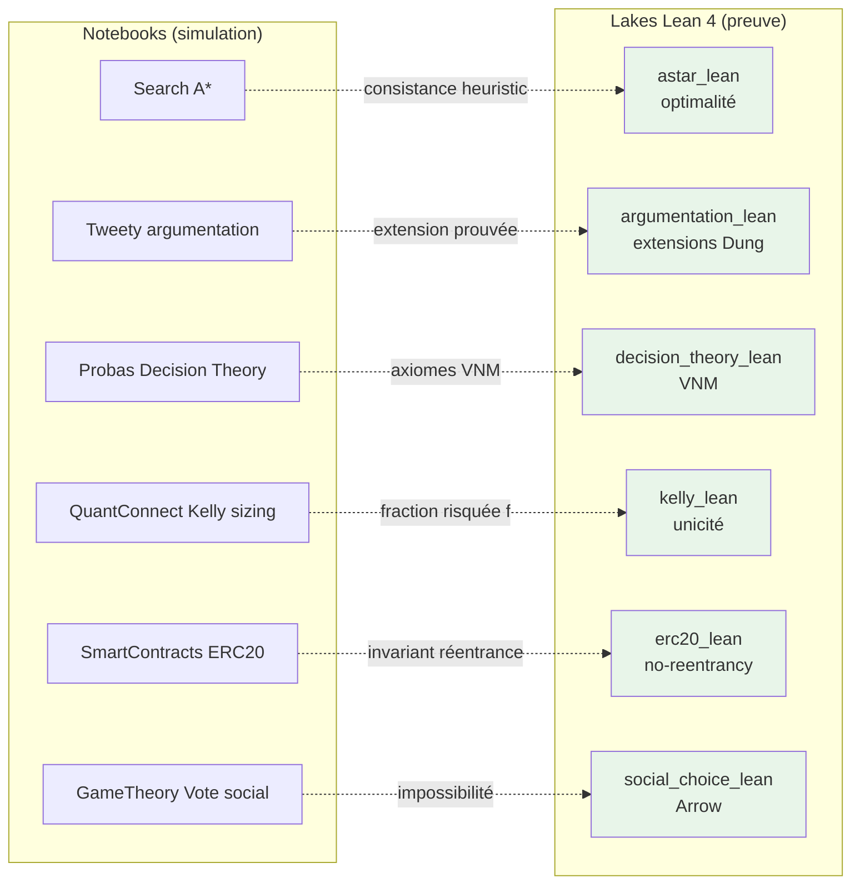

# MyIA.AI.Notebooks - Ecosysteme de Notebooks CoursIA

CoursIA est un curriculum d'intelligence artificielle pensé comme un parcours continu, des fondations jusqu'aux frontières de la recherche. Plutôt qu'une collection d'exemples isolés, il tisse un même fil conducteur à travers onze domaines : on y apprend autant à **faire** — générer des images et de l'audio, entraîner et déployer des modèles, backtester des stratégies de trading, résoudre des problèmes de contraintes — qu'à **comprendre et prouver** : formaliser un théorème en Lean 4, raisonner sur l'incertitude, vérifier qu'un smart contract ou un algorithme se comporte comme attendu.

Deux partis pris structurent l'ensemble. D'abord une **double culture technique** : Python (PyTorch, Diffusers, PyMC, OpenSpiel) et .NET / C# (Semantic Kernel, Infer.NET, ML.NET) cohabitent au sein de notebooks exécutables, parce que l'IA appliquée se pratique dans les deux écosystèmes. Ensuite une **dualité simulation / preuve** : un concept est d'abord illustré numériquement, puis — quand c'est possible — formalisé et vérifié mécaniquement (Lean 4, Z3, vérification formelle). Chaque notebook est rédigé en français, exécutable de bout en bout, et accompagné d'exemples guidés et d'exercices pour un apprentissage en autonomie.

Le catalogue rassemble **670 notebooks pédagogiques** répartis sur les onze domaines ci-dessous (le décompte exact par série est tenu à jour automatiquement dans le marqueur de catalogue, qui fait foi). Une bonne porte d'entrée : **GenAI** pour la création assistée par IA, **QuantConnect** pour le ML appliqué à un domaine concret, ou **Search / GameTheory / SymbolicAI** pour les fondements algorithmiques et formels.

<!-- CATALOG-STATUS
series: ALL
total: 703
breakdown: SymbolicAI=169, GenAI=141, QuantConnect=105, Search=82, Probas=58, ML=40, Sudoku=33, GameTheory=28, IIT=24, RL=17, CaseStudies=6
maturity: PRODUCTION=534, BETA=115, ALPHA=45, DRAFT=5, TEMPLATE=4
-->

Dernière mise à jour : 2026-06-11

## Vue d'ensemble

**[GenAI](GenAI/README.md)** — Tout ce qui se génère : images (SDXL, Flux, Qwen), audio — du TTS au pipeline complet d'audiobook —, vidéo, et le travail des LLMs (RAG, raisonnement, fine-tuning LoRA). La série a un parti pris d'atelier : on ne se contente pas d'appeler des APIs, on héberge les modèles soi-même sur une stack Docker dédiée ([00-GenAI-Environment](GenAI/00-GenAI-Environment/README.md)), ce qui change tout à ce qu'on comprend de leurs coûts et de leurs limites. Elle culmine avec l'orchestration Semantic Kernel, quatre études de cas étudiantes et les ateliers de vibe-coding (Claude Code, Roo Code).

**[QuantConnect](QuantConnect/README.md)** — Le ML appliqué à un domaine qui ne pardonne pas : les marchés. Un cours Python progressif mène du premier backtest à un portefeuille de 49 stratégies (GARCH, Kelly, ensembles), implémentant 18 des 19 exemples du livre *Hands-On AI Trading*. La leçon transversale vaut bien au-delà de la finance : une discipline de validation — walk-forward, multi-seed, coûts de transaction — sans laquelle tout résultat de ML est une illusion d'optique.

**[SymbolicAI](SymbolicAI/README.md)** — Le pôle « comprendre et prouver » du dépôt, et sa série la plus vaste : preuves formelles Lean 4 (théorème d'Arrow, Kochen-Specker, hommages à Grothendieck et Conway), smart contracts Solidity testés et déployés sur testnet, Web sémantique RDF/SPARQL, logiques d'argumentation (Tweety), planification PDDL et apprentissage symbolique (ILP, automates, neuro-symbolique). C'est ici que la dualité simulation / preuve prend sa forme la plus aboutie : ce que les autres séries calculent, celle-ci cherche à le certifier.

**[Search](Search/README.md)** — Comment trouver une aiguille dans une botte de foin exponentielle ? Des algorithmes classiques (BFS, A*, Minimax, MCTS) à la programmation par contraintes (CP-SAT) et aux métaheuristiques, la série déroule un fil unique — réduire l'espace de recherche — et le confronte à 22 applications réelles adaptées de projets étudiants, de la planification d'infirmiers à la génération procédurale de niveaux.

**[Probas](Probas/README.md)** — Raisonner avec l'incertitude plutôt que contre elle. La série a une particularité unique dans le dépôt : les mêmes modèles probabilistes y vivent deux fois, en Infer.NET (graphes de facteurs, C#) et en PyMC (MCMC, Python) — deux langues pour une même théorie bayésienne, dont la comparaison est elle-même instructive. Un volet Lean 4 (indice de Gittins) pousse jusqu'à la preuve.

**[Sudoku](Sudoku/README.md)** — Et si l'on prenait un seul problème et qu'on lui appliquait toutes les méthodes ? Backtracking, propagation de contraintes, Dancing Links, jusqu'aux réseaux de neurones (CNN et MLP comparés à budget de paramètres comparable) : le Sudoku sert de banc d'essai contrôlé où approches symboliques et neuronales se mesurent sur exactement le même terrain.

**[GameTheory](GameTheory/README.md)** — Que devient l'optimisation quand les autres aussi optimisent ? Jeux combinatoires avec OpenSpiel, équilibres à la von Neumann, et un volet formel singulier : les théorèmes du choix social (Arrow, Sen, la valeur de Shapley) portés en Lean 4 — démontrés mécaniquement, pas seulement énoncés.

**[ML](ML/README.md)** — Le machine learning classique, sans folklore : tutoriels ML.NET (classification, régression, clustering) côté C#, agents Python pour la data science côté Python. C'est le socle de méthode sur lequel GenAI et QuantConnect construisent.

**[RL](RL/README.md)** — Apprendre en agissant : Stable-Baselines3, environnements Gym, PPO et SAC — et l'évaluation honnête de ce que valent réellement les politiques apprises.

**[CaseStudies](CaseStudies/README.md)** — Des études de cas interdisciplinaires où plusieurs séries convergent sur un même problème : diagnostic médical assisté par LLM, planification oncologique, analyse de sentiments.

**[IIT](IIT/README.md)** — La plus spéculative : la théorie de l'information intégrée et la mesure Phi (PyPhi) appliquées à des réseaux logiques — où l'on calcule, littéralement, des candidats quantitatifs à une mesure de la conscience. La série prolonge le Phi *statique* vers les **trajectoires** causales avec l'extension **ICT** (*Integrated Causal Trajectories*) : tri auto-organisé comme morphogenèse, émergence causale multi-échelles (Hoel, *Causal Emergence 2.0*). Elle rejoint ainsi le fil rouge **causalité** du dépôt, où le même opérateur `do(·)` de Pearl s'instancie à travers quatre paradigmes — symbolique (Tweety), message passing (Infer.NET), MCMC (PyMC) et théorie de l'information (ICT).

### Progression pédagogique

```text
GenAI
├── 00-GenAI-Environment/ - Setup Docker, GPU, services
├── Image/ - Génération d'images (SDXL, Qwen, Flux)
├── Audio/ - STT, TTS, music, pipeline audiobook FishAudio S2-Pro
├── Video/ - Génération vidéo, animation
├── Texte/ - LLMs, RAG, reasoning
├── SemanticKernel/ - SDK Microsoft
├── FineTuning/ - Fine-tuning LoRA, adapters
├── CaseStudies/ - Études de cas étudiants
└── Vibe-Coding/ - Claude-Code + Roo-Code

QuantConnect
├── Python/ - Cours progressifs QC-Py (fondamentaux → stratégies)
├── projects/ - Stratégies backtestées et ML (GARCH, Kelly, ensemble)
└── ML-Training-Pipeline/ - Pipeline training thermal-safe

SymbolicAI
├── SmartContracts/ - Solidity, Web3, blockchain
├── SemanticWeb/ - RDF, SPARQL, OWL, C# + Python
├── Lean/ - Theorem proving, LeanDojo, hommages (Grothendieck, Conway, FWT)
├── Planners/ - PDDL, Fast-Downward, OR-Tools, LLM planning
├── Tweety/ - Logiques classiques, argumentation
├── SMT/ - Z3, Satisfiability Modulo Theories (LINQ C# + Python)
├── SymbolicLearning/ - ILP, neuro-symbolique, KG-LLM, automates (L*)
└── Argument_Analysis/ - Analyse d'arguments
```

## Parité Python / .NET / Lean — différenciant structurant

Le dépôt pratique **explicitement** la double culture IA : Python (PyTorch, Diffusers, PyMC, OpenSpiel) et .NET / C# (Semantic Kernel, Infer.NET, ML.NET) y sont à égalité de traitement, et Lean 4 ancre mathématiquement les résultats phares. Ce tableau reflète l'état réel (langages dominants des notebooks par famille, marqueur `CATALOG-STATUS` source de vérité pour les volumes) :

| Famille | Python | C# / .NET | Lean 4 | Note |
|---------|:---:|:---:|:---:|------|
| GenAI | ● | ◐ | — | Python dominant ; C# pour Semantic Kernel |
| QuantConnect | ● | ◐ | ◐ | Python + LEAN Engine C# + `kelly_lean` |
| SymbolicAI | ● | ◐ | ● | Trilogie complète : Python (SymbolicLearning), C# (Tweety/Z3/SW/SC), Lean (Arrow/Conway/FWT) |
| Search | ● | ● | ◐ | Marathon parité CSP en cours (5/9 tranches livrées, EPIC #4956) |
| Probas | ● | ● | ◐ | Infer.NET + PyMC sur mêmes modèles ; `decision_theory_lean` (Gittins) |
| Sudoku | ● | ● | ◐ | Backtracking/DLX Python + propagation C# + lake exact-cover |
| GameTheory | ● | — | ● | OpenSpiel Python ; `social_choice_lean` (Arrow) |
| ML | ● | ● | ◐ | ML.NET (tutoriels) + agents Python + `learning_theory_lean` |
| RL | ● | — | — | Stable-Baselines3 / Gym |
| CaseStudies | ● | — | — | Projets interdisciplinaires |
| IIT / ICT | ● | ◐ | — | PyPhi Python + Tweety C# (causalité commune) |

Légende : ● = présent en masse ; ◐ = présent ciblé ; — = absent.

Cette structure permet au lecteur de **basculer d'un écosystème à l'autre** sur un même concept sans repartir de zéro — c'est précisément le pont pédagogique que les parcours recommandés exploitent.

## Technologies principales

### AI/ML
- **OpenAI**: GPT-4o, GPT-5, DALL-E 3
- **Anthropic**: Claude (via API / Claude Code)
- **Hugging Face**: Transformers, Diffusers
- **Microsoft**: Semantic Kernel, .NET 9
- **Locaux**: vLLM, Ollama, Qwen 2.5, Chronos

### QuantConnect / Finance
- **LEAN Engine**: Backtesting, live trading, optimisation
- **sklearn / XGBoost / PyTorch**: Modèles ML financiers
- **QuantConnect Cloud**: 95 projets, backtests cloud
- **Hands-On AI Trading**: 18/19 exemples du livre implémentés

### Infrastructure
- **Docker**: ComfyUI (29GB VRAM), services GenAI
- **MCP**: Jupyter automation, QuantConnect MCP server
- **Papermill**: Exécution batch

### Domaines d'étude
- **Computer Vision**: Image, Video, Animation
- **NLP**: LLMs, RAG, Reasoning, Sentiment
- **Audio**: STT, TTS, Voice Cloning, Music
- **Finance**: Trading algorithmique, ML financier, options
- **Symbolic**: RDF, Z3 SMT, Lean 4, SmartContracts
- **Optimization**: CSP, metaheuristiques, recherche opérationnelle

## Configuration requise

### Environnement
- Python 3.10+ avec venv
- .NET 9.0 SDK
- Docker (services GenAI)
- 24GB+ VRAM (recommandé pour GenAI)

### Installation
```bash
# Python
cd MyIA.AI.Notebooks/GenAI
python -m venv venv && venv\Scripts\activate
pip install -r requirements.txt

# C#
dotnet restore MyIA.CoursIA.sln
```

### Services Docker
```bash
# Démarrer ComfyUI (nécessaire pour Image/Video)
cd docker-configurations/services/comfyui-qwen
docker-compose up -d
```

## Parcours recommandé

Trois niveaux ordonnés par **difficulté croissante**. Le fil directeur suit l'arc classique de l'intelligence artificielle façon *AIMA* (Russell & Norvig) : on apprend d'abord à **modéliser et chercher** — agents, espaces d'états, contraintes — puis on **élargit** vers les deux écosystèmes applicatifs et les médias génératifs, avant d'atteindre le **cœur formel** où l'on prouve ce qu'on a calculé. Pour une entrée par **centre d'intérêt** plutôt que par niveau, voir les [parcours thématiques](#parcours-thématiques) en fin de section.



### Niveau 1 - Fondations (~30h)

Le déclic de ces premières heures n'est pas de générer une image, mais de faire **raisonner** une machine : formaliser un problème en espace d'états, choisir entre explorer et contraindre, mesurer une approche contre une autre sur un même terrain. C'est le socle algorithmique sur lequel tout le reste s'appuie — l'approche promue dans toute la série [Search](Search/README.md).

1. **[Search / Part1-Foundations](Search/Part1-Foundations/README.md)** - agents et espaces d'états ; BFS, A\*, Minimax, MCTS (Search-1 à 7). Le cœur classique de l'IA.
2. **[Sudoku](Sudoku/README.md)** - un seul problème, toutes les méthodes (backtracking, contraintes, Dancing Links, réseaux de neurones) : le banc d'essai où symbolique et neuronal se mesurent à budget égal.
3. **[Search / Part2-CSP](Search/Part2-CSP/README.md)** - CSP-1/2 : le basculement *explorer -> contraindre* (propagation AC-3, forward checking, CP-SAT).
4. **[ML](ML/README.md)** - premiers modèles supervisés (tutoriels ML.NET en C# *ou* agents Python pour la data science) : apprendre depuis les données.

> Mise en route : un `venv` Python et le SDK `.NET 9` suffisent à ce niveau — la stack Docker GenAI n'est requise qu'au Niveau 2. Envie de « faire » tout de suite ? un détour par **[GenAI/Image](GenAI/Image/README.md)** ou les premiers **[QuantConnect/Python](QuantConnect/README.md)** (QC-Py-01 à 05) donne le déclic, mais le fil rouge reste l'algorithmique.

### Niveau 2 - Application et élargissement (~60h)

On ouvre le spectre : les deux écosystèmes (Python *et* .NET), tous les médias génératifs, le raisonnement sous incertitude et les premiers pas symboliques. C'est le moment où les ponts entre séries commencent à apparaître.

1. **[GenAI](GenAI/README.md)** - images, audio, vidéo, texte : on héberge les modèles soi-même ([00-GenAI-Environment](GenAI/00-GenAI-Environment/README.md) requis ici), ce qui change tout à la compréhension de leurs coûts et de leurs limites. (Orchestration -> Niveau 3.)
2. **[QuantConnect / Python](QuantConnect/README.md)** - le cours progressif complet + le partner-course : du premier backtest à la discipline de validation (walk-forward, multi-seed, coûts de transaction) sans laquelle tout résultat ML est une illusion.
3. **[SymbolicAI](SymbolicAI/README.md)** (porte symbolique) - SemanticWeb (RDF/SPARQL), SmartContracts (Solidity testnet), Tweety (logiques et argumentation), Planners (PDDL).
4. **[Probas](Probas/README.md)** - raisonner avec l'incertitude : les mêmes modèles bayésiens en Infer.NET *et* en PyMC.
5. **[RL](RL/README.md)** - apprendre en agissant (PPO, SAC, Gym) ; **[GameTheory](GameTheory/README.md)** - l'optimisation quand les autres aussi optimisent (OpenSpiel, équilibres).

### Niveau 3 - Cœur formel et frontières (~120h+)

Les notebooks les plus exigeants, mais ceux où le dépôt dit ce qu'il a de plus singulier : **prouver** ce qu'on a calculé, et **valider sans complaisance** ce qu'on a appris.

1. **[SymbolicAI / Lean](SymbolicAI/Lean/README.md)** - preuves formelles Lean 4 (théorème d'Arrow, Kochen-Specker, hommages à Grothendieck et Conway) + **[SymbolicLearning](SymbolicAI/SymbolicLearning/README.md)** (ILP, neuro-symbolique, automates L\*).
2. **[GameTheory](GameTheory/README.md)** (volet formel) et **[Probas](Probas/README.md)** (indice de Gittins) - théorèmes du choix social et bandits portés en Lean 4, démontrés mécaniquement.
3. **[Search](Search/README.md) avancé** - métaheuristiques, programmation linéaire, automates symboliques, CSP souples/temporels/distribués, et les applications réelles (planification d'horaires, ordonnancement, routage).
4. **[GenAI / Orchestration + Applications](GenAI/README.md)** - Semantic Kernel, les **[CaseStudies](CaseStudies/README.md)** interdisciplinaires, les ateliers de vibe-coding.
5. **[QuantConnect / projects](QuantConnect/README.md)** - le portefeuille de stratégies ML avancées (GARCH, Kelly, ensembles).
6. **[IIT](IIT/README.md)** - la mesure Phi (PyPhi) sur des réseaux logiques, prolongée vers les trajectoires causales et l'émergence multi-échelles (extension ICT) : la frontière la plus spéculative.

<a id="lean"></a>

#### Pont vers les Preuves Formelles (Lean 4) — différenciant CoursIA

Le Niveau 3 promet de « prouver ce qu'on a calculé » ; le dépôt tient cette promesse par une **couche de 23 lakes Lean 4 / Mathlib** (toolchain `v4.31.0-rc1`, ~900 théorèmes-lemmes, ~130 sorry WIP) qui ancre mathématiquement les résultats phares des séries. Pas une anthologie de devoirs formalisés : **un théorème-phare par famille**, validé mécaniquement, et **branché sur les notebooks** qui l'enseignent ou l'utilisent. Cartographie inter-familles :

| Famille | Lake phare | Théorème | Branchement notebook |
|---------|-----------|----------|----------------------|
| **SymbolicAI** (Tweety) | `argumentation_lean` | Théorèmes d'extension (Dung) + pragmatique Walton-Krabbe (cf. `#4046`) | Notebook Tweety + Argument_Analysis |
| **SymbolicAI** (Lean) | `bondareva_lean` (résolu 0 sorry), `knot_lean` (GF(3) Path B), `fwt_lean` | Bondareva-Shapley, nœud trinôme, Fermat | SymbolicAI/Lean/Grothendieck + Conway |
| **SymbolicAI** (SC) | `erc20_lean` | Pas de réentrance ERC-20 (cf. `#4047`) | SmartContracts/Erc20 |
| **Search** | `astar_lean` | Consistance + heuristique admissible = optimalité (cf. `#4048`) | Search-13 (A*), Part3-Advanced |
| **Probas** | `decision_theory_lean/VNM` | Axiomes VNM ⇔ utilité espérée (cf. `#4049`) | DecisionTheory/DecInfer-1..2 (VNM) + DecInfer-9 (Gittins) |
| **QuantConnect** | `kelly_lean` | Kelly `g(f) ≤ g(f*)` + unicité (cf. `#4052`) | QuantConnect QC-Py-10 Risk Management |
| **GameTheory** | `social_choice_lean` (Arrow) | Théorème d'impossibilité d'Arrow (cf. `arrow_lean`) | GameTheory/16b-* Choix social |



Le pipeline complet relie les **notebooks** (qui motivent) aux **lakes** (qui prouvent) et inversement : un notebook Tweety illustre un AF-Dung et cite `argumentation_lean` comme source de l'extension prouvée ; un cours QuantConnect cite `kelly_lean` comme justification formelle de la fraction risquée optimale. Sans la couche Lean, ces résultats seraient des formules réputées « standard » mais jamais démontrées. Avec elle, la justification est formellement garantie — pas seulement empiriquement ajustée.

Pour aller plus loin : [EPIC #4038](https://github.com/jsboige/CoursIA/issues/4038) (Roadmap Lean — un théorème-phare par série), [hub QuantConnect ↔ `kelly_lean`](QuantConnect/README.md), [hub SymbolicAI Lean](SymbolicAI/Lean/README.md).

### Parcours thématiques

Ces niveaux ordonnent par difficulté. Pour une entrée **par centre d'intérêt**, transversale aux niveaux, le dépôt propose cinq parcours thématiques détaillés :

- [IA classique](../docs/curriculum/ia-classique.md) - recherche, CSP, Sudoku, planification
- [IA symbolique](../docs/curriculum/ia-symbolique.md) - Lean, Tweety, SemanticWeb, Planning
- [Recherche avancée](../docs/curriculum/recherche.md) - Infer.NET, Pyro, IIT, RL, GameTheory
- [Trading algorithmique](../docs/curriculum/trading.md) - QuantConnect, ML, Probas
- [GenAI multimodale](../docs/curriculum/genai.md) - Image, Audio, Vidéo, Texte

## Ressources

### Documentation
- [CLAUDE.md](../CLAUDE.md) - Configuration projet
- [GenAI Documentation](GenAI/README.md) - IA Generative
- [QuantConnect Documentation](QuantConnect/README.md) - Trading algorithmique
- [Scripts](../scripts/) - Outils d'automatisation

### Validation

```bash
# Valider les notebooks
python scripts/notebook_tools/notebook_tools.py validate GenAI --quick
python scripts/notebook_tools/notebook_tools.py validate MyIA.AI.Notebooks/ML --quick

# Executer en batch
python scripts/notebook_tools/notebook_tools.py execute GenAI --timeout 300
```

---

Architecture SDDD | Compatible MCP
