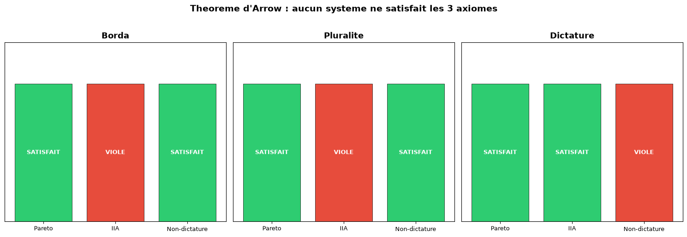
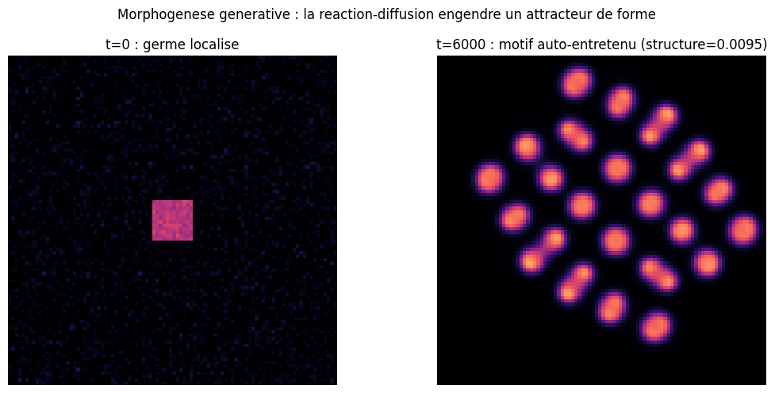
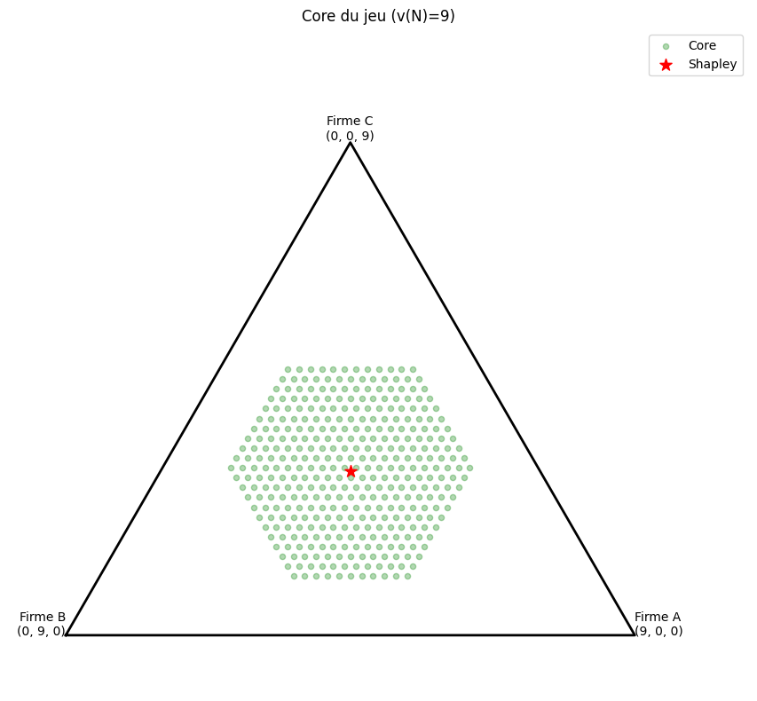
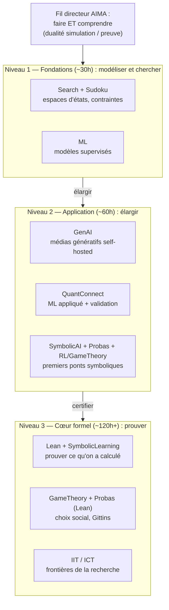
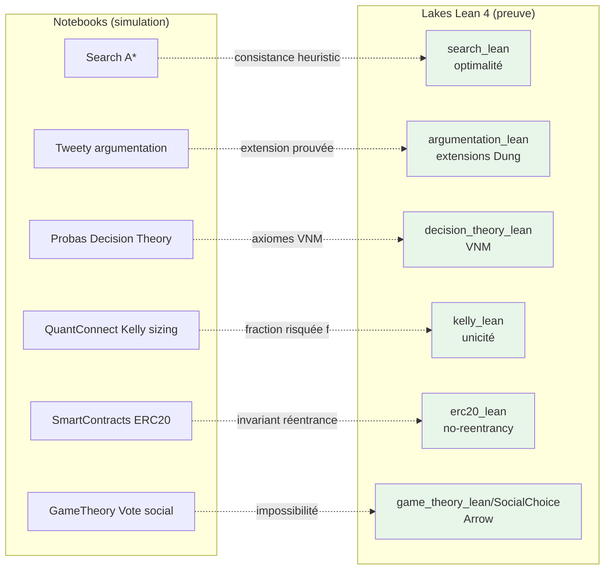

# MyIA.AI.Notebooks - Ecosysteme de Notebooks CoursIA

CoursIA est un curriculum d'intelligence artificielle pensé comme un parcours continu, des fondations jusqu'aux frontières de la recherche. Plutôt qu'une collection d'exemples isolés, il tisse un même fil conducteur à travers onze domaines : on y apprend autant à **faire** — générer des images et de l'audio, entraîner et déployer des modèles, backtester des stratégies de trading, résoudre des problèmes de contraintes — qu'à **comprendre et prouver** : formaliser un théorème en Lean 4, raisonner sur l'incertitude, vérifier qu'un smart contract ou un algorithme se comporte comme attendu.

Deux partis pris structurent l'ensemble. D'abord une **double culture technique** : Python (PyTorch, Diffusers, PyMC, OpenSpiel) et .NET / C# (Semantic Kernel, Infer.NET, ML.NET) cohabitent au sein de notebooks exécutables, parce que l'IA appliquée se pratique dans les deux écosystèmes. Ensuite une **dualité simulation / preuve** : un concept est d'abord illustré numériquement, puis — quand c'est possible — formalisé et vérifié mécaniquement (Lean 4, Z3, vérification formelle). Chaque notebook est rédigé en français, exécutable de bout en bout, et accompagné d'exemples guidés et d'exercices pour un apprentissage en autonomie.

Le catalogue rassemble **plusieurs centaines de notebooks pédagogiques** répartis sur les onze domaines ci-dessous — le décompte exact par série est tenu à jour automatiquement dans le marqueur de catalogue ci-dessous, régénéré quotidiennement, qui fait foi. Une bonne porte d'entrée : **GenAI** pour la création assistée par IA, **QuantConnect** pour le ML appliqué à un domaine concret, ou **Search / GameTheory / SymbolicAI** pour les fondements algorithmiques et formels.

> **À propos des nombres cités dans ce hub** : les **volumes** (notebooks par série, maturité, breakdown) sont *uniquement* ceux du marqueur `CATALOG-STATUS` ci-dessous — c'est lui qui fait foi, pas la prose (leçon #2572 : un compte en dur qui dérive avec le temps est une source de désalignement silencieux). En revanche, les **claims techniques précis** — exemples du livre *Hands-On AI Trading* implémentés, nombre d'architectures testées dans le Ladder ML-Training-Pipeline, lake phare par famille, volumétrie Lean — restent *dans la prose* parce qu'ils sont **spécifiques et stables**, vérifiés à la main dans les README de série correspondants ; un renvoi explicite est ajouté quand c'est utile.

<!-- CATALOG-STATUS
series: ALL
total: 863
breakdown: SymbolicAI=226, GenAI=141, Search=116, QuantConnect=106, Probas=58, GameTheory=55, IIT=53, ML=48, Sudoku=37, RL=17, CaseStudies=6
maturity: BETA=788, ALPHA=46, DRAFT=25, TEMPLATE=4
-->

<sub>*Marqueur auto-régénéré quotidiennement par `.github/workflows/catalog-cron.yml` (file [`COURSE_CATALOG.generated.md`](../COURSE_CATALOG.generated.md) — source de vérité sur les volumes et la maturité). Toute PR qui modifierait ce bloc est refusée par `catalog-guard.yml` (catalog-pr-hygiene R1).*</sub>

Dernière mise à jour : 2026-08-05

## Vue d'ensemble

**[GenAI](GenAI/README.md)** — Tout ce qui se génère : images (SDXL, Flux, Qwen), audio — du TTS au pipeline complet d'audiobook —, vidéo, et le travail des LLMs (RAG, raisonnement, fine-tuning LoRA). La série a un parti pris d'atelier : on ne se contente pas d'appeler des APIs, on héberge les modèles soi-même sur une stack Docker dédiée ([00-GenAI-Environment](GenAI/00-GenAI-Environment/README.md)), ce qui change tout à ce qu'on comprend de leurs coûts et de leurs limites. Elle culmine avec l'orchestration Semantic Kernel, quatre études de cas étudiantes et les ateliers de vibe-coding (Claude Code, Roo Code).

**[QuantConnect](QuantConnect/README.md)** — Le ML appliqué à un domaine qui ne pardonne pas : les marchés. Un cours Python progressif mène du premier backtest à un portefeuille de stratégies cataloguées (cf. breakdown `QuantConnect=105` du marqueur et l'inventaire [`docs/qc/qc-strategies-status.md`](../docs/qc/qc-strategies-status.md) pour la classification 4-types + statut best-guess de chaque projet). Les algorithmes emblématiques — GARCH, Kelly, ensembles — y côtoient les **22 exemples** (sections 06 Applied ML + 07 RL + 08 Risk Mgmt) du livre *Hands-On AI Trading* — **20 fermes + 2 ⚠️ partiels** (section 06 ex.01 Trend Scanning + section 08 ex.02 AI corrective, cf. [`docs/HANDSON_AI_TRADING_MAPPING.md`](QuantConnect/docs/HANDSON_AI_TRADING_MAPPING.md) pour le statut détaillé de chaque exemple). La leçon transversale vaut bien au-delà de la finance : une discipline de validation — walk-forward, multi-seed, coûts de transaction — sans laquelle tout résultat de ML est une illusion d'optique. Le pipeline d'entraînement associé (ML-Training-Pipeline) en est la démonstration grandeur nature : un **Ladder** d'architectures testées (cf. [QC README — section ML-Training-Pipeline](QuantConnect/README.md)) dont seule une fraction bat le baseline après validation multi-seed — un verdict d'honnêteté que la série assume comme résultat pédagogique à part entière.

**[SymbolicAI](SymbolicAI/README.md)** — Le pôle « comprendre et prouver » du dépôt, et sa série la plus vaste : preuves formelles Lean 4 (théorème d'Arrow, Kochen-Specker, hommages à Grothendieck et Conway), smart contracts Solidity testés et déployés sur testnet, Web sémantique RDF/SPARQL, logiques d'argumentation (Tweety), planification PDDL et apprentissage symbolique (ILP, automates, neuro-symbolique). C'est ici que la dualité simulation / preuve prend sa forme la plus aboutie : ce que les autres séries calculent, celle-ci cherche à le certifier.

**[Search](Search/README.md)** — Comment trouver une aiguille dans une botte de foin exponentielle ? Des algorithmes classiques (BFS, A*, Minimax, MCTS) à la programmation par contraintes (CP-SAT) et aux métaheuristiques, la série déroule un fil unique — réduire l'espace de recherche — et le confronte à des applications réelles adaptées de projets étudiants (cf. [Search/Applications/](Search/Applications/) pour l'inventaire à jour — NQueens, planification d'infirmiers, ordonnancement d'atelier, VRP logistique, génération procédurale de niveaux, etc.).

**[Probas](Probas/README.md)** — Raisonner avec l'incertitude plutôt que contre elle. La série a une particularité unique dans le dépôt : les mêmes modèles probabilistes y vivent deux fois, en Infer.NET (graphes de facteurs, C#) et en PyMC (MCMC, Python) — deux langues pour une même théorie bayésienne, dont la comparaison est elle-même instructive. Un **arc décision** de dix notebooks (utilité espérée vNM → bandits → indice de Gittins → Thompson Sampling), lui aussi doublé Infer.NET/PyMC, pousse jusqu'à la preuve avec deux compagnons Lean 4 (axiomes vNM, Gittins).

**[Sudoku](Sudoku/README.md)** — Et si l'on prenait un seul problème et qu'on lui appliquait toutes les méthodes ? Backtracking, propagation de contraintes, Dancing Links, jusqu'aux réseaux de neurones (CNN et MLP comparés à budget de paramètres comparable) : le Sudoku sert de banc d'essai contrôlé où approches symboliques et neuronales se mesurent sur exactement le même terrain.

**[GameTheory](GameTheory/README.md)** — Que devient l'optimisation quand les autres aussi optimisent ? Jeux combinatoires avec OpenSpiel, équilibres à la von Neumann, et un volet formel singulier : les théorèmes du choix social (Arrow, Sen, la valeur de Shapley) portés en Lean 4 — démontrés mécaniquement, pas seulement énoncés.

**[ML](ML/README.md)** — Le machine learning classique, sans folklore : tutoriels ML.NET (classification, régression, clustering) côté C#, agents Python pour la data science côté Python — et des **jumeaux de parité** notebook par notebook (évaluation sklearn ⇄ ML.NET, export ONNX skl2onnx ⇄ OnnxTransformer) qui font toucher du doigt ce que les deux écosystèmes partagent et ce qui les distingue. C'est le socle de méthode sur lequel GenAI et QuantConnect construisent.

**[RL](RL/README.md)** — Apprendre en agissant : Stable-Baselines3, environnements Gym — et un arc *from scratch* en PyTorch pur qui reconstruit DQN, PPO, SAC puis **GRPO**, l'algorithme critic-free de DeepSeek-R1, le tout exécutable sur CPU. Avec, en fil rouge, l'évaluation honnête de ce que valent réellement les politiques apprises.

**[CaseStudies](CaseStudies/README.md)** — Des études de cas interdisciplinaires où plusieurs séries convergent sur un même problème : diagnostic médical assisté par LLM, planification oncologique, analyse de sentiments.

**[IIT](IIT/README.md)** — La plus spéculative : la théorie de l'information intégrée et la mesure Phi (PyPhi) appliquées à des réseaux logiques — où l'on calcule, littéralement, des candidats quantitatifs à une mesure de la conscience. La série prolonge le Phi *statique* vers les **trajectoires** causales avec l'extension **ICT** (*Integrated Causal Trajectories*) : tri auto-organisé comme morphogenèse, émergence causale multi-échelles (Hoel, *Causal Emergence 2.0*). Le banc cross-substrat de l'ICT atteint désormais un **transformer réel** : les activations d'un LLM, lues à travers un autoencodeur parcimonieux (SAE), deviennent un quatrième substrat mesurable aux côtés du tri, de la réaction-diffusion (Gray-Scott) et de la morphodynamique stratégique (Axelrod) — et un axe *Global Workspace* (broadcast, ignition — module `ict/workspace.py`) confronte désormais empiriquement IIT et GWT sur ces mêmes traces, faisant du pont entre les deux grandes théories de la conscience une question **falsifiable** plutôt qu'un débat d'école. La série rejoint ainsi le fil rouge **causalité** du dépôt, où le même opérateur `do(·)` de Pearl s'instancie à travers quatre paradigmes — symbolique (Tweety), message passing (Infer.NET), MCMC (PyMC) et théorie de l'information (ICT).

**[cross-series](cross-series/README.md)** (projets-capstones) — Annexe transversale, distincte des onze domaines ci-dessus : non pas une famille de notebooks supplémentaire, mais des **projets capstones** qui rejouent plusieurs séries sur une même application de bout en bout (ex. [`matching-cv`](cross-series/matching-cv/) : appariement CV ↔ poste par mots-clés, embeddings sémantiques et appariement stable de Gale-Shapley, mobilisant ML, GenAI et GameTheory).

### Progression pédagogique

```text
GenAI
├── 00-GenAI-Environment/ - Setup Docker, GPU, services
├── Image/ - Génération d'images (SDXL, Qwen, Flux)
├── Audio/ - STT, TTS, music, pipeline audiobook FishAudio S2-Pro
├── Video/ - Génération vidéo, animation
├── Texte/ - LLMs, RAG, reasoning, arc agentique + test-time compute
├── SemanticKernel/ - SDK Microsoft
├── FineTuning/ - Fine-tuning LoRA, adapters
├── PostTraining/ - Chaîne SOTA : SFT, DPO, GRPO, RLVR
├── CaseStudies/ - Études de cas étudiants
├── Open-WebUI/ - Plateforme OWUI + série QA Playwright E2E
├── Vibe-Coding/ - Claude-Code + Roo-Code + Claw-Systems + Claudish
└── RAG-et-Memoire-Semantique/ - Qdrant, embeddings, grounding SDDD

QuantConnect
├── Python/ - Cours progressifs QC-Py (fondamentaux → stratégies)
├── projects/ - Stratégies backtestées et ML (GARCH, Kelly, ensemble)
├── ML-Training-Pipeline/ - Pipeline training thermal-safe + Ladder #1409 (6 niveaux)
└── partner-course-quant-trading/ - Cours partenaire Hands-On AI Trading

SymbolicAI
├── SmartContracts/ - Solidity, Web3, blockchain (ERC-20, ERC-721)
├── SemanticWeb/ - RDF, SPARQL, OWL, C# + Python
├── Lean/ - Theorem proving, LeanDojo, hommages (Grothendieck, Conway, FWT)
├── Planners/ - PDDL, Fast-Downward, OR-Tools, LLM planning
├── Tweety/ - Logiques classiques, argumentation (Dung, Walton-Krabbe)
├── SMT/ - Z3, Satisfiability Modulo Theories (LINQ C# + Python)
├── SymbolicLearning/ - ILP, neuro-symbolique, KG-LLM, automates (L*)
└── Argument_Analysis/ - Analyse d'arguments

Search
├── Part1-Foundations/ - BFS, A*, Minimax, MCTS (agents et espaces d'états)
├── Part2-CSP/ - Propagation de contraintes, CP-SAT
├── Part3-Advanced/ - CSP avancés, automates symboliques
├── Part4-Metaheuristics/ - Génétique, recuit, essaims, MGS
├── Applications/ - Projets réels (planning, routage, niveaux)
└── search_lean/ - Lake d'optimalité A* (consistance + heuristique)

Probas
├── Infer/ - notebooks Infer.NET (graphes de facteurs, C#)
├── PyMC/ - notebooks PyMC (MCMC, Python) — miroir Infer
├── DecisionTheory/ - Arc décision DecInfer 1-10 (vNM, Gittins, Thompson) + Causal-Bridges (do(·) Pearl cross-paradigmes)
└── decision_theory_lean/ - Axiomes VNM + Gittins (Lean 4)

Sudoku
└── (à plat) - 19 problèmes × N méthodes : Backtracking → CNN/LLM
    ├── 1..9 méthodologies (Python + C# jumeaux)
    └── 10..19 spécialisations (Z3, OR-Tools, Choco, Lean, LLM, NN)

GameTheory
├── (à plat) - Nash, Minimax, Coopétition, MARL, Mechanism Design
├── SocialChoice/ - Arrow, Sen, Condorcet (Lean 4)
└── *_lean/ + lean_game_defs(_ext)/ - 8 lakes (game_theory_lean [Arrow, Shapley, Stable Marriage], conway_cgt_lean, minimax_lean, repeated_games_lean, social_choice_lean, social_choice_lean_peters [lake de référence externe], lean_game_defs, lean_game_defs_ext — ces deux derniers en `lakefile.toml`, pas `.lean`)

ML
├── ML.Net/ - Tutoriels ML.NET C# (classification, régression, clustering)
└── DataScienceWithAgents/ - Agents Python sklearn + ONNX jumeaux

RL
└── (à plat) - rl_1..13 : DQN, PPO, SAC, GRPO (DeepSeek-R1) from scratch

CaseStudies
├── Diagnostic-Medical/ - LLM-assisted diagnosis
├── Oncology-Planning/ - Planification oncologique
└── SmartGrid-Energy/ - Optimisation énergétique

IIT
├── ICT-Series/ - Integrated Causal Trajectories (4 substrats : tri, Gray-Scott, Axelrod, transformer+SAE)
└── (à plat) - notebooks PyPhi : Intro, Advanced, Coarse-Graining Phi

cross-series/
└── (capstones) - Projets transversaux multi-séries (ex. matching-cv : ML + GenAI + GameTheory)
```

## Galerie de rendus — un aperçu visuel du dépôt

Les onze familles ci-dessus ne sont pas seulement des collections de notebooks : elles produisent des **sorties vérifiables** (figures matplotlib, heatmaps, schémas). Cette galerie en présente quatre emblématiques — choisies pour couvrir quatre paradigmes distincts (choix social formel, morphogenèse, équilibre coopératif, apprentissage multi-agent) et pour montrer ce que la **dualité simulation / preuve** produit concrètement : chaque figure est issue d'un notebook exécuté, et celles qui correspondent à un *théorème-phare* (Arrow, Shapley) ont leur **contrepartie formelle** dans un *lake* Lean 4 de la même famille.

| Famille | Figure | Ce qu'elle montre | Contrepartie formelle |
|---|---|---|---|
| **GameTheory / SocialChoice** |  | **Théorème d'impossibilité d'Arrow** (Arrow 1951) — quand les 3 axiomes (Pareto, IIA, Non-dictature) sont imposés simultanément, *aucun* système de vote ne les satisfait. La figure montre les 9 cellules verdict (3 systèmes × 3 axiomes), chaque violation étant marquée en rouge. | [`game_theory_lean/SocialChoice/Arrow.lean`](GameTheory/game_theory_lean/SocialChoice/Arrow.lean) (sibling [`Arrow_en.lean`](GameTheory/game_theory_lean/SocialChoice/Arrow_en.lean)) — 0 `sorry`, énoncé prouvé mécaniquement. |
| **IIT / ICT-Series** |  | **Morphogenèse Gray-Scott** : à partir d'un germe localisé, la réaction-diffusion engendre spontanément un **attracteur de forme** stable, point de départ de la mesure de *repair_gain* par ablation contrefactuelle `do(·)`. | Pas de lake (résultat numérique), mais ICT-9/ICT-13 utilisent la même instrumentation que les autres strates (le banc cross-substrat d'ICT-15 mesure la même Φ/F/K sur 4 substrats dont celui-ci). |
| **GameTheory (CooperativeGames)** |  | **Core vs Valeur de Shapley** (Shapley 1953, Gillies 1953) — pour un jeu coopératif à 3 firmes (v(N)=9, additif, v(S)=cardinal de S), le *Core* est l'hexagone des allocations coalitionnellement stables, et la **valeur de Shapley** est l'unique allocation equitable au centre. | [`game_theory_lean/CooperativeGames/Shapley.lean`](GameTheory/game_theory_lean/CooperativeGames/Shapley.lean) (sibling `_en.lean`) — 0 `sorry`, résultat prouvé. |
| **GameTheory (MARL)** |  | **CFR sur Kuhn Poker** (Zinkevich et al. 2007) — convergence numérique vers l'équilibre de Nash (valeur du jeu = −0.0556) en 10 000 itérations, avec les fréquences de mise par carte (J/Q/K) rejoignant les étoiles du Nash théorique. | Pas de lake (algo numérique), mais l'**équilibre de Nash** sous-jacent est prouvé formellement dans [`game_theory_lean/`](GameTheory/game_theory_lean/) (cf. branche SocialChoice). |

Les **MANIFEST** correspondants ([GameTheory/assets/readme/MANIFEST.md](GameTheory/assets/readme/MANIFEST.md), [SocialChoice/assets/readme/MANIFEST.md](GameTheory/SocialChoice/assets/readme/MANIFEST.md), [ICT-Series/assets/readme/MANIFEST.md](IIT/ICT-Series/assets/readme/MANIFEST.md)) documentent chaque PNG : *Description visuelle* (audit vision MiniMax M3, juillet 2026), *Alt-text français*, *Contenu réel vérifié* par lecture directe, *Ce qui n'est PAS dans la figure*. La doctrine est connue : une figure README décrit ce qu'on voit réellement, pas ce qu'on voudrait y voir.

## Parité Python / .NET / Lean — différenciant structurant

Le dépôt pratique **explicitement** la double culture IA : Python (PyTorch, Diffusers, PyMC, OpenSpiel) et .NET / C# (Semantic Kernel, Infer.NET, ML.NET) y sont à égalité de traitement, et Lean 4 ancre mathématiquement les résultats phares. Ce tableau reflète l'état réel (langages dominants des notebooks par famille, marqueur `CATALOG-STATUS` source de vérité pour les volumes) :

| Famille | Python | C# / .NET | Lean 4 | Note |
|---------|:---:|:---:|:---:|------|
| GenAI | ● | ◐ | — | Python dominant ; C# pour Semantic Kernel |
| QuantConnect | ● | ◐ | ◐ | Python + LEAN Engine C# + `kelly_lean` |
| SymbolicAI | ● | ◐ | ● | Trilogie complète : Python (SymbolicLearning), C# (Tweety/Z3/SW/SC), Lean (Conway/FWT/Grothendieck) |
| Search | ● | ● | ◐ | Parité CSP livrée — marathon jumeaux accompli (EPIC #4956) |
| Probas | ● | ● | ◐ | Infer.NET + PyMC sur mêmes modèles ; `decision_theory_lean` (VNM + Gittins) |
| Sudoku | ● | ● | ◐ | Backtracking/DLX Python + propagation C# + lake exact-cover |
| GameTheory | ● | ◐ | ● | OpenSpiel Python + jumeau C# (MARL) ; `game_theory_lean` (Arrow + Bondareva-Shapley) |
| ML | ● | ● | ◐ | ML.NET (tutoriels) + jumeaux Python (sklearn, ONNX) + `learning_theory_lean` |
| RL | ● | — | — | Stable-Baselines3 / Gym |
| CaseStudies | ● | — | — | Projets interdisciplinaires |
| IIT / ICT | ● | ◐ | — | PyPhi Python + Tweety C# (causalité commune) |

Légende : ● = présent en masse ; ◐ = présent ciblé ; — = absent.

Cette structure permet au lecteur de **basculer d'un écosystème à l'autre** sur un même concept sans repartir de zéro — c'est précisément le pont pédagogique que les parcours recommandés exploitent. La parité n'est pas un vœu : elle a été construite **jumeau par jumeau** — même problème, même pédagogie, deux écosystèmes — au fil de campagnes systématiques (marathon CSP #4956, twins ML, MARL C#), chaque jumeau étant exécuté de bout en bout avant d'entrer au catalogue.

## Un dépôt vivant — maintenu par une flotte d'agents

CoursIA a une particularité assumée, qui fait partie de ce qu'il enseigne : son développement et sa maintenance quotidienne sont assurés par une **flotte d'agents IA coordonnée multi-machines** (Claude Code), sous revue humaine. Concrètement :

- le **catalogue** ([`COURSE_CATALOG.generated.md`](../COURSE_CATALOG.generated.md)) est régénéré chaque jour par l'automatisation — c'est lui qui fait foi sur les volumes et la maturité, jamais la prose ;
- chaque notebook modifié est **ré-exécuté avant merge** (Papermill / nbconvert) : les sorties committées sont des preuves d'exécution réelles, pas des maquettes ;
- les PRs croisent des **revues indépendantes** (humains et bots) avec des critères anti-complaisance écrits — preuves d'exécution exigées, anti-régression sur les preuves formelles, refus des contournements dégradés quand l'outil réel est installable ;
- les leçons d'incidents deviennent des **règles versionnées** (`.claude/rules/`), relues à chaque session par les agents eux-mêmes.

Le dépôt sert ainsi doublement de support de cours : par son contenu, et comme étude de cas grandeur nature d'**ingénierie logicielle agentique** — dont la série [Vibe-Coding](GenAI/Vibe-Coding/README.md) documente les pratiques.

## Technologies principales

### AI/ML
- **OpenAI**: GPT-4o, GPT-5, gpt-image-1
- **Anthropic**: Claude (via API / Claude Code)
- **Hugging Face**: Transformers, Diffusers, TRL
- **Microsoft**: Semantic Kernel, .NET 9
- **Locaux**: vLLM, Ollama, Qwen 2.5/3.5, Chronos

### QuantConnect / Finance
- **LEAN Engine**: Backtesting, live trading, optimisation
- **sklearn / XGBoost / PyTorch**: Modèles ML financiers
- **QuantConnect Cloud**: projets et backtests cloud (volume exact → [CATALOG-STATUS](#catalog-status) ci-dessus + [hub QuantConnect](QuantConnect/README.md))
- **Hands-On AI Trading**: les **22 exemples** (sections 06 Applied ML + 07 RL + 08 Risk Mgmt) sont mappés aux notebooks de la série — **20 fermes + 2 ⚠️ partiels** (section 06 ex.01 Trend Scanning + section 08 ex.02 AI corrective, cf. [QC README](QuantConnect/README.md) + [`docs/HANDSON_AI_TRADING_MAPPING.md`](QuantConnect/docs/HANDSON_AI_TRADING_MAPPING.md) pour le détail périmètre et le statut ferme/partiel de chaque exemple)

### Infrastructure
- **Docker**: services GenAI (cf. [00-GenAI-Environment](GenAI/00-GenAI-Environment/README.md) pour la stack complète)
- **MCP**: Jupyter automation, QuantConnect MCP server
- **Papermill**: Exécution batch

### Domaines d'étude
- **Computer Vision**: Image, Video, Animation
- **NLP**: LLMs, RAG, Reasoning, Sentiment
- **Audio**: STT, TTS, Voice Cloning, Music
- **Finance**: Trading algorithmique, ML financier, options
- **Symbolic**: RDF, Z3 SMT, Lean 4, SmartContracts
- **Optimization**: CSP, metaheuristiques, recherche opérationnelle

## Configuration requise

### Environnement
- Python 3.10+ avec venv
- .NET 9.0 SDK
- Docker (services GenAI)
- VRAM : recommandée pour la série GenAI (cf. [00-GenAI-Environment/README.md](GenAI/00-GenAI-Environment/README.md) pour les profils GPU par sous-série) ; non requise pour les séries Search/Sudoku/ML/RL/Probas/QC/SymbolicAI (CPU-only pour la plupart)

### Installation
```bash
# Python
cd MyIA.AI.Notebooks/GenAI
python -m venv venv && venv\Scripts\activate
pip install -r requirements.txt

# C#
dotnet restore MyIA.CoursIA.sln
```

### Services Docker
```bash
# Démarrer ComfyUI (nécessaire pour Image/Video)
cd docker-configurations/services/comfyui-qwen
docker-compose up -d
```

## Parcours recommandé

Trois niveaux ordonnés par **difficulté croissante**. Le fil directeur suit l'arc classique de l'intelligence artificielle façon *AIMA* (Russell & Norvig) : on apprend d'abord à **modéliser et chercher** — agents, espaces d'états, contraintes — puis on **élargit** vers les deux écosystèmes applicatifs et les médias génératifs, avant d'atteindre le **cœur formel** où l'on prouve ce qu'on a calculé. Pour une entrée par **centre d'intérêt** plutôt que par niveau, voir les [parcours thématiques](#parcours-thématiques) en fin de section.


```mermaid
flowchart TD
    TH["Fil directeur AIMA :<br/>faire ET comprendre<br/>(dualité simulation / preuve)"]

    subgraph N1["Niveau 1 — Fondations (~30h) : modéliser et chercher"]
        N1a["Search + Sudoku<br/>espaces d'états, contraintes"]
        N1b["ML<br/>modèles supervisés"]
    end

    subgraph N2["Niveau 2 — Application (~60h) : élargir"]
        N2a["GenAI<br/>médias génératifs self-hosted"]
        N2b["QuantConnect<br/>ML appliqué + validation"]
        N2c["SymbolicAI + Probas + RL/GameTheory<br/>premiers ponts symboliques"]
    end

    subgraph N3["Niveau 3 — Cœur formel (~120h+) : prouver"]
        N3a["Lean + SymbolicLearning<br/>prouver ce qu'on a calculé"]
        N3b["GameTheory + Probas (Lean)<br/>choix social, Gittins"]
        N3c["IIT / ICT<br/>frontières de la recherche"]
    end

    TH --> N1
    N1 -->|"élargir"| N2
    N2 -->|"certifier"| N3
```

### Niveau 1 - Fondations (~30h)

Le déclic de ces premières heures n'est pas de générer une image, mais de faire **raisonner** une machine : formaliser un problème en espace d'états, choisir entre explorer et contraindre, mesurer une approche contre une autre sur un même terrain. C'est le socle algorithmique sur lequel tout le reste s'appuie — l'approche promue dans toute la série [Search](Search/README.md).

1. **[Search / Part1-Foundations](Search/Part1-Foundations/README.md)** - agents et espaces d'états ; BFS, A\*, Minimax, MCTS (Search-1 à 7). Le cœur classique de l'IA.
2. **[Sudoku](Sudoku/README.md)** - un seul problème, toutes les méthodes (backtracking, contraintes, Dancing Links, réseaux de neurones) : le banc d'essai où symbolique et neuronal se mesurent à budget égal.
3. **[Search / Part2-CSP](Search/Part2-CSP/README.md)** - CSP-1/2 : le basculement *explorer -> contraindre* (propagation AC-3, forward checking, CP-SAT).
4. **[ML](ML/README.md)** - premiers modèles supervisés (tutoriels ML.NET en C# *ou* agents Python pour la data science) : apprendre depuis les données.

> Mise en route : un `venv` Python et le SDK `.NET 9` suffisent à ce niveau — la stack Docker GenAI n'est requise qu'au Niveau 2. Envie de « faire » tout de suite ? un détour par **[GenAI/Image](GenAI/Image/README.md)** ou les premiers **[QuantConnect/Python](QuantConnect/README.md)** (QC-Py-01 à 05) donne le déclic, mais le fil rouge reste l'algorithmique.

### Niveau 2 - Application et élargissement (~60h)

On ouvre le spectre : les deux écosystèmes (Python *et* .NET), tous les médias génératifs, le raisonnement sous incertitude et les premiers pas symboliques. C'est le moment où les ponts entre séries commencent à apparaître.

1. **[GenAI](GenAI/README.md)** - images, audio, vidéo, texte : on héberge les modèles soi-même ([00-GenAI-Environment](GenAI/00-GenAI-Environment/README.md) requis ici), ce qui change tout à la compréhension de leurs coûts et de leurs limites. (Orchestration -> Niveau 3.)
2. **[QuantConnect / Python](QuantConnect/README.md)** - le cours progressif complet + le partner-course : du premier backtest à la discipline de validation (walk-forward, multi-seed, coûts de transaction) sans laquelle tout résultat ML est une illusion.
3. **[SymbolicAI](SymbolicAI/README.md)** (porte symbolique) - SemanticWeb (RDF/SPARQL), SmartContracts (Solidity testnet), Tweety (logiques et argumentation), Planners (PDDL).
4. **[Probas](Probas/README.md)** - raisonner avec l'incertitude : les mêmes modèles bayésiens en Infer.NET *et* en PyMC.
5. **[RL](RL/README.md)** - apprendre en agissant (PPO, SAC, Gym) ; **[GameTheory](GameTheory/README.md)** - l'optimisation quand les autres aussi optimisent (OpenSpiel, équilibres).

### Niveau 3 - Cœur formel et frontières (~120h+)

Les notebooks les plus exigeants, mais ceux où le dépôt dit ce qu'il a de plus singulier : **prouver** ce qu'on a calculé, et **valider sans complaisance** ce qu'on a appris.

1. **[SymbolicAI / Lean](SymbolicAI/Lean/README.md)** - preuves formelles Lean 4 (théorème d'Arrow, Kochen-Specker, hommages à Grothendieck et Conway) + **[SymbolicLearning](SymbolicAI/SymbolicLearning/README.md)** (ILP, neuro-symbolique, automates L\*).
2. **[GameTheory](GameTheory/README.md)** (volet formel) et **[Probas](Probas/README.md)** (indice de Gittins) - théorèmes du choix social et bandits portés en Lean 4, démontrés mécaniquement.
3. **[Search](Search/README.md) avancé** - métaheuristiques, programmation linéaire, automates symboliques, CSP souples/temporels/distribués, et les applications réelles (planification d'horaires, ordonnancement, routage).
4. **[GenAI / Orchestration + Applications](GenAI/README.md)** - Semantic Kernel, les **[CaseStudies](CaseStudies/README.md)** interdisciplinaires, les ateliers de vibe-coding.
5. **[QuantConnect / projects](QuantConnect/README.md)** - le portefeuille de stratégies ML avancées (GARCH, Kelly, ensembles).
6. **[IIT](IIT/README.md)** - la mesure Phi (PyPhi) sur des réseaux logiques, prolongée vers les trajectoires causales et l'émergence multi-échelles (extension ICT) : la frontière la plus spéculative.

<a id="lean"></a>

#### Pont vers les Preuves Formelles (Lean 4) — différenciant CoursIA

Le Niveau 3 promet de « prouver ce qu'on a calculé » ; le dépôt tient cette promesse par une **couche de lakes Lean 4 / Mathlib** (cf. inventaire à jour dans [SymbolicAI/Lean/README.md](SymbolicAI/Lean/README.md) — la toolchain utilisée est documentée en en-tête de ce README, pas dans ce hub) qui ancre mathématiquement les résultats phares des séries. Pas une anthologie de devoirs formalisés : **un théorème-phare par famille**, validé mécaniquement, et **branché sur les notebooks** qui l'enseignent ou l'utilisent. Cartographie inter-familles :

| Famille | Lake phare | Théorème | Branchement notebook |
|---------|-----------|----------|----------------------|
| **SymbolicAI** (Tweety) | `argumentation_lean` | Théorèmes d'extension (Dung) + pragmatique Walton-Krabbe (cf. `#4046`) | Notebook Tweety + Argument_Analysis |
| **SymbolicAI** (Lean) | `knot_lean` (tricolorabilité Fox GF(3) + Piccirillo), `conway_lean` (Free Will Theorem 0 sorry), `grothendieck_lean` | Nœud trinôme / sliceness, théorème du libre arbitre (Kochen-Specker), visite catégorielle | SymbolicAI/Lean-16a (Conway) + 17a/b (Nœuds) + 15b (Grothendieck) |
| **SymbolicAI** (SC) | `erc20_lean` | Pas de réentrance ERC-20 (cf. `#4047`) | SmartContracts/Erc20 |
| **Search** | `search_lean` | Consistance + heuristique admissible = optimalité (cf. `#4048`) | Search-13 (A*), Part3-Advanced |
| **Probas** | `decision_theory_lean/VNM` | Axiomes VNM ⇔ utilité espérée (cf. `#4049`) | DecisionTheory/DecInfer-1..2 (VNM) + DecInfer-9 (Gittins) |
| **QuantConnect** | `kelly_lean` | Kelly `g(f) ≤ g(f*)` + unicité (cf. `#4052`) | QuantConnect QC-Py-10 Risk Management |
| **GameTheory** | `game_theory_lean` (SocialChoice + CooperativeGames, absorption `#4365`) | Impossibilité d'Arrow + Bondareva-Shapley (0 sorry) | GameTheory/16b-* Choix social |


```mermaid
flowchart LR
    subgraph SIM["Notebooks (simulation)"]
        N1[Search A*]
        N2[Tweety argumentation]
        N3[Probas Decision Theory]
        N4[QuantConnect Kelly sizing]
        N5[SmartContracts ERC20]
        N6[GameTheory Vote social]
    end
    subgraph LEAN["Lakes Lean 4 (preuve)"]
        L1["search_lean<br/>optimalité"]
        L2["argumentation_lean<br/>extensions Dung"]
        L3["decision_theory_lean<br/>VNM"]
        L4["kelly_lean<br/>unicité"]
        L5["erc20_lean<br/>no-reentrancy"]
        L6["game_theory_lean/SocialChoice<br/>Arrow"]
    end
    N1 -. "consistance heuristic" .-> L1
    N2 -. "extension prouvée" .-> L2
    N3 -. "axiomes VNM" .-> L3
    N4 -. "fraction risquée f" .-> L4
    N5 -. "invariant réentrance" .-> L5
    N6 -. "impossibilité" .-> L6
    style L1 fill:#e8f5e9
    style L2 fill:#e8f5e9
    style L3 fill:#e8f5e9
    style L4 fill:#e8f5e9
    style L5 fill:#e8f5e9
    style L6 fill:#e8f5e9
```

Le pipeline complet relie les **notebooks** (qui motivent) aux **lakes** (qui prouvent) et inversement : un notebook Tweety illustre un AF-Dung et cite `argumentation_lean` comme source de l'extension prouvée ; un cours QuantConnect cite `kelly_lean` comme justification formelle de la fraction risquée optimale. Sans la couche Lean, ces résultats seraient des formules réputées « standard » mais jamais démontrées. Avec elle, la justification est formellement garantie — pas seulement empiriquement ajustée.

Pour aller plus loin : [EPIC #4038](https://github.com/jsboige/CoursIA/issues/4038) (Roadmap Lean — un théorème-phare par série), [hub QuantConnect ↔ `kelly_lean`](QuantConnect/README.md), [hub SymbolicAI Lean](SymbolicAI/Lean/README.md).

### Parcours thématiques

Ces niveaux ordonnent par difficulté. Pour une entrée **par centre d'intérêt**, transversale aux niveaux, le dépôt propose cinq parcours thématiques détaillés :

- [IA classique](../docs/curriculum/ia-classique.md) - recherche, CSP, Sudoku, planification
- [IA symbolique](../docs/curriculum/ia-symbolique.md) - Lean, Tweety, SemanticWeb, Planning
- [Recherche avancée](../docs/curriculum/recherche.md) - Infer.NET, Pyro, IIT, RL, GameTheory
- [Trading algorithmique](../docs/curriculum/trading.md) - QuantConnect, ML, Probas
- [GenAI multimodale](../docs/curriculum/genai.md) - Image, Audio, Vidéo, Texte

## Ressources

### Documentation
- [CLAUDE.md](../CLAUDE.md) - Configuration projet
- [GenAI Documentation](GenAI/README.md) - IA Generative
- [QuantConnect Documentation](QuantConnect/README.md) - Trading algorithmique
- [Scripts](../scripts/) - Outils d'automatisation

### Validation

```bash
# Valider les notebooks
python scripts/notebook_tools/notebook_tools.py validate GenAI --quick
python scripts/notebook_tools/notebook_tools.py validate MyIA.AI.Notebooks/ML --quick

# Executer en batch
python scripts/notebook_tools/notebook_tools.py execute GenAI --timeout 300
```

---

Architecture SDDD | Compatible MCP
