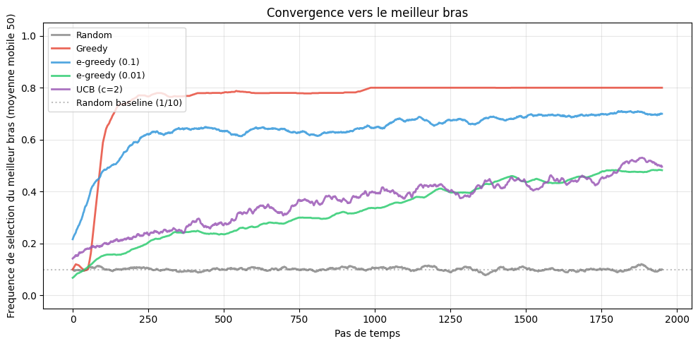
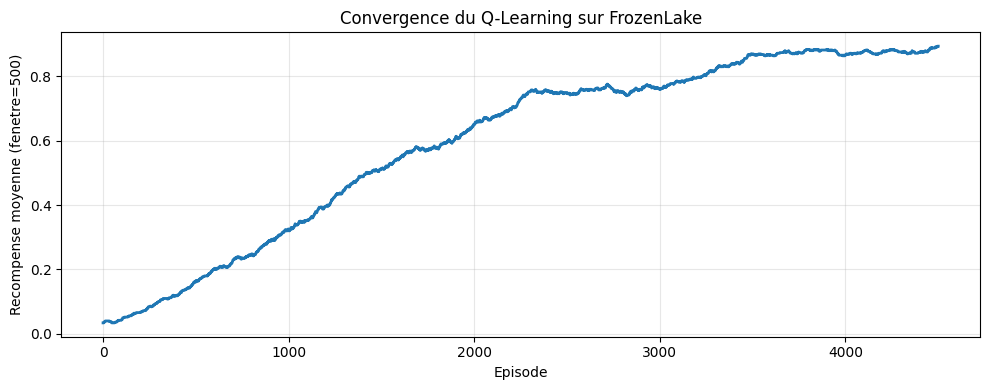
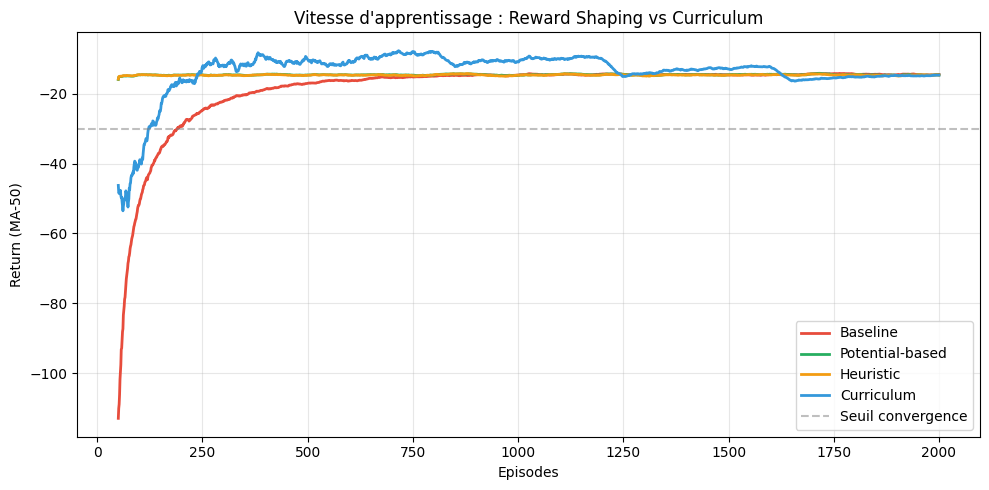
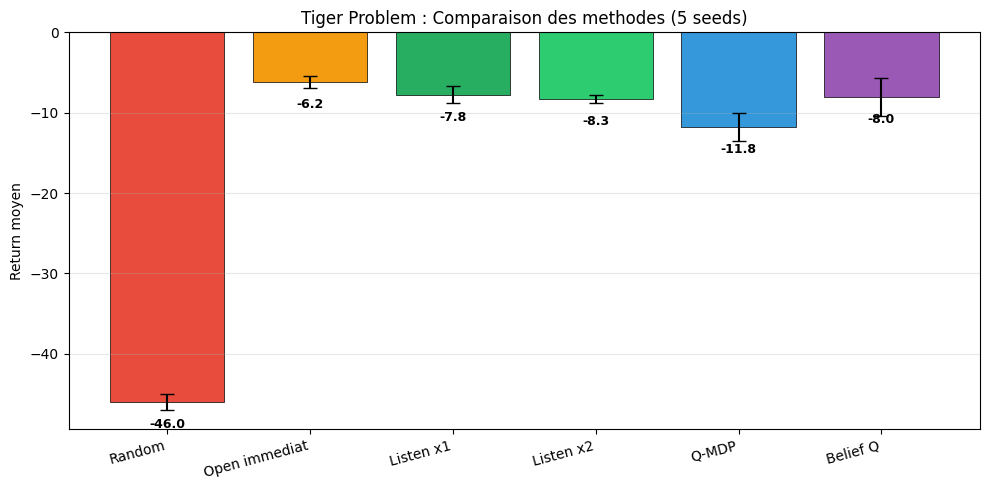
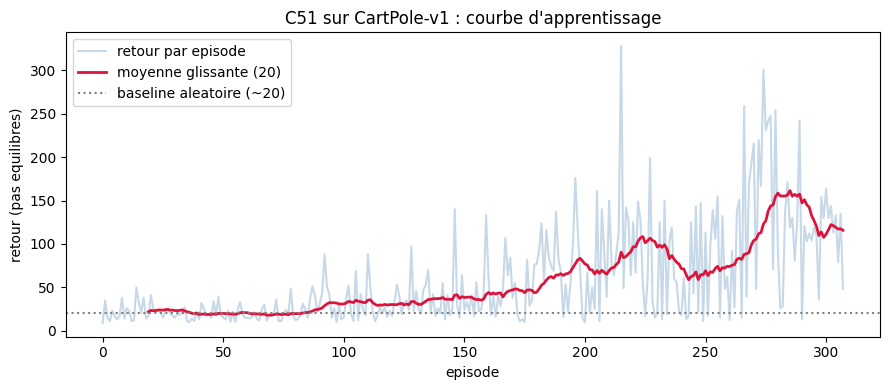
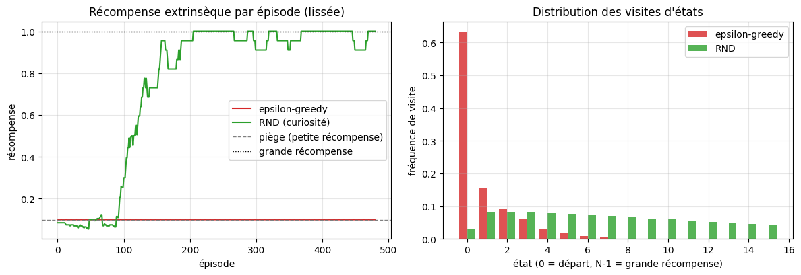

# RL - Reinforcement Learning

[← Notebooks](../README.md) | [↑ ..](../README.md) | [→ GameTheory](../GameTheory/README.md)

<!-- CATALOG-STATUS
series: RL
pedagogical_count: 17
breakdown: root=17
maturity: PRODUCTION=16, BETA=1
-->

Le Reinforcement Learning (apprentissage par renforcement) est la branche de l'IA qui apprend à un agent à prendre des décisions optimales par l'essai et l'erreur, en recevant des récompenses ou des pénalités de son environnement. C'est la technologie derrière AlphaGo, les robots de Boston Dynamics, les systèmes de recommandation de Netflix, et les voitures autonomes. Là où l'apprentissage supervisé prédit à partir d'exemples étiquetés et l'apprentissage non supervisé découvre des structures, le RL **agit** : il choisit des actions, observe leurs conséquences, et s'améliore itérativement.

Cette série couvre les **fondements théoriques** (bandits, MDP, équation de Bellman, Q-Learning), les **algorithmes avec réseaux de neurones** (DQN, Policy Gradient, PPO) et les **frameworks de production** (Stable Baselines3). Vous commencerez par entraîner un agent en quelques lignes avec un framework industriel, puis vous implémenterez les mêmes algorithmes depuis zéro pour comprendre ce qui se cache sous le capot.

**À qui s'adresse cette série** : étudiants en IA, développeurs souhaitant ajouter des capacités décisionnelles à leurs applications, et chercheurs en automatique ou robotique. Prérequis : Python intermédiaire et bases en calculus (gradients). Aucune expérience RL préalable nécessaire pour le notebook 1.

## Aperçu — l'apprentissage par renforcement en images

Le RL se comprend mieux en voyant l'agent apprendre. Les six visualisations ci-dessous, extraites des notebooks de la série, suivent la progression des fondements aux frontières : du bandit multi-bras à l'exploration par curiosité, en passant par les MDP, le reward shaping, les POMDP et le RL distributionnel. Sorties d'exécution **réelles** (non régénérées pour l'illustration, règle C.3), downscalées à ≤1200 px et ≤200 ko (politique EPIC #5654). Provenance exacte dans [`assets/readme/MANIFEST.md`](assets/readme/MANIFEST.md).

| | | |
|:--:|:--:|:--:|
|  |  |  |
| [rl_4 — Multi-Armed Bandits](rl_4_multi_armed_bandits.ipynb) | [rl_5 — MDP / Q-Learning](rl_5_mdp_dp_qlearning.ipynb) | [rl_10 — Reward Shaping](rl_10_reward_shaping.ipynb) |
|  |  |  |
| [rl_11 — POMDP](rl_11_pomdp.ipynb) | [rl_12 — Distributional RL](rl_12_distributional_rl.ipynb) | [rl_13 — Curiosity](rl_13_curiosity_exploration.ipynb) |

## Notebooks

| # | Notebook | Contenu | Durée |
|---|----------|---------|-------|
| 1 | [rl_1_intro_cartpole](rl_1_intro_cartpole.ipynb) | Introduction PPO, CartPole | 25-30 min |
| 2 | [rl_2_wrappers_sauvegarde_callbacks](rl_2_wrappers_sauvegarde_callbacks.ipynb) | Wrappers, sauvegarde, callbacks | 35-40 min |
| 3 | [rl_3_experience_replay_dqn](rl_3_experience_replay_dqn.ipynb) | HER, goal-conditioned RL | 40-45 min |
| 4 | [rl_4_multi_armed_bandits](rl_4_multi_armed_bandits.ipynb) | Bandits manchots, exploration vs exploitation, Thompson Sampling | 30-35 min |
| 5 | [rl_5_mdp_dp_qlearning](rl_5_mdp_dp_qlearning.ipynb) | MDP, Value/Policy Iteration, Q-Learning tabulaire | 45-50 min |
| 6 | [rl_6_dqn_policy_gradient](rl_6_dqn_policy_gradient.ipynb) | DQN depuis zéro, REINFORCE | 50-55 min |
| 6b | [rl_6b_actor_critic](rl_6b_actor_critic.ipynb) | Actor-Critic (A2C) depuis zéro, advantage, entropy bonus | 45-50 min |
| 6c | [rl_6c_ppo_from_scratch](rl_6c_ppo_from_scratch.ipynb) | PPO depuis zéro, clipped surrogate, GAE, comparaison A2C vs PPO | 45-50 min |
| 6d | [rl_6d_sac_from_scratch](rl_6d_sac_from_scratch.ipynb) | SAC depuis zéro, maximum entropy RL, twin Q-networks, auto-température | 45-50 min |
| 6e | [rl_6e_grpo_from_scratch](rl_6e_grpo_from_scratch.ipynb) | GRPO depuis zéro (DeepSeek-R1), avantage relatif intra-groupe (sans critic), clip PPO + KL vs référence, portefeuille synthétique multi-seed | 45-50 min |
| 7 | [rl_7_multi_agent_rl](rl_7_multi_agent_rl.ipynb) | Multi-Agent RL, PettingZoo, IQL | 45-50 min |
| 8 | [rl_8_model_based_dyna_q](rl_8_model_based_dyna_q.ipynb) | Model-based RL : Dyna-Q, Dyna-Q+, planification, rollouts | 45-50 min |
| 9 | [rl_9_offline_rl](rl_9_offline_rl.ipynb) | RL offline : Behavior Cloning, erreur d'extrapolation, BCQ-lite | 50-55 min |
| 10 | [rl_10_reward_shaping](rl_10_reward_shaping.ipynb) | Reward Shaping (Ng 1999), curriculum learning, pont RLHF | 45-50 min |
| 11 | [rl_11_pomdp](rl_11_pomdp.ipynb) | POMDP, Tiger Problem, belief tracking, Q-MDP | 45-50 min |
| 12 | [rl_12_distributional_rl](rl_12_distributional_rl.ipynb) | RL distributionnel : C51 (Categorical DQN) depuis zéro, projection catégorielle, politique CVaR | 50-55 min |
| 13 | [rl_13_curiosity_exploration](rl_13_curiosity_exploration.ipynb) | Exploration par curiosité (RND), motivation intrinsèque, piège d'exploitation | 35-40 min |

## Contenu détaillé

### Notebook 1 - Introduction avec PPO et CartPole

| Section | Contenu |
|---------|---------|
| Stable Baselines3 | Installation, API de base |
| CartPole-v1 | Environnement classique, actions discrètes |
| PPO | Proximal Policy Optimization |
| Workflow | Training, Évaluation, Video recording |

### Notebook 2 - Fonctionnalités avancées

| Section | Contenu |
|---------|---------|
| Wrappers Gym | Modification d'environnements |
| Sauvegarde | Save/Load de modèles |
| Multiprocessing | DummyVecEnv, SubprocVecEnv |
| Callbacks | Monitoring, checkpoints automatiques |
| Environnements custom | Création et validation (check_env) |

### Notebook 3 - Experience Replay et HER

| Section | Contenu |
|---------|---------|
| HER | Hindsight Experience Replay |
| Goal-conditioned RL | Tâches avec objectifs |
| Parking-v0 | Environnement highway-env |
| SAC / DDPG | Algorithmes off-policy avec HER |
| Replay buffers | Sauvegarde et chargement |

### Notebook 4 - Bandits Manchots et Exploration

| Section | Contenu |
|---------|---------|
| Multi-armed bandit | Problème fondamental exploration vs exploitation |
| Stratégies naïves | Aléatoire, greedy, epsilon-greedy |
| Stratégies intelligentes | Decaying epsilon-greedy, Thompson Sampling |
| Analyse | Comparaison regret, visualisation des estimations |

### Notebook 5 - MDP, Programmation Dynamique et Q-Learning

| Section | Contenu |
|---------|---------|
| MDP | Formalisation $(S, A, P, R, \gamma)$, transitions |
| Value Iteration | Équation de Bellman, convergence |
| Policy Iteration | Évaluation + amélioration de politique |
| Q-Learning tabulaire | Apprentissage model-free, $\varepsilon$-greedy |
| FrozenLake / CliffWalking | Environnements discrets |

### Notebook 6 - DQN et Policy Gradient

| Section | Contenu |
|---------|---------|
| Q-Network | Approximation par réseau de neurones |
| Replay Buffer | Experience replay, décorrélation |
| Target Network | Stabilisation de l'apprentissage |
| REINFORCE | Gradient de politique, baseline |
| Comparaison | Value-based vs policy-based |

### Notebook 6b - Actor-Critic (A2C)

| Section | Contenu |
|---------|---------|
| Actor-Critic | Paradigme combinant value-based et policy-based |
| CriticNetwork | Réseau de valeur V(s) |
| ActorNetwork | Politique paramétrée pi(a\|s) |
| A2C | Advantage Actor-Critic, calcul de l'avantage |
| Entropy bonus | Exploration via maximisation d'entropie |
| Comparaison | A2C vs REINFORCE (réduction de variance) |

### Notebook 6c - PPO depuis zéro

| Section | Contenu |
|---------|---------|
| Clipped surrogate | Ratio de probabilité, objectif clippé, visualisation |
| PPO Agent | Implémentation complète avec mini-lots et epochs |
| GAE | Generalized Advantage Estimation (lambda=0.95) |
| Comparaison | PPO vs A2C (stabilité, efficacité d'échantillonnage) |

### Notebook 6d - SAC depuis zéro

| Section | Contenu |
|---------|---------|
| Maximum Entropy RL | Objectif avec bonus d'entropie, exploration automatique |
| Gaussian Policy | Politique stochastique avec tanh squashing |
| Twin Q-Networks | Double critique pour réduire la surestimation |
| Auto-température | Température alpha apprise automatiquement |
| Reparameterization | Trick pour gradient dans l'action |
| Pendulum-v1 | Environnement continu de référence |

### Notebook 6e - GRPO depuis zéro

| Section | Contenu |
|---------|---------|
| Avantage relatif sans critic | Group Relative Policy Optimization (DeepSeek-R1), baseline de groupe au lieu d'un réseau critique |
| Portfolio synthétique | Environnement auto-contenu, signal de récompense reproductible multi-seed |
| Actor seul | Réseau de politique unique sans critic (contrairement à PPO/A2C/SAC) |
| Mise à jour GRPO | Avantage intra-groupe + clip PPO + pénalité KL vs politique de référence |
| Boucle multi-seed | Entraînement multi-seed, verdict de stabilité |
| GRPO vs PPO/SAC | Ce que change le paradigme sans critic |

### Notebook 7 - Apprentissage Multi-Agent

| Section | Contenu |
|---------|---------|
| Multi-Agent RL | Paradigmes (coopératif, compétitif, mixte) |
| PettingZoo | API AEC, environnements multi-agent |
| IQL | Independent Q-Learning |
| TicTacToe | Jeu à somme nulle, équilibre |
| Self-play | Entraînement agent contre agent |

### Notebook 8 - Model-Based RL : Dyna-Q et planification

| Section | Contenu |
|---------|---------|
| Model-free vs model-based | Compromis calcul vs expérience, sample efficiency |
| Modèle du monde | Apprentissage tabulaire des transitions (s,a) -> (r,s') |
| Dyna-Q | Q-Learning + planification sur expérience simulée (Sutton & Barto ch. 8) |
| Blocking Maze / Dyna-Q+ | Environnement changeant, bonus d'exploration kappa*sqrt(tau) |
| Decision-time planning | Rollouts, pont vers MCTS / AlphaZero / MuZero |
| Exercices | Shortcut Maze, prioritized sweeping, sensibilité de kappa |

### Notebook 9 - RL offline : apprendre sans interagir

| Section | Contenu |
|---------|---------|
| Online vs offline | Apprendre d'un dataset figé de transitions (logs), sans interaction |
| Datasets | Trois politiques de comportement (expert/medium/random), couverture vs qualité |
| Behavior Cloning | Imitation tabulaire par action majoritaire, plafond de la politique de comportement |
| Erreur d'extrapolation | Q-learning naïf sur dataset figé : bootstrap sur actions fantômes (Fujimoto 2019) |
| BCQ-lite | Contrainte de support du dataset, stitching de trajectoires médiocres |
| Pont RLHF/DPO | SFT = BC, contrainte KL = contrainte de support, DPO = preference learning offline |
| Exercices | Ablation taille dataset, pénalité CQL-lite, sensibilité au nombre de passes |

### Notebook 10 - Reward Shaping et Curriculum Learning

| Section | Contenu |
|---------|---------|
| Labyrinthe sparse | Maze 8x8, reward -1/pas et 0 au but, distance Manhattan = 14 |
| Potential-based shaping | Théorème Ng et al. 1999, $F(s,s') = \gamma\Phi(s') - \Phi(s)$, politique invariante |
| Heuristic shaping | Bonus naïf pour se rapprocher du but, sans garantie théorique |
| Curriculum learning | Phases de difficulté croissante, start de plus en plus éloigné |
| Comparaison | Vitesse de convergence (potential : ep 50, curriculum : ep 122, baseline : ep 190) |
| Pont RLHF | Reward model appris, contrainte KL, DPO, inverse RL |
| Exercices | Ablation potentiels, phases curriculum, biais du shaping naïf |

### Notebook 11 - POMDP : Partial Observability et Belief Tracking

| Section | Contenu |
|---------|---------|
| Tiger Problem | POMDP classique (Cassandra 1994), 2 états, 3 actions, observations bruitées à 85% |
| Politiques baselines | Random, open immediately, listen N fois puis ouvre, vote majoritaire |
| Belief tracking | Filtre bayésien sur P(tiger-left), mise à jour après observation |
| Q-MDP approximation | Q-learning sur états vrais, sélection via expected Q sous belief |
| Belief-state Q-learning | Discrétisation du belief en 20 bins, Q-learning dans l'espace des croyances |
| Comparaison | 5 seeds, impact de la précision d'observation, pont DRQN/PPO+LSTM |
| Exercices | Impact précision, nombre optimal d'écoutes, Tiger 3 portes |

### Notebook 12 - RL distributionnel : C51 (Categorical DQN)

| Section | Contenu |
|---------|---------|
| Du scalaire à la distribution | Pourquoi apprendre $Z(s,a)$ tout entière plutôt que sa seule espérance $Q = \mathbb{E}[Z]$ ; support catégoriel à 51 atomes fixes |
| Bellman distributionnel | Opérateur $TZ = R + \gamma Z(s',a^*)$, problème du déplacement hors-grille, projection catégorielle $\Phi$ |
| Réseau `CategoricalDQN` | Sorties softmax par action, reconstruction de $Q(s,a) = \sum_i z_i p_i$ |
| Perte | Entropie croisée entre cible projetée et distribution prédite |
| Entraînement CartPole-v1 | ~18 000 pas, courbe d'apprentissage, visualisation de la distribution de retour apprise par action |
| C51 vs DQN | Tableau comparatif, lignée QR-DQN / IQN / Rainbow |
| Exercices | QR-DQN (quantile regression), sensibilité du support, politique sensible au risque (CVaR) |

### Notebook 13 - Exploration par curiosité : Random Network Distillation (RND)

| Section | Contenu |
|---------|---------|
| Exploration profonde | Pourquoi l'aléa (epsilon-greedy) échoue dès que la récompense est parcimonieuse |
| Motivation intrinsèque | Bonus de nouveauté $r = r^e + \beta\,r^i$, exploration dirigée vers l'inexploré |
| Mécanisme RND | Cible aléatoire figée + prédicteur entraîné ; erreur de prédiction = nouveauté (Burda et al. 2018) |
| Partie A - détecteur de nouveauté | Jouet 2D, carte de nouveauté, ratio inconnu/visité ~1969x |
| Partie B - piège d'exploitation | Chaîne MDP : epsilon-greedy plafonne sur le piège (~0.10), RND atteint la grande récompense (~0.96) |
| Comparaison | RND vs comptage tabulaire / pseudo-comptage / ICM, problème de la noisy-TV, réglage du taux du prédicteur |
| Exercices | Effet de beta, normalisation du bonus intrinsèque (Welford), limites de la curiosité (longueur de chaîne) |

## Algorithmes couverts

| Algorithme | Type | Notebook | Utilisation |
|------------|------|----------|-------------|
| **PPO** | On-policy | 1, 2, 6c | Contrôle général, robuste |
| **A2C** | On-policy | 2, 6b | Actor-Critic depuis zéro et via SB3 |
| **GAE** | Advantage | 6c | Generalized Advantage Estimation |
| **SAC** | Off-policy | 3, 6d | Actions continues, maximum entropy |
| **GRPO** | On-policy (critic-free) | 6e | Avantage relatif au groupe — l'algorithme RL de DeepSeek-R1, pont vers le RLHF |
| **DDPG** | Off-policy | 3 | Actions continues |
| **HER** | Replay strategy | 3 | Goal-conditioned tasks |
| **Epsilon-greedy** | Exploration | 4 | Stratégie d'exploration basique |
| **Thompson Sampling** | Exploration | 4 | Exploration bayésienne |
| **Value Iteration** | Model-based | 5 | Résolution exacte de MDP |
| **Policy Iteration** | Model-based | 5 | Résolution exacte de MDP |
| **Q-Learning** | Model-free (tabulaire) | 5 | Espaces discrets |
| **Dyna-Q** | Model-based | 8 | Planification sur modèle appris, sample efficiency |
| **Dyna-Q+** | Model-based | 8 | Environnements non-stationnaires, bonus d'exploration |
| **Rollout planning** | Decision-time | 8 | Simulation vers l'avant, porte vers MCTS |
| **Behavior Cloning** | Offline (imitation) | 9 | Démonstrations expertes, baseline offline |
| **BCQ-lite** | Offline (value-based) | 9 | Q-learning contraint au support du dataset |
| **Potential-based shaping** | Reward shaping | 10 | Accélération convergence sans biais (Ng 1999) |
| **Curriculum learning** | Training strategy | 10 | Difficulté progressive, généralisation |
| **Q-MDP** | POMDP approximation | 11 | Q-learning sur états vrais, action via belief |
| **Belief-state Q-learning** | POMDP | 11 | Discrétisation du belief, Q-table dans l'espace des croyances |
| **C51 (Categorical DQN)** | Distributionnel (deep) | 12 | Distribution de retour sur support fixe, projection catégorielle |
| **DQN** | Off-policy (deep) | 6 | Espaces continus |
| **REINFORCE** | Policy gradient | 6 | Politique directe |
| **IQL** | Multi-agent | 7 | Apprentissage indépendant |
| **RND** | Exploration intrinsèque (deep) | 13 | Récompense parcimonieuse, exploration profonde par nouveauté |

## Environnements

| Environnement | Type | Notebook |
|---------------|------|----------|
| CartPole-v1 | Contrôle classique, discret | 1, 6, 6b, 6c |
| Pendulum-v1 | Contrôle continu | 2, 6d |
| Parking-v0 | Goal-conditioned, continu | 3 |
| GaussianBandit | Bandit stochastique | 4 |
| FrozenLake-v1 | Grille discrète, stochastique | 5 |
| CliffWalking-v1 | Grille, compromis risque/récompense | 5 |
| TicTacToe-v3 | Jeu à somme nulle | 7 |
| Dyna Maze / Blocking Maze | Grilles déterministes et changeantes (numpy pur) | 8, 9 |
| Portefeuille synthétique | Allocation d'actifs, auto-contenu (PyTorch pur, aucune donnée externe) | 6e |

## Prerequisites

### Connaissances requises

- Python intermédiaire (classes, numpy)
- Concepts RL de base (agent, environnement, reward)
- Pas d'expérience RL préalable nécessaire pour le notebook 1
- Bases PyTorch pour les notebooks 6, 6b, 6c, 6d, 6e (tenseurs, autograd, Module)

### Installation

```bash
# Environnement Python
python -m venv venv
venv\Scripts\activate  # Windows

# Dépendances de base (notebooks 1-4)
pip install "stable-baselines3[extra]>=2.0.0a4" gymnasium numpy pandas matplotlib

# Pour le notebook 3 (parking environment)
pip install highway-env moviepy

# Pour le notebook 4 (bandits — pas de dépendance supplémentaire)

# Pour les notebooks 6, 6b, 6c, 6d, 6e (DQN, REINFORCE, A2C, PPO, SAC, GRPO)
pip install torch

# Pour le notebook 7 (multi-agent)
pip install "pettingzoo[classic]>=1.24.0"
```

### Dépendances

| Package | Version | Utilisation |
|---------|---------|-------------|
| stable-baselines3 | >=2.0.0a4 | Algorithmes RL (notebooks 1-3) |
| gymnasium | latest | Interface environnements |
| numpy | latest | Calcul numérique |
| pandas | >=2.0 | Tableaux de résultats (notebook 5) |
| matplotlib | latest | Visualisation |
| torch | latest | Réseaux de neurones (notebooks 6, 6b, 6c, 6d, 6e) |
| pettingzoo | >=1.24.0 | Multi-agent (notebook 7) |
| highway-env | latest | Parking-v0 (notebook 3) |
| moviepy | latest | Enregistrement vidéo |

## Parcours recommandé

```
Notebook 1 (Bases SB3)
    |
    v
Notebook 4 (Bandits) ---> Notebook 5 (MDP / Q-Learning) ---> Notebook 6 (DQN / REINFORCE)
    |                                                          |
    v                                                          v
Notebook 2 (Production features)                           Notebook 6b (A2C) ---> Notebook 6c (PPO) ---> Notebook 6d (SAC) ---> Notebook 6e (GRPO)
    |                                                                               |
    v                                                                               v
Notebook 3 (Goal-conditioned RL)                                                 Notebook 7 (Multi-Agent) ---> Notebooks 8-13
                                                                                 (model-based, offline, shaping, POMDP, distributionnel, curiosité/RND)
```

| Objectif | Notebooks |
|----------|-----------|
| Découverte rapide | 1 uniquement |
| Exploration et bandits | 4 + 13 (curiosité / RND) |
| Fondations SB3 | 1 + 2 + 3 |
| Fondements théoriques | 4 + 5 + 6 + 7 + 8 |
| Maîtrise complète | 1 à 13 |

### Parcours d'apprentissage

**Phase 1 : Prise en main production (~1h, notebooks 1-2)**

Le notebook 1 pose les bases : vous installez Stable Baselines3, créez votre premier agent PPO sur CartPole, et visualisez ses performances. En 30 minutes, vous avez un agent entraîné qui équilibre un bâton. Le notebook 2 enrichit cette base avec les outils de production : wrappers pour modifier les environnements, callbacks pour monitorer l'entraînement, et multiprocessing pour accélérer les expériences.

**Phase 2 : Problèmes avancés (~1.5h, notebook 3)**

Le notebook 3 introduit les tâches à objectifs (goal-conditioned RL) avec l'algorithme HER (Hindsight Experience Replay). Vous résoudrez un problème de parking autonome où l'agent doit atteindre une position cible. C'est le passage de "équilibrer un bâton" à "garer une voiture" — un saut qualitatif qui montre la puissance du RL.

**Phase 3 : Exploration et bandits (~30min, notebook 4)**

Le notebook 4 pose la question fondatrice du RL : comment choisir entre explorer de nouvelles options et exploiter ce qui fonctionne déjà ? Vous implémenterez des stratégies d'exploration (epsilon-greedy, decaying epsilon, Thompson Sampling) sur un problème de bandits manchots et comparerez leur regret cumulé.

**Phase 4 : Les maths sous le capot (~10h, notebooks 5-13)**

Les notebooks 5 à 12 quittent le framework pour implémenter les algorithmes depuis zéro. Le notebook 5 formalise le problème RL (MDP, équation de Bellman, Value/Policy Iteration) et introduit le Q-Learning tabulaire sur FrozenLake et CliffWalking. Le notebook 6 passe à l'échelle avec les réseaux de neurones : DQN et REINFORCE implémentés en PyTorch pur. Le notebook 6b introduit l'architecture Actor-Critic (A2C). Le notebook 6c pousse plus loin avec PPO et son mécanisme de clipping, introduit GAE, et compare les approches. Le notebook 6d approfondit avec SAC (Soft Actor-Critic) et le framework maximum entropy pour les actions continues. Le notebook 6e clôt la lignée policy-gradient avec **GRPO** (Group Relative Policy Optimization, l'algorithme d'entraînement RL de DeepSeek-R1) : l'avantage y est estimé par comparaison au sein d'un groupe de rollouts, sans réseau critique — le pont le plus direct de la série vers le RLHF des LLMs. Le notebook 7 aborde le multi-agent : plusieurs agents qui apprennent simultanément, coopèrent ou s'affrontent (TicTacToe avec self-play). Le notebook 8 ouvre la voie model-based : apprendre un modèle du monde et planifier dessus (Dyna-Q, Dyna-Q+, rollouts), avec les ponts vers MCTS, AlphaZero et MuZero. Le notebook 9 retire le droit d'interagir : apprendre d'un dataset figé (RL offline), avec le Behavior Cloning, l'erreur d'extrapolation du Q-learning naïf, la contrainte de support (BCQ-lite) et le pont vers RLHF/DPO. Le notebook 10 s'attaque au problème du reward sparse : comment guider l'agent quand la récompense est rare ? Le reward shaping potential-based (Ng et al. 1999) accélère la convergence sans biaiser la politique optimale, le curriculum learning organise la difficulté progressive, et le pont vers RLHF montre que le reward model appris est un shaping automatisé. Le notebook 11 aborde la partial observability : l'agent ne voit plus l'état vrai mais une observation bruitée. Le Tiger Problem (Cassandra 1994) illustre le POMDP, le belief tracking (filtre bayésien) maintient une estimation de l'état caché, et le Q-MDP approximation montre les limites de l'approche tabulaire. Le notebook 12 enrichit l'objectif lui-même : au lieu d'apprendre l'espérance du retour comme un DQN, C51 (Categorical DQN, Bellemare et al. 2017) apprend sa **distribution complète** $Z(s,a)$ sur un support à atomes fixes, via une projection catégorielle de la cible de Bellman — ce qui débloque les politiques sensibles au risque (CVaR) impossibles avec une valeur scalaire, et ouvre la lignée QR-DQN / IQN / Rainbow. Le notebook 13 termine sur l'exploration par motivation intrinsèque : RND (Random Network Distillation) transforme l'erreur de prédiction d'un réseau cible figé en bonus de nouveauté, débloquant les récompenses parcimonieuses hors de portée d'epsilon-greedy.

## Concepts clés

| Concept | Description | Notebook |
|---------|-------------|----------|
| **Agent** | Entité qui apprend et prend des décisions | 1 |
| **Environnement** | Monde avec lequel l'agent interagit | 1 |
| **Reward** | Signal de feedback pour l'apprentissage | 1 |
| **Policy** | Stratégie de l'agent (state vers action) | 1 |
| **Value function** | Estimation des rewards futurs | 5 |
| **MDP** | Formalisation mathématique du problème RL | 5 |
| **Bellman equation** | Relation de récurrence pour V et Q | 5 |
| **Exploration vs exploitation** | Compromis entre tester et exploiter | 4 |
| **Regret** | Mesure de performance cumulative en bandit | 4 |
| **Thompson Sampling** | Exploration bayésienne optimale | 4 |
| **Experience replay** | Réutilisation des expériences passées | 3, 6 |
| **Clipped surrogate** | Mécanisme central de PPO | 6c |
| **GAE** | Compromis biais-variance pour l'avantage | 6c |
| **HER** | Réinterprétation d'échecs comme succès | 3 |
| **DQN** | Q-Learning avec approximation neurale | 6 |
| **Actor-Critic** | Combinaison politique + valeur | 6b |
| **Advantage** | Réduction de variance A_t = R_t - V(s) | 6b |
| **Maximum entropy RL** | Maximisation récompense + entropie | 6d |
| **SAC** | Soft Actor-Critic, off-policy continu | 6d |
| **Twin Q-networks** | Double critique anti-surestimation | 6d |
| **GRPO** | Avantage relatif au groupe, sans critique — l'algorithme RLHF de DeepSeek-R1 | 6e |
| **Policy gradient** | Optimisation directe de la politique | 6 |
| **Multi-agent** | Plusieurs agents apprenant simultanément | 7 |
| **Model-based RL** | Apprendre un modèle du monde et planifier dessus | 8 |
| **Dyna** | Entrelacement apprentissage direct / planification | 8 |
| **Sample efficiency** | Échanger du calcul contre de l'expérience réelle | 8 |
| **Decision-time planning** | Rollouts et MCTS depuis l'état courant | 8 |
| **RL offline** | Apprendre d'un dataset figé, sans interaction | 9 |
| **Erreur d'extrapolation** | Bootstrap sur actions hors du support des données | 9 |
| **Stitching** | Recoudre un chemin optimal à partir de trajectoires médiocres | 9 |
| **Reward shaping** | Modifier le signal de récompense pour guider l'apprentissage | 10 |
| **Potential-based shaping** | Shaping garantissant l'invariance de la politique optimale (Ng 1999) | 10 |
| **Curriculum learning** | Présenter les tâches par difficulté croissante | 10 |
| **POMDP** | MDP avec observations partielles et bruitées | 11 |
| **Belief state** | Distribution de probabilité sur les états cachés | 11 |
| **Belief tracking** | Filtre bayésien pour mettre à jour le belief | 11 |
| **RL distributionnel** | Apprendre la distribution complète du retour $Z(s,a)$, pas seulement $\mathbb{E}[Z]$ | 12 |
| **Projection catégorielle** | Redistribuer la cible de Bellman sur un support à atomes fixes | 12 |
| **Politique sensible au risque (CVaR)** | Choisir selon la queue basse de la distribution, hors de portée d'un DQN scalaire | 12 |
| **Motivation intrinsèque** | Récompense de nouveauté pour guider l'exploration | 13 |
| **Random Network Distillation** | Erreur de prédiction d'une cible figée comme mesure de nouveauté | 13 |
| **Exploration profonde** | Atteindre une récompense cachée derrière une longue séquence d'actions | 13 |

## Caractéristiques

- **Compatible Windows** : Pas de dépendance xvfb
- **Débutant-friendly** : Progression pédagogique
- **Production-ready** : Checkpointing, monitoring (notebooks 1-3)
- **From scratch** : Implémentations sans framework (notebooks 4-7)
- **Exercices** : Manipulations et explorations dans chaque notebook

## FAQ

### Quelle est la différence entre RL et apprentissage supervisé ?

L'apprentissage **supervisé** apprend à partir de données étiquetées (entrée -> sortie correcte). Le RL apprend par **interaction** : l'agent prend des actions, reçoit des récompenses/pénalités, et ajuste sa stratégie. Il n'y a pas de "bonne réponse" fournie — l'agent doit découvrir quelles actions maximisent la récompense cumulée. Le RL est pertinent quand le problème est séquentiel (une action affecte les futures observations).

### Faut-il un GPU pour les notebooks ?

Non. Les notebooks 1-5 (SB3, wrappers, goal-conditioned, bandits, tabulaire) tournent sur CPU. Les notebooks deep from scratch (6 DQN/REINFORCE, 6b A2C, 6c PPO, 6d SAC, 6e GRPO, 12 C51, 13 RND) utilisent des réseaux volontairement compacts pour rester exécutables en CPU — un GPU accélère mais n'est pas requis. Environnements Atari (optionnel) : GPU recommandé.

### Qu'est-ce qu'un MDP et pourquoi est-ce central ?

Un **MDP** (Markov Decision Process) est le modèle mathématique du RL : un ensemble d'états S, d'actions A, de transitions T(s'|s,a), de récompenses R(s,a), et d'un facteur d'actualisation gamma. Tout problème de RL se formalise comme un MDP. L'équation de Bellman (notebook 3) définit récursivement la valeur optimale. Si vous avez fait la série Probas, les MDP généralisent les chaînes de Markov avec des décisions.

### Quelle est la différence entre on-policy et off-policy ?

**On-policy** (PPO, A2C, REINFORCE) : l'apprentissage utilise uniquement les données collectées par la politique courante. Plus stable mais moins sample-efficient. **Off-policy** (DQN, SAC, DDPG) : l'apprentissage peut réutiliser des données passées stockées dans un replay buffer. Plus sample-efficient mais potentiellement moins stable. Le notebook 6 compare DQN (off-policy) et REINFORCE (on-policy) sur le même environnement.

### Pourquoi commencer par Stable Baselines3 plutôt que par les algorithmes from scratch ?

Stable Baselines3 permet de résoudre un problème réel en quelques lignes, ce qui donne une intuition concreten avant d'étudier la théorie. L'approche "framework d'abord, maths ensuite" évite le piège de la théorie abstraite sans application. Les notebooks 4-7 déconstruisent ensuite les mêmes algorithmes pour comprendre ce qui se passe sous le capot.

### Quelle est la différence entre value-based et policy-based ?

**Value-based** (Q-Learning, DQN) : on apprend à estimer la valeur de chaque action dans chaque état, puis on choisit l'action avec la plus haute valeur. Adapté aux espaces d'actions discrets. **Policy-based** (REINFORCE, PPO) : on optimise directement la politique (probabilité de choisir chaque action). Adapté aux espaces continus et aux politiques stochastiques. **Actor-Critic** (A2C, SAC) combine les deux : l'acteur choisit l'action, le critique estime la valeur.

### Qu'est-ce que l'expérience replay et pourquoi est-ce important ?

L'expérience replay (notebook 6) stocke les transitions (état, action, reward, état_suivant) dans un buffer et ré-échantillonne aléatoirement pendant l'apprentissage. Cela casse les corrélations temporelles entre expériences consécutives et améliore l'efficacité en réutilisant chaque expérience plusieurs fois. Sans replay buffer, les agents off-policy comme DQN seraient instables. HER (notebook 3) étend ce concept en ré-interprétant les échecs comme des succès par changement d'objectif.

### Comment choisir entre DQN et PPO pour un nouveau problème ?

- **Espace d'actions discret** et petit : DQN est simple et efficace (notebooks 5-6)
- **Espace d'actions continu** : PPO ou SAC (notebooks 1-2, 3)
- **Stabilité prioritaire** : PPO est le choix par défaut dans l'industrie (clipping prevents large policy updates)
- **Sample efficiency** : SAC (off-policy) apprend plus vite en nombre d'interactions, mais PPO (on-policy) est souvent plus robuste en hyperparamètres

## Ressources

### Documentation

- [Stable Baselines3 Docs](https://stable-baselines3.readthedocs.io/)
- [Gymnasium Docs](https://gymnasium.farama.org/)
- [Highway-env Docs](https://highway-env.readthedocs.io/)
- [PettingZoo Docs](https://pettingzoo.farama.org/)

### Théorie RL

- Sutton & Barto - *Reinforcement Learning: An Introduction* (2nd ed.)
- [Spinning Up in Deep RL](https://spinningup.openai.com/)
- Mnih et al. (2015) - *Human-level control through deep reinforcement learning*, Nature

## Structure des fichiers

```
RL/
├── rl_1_intro_cartpole.ipynb
├── rl_2_wrappers_sauvegarde_callbacks.ipynb
├── rl_3_experience_replay_dqn.ipynb
├── rl_4_multi_armed_bandits.ipynb
├── rl_5_mdp_dp_qlearning.ipynb
├── rl_6_dqn_policy_gradient.ipynb
├── rl_6b_actor_critic.ipynb
├── rl_6c_ppo_from_scratch.ipynb
├── rl_6d_sac_from_scratch.ipynb
├── rl_6e_grpo_from_scratch.ipynb
├── rl_7_multi_agent_rl.ipynb
├── rl_8_model_based_dyna_q.ipynb
├── rl_9_offline_rl.ipynb
├── rl_10_reward_shaping.ipynb
├── rl_11_pomdp.ipynb
├── rl_12_distributional_rl.ipynb
├── rl_13_curiosity_exploration.ipynb
└── README.md
```

## Conclusion / Prochaines étapes

### Ce que vous avez appris

Cette série vous a fait traverser le paradigme d'apprentissage qui distingue l'IA décisionnelle : là où l'apprentissage supervisé *prédit* à partir d'exemples étiquetés et l'non supervisé *découvre* des structures, le reinforcement learning **agit** — il choisit des actions, observe leurs conséquences, et s'améliore itérativement par essai et erreur. L'arc pédagogique :

- **Le geste fondateur** — formaliser un problème de décision séquentielle comme un **MDP** `(S, A, P, R, γ)` et le résoudre par l'**équation de Bellman**, qui définit récursivement la valeur optimale. Cette formalisation est le socle commun : sans elle, pas de Value Iteration, pas de Q-Learning, pas de DQN. Le bandit (notebook 4) en est le cas le plus simple — le compromis exploration/exploitation à un seul pas de temps.
- **La double approche, délibérément juxtaposée** — *framework d'abord, maths ensuite*. Vous commencez par entraîner un agent PPO en quelques lignes avec Stable Baselines3 (notebooks 1-3, production-ready), puis vous déconstruisez les mêmes algorithmes *from scratch* en PyTorch (notebooks 4-7) pour comprendre ce qui se cache sous le capot. Cette pédagogie évite le double piège : la théorie abstraite sans application, et l'usage boîte noire sans compréhension.
- **L'instrument** — Stable Baselines3 pour la production (PPO, SAC, HER), PyTorch pur pour l'implémentation pédagogique (DQN, REINFORCE, A2C, PPO, SAC depuis zéro), Gymnasium comme interface d'environnements standard, PettingZoo pour le multi-agent.
- **La finesse** — les **compromis cartographiés** qui structurent tout le champ : on-policy (PPO/A2C, stable mais moins économe) vs off-policy (DQN/SAC, sample-efficient mais plus fragile) ; value-based (DQN) vs policy-based (REINFORCE) vs actor-critic (A2C/SAC) ; model-free (Q-Learning) vs model-based (Dyna-Q, pont vers MCTS/AlphaZero/MuZero) ; online vs offline (Behavior Cloning, BCQ-lite, pont vers RLHF/DPO). Et les subtilités qui changent la pratique : l'expérience replay et le target network qui stabilisent DQN, le clipped surrogate de PPO, le maximum entropy de SAC, le potential-based shaping (Ng 1999) qui accélère sans biaiser.

La thèse est puissante et honnêtement présentée : le RL n'a pas d'algorithme universel, mais une *famille* de méthodes aux compromis clairement nommés, et la compétence de l'ingénieur est de savoir choisir dans cette famille selon la nature du problème (espace d'actions, besoin de stabilité vs efficacité, accès à l'interaction, observabilité) — voire de combiner (Actor-Critic, model-based + RL, offline + contraintes).

### Prochaines étapes

- **Approfondir la théorie** : le livre de référence *Sutton & Barto — Reinforcement Learning: An Introduction* (2nd ed.) et [Spinning Up in Deep RL](https://spinningup.openai.com/) d'OpenAI sont les prolongements naturels des fondements posés ici ; Mnih et al. (2015, *Human-level control through deep RL*, Nature) est le papier fondateur du DQN moderne.
- **Élargir aux jeux et à la recherche** : [Search](../README.md) (Minimax, MCTS) et [GameTheory](../GameTheory/README.md) reprennent la recherche adversariale ; le notebook Search-7 (MCTS-And-Beyond) fait explicitement le pont AlphaGo (MCTS + DQN), et le multi-agent RL (notebook 7) rejoint la théorie des jeux.
- **Franchir le cap production** : les notebooks 1-3 (Stable Baselines3, wrappers, callbacks, multiprocessing) donnent les outils d'un pipeline RL industriel ; le notebook 9 (offline RL) et le notebook 10 (reward shaping) ouvrent sur le **RLHF/DPO**, le pont majeur entre RL et LLMs modernes — dont la réalisation concrète sur de vrais modèles vit dans les séries [GenAI / PostTraining](../GenAI/PostTraining/README.md) (chaîne SFT → RLHF → DPO → GRPO → RLVR) et [GenAI / FineTuning](../GenAI/FineTuning/README.md) (DPO en pratique).
- Pour la pratique : reprenez le notebook 6c (PPO from scratch) et comparez-le au PPO de SB3 du notebook 1 — quels hyperparamètres SB3 ajuste-t-il pour vous, et où votre implémentation naïve diverge-t-elle ? C'est le meilleur moyen de saisir la valeur ajoutée d'un framework de production.

### Le fil rouge

Le reinforcement learning propose un changement de regard sur l'apprentissage : ne plus demander « quelle est la bonne réponse ? » mais **« quelle action maximise la récompense cumulée, sachant qu'elle détermine les états futurs ? »**. La série vous a donné le formalisme (MDP, équation de Bellman), les algorithmes (du bandit à SAC, du tabulaire au deep, du online à l'offline), et l'intuition des compromis pour transformer un problème de décision séquentielle en une politique apprise — en gardant à l'esprit que ce paradigme, de AlphaGo aux LLMs alignés par RLHF, est devenu l'un des deux piliers (avec l'apprentissage supervisé) de l'IA contemporaine.

## Où atterrit le « pont RLHF » : les séries GenAI

Plusieurs notebooks de cette série annoncent un « pont RLHF » (notebook 9 sur l'offline RL, notebook 10 sur le reward shaping). Ce pont **atterrit concrètement** dans deux séries GenAI, qui appliquent ces fondations RL à de vrais modèles de langue. La série RL fournit l'algorithmique tabulaire ; GenAI fournit la réalisation à l'échelle des LLM.

| Concept RL (cette série) | Réalisation côté LLM (GenAI) |
|--------------------------|------------------------------|
| Behavior Cloning = imitation ([rl_9](rl_9_offline_rl.ipynb)) | SFT — [PostTraining PT-02](../GenAI/PostTraining/PT_02_sft_baseline.ipynb), [FineTuning FT-03](../GenAI/FineTuning/FT-03-Supervised-FineTuning-SFT.ipynb) |
| Contrainte de support BCQ = pénalité KL ([rl_9](rl_9_offline_rl.ipynb)) | KL vers le modèle de référence dans PPO-RLHF / DPO — [PT-03](../GenAI/PostTraining/PT_03_dpo_direct_preference.ipynb) |
| Reward shaping = guider via le signal ([rl_10](rl_10_reward_shaping.ipynb)) | Reward model appris à partir de préférences — [FineTuning FT-04](../GenAI/FineTuning/FT-04-RLHF-DPO.ipynb) |
| Biais du shaping naïf = reward hacking ([rl_10](rl_10_reward_shaping.ipynb)) | Goodhart / overoptimisation du reward model — [PT-07](../GenAI/PostTraining/PT_07_rewardspy_reward_hacking.ipynb) |
| Policy gradient / PPO ([rl_6c](rl_6c_ppo_from_scratch.ipynb)) | PPO-RLHF et son successeur GRPO — [PT-04](../GenAI/PostTraining/PT_04_grpo_deepseek_r1.ipynb) |
| MDP, value/Q ([rl_5](rl_5_mdp_dp_qlearning.ipynb)) | Socle policy/value réutilisé par tout post-training — [GenAI/PostTraining](../GenAI/PostTraining/README.md) |

En résumé : **DPO** (Direct Preference Optimization) est l'aboutissement direct de la ligne offline RL + contrainte de support + preference learning tracée par les notebooks 9 et 10. Pour le voir tourner sur de vrais LLM, suivre [GenAI/PostTraining](../GenAI/PostTraining/README.md) puis [GenAI/FineTuning](../GenAI/FineTuning/README.md).

---

## Licence

Voir la licence du repository principal.

---

*Version 1.2.0 — Juillet 2026*
