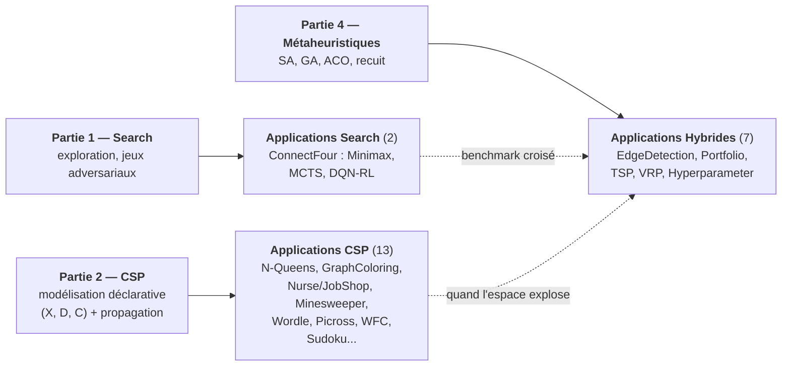

# Search - Applications

C'est ici que la série Search se confronte au réel. Les 23 notebooks d'application, pour la plupart adaptés de projets étudiants, prennent les algorithmes des Parties 1 et 2 et les mettent face à des problèmes qui ne se laissent pas faire : planifier les gardes d'un service hospitalier, ordonnancer un atelier, construire un calendrier sportif équitable, router une flotte de véhicules. Trois catégories les organisent — **Search pur** (jeux combinatoires), **CSP** (satisfaction de contraintes) et **Hybride** (métaheuristiques et algorithmes génétiques) — et la plupart sont autonomes, avec des pointeurs vers les prérequis pertinents. À cela s'ajoutent les **jumeaux C#** (App-2b, App-9b, App-10b) qui déroulent les mêmes algorithmes *from-scratch* en .NET, en complément des versions Python qui invoquent des solveurs industriels.

Sous-série de **23 notebooks** | **~15h35** | Python 3.10+ (`ortools`, `deap`, `mealpy`, `minizinc`, `optuna`) ; .NET 9 (`dotnet-interactive`) pour les jumeaux C#

## Pourquoi cette sous-série

Un algorithme compris sur un exemple jouet n'est pas encore un algorithme maîtrisé. Les applications servent trois apprentissages que les parties théoriques ne peuvent pas donner. D'abord la confrontation des méthodes : le même problème y est régulièrement résolu plusieurs fois — N-Queens en backtracking, en Min-Conflicts et en OR-Tools ; le TSP en recuit simulé, en génétique, en colonies de fourmis et en solveur de routage — et la comparaison chiffrée vaut tous les discours. Ensuite l'ordre de grandeur : voir un solveur de Picross gagner un facteur de plusieurs millions en passant au CP-SAT imprime durablement ce que « propagation » veut dire. Enfin la modélisation, qui est souvent toute la difficulté : le démineur devient un CSP doublé de probabilités, Wordle un problème de théorie de l'information, la génération procédurale de niveaux un Wave Function Collapse encodé en contraintes — autant de cas où trouver la bonne formulation est l'essentiel du travail.

## Objectifs d'apprentissage

À l'issue de cette sous-série, vous serez capable de :

1. **Transposer** les algorithmes de Search et CSP vers des problèmes réels (logistique, ordonnancement, jeux)
2. **Comparer** les approches (backtracking vs CP-SAT vs métaheuristiques) sur des instances concrètes
3. **Évaluer** les compromis performance/qualité entre méthodes exactes et approchées

## FAQ / Troubleshooting

| Problème | Solution |
|----------|----------|
| `ModuleNotFoundError: minizinc` | `pip install minizinc` — nécessaire pour App-5 (Timetabling) et App-8 (MiniZinc). Requiert aussi l'installation du solver MiniZinc |
| `ModuleNotFoundError: optuna` | `pip install optuna` — nécessaire pour App-18 (Hyperparameter Tuning) |
| `ModuleNotFoundError: pygad` | `pip install pygad` — nécessaire pour App-9/10 (EdgeDetection, Portfolio) |
| App-9b/10b (.NET) : kernel non disponible | Installer .NET Interactive : `dotnet tool install --global Microsoft.dotnet-interactive` |
| Certains solveurs sont lents (>30s) | Les instances sont intentionnellement petites pour le pédagogique. Pour des instances plus grandes, activer les timeouts dans CP-SAT (`model.parameters.max_time_in_seconds`) |

## Structure

```text
Applications/
├── Search/     # Applications purement Search (2 notebooks)
├── CSP/        # Applications CSP (14 notebooks : 13 Python + 1 twin C#)
└── Hybrid/     # Metaheuristiques / GA (7 notebooks)
```



---

## Applications Search (`Search/`)

Deux notebooks autour du Puissance 4, le banc d'essai idéal de la recherche adversariale : assez simple pour être résolu, assez riche pour départager les approches. Le premier construit les joueurs (Minimax, MCTS, et un agent DQN appris), le second les fait s'affronter en benchmark systématique.

| # | Notebook | Durée | Contenu | Source |
|---|----------|-------|---------|--------|
| 1 | [App-12-ConnectFour](Search/App-12-ConnectFour.ipynb) | ~50 min | Puissance 4 : Minimax, MCTS, DQN-RL | Projet étudiant |
| 2 | [App-14-ConnectFour-Adversarial](Search/App-14-ConnectFour-Adversarial.ipynb) | ~45 min | Benchmark adversarial : Minimax, Alpha-Beta, MCTS | Projet étudiant |

---

## Applications CSP (`CSP/`)

Le gros de la sous-série, et un panorama de ce que la programmation par contraintes sait faire dès qu'on sort du manuel : des classiques fondateurs (N-Queens, coloration de graphes) aux problèmes d'ordonnancement réalistes (infirmiers, job-shop, emplois du temps, calendriers sportifs), en passant par des terrains plus inattendus — le démineur qui mêle contraintes et probabilités, Wordle lu comme un problème d'information, le Picross qui sert de leçon de vitesse, et la génération procédurale de niveaux par Wave Function Collapse.

| # | Notebook | Durée | Contenu | Source |
|---|----------|-------|---------|--------|
| 1 | [App-1-NQueens](CSP/App-1-NQueens.ipynb) | ~30 min | Backtracking, Min-Conflicts, OR-Tools | Classique |
| 2 | [App-2-GraphColoring](CSP/App-2-GraphColoring.ipynb) | ~45 min | Greedy, DSATUR, CP-SAT, départements | Projet étudiant |
| 2b | [App-2b-GraphColoring-CSharp](CSP/App-2b-GraphColoring-CSharp.ipynb) | ~40 min | Twin C# : Greedy (3 ordres), DSATUR, Welsh-Powell, backtracking χ exact + Mycielski | Classique |
| 3 | [App-3-NurseScheduling](CSP/App-3-NurseScheduling.ipynb) | ~60 min | Hard/soft constraints, CP-SAT | Projet étudiant |
| 4 | [App-4-JobShopScheduling](CSP/App-4-JobShopScheduling.ipynb) | ~60 min | Intervalles, précédences, makespan | Projet étudiant |
| 5 | [App-5-Timetabling](CSP/App-5-Timetabling.ipynb) | ~50 min | MiniZinc + OR-Tools | Projet étudiant |
| 6 | [App-6-Minesweeper](CSP/App-6-Minesweeper.ipynb) | ~50 min | CSP + probabilités + LLM | Projet étudiant |
| 7 | [App-7-Wordle](CSP/App-7-Wordle.ipynb) | ~45 min | Filtrage CSP + théorie de l'information | Projet étudiant |
| 8 | [App-8-MiniZinc](CSP/App-8-MiniZinc.ipynb) | ~50 min | Syntaxe MiniZinc, contraintes globales | Nouveau |
| 9 | [App-11-Picross](CSP/App-11-Picross.ipynb) | ~40 min | Nonogrammes : 27Mx speedup CP-SAT | Projet étudiant |
| 10 | [App-15-SportsScheduling](CSP/App-15-SportsScheduling.ipynb) | ~55 min | Calendrier sportif : contraintes TV, équité, déplacements | Projet étudiant |
| 11 | [App-16-Crossword-CSP](CSP/App-16-Crossword-CSP.ipynb) | ~45 min | Mots croisés : backtracking, OR-Tools, génération | Projet étudiant |
| 12 | [App-19-ProceduralGeneration-WFC](CSP/App-19-ProceduralGeneration-WFC.ipynb) | ~45 min | Génération procédurale : Wave Function Collapse via CP-SAT | Projet étudiant |
| 13 | [App-20-SudokuBenchmark-Python](CSP/App-20-SudokuBenchmark-Python.ipynb) | ~50 min | Benchmark comparatif : 4 solveurs Sudoku, un problème NP-complet | Nouveau |

---

## Applications Hybrid / Métaheuristiques (`Hybrid/`)

Quand l'espace est trop vaste ou l'objectif trop irrégulier pour les méthodes exactes, place aux métaheuristiques : détection de contours et optimisation de portefeuille par algorithmes génétiques (avec leurs doublons C#/GeneticSharp en side-track .NET), TSP et VRP attaqués par quatre méthodes concurrentes, et le réglage d'hyperparamètres ML — où la boucle se referme : on optimise l'optimiseur.

| # | Notebook | Durée | Contenu | Source |
|---|----------|-------|---------|--------|
| 1 | [App-9-EdgeDetection](Hybrid/App-9-EdgeDetection.ipynb) | ~40 min | GA pour filtres de convolution | Existant |
| 2 | [App-9b-EdgeDetection-CSharp](Hybrid/App-9b-EdgeDetection-CSharp.ipynb) | ~35 min | GeneticSharp (C#) | Existant |
| 3 | [App-10-Portfolio](Hybrid/App-10-Portfolio.ipynb) | ~40 min | Multi-objectif, frontière de Pareto | Existant |
| 4 | [App-10b-Portfolio-CSharp](Hybrid/App-10b-Portfolio-CSharp.ipynb) | ~30 min | GeneticSharp (C#) | Existant |
| 5 | [App-13-TSP-Metaheuristics](Hybrid/App-13-TSP-Metaheuristics.ipynb) | ~50 min | TSP : SA, GA, ACO, OR-Tools routing | Classique |
| 6 | [App-17-VRP-Logistics](Hybrid/App-17-VRP-Logistics.ipynb) | ~60 min | Vehicle Routing : SA, GA, ACO, CP-SAT | Projet étudiant |
| 7 | [App-18-HyperparameterTuning](Hybrid/App-18-HyperparameterTuning.ipynb) | ~40 min | Optimisation ML : Bayésienne, GA, PSO, Optuna | Nouveau |

---

## Prérequis par notebook

### Applications Search

| Notebook | Fondations requises |
|----------|--------------------|
| App-12 ConnectFour | Search-3 (A*), Search-4 (LocalSearch) |
| App-14 ConnectFour-Adversarial | Search-3 (Heuristiques), Search-6 (AdversarialSearch) |

### Applications CSP

| Notebook | Fondations requises | Dépendances |
|----------|--------------------|-------------|
| App-1 NQueens | CSP-1 (Fundamentals) | - |
| App-2 GraphColoring | CSP-1, CSP-2 | networkx |
| App-2b GraphColoring (C#) | CSP-1, CSP-2 | dotnet-interactive |
| App-3 NurseScheduling | CSP-3, CSP-4 | ortools |
| App-4 JobShopScheduling | CSP-3, CSP-4 | ortools |
| App-5 Timetabling | CSP-3 | minizinc |
| App-6 Minesweeper | CSP-2 (Consistency) | - |
| App-7 Wordle | CSP-1, CSP-2 | - |
| App-8 MiniZinc | CSP-3 | minizinc |
| App-11 Picross | CSP-3, Search-8 (DLX) | ortools |
| App-15 SportsScheduling | CSP-3, CSP-4 | ortools |
| App-16 Crossword-CSP | CSP-1, CSP-2 | ortools |
| App-19 ProceduralGeneration-WFC | CSP-1, CSP-3 | ortools, numpy, matplotlib |

### Applications Hybrid

| Notebook | Fondations requises | Dépendances |
|----------|--------------------|-------------|
| App-9 EdgeDetection | Search-5 (GA) | pygad, scikit-image |
| App-9b EdgeDetection | Search-5 (GA) | GeneticSharp (.NET) |
| App-10 Portfolio | Search-5 (GA), Search-9 (PL) | pygad |
| App-10b Portfolio | Search-5 (GA) | GeneticSharp (.NET) |
| App-13 TSP-Metaheuristics | Search-4, Search-5 | ortools |
| App-17 VRP-Logistics | Search-4, Search-5, CSP-3 | ortools |
| App-18 HyperparameterTuning | Search-4, Search-5 | optuna, scikit-learn |

---

## Origine des projets

La plupart des notebooks d'application sont adaptés de projets étudiants réalisés dans le cadre de cours d'IA. Les références spécifiques sont indiquées dans chaque notebook.

---

## Ponts inter-séries

| Série | Lien | Relation |
| ------- | ------ | ---------- |
| [Partie 1 : Search](../Part1-Foundations/README.md) | Fondamentaux | Source des algorithmes utilisés |
| [Partie 2 : CSP](../Part2-CSP/README.md) | Programmation par contraintes | Solveurs CP-SAT, MiniZinc |
| [Search (parent)](../README.md) | Vue d'ensemble | Contexte et parcours global |
| [ML/ML.Net](../../ML/ML.Net/) | App-18 (HyperparameterTuning) | Optimisation bayésienne + GA |
| [Sudoku](../../Sudoku/) | App-11 (Picross), App-1 (NQueens) | Problèmes combinatoires similaires |
| [GameTheory](../../GameTheory/) | App-12/14 (ConnectFour) | Jeux à deux joueurs, MCTS |

## Références

Couverture par application des sources fondatrices mobilisées dans cette sous-série. Les références transversales (formalisation en espace d'états, backtracking, A*, recherche locale, métaheuristiques) sont reprises dans les READMEs des [Parties 1](../Part1-Foundations/README.md), [2](../Part2-CSP/README.md) et [4](../Part4-Metaheuristics/README.md) : ce tableau ne couvre que les sources spécifiques aux applications.

| Application(s) | Référence |
|-------------|-----------|
| App-1 (NQueens), App-2 (GraphColoring), App-3 (NurseScheduling), App-4 (JobShop), App-5 (Timetabling), App-15 (SportsScheduling), App-16 (Crossword) | Russell, S., & Norvig, P. — *Artificial Intelligence: A Modern Approach* (4e éd., 2021), ch. « Constraint Satisfaction Problems ». Formalisation (X, D, C) et backtracking avec MRV/LCV. |
| App-1, App-2, App-3, App-4, App-11, App-15, App-16 (solveur) | Perron, L., & Furnon, V. — *OR-Tools CP-SAT* (Google). Propagation par clauses paresseuses (LCG), à l'origine du facteur « plusieurs millions » constaté sur le Picross (App-11). |
| App-5 (Timetabling), App-8 (MiniZinc) | Nethercote, N., Stuckey, P. J., Becket, R., Brand, S., Duck, G. J., & Tack, G. (2007) — « MiniZinc: Towards a Standard CP Modelling Language », *CP 2007*, LNCS 4741. |
| App-6 (Minesweeper), App-7 (Wordle) | AIMA, ch. « Probabilistic Reasoning » (CSP doublé de probabilités pour le démineur) ; Cover, T. M., & Thomas, J. A. — *Elements of Information Theory* (2e éd., 2006), Wiley. Entropie et théorie de l'information mobilisées pour le filtrage optimal des hypothèses dans Wordle. |
| App-11 (Picross) | Knuth, D. E. (2000) — « Dancing Links », dans *Millennial Perspectives in Computer Science* (Springer). Couverture exacte, formulation à l'origine du backtracking naïf sur les nonogrammes avant le saut vers CP-SAT. |
| App-12, App-14 (ConnectFour) | Browne, C. B., Powley, E., et al. (2012) — « A Survey of Monte Carlo Tree Search Methods », *IEEE Trans. on Computational Intelligence and AI in Games* 4(1) ; et AIMA, ch. « Adversarial Search » (Minimax, élagage Alpha-Beta). |
| App-9 (EdgeDetection), App-10 (Portfolio) | Holland, J. H. (1975) — *Adaptation in Natural and Artificial Systems*, University of Michigan Press. Algorithmes génétiques à la base de la recherche de filtres de convolution (App-9) et de l'optimisation de portefeuille (App-10). |
| App-10 (Portfolio, multi-objectif) | Markowitz, H. (1952) — « Portfolio Selection », *The Journal of Finance* 7(1) — frontière efficiente ; et Deb, K. (2001) — *Multi-Objective Optimization using Evolutionary Algorithms*, Wiley — optimisation évolutionnaire multi-objectif (frontière de Pareto). |
| App-13 (TSP), App-17 (VRP) | Applegate, D. L., Bixby, R. E., Chvátal, V., & Cook, W. J. (2006) — *The Traveling Salesman Problem: A Computational Study*, Princeton University Press ; Toth, P., & Vigo, D. (2014) — *Vehicle Routing: Problems, Methods, and Applications*, SIAM (2e éd.) ; et Dorigo, M., & Gambardella, L. M. (1997) — « Ant colonies for the traveling salesman problem », *IEEE Trans. on Evolutionary Computation* 1(2) — colonies de fourmis. |
| App-18 (HyperparameterTuning) | Snoek, J., Larochelle, H., & Adams, R. P. (2012) — « Practical Bayesian Optimization of Machine Learning Hyperparameters », *NeurIPS* ; et Kennedy, J., & Eberhart, R. (1995) — « Particle Swarm Optimization », *Proc. IEEE Int. Conf. on Neural Networks*. |
| App-19 (ProceduralGeneration-WFC) | Gumin, M. (2016) — *WaveFunctionCollapse*, github.com/mxgmn/WaveFunctionCollapse. Génération procédurale de niveaux par propagation de contraintes. |

## Conclusion / Prochaines étapes

### Ce que vous avez appris

Cette sous-série est le lieu de la **confrontation**. Les algorithmes des Parties 1 et 2, compris sur des exemples jouets, y sont mis à l'épreuve de problèmes qui ne se laissent pas réduire — et l'enseignement principal n'est pas « tel algorithme résout tel problème », mais trois leçons transversales que seule la pratique donne :

- **La confrontation des méthodes** — un même problème, résolu plusieurs fois, pour que la comparaison chiffrée parle d'elle-même. Les N-Queens (App-1) le sont en backtracking, en Min-Conflicts puis en OR-Tools ; le TSP (App-13) en recuit simulé, en génétique, en colonies de fourmis et en solveur de routage ; le Puissance 4 (App-12, App-14) en Minimax, Alpha-Beta et MCTS. Le verdict change avec le problème : là où l'exact domine sur les petites instances, l'approché prend le relais dès que l'espace explose — c'est ce basculement, observé et non raconté, qui est l'enseignement.
- **L'ordre de grandeur** — voir un solveur de Picross (App-11) gagner un facteur de plusieurs millions en passant au CP-SAT imprime durablement ce que « propagation » veut dire. Ce n'est pas un détail d'implémentation : c'est le saut de paradigme de la Partie 2 qui devient tangible, mesuré sur un cas où le backtracking naïf s'effondre.
- **La modélisation comme vrai travail** — le démineur (App-6) devient un CSP doublé de probabilités, Wordle (App-7) un problème de théorie de l'information, la génération procédurale (App-19) un Wave Function Collapse encodé en contraintes. Trouver la bonne formulation y est souvent toute la difficulté — et toute la clé.

Le pont entre les deux cultures de la recherche s'exprime dans les notebooks Hybrides : dès que l'espace devient trop vaste (VRP, App-17) ou l'objectif trop irrégulier (portefeuille multi-objectif, App-10), les méthodes exactes cèdent la place aux métaheuristiques — et App-18 (HyperparameterTuning) referme la boucle en optimisant l'optimiseur lui-même.

### Prochaines étapes

- **Retour aux fondements** : les applications supposent les Parties 1 et 2 maîtrisées. Face à une difficulté de modélisation, revenir à la [Partie 1 (Search)](../Part1-Foundations/README.md) pour les algorithmes d'exploration et à la [Partie 2 (CSP)](../Part2-CSP/README.md) pour la modélisation déclarative — c'est là que se joue la compétence de formulation que ces applications exercent.
- **Approfondir les métaheuristiques** : les notebooks Hybrides (App-9, App-13, App-17) sont l'amorce de la [Partie 4](../Part4-Metaheuristics/README.md), qui reconstruit les métaheuristiques depuis leurs primitives au-dessus de MetaGeneticSharp — y compris les doublons C# (App-9b, App-10b) qui s'y rattachent directement.
- **Vers les séries voisines** : selon le problème qui vous a intéressé, les prolongements naturels vont vers [ML/ML.Net](../../ML/ML.Net/README.md) (App-18, optimisation bayésienne), [Sudoku](../../Sudoku/README.md) (problèmes combinatoires similaires) et [GameTheory](../../GameTheory/README.md) (jeux à deux joueurs, MCTS).
- **La série dans son ensemble** : le [sommaire Search](../README.md) replace cette sous-série dans le parcours global — elle en est le terrain d'application, où la théorie rencontre le réel.

## Navigation

[<- Partie 1 : Search](../Part1-Foundations/README.md) | [Partie 2 : CSP](../Part2-CSP/README.md) | [Retour à la série Search](../README.md)
