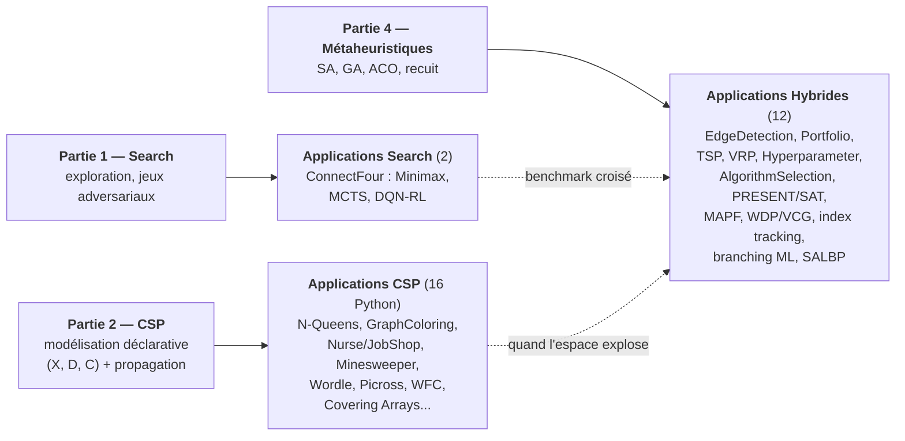
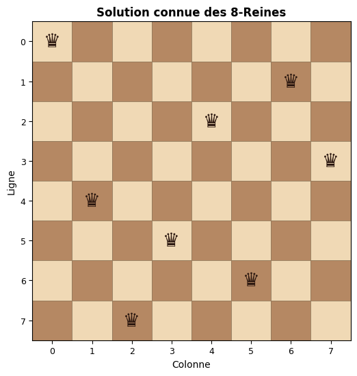
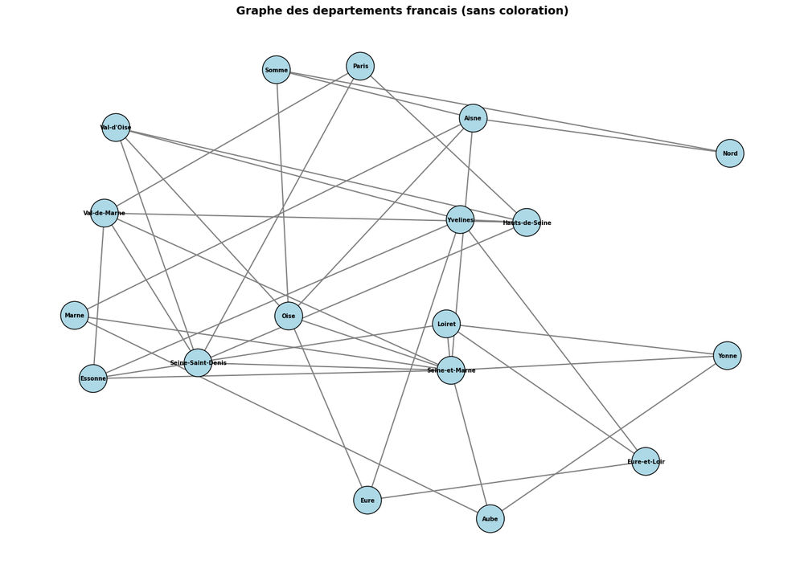
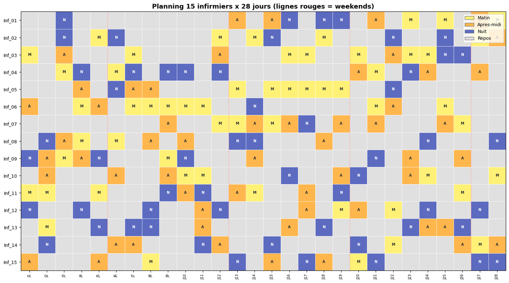
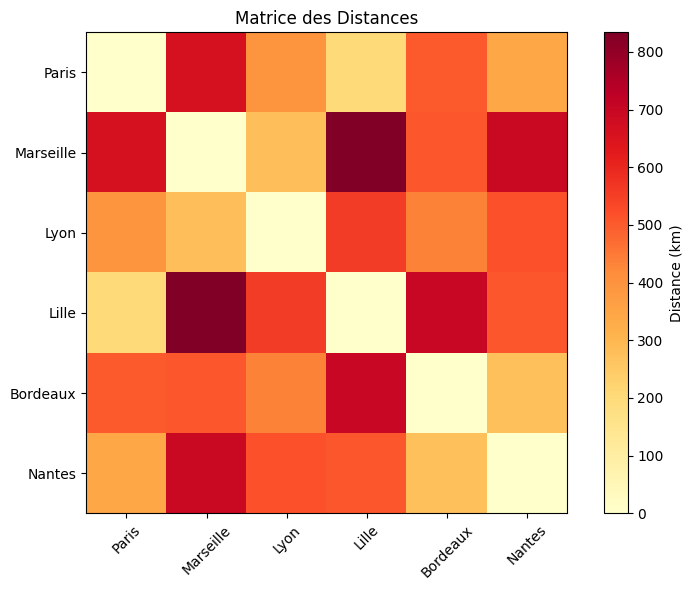
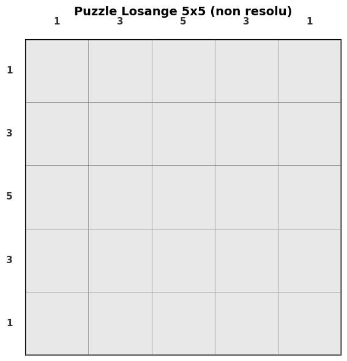
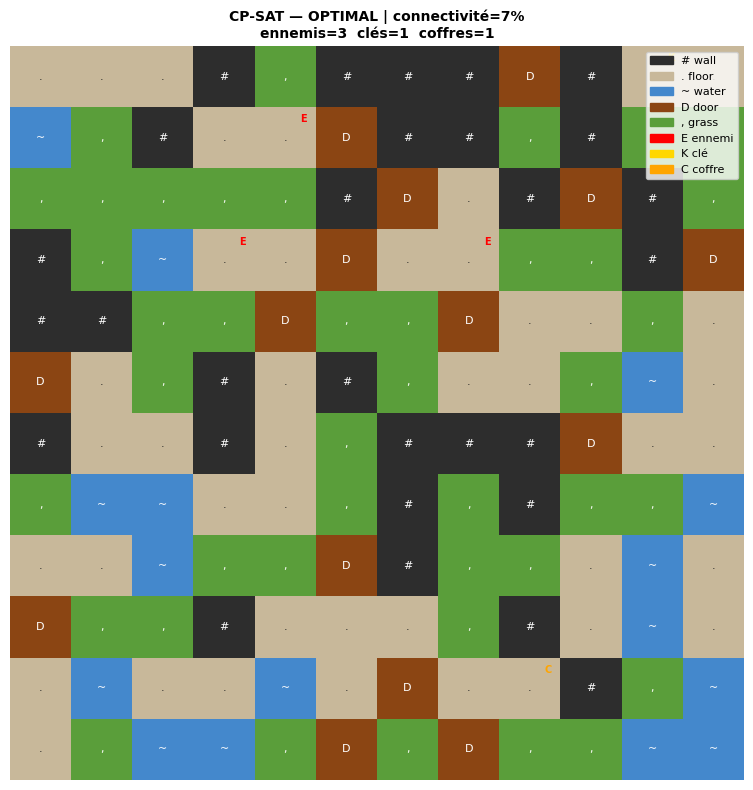

# Search - Applications

C'est ici que la série Search se confronte au réel. Les 52 notebooks d'application, pour la plupart adaptés de projets étudiants, prennent les algorithmes des Parties 1 et 2 et les mettent face à des problèmes qui ne se laissent pas faire : planifier les gardes d'un service hospitalier, ordonnancer un atelier, construire un calendrier sportif équitable, router une flotte de véhicules. Trois catégories les organisent — **Search pur** (jeux combinatoires), **CSP** (satisfaction de contraintes) et **Hybride** (combinaisons de solveurs, modèles exacts et métaheuristiques) — et la plupart sont autonomes, avec des pointeurs vers les prérequis pertinents. À cela s'ajoutent les **jumeaux C#** (App-1b, App-2b, App-3b, App-4b, App-5b, App-6-Csharp, App-7b, App-8-Csharp, App-9b, App-10b, App-11b, App-13b, App-14-CSharp, App-14c, App-15b, App-16-CSharp, App-17b, App-18b, App-19-CSharp, App-20b) qui déroulent les mêmes algorithmes *from-scratch* en .NET, en complément des versions Python qui invoquent des solveurs industriels.

Sous-série de **52 notebooks** | **~28h40** | Python 3.10+ (`ortools`, `python-sat`, `deap`, `mealpy`, `minizinc`, `optuna`) ; .NET 9 (`dotnet-interactive`) pour les jumeaux C#

## Pourquoi cette sous-série

Un algorithme compris sur un exemple jouet n'est pas encore un algorithme maîtrisé. Les applications servent trois apprentissages que les parties théoriques ne peuvent pas donner. D'abord la confrontation des méthodes : le même problème y est régulièrement résolu plusieurs fois — N-Queens en backtracking, en Min-Conflicts et en OR-Tools ; le TSP en recuit simulé, en génétique, en colonies de fourmis et en solveur de routage — et la comparaison chiffrée vaut tous les discours. Ensuite l'ordre de grandeur : voir un solveur de Picross gagner un facteur de plusieurs millions en passant au CP-SAT imprime durablement ce que « propagation » veut dire. Enfin la modélisation, qui est souvent toute la difficulté : le démineur devient un CSP doublé de probabilités, Wordle un problème de théorie de l'information, la génération procédurale de niveaux un Wave Function Collapse encodé en contraintes — autant de cas où trouver la bonne formulation est l'essentiel du travail.

## Objectifs d'apprentissage

À l'issue de cette sous-série, vous serez capable de :

1. **Transposer** les algorithmes de Search et CSP vers des problèmes réels (logistique, ordonnancement, jeux)
2. **Comparer** les approches (backtracking vs CP-SAT vs métaheuristiques) sur des instances concrètes
3. **Évaluer** les compromis performance/qualité entre méthodes exactes et approchées

## FAQ / Troubleshooting

| Problème | Solution |
|----------|----------|
| `ModuleNotFoundError: minizinc` | `pip install minizinc` — nécessaire pour App-5 (Timetabling) et App-8 (MiniZinc). Requiert aussi l'installation du solver MiniZinc |
| `ModuleNotFoundError: optuna` | `pip install optuna` — nécessaire pour App-18 (Hyperparameter Tuning) |
| `ModuleNotFoundError: pygad` | `pip install pygad` — nécessaire pour App-9/10 (EdgeDetection, Portfolio) |
| App-9b/10b (.NET) : kernel non disponible | Installer .NET Interactive : `dotnet tool install --global Microsoft.dotnet-interactive` |
| Certains solveurs sont lents (>30s) | Les instances sont intentionnellement petites pour le pédagogique. Pour des instances plus grandes, activer les timeouts dans CP-SAT (`model.parameters.max_time_in_seconds`) |

## Structure

```text
Applications/
├── Search/     # Applications purement Search (4 notebooks : 2 Python + 2 twins C#)
├── CSP/        # Applications CSP (30 notebooks : 16 Python + 14 twins C#)
└── Hybrid/     # Méthodes hybrides / métaheuristiques (18 notebooks : 13 Python + 5 twins C#)
```


```mermaid
flowchart LR
    P1["<b>Partie 1 — Search</b><br/>exploration, jeux adversariaux"]
    P2["<b>Partie 2 — CSP</b><br/>modélisation déclarative<br/>(X, D, C) + propagation"]
    P4["<b>Partie 4 — Métaheuristiques</b><br/>SA, GA, ACO, recuit"]
    S["<b>Applications Search</b> (2)<br/>ConnectFour : Minimax,<br/>MCTS, DQN-RL"]
    C["<b>Applications CSP</b> (16 Python)<br/>N-Queens, GraphColoring,<br/>Nurse/JobShop, Minesweeper,<br/>Wordle, Picross, WFC,<br/>Covering Arrays..."]
    H["<b>Applications Hybrides</b> (12)<br/>EdgeDetection, Portfolio,<br/>TSP, VRP, Hyperparameter,<br/>AlgorithmSelection, PRESENT/SAT,<br/>MAPF, WDP/VCG, index tracking,<br/>branching ML, SALBP"]
    P1 --> S
    P2 --> C
    P4 --> H
    S -.->|"benchmark croisé"| H
    C -.->|"quand l'espace explose"| H
```

---

## Applications Search (`Search/`)

Deux notebooks autour du Puissance 4, le banc d'essai idéal de la recherche adversariale : assez simple pour être résolu, assez riche pour départager les approches. Le premier construit les joueurs (Minimax, MCTS, et un agent DQN appris), le second les fait s'affronter en benchmark systématique.

| # | Notebook | Durée | Contenu | Source |
|---|----------|-------|---------|--------|
| 1 | [App-14b-ConnectFour](Search/App-14b-ConnectFour.html) | ~50 min | Puissance 4 : Minimax, MCTS, DQN-RL | Projet étudiant |
| 1b | [App-14c-ConnectFour-CSharp](Search/App-14c-ConnectFour-CSharp.ipynb) | ~45 min | **Jumeau C#** — Minimax + Alpha-Beta + MCTS (UCB1) + glouton + iterative deepening from-scratch, heuristique de fenêtres + tournoi round-robin, parité #4956 | Jumeau .NET |
| 2 | [App-14-ConnectFour-Adversarial](Search/App-14-ConnectFour-Adversarial.ipynb) | ~45 min | Benchmark adversarial : Minimax, Alpha-Beta, MCTS | Projet étudiant |
| 2b | [App-14-ConnectFour-Adversarial-CSharp](Search/App-14-ConnectFour-Adversarial-CSharp.ipynb) | ~40 min | **Jumeau C#** — Minimax + Alpha-Beta (élagage) + MCTS (UCB1) from-scratch, benchmark nœuds + tournoi round-robin, parité #4956 | Jumeau .NET |

---

## Applications CSP (`CSP/`)

Le gros de la sous-série, et un panorama de ce que la programmation par contraintes sait faire dès qu'on sort du manuel : des classiques fondateurs (N-Queens, coloration de graphes) aux problèmes d'ordonnancement réalistes (infirmiers, job-shop, emplois du temps, calendriers sportifs), en passant par des terrains plus inattendus — le démineur qui mêle contraintes et probabilités, Wordle lu comme un problème d'information, le Picross qui sert de leçon de vitesse, et la génération procédurale de niveaux par Wave Function Collapse.

Les classiques fondateurs d'abord : les N-Queens (App-1) — le banc d'essai canonique de la recherche avec contraintes, ici résolu sur 8 reines par la solution connue que toute la littérature partage :

[](CSP/App-1-NQueens.html)

La coloration de graphes (App-2) part, elle, du graphe d'adjacence des départements français métropolitains — encore sans couleur assignée ici, le tracé sert de support à l'illustration de la contrainte de différence par frontière :

[](CSP/App-2-GraphColoring.html)

Viennent ensuite les problèmes d'ordonnancement réalistes. Le planning infirmier (App-3) montre 15 infirmières réparties sur 28 jours, avec les créneaux Matin/Après-midi/Nuit, les jours de repos et les week-ends marqués en rouge :

[](CSP/App-3-NurseScheduling.html)

Le calendrier sportif (App-15) commence, lui, par ses données brutes : la matrice des distances entre les six villes de la ligue, à partir de laquelle le solveur équilibre les déplacements :

[](CSP/App-15-SportsScheduling.html)

Enfin, deux terrains où la modélisation est tout le travail. Le Picross (App-11) sert de leçon de vitesse : un puzzle 5×5 présenté avec ses indices de lignes et de colonnes — la grille encore vierge, à laisser au solveur CP-SAT le soin de noircir :

[](CSP/App-11-Picross.html)

La génération procédurale de niveaux (App-19) encode le Wave Function Collapse en CP-SAT — un niveau OPTIMAL produit par le solveur, avec un héros, trois ennemis, une clé et un coffre, sur un pavage de tuiles mur / sol / eau / porte / herbe :

[](CSP/App-19-ProceduralGeneration-WFC.html)

*Figures : sorties d'exécution réelles extraites des notebooks (non régénérées, règle C.3), downscalées ≤1200 px / ≤200 ko (EPIC #5654) — provenance détaillée dans [`assets/readme/MANIFEST.md`](assets/readme/MANIFEST.md).*

| # | Notebook | Durée | Contenu | Source |
|---|----------|-------|---------|--------|
| 1 | [App-1-NQueens](CSP/App-1-NQueens.html) | ~30 min | Backtracking, Min-Conflicts, OR-Tools | Classique |
| 1b | [App-1b-NQueens-CSharp](CSP/App-1b-NQueens-CSharp.ipynb) | ~35 min | Twin C# : Backtracking (simple/MRV/FC), Min-Conflicts, énumération + symétrie D4 | Classique |
| 2 | [App-2-GraphColoring](CSP/App-2-GraphColoring.html) | ~45 min | Greedy, DSATUR, CP-SAT, départements | Projet étudiant |
| 2b | [App-2b-GraphColoring-CSharp](CSP/App-2b-GraphColoring-CSharp.ipynb) | ~40 min | Twin C# : Greedy (3 ordres), DSATUR, Welsh-Powell, backtracking χ exact + Mycielski | Classique |
| 2c | [App-2-GraphColoring-Statistical-Validity-Python](CSP/App-2-GraphColoring-Statistical-Validity-Python.ipynb) | ~50 min | Validité statistique cross-instance : bootstrap, Mann-Whitney, taille d'effet et densité | Nouveau |
| 3 | [App-3-NurseScheduling](CSP/App-3-NurseScheduling.html) | ~60 min | Hard/soft constraints, CP-SAT | Projet étudiant |
| 3b | [App-3b-NurseScheduling-CSharp](CSP/App-3b-NurseScheduling-CSharp.html) | ~45 min | **Jumeau C#** — glouton, backtracking, min-conflicts from-scratch (modélisation 1 var/slot, optimisation préférences), parité #4956 | Jumeau .NET |
| 4 | [App-4-JobShopScheduling](CSP/App-4-JobShopScheduling.html) | ~60 min | Intervalles, précédences, makespan | Projet étudiant |
| 4b | [App-4b-JobShopScheduling-CSharp](CSP/App-4b-JobShopScheduling-CSharp.html) | ~45 min | **Jumeau C#** — dispatching heuristics (SPT/LPT/MOR/MWKR/FIFO) + branch-and-bound optimal from-scratch (énumération active + élagage), Gantt ASCII, parité #4956 | Jumeau .NET |
| 5 | [App-5-Timetabling](CSP/App-5-Timetabling.html) | ~50 min | MiniZinc + OR-Tools | Projet étudiant |
| 5b | [App-5-Timetabling-CSharp](CSP/App-5-Timetabling-CSharp.ipynb) | ~35 min | **Jumeau C#** — glouton MRV + branch-and-bound optimal from-scratch (énumération avec élagage par contrainte dure), visualisation ASCII, parité #4956 | Jumeau .NET |
| 6 | [App-6-Minesweeper](CSP/App-6-Minesweeper.html) | ~50 min | CSP + probabilités + LLM | Projet étudiant |
| 6 | [App-6-Minesweeper-Csharp](CSP/App-6-Minesweeper-Csharp.ipynb) | ~50 min | **Jumeau C#** — CSP backtracking from-scratch + probabilités, parité #4956 | Jumeau .NET |
| 7 | [App-7-Wordle](CSP/App-7-Wordle.html) | ~45 min | Filtrage CSP + théorie de l'information | Projet étudiant |
| 7b | [App-7b-Wordle-CSharp](CSP/App-7b-Wordle-CSharp.html) | ~35 min | **Jumeau C#** — filtrage simple, CSP par propagation de domaines, solveur par entropie de Shannon from-scratch, parité #4956 | Jumeau .NET |
| 8 | [App-8-MiniZinc](CSP/App-8-MiniZinc.html) | ~50 min | Syntaxe MiniZinc, contraintes globales | Nouveau |
| 8 | [App-8-MiniZinc-Csharp](CSP/App-8-MiniZinc-Csharp.html) | ~50 min | **Jumeau C#** — Google.OrTools CP-SAT (Prong A #3801), modèles déclaratifs équivalents MiniZinc (MiniZinc n'a pas de binding .NET), parité #4956 | Jumeau .NET |
| 9 | [App-11-Picross](CSP/App-11-Picross.html) | ~40 min | Nonogrammes : 27Mx speedup CP-SAT | Projet étudiant |
| 9b | [App-11b-Picross-CSharp](CSP/App-11b-Picross-CSharp.ipynb) | ~40 min | Twin C# : énumération de motifs, propagation par intersection (point fixe), naïf vs propagation | Classique |
| 10 | [App-15-SportsScheduling](CSP/App-15-SportsScheduling.html) | ~55 min | Calendrier sportif : contraintes TV, équité, déplacements | Projet étudiant |
| 10b | [App-15b-SportsScheduling-CSharp](CSP/App-15b-SportsScheduling-CSharp.ipynb) | ~55 min | **Jumeau C#** — Google.OrTools CP-SAT natif .NET, round-robin + équilibre D/E + déplacements, parité #4956 | Jumeau .NET |
| 11 | [App-16-Crossword-CSP](CSP/App-16-Crossword-CSP.html) | ~45 min | Mots croisés : backtracking, OR-Tools, génération | Projet étudiant |
| 11 | [App-16-Crossword-CSP-Csharp](CSP/App-16-Crossword-CSP-Csharp.ipynb) | ~45 min | **Jumeau C#** — backtracking + propagation de domaines from-scratch (le twin Python s'appuie sur OR-Tools CP-SAT), parité #4956 | Jumeau .NET |
| 12 | [App-19-ProceduralGeneration-WFC](CSP/App-19-ProceduralGeneration-WFC.html) | ~45 min | Génération procédurale : Wave Function Collapse via CP-SAT | Projet étudiant |
| 12 | [App-19-ProceduralGeneration-WFC-Csharp](CSP/App-19-ProceduralGeneration-WFC-Csharp.ipynb) | ~45 min | **Jumeau C#** — Wave Function Collapse from-scratch (algorithme de Gumin : effondrement progressif + propagation de contraintes), parité #4956 | Jumeau .NET |
| 13 | [App-20-SudokuBenchmark-Python](CSP/App-20-SudokuBenchmark-Python.html) | ~50 min | Benchmark comparatif : 4 solveurs Sudoku, un problème NP-complet | Nouveau |
| 13b | [App-20b-SudokuBenchmark-CSharp](CSP/App-20b-SudokuBenchmark-CSharp.html) | ~35 min | **Jumeau C#** — backtracking naïf/MRV, AC-3, Dancing Links (Knuth) from-scratch, benchmark 3 difficultés, parité #4956 | Jumeau .NET |
| 14 | [App-21-VoiceLeading](CSP/App-21-VoiceLeading.ipynb) | ~40 min | Hommage Munkres : voice leading chorale par affectation (Kuhn-Munkres via scipy) + audit/réparation du contrepoint de Fux en CP-SAT — encodage issu des projets étudiants EPITA PrCon (H1/H1_V2) | Hommage Munkres / projets étudiants EPITA |
| 15 | [App-22-EdgeColoring-Tutte](CSP/App-22-EdgeColoring-Tutte.ipynb) | ~45 min | Coloration d'arêtes cubiques : Vizing, Petersen, ponts, graphes apex et CP-SAT | Nouveau |
| 16 | [App-26-CoveringArrays-Guarantee-Audit](CSP/App-26-CoveringArrays-Guarantee-Audit.ipynb) | ~55 min | Covering Arrays : oracle constraint-aware, set cover CP-SAT exact, bornes et baselines IPOG/AETG-like — distillation PrCon H4 (Valérian Pichot) | Projet étudiant (PrCon PR #58) |

---

## Applications Hybrid / Métaheuristiques (`Hybrid/`)

Quand l'espace est trop vaste ou l'objectif trop irrégulier pour les méthodes exactes, place aux métaheuristiques : détection de contours et optimisation de portefeuille par algorithmes génétiques (avec leurs doublons C#/GeneticSharp en side-track .NET), TSP et VRP attaqués par quatre méthodes concurrentes, et le réglage d'hyperparamètres ML — où la boucle se referme : on optimise l'optimiseur.

| # | Notebook | Durée | Contenu | Source |
|---|----------|-------|---------|--------|
| 1 | [App-9-EdgeDetection](Hybrid/App-9-EdgeDetection.html) | ~40 min | GA pour filtres de convolution | Existant |
| 2 | [App-9b-EdgeDetection-CSharp](Hybrid/App-9b-EdgeDetection-CSharp.html) | ~35 min | GeneticSharp (C#) | Existant |
| 3 | [App-10-Portfolio](Hybrid/App-10-Portfolio.html) | ~40 min | Multi-objectif, frontière de Pareto | Existant |
| 4 | [App-10b-Portfolio-CSharp](Hybrid/App-10b-Portfolio-CSharp.html) | ~30 min | GeneticSharp (C#) | Existant |
| 5 | [App-13-TSP-Metaheuristics](Hybrid/App-13-TSP-Metaheuristics.ipynb) | ~50 min | TSP : SA, GA, ACO, OR-Tools routing | Classique |
| 5b | [App-13b-TSP-Metaheuristics-CSharp](Hybrid/App-13b-TSP-Metaheuristics-CSharp.ipynb) | ~45 min | Twin C# : force brute, plus proche voisin, 2-opt from-scratch, recuit simulé sur permutations | Classique |
| 6 | [App-17-VRP-Logistics](Hybrid/App-17-VRP-Logistics.html) | ~60 min | Vehicle Routing : SA, GA, ACO, CP-SAT | Projet étudiant |
| 6b | [App-17b-VRP-Logistics-CSharp](Hybrid/App-17b-VRP-Logistics-Csharp.ipynb) | ~50 min | Twin C# : Nearest-Neighbor, cheapest-insertion, 2-opt, recuit simulé (métaheuristiques from-scratch) | Jumeau .NET |
| 6c | [App-17b-VRP-Logistics-Python](Hybrid/App-17b-VRP-Logistics-Python.ipynb) | ~45 min | Twin Python from-scratch : NN, insertion, 2-opt, recuit et vérification OR-Tools | Jumeau Python |
| 7 | [App-18-HyperparameterTuning](Hybrid/App-18-HyperparameterTuning.html) | ~40 min | Optimisation ML : Bayésienne, GA, PSO, Optuna | Nouveau |
| 7b | [App-18b-HyperparameterTuning-CSharp](Hybrid/App-18b-HyperparameterTuning-CSharp.html) | ~40 min | **Jumeau C#** — Grid/Random Search + Bayesian Optimization from-scratch (Gaussian Process RBF + Expected Improvement via Abramowitz-Stegun) + GA + PSO, objectif = k-NN CV 5-fold, parité #4956 | Jumeau .NET |
| 7c | [App-18b-HyperparameterTuning-Python](Hybrid/App-18b-HyperparameterTuning-Python.ipynb) | ~45 min | Twin Python from-scratch : Grid/Random, GP-EI, GA, PSO et vérification Optuna | Jumeau Python |
| 8 | [App-22-AlgorithmSelection-Python](Hybrid/App-22-AlgorithmSelection-Python.ipynb) | ~45 min | Sélection empirique d'algorithmes : 3 jeux (Sudoku, Puissance 4, Wordle), 13 familles conceptuelles / 14 étiquettes mesurées, non-commensurabilité des métriques + frontières de Pareto + choix sous préférences — hommage PR IS #42 (Théodore Deguest) | Projet étudiant (IS PR #42) |
| 9 | [App-23-PRESENT-Differential-Cryptanalysis-SAT](Hybrid/App-23-PRESENT-Differential-Cryptanalysis-SAT.ipynb) | ~55 min | PRESENT : DDT, compression d'implicants, CNF pondérée, frontière SAT/UNSAT du meilleur trail et limites de certification — distillation PrCon F2 (Théodore Deguest) | Projet étudiant (PrCon PR #49) |
| 10 | [App-24-MAPF-Guarantee-Audit](Hybrid/App-24-MAPF-Guarantee-Audit.ipynb) | ~60 min | MAPF : validateur indépendant, oracle CP-SAT time-expanded, réfutation OD-A*, arrêt CBS au but, audit des garanties ECBS — distillation PrCon G3 (Matteo Atkinson, Paul Witkowski) | Projet étudiant (PrCon PRs #33/#36/#42) |
| 11 | [App-25-CombinatorialAuctions-WDP-VCG](Hybrid/App-25-CombinatorialAuctions-WDP-VCG.ipynb) | ~60 min | Enchères combinatoires : WDP exact CP-SAT vs force brute, langage XOR, budget global, paiements VCG et audit de leurs garanties, contre-exemple de manipulation sous budget matérialisé, forensics `PRICE_SCALE` sur 18 instances CATS — distillation PrCon J2 (Majerczyk, Chartouni, Wangon-Zekou) | Projet étudiant (PrCon PR #26) |
| 12 | [App-27-Sparse-Index-Tracking-Walk-Forward](Hybrid/App-27-Sparse-Index-Tracking-Walk-Forward.ipynb) | ~75 min | Sparse index tracking : modèle CP-SAT vérifiable, walk-forward sans fuite et lecture pédagogique des résultats QuantConnect réels — une recherche, deux lectures — distillation PrCon M2 (Godric Bouteloup) | Projet étudiant (PrCon PR #52) |
| 13 | [App-28-LearningToBranch-Generalization-Audit](Hybrid/App-28-LearningToBranch-Generalization-Audit.ipynb) | ~75 min | Learning to branch : dérivation de dom/wdeg, splits groupés, transfert inter-familles, performance intégrée, coût d'inférence et seuil d'amortissement — distillation PrCon G4 (Simon Naulet, Matis Codjia) | Projet étudiant (PrCon PR #46) |
| 14 | [App-29-SALBP-AssemblyLineBalancing-Audit](Hybrid/App-29-SALBP-AssemblyLineBalancing-Audit.ipynb) | ~70 min | SALBP-1/2 : CP-SAT, PuLP/CBC et RPW, statuts/incumbents/bornes, identité de benchmark, front Pareto certifié et MMALBP robuste/pondéré — distillation PrCon B1 (Ilias Kalalou, Kaelan Grall) | Projet étudiant (PrCon PR #57) |

---

## Prérequis par notebook

### Applications Search

| Notebook | Fondations requises |
|----------|--------------------|
| App-14b ConnectFour | Search-3 (A*), Search-4 (LocalSearch) |
| App-14 ConnectFour-Adversarial | Search-3 (Heuristiques), Search-6 (AdversarialSearch) |
| App-14-CSharp | Search-3 (Heuristiques), Search-6 (AdversarialSearch) |
| App-14c-CSharp | Search-6 (AdversarialSearch), Search-7 (MCTS) |

### Applications CSP

| Notebook | Fondations requises | Dépendances |
|----------|--------------------|-------------|
| App-1 NQueens | CSP-1 (Fundamentals) | - |
| App-1b NQueens (C#) | CSP-1 (Fundamentals) | dotnet-interactive |
| App-2 GraphColoring | CSP-1, CSP-2 | networkx |
| App-2b GraphColoring (C#) | CSP-1, CSP-2 | dotnet-interactive |
| App-2c GraphColoring Statistical Validity | CSP-1, CSP-2, statistiques | networkx, scipy, ortools |
| App-3 NurseScheduling | CSP-3, CSP-4 | ortools |
| App-3b NurseScheduling (C#) | CSP-3, CSP-4 | dotnet-interactive |
| App-4 JobShopScheduling | CSP-3, CSP-4 | ortools |
| App-4b JobShopScheduling (C#) | CSP-3, CSP-4 | dotnet-interactive |
| App-5 Timetabling | CSP-3 | minizinc |
| App-5b Timetabling (C#) | CSP-3 | dotnet-interactive |
| App-6 Minesweeper | CSP-2 (Consistency) | - |
| App-6 Minesweeper (C#) | CSP-2 (Consistency) | dotnet-interactive |
| App-7 Wordle | CSP-1, CSP-2 | - |
| App-7b Wordle (C#) | CSP-1, CSP-2 | dotnet-interactive |
| App-8 MiniZinc | CSP-3 | minizinc |
| App-8 MiniZinc (C#) | CSP-3 | dotnet-interactive, Google.OrTools |
| App-11 Picross | CSP-3, Search-8 (DLX) | ortools |
| App-11b Picross (C#) | CSP-1, CSP-3 (Propagation) | dotnet-interactive |
| App-15 SportsScheduling | CSP-3, CSP-4 | ortools |
| App-15b SportsScheduling (C#) | CSP-3, CSP-4 | dotnet-interactive, Google.OrTools |
| App-16 Crossword-CSP | CSP-1, CSP-2 | ortools |
| App-16 Crossword-CSP (C#) | CSP-1, CSP-2 | dotnet-interactive |
| App-19 ProceduralGeneration-WFC | CSP-1, CSP-3 | ortools, numpy, matplotlib |
| App-19 ProceduralGeneration-WFC (C#) | CSP-1, CSP-3 | dotnet-interactive |
| App-20 SudokuBenchmark | CSP-1, CSP-3, Search-8 (DLX) | ortools |
| App-20 SudokuBenchmark (C#) | CSP-1, CSP-3, Search-8 (DLX) | dotnet-interactive |
| App-21 VoiceLeading | affectation, CSP-3 | scipy, ortools |
| App-22 EdgeColoring-Tutte | coloration de graphes, CSP-3 | networkx, ortools |
| App-26 CoveringArrays Guarantee Audit | CSP-3, CSP-5 | ortools, pandas, matplotlib |

### Applications Hybrid

| Notebook | Fondations requises | Dépendances |
|----------|--------------------|-------------|
| App-9 EdgeDetection | Search-5 (GA) | pygad, scikit-image |
| App-9b EdgeDetection | Search-5 (GA) | GeneticSharp (.NET) |
| App-10 Portfolio | Search-5 (GA), Search-9 (PL) | pygad |
| App-10b Portfolio | Search-5 (GA) | GeneticSharp (.NET) |
| App-13 TSP-Metaheuristics | Search-4, Search-5 | ortools |
| App-13b TSP-Metaheuristics (C#) | Search-4 (LocalSearch), Search-11 (SA) | dotnet-interactive |
| App-17 VRP-Logistics | Search-4, Search-5, CSP-3 | ortools |
| App-17b VRP-Logistics (C#) | Search-4 (LocalSearch), Search-5 (SA) | dotnet-interactive |
| App-17b VRP-Logistics (Python) | Search-4 (LocalSearch), Search-5 (SA) | numpy, ortools |
| App-18 HyperparameterTuning | Search-4, Search-5 | optuna, scikit-learn |
| App-18b HyperparameterTuning (C#) | Search-4, Search-5 | dotnet-interactive |
| App-18b HyperparameterTuning (Python) | Search-4, Search-5 | numpy, scipy, optuna |
| App-22 AlgorithmSelection-Python | MGS-16 (Rice / No Free Lunch) | pandas, numpy, matplotlib |
| App-23 PRESENT Differential Cryptanalysis | SAT, CNF, bit-vectors | python-sat, numpy, matplotlib |
| App-24 MAPF Guarantee Audit | Search-3 (A*), CSP-3/CSP-4, heuristiques admissibles | ortools, pandas, matplotlib |
| App-25 CombinatorialAuctions-WDP-VCG | CSP-3 (CP-SAT), CSP-5 (optimisation), GameTheory-16 (VCG) | ortools, pandas, matplotlib |
| App-27 Sparse Index Tracking Walk-Forward | CSP-3 (CP-SAT), CSP-5 (optimisation), App-10 (portefeuille) | ortools, pandas, numpy |
| App-28 LearningToBranch Generalization Audit | CSP-6 (heuristiques), MGS-16 (sélection d'algorithmes) | numpy, pandas, scikit-learn |
| App-29 SALBP AssemblyLineBalancing Audit | CSP-3 (CP-SAT), CSP-4 (scheduling), CSP-5 (optimisation) | ortools, pulp, pandas, numpy, matplotlib |

---

## Origine des projets

La plupart des notebooks d'application sont adaptés de projets étudiants réalisés dans le cadre de cours d'IA. Les références spécifiques sont indiquées dans chaque notebook.

Le [App-22-AlgorithmSelection-Python](Hybrid/App-22-AlgorithmSelection-Python.html) est un cas particulier : il **distille** un projet étudiant — **Théodore Deguest**, *« Benchmark cross-paradigme de solveurs de jeux »*, PR [IS #42](https://github.com/jsboigeEpita/2026-Epita-Intelligence-Symbolique/pull/42) — sans en recopier le code. Les solveurs restent dans le dépôt source ; seules les données de résultats sont réutilisées (licence MIT, attribution conservée), et l'analyse est nouvelle et porte la marque CoursIA.

Le [App-23-PRESENT-Differential-Cryptanalysis-SAT](Hybrid/App-23-PRESENT-Differential-Cryptanalysis-SAT.ipynb) distille le projet PrCon F2 de **Théodore Deguest**, *« Cryptanalyse différentielle de PRESENT via SAT »*, PR [PrCon #49](https://github.com/jsboigeEpita/2026-Epita-Programmation-par-Contraintes/pull/49). Le notebook reconstruit l'expérience de façon autonome, reproduit la DDT et les frontières SAT/UNSAT, corrige le seuil documentaire à R=15/W=66 et distingue explicitement trail, cluster et niveau de preuve.

Le [App-24-MAPF-Guarantee-Audit](Hybrid/App-24-MAPF-Guarantee-Audit.ipynb) distille le projet PrCon G3 de **Matteo Atkinson** et **Paul Witkowski**, *« Coordination de drones par Multi-Agent Path Finding »*, PRs [PrCon #33](https://github.com/jsboigeEpita/2026-Epita-Programmation-par-Contraintes/pull/33), [#36](https://github.com/jsboigeEpita/2026-Epita-Programmation-par-Contraintes/pull/36) et [#42](https://github.com/jsboigeEpita/2026-Epita-Programmation-par-Contraintes/pull/42). Un rerun frais alimente un validateur et un oracle CP-SAT indépendants ; le notebook distingue trajectoire valide, optimum observé et garantie réellement établie, avec provenance détaillée dans [`Hybrid/data/app24-mapf-audit/SOURCE.md`](Hybrid/data/app24-mapf-audit/SOURCE.md).

Le [App-25-CombinatorialAuctions-WDP-VCG](Hybrid/App-25-CombinatorialAuctions-WDP-VCG.ipynb) distille le projet PrCon J2 de **Lucas Majerczyk**, **Nabil Chartouni** et **Wilfrid Wangon-Zekou**, *« Enchères combinatoires et Winner Determination »*, PR [PrCon #26](https://github.com/jsboigeEpita/2026-Epita-Programmation-par-Contraintes/pull/26). Le notebook ré-écrit le solveur WDP (CP-SAT, prix entiers milli-unités bout-en-bout) sans importer le package `wdp/` des étudiants ; il re-résout les 18 instances CATS, **matérialise en exécutable** le contre-exemple de manipulation sous budget documenté mais jamais testé dans la source, et audite honnêtement l'écart `PRICE_SCALE` entre les outputs committés et le code au commit source. Données et provenance : [`data/app25-wdp-vcg-audit`](Hybrid/data/app25-wdp-vcg-audit/).

Le [App-26-CoveringArrays-Guarantee-Audit](CSP/App-26-CoveringArrays-Guarantee-Audit.ipynb) distille le projet PrCon H4 de **Valérian Pichot**, *« Covering Arrays »*, PR [PrCon #58](https://github.com/jsboigeEpita/2026-Epita-Programmation-par-Contraintes/pull/58). Sans recopier le générateur étudiant, le notebook reconstruit un oracle indépendant, un set cover CP-SAT exact et deux baselines approchées ; il reproduit surtout le faux verdict d'un validateur qui exige des interactions sémantiquement impossibles, puis le répare par un univers constraint-aware. Provenance : [`CSP/data/app26-covering-arrays-audit/SOURCE.md`](CSP/data/app26-covering-arrays-audit/SOURCE.md).

Le [App-27-Sparse-Index-Tracking-Walk-Forward](Hybrid/App-27-Sparse-Index-Tracking-Walk-Forward.ipynb) distille le projet PrCon M2 de **Godric Bouteloup**, *« Sparse Index Tracking »*, PR [PrCon #52](https://github.com/jsboigeEpita/2026-Epita-Programmation-par-Contraintes/pull/52). Le notebook conserve la modélisation CP-SAT en lots entiers, mais reconstruit l'expérience sur un marché synthétique seedé : cardinalité exacte, turnover entre rebalancements consécutifs, validation indépendante, choix de K avant le test et statut/borne/gap explicites. Il matérialise aussi un protocole contaminé pour montrer qu'un score obtenu après consultation du test est ininterprétable, qu'il paraisse meilleur ou moins bon. Cette lecture de méthode reprend ensuite, sans relancer de recherche de marché, les résultats autoritatifs du projet [Sparse-Index-Tracking-QC](../../QuantConnect/projects/Sparse-Index-Tracking-QC/README.md) intégré par la PR CoursIA [#14068](https://github.com/jsboige/CoursIA/pull/14068) : 703 contre 1 414 ordres, mais pas de domination sparse sur les performances ni sur le turnover. **Une recherche, deux lectures.** Provenance : [`Hybrid/data/app27-sparse-index-tracking/SOURCE.md`](Hybrid/data/app27-sparse-index-tracking/SOURCE.md).

Le [App-28-LearningToBranch-Generalization-Audit](Hybrid/App-28-LearningToBranch-Generalization-Audit.ipynb) distille le projet PrCon G4 de **Simon Naulet** et **Matis Codjia**, *« Apprentissage d'heuristiques de branchement pour solveur CP »*, PR [PrCon #46](https://github.com/jsboigeEpita/2026-Epita-Programmation-par-Contraintes/pull/46). La reproduction est entièrement réécrite : elle remplace le split par lignes par des instances disjointes, ajoute trois transferts leave-one-family-out et compare l'arbre, le temps total et le coût d'inférence à une baseline choisie sur le train uniquement. Elle établit un résultat négatif utile : une imitation locale fidèle ne garantit ni un arbre plus petit ni un solveur plus rapide. Provenance : [`Hybrid/data/app28-learning-to-branch-audit/SOURCE.md`](Hybrid/data/app28-learning-to-branch-audit/SOURCE.md).

Le [App-29-SALBP-AssemblyLineBalancing-Audit](Hybrid/App-29-SALBP-AssemblyLineBalancing-Audit.ipynb) rend hommage au projet PrCon B1 d'**Ilias Kalalou** et **Kaelan Grall**, *« Équilibrage de chaîne d'assemblage (SALBP) »*, PR [PrCon #57](https://github.com/jsboigeEpita/2026-Epita-Programmation-par-Contraintes/pull/57). Le notebook préserve leur geste central — SALBP-1/2, comparaison CP-SAT/PuLP/RPW, Pareto et multi-modèles — dans une réécriture CoursIA indépendante qui publie statuts, incumbents, bornes, gaps, identité structurelle des instances et validation hors solveur. Aucun code, texte ou figure étudiante n'est copié. Provenance : [`Hybrid/data/app29-salbp-audit/SOURCE.md`](Hybrid/data/app29-salbp-audit/SOURCE.md).

---

## Ponts inter-séries

| Série | Lien | Relation |
| ------- | ------ | ---------- |
| [Partie 1 : Search](../Part1-Foundations/README.md) | Fondamentaux | Source des algorithmes utilisés |
| [Partie 2 : CSP](../Part2-CSP/README.md) | Programmation par contraintes | Solveurs CP-SAT, MiniZinc |
| [Search (parent)](../README.md) | Vue d'ensemble | Contexte et parcours global |
| [ML/ML.Net](../../ML/ML.Net/) | App-18 (HyperparameterTuning) | Optimisation bayésienne + GA |
| [QuantConnect](../../QuantConnect/) | App-27 (Sparse Index Tracking) | Épreuve réelle autoritative déjà intégrée : backtests QC Cloud sparse/full, frais explicites et lecture conjointe cardinalité–ordres–turnover |
| [Sudoku](../../Sudoku/) | App-11 (Picross), App-1 (NQueens) | Problèmes combinatoires similaires |
| [GameTheory](../../GameTheory/) | App-14/14b (ConnectFour) | Jeux à deux joueurs, MCTS |

## Références

Couverture par application des sources fondatrices mobilisées dans cette sous-série. Les références transversales (formalisation en espace d'états, backtracking, A*, recherche locale, métaheuristiques) sont reprises dans les READMEs des [Parties 1](../Part1-Foundations/README.md), [2](../Part2-CSP/README.md) et [4](../Part4-Metaheuristics/README.md) : ce tableau ne couvre que les sources spécifiques aux applications.

| Application(s) | Référence |
|-------------|-----------|
| App-1 (NQueens), App-2 (GraphColoring), App-3 (NurseScheduling), App-4 (JobShop), App-5 (Timetabling), App-15 (SportsScheduling), App-16 (Crossword) | Russell, S., & Norvig, P. — *Artificial Intelligence: A Modern Approach* (4e éd., 2021), ch. « Constraint Satisfaction Problems ». Formalisation (X, D, C) et backtracking avec MRV/LCV. |
| App-1, App-2, App-3, App-4, App-11, App-15, App-16 (solveur) | Perron, L., & Furnon, V. — *OR-Tools CP-SAT* (Google). Propagation par clauses paresseuses (LCG), à l'origine du facteur « plusieurs millions » constaté sur le Picross (App-11). |
| App-5 (Timetabling), App-8 (MiniZinc) | Nethercote, N., Stuckey, P. J., Becket, R., Brand, S., Duck, G. J., & Tack, G. (2007) — « MiniZinc: Towards a Standard CP Modelling Language », *CP 2007*, LNCS 4741. |
| App-6 (Minesweeper), App-7 (Wordle) | AIMA, ch. « Probabilistic Reasoning » (CSP doublé de probabilités pour le démineur) ; Cover, T. M., & Thomas, J. A. — *Elements of Information Theory* (2e éd., 2006), Wiley. Entropie et théorie de l'information mobilisées pour le filtrage optimal des hypothèses dans Wordle. |
| App-11 (Picross) | Knuth, D. E. (2000) — « Dancing Links », dans *Millennial Perspectives in Computer Science* (Springer). Couverture exacte, formulation à l'origine du backtracking naïf sur les nonogrammes avant le saut vers CP-SAT. |
| App-14, App-14b (ConnectFour) | Browne, C. B., Powley, E., et al. (2012) — « A Survey of Monte Carlo Tree Search Methods », *IEEE Trans. on Computational Intelligence and AI in Games* 4(1) ; et AIMA, ch. « Adversarial Search » (Minimax, élagage Alpha-Beta). |
| App-9 (EdgeDetection), App-10 (Portfolio) | Holland, J. H. (1975) — *Adaptation in Natural and Artificial Systems*, University of Michigan Press. Algorithmes génétiques à la base de la recherche de filtres de convolution (App-9) et de l'optimisation de portefeuille (App-10). |
| App-10 (Portfolio, multi-objectif) | Markowitz, H. (1952) — « Portfolio Selection », *The Journal of Finance* 7(1) — frontière efficiente ; et Deb, K. (2001) — *Multi-Objective Optimization using Evolutionary Algorithms*, Wiley — optimisation évolutionnaire multi-objectif (frontière de Pareto). |
| App-13 (TSP), App-17 (VRP) | Applegate, D. L., Bixby, R. E., Chvátal, V., & Cook, W. J. (2006) — *The Traveling Salesman Problem: A Computational Study*, Princeton University Press ; Toth, P., & Vigo, D. (2014) — *Vehicle Routing: Problems, Methods, and Applications*, SIAM (2e éd.) ; et Dorigo, M., & Gambardella, L. M. (1997) — « Ant colonies for the traveling salesman problem », *IEEE Trans. on Evolutionary Computation* 1(2) — colonies de fourmis. |
| App-18 (HyperparameterTuning) | Snoek, J., Larochelle, H., & Adams, R. P. (2012) — « Practical Bayesian Optimization of Machine Learning Hyperparameters », *NeurIPS* ; et Kennedy, J., & Eberhart, R. (1995) — « Particle Swarm Optimization », *Proc. IEEE Int. Conf. on Neural Networks*. |
| App-22 (AlgorithmSelection-Python) | Rice, J. R. (1976) — « The Algorithm Selection Problem », *Advances in Computers* 15, pp. 65-118 ; et Wolpert, D. H., & Macready, W. G. (1997) — « No Free Lunch Theorems for Optimization », *IEEE Trans. on Evolutionary Computation* 1(1), pp. 67-82. |
| App-23 (PRESENT Differential Cryptanalysis SAT) | Bogdanov, A., et al. (2007) — « PRESENT: An Ultra-Lightweight Block Cipher », *CHES 2007* ; Tseitin, G. S. (1968) — transformations CNF ; Eén, N., & Sörensson, N. (2006) — « Translating Pseudo-Boolean Constraints into SAT ». |
| App-19 (ProceduralGeneration-WFC) | Gumin, M. (2016) — *WaveFunctionCollapse*, github.com/mxgmn/WaveFunctionCollapse. Génération procédurale de niveaux par propagation de contraintes. |
| App-24 (MAPF Guarantee Audit) | Stern, R., et al. (2019) — « Multi-Agent Pathfinding: Definitions, Variants, and Benchmarks », *SoCS* ; Sharon, G., et al. (2015) — « Conflict-Based Search for Optimal Multi-Agent Path Finding », *Artificial Intelligence* 219 ; Standley, T. (2010) — « Finding Optimal Solutions to Cooperative Pathfinding Problems », *AAAI* ; Barer, M., et al. (2014) — « Suboptimal Variants of the Conflict-Based Search Algorithm for the Multi-Agent Pathfinding Problem », *SoCS*. |
| App-25 (CombinatorialAuctions-WDP-VCG) | Rothkopf, M. H., Pekeč, A., & Harstad, R. M. (1998) — « Computationally Combinatorial Auction Design », *Management Science* 44(8) ; Sandholm, T. (2002) — « Algorithm for Optimal Winner Determination in Combinatorial Auctions », *Artificial Intelligence* 135 ; Leyton-Brown, K., Pearson, M., & Shoham, Y. (2000) — « Towards a Universal Test Suite for Combinatorial Auction Design », *EC 2000* (générateur CATS) ; Nisan, N. (2000) — « Bidding and Allocation in Combinatorial Auctions », *EC 2000* (langage XOR) ; Lehmann, D., O'Callaghan, L., & Shoham, Y. (2002) — « Truth Revelation in Approximately Efficient Combinatorial Auctions », *JACM* 49(5) (glouton √m, enchérisseurs single-minded). |
| App-26 (CoveringArrays Guarantee Audit) | Cohen, D. M., Dalal, S. R., Fredman, M. L., & Patton, G. C. (1997) — « The AETG System: An Approach to Testing Based on Combinatorial Design », *IEEE TSE* 23(7) ; Lei, Y., Kacker, R., Kuhn, D. R., Okun, V., & Lawrence, J. (2007) — « IPOG: A General Strategy for T-Way Software Testing », *ECBS 2007*. |
| App-27 (Sparse Index Tracking Walk-Forward) | Beasley, J. E., Meade, N., & Chang, T.-J. (2003) — « An Evolutionary Heuristic for the Index Tracking Problem », *European Journal of Operational Research* 148(3) ; Bailey, D. H., Borwein, J. M., López de Prado, M., & Zhu, Q. J. (2014) — « Pseudo-Mathematics and Financial Charlatanism: The Effects of Backtest Overfitting on Out-of-Sample Performance », *Notices of the AMS* 61(5). |
| App-28 (LearningToBranch Generalization Audit) | Boussemart, F., Hemery, F., Lecoutre, C., & Sais, L. (2004) — « Boosting Systematic Search by Weighting Constraints », *ECAI* (dom/wdeg) ; Kotthoff, L. (2014) — « Algorithm Selection for Combinatorial Search Problems: A Survey », *AI Magazine* 35(3) ; Bengio, Y., Lodi, A., & Prouvost, A. (2021) — « Machine Learning for Combinatorial Optimization: a Methodological Tour d'Horizon », *European Journal of Operational Research* 290(2) ; Balcan, M.-F., Dick, T., Sandholm, T., & Vitercik, E. (2020) — « Learning to Branch: Generalization Guarantees and Limits of Data-Independent Discretization », *JACM* 67(6). |
| App-29 (SALBP Assembly Line Balancing Audit) | Salveson, M. E. (1955) — « The Assembly Line Balancing Problem », *Journal of Industrial Engineering* 6(3) ; Helgeson, W. B., & Birnie, D. P. (1961) — « Assembly Line Balancing Using the Ranked Positional Weight Technique », *Journal of Industrial Engineering* 12(6) ; Scholl, A. (1999) — *Balancing and Sequencing of Assembly Lines*, Physica-Verlag. |

## Conclusion / Prochaines étapes

### Ce que vous avez appris

Cette sous-série est le lieu de la **confrontation**. Les algorithmes des Parties 1 et 2, compris sur des exemples jouets, y sont mis à l'épreuve de problèmes qui ne se laissent pas réduire — et l'enseignement principal n'est pas « tel algorithme résout tel problème », mais trois leçons transversales que seule la pratique donne :

- **La confrontation des méthodes** — un même problème, résolu plusieurs fois, pour que la comparaison chiffrée parle d'elle-même. Les N-Queens (App-1) le sont en backtracking, en Min-Conflicts puis en OR-Tools ; le TSP (App-13) en recuit simulé, en génétique, en colonies de fourmis et en solveur de routage ; le Puissance 4 (App-14, App-14b) en Minimax, Alpha-Beta et MCTS. Le verdict change avec le problème : là où l'exact domine sur les petites instances, l'approché prend le relais dès que l'espace explose — c'est ce basculement, observé et non raconté, qui est l'enseignement.
- **L'ordre de grandeur** — voir un solveur de Picross (App-11) gagner un facteur de plusieurs millions en passant au CP-SAT imprime durablement ce que « propagation » veut dire. Ce n'est pas un détail d'implémentation : c'est le saut de paradigme de la Partie 2 qui devient tangible, mesuré sur un cas où le backtracking naïf s'effondre.
- **La modélisation comme vrai travail** — le démineur (App-6) devient un CSP doublé de probabilités, Wordle (App-7) un problème de théorie de l'information, la génération procédurale (App-19) un Wave Function Collapse encodé en contraintes. Trouver la bonne formulation y est souvent toute la difficulté — et toute la clé.

Le pont entre les deux cultures de la recherche s'exprime dans les notebooks Hybrides : dès que l'espace devient trop vaste (VRP, App-17) ou l'objectif trop irrégulier (portefeuille multi-objectif, App-10), les méthodes exactes cèdent la place aux métaheuristiques — et App-18 (HyperparameterTuning) referme la boucle en optimisant l'optimiseur lui-même.

### Prochaines étapes

- **Retour aux fondements** : les applications supposent les Parties 1 et 2 maîtrisées. Face à une difficulté de modélisation, revenir à la [Partie 1 (Search)](../Part1-Foundations/README.md) pour les algorithmes d'exploration et à la [Partie 2 (CSP)](../Part2-CSP/README.md) pour la modélisation déclarative — c'est là que se joue la compétence de formulation que ces applications exercent.
- **Approfondir les métaheuristiques** : les notebooks Hybrides (App-9, App-13, App-17) sont l'amorce de la [Partie 4](../Part4-Metaheuristics/README.md), qui reconstruit les métaheuristiques depuis leurs primitives au-dessus de MetaGeneticSharp — y compris les doublons C# (App-9b, App-10b) qui s'y rattachent directement.
- **Vers les séries voisines** : selon le problème qui vous a intéressé, les prolongements naturels vont vers [ML/ML.Net](../../ML/ML.Net/README.md) (App-18, optimisation bayésienne), [Sudoku](../../Sudoku/README.md) (problèmes combinatoires similaires) et [GameTheory](../../GameTheory/README.md) (jeux à deux joueurs, MCTS).
- **La série dans son ensemble** : le [sommaire Search](../README.md) replace cette sous-série dans le parcours global — elle en est le terrain d'application, où la théorie rencontre le réel.

## Navigation

[<- Partie 1 : Search](../Part1-Foundations/README.md) | [Partie 2 : CSP](../Part2-CSP/README.md) | [Retour à la série Search](../README.md)
