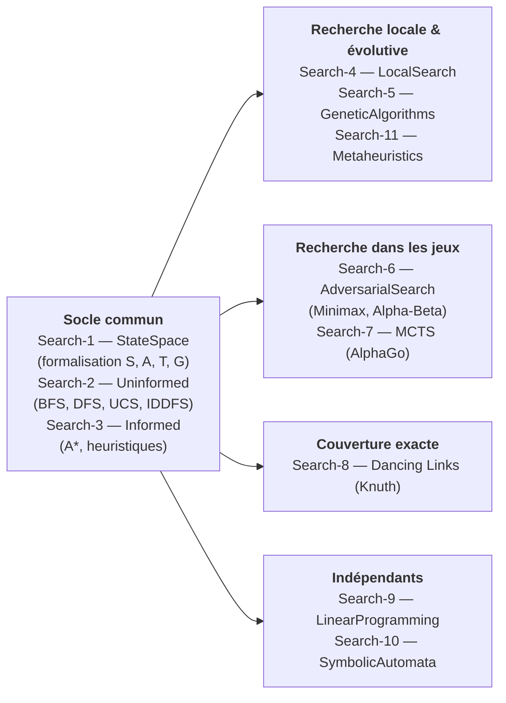

# Partie 1 : Search Fondamental

[↑ Série Search](../README.md) | [Partie 2 : CSP →](../Part2-CSP/README.md)

Comment passer d'une énumération exhaustive à une exploration intelligemment guidée d'un espace d'états ? Cette première partie couvre les trois grands paradigmes de la recherche en IA : systématique (BFS, A*), locale (Hill Climbing, recuit simulé) et évolutive (algorithmes génétiques, PSO). Le fil rouge est la réduction progressive de l'espace de recherche, depuis la formalisation du problème jusqu'aux métaheuristiques comparées sur des benchmarks.

Le parcours s'ouvre sur une idée simple et étonnamment puissante : avant de résoudre un problème, il faut le poser. Search-1 montre qu'un taquin, un aspirateur-robot et une recherche d'itinéraire sont un seul et même objet mathématique — un espace d'états (S, A, T, G) — et que cette formalisation suffit à rendre le problème calculable. Search-2 lance alors l'exploration à l'aveugle : BFS garantit l'optimal mais explose en mémoire, DFS file droit mais peut se perdre, et leurs variantes (UCS, IDDFS) négocient chacune un compromis différent entre garantie et coût. Search-3 apporte la réponse classique à cette explosion : une heuristique — une estimation du chemin restant — et l'algorithme A*, dont l'optimalité tient à une propriété fine, l'admissibilité, que le notebook prend le temps d'éprouver plutôt que de la postuler.

La suite change deux fois de point de vue. Quand seule la destination compte — pas le chemin —, la recherche locale (Search-4) abandonne l'arbre d'exploration pour naviguer de voisin en voisin dans un paysage de fitness, quitte à accepter temporairement de moins bonnes solutions pour s'échapper des optima locaux (recuit simulé, recherche tabou). Les algorithmes génétiques (Search-5) généralisent le procédé : une population entière explore en parallèle, sélection et croisement faisant émerger les bonnes solutions. Et quand l'environnement riposte — un adversaire joue contre vous —, la recherche devient un jeu : Minimax et l'élagage Alpha-Beta (Search-6), puis Monte Carlo Tree Search (Search-7), qui remplace l'évaluation experte par la simulation statistique et mène jusqu'à l'architecture d'AlphaGo.

Trois extensions complètent le panorama. La couverture exacte et les Dancing Links de Knuth (Search-8), structure de données spectaculaire qui résout Sudoku, N-Queens et Pentominoes par simple manipulation de pointeurs. La programmation linéaire (Search-9), qui troque le discret pour le continu et résout en quelques lignes de PuLP des problèmes de transport et de régime alimentaire. Les automates symboliques (Search-10), où les transitions deviennent des prédicats Z3 — premier pont vers l'IA symbolique. Search-11 referme la partie en confrontant les métaheuristiques (PSO, ABC, recuit) sur des benchmarks communs : l'occasion de constater qu'aucune ne domine partout, et d'apprendre à choisir.

## Pourquoi cette partie

Cette partie est l'alphabet de toute la série : la formalisation en espace d'états, le backtracking et les heuristiques qu'on y construit sont réutilisés tels quels par la programmation par contraintes (Partie 2) et par les 21 notebooks d'application. Mais son véritable enseignement est un réflexe d'ingénieur : chaque algorithme y est présenté comme un compromis — complétude contre mémoire, garantie contre temps de calcul, exploration contre exploitation — et jamais comme une recette. C'est ce réflexe, plus que tel ou tel algorithme, qui distingue celui qui applique une bibliothèque de celui qui choisit une stratégie.

## Objectifs d'apprentissage

À l'issue de cette partie, vous serez capable de :

1. **Formaliser** un problème sous forme d'espace d'états (S, A, T, G) et l'implémenter en Python
2. **Choisir** l'algorithme de recherche adapté au problème : systématique (BFS, A*), locale (SA, Tabu), ou évolutive (GA, PSO)
3. **Concevoir et évaluer** des heuristiques admissibles et consistantes pour guider la recherche
4. **Appliquer** la recherche adversariale (Minimax, Alpha-Beta, MCTS) aux jeux à deux joueurs
5. **Comparer** les métaheuristiques sur des benchmarks réels et justifier le choix d'un algorithme

## Notebooks

| # | Notebook | Kernel | Contenu | Durée |
|---|----------|--------|---------|-------|
| 1 | [Search-1-StateSpace](Search-1-StateSpace.ipynb) | Python 3 | Espaces d'états, formalisation (S, A, T, G), taquin, aspirateur, recherche d'itinéraire | ~40 min |
| 2 | [Search-2-Uninformed](Search-2-Uninformed.ipynb) | Python 3 | BFS, DFS, UCS, IDDFS : comparaison des algorithmes non informés | ~50 min |
| 3 | [Search-3-Informed](Search-3-Informed.ipynb) | Python 3 | A*, Greedy, IDA*, heuristiques admissibles et consistantes | ~50 min |
| 4 | [Search-4-LocalSearch](Search-4-LocalSearch.ipynb) | Python 3 | Hill Climbing, Simulated Annealing, Tabu Search, paysages de fitness | ~45 min |
| 4 (.NET) | [Search-4-LocalSearch (C#)](Search-4-LocalSearch-Csharp.ipynb) | .NET (C#) | **Jumeau .NET** : Hill Climbing (steepest-ascent), Random-Restart, recuit simulé (critère de Metropolis, programmes de refroidissement), recherche tabou (liste tabou) — port C# fidèle sur paysage 1D multimodal puis N-Reines (benchmark taux de succès) | ~45 min |
| 5 | [Search-5-GeneticAlgorithms](Search-5-GeneticAlgorithms.ipynb) | Python 3 | Sélection, crossover, mutation, DEAP/PyGAD, théorie unifiée | ~50 min |
| 6 | [Search-6-AdversarialSearch](Search-6-AdversarialSearch.ipynb) | Python 3 | Minimax, Alpha-Beta pruning, Null-window search, tables de transposition | ~1h |
| 6 (.NET) | [Search-6-AdversarialSearch (C#)](Search-6-AdversarialSearch-Csharp.ipynb) | .NET (C#) | **Jumeau .NET** : Minimax, Alpha-Beta (speedup 31,9×), heuristique + profondeur limitée, iterative deepening, table de transposition — port C# fidèle sur Tic-Tac-Toe (valeur du jeu = 0) | ~1h |
| 7 | [Search-7-MCTS-And-Beyond](Search-7-MCTS-And-Beyond.ipynb) | Python 3 | Monte Carlo Tree Search, UCB1, OpenSpiel, architecture AlphaGo (DQN+MCTS) | ~1h30 |
| 8 | [Search-8-DancingLinks](Search-8-DancingLinks.ipynb) | Python 3 | Algorithme X de Knuth, Dancing Links (DLX), couverture exacte (Sudoku, N-Queens, Pentominoes) | ~1h30 |
| 9 | [Search-9-LinearProgramming](Search-9-LinearProgramming.ipynb) | Python 3 | Programmation linéaire avec PuLP, simplex, problème du transport, diet problem, PLNE | ~2h |
| 10 | [Search-10-SymbolicAutomata](Search-10-SymbolicAutomata.ipynb) | Python 3 | Automates finis (DFA/NFA) avec automata-lib, prédicats Z3, automates symboliques | ~2h |
| 11 | [Search-11-Metaheuristics](Search-11-Metaheuristics.ipynb) | Python 3 | PSO, ABC, SA, BRO avec MEALPy, benchmark comparatif de métaheuristiques | ~1h30 |
| 15 | [Search-15-NetworkX](Search-15-NetworkX.ipynb) | Python 3 | Bibliothèque de graphes `networkx` : `Graph`/`DiGraph`, DFS/BFS, Dijkstra, Bellman-Ford, centralités de degré, composantes connexes, MST, Floyd-Warshall, parité structurelle avec QuikGraph (Search-16) | ~1h |
| 16 | [Search-16-QuikGraph](Search-16-QuikGraph.ipynb) | .NET (C#) | Bibliothèque de graphes QuikGraph 2.5.0 (NuGet) : AdjacencyGraph / BidirectionalGraph / UndirectedGraph, DFS/BFS, Dijkstra, Bellman-Ford, centralités de degré, composantes connexes, Edmonds-Karp (flot max), parité avec NetworkX | ~1h |

## Progression

Les trois premiers notebooks forment le socle commun — on y apprend à poser un problème, puis à l'explorer systématiquement — et tout le reste s'y greffe. Au-delà, le parcours n'est pas linéaire : quatre branches indépendantes s'ouvrent, à prendre dans l'ordre de vos curiosités :

- **Recherche locale et évolutive** : Search-4 (LocalSearch) puis Search-5 (GeneticAlgorithms) puis Search-11 (Metaheuristics)
- **Recherche dans les jeux** : Search-3 puis Search-6 (AdversarialSearch) puis Search-7 (MCTS)
- **Couverture exacte** : Search-2 puis Search-8 (DancingLinks)
- **Indépendants** : Search-9 (LinearProgramming, algèbre linéaire requise) et Search-10 (SymbolicAutomata, liens avec SymbolicAI/SMT/Z3)

Les fondamentaux de cette partie (formalisation, backtracking, heuristiques) sont le prérequis de la [Partie 2 (CSP)](../Part2-CSP/README.md).

## Prérequis & environnement

| Besoin | Détail |
|--------|--------|
| Python | 3.10+, environnement virtuel recommandé |
| `ortools` | Search-9 (Linear Programming) |
| `deap` | Search-5 (Genetic Algorithms) |
| `mealpy` | Search-11 (Métaheuristiques) |
| `z3-solver` | Search-10 (Symbolic Automata) |
| OpenSpiel | Search-7 (MCTS) : requiert WSL ou Linux |
| `QuikGraph 2.5.0` (NuGet) | Search-13 (parité C#) : nécessite .NET Interactive, installable via `dotnet tool install --global Microsoft.dotnet-interactive` |

Pour le setup complet, voir le [README de la série Search](../README.md).

## Bibliothèques : parité Python `networkx` ↔ .NET `QuikGraph`

Le notebook [Search-16-QuikGraph](Search-16-QuikGraph.ipynb) ferme la boucle côté **.NET Interactive** : il offre l'équivalent C# du notebook Python [Search-15-NetworkX](Search-15-NetworkX.ipynb), avec une table de parité structurelle entre les deux écosystèmes. La règle pratique : **QuikGraph 2.5.0** (fork KeRNeLith, NuGet) couvre les algorithmes classiques (DFS, BFS, Dijkstra, Bellman-Ford, A\*, Edmonds-Karp, Tarjan, MST, Floyd-Warshall) et **suffit pour tous les notebooks Search 1-11** si l'on travaille en C# — son **verdict honnête** est qu'il ne fournit pas les centralités élaborées (betweenness, closeness, PageRank) ni la détection de communautés (Louvain), qu'il faut alors implémenter à la main ou brancher une autre bibliothèque.

> **Note de numérotation.** Les **bibliothèques de graphes** portent les numéros **15-16** (`Search-15-NetworkX` en Python, `Search-16-QuikGraph` en .NET), volontairement hors de la plage 1-11 des algorithmes fondamentaux et hors de la plage 12-14 réservée à la [Partie 3](../Part3-Advanced/README.md) (heuristiques avancées : `Search-12-PatternDatabases`, `Search-13-LimitedDiscrepancySearch`, `Search-14-WeightedAstar`). Chaque numéro désigne désormais un notebook unique.

## Ponts vers les autres séries

Cette partie irrigue le reste du dépôt : les Dancing Links de Search-8 sont à l'œuvre dans la série [Sudoku](../../Sudoku/README.md), Minimax et MCTS (Search-6/7) se prolongent dans [GameTheory](../../GameTheory/README.md) avec OpenSpiel puis dans [RL](../../RL/README.md) côté politiques apprises, et les prédicats Z3 de Search-10 ouvrent sur [SymbolicAI](../../SymbolicAI/README.md).

## Références

Couverture par notebook des sources fondatrices mobilisées dans cette partie :

| Notebook(s) | Référence |
|-------------|-----------|
| Search-1 à 7, 9 | Russell, S., & Norvig, P. — *Artificial Intelligence: A Modern Approach* (4e éd., 2021). La référence pour la formalisation en espace d'états, les algorithmes informés/non informés et la recherche dans les jeux. |
| Search-3 (Informed) | Hart, P. E., Nilsson, N. J., & Raphael, B. (1968) — « A Formal Basis for the Heuristic Determination of Minimum Cost Paths », *IEEE Trans. on Systems Science and Cybernetics* 4(2). L'article fondateur d'A*. |
| Search-5 (GeneticAlgorithms) | Holland, J. H. (1975) — *Adaptation in Natural and Artificial Systems*. University of Michigan Press. Origine des algorithmes génétiques. |
| Search-7 (MCTS) | Browne, C. B., Powley, E., et al. (2012) — « A Survey of Monte Carlo Tree Search Methods », *IEEE Trans. on Computational Intelligence and AI in Games* 4(1). |
| Search-8 (DancingLinks) | Knuth, D. E. (2000) — « Dancing Links », dans *Millennial Perspectives in Computer Science* (Springer). |
| Search-11 (Metaheuristics) | Kennedy, J., & Eberhart, R. (1995) — « Particle Swarm Optimization », *Proc. IEEE Int. Conf. on Neural Networks*. Origine du PSO. |

## FAQ

| Problème | Solution |
|----------|----------|
| A* trop lent sur les grands graphes | Vérifier que l'heuristique est admissible ET consistante ; essayer IDA* (Search-3), qui consomme moins de mémoire |
| GA stagne sans amélioration | Augmenter le taux de mutation ou la taille de la population ; comparer avec les métaheuristiques de Search-11 |

---

## Conclusion / Prochaines étapes

### Ce que vous avez appris

Cette première partie a posé **l'alphabet de la recherche en IA**. L'arc pédagogique part d'un seul objet mathématique — l'espace d'états `(S, A, T, G)` formalisé en Search-1 — et en fait le dénominateur commun d'une grande famille d'algorithmes :

- **La recherche systématique** (Search-2, Search-3) — de l'énumération à l'aveugle (BFS, DFS, UCS, IDDFS) jusqu'à l'exploration informée par une heuristique (A*, Greedy, IDA*). Le moment clé est l'épreuve de l'**admissibilité** : l'optimalité d'A* ne se postule pas, elle se démontre, et la frontière entre une heuristique qui guide et une heuristique qui ment est fine.
- **La recherche locale et évolutive** (Search-4, Search-5, Search-11) — abandonner l'arbre d'exploration pour naviguer de voisin en voisin dans un paysage de fitness, accepter temporairement de dégrader (recuit simulé, tabou), puis laisser une population entière explorer en parallèle (génétiques, PSO, ABC). Le benchmark comparatif de Search-11 enseigne le **no-free-lunch** : aucune métaheuristique ne domine partout.
- **La recherche dans les jeux** (Search-6, Search-7) — quand l'environnement riposte, la recherche devient adversariale : Minimax et l'élagage Alpha-Beta, puis Monte Carlo Tree Search, qui remplace l'évaluation experte par la simulation statistique et mène jusqu'à l'architecture d'AlphaGo.
- **Trois extensions** (Search-8, Search-9, Search-10) — les Dancing Links de Knuth pour la couverture exacte, la programmation linéaire (du discret au continu via PuLP), et les automates symboliques où les transitions deviennent des prédicats Z3 — premier pont vers l'IA symbolique.

Le véritable enseignement, au-delà du catalogue d'algorithmes, est un **réflexe d'ingénieur** : chaque méthode y est présentée comme un compromis — complétude contre mémoire, garantie contre temps de calcul, exploration contre exploitation — et jamais comme une recette universelle.

### Prochaines étapes

- **La programmation par contraintes** : la suite naturelle est la [Partie 2 (CSP)](../Part2-CSP/README.md), qui réutilise le backtracking et les heuristiques de cette partie pour propager des contraintes plutôt que d'énumérer — la réduction de l'espace de recherche y devient systématique plutôt qu'heuristique.
- **Les applications** : les [21 notebooks d'application](../Applications/README.md) (détection de contours, TSP, VRP, optimisation de portefeuille, hyperparameter tuning) mobilisent directement les métaheuristiques et la recherche locale vues ici sur des problèmes réels.
- **Les ponts vers les autres séries** : les Dancing Links irriguent [Sudoku](../../Sudoku/README.md), Minimax et MCTS se prolongent dans [GameTheory](../../GameTheory/README.md) (OpenSpiel) puis [RL](../../RL/README.md) (politiques apprises), et les prédicats Z3 de Search-10 ouvrent sur [SymbolicAI](../../SymbolicAI/README.md). Reprendre un de ces ponts après avoir posé les fondations de la recherche donne aux primitives une nouvelle profondeur.
- **La série dans son ensemble** : le [sommaire Search](../README.md) cartographie les quatre parties et les applications — celle-ci est le socle commun.

### Le fil rouge

La recherche en IA propose un changement de regard sur la résolution de problèmes : ne plus voir chaque algorithme comme une recette à appliquer, mais comprendre qu'ils sont tous des **négociations d'un même compromis fondamental** — entre la garantie de trouver l'optimal et le coût pour l'atteindre, entre explorer l'inconnu et exploiter l'acquis, entre la complétude et la mémoire disponible. BFS garantit l'optimal mais explose en mémoire ; DFS file droit mais peut se perdre ; A* négocie les deux via une heuristique dont l'honnêteté (l'admissibilité) conditionne la justesse du résultat ; le recuit simulé accepte de remonter la pente pour s'échapper d'un optimum local ; MCTS remplace l'expertise par la statistique. Comprendre la recherche, c'est comprendre qu'il n'existe pas de « bon » algorithme dans l'absolu, mais une famille de stratégies dont le choix dépend du compromis qu'on est prêt à accepter — et que ce compromis, loin d'être une limitation, est précisément ce qui rend la recherche applicable à tout problème formalisable en espace d'états.
