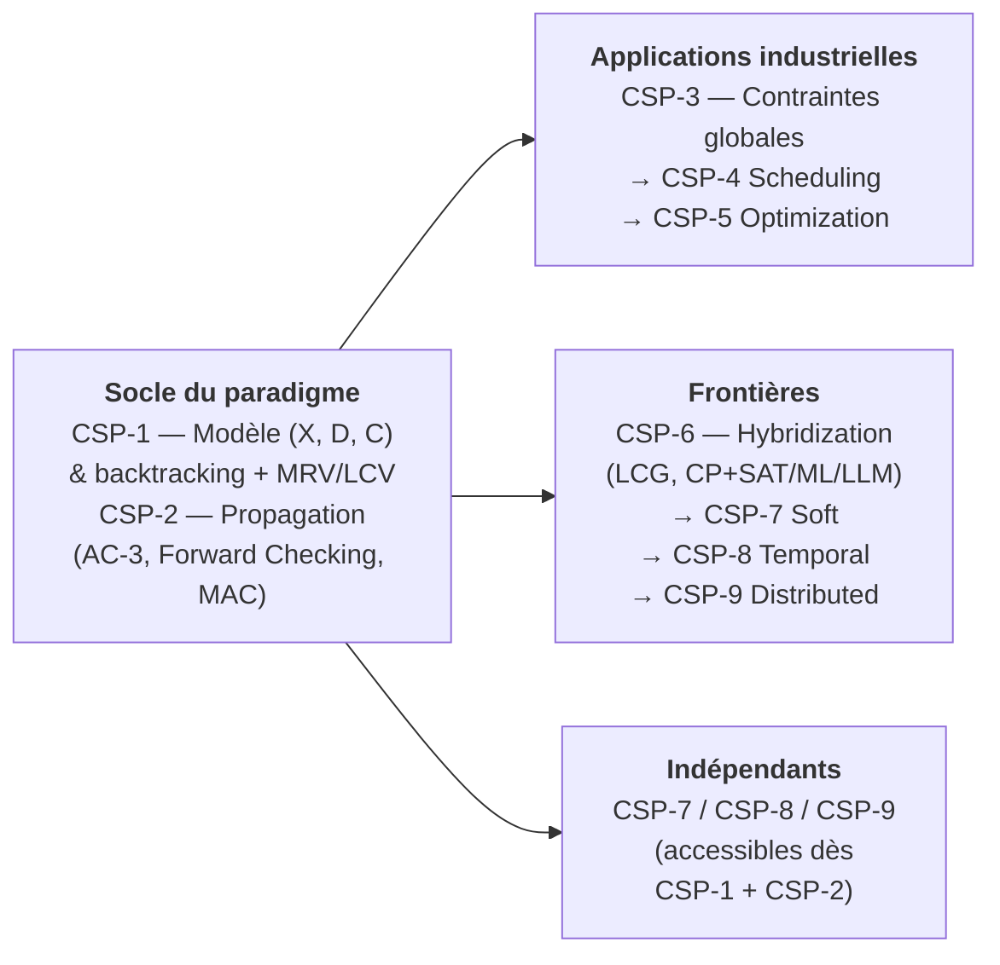

# Partie 2 : Programmation par Contraintes

[← Partie 1 : Search](../Part1-Foundations/README.md) | [↑ Série Search](../README.md) | [Partie 3 : Recherche avancée →](../Part3-Advanced/README.md)

Au lieu de concevoir un algorithme d'exploration, que se passe-t-il si l'on déclare les contraintes du problème et que l'on laisse le solveur trouver les solutions ? La programmation par contraintes (CSP) représente ce changement de paradigme : on ne cherche plus, on contraint. Ce modèle déclaratif est au coeur des outils industriels (ordonnancement, logistique, vérification) et s'applique naturellement aux problèmes NP-difficiles.

Les deux premiers notebooks installent le socle. CSP-1 pose le modèle (X, D, C) — variables, domaines, contraintes — et montre que le backtracking de la Partie 1, enrichi de deux heuristiques de bon sens (choisir d'abord la variable la plus contrainte, essayer d'abord la valeur la moins contraignante), résout déjà des problèmes non triviaux. CSP-2 introduit l'idée qui fait la puissance du paradigme : la propagation. Plutôt que de découvrir une impasse en s'y enfonçant, AC-3 et MAC élaguent les valeurs impossibles avant même de les essayer — l'espace de recherche se réduit de lui-même, par simple déduction locale.

La montée en puissance occupe les quatre notebooks suivants. CSP-3 passe aux contraintes globales (AllDifferent, Cumulative, Circuit), ces contraintes de haut niveau pour lesquelles les solveurs embarquent des propagateurs spécialisés — c'est là que CP-SAT se met à résoudre en quelques millisecondes ce qu'un backtracking naïf mettrait des heures à parcourir. CSP-4 et CSP-5 appliquent l'arsenal aux deux grands classiques industriels : l'ordonnancement (Job-Shop, RCPSP, planification d'infirmiers) et l'optimisation combinatoire (Bin Packing, Knapsack, portefeuille). CSP-6, le notebook le plus avancé, ouvre le capot : la Lazy Clause Generation explique pourquoi CP-SAT s'appelle ainsi — un solveur CP qui apprend des clauses SAT en cours de route — et les hybridations CP+ML et LLM+CSP esquissent ce que devient la discipline à l'ère des grands modèles : le langage naturel comme interface de modélisation, le solveur comme garant.

Les trois derniers notebooks desserrent chacun une hypothèse du cadre classique : et si toutes les contraintes n'avaient pas le même poids (CSP-7, contraintes souples) ? Et si les variables étaient des intervalles de temps (CSP-8, algèbre d'Allen) ? Et si personne ne détenait le problème en entier (CSP-9, résolution distribuée et préservation de la vie privée) ?

## Pourquoi cette partie

Si la Partie 1 enseigne à chercher, celle-ci enseigne à modéliser — et c'est un art plus subtil qu'il n'y paraît. Le même problème, déclaré avec des contraintes binaires ou avec une contrainte globale équivalente, peut passer de plusieurs heures de calcul à quelques millisecondes : le solveur n'a pas changé, seule la formulation a changé. Cette sensibilité à la modélisation est la compétence centrale du praticien, et la raison pour laquelle ces techniques équipent les outils d'ordonnancement, de logistique et de vérification utilisés en production. C'est aussi le premier contact de la série avec le raisonnement déclaratif — celui qu'approfondissent Z3 et la planification PDDL côté SymbolicAI.

## Objectifs d'apprentissage

À l'issue de cette partie, vous serez capable de :

1. **Modéliser** un problème NP-difficile comme un CSP (variables, domaines, contraintes) et le résoudre avec OR-Tools CP-SAT
2. **Maîtriser** les techniques de propagation (AC-3, Forward Checking, MAC) pour réduire l'espace de recherche
3. **Exploiter** les contraintes globales (AllDifferent, Cumulative, Circuit) pour les problèmes industriels
4. **Composer** CSP avec SAT, ML et LLM pour des solutions hybrides (LCG, CP+ML, LLM+CSP)
5. **Étendre** le cadre classique aux contraintes souples, temporelles et distribuées

## Notebooks

| # | Notebook | Kernel | Contenu | Durée |
|---|----------|--------|---------|-------|
| 1 | [CSP-1-Fundamentals](CSP-1-Fundamentals.ipynb) | Python 3 | Modèle CSP (X, D, C), backtracking, heuristiques MRV et LCV | ~50 min |
| 2 | [CSP-2-Consistency](CSP-2-Consistency.ipynb) | Python 3 | AC-3, Forward Checking, MAC : propagation de contraintes | ~45 min |
| 3 | [CSP-3-Advanced](CSP-3-Advanced.ipynb) | Python 3 | Contraintes globales OR-Tools : AllDifferent, Cumulative, Circuit, LNS | ~50 min |
| 4 | [CSP-4-Scheduling](CSP-4-Scheduling.ipynb) | Python 3 | Job-Shop (JSSP), RCPSP, Nurse Scheduling, IntervalVar, NoOverlap | ~1h |
| 5 | [CSP-5-Optimization](CSP-5-Optimization.ipynb) | Python 3 | Bin Packing, Knapsack, Cutting Stock, Portfolio Optimization | ~1h |
| 6 | [CSP-6-Hybridization](CSP-6-Hybridization.ipynb) | Python 3 | Lazy Clause Generation (LCG), CP+SAT, CP+ML, LLM+CSP | ~1h30 |
| 7 | [CSP-7-Soft](CSP-7-Soft.ipynb) | Python 3 | Contraintes souples : Fuzzy CSP, Weighted CSP, Semiring-based CSP | ~1h |
| 8 | [CSP-8-Temporal](CSP-8-Temporal.ipynb) | Python 3 | Algèbre d'intervalles d'Allen, Simple Temporal Problems (STP), TCSP | ~1h |
| 9 | [CSP-9-Distributed](CSP-9-Distributed.ipynb) | Python 3 | Asynchronous Backtracking (ABT), AWC, Privacy-preserving CSP | ~1h30 |

### Parité Python ⇄ .NET

Les neuf notebooks de cette partie existent en **binôme bilingue** : une version Python (OR-Tools CP-SAT) et une version C# / .NET, dans l'esprit de l'Epic de parité #4956. Le port .NET invoque la **vraie lib** — jamais une réimplémentation jouet : Choco-solver bridgé via IKVM (jurisprudence #4667), OR-Tools natif, ou port from-scratch d'un algorithme sans solveur off-the-shelf selon le terrain.

| # | Python (OR-Tools CP-SAT) | .NET (C#) | Solveur .NET |
|---|--------------------------|-----------|--------------|
| 1 | [CSP-1-Fundamentals](CSP-1-Fundamentals.ipynb) | [CSP-1-Fundamentals-Csharp](CSP-1-Fundamentals-Csharp.ipynb) | Choco-solver via IKVM |
| 2 | [CSP-2-Consistency](CSP-2-Consistency.ipynb) | [CSP-2-Consistency-Csharp](CSP-2-Consistency-Csharp.ipynb) | Choco-solver via IKVM (propagation native) |
| 3 | [CSP-3-Advanced](CSP-3-Advanced.ipynb) | [CSP-3-Advanced-Csharp](CSP-3-Advanced-Csharp.ipynb) | Choco-solver via IKVM |
| 4 | [CSP-4-Scheduling](CSP-4-Scheduling.ipynb) | [CSP-4-Scheduling-Csharp](CSP-4-Scheduling-Csharp.ipynb) | OR-Tools CP-SAT natif (+ section Choco comparative) |
| 5 | [CSP-5-Optimization](CSP-5-Optimization.ipynb) | [CSP-5-Optimization-Csharp](CSP-5-Optimization-Csharp.ipynb) | Choco-solver via IKVM (contrainte globale `binPacking`) |
| 6 | [CSP-6-Hybridization](CSP-6-Hybridization.ipynb) | [CSP-6-Hybridization-Csharp](CSP-6-Hybridization-Csharp.ipynb) | OR-Tools CP-SAT natif (LCG, CP+SAT) |
| 7 | [CSP-7-Soft](CSP-7-Soft.ipynb) | [CSP-7-Soft-Csharp](CSP-7-Soft-Csharp.ipynb) | Choco-solver via IKVM (réification `reifyWith` / `ifThen`) |
| 8 | [CSP-8-Temporal](CSP-8-Temporal.ipynb) | [CSP-8-Temporal-Csharp](CSP-8-Temporal-Csharp.ipynb) | OR-Tools CP-SAT natif (IntervalVar temporels) |
| 9 | [CSP-9-Distributed](CSP-9-Distributed.ipynb) | [CSP-9-Distributed-Csharp](CSP-9-Distributed-Csharp.ipynb) | ABT multi-agent (port from scratch, Yokoo 1992) |

> **Quel solveur .NET pour quel terrain ?** CSP-4 (ordonnancement `IntervalVar`, `NoOverlap`, `Cumulative`), CSP-6 (Lazy Clause Generation, CP+SAT) et CSP-8 (intervalles temporels) sont routés vers **OR-Tools CP-SAT natif** — le terrain où CP-SAT excelle, cf. *vrai outil SOTA pour le problème* (#3801). Les binômes 1, 2, 3, 5 et 7 illustrent **Choco via IKVM** comme levier de parité .NET pour une lib Java — y compris `binPacking`, contrainte globale dont la propagation surpasse la linéarisation BoolVar manuelle. CSP-9 (DisCSP) n'a pas de solveur off-the-shelf : l'algorithme ABT (Yokoo 1992) y est porté **from scratch** en C# multi-agent.

## Progression

CSP-1 et CSP-2 sont incontournables : tout le paradigme — un modèle déclaratif, une propagation qui élague — tient dans ces deux notebooks. Au-delà, trois chemins s'offrent selon votre objectif :

- **Applications industrielles** : CSP-3 puis CSP-4 (Scheduling) et/ou CSP-5 (Optimization)
- **Frontières** : CSP-6 (Hybridization, le notebook le plus avancé), puis CSP-7/8/9 (Soft/Temporal/Distributed)
- **Indépendants** : CSP-7, CSP-8 et CSP-9 sont accessibles après CSP-1 + CSP-2



Les notebooks CSP présupposent les bases de la Partie 1 : formalisation en espace d'états ([Search-1](../Part1-Foundations/Search-1-StateSpace.ipynb)) et backtracking ([Search-2](../Part1-Foundations/Search-2-Uninformed.ipynb)).

## Prérequis & environnement

| Besoin | Détail |
|--------|--------|
| Python | 3.10+, environnement virtuel recommandé |
| `ortools` | Dépendance principale de toute la série (CP-SAT) |
| Clé API (optionnel) | CSP-6, section LLM+CSP uniquement ; le reste du notebook fonctionne sans |

Pour le setup complet, voir le [README de la série Search](../README.md).

## FAQ

| Problème | Solution |
|----------|----------|
| Solveur CP-SAT trop lent sur les grandes instances | Préférer les contraintes globales (AllDifferent, Cumulative) aux contraintes binaires équivalentes ; utiliser LNS (CSP-3) |
| Comment choisir entre CP-SAT et un solveur SAT ? | CP-SAT pour les contraintes globales et l'optimisation (objectif), SAT pour la décision pure ; CSP-6 détaille les compromis |
| CSP-9 : les algorithmes distribués ne convergent pas | Vérifier que le réseau de contraintes est un arbre, ou utiliser AWC (Weak-Commitment) au lieu d'ABT |
| Où sont les applications concrètes ? | Voir [Applications](../Applications/README.md) : 21 notebooks (N-Queens, Nurse Scheduling, VRP, TSP...) |

## Ponts vers SymbolicAI

Les notebooks CSP nécessitent une compréhension préalable de :
- **[Search-1 (StateSpace)](../Part1-Foundations/Search-1-StateSpace.ipynb)** : formalisation des problèmes
- **[Search-2 (Uninformed)](../Part1-Foundations/Search-2-Uninformed.ipynb)** : backtracking = DFS avec retour arrière

## Progression recommandée

```text
CSP-1 (Fundamentals) ──> CSP-2 (Consistency) ──> CSP-3 (Advanced)
                                                    │
                                    ┌───────────────┼───────────────┐
                                    │               │               │
                              CSP-4           CSP-5           CSP-6
                            (Scheduling)   (Optimization)  (Hybridization)
                                    │               │
                                    └───────────────┘
                                            │
                              ┌─────────────┼─────────────┐
                              │             │             │
                         CSP-7         CSP-8         CSP-9
                         (Soft)      (Temporal)   (Distributed)
```

## Transition vers SymbolicAI

| CSP Concept | SymbolicAI Counterpart |
|-------------|------------------------|
| OR-Tools CP-SAT | Z3/01_Linq2Z3_Intro (SMT solving) |
| Scheduling/Planning | Planners (PDDL, HTN) |
| Constraint logic | Tweety (Formal Logic) |
| Temporal CSP | Temporal Planning, STP |

## Ponts inter-séries

| Série | Lien | Relation |
| ------- | ------ | ---------- |
| [Partie 1 : Search](../Part1-Foundations/README.md) | Fondamentaux | Prérequis : backtracking, heuristiques |
| [Applications](../Applications/README.md) | 21 notebooks d'application | Mise en pratique des CSP |
| [Search (parent)](../README.md) | Vue d'ensemble | Contexte et parcours global |
| [Sudoku](../../Sudoku/) | Résolution par contraintes | Application directe des CSP |
| [SymbolicAI/SMT/Z3](../../SymbolicAI/SMT/Z3/README.md) | Solveur SMT | CSP-6 (LCG) et automates symboliques |
| [Probas/Infer](../../Probas/Infer/) | Infer.NET | Modèles graphiques et contraintes |

## Références

Couverture par notebook des sources fondatrices de la programmation par contraintes :

| Notebook(s) | Référence |
|-------------|-----------|
| CSP-1 à 6 | Tsang, E. (1993) — *Foundations of Constraint Satisfaction*. Academic Press. La référence classique sur le modèle CSP et les algorithmes de résolution. |
| CSP-1, CSP-2 | Russell, S., & Norvig, P. — *Artificial Intelligence: A Modern Approach* (4e éd., 2021), ch. « Constraint Satisfaction Problems ». Formalisation (X, D, C) et backtracking avec MRV/LCV. |
| CSP-2 (Consistency) | Mackworth, A. K. (1977) — « Consistency in Networks of Relations », *Artificial Intelligence* 8(1). Origine de l'arc-consistency (AC-3). |
| CSP-3 (Advanced) | Régin, J.-C. (1994) — « A filtering algorithm for constraints of difference in CSPs », *AAAI-94*. Le propagateur global AllDifferent. |
| CSP-6 (Hybridization) | Ohrimenko, I., Stuckey, P. J., & Codish, M. (2009) — « Propagation via Lazy Clause Generation », *Constraints* 14(3). Origine de la Lazy Clause Generation. |

---

## Conclusion / Prochaines étapes

### Ce que vous avez appris

Cette deuxième partie a opéré un **changement de paradigme** : ne plus chercher, mais contraindre. Là où la Partie 1 construisait un algorithme d'exploration, la programmation par contraintes **déclare** le problème — variables, domaines, contraintes — et délègue la recherche au solveur. L'arc pédagogique parcourt les couches successives qui rendent ce paradigme puissant :

- **Le socle déclaratif** (CSP-1, CSP-2) — le modèle `(X, D, C)` posé en CSP-1, enrichi des heuristiques MRV/LCV qui prolongent le backtracking de la Partie 1 ; puis **l'idée qui change tout**, la propagation (AC-3, Forward Checking, MAC) : plutôt que de découvrir une impasse en s'y enfonçant, élaguer les valeurs impossibles avant même de les essayer — l'espace de recherche se réduit de lui-même, par déduction locale.
- **Les contraintes globales** (CSP-3) — AllDifferent, Cumulative, Circuit : ces contraintes de haut niveau embarquent des propagateurs spécialisés, et c'est là que CP-SAT résout en millisecondes ce qu'un backtracking naïf mettrait des heures. La leçon centrale du paradigme : **la formulation est la performance**.
- **Les applications industrielles** (CSP-4, CSP-5) — ordonnancement (Job-Shop, RCPSP, planification d'infirmiers avec IntervalVar/NoOverlap) et optimisation combinatoire (Bin Packing, Knapsack, portefeuille) : l'arsenal CSP appliqué aux deux grands classiques de la recherche opérationnelle.
- **Sous le capot et les frontières** (CSP-6) — la **Lazy Clause Generation** explique pourquoi CP-SAT s'appelle ainsi : un solveur CP qui apprend des clauses SAT en cours de route ; les hybridations CP+ML et LLM+CSP esquissent la discipline à l'ère des grands modèles.
- **Desserrer les hypothèses** (CSP-7, CSP-8, CSP-9) — contraintes souples (poids inégaux), contraintes temporelles (algèbre d'Allen, STP), résolution distribuée et préservation de la vie privée.

Le véritable enseignement est une **sensibilité à la modélisation** : le même problème, déclaré avec des contraintes binaires ou avec une contrainte globale équivalente, peut passer de plusieurs heures à quelques millisecondes — le solveur n'a pas changé, seule la formulation a changé. Cette compétence de formulation est ce qui distingue le praticien CSP.

### Prochaines étapes

- **Les applications** : les [21 notebooks d'application](../Applications/README.md) (N-Queens, Nurse Scheduling, VRP, TSP, Picross, Minesweeper CSP) mettent en pratique CP-SAT sur des problèmes concrets avec benchmark baseline-comparison.
- **Vers le raisonnement symbolique** : la modélisation déclarative de cette partie est le premier contact avec un mode de raisonnement qu'approfondissent [Z3/SMT](../../SymbolicAI/SMT/Z3/README.md) (SMT solving), les [Planners](../../SymbolicAI/Planners/) (PDDL, HTN) et [Tweety](../../SymbolicAI/Tweety/) (logique formelle) côté SymbolicAI. CSP-6 (LCG) fait explicitement le pont vers SAT.
- **Retour aux fondamentaux** : après avoir vu la puissance de la propagation, reprendre [Search-2 (backtracking)](../Part1-Foundations/Search-2-Uninformed.ipynb) — le DFS y apparaît comme un cas particulier de CSP sans propagation, et l'on mesure le saut qu'apportent AC-3/MAC.
- **La série dans son ensemble** : le [sommaire Search](../README.md) cartographie les quatre parties et les applications — celle-ci est le socle déclaratif qui prolonge la Partie 1 (recherche) et prépare la Partie 4 (métaheuristiques) et les Applications.

### Le fil rouge

La programmation par contraintes propose un changement de regard sur la résolution de problèmes : ne plus opposer **modélisation** et **résolution** comme deux étapes séparées, mais comprendre qu'en CSP **la modélisation est la résolution**. Le backtracking de la Partie 1, enrichi de la propagation (AC-3/MAC), devient capable d'élaguer l'espace de recherche par pure déduction locale avant même d'essayer une valeur ; les contraintes globales (AllDifferent, Cumulative, Circuit) encapsulent des algorithmes experts que le praticien invoque sans les réécrire ; la Lazy Clause Generation révèle que CP-SAT n'est ni purement CP ni purement SAT, mais une hybridation qui apprend ses échecs. La leçon transversale : un problème NP-difficile n'est pas forcément « dur à résoudre », il est « dur à bien formuler » — et c'est cette compétence de formulation, plus que la maîtrise de tel ou tel solveur, que cette partie cherche à transmettre. C'est aussi le premier pas vers le raisonnement déclaratif au sens large, celui des prouveurs SMT et des planificateurs PDDL où l'on déclare ce que l'on sait et laisse le moteur déduire le reste.

## Navigation

[<- Partie 1 : Search Fondamental](../Part1-Foundations/README.md) | [Retour à la série Search](../README.md) | [Partie 3 : Recherche avancée ->](../Part3-Advanced/README.md)
