# Partie 4 : Metaheuristiques Composables (MetaGeneticSharp)

[↑ Série Search](../README.md) | [← Partie 3 : Recherche avancée](../Part3-Advanced/README.md) | [Notebooks MGS →](MGS-1-Introduction.ipynb)

Comment passer de l'application *d'une* métaheuristique à la **composition** de plusieurs ? Cette partie ouvre la voie à [MetaGeneticSharp](https://github.com/jsboige/MetaGeneticSharp) — une bibliothèque .NET qui reconstruit les métaheuristiques publiées (Whale Optimization, Equilibrium Optimizer, Differential Evolution, Bare-Bones PSO, modèle insulaire...) à partir de **primitives réutilisables** plutôt que comme des monolithes opaques. Dix-neuf notebooks .NET Interactive (C#) en sont le fil conducteur : un algorithme doit pouvoir s'énoncer en quelques lignes déclaratives, et chaque brique (sélection, croisement, mutation, réinsertion) doit pouvoir être interceptée et recomposée. L'arc part de la grammaire fluente (composition, MGS-1..5), caractérise les biais de l'optimiseur (centrage MGS-10, rotation MGS-12, synergie d'îles MGS-11/14), puis culmine sur le **No-Free-Lunch** : quatre capstones réunissent ses réponses classiques — mesurer le paysage (MGS-15), sélectionner l'algorithme (MGS-16), contrôler le paramètre pendant la course (MGS-17), éprouver le tout sur le banc CEC standard shift+rotate combiné (MGS-18) — avant un **démontage** : MGS-19 débranche l'opérateur de recuit du compound SA et l'éprouve isolé, montrant qu'un composant *fonctionne* détaché mais ne porte pas seul le bénéfice du tout.

Contrairement aux Parties 1 et 2 (notebooks Python avec OR-Tools, DEAP, mealpy), cette partie est un **side track C# .NET 9.0** : elle consomme GeneticSharp et la couche métaheuristique comme sous-modules, et s'exécute via le kernel `dotnet-interactive`. C'est le pont entre la série pédagogique Python et une vraie bibliothèque de code industrialisable — la démonstration que les concepts vus en Python (Search-5 génétique, Search-11 métaheuristiques) se retrouvent, solidement typés et composables, dans un runtime .NET. Les notebooks consomment la bibliothèque (sous-module voisin [`MetaGeneticSharp/`](../MetaGeneticSharp/)) via ses DLLs buildées.

## Pourquoi cette partie

Les Parties 1-2 enseignent à *choisir* une métaheuristique face à un problème ; cette partie enseigne à en *construire* et en *combiner*. La motivation est double :

- **Pédagogique.** Reconstruire WOA ou EO à partir de primitives (`Match`, `Container`, `Scoped`, contrôle-flux géométrique) force à comprendre *pourquoi* chaque étape existe — là où importer `mealpy` ou `scipy` masque le mécanisme derrière un appel de fonction. C'est le même réflexe qu'écrire un A* à la main avant d'utiliser `networkx`.
- **Ingénierie.** La composition ouvre des configurations qu'aucune bibliothèque monolithique n'offre directement : sous-populations spécialisées (Eukaryote), migration entre îles (Islands), métaheuristiques hybrides assemblées par grammaire fluente. Ces patterns existent dans la littérature mais sont rares dans les libs grand public.

L'enseignement transversal rejoint celui des Parties 1-2 : aucune métaheuristique ne domine partout (cf [Search-11](../Part1-Foundations/Search-11-Metaheuristics.ipynb)), et la bonne réponse à un problème d'optimisation est rarement « l'algorithme X » mais plutôt « la bonne composition de primitives pour ce paysage de fitness ».

## Positionnement : MetaGeneticSharp dans le paysage

| Bibliothèque | Langage | Représentation | Philosophie | Lien |
|--------------|---------|----------------|-------------|------|
| **MetaGeneticSharp** | C# .NET 9 | Agnostique (gènes = interfaces GeneticSharp) | **Composants > métaphores** : algorithmes reconstruits depuis des primitives composables | [jsboige/MetaGeneticSharp](https://github.com/jsboige/MetaGeneticSharp) |
| GeneticSharp | C# .NET | Agnostique (bit, permutation, arbre, float) | Bibliothèque GA classique, opérateurs en interfaces | [giacomelli/GeneticSharp](https://github.com/giacomelli/GeneticSharp) (sous-module, v3.1.4, non patché) |
| mealpy | Python | Vecteurs (continus surtout) | Catalogue large, tronc commun vectoriel, très compact | [thieu1995/mealpy](https://github.com/thieu1995/mealpy) |
| HeuristicLab | C# .NET | Plugin-based, GUI lourde | Plateforme d'expérimentation, optimisation interactive | [heal-research/HeuristicLab](https://github.com/heal-research/HeuristicLab) |

MetaGeneticSharp vise le point que les autres n'occupent pas : **l'expressivité déclarative de mealpy** (un algorithme en quelques lignes) **sur la représentation agnostique de GeneticSharp** (bit strings, permutations, arbres), sans sacrifier la performance. C'est le « child project » que [GeneticSharp PR #87](https://github.com/giacomelli/GeneticSharp/pull/87) suggérait de devenir : la couche métaheuristiques du PR, absorbée dans un moteur autonome au-dessus d'un GeneticSharp vanilla.

## Objectifs d'apprentissage

À l'issue de cette partie, vous serez capable de :

1. **Reconstruire** une métaheuristique publiée (WOA, EO) à partir de primitives composables plutôt que d'en importer une boîte noire
2. **Composer** des métaheuristiques via la grammaire fluente (`Match`, `Container`, `Scoped`) pour assembler des configurations hybrides
3. **Structurer** une population en sous-populations spécialisées (Eukaryote) ou en îles migratoires (Islands)
4. **Évaluer** quand une composition custom bat une métaheuristique monolithique sur un paysage de fitness donné

## Notebooks

Cette partie se compose de dix-neuf notebooks .NET Interactive (C#), hébergés dans ce répertoire et consommant le sous-module voisin [`MetaGeneticSharp/`](../MetaGeneticSharp/) :

| # | Notebook | Concept clé | Primitives introduites | Durée |
|---|----------|-------------|------------------------|-------|
| 1 | [MGS-1-Introduction](MGS-1-Introduction.ipynb) | Moteur autonome `MetaGeneticAlgorithm` | `DefaultMetaHeuristic`, `NoOp`, fitness quadratique | ~40 min |
| 2 | [MGS-2-Composition](MGS-2-Composition.ipynb) | Assemblage déclaratif | `Match`, contrôle-flux, grammaire fluente | ~45 min |
| 3 | [MGS-3-Eukaryote](MGS-3-Eukaryote.ipynb) | Sous-populations spécialisées | chromosomes composites, partitionnement | ~50 min |
| 4 | [MGS-4-Islands](MGS-4-Islands.ipynb) | Modèle insulaire | populations structurées, migration entre îles | ~50 min |
| 5 | [MGS-5-CompoundMetaheuristics](MGS-5-CompoundMetaheuristics.ipynb) | Reconstruire les composés publiés (WOA/EO/FBI) | `MetaHeuristicsService`, `WhaleOptimisationAlgorithm`, `EquilibriumOptimizer`, factory `CreateMetaHeuristicByName` | ~50 min |
| 6 | [MGS-6-Benchmarks](MGS-6-Benchmarks.ipynb) | Comparaison honnête | `KnownFunctions`, composé WOA vs Uniform vs Islands | ~50 min |
| 7 | [MGS-7-TSP](MGS-7-TSP.ipynb) | Grammaire agnostique à la représentation | `TspFitness`, `OrderedCrossover`, permutation + `Islands` | ~45 min |
| 8 | [MGS-8-LandscapeExplorer](MGS-8-LandscapeExplorer.ipynb) | Visualiser la surface de fitness | heatmaps PNG graphiques, 3 modes (fonction / carte d'altitude / image), trajectoire de convergence | ~50 min |
| 9 | [MGS-9-EverestRelief](MGS-9-EverestRelief.ipynb) | Relief terrestre réel comme paysage | `DemGrid` (wrapper `ImageHeightMapFunction`), cartes `KnownHeightMap` de jsboige, GA/WOA/EO vs PSO, flipbook de convergence | ~55 min |
| 10 | [MGS-10-CenterBias](MGS-10-CenterBias.ipynb) | Biais central vs robustesse au déplacement | banc `CenterBiasBenchmark` (Kudela 2022), composés WOA/EO/FBI/DE/BBPSO/SA vs GA/Random, signature $\Delta$ | ~45 min |
| 11 | [MGS-11-IslandSynergy](MGS-11-IslandSynergy.ipynb) | Synergie d'îles complémentaires (verdict mesuré) | `IslandCompoundMetaheuristic`, archipel hétérogène DE+BBPSO, dé-biais `ShiftedFitness`, GIF multicolore par île | ~45 min |
| 12 | [MGS-12-AxisAlignment](MGS-12-AxisAlignment.ipynb) | Biais d'alignement d'axes (rotation) | décorateur `RotatedFitness` ($M x$, Givens orthogonale), séparabilité vs rotation, optimum relocalisé, signature $\Delta$ | ~45 min |
| 13 | [MGS-13-LandscapeDebias](MGS-13-LandscapeDebias.ipynb) | Pourquoi la rotation casse la séparabilité (visuel) | heatmaps 2-D des fonctions dé-biaisées `ShiftedFitness`/`RotatedFitness`, Sphere invariante vs Rosenbrock/Rastrigin rotatées, composition CEC | ~40 min |
| 14 | [MGS-14-IslandSynergyFound](MGS-14-IslandSynergyFound.ipynb) | Une synergie d'îles *trouvée* (et un cas négatif) | archipel `DE+BB-3:1` (3 îles DE + 1 île BBPSO), migration douce, banc multi-seed à contrôle propre, synergie robuste sur Ackley / absente sur Rastrigin | ~45 min |
| 15 | [MGS-15-LandscapeAnalysis](MGS-15-LandscapeAnalysis.ipynb) | Le *nombre* derrière la heatmap — FDC globale + rugosité locale | deux métriques complémentaires : FDC (Jones & Forrest 1995, Pearson fitness–distance, nuage SVG inline) + autocorrélation de marche aléatoire (Weinberger 1990, longueur de corrélation) + neutralité ; Sphere FDC 0,97 & lisse vs Rastrigin FDC 0,71 & rugueux (L≈1 pas) | ~40 min |
| 16 | [MGS-16-AlgorithmSelection](MGS-16-AlgorithmSelection.ipynb) | **Capstone** — sélectionner le bon optimiseur selon le paysage (Rice 1976) | No-Free-Lunch (Wolpert & Macready 1997) + cadre de Rice (features → portfolio → performance) ; réutilise les 8 optimiseurs de MGS-10 et les features FDC/ρ₁/neutralité de MGS-15 ; sélecteur heuristique validé puis testé sur un 4ᵉ paysage inconnu (Rosenbrock) | ~70 min |
| 17 | [MGS-17-ParameterControl](MGS-17-ParameterControl.ipynb) | **Deuxième réponse au No-Free-Lunch** — adapter les paramètres pendant la course (Eiben 1999) | taxonomie Eiben (tuning vs control : déterministe / adaptatif / self-adaptatif) via le vrai moteur du fork `ProbabilityConfig.DynamicProbability` ; schedule de décroissance, contrôle adaptatif par diversité, self-adaptatif hétérogène ; No-Free-Lunch au niveau du *paramètre* (l'ordre s'inverse entre Rastrigin et Sphere) | ~50 min |
| 18 | [MGS-18-CecBanc](MGS-18-CecBanc.ipynb) | **Consolidation du banc CEC** — shift+rotate combinés (le protocole standard de dé-biais) | décorateurs composés `RotatedFitness(ShiftedFitness(inner, offset), M)` (Givens orthogonale) ; banc à 4 variantes (plain/shifted/rotated/combined), étend `CenterBiasBenchmark` ; 8 optimiseurs sous shift+rotate sur Ackley+Rosenbrock ; les biais isolés (WOA central MGS-10, GA axe MGS-12) se composent — effet sub-additif ou super-additif selon le paysage | ~50 min |
| 19 | [MGS-19-MetropolisReinsertion](MGS-19-MetropolisReinsertion.ipynb) | **Recuit simulé décomposé** — l'opérateur de Metropolis débranché de SA et greffé seul sur un GA | `MetropolisReinsertion` isolé du compound `SimulatedAnnealing` et injecté via `MetaGeneticAlgorithm.Reinsertion` ; banc 5 configs (pairwise greedy contrôle, 3 températures Metropolis, élitiste référence) sur Sphere/Rastrigin/Ackley + limite frozen ; verdict honnête **négatif** — l'acceptation `exp(Δ/T)` détachée du couplage perturbation+acceptation ne porte pas le bénéfice du recuit | ~45 min |

La série couvre désormais l'arc complet : du moteur autonome (MGS-1) à la **reconstruction** des composés publiés depuis leurs primitives (MGS-5), puis à la comparaison sur benchmarks (MGS-6), à la **généralité** de la grammaire sur une représentation combinatoire (MGS-7) et à la **visualisation** des paysages de fitness, jusqu'à un relief terrestre réel (MGS-8/9), puis à la **caractérisation empirique du biais central** des composés (MGS-10) et à la **mesure falsifiable d'une synergie** d'îles hétérogènes (MGS-11), enfin au **second biais des bancs CEC** : l'alignement d'axes par rotation du paysage (MGS-12), puis à la **visualisation géométrique** de ce mécanisme — pourquoi la rotation brise la séparabilité, vu en heatmaps des paysages dé-biaisés (MGS-13) —, puis au **retour critique sur MGS-11** : MGS-14 y retrouve une synergie d'îles en calibrant la migration et le ratio exploration/exploitation, et la montre **conditionnelle** au paysage (robuste sur Ackley, absente sur Rastrigin), enfin au passage de l'**œil au nombre** : MGS-15 quitte la visualisation pour les **métriques** de paysage, en quantifiant la corrélation fitness–distance (FDC, Jones & Forrest 1995) qui prédit la difficulté globale, puis l'autocorrélation de marche aléatoire (Weinberger 1990) et la neutralité qui révèlent la *rugosité locale* — deux familles complémentaires qui diagnostiquent ce que la heatmap seule suggère, enfin au **capstone** : MGS-16 synthétise MGS-10 (le portfolio de 8 optimiseurs) et MGS-15 (les features de paysage) dans le **cadre de sélection d'algorithme de Rice (1976)** — *« features → portfolio → performance »* — pour répondre à la question que le théorème No-Free-Lunch (Wolpert & Macready 1997) pose sans la résoudre : *face à un nouveau problème, quel optimiseur choisir ?* Un sélecteur heuristique, validé sur les trois paysages connus puis éprouvé sur un quatrième jamais vu (Rosenbrock), montre que des features bon marché orientent vers les bons optimiseurs et écartent les catastrophes (WOA sur Ackley) — sans avoir à tout exécuter, enfin à la **deuxième réponse classique** au No-Free-Lunch : MGS-17 quitte le choix de l'algorithme pour celui du **paramètre**, en adaptant la probabilité de mutation *pendant* la course (taxonomie d'Eiben : tuning *fixe* vs control *déterministe* / *adaptatif* / *self-adaptatif*) via le vrai moteur du fork (`ProbabilityConfig.DynamicProbability`) — et montre que même le contrôle ne domine pas universellement : l'ordre des stratégies **s'inverse** entre Rastrigin (le self-adaptatif gagne) et Sphere (le réglage fixe timide gagne), No-Free-Lunch cette fois au niveau du paramètre, enfin à la **consolidation du banc CEC** : MGS-18 réunit les deux dé-biais étudiés isolément — le décalage (MGS-10) et la rotation (MGS-12) — dans le protocole *composé* qui définit les benchmarks standard du Congress on Evolutionary Computation (`RotatedFitness(ShiftedFitness(inner, offset), M)`), et confronte le portfolio de 8 optimiseurs aux 4 variantes (plain / shifted / rotated / combined). La thèse est structurelle : les biais isolés **se composent** — et l'effet du combined est *paysage-dépendant* (sub-additif sur Ackley, super-additif sur Rosenbrock pour WOA) plutôt qu'universellement pire, un récit plus riche que « shift+rotate aggrave toujours », enfin au **démontage du recuit simulé** : MGS-19 débranche `MetropolisReinsertion` du compound `SimulatedAnnealing` et le rebranche seul sur un GA de recombinaison (via l'injection `MetaGeneticAlgorithm.Reinsertion`), pour demander à la thèse « composants > métaphores » sa preuve la plus exigeante — peut-on isoler l'opérateur de survie du recuit et le faire fonctionner ailleurs ? La réponse est honnêtement **double** : oui l'opérateur s'exécute et discriminate sur le multimodal, mais non il **n'aide pas** un GA à franchir les cols — le bénéfice du recuit est dans le **couplage** perturbation+acceptation, pas dans l'acceptation seule (l'enfant recombinant n'est pas un « voisin »). Démonter révèle que le tout est plus que la somme des pièces. Descriptions détaillées notebook par notebook : voir « Parcours détaillé » ci-dessous. Feuille de route du fork : [ROADMAP.md](https://github.com/jsboige/MetaGeneticSharp/blob/main/ROADMAP.md).

L'arc se résume en dix vagues conceptuelles, chacune posant la brique que la suivante compose :

```mermaid
flowchart LR
    W1["<b>Socle &amp; composition</b><br/>MGS-1 — Moteur autonome<br/>MGS-2 — Grammaire fluente<br/>(Match, Container, Scoped)"]
    W2["<b>Structuration de population</b><br/>MGS-3 — Eukaryote<br/>(sous-populations)<br/>MGS-4 — Islands (migration)"]
    W3["<b>Composés publiés &amp; confrontation</b><br/>MGS-5 — Reconstruire WOA/EO/FBI<br/>MGS-6 — Benchmarks<br/>(No-Free-Lunch)<br/>MGS-7 — TSP combinatoire"]
    W4["<b>Paysages de fitness</b><br/>MGS-8 — Landscape Explorer<br/>MGS-9 — Everest (relief réel)"]
    W5["<b>Biais &amp; mesure falsifiable</b><br/>MGS-10 — Biais central<br/>(Kudela 2022)<br/>MGS-11 — Synergie d'îles<br/>(verdict négatif)"]
    W6["<b>Rotation &amp; retour critique</b><br/>MGS-12 — Alignement d'axes<br/>MGS-13 — Paysages dé-biaisés<br/>MGS-14 — Synergie conditionnelle"]
    W7["<b>Nombre &amp; sélection (capstone)</b><br/>MGS-15 — Métriques de paysage<br/>(FDC, autocorrélation)<br/>MGS-16 — Sélection d'algorithme<br/>(Rice 1976, No-Free-Lunch)"]
    W8["<b>Contrôle du paramètre</b><br/>MGS-17 — Parameter Control<br/>(Eiben 1999)<br/>tuning vs control<br/>(déterministe / adaptatif / self-adaptatif)"]
    W9["<b>Banc CEC consolidé</b><br/>MGS-18 — shift + rotate combinés<br/>(protocole CEC)<br/>biais composés<br/>(sub- vs super-additif)"]
    W10["<b>Recuit démonté</b><br/>MGS-19 — Metropolis isolé<br/>du compound SA<br/>opérateur fonctionnel<br/>bénéfice = couplage"]
    W1 --> W2 --> W3 --> W4 --> W5 --> W6 --> W7 --> W8 --> W9 --> W10
```



## Parcours détaillé

### 1 — Introduction

Pourquoi un moteur autonome au-dessus de GeneticSharp ? Le notebook pose le contrat : un `MetaGeneticAlgorithm` qui pilote l'évolution sans dépendre de la classe `GeneticAlgorithm` amont, et un `IMetaHeuristic` qui intercepte chaque étape. On compare `DefaultMetaHeuristic` (reproduit le comportement GA classique) à `NoOp` (ne fait rien — l'observateur passif) sur un fitness quadratique simple. C'est le socle : tout le reste de la série compose au-dessus de ce moteur.

### 2 — Composition

Le cœur de la thèse « composants > métaphores ». On introduit `Match` (dispatch déclaratif sur le contexte d'évolution) et les primitives de contrôle-flux, puis on assemble une métaheuristique en quelques lignes lisibles. Ce notebook établit la grammaire fluente (`Match`, `Container`, `Scoped`) que WOA et EO réutiliseront plus tard comme briques plutôt que comme monolithes.

### 3 — Eukaryote

On cesse de traiter la population comme un sac homogène. Le modèle eucaryote partitionne la population en sous-populations spécialisées portées par des chromosomes composites — chaque compartiment peut avoir sa propre métaheuristique. C'est une configuration qu'aucune bibliothèque monolithique grand public n'offre directement, et qui devient naturelle une fois la composition maîtrisée.

### 4 — Islands

Le modèle insulaire structure la population en îles migratoires : chaque île évolue indépendamment, puis des individus migrent périodiquement. La primitive `IslandMetaHeuristic` assemble ce schéma à partir des mêmes briques que les notebooks précédents. La leçon : la diversité structurée (vs une population panmictique) change la dynamique de convergence.

### 5 — Métaheuristiques composées

D'où viennent les algorithmes « publiés » — Whale Optimization (WOA), Equilibrium Optimizer (EO), Forensic-Based Investigation (FBI) — et comment les utiliser sans retomber dans le piège de la boîte noire ? Ce notebook montre, pour chaque composé du catalogue, le même parcours en trois temps : **(1) la description** — la métaphore et la mécanique, dans l'esprit des fiches de `mealpy` ; **(2) la reconstruction depuis les primitives** — le corps réel de la méthode `BuildMainHeuristic()` qui assemble l'algorithme à partir de briques (`IfElse`, `Match`, `GenerationMetaHeuristic`, croisements géométriques), lu transparentement ; **(3) le raccourci factory** — le one-liner `MetaHeuristicsService.CreateMetaHeuristicByName("...")` qui produit *exactement* cette reconstruction, avec la preuve (le type racine renvoyé) que raccourci et reconstruction sont identiques. C'est l'argument « composants > métaphores » poussé jusqu'à la **preuve d'équivalence** : reconstruire un algorithme bio-inspiré *démontre* son mécanisme au lieu de le cacher derrière une métaphore animale (critique de Sørensen, 2015). Les benchmarks de MGS-6 mettent ensuite ces composés à l'épreuve.

### 6 — Benchmarks

La confrontation honnête. Dix fonctions standard (`KnownFunctions.cs` : Sphere, Rastrigin, Rosenbrock, Ackley, Griewank, Schwefel, Michalewicz, Zakharov, Booth, Dixon-Price) servent de paysages de test. On compare trois configurations — Uniform, WOA-reconstruit-depuis-les-primitives, Islands — et on rapporte les résultats sans trier les victoires : WOA gagne ou égalise sur 7/10, **diverge sur Schwefel** (le contrôle-flux géométrique sans clamp de bornes explose sur [-500, 500]). Cette divergence n'est pas un bug caché : l'inspectabilité du composé (on lit l'`IfElse` du bubble-net) en fait une démonstration de No-Free-Lunch, là où `mealpy` masquerait le mécanisme.

### 7 — TSP combinatoire

La grammaire de composition est-elle agnostique à la représentation ? MGS-1 à 6 opèrent sur des surfaces *continues* (gènes en `double`), mais les primitives structurantes (`Match`, `Container`, `Scoped`, `Islands`) vivent *sous* la couche géométrique. Ce notebook applique la **même** `IslandMetaHeuristic` à un problème de **permutation** — le Voyageur de Commerce sur 20 villes, gènes = index entiers — **sans aucune adaptation** : le modèle insulaire opère sur `IChromosome` et ne lit jamais `Gene.Value`. La comparaison reste honnête (G.9) : la baseline panmictique bat les Islands sur cette instance TSP-20, illustration de No-Free-Lunch — le point n'est pas la victoire mais le **transfert sans réécriture** de la grammaire d'une géométrie continue à un espace combinatoire. Setup : `TspFitness`, `OrderedCrossover` (OX1), `ReverseSequenceMutation`. Au-delà des îles, ce notebook éprouve aussi la **théorie des croisements géométriques de Moraglio** (2007) — un crossover est *géométrique* si sa progéniture reste sur le segment géodésique entre les parents, pour une métrique donnée. Or une permutation admet **plusieurs métriques naturelles**, et le fork en câble deux : la distance de **swap** (Cayley : combien de transpositions séparent deux ordres), réalisée par `OrderedEmbedding` (Config 3), et la distance d'**insertion** (Ulam : combien d'éléments déplacer en décalant les autres), réalisée par `InsertionEmbedding` (Config 4). La Config 4 démontre le point central du *deep learning géométrique* : depuis le parent `[0,1,2,3,4]` vers une même cible-permutation `[2,0,1,3,4]`, un pas de swap atteint `[2,1,0,3,4]` là où un pas d'insertion atteint `[2,0,1,3,4]` — deux **géodésiques distinctes**, donc deux descendants distincts atteignables en un seul croisement. **C'est l'embedding (le choix de la métrique) qui porte la géométrie, pas le moteur** (`GeometricCrossover`) ni l'opérateur (le centroïde) : changer uniquement d'embedding change le paysage exploré. Cadrage honnête (G.9) : ni swap ni insertion n'a de privilège géographique sur ce TSP (ce sont des distances sur les étiquettes d'indice, pas sur les coordonnées des villes) — les deux sont des baselines, et le centroïde naïf à deux parents borne symétriquement les deux métriques (limite déjà documentée en Config 3) ; un embedding appris équivariant par permutation ferait mieux que les deux.

### 8 — Fitness Landscape Explorer

Tant que la surface de recherche est invisible, le choix d'une métaheuristique relève du doctrinal ; la visualiser le rend éclairé. Ce notebook consomme la bibliothèque `LandscapeRenderer` du fork — récupérée **byte-exact** depuis le *Landscape Explorer* original de jsboige (branche Metaheuristics @ `d05826fd`, PR giacomelli/GeneticSharp#87) — pour produire de **vraies heatmaps PNG graphiques** : `RenderHeatmap` peint chaque pixel selon la valeur de fitness (rampe rouge = haut / cyan = bas, minimum global Blanc, maximum global Noir) et `Plot` superpose les individus (BlueViolet) et le meilleur (Aqua). Trois modes de paysage sont couverts : **(1) fonction analytique** (les **vraies** `KnownFunctions`, p. ex. Sphere), **(2) carte d'altitude** — les **quatre cartes originales de jsboige** (Everest, Népal-Bhoutan, Plateau tibétain, Monde), récupérées byte-exact et embarquées comme ressources, lues comme champs de fitness via la verbatim `ImageHeightMapFunction` — et **(3) image custom** (un bitmap bimodal synthétique). La trajectoire de convergence du GA se superpose à la heatmap. Un wrapper `ShiftedFitness` translate l'optimum hors du centre pour rendre le **center-bias** visible : le GA converge sur l'optimum déplacé (≈ (2, 2)), preuve d'une recherche authentique. Les PNG sont encodés en base64 et affichés via `display(HTML(...))` — fiable sous papermill .NET (références DLL locales du fork, pas de `#r "nuget:"`).

### 9 — Trouver l'Everest : relief réel

L'aboutissement : le paysage n'est plus synthétique mais un **relief terrestre réel**, et en **vraie résolution**. Les quatre cartes d'altitude sont les **assets verbatim de jsboige** (`KnownHeightMap.{World, TibetanPlateau, NepalBhoutan, EverestMount}`, PNG ~2560 px, acquis à l'origine depuis un service d'élévation WMS) — récupérés **byte-exact** sur le fork @ `d05826fd` et lus par la classe verbatim `ImageHeightMapFunction` (niveaux de gris = altitude, interpolation inverse-distance). Pas de grille `int[]` rééchantillonnée, pas de downsampling ETOPO1 : le PNG haute-définition **est** le champ de fitness. La classe pédagogique `DemGrid` n'est qu'une enveloppe *drop-in* sur `ImageHeightMapFunction` (elle expose `Interp`/`GlobalMax`/`ElevMin`/`ElevMax`) ; aucune logique d'optimisation n'y vit. On **maximise** le niveau de gris — le pixel le plus clair est le sommet — sur quatre cartes à zoom croissant (Monde → Plateau → Himalaya → Everest : le pic se resserre à mesure qu'on zoome). On lance le moteur MGS (GA / WOA / Equilibrium Optimizer) plus une baseline **PSO** externe à budget d'évaluations égal, et on mesure le **taux de réussite** de chaque méthode à localiser le sommet, relié au rapport taille-du-bassin / résolution. Un **flipbook de convergence** (même orchestration `GenerationRan` qu'en MGS-8) montre ensuite la population se contracter génération après génération vers le sommet sur la région Everest. Rendu en **heatmaps PNG graphiques** via le même `SkiaLandscapeRenderer` du fork que MGS-8 (cohérence intra-série, rendu SkiaSharp cross-platform), avec la **cible inversée** : MGS-8 *minimise* ses fonctions analytiques (l'optimum porte le marqueur Blanc) ; MGS-9 *maximise* l'altitude, donc c'est le **sommet** qui porte le **marqueur Noir** — la cible explicite de la recherche.

### 10 — Biais central

MGS-6 montrait qu'aucune métaheuristique publiée ne bat la composition en performance brute ; MGS-10 ajoute une **seconde preuve**, plus profonde, en mesurant un défaut que la performance masque : le **biais central**. Le notebook câble le banc `CenterBiasBenchmark` du fork (protocole *centré-vs-déplacé* de Kudela, 2022) : chaque optimiseur est lancé sur une même fonction (Sphere, Rastrigin, Ackley ; dimension 5, NFE = 5000) en deux versions, l'optimum au **centre** puis **relocalisé** hors centre via `ShiftedFitness`. La signature $\Delta = f^\star_{\text{déplacé}} - f^\star_{\text{centré}}$ révèle si l'optimiseur résout la fonction *où que soit l'optimum* ($\Delta \approx 0$, non biaisé — la recherche aléatoire uniforme en est le contrôle canonique) ou s'il n'exploite que le placement central ($\Delta \gg 0$, biaisé vers le centre). Huit optimiseurs sont confrontés : **Random** (contrôle *seedé* `seed:7`, la référence non biaisée), **GA**, et les six composés géométriques **WOA, EO, FBI, Differential Evolution, Bare-Bones PSO, Recuit simulé** (Metropolis, 1953 ; Kirkpatrick, Gelatt & Vecchi, 1983). **Reproductibilité.** Le banc est **seedé** : `FastRandomRandomization.ResetSeed(masterSeed)` ancre le RNG global du framework une fois avant la suite, de sorte que les chiffres committés sont **reproduisibles** d'une exécution à l'autre — un étudiant qui ré-exécute le notebook retrouve exactement la table ci-dessous (le contrôle `Random` reste seedé séparément, `seed: 7`).

Lecture honnête (G.9), fonction par fonction. **Sphere** (unimodale lisse) : tous les optimiseurs résolvent les deux cas (~0) → $\Delta \approx 0$ partout ; fonction trop facile pour révéler un biais. **Rastrigin** (fortement multimodale) : les $\Delta$ sont **bruités** — le contrôle Random lui-même y affiche le $\Delta$ le plus élevé (+7,9) ; à NFE = 5000 l'optimiseur tombe dans un optimum local différent selon le tirage, donc le $\Delta$ y mesure de la variance d'échantillonnage, pas un biais directionnel (la colonne *moyenne* qui agrège les trois fonctions est dominée par ce bruit et n'est pas un signal fiable). **Ackley** (puits central entouré de rides — la fonction *conçue* pour exposer le biais central) : **seul WOA** affiche $\Delta \gg 0$ (+4,36) — il résout Ackley centrée (~0) mais **rate** Ackley déplacée (4,36), signant un biais central net ; tous les autres (GA, EO, FBI, DE, BBPSO, Recuit simulé) résolvent les deux cas (~0) et sont **robustes** au déplacement. Leçon affûtée de « composants > métaphores » : ce n'est pas l'étiquette métaphorique (baleine, équilibre, criminalistique) qui prédit le biais — EO, FBI et BBPSO sont eux aussi « métaphoriques » mais robustes — c'est la **structure de l'opérateur**. L'encerclement de la meilleure position (le *bubble-net* de WOA) ancre la recherche sur le meilleur courant, qui sur une fonction à optimum central démarre près du centre → biais. Les opérateurs d'exploration arithmétique (**DE**, $v = r_1 + F \cdot (r_2 - r_3)$, même couche géométrique `GeometricCrossover`/`MatchMetaHeuristic` que WOA) et la perturbation gaussienne isotrope du **Recuit simulé** (critère de Metropolis) n'ancrent pas → robustesse. Ce n'est donc pas l'étiquette « métaphore » qui biaise vers le centre, mais l'ancrage de l'opérateur à un attracteur géométrique fixe. Leçon de lecture (honnêteté, G.9) : un $\Delta$ élevé n'est un *biais* que si l'optimiseur résolvait effectivement le cas centré ; sinon il signe juste de la faiblesse — d'où trois exercices (stabilité multi-graine de la signature, balayage de l'amplitude du déplacement, extension de la suite à Rosenbrock et Griewank).

### 11 — Synergie d'îles complémentaires

La composition est-elle **magique** ? Combiner un bon explorateur et un bon exploiteur dans un archipel hétérogène produit-il mécaniquement une synergie ? Ce notebook pose la question de façon **falsifiable** et y répond chiffres à l'appui. On assemble trois archipels de **même structure** (4 îles, migration `SmallMigrationRate`) via `IslandCompoundMetaheuristic` — (a) îles DE homogènes, (b) îles BBPSO homogènes, (c) 2 îles DE + 2 îles BBPSO hétérogène — et on les lance, à budget d'évaluations égal, sur Rastrigin et Ackley **dé-biaisées** en dimension 5 (optimum relocalisé hors centre via `ShiftedFitness` + `ShiftVectors.Seeded`). La dimension 5 (et non 2) est choisie pour que les opérateurs *différencient* : en dim 2, tous résolvent Rastrigin (objectif 0), rendant une synergie indiscernable. Un **GIF multicolore** (overlay `individualColors` + `EncodeAnimatedGif`) colore chaque individu par son île (DE en orange, BBPSO en vert) : la répartition exploration / exploitation devient visible génération après génération. **Verdict honnête (résultat négatif)** : sur les deux fonctions, l'archipel hétérogène est **battu** par le meilleur de ses constituants (0/2 synergie) — la migration entre opérateurs dissemblables peut *propager les solutions piégées* et produire un compromis *inférieur* au meilleur constituant. La synergie d'îles n'est pas automatique : elle se démontre, ne se décrète pas — la même leçon « composants > métaphores » (Sorensen 2015) poussée jusqu'à la *mesure* de la composition. Caveats : graine unique (pas un banc multi-graines ; banc rigoureux rote = #3963), GIF 2D illustratif alors que le banc est en dim 5.

### 12 — Alignement d'axes

MGS-10 instrumentait le biais **central** (un optimum à l'origine flatte les optimiseurs qui démarrent au centre) ; ce notebook instrumente le biais **complémentaire** des bancs CEC : l'**alignement d'axes**. On introduit le décorateur compositionnel `RotatedFitness` du fork — l'analogue de `ShiftedFitness` pour la rotation — qui évalue la fonction interne sur des coordonnées rotationnées $f_{\text{rot}}(x) = f(M x)$, où $M$ est une matrice orthogonale ($M M^\top = I$) fabriquée par le factory `RotationMatrices.Seeded(n, seed)` comme **produit de rotations de Givens** (orthogonale par construction, reproductible par $(n, \text{seed})$). Comme `ShiftedFitness`, c'est un décorateur fin : les mathématiques des fonctions canoniques sont réutilisées telles quelles (jamais réimplémentées), seules les coordonnées sont linéairement transformées.

La **partie A** valide le décorateur contre la géométrie : sur Sphere (purement radiale, invariante par construction) la rotation est un no-op ; sur Rastrigin (terme $\sum \cos(2\pi x_i)$ séparable, un cosinus par axe) la rotation brise la séparabilité — la rotation *mesure* donc la séparabilité d'une fonction, c'est exactement pourquoi les suites CEC les rotationnent. La **partie B** montre la discrimination géométrique : sur Rosenbrock (asymétrique, vallée banane), la rotation conserve la *valeur* de l'optimum ($\approx 0$) mais en **déplace la position** — l'optimiseur aligné sur les axes ne peut plus descendre coordonnée par coordonnée.

La **partie C** confronte les optimiseurs au banc : signature $\Delta = f^\star_{\text{roté}} - f^\star_{\text{non roté}}$ (le RNG est reseedé avant chaque paire pour isoler l'effet du paysage, pas du hasard). **Lecture honnête (G.9)** : en dimension 2 et à ce budget, $\Delta \approx 0$ pour **tous** — Rosenbrock 2D est assez facile pour que GA, WOA, DE, BBPSO la résolvent à zéro, rotationnée ou non ; il n'y a alors **pas de marge** pour qu'un alignement sur les axes pénalise. Un banc honnête ne « prouve » un biais opérateur que si le problème est assez dur pour que le biais ait de la place pour se manifester : ici le signal net est dans la **géométrie du paysage** (parties A/B), et complexifier le problème (dimension plus élevée, budget plus serré) pour révéler l'effet *opérateur* — un $\Delta$ qui sépare les déplacements composante par composant (crossover uniforme, WOA) des déplacements vectoriels (DE) — est précisément l'objet de l'exercice 2. On retrouve l'esprit de MGS-10 : on juge un optimiseur sur la **structure de ses opérateurs** (vectoriels vs composante par composant, centrés vs non), pas sur le nom de sa métaphore — et un banc honnête doit tester les **deux** biais CEC (`ShiftedFitness` + `RotatedFitness`, composables en la variante CEC complète `new RotatedFitness(new ShiftedFitness(inner, o), M)`).

### 13 — Paysages dé-biaisés (visualisation)

Là où MGS-12 *mesure* numériquement la signature d'alignement d'axes ($\Delta \approx +2847$ pour le GA sur Rastrigin rotatée contre $\approx +2$ pour le DE), ce notebook la **montre** géométriquement. On consomme le décorateur `RotatedFitness` ($f_{\text{rot}}(x)=f(M x)$, $M$ orthogonale) et l'on rend, en vraies heatmaps PNG via `SkiaLandscapeRenderer`, le paysage de fitness avant/après rotation. **Partie B — témoin de contrôle** : Sphere est invariante par rotation (une matrice orthogonale préserve la norme), les deux paysages sont donc identiques pixel pour pixel (écart numérique $\sim 10^{-15}$) — la validation que le décorateur est correct, toute différence observée plus loin provient bien de la géométrie. **Partie C** : la « vallée banane » de Rosenbrock pivote à 45°, l'optimum déménage de $(1,1)$ à $(\sqrt 2, 0)$, un terme croisé apparaît — la séparabilité est visiblement détruite. **Partie D** : les crêtes cosinus de Rastrigin basculent hors de la grille d'échantillonnage axe-par-axe — c'est le mécanisme géométrique exact derrière le $\Delta$ du GA mesuré en MGS-12. **Partie E** : la composition CEC `new RotatedFitness(new ShiftedFitness(inner, o), M)` combine déplacement et rotation ; l'optimum atterrit en $M^\top o$ et le paysage est doublement dé-biaisé. Les mathématiques canoniques ne sont jamais réimplémentées : seules les coordonnées sont transformées par les décorateurs compositionnels. Trois exercices prolongent (Ackley rotatée, recherche sur grille de l'optimum relocalisé, composition shift+rotate sur Schwefel).

### 14 — Une synergie trouvée (et un cas négatif)

MGS-11 avait **cherché** une synergie island-mix et l'avait honnêtement déclarée **absente** (0/2). Ce notebook revient sur ce verdict négatif avec une question de méthode : *était-ce l'absence de synergie, ou une migration mal calibrée qui diluait le meilleur îlot ?* Le modèle insulaire expose trois boutons (`GlobalMigrationRate`, `MigrationsGenerationPeriod`, ratio des îlots via les `shares`) ; MGS-11 les laissait par défaut (`SmallMigrationRate`, période 10) — un brassage qui noie le petit îlot exploitateur dans la population exploratrice avant qu'il n'ait fini de raffiner. Hypothèse : en réduisant le brassage (période 20) **et** en déséquilibrant le ratio (3 îlots DE explorateurs + 1 îlot BBPSO raffineur), l'îlot exploitateur survit assez pour exploiter ce que les explorateurs découvrent.

Le banc est **multi-seed** (5 graines), à budget d'évaluations égal (1600 evals/archipel), sur Ackley et Rastrigin **dé-biaisées** en dimension 5, avec un **contrôle propre** : constituants (`DE-hom`, `BB-hom`) et combo candidate (`DE+BB-3:1`) partagent tous la même migration (`RandomRing`, taux 0.05, période 20) — seul le **ratio** varie, ce qui isole l'effet du ratio de l'effet de la migration. **Verdict mesuré** : sur Ackley, `DE+BB-3:1` bat **simultanément** ses deux constituants **5 graines sur 5** (fitness -0.309 vs DE-hom -2.302 et BB-hom -6.994) — la synergie est réelle et reproductible. Sur Rastrigin, `DE-hom` reste le meilleur et la même manipulation de ratio *dégrade* la fitness (-4.017 → -6.429) : **pas de synergie**. Leçon : la synergie island-mix existe mais est **conditionnelle** au paysage — Ackley (large cratère à puits profond) récompense l'exploration massive de DE *plus* le raffinement focalisé de BBPSO ; Rastrigin (forêt de minima réguliers) est mieux servi par l'exploration pure. Un **GIF multicolore** colore chaque individu par son îlot (DE orange, BBPSO vert) sur la convergence Ackley 2-D : on voit l'exploration orange se disperser puis converger, l'îlot vert raffiner sans être absorbé trop tôt. Un verdict négatif (MGS-11) n'est donc pas absolu — la bonne question n'est pas *« y a-t-il synergie ? »* mais *« à quelles conditions ? »*. Trois exercices prolongent (autre mode de migration, dimension 10, second cas de synergie sur Rosenbrock).

### 15 — Le nombre derrière la heatmap : FDC globale + rugosité locale

MGS-8 à MGS-13 nous ont donné l'**œil** : on *voit* la surface de fitness en couleur. Mais la visualisation est trompée par l'échelle, la rotation, le nombre de dimensions — deux paysages semblables peuvent être radicalement inégaux pour un algorithme. Ce notebook passe de l'**image au nombre** en introduisant la **Fitness Distance Correlation (FDC)** — Jones & Forrest (1995) — la métrique la plus utilisée pour prédire la difficulté d'un paysage. L'idée : un paysage est *facile* si la valeur de fitness est un bon indicateur de la distance au but ; tant que « mieux en fitness » rime avec « plus proche de l'optimum », un algorithme glouton ou génétique suit le gradient et converge.

On calcule $\mathrm{FDC} = \rho(f(x), d(x, x^\star))$ (Pearson entre fitness brute et distance à l'optimum global) en **échantillonnant N points** uniformément dans la boîte de recherche, en **réutilisant la vraie infrastructure** de MGS-8 : le `DoubleArrayChromosome`, les bornes `KnownFunctionsBounds.For(...)`, et les **vraies** `IFitness.Evaluate` du fork (composition, jamais de réimplémentation — la fitness est celle du moteur, pas une recopie). Trois benchmarks contrastés où l'œil hésite : Sphere (unimodal), Rastrigin (multimodal), Ackley (structure fine). **Verdict FDC** : Sphere obtient FDC ≈ 0,976 (la fitness guide presque parfaitement, paysage facile), Rastrigin chute à 0,713 (les pièges locaux dispersent la relation fitness–distance), Ackley à 0,766 (intermédiaire). Le **nuage fitness–distance** rendu en SVG inline montre *pourquoi* : Sphere dessine un croissant propre (fitness ≈ distance²), Rastrigin disperse verticalement (à distance égale, plusieurs bassins).

Mais la FDC ne mesure qu'une corrélation *globale* — elle ne dit rien de la **rugosité locale**. Le notebook introduit donc une **deuxième famille de métriques**, elle aussi réutilisant la vraie fitness du fork mais via une **marche aléatoire** (et non un tirage uniforme) : l'**autocorrélation de lag 1** $\rho_1$ (Weinberger 1990) et la **longueur de corrélation** $L = -1/\ln\rho_1$ — à quelle distance la fitness se décorréle-t-elle ? — ainsi que la **neutralité** (proportion de pas neutres, révélatrice des plateaux). **Verdict rugosité** : Sphere reste très lisse ($\rho_1 \approx 0{,}97$, $L \approx 30$ pas), Rastrigin s'effondre ($\rho_1 \approx 0{,}37$, $L \approx 1$ pas — le gradient local est du pur bruit, chaque pas décorréle), Ackley intermédiaire ($L \approx 10$). C'est l'explication **mécaniste** du verdict FDC : Rastrigin a une FDC basse non pas parce que sa fitness « ne guide pas » en moyenne, mais parce qu'à l'échelle locale elle **oscille** si vite qu'un glouton s'y empêtre. La **neutralité** rend un verdict honnête : quasi-nulle partout (~0–2 %) — ces benchmarks *continus* n'ont pas de plateaux, la métrique discrimine les paysages *discrets* (NK, SAT), pas ceux-ci. **Chaque métrique a son terrain** : les deux ensemble diagnostiquent ce que chacune, seule, masque — et justififie rétrospectivement pourquoi MGS-10 trouvait WOA biaisé sur Ackley (FDC intermédiaire *et* rugosité élevée : la fitness guide mal *et* oscille vite). Quatre exercices prolongent (FDC de Griewank, effet de la dimension, déception via Schwefel, rugosité de la vallée courbe de Rosenbrock).

### 16 — Capstone : sélectionner le bon optimiseur (cadre de Rice, No-Free-Lunch)

MGS-15 avait donné les **métriques** du paysage ; MGS-10 le **portfolio** mesuré de 8 optimiseurs. Ce notebook capstone referme la boucle : si aucun optimiseur ne gagne partout (théorème No-Free-Lunch, Wolpert & Macready 1997), alors le choix doit être *informé par le problème*. On applique le **cadre de sélection d'algorithme de Rice (1976)** — *features → algorithme du portfolio → performance* — en **réutilisant verbatim** l'infrastructure des deux notebooks précédents : le portfolio de 8 optimiseurs (Random, GA, WOA, EO, FBI, DE, BBPSO, SA via `MakeOptimizer` + `MetaHeuristicsService.CreateMetaHeuristicByName`) et les features de paysage (`Fdc`, `AutocorrLag1` via `RandomWalk`, `NeutralRatio`, `record LandscapeReport`).

L'arc est celui d'une expérience complète : (1) **oracle** — le banc `CenterBiasBenchmark` (Kudela 2022) mesure le regret $\Delta$ des 8 optimiseurs sur Sphere/Rastrigin/Ackley (vérité terrain) ; on agrège en **pire-cas** (et non moyenne, bruitée par Rastrigin) : DE, BBPSO, EO sont robustes (aucune fonction où ils s'effondrent), WOA s'effondre sur Ackley ($\Delta = +4{,}19$ — exactement le biais central de MGS-10). (2) **Features** — on décrit les trois paysages *sans les optimiser* (FDC Sphere 0,99 / Rastrigin 0,74 ; $\rho_1$ Sphere 0,98 / Rastrigin 0,62). (3) **Sélecteur heuristique** — une règle lisible (Rice) qui, des features, recommande l'optimiseur adapté et signale ceux à éviter ; recoupée contre l'oracle, elle est **ALIGNÉE** sur les trois paysages et évite correctement WOA sur Ackley. (4) **Généralisation** — un quatrième paysage jamais vu, Rosenbrock (vallée banane) : le sélecteur recommande DE/BBPSO qui atterrissent dans le top-3 réel — mais la feature FDC s'y révèle **trompeuse** (Rosenbrock est unimodale et lisse, pourtant FDC ≈ 0,71 : la métrique radiale ne capte pas la *vallée courbe*). **Leçon honnête** : les features de paysage orientent vers les bons optimiseurs et écartent les catastrophes évidentes, mais elles manquent la géométrie directionnelle — un FDC bas signifie tantôt « multimodal » (Rastrigin) tantôt « courbé » (Rosenbrock), et la feature seule ne distingue pas les deux. C'est le **capstone** de la Partie 4 : on est parti de métaheuristiques isolées, on les a mesurées (portfolio), on a appris à décrire les problèmes (paysage), et l'on sait désormais faire correspondre les deux — le No-Free-Lunch n'est pas une condamnation mais l'invitation à *raisonner sur le problème avant de lancer l'algorithme*. Quatre exercices prolongent (paysage neutre quantifié, sélecteur fondé sur le coût d'évaluation, limite du FDC sur Schwefel, vers un sélecteur appris par k-NN).

### 17 — Deuxième réponse au No-Free-Lunch : contrôler les paramètres pendant la course (Eiben 1999)

MGS-16 répondait au No-Free-Lunch en **sélectionnant** le bon algorithme pour le paysage. MGS-17 donne la **seconde réponse classique** : un *même* algorithme, mais dont on **adapte les paramètres pendant la course**. C'est la distinction de Karafotias et al. (2015) — reprise d'Eiben et al. (1999) — entre le **tuning** (réglage *offline*, fixe, le pari « un taux pour toute la course ») et le **control** (adaptation *online*, dynamique). Trois types de control sont distingués par la taxonomie d'Eiben : **déterministe** (un schedule $p(g)$ fonction de la génération), **adaptatif** (un feedback de l'état de la population), **self-adaptatif** (le taux encodé *par individu*).

Le notebook exploite le **vrai moteur du fork** — pas une réimplémentation. Le hook est `ProbabilityConfig.DynamicProbability : Func<IEvolutionContext,float,float>` combiné à `ProbabilityStrategy.OverwriteProbability` : à chaque évaluation, le solveur appelle `DynamicProbability(ctx, initial)` et **écrase** la probabilité de mutation du GA. Le `ctx` expose `Population.GenerationsNumber` (déterministe), les statistiques de population (adaptatif) et l'`OriginalIndex` de l'individu (self-adaptatif). C'est exactement la granularité que la taxonomie d'Eiben décrit — et le fork la fournit nativement. L'infrastructure est réutilisée verbatim depuis MGS-10/15/16 (`DoubleArrayChromosome`, `MakeOptimizer`, `RunAvg` sur 5 graines, `KnownFunctionsBounds`, `RastriginFitness`/`SphereFitness`).

L'arc est une démonstration à quatre bras, **budgétée à parts égales** (mêmes NFE = 5000, mêmes 5 graines {7,42,99,123,777}, pour ne pas tricher par le budget) : (1) **tuning fixe** — un sweep $p \in \{0{,}01, 0{,}05, 0{,}20, 0{,}50\}$ sur Rastrigin, le meilleur est $p=0{,}05$ (objectif 11,885) ; leçon : aucun taux fixe n'est robuste. (2) **control déterministe** — un schedule de décroissance exponentielle $p(g) = 0{,}5 \cdot e^{-3g/G}$ (explore tôt, exploite tard), dont la trace imprimée montre la probabilité chuter de 0,500 à 0,025. (3) **control adaptatif** — la probabilité suit un signal de diversité (écart-type du 1er gène de la génération courante). (4) **control self-adaptatif** — chaque individu porte son propre taux (grille par index), la population est **hétérogène**. **La leçon centrale (No-Free-Lunch du paramètre)** : sur Rastrigin, le self-adaptatif gagne nettement (9,944 — il *hedging* : à chaque instant, une sous-population a le bon taux pour la phase courante, l'`EliteSelection` préserve le meilleur des deux mondes) ; mais sur Sphere, **l'ordre s'inverse** — le réglage fixe timide ($p=0{,}05$) et le decay mènent (0,750 / 0,711), le self-adaptatif est dernier (1,066) : la mutation qui aidait à *échapper* aux minima locaux de Rastrigin ne fait que *bruiter* la convergence facile de Sphere. Aucune stratégie ne domine sur les deux paysages. C'est le miroir exact de MGS-16 : là où l'algorithme était paysage-dépendant, ici c'est le **paramètre** — et l'honnêteté du banc (succès Rastrigin **et** échec Sphere) évite de réciter « le contrôle c'est toujours mieux » que les données démentent. Quatre exercices prolongent (schedule linéaire, règle 1/5 de Rechenberg par taux de succès, vrai chromosome self-adaptatif d'Évolution Strategies, contrôle du crossover).

### 18 — Banc CEC consolidé : shift+rotate combinés, le protocole standard de dé-biais

MGS-10 isolait le **décalage** de l'optimum, MGS-12 la **rotation** des axes. Les benchmarks *réels* du Congress on Evolutionary Computation (CEC) font les deux à la fois : une fonction est *à la fois* translatée et rotatée, et c'est cette composition qui définit le standard de test des métaheuristiques depuis CEC 2005/2017. MGS-18 **consolide** ce protocole : il confronte les 8 optimiseurs du portfolio (verbatim MGS-16) à **quatre variantes** — plain, shifted, rotated, **combined** — en étendant `CenterBiasBenchmark` (qui n'en proposait que deux).

L'infrastructure est réutilisée verbatim : les décorateurs composes du fork `ShiftedFitness(inner, offset)` et `RotatedFitness(inner, M)` sont **composables** par construction — `RotatedFitness(ShiftedFitness(inner, Off), M)` applique la translation *puis* la rotation. `ShiftVectors.Seeded(n, magnitude, seed)` et `RotationMatrices.Seeded(n, seed)` (orthogonale via produit de rotations de Givens) garantissent la reproductibilité. La sanity check est **non dégénérée** (point test $x=(1,2,3,4,5)$ : les 4 variantes donnent 4 valeurs distinctes 9,70 / 12,20 / 10,72 / 13,05 — les décorateurs transforment bien la fonction).

La thèse est **structurelle** : les biais isolés de MGS-10 et MGS-12 **se composent** sous shift+rotate combiné. Mais l'effet du combined est **paysage-dépendant**, pas universellement pire. Sur **Ackley** : EO, FBI et DE résolvent les 4 variantes (~0) ; WOA s'effondre sur le cas *shifted* seul (2,97 — son biais central MGS-10) et GA sur le *rotated* seul (3,24 — son biais d'axe MGS-12) ; le combined de WOA est **sub-additif** (2,73 < shifted 2,97 — la rotation masque le décalage). Sur **Rosenbrock**, l'histoire s'inverse : le combined de WOA (6,91) **dépasse** à la fois le shifted (5,19) et le rotated (3,13) — **super-additif** (+1,41 : les deux biais se renforcent). Aucun optimiseur ne domine les 4 variantes sur les 2 paysages : DE est le plus robuste (pire-cas 1,71), WOA et Random « à éviter ». L'honnêteté du banc (sub-additif sur Ackley **et** super-additif sur Rosenbrock) évite le faux cadrage « le combined aggrave toujours » — un récit plus riche, fidèle aux données. Quatre exercices prolongent (nouvelle rotation seedée, rotation non-orthogonale, grand-angle, banc CEC complet 10 fonctions).

### 19 — Recuit simulé décomposé : l'opérateur de Metropolis isolé

MGS-10 confrontait le **recuit simulé** comme une boîte noire. Mais dans le fork, `SimulatedAnnealing` n'est pas un monolithe : c'est un **composé** assemblant une **perturbation gaussienne** (le croisement qui produit un voisin de l'individu courant) et une **réinsertion de Metropolis** (`MetropolisReinsertion`) qui accepte ou rejette ce voisin selon le critère $P = \exp(\Delta / T_k)$. MGS-19 **débranche** ce deuxième ingrédient et le rebranche **seul** sur un GA standard (croisement de recombinaison `UniformCrossover`, pas perturbation), via l'injection `ga.Reinsertion = reins`. C'est la thèse « composants > métaphores » poussée jusqu'au **démontage du recuit lui-même** : la métaphore thermodynamique est-elle indivisible, ou l'opérateur de survie est-il réutilisable ailleurs ?

Le banc isole l'effet de la **règle d'acceptation** à appariement constant : cinq configurations (`FitnessBasedPairwiseReinsertion` contrôle greedy, trois `MetropolisReinsertion` à températures froide/moyenne/chaude, `FitnessBasedElitistReinsertion` référence μ+λ) partagent le même croisement, la même mutation, la même sélection — seul le critère de survie varie. Budget commun (NFE = 5000, dim 5, 3 graines seedées → chiffres reproduisibles) sur Sphere (témoin neutre unimodal), Rastrigin et Ackley (multimodales). **Verdict honnête (résultat négatif, G.9)** : sur Sphere, l'annealing ne sert à rien (témoin neutre attendu) et le réglage chaud dégrade (≈ 0,10 contre ≈ 0,01) ; sur Rastrigin et Ackley, **aucun** réglage Metropolis n'améliore le contrôle greedy pairwise — le plus chaud est le **pire**. L'hypothèse naturelle (accepter des enfants moins bons aide à franchir les cols) est **réfutée**. L'explication la plus plausible est sémantique : dans SA l'enfant est un **voisin** du parent, donc accepter un moins bon voisin = explorer le voisinage ; ici l'enfant est un **recombinant** de deux parents (mosaïque par gène), donc accepter un recombinant moins bon n'est pas une exploration — c'est du bruit. **Le bénéfice du recuit réside dans le couplage** perturbation+acceptation, pas dans l'acceptation seule. C'est la leçon « composants > métaphores » dans sa forme la plus exigeante : on PEUT démonter SA, l'opérateur isolé FONCTIONNE sur le vrai moteur — mais il ne porte pas, à lui seul, le bénéfice du tout (écho de la synergie conditionnelle de MGS-11/14 : la composition n'est magique ni assemblée ni désassemblée). Une **limite frozen** (T→0 ⇒ règle greedy), vérifiée sur le témoin lisse Sphere (résidu = divergence de trajectoire RNG, non un effet d'acceptation), referme la cohérence. Trois exercices prolongent (schedule lent vs rapide, recombiner la perturbation pour restaurer le couplage, composition insulaire de l'opérateur).

## Configuration requise

Le kernel `dotnet-interactive` installé (**1.0.707101**, hôte .NET moderne) **charge nativement les assemblies `net9.0`** — vérifié par exécution : MGS-6 (qui référence `MetaGeneticSharp.Extensions` net9.0), MGS-18 et MGS-19 s'exécutent verts sur ce kernel. Les notebooks MGS se répartissent sur deux TFM :

- **MGS-1 à MGS-5** (Introduction, Composition, Eukaryote, Islands, Compound) ne consomment que `MetaGeneticSharp.Domain` + `Infrastructure` + `GeneticSharp`. Ils référencent les **DLL `net8.0`**, chargées par rétro-compat sur le kernel actuel (qui supporte net8.0/net9.0/net10).
- **MGS-6 à MGS-9** (Benchmarks, TSP, Landscape, Everest) dépendent en plus de `MetaGeneticSharp.Extensions` (SkiaSharp / `System.Drawing.Common`). Ils référencent les DLL `net9.0` et **s'exécutent sur le kernel actuel** (MGS-6 vérifié vert). *Sur l'ancien kernel 1.0.552801 (hôte net8.0-only), ils restaient bloqués* (follow-up historique désormais non requis sur le kernel actuel).

Règle : pas de contournement, installer l'environnement complet :

```powershell
# 1. .NET SDK (9.0 requis pour le fork source ; 8.0/10.0 optionnels)
dotnet --version

# 2. dotnet-interactive (kernel Jupyter pour C#, hôte .NET moderne >= 1.0.707101)
dotnet tool install --global Microsoft.dotnet-interactive
dotnet interactive jupyter install

# 3. Sous-modules + build du fork (les notebooks chargent les DLL par #r absolu)
cd MyIA.AI.Notebooks/Search/MetaGeneticSharp
git submodule update --init --recursive
dotnet build                      # build net9.0 (fork source ; DLLs pour MGS-6..18)
```

> **Bins `net8.0` pour MGS-1..5.** Le fork est actuellement single-TFM `net9.0`, donc `-p:TargetFramework=net8.0` échoue (le `project.assets.json` restauré ne contient que la cible net9.0). Pour produire `Domain` + `Infrastructure` en `net8.0` (référencés par MGS-1..5, chargés par rétro-compat sur le kernel actuel), il faut soit retargeter temporairement le `.csproj` en `net8.0` puis `dotnet build`, soit — solution propre — multi-targeter le fork en `<TargetFrameworks>net8.0;net9.0</TargetFrameworks>` (follow-up sur le fork, `Extensions`/SkiaSharp restant net9.0-only). Les bins référencés par MGS-1..5 doivent exister sous `src/MetaGeneticSharp.Domain/bin/Debug/net8.0/`.

Les notebooks chargent les DLL via `#r "c:/dev/MetaGeneticSharp/..."` (chemin du checkout de travail du fork). **MGS-1..5** pointent sur `src/MetaGeneticSharp.Domain/bin/Debug/net8.0/` (4 DLL : GeneticSharp.Domain, GeneticSharp.Infrastructure.Framework, MetaGeneticSharp.Domain, MetaGeneticSharp.Infrastructure) ; **MGS-6..14** pointent sur `src/MetaGeneticSharp.Extensions/bin/Debug/net9.0/` (Extensions + SkiaSharp + System.Drawing.Common). Les résultats numériques des notebooks MGS-1 à MGS-9 sont **stochastiques** (le RNG du framework n'y est pas seedé) : les outputs committés sont une exécution valide, les valeurs varient d'une exécution à l'autre. **MGS-10** fait exception : le banc y est **seedé** (`FastRandomRandomization.ResetSeed(masterSeed)` ancre le RNG global une fois avant la suite), de sorte que les chiffres de la table de biais central sont **reproduisibles** d'une exécution à l'autre. **MGS-11** aussi : il appelle `FastRandomRandomization.ResetSeed(42)` avant chaque banc, son verdict est **reproductible** (caveat : graine unique, pas un banc multi-graines). **MGS-12** de même : il reseed le RNG avant chaque paire optimiseur (rotationné vs non), de sorte que les deltas committés sont reproductibles (caveat : dimension 2 et budget large → $\Delta \approx 0$ pour tous ; révéler l'effet *opérateur* demande une dimension plus élevée, cf exercice 2). **MGS-14** aussi : il est **multi-seed** (5 graines, `FastRandomRandomization.ResetSeed` avant chaque archipel), son verdict (synergie robuste sur Ackley, pas de synergie sur Rastrigin) est **reproduisible** d'une exécution à l'autre. **MGS-17** de même : il est **multi-seed** (5 graines {7,42,99,123,777}, `FastRandomRandomization.ResetSeed` avant chaque course), et comme le `DynamicProbability` est une fonction **déterministe** de la génération / de l'index individu (pas de RNG interne), les chiffres du tableau de comparaison (self-adaptatif 9,944 sur Rastrigin, etc.) sont **reproduisibles** d'une exécution à l'autre. **MGS-19** de même : il est **multi-seed** (3 graines {7,42,99}, `FastRandomRandomization.ResetSeed` avant chaque course), de sorte que le banc Metropolis-vs-Pairwise (Sphere, Rastrigin, Ackley) et la limite frozen sont **reproduisibles** d'une exécution à l'autre.

Règle C.2 : les notebooks sont committés **avec leurs outputs** (exécution réelle, kernel .NET).

## Conventions

- **Représentation agnostique.** Les composés géométriques (WOA, EO) requièrent un chromosome qui stocke les gènes en `double` de façon transparente. Les notebooks définissent un `DoubleArrayChromosome` (assistant de test, non livré dans la lib) avec `CreateNew()` randomisant dans les bornes — indispensable pour la diversité initiale d'un benchmark.
- **Fitness = négation.** GeneticSharp *maximise* le fitness ; chaque `Evaluate()` des fonctions benchmark renvoie donc l'objectif nié. La lib pinne cette convention par [tests unitaires](https://github.com/jsboige/MetaGeneticSharp/blob/main/tests/MetaGeneticSharp.Extensions.Tests/KnownFunctionsTests.cs) (optimum à x* + négation).

## Boucle CoursIA ↔ fork

Le code de la bibliothèque vit dans le **fork** [jsboige/MetaGeneticSharp](https://github.com/jsboige/MetaGeneticSharp), monté ici comme sous-module (`MyIA.AI.Notebooks/Search/MetaGeneticSharp/`). Les notebooks pédagogiques (ce répertoire) sont propriété du dépôt CoursIA et consomment la bibliothèque via ses DLLs buildées. Ce point d'entrée ferme la boucle : depuis la série Search Python (Parties 1-2), on bascule vers le side track C#, qui redirige à son tour vers le fork pour le code source complet, les tests et la feuille de route.

## Références

Les métaheuristiques reconstruites dans cette partie suivent les articles fondateurs. Les liens bibliothèque (GeneticSharp, fork MGS) sont regroupés dans la section « Liens » ci-dessous.

| Notebook(s) | Métaheuristique | Référence |
|-------------|-----------------|-----------|
| MGS-1 (Introduction) | Algorithme génétique | Holland, J. H. (1975) — *Adaptation in Natural and Artificial Systems*. University of Michigan Press. |
| MGS-5 (Compound), MGS-6 (Benchmarks) | Whale Optimization Algorithm | Mirjalili, S., & Lewis, A. (2016) — « The Whale Optimization Algorithm », *Advances in Engineering Software* 95. |
| MGS-5 (Compound), MGS-9 (EverestRelief) | Equilibrium Optimizer | Faramarzi, A., Heidarinejad, M., Stephens, B., & Mirjalili, S. (2020) — « Equilibrium optimizer: A novel optimization algorithm », *Knowledge-Based Systems* 197. |
| MGS-10 (CenterBias) | Differential Evolution | Storn, R., & Price, K. (1997) — « Differential Evolution – A Simple and Efficient Heuristic for Global Optimization over Continuous Spaces », *Journal of Global Optimization* 11. |
| MGS-10 (CenterBias) | Bare-Bones Particle Swarm | Kennedy, J. (2003) — « Bare Bones Particle Swarms », *Proc. IEEE Swarm Intelligence Symposium*. |
| MGS-10 (CenterBias), MGS-19 (MetropolisReinsertion) | Recuit simulé (Simulated Annealing) | Metropolis, N., Rosenbluth, A. W., Rosenbluth, M. N., Teller, A. H., & Teller, E. (1953) — « Equation of State Calculations by Fast Computing Machines », *Journal of Chemical Physics* 21(6) ; Kirkpatrick, S., Gelatt, C. D., & Vecchi, M. P. (1983) — « Optimization by Simulated Annealing », *Science* 220(4598). |
| MGS-10 (CenterBias) | Test du biais central (centré-vs-déplacé) | Kudela, H. (2022) — protocole centré-vs-déplacé (centered-vs-shifted). |
| MGS-11 (IslandSynergy), MGS-19 (MetropolisReinsertion) | Modèle insulaire, synergie d'îles hétérogènes ; démontage d'un composé (composants > métaphores) | Sørensen, K. (2015) — « Metaheuristics—the metaphor exposed », *Intl. Trans. in Operational Research* 22(1). doi:10.1111/itor.12001 |
| MGS-9 (EverestRelief) | Particle Swarm Optimization (baseline) | Kennedy, J., & Eberhart, R. (1995) — « Particle Swarm Optimization », *Proc. IEEE Int. Conf. on Neural Networks*. |
| MGS-6, MGS-7, MGS-16 | No-Free-Lunch | Wolpert, D. H., & Macready, W. G. (1997) — « No free lunch theorems for optimization », *IEEE Trans. on Evolutionary Computation* 1(1). |
| MGS-16 (AlgorithmSelection) | Cadre de sélection d'algorithme | Rice, J. R. (1976) — « The Algorithm Selection Problem », *Advances in Computers* 15. doi:10.1016/S0065-2458(08)60520-3 |
| MGS-17 (ParameterControl) | Taxonomie tuning vs parameter control | Eiben, A. E., Hinterding, R., & Michalewicz, Z. (1999) — « Parameter Control in Evolutionary Algorithms », *IEEE Trans. on Evolutionary Computation* 3(2). doi:10.1109/4235.771166 |
| MGS-17 (ParameterControl) | État de l'art du parameter control | Karafotias, G., Hoogendoorn, M., & Eiben, A. E. (2015) — « Parameter Control in Evolutionary Algorithms: A Tutorial », *Evolutionary Computation* 23(2). doi:10.1162/EVCO_r_00136 |
| MGS-17 (Exercice 2) | Règle 1/5 (control adaptatif par succès) | Rechenberg, I. (1973) — *Evolutionsstrategie: Optimierung technischer Systeme nach Prinzipien der biologischen Evolution*. Frommann-Holzboog. (cf. Schwefel, H.-P. (1995), *Evolution and Optimum Seeking*, Wiley.) |
| MGS-18 (CecBanc) | Protocole CEC (shift+rotate composés) | Awad, N. H., Ali, M. Z., Suganthan, P. N., & Reynolds, R. G. (2016) — « Problem Definitions and Evaluation Criteria for the CEC2017 Special Session and Competition on Single Objective Real-Parameter Optimization », *Technical Report*, Royal Melbourne Institute of Technology. (suite de CEC2005 : Suganthan, P. N. et al. (2005).) |
| MGS-7 (Configs 3-4) | Croisement géométrique (Moraglio) | Moraglio, A. (2007) — *Towards a Geometric Unification of Evolutionary Algorithms*, PhD thesis, University of Essex. |

---

## Conclusion / Prochaines étapes

### Ce que vous avez appris

Cette quatrième partie a changé la question : non plus *« quelle métaheuristique choisir »* (Parties 1-2), mais *« comment construire et combiner des métaheuristiques à partir de primitives »*. L'arc pédagogique, porté par dix-neuf notebooks C# .NET 9 au-dessus de [MetaGeneticSharp](https://github.com/jsboige/MetaGeneticSharp), démontre la thèse **composants > métaphores** :

- **Le moteur autonome** (MGS-1, MGS-2) — un `MetaGeneticAlgorithm` qui pilote l'évolution sans dépendre de la classe `GeneticAlgorithm` amont, et la grammaire fluente (`Match`, `Container`, `Scoped`) qui permet d'assembler une métaheuristique en quelques lignes déclaratives lisibles. C'est le socle : tout le reste compose au-dessus.
- **La structuration de population** (MGS-3, MGS-4) — le modèle eucaryote (sous-populations spécialisées portées par des chromosomes composites) et le modèle insulaire (îles migratoires) : deux configurations qu'aucune bibliothèque monolithique grand public n'offre directement, et qui deviennent naturelles une fois la composition maîtrisée.
- **La reconstruction des composés publiés** (MGS-5) — WOA, EO, FBI : pour chaque algorithme du catalogue, le parcours en trois temps (description → reconstruction depuis les primitives `BuildMainHeuristic()` → raccourci factory prouvant l'équivalence). C'est l'argument poussé jusqu'à la **preuve** : reconstruire un algorithme bio-inspiré *démontre* son mécanisme au lieu de le cacher derrière une métaphore animale (critique de Sørensen, 2015).
- **La confrontation honnête** (MGS-6) — dix fonctions benchmark standard, comparaison Uniform / WOA / Islands sans trier les victoires : WOA gagne ou égalise sur 7/10 mais **diverge sur Schwefel**, démonstration de No-Free-Lunch là où `mealpy` masquerait le mécanisme.
- **L'agnosticisme à la représentation** (MGS-7) — la même `IslandMetaHeuristic` appliquée à un TSP-20 (permutation) sans aucune adaptation : la grammaire vit *sous* la couche géométrique et ne lit jamais `Gene.Value`. Le transfert continu → combinatoire sans réécriture. Le notebook pousse plus loin la **théorie géométrique de Moraglio** (Configs 3 et 4) : deux métriques de permutation distinctes (swap/Cayley via `OrderedEmbedding`, insertion/Ulam via `InsertionEmbedding`) définissent deux segments géodésiques distincts entre les mêmes parents — preuve que **c'est l'embedding (le choix de la métrique) qui porte la géométrie, pas le moteur** : c'est le point du *deep learning géométrique* appliqué aux opérateurs génétiques.
- **La visualisation des paysages** (MGS-8, MGS-9) — de vraies heatmaps PNG (fonction analytique, carte d'altitude, relief terrestre réel Everest) qui rendent le choix d'une métaheuristique *éclairé* plutôt que *doctrinal*, et un flipbook de convergence montrant la population se contracter vers le sommet.
- **La caractérisation du biais central** (MGS-10) — le protocole centré-vs-déplacé (Kudela 2022) confronte huit optimiseurs (Random, GA, WOA, EO, FBI, DE, BBPSO, Recuit simulé) sur un banc **seedé** (chiffres reproduisibles). Lecture fonction par fonction : sur Sphere (trop facile) et Rastrigin (trop bruitée à NFE = 5000) le signal n'est pas fiable, mais sur **Ackley** — la fonction conçue pour exposer le biais — **seul WOA** présente un biais central ($\Delta = +4,36$ : il résout le cas centré mais rate le cas déplacé) ; les sept autres, y compris les composés « métaphoriques » EO, FBI, BBPSO, sont **robustes**. Leçon affûtée de « composants > métaphores » : ce n'est pas l'étiquette métaphorique qui prédit le biais — EO, FBI, BBPSO sont eux aussi métaphoriques mais robustes — c'est la **structure de l'opérateur** : l'encerclement de la meilleure position (WOA) ancre vers le centre, là où l'arithmétique libre (DE, Recuit simulé) ou le pool d'équilibre (EO) n'y ancrent pas. Une **seconde preuve**, plus fine, au-delà de la performance brute (MGS-6).
- **La mesure d'une synergie** (MGS-11) — la composition est-elle magique ? Un archipel hétérogène (îles DE exploratrices + îles BBPSO exploitantes) est confronté, à budget égal sur fonctions dé-biaisées en dim 5, à ses constituants homogènes. Verdict **négatif** (0/2 synergie) : la migration entre opérateurs dissemblables peut *propager les solutions piégées* et produire un compromis *inférieur* au meilleur constituant. La synergie d'îles n'est pas automatique — elle se **démontre**, ne se décrète pas : « composants > métaphores » poussée jusqu'à la *mesure falsifiable* de la composition.
- **La synergie retrouvée, et conditionnelle** (MGS-14) — retour critique sur le verdict négatif de MGS-11. En calibrant la migration (période 20 au lieu de 10) **et** le ratio exploration/exploitation (3 îlots DE + 1 îlot BBPSO), la combo `DE+BB-3:1` bat **simultanément** ses deux constituants sur Ackley, **5 graines sur 5** (contrôle propre : constituants et combo partagent la même migration, seul le ratio varie). Mais la même manipulation de ratio *dégrade* la fitness sur Rastrigin — la synergie est **conditionnelle** au paysage. Leçon de méthode : un verdict négatif n'est pas absolu, la bonne question est *« à quelles conditions ? »*, et un banc honnête rapporte succès (Ackley) **et** échec (Rastrigin).
- **Le capstone : sélectionner plutôt qu'invoquer** (MGS-16) — le No-Free-Lunch (Wolpert & Macready 1997) dit qu'aucun optimiseur ne domine ; le **cadre de Rice (1976)** (*features → portfolio → performance*) répond pragmatiquement. Le notebook **réunit les deux fils** — le portfolio de 8 optimiseurs (MGS-10) et les features de paysage (MGS-15) — et construit un sélecteur heuristique qui, des seules features mesurées, oriente vers les optimiseurs robustes (DE/BBPSO/EO) et **évite les catastrophes** (WOA sur Ackley, $\\Delta=+4{,}19$) sans avoir à tout exécuter. Validé sur les trois paysages connus, il est **éprouvé sur un quatrième jamais vu** (Rosenbrock) où la recommandation atterrit dans le top-3 réel — mais où le FDC se révèle trompeur (la vallée courbe n'est pas captée par la métrique radiale). C'est la fermeture de l'arc : décrire le problème (paysage) pour **faire correspondre** l'algorithme (portfolio), transformer le No-Free-Lunch d'une condamnation en méthode.
- **La deuxième réponse au No-Free-Lunch : contrôler le paramètre** (MGS-17) — là où MGS-16 changeait *d'algorithme* selon le paysage, MGS-17 garde le *même* algorithme et adapte ses **paramètres pendant la course** (taxonomie d'Eiben 1999 : tuning *fixe* vs control *déterministe* / *adaptatif* / *self-adaptatif*). Le notebook se branche sur le vrai moteur du fork — `ProbabilityConfig.DynamicProbability`, qui écrase la probabilité de mutation à chaque évaluation — et montre les trois types de control en acte : un schedule de décroissance, un feedback de diversité, des taux *par individu* (self-adaptatif hétérogène). La leçon est honnête : le contrôle **n'est pas universellement meilleur** — sur Rastrigin le self-adaptatif gagne nettement (il *hedging*, une sous-population a toujours le bon taux), mais sur Sphere **l'ordre s'inverse** (la mutation qui échappe aux minima de Rastrigin ne fait que bruiter la convergence facile de Sphere). **No-Free-Lunch au niveau du paramètre**, miroir exact de celui de l'algorithme (MGS-16) : les deux réponses classiques, ici réunies, disent la même chose — aucune stratégie n'est universelle, seul le *raisonnement sur le problème* (quel paysage ? quelle phase de course ?) l'est.
- **La consolidation du banc CEC : shift+rotate combinés** (MGS-18) — les benchmarks *réels* du Congress on Evolutionary Computation translatent **et** rotatent simultanément. Le notebook réunit les deux dé-biais étudiés isolément (décalage MGS-10, rotation MGS-12) dans le protocole composé canonique (`RotatedFitness(ShiftedFitness(inner, offset), M)`), confronte les 8 optimiseurs aux 4 variantes (plain / shifted / rotated / combined), et montre la thèse structurelle : **les biais isolés se composent** — mais l'effet du combined est *paysage-dépendant* (sub-additif sur Ackley pour WOA : la rotation masque le décalage ; super-additif sur Rosenbrock : les deux biais se renforcent), pas universellement pire. L'arc se ferme sur la *méthode* : un banc honnête rapporte ce qui aggrave **et** ce qui compense, et aucun optimiseur ne survit aux 4 variantes des 2 paysages — DE le plus robuste, WOA et Random à éviter.
- **Le démontage du recuit simulé : l'opérateur de Metropolis isolé** (MGS-19) — la thèse « composants > métaphores » éprouvée dans son sens le plus exigeant : non seulement on **reconstruit** un composé (MGS-5), mais on peut en **débrancher** un ingrédient et le rebrancher ailleurs. Le notebook isole `MetropolisReinsertion` du compound `SimulatedAnnealing` et l'injecte seul sur un GA de recombinaison (`ga.Reinsertion = reins`), à appariement constant avec un contrôle greedy pairwise. Verdict honnête **négatif** (G.9) : l'acceptation `exp(Δ/T)` détachée de la perturbation **n'aide pas** un GA à franchir les cols (sur Rastrigin/Ackley, tous les réglages Metropolis sous-performent le greedy, le plus chaud est le pire) — car l'enfant recombinant n'est pas un « voisin » du parent, donc accepter un moins bon enfant n'est quasiment que du bruit. Le bénéfice du recuit est dans le **couplage** perturbation+acceptation, pas dans l'acceptation seule. Démonter révèle la leçon finale : on PEUT décomposer un algorithme, l'opérateur isolé FONCTIONNE — mais le tout est plus que la somme de ses pièces, et c'est précisément en démontant qu'on le prouve.

Le véritable enseignement rejoint celui des Parties 1-2 : aucune métaheuristique ne domine partout, et la bonne réponse à un problème d'optimisation est rarement « l'algorithme X » mais plutôt « **la bonne composition de primitives pour ce paysage de fitness** ».

### Prochaines étapes

- **Le code source de la bibliothèque** : le [fork jsboige/MetaGeneticSharp](https://github.com/jsboige/MetaGeneticSharp) — code source, tests unitaires, et feuille de route ([ROADMAP.md](https://github.com/jsboige/MetaGeneticSharp/blob/main/ROADMAP.md)) — prolonge cette partie vers une vraie bibliothèque industrialisable. Les notebooks ne sont que la vitrine pédagogique des briques qui y vivent.
- **Retour aux fondamentaux Python** : après avoir reconstruit WOA et EO à la main, reprendre [Search-11-Metaheuristics](../Part1-Foundations/Search-11-Metaheuristics.ipynb) (PSO, ABC, SA, BRO via `mealpy`) — l'appel de fonction y apparaît alors comme un *raccourci* au-dessus des mécanismes qu'on vient de reconstruire, et l'on mesure ce que la composition déclarative apporte.
- **Le pont vers l'ingénierie** : les patterns de composition (sous-populations spécialisées, migration, hybrides assemblés par grammaire fluente) existent dans la littérature mais sont rares dans les libs grand public — cette partie est le socle pour les implémenter en production sur un runtime .NET typé.
- **La série dans son ensemble** : le [sommaire Search](../README.md) cartographie les quatre parties — celle-ci est le side track C# .NET qui démontre que les concepts Python (Search-5 génétique, Search-11 métaheuristiques) se retrouvent, solidement typés et composables, dans un vrai moteur.

### Le fil rouge

Les métaheuristiques composables proposent un changement de regard sur l'optimisation : ne plus voir un algorithme bio-inspiré comme une **boîte noire** qu'on invoque (et dont on ignore le mécanisme caché derrière une métaphore animale), mais comme une **composition de primitives** qu'on peut intercepter, lire et recomposer. Reconstruire WOA ou Equilibrium Optimizer à partir de `Match`, `IfElse` et de croisements géométriques, c'est *démontrer* leur mécanisme plutôt que le postuler ; les confronter sur des benchmarks sans trier les victoires (divergence sur Schwefel), c'est éprouver le No-Free-Lunch au lieu de le réciter ; appliquer la même grammaire à un TSP combinatoire puis à un relief terrestre réel, c'est prouver l'agnosticisme de la représentation. La leçon transversale : la puissance d'une métaheuristique ne réside pas dans sa métaphore (baleine, équilibre, essaim) mais dans les **briques réutilisables** qu'elle assemble — et les composer soi-même est précisément ce qui transforme un utilisateur de bibliothèque en praticien capable d'inventer la configuration adaptée à un paysage de fitness donné.

## Liens

- [Fork jsboige/MetaGeneticSharp](https://github.com/jsboige/MetaGeneticSharp) — code source, tests, ROADMAP
- [GeneticSharp PR #87](https://github.com/giacomelli/GeneticSharp/pull/87) — origine du projet (couche métaheuristiques 2020-2022)
- [Search-11-Metaheuristics](../Part1-Foundations/Search-11-Metaheuristics.ipynb) — introduction Python (PSO, ABC, SA, BRO) et benchmarks comparatifs
- [Série Search](../README.md) — vue d'ensemble
