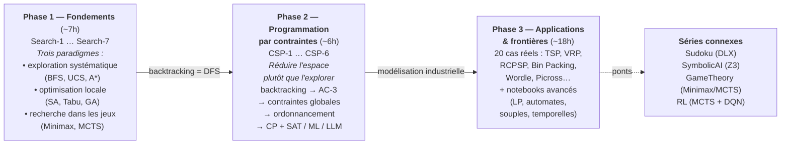

# Search - Algorithmes de Recherche et Programmation par Contraintes

<!-- CATALOG-STATUS
series: Search
pedagogical_count: 60
breakdown: Applications=21, Part4-Metaheuristics=14, Part1-Foundations=11, Part2-CSP=9, root=5
maturity: PRODUCTION=51, BETA=9
-->

[← Notebooks](../README.md) | [↑ ..](../README.md) | [→ SymbolicAI](../SymbolicAI/README.md)

Tout problème d'IA, du plus simple jeu de plateau à la planification logistique industrielle, se réduit à un même défi : explorer un espace de solutions possibles pour trouver la meilleure. Cette série vous apprend à maîtriser cette exploration, depuis les algorithmes classiques (BFS, A*, Minimax) jusqu'aux techniques avancées (CSP, métaheuristiques, hybridation LLM). Le fil rouge est la **réduction de l'espace de recherche** : comment passer d'une exploration aveugle exponentielle à une résolution intelligemment guidée.

Le parcours couvre quatre grands piliers. Les **fondements** formalisent les espaces d'états et couvrent les algorithmes de recherche non informée, informée, locale, génétique, adversariale et MCTS. La **programmation par contraintes** (CSP) introduit un changement de paradigme : au lieu d'explorer, on réduit les domaines par propagation. Les **applications** (20 notebooks) illustrent chaque concept sur des problèmes réels adaptés de projets étudiants. Enfin, les **métaheuristiques et l'hybridation** relient la recherche à l'optimisation continue et aux LLMs.

**À qui s'adresse cette série** : étudiants en informatique (L3-M2), ingénieurs logiciel confrontés à des problèmes d'optimisation, et candidats à des entretiens techniques. Les notebooks Python ne nécessitent que Python 3.10+ avec `ortools` et `deap`. Les side tracks C# (edge detection, portefeuille, et la [Partie 4 — métaheuristiques composables](Part4-Metaheuristics/README.md) au-dessus de GeneticSharp) requièrent .NET 9.0 + dotnet-interactive. Aucun prérequis en algorithmique avancée : les concepts sont introduits depuis les espaces d'états.

## Pourquoi cette série

La recherche et l'optimisation sont au coeur de l'informatique : tout problème, du plus simple jeu de plateau à la planification logistique industrielle, se réduit à explorer un espace de solutions. Cette série couvre **l'intégralité du spectre algorithmique** — de la recherche aveugle (BFS) à l'hybridation LLM+CSP — en construisant une compréhension progressive des compromis fondamentaux.

Cette série repose sur une **double approche**, délibérément juxtaposée :

- **Exploration systématique** (recherche classique) : BFS, DFS, A*, Minimax — des algorithmes qui garantissent de trouver une solution optimale si elle existe, mais dont le coût peut être exponentiel. C'est le domaine des espaces d'états, des heuristiques admissibles, de la complétude.
- **Réduction de l'espace** (programmation par contraintes) : au lieu d'explorer bêtement, on élague les domaines impossibles par propagation (AC-3, Forward Checking, CP-SAT). C'est un changement de paradigme : on ne cherche plus, on contraint. Avantage : résolution de problèmes industriels (ordonnancement, emploi du temps) en quelques millisecondes. Limite : la modélisation est un art.

Avoir les deux approches permet de comprendre **quand explorer, quand contraindre, et quand les combiner** — une compétence cruciale pour tout ingénieur confronté à des problèmes combinatoires.

Au-delà de la méthodologie, cette série couvre des **applications réelles** adaptées de projets étudiants : planification d'infirmiers (CHU), ordonnancement d'atelier (industrie), optimisation de portefeuille (finance), TSP/VRP (logistique), démineur (CSP + probabilités), Picross (couverture exacte). Chaque application est une brique construite sur les concepts précédents.

## Qu'est-ce que la recherche en IA ?

| Aspect | Exploration systématique | Programmation par contraintes | Métaheuristiques |
|--------|--------------------------|-------------------------------|-----------------|
| **Philosophie** | Énumérer méthodiquement | Réduire les domaines impossibles | S'inspirer de la nature |
| **Garantie** | Solution optimale (si temps) | Solution optimale (si modélisable) | Aucune garantie |
| **Modélisation** | Espace d'états (S, A, T, G) | Variables, domaines, contraintes | Fonction objectif, voisinage |
| **Complexité** | Exponentielle (mais heuristiques) | Exponentielle (mais propagation) | Polynomiale par itération |
| **Quand l'utiliser** | Problèmes bien définis, heuristique connue | Contraintes claires, domaine discret | Grands espaces, approximation acceptable |

## Objectifs d'apprentissage

À l'issue de cette série, vous serez capable de :

1. **Formaliser** un problème réel en espace d'états (S, s0, A, T, G) et choisir l'algorithme de recherche adapté
2. **Comparer** recherche systématique (A*), contraintes (CSP) et métaheuristiques (GA, SA) sur un même problème
3. **Modéliser** un problème industriel en CSP (ordonnancement, routing, emploi du temps) avec OR-Tools CP-SAT
4. **Évaluer** les compromis garantie vs performance vs généralisation pour choisir une stratégie algorithmique
5. **Combiner** approches complémentaires (CP+SAT, LLM+CSP, MCTS+DQN) pour des problèmes complexes

## Parcours d'apprentissage

### Phase 1 : Fondements de la recherche (Part 1, notebooks 1-7, ~7h)

Le parcours commence par Search-1 (StateSpace) qui formalise les problèmes sous forme (S, s0, A, T, G) et Search-2 (Uninformed) qui couvre BFS, DFS, UCS et IDDFS. Search-3 (Informed) introduit les heuristiques et A*, le cœur de la recherche guidée. Search-4 (LocalSearch) pivote vers l'optimisation locale (Hill Climbing, Simulated Annealing, Tabu Search), et Search-5 (GeneticAlgorithms) généralise avec les algorithmes évolutionnaires. Search-6 (AdversarialSearch) explore la recherche dans les jeux (Minimax, Alpha-Beta), et Search-7 (MCTS) va jusqu'à Monte Carlo Tree Search et les approches AlphaGo. À l'issue de cette phase, vous maîtrisez les trois grands paradigmes : exploration systématique, optimisation locale, et recherche dans les jeux.

### Phase 2 : Programmation par contraintes (Part 2, CSP 1-6, ~6h)

La Phase 2 change de paradigme : au lieu d'explorer un espace, on le réduit. CSP-1 (Fundamentals) introduit le modèle (X, D, C) et le backtracking. CSP-2 (Consistency) couvre la propagation de contraintes (AC-3, Forward Checking, MAC). CSP-3 à CSP-6 montent en complexité : contraintes globales (AllDifferent, Cumulative), ordonnancement (Job-Shop, RCPSP), optimisation (Bin Packing, Knapsack), et hybridation (LCG, CP+SAT, CP+ML, LLM+CSP). Cette phase présuppose les bases de la Phase 1 (formalisation, backtracking = DFS) et constitue le cœur pratique de la série.

### Phase 3 : Applications et frontières (Applications + notebooks avancés, ~18h)

Les 20 notebooks d'applications illustrent chaque concept sur des cas réels : planification d'infirmiers (CSP-4), ordonnancement d'atelier (CSP-4), optimisation de portefeuille (métaheuristiques), TSP et VRP (routing), démineur et Wordle (CSP + théorie de l'information), Picross (couverture exacte). Les notebooks avancés de la Part 1 (programmation linéaire Search-9, automates symboliques Search-10, métaheuristiques Search-11) et de la Part 2 (contraintes souples CSP-7, temporelles CSP-8, distribuées CSP-9) complètent le panorama. L'ensemble est enrichi par des ponts vers les autres séries : Sudoku (DLX, automates), SymbolicAI (Z3, planification), GameTheory (Minimax, MCTS), et RL (MCTS + DQN).



## Ce que chaque notebook apporte

Chaque notebook introduit un concept ou algorithme spécifique. Le tableau ci-dessous résume en une ligne l'apport pédagogique de chacun.

### Partie 1 : Search Fondamental

| # | Notebook | Apport pédagogique |
|---|----------|-------------------|
| 1 | StateSpace | Formaliser un problème en espace d'états (S, s0, A, T, G) |
| 2 | Uninformed | BFS vs DFS : comment l'ordre d'exploration change la complexité |
| 3 | Informed | Heuristiques admissibles et A* : guider la recherche vers la solution |
| 4 | LocalSearch | Abandonner la garantie pour l'efficacité : paysages de fitness et optima locaux |
| 5 | GeneticAlgorithms | Populations, crossover, mutation : l'évolution comme métaheuristique |
| 6 | AdversarialSearch | Minimax, Alpha-Beta : chercher dans les jeux à deux joueurs |
| 7 | MCTS-And-Beyond | Monte Carlo Tree Search et la révolution AlphaGo (MCTS + DQN) |
| 8 | DancingLinks | Couverture exacte de Knuth : une structure de données transforme un algorithme |
| 9 | LinearProgramming | Programmation linéaire (PuLP) : relaxer les contraintes entières |
| 10 | SymbolicAutomata | Automates finis + Z3 : raisonner sur des alphabets infinis |
| 11 | Métaheuristiques | PSO, ABC, BRO avec MEALPy : comparer 160+ algorithmes |

### Partie 2 : Programmation par Contraintes

| # | Notebook | Apport pédagogique |
|---|----------|-------------------|
| 1 | CSP Fundamentals | Modèle (X, D, C) : déclarer le problème plutôt que l'algorithme |
| 2 | CSP Consistency | AC-3, Forward Checking : réduire l'espace par propagation avant la recherche |
| 3 | CSP Advanced | Contraintes globales (AllDifferent, Cumulative, Circuit) |
| 4 | CSP Scheduling | Job-Shop, RCPSP, Nurse : l'ordonnancement industriel par contraintes |
| 5 | CSP Optimization | Bin Packing, Knapsack, Portfolio : optimiser sous contraintes |
| 6 | CSP Hybridization | LCG, CP+SAT, CP+ML, LLM+CSP : combiner les paradigmes |
| 7 | CSP Soft | Contraintes souples, Fuzzy CSP : quand toutes les contraintes ne sont pas égales |
| 8 | CSP Temporal | Allen's Interval Algebra, STP : raisonner sur le temps |
| 9 | CSP Distributed | ABT, AWC : résoudre des CSP répartis entre agents |

### Partie 4 : Métaheuristiques composables

Side track C# .NET 9 (cf. [Search-5](Part1-Foundations/Search-5-GeneticAlgorithms.ipynb), [Search-11](Part1-Foundations/Search-11-Metaheuristics.ipynb)) : reconstruire et **composer** les métaheuristiques au-dessus de GeneticSharp plutôt que d'en importer une boîte noire.

| # | Notebook | Apport pédagogique |
|---|----------|-------------------|
| 1 | MGS-1 Introduction | Moteur autonome `MetaGeneticAlgorithm` au-dessus de GeneticSharp |
| 2 | MGS-2 Composition | Assemblage déclaratif : `Match`, `Container`, grammaire fluente |
| 3 | MGS-3 Eukaryote | Sous-populations spécialisées (chromosomes composites) |
| 4 | MGS-4 Islands | Modèle insulaire : populations structurées, migration entre îles |
| 5 | MGS-5 CompoundMetaheuristics | Reconstruire les composés publiés (WOA/EO/FBI) depuis leurs primitives |
| 6 | MGS-6 Benchmarks | Comparaison honnête des composés vs GA vs Uniform vs Islands |
| 7 | MGS-7 TSP | Grammaire agnostique à la représentation (permutation, `OrderedCrossover`) |
| 8 | MGS-8 LandscapeExplorer | Visualiser la surface de fitness (heatmaps, trajectoire de convergence) |
| 9 | MGS-9 EverestRelief | Relief terrestre réel comme paysage de fitness (DEM, flipbook) |
| 10 | MGS-10 CenterBias | Biais central vs robustesse au déplacement (banc Kudella 2022) |

### Applications

| # | Notebook | Apport pédagogique |
|---|----------|-------------------|
| App-1 | NQueens | Le benchmark classique CSP : backtracking vs min-conflicts vs CP-SAT |
| App-2 | GraphColoring | Coloration de cartes : DSATUR vs CP-SAT, départements français |
| App-3 | NurseScheduling | Planning infirmiers : contraintes hard/soft, modèle CP-SAT |
| App-4 | JobShopScheduling | Ordonnancement industriel : IntervalVar, NoOverlap, makespan |
| App-5 | Timetabling | Emploi du temps : MiniZinc + CP-SAT, une modélisation déclarative |
| App-6 | Minesweeper | Démineur : propagation CSP + probabilités + hybridation LLM |
| App-7 | Wordle | Solveur Wordle : filtrage CSP + théorie de l'information (entropy) |
| App-8 | MiniZinc | Modélisation déclarative : syntaxe MiniZinc, contraintes globales |
| App-9 | EdgeDetection | Détection de bords par GA : PyGAD, filtres de convolution |
| App-10 | Portfolio | Frontière de Pareto : optimisation multi-objectif de portefeuille |
| App-11 | Picross | Nonogrammes : speedup 27Mx CP-SAT vs naïve |
| App-12 | ConnectFour | Puissance 4 : 8 algorithmes IA (Minimax, MCTS, DQN-RL) |
| App-13 | TSP | Voyageur de commerce : SA, GA, ACO, OR-Tools routing |
| App-14 | ConnectFour-Adversarial | Benchmark adversarial : Minimax vs Alpha-Beta vs MCTS |
| App-15 | SportsScheduling | Calendrier sportif : contraintes TV, équité, déplacements |
| App-16 | Crossword | Mots croisés : backtracking, OR-Tools, génération |
| App-17 | VRP-Logistics | Vehicle Routing : SA, GA, ACO, CP-SAT |
| App-18 | HyperparameterTuning | Optimisation bayésienne de hyperparams : Optuna vs GA vs PSO |

---

## Partie 1 : Search Fondamental (`Part1-Foundations/`)

Algorithmes de recherche classiques, recherche adversariale et métaheuristiques.

| # | Notebook | Durée | Contenu | Prérequis |
|---|----------|-------|---------|-----------|
| 1 | [Search-1-StateSpace](Part1-Foundations/Search-1-StateSpace.ipynb) | ~40 min | Espaces d'états, formalisation (S, A, T, G), taquin, aspirateur, route | Python basique |
| 2 | [Search-2-Uninformed](Part1-Foundations/Search-2-Uninformed.ipynb) | ~50 min | BFS, DFS, UCS, IDDFS, comparaison systématique | Search-1 |
| 3 | [Search-3-Informed](Part1-Foundations/Search-3-Informed.ipynb) | ~50 min | A*, Greedy, IDA*, heuristiques admissibles et consistantes | Search-2 |
| 4 | [Search-4-LocalSearch](Part1-Foundations/Search-4-LocalSearch.ipynb) | ~45 min | Hill Climbing, Simulated Annealing, Tabu Search, paysages de fitness | Search-2 |
| 5 | [Search-5-GeneticAlgorithms](Part1-Foundations/Search-5-GeneticAlgorithms.ipynb) | ~50 min | Sélection, crossover, mutation, DEAP/PyGAD, théorie unifiée | Search-4 |
| 6 | [Search-6-AdversarialSearch](Part1-Foundations/Search-6-AdversarialSearch.ipynb) | ~1h | Minimax, Alpha-Beta pruning, Null-window search, Transposition tables | Search-2, Search-3 |
| 7 | [Search-7-MCTS-And-Beyond](Part1-Foundations/Search-7-MCTS-And-Beyond.ipynb) | ~1h30 | MCTS, UCB1, OpenSpiel, AlphaGo-style (DQN+MCTS) | Search-6 |
| 8 | [Search-8-DancingLinks](Part1-Foundations/Search-8-DancingLinks.ipynb) | ~1h30 | Algorithme X, DLX, Sudoku, N-Queens, Pentominoes | Search-2 |
| 9 | [Search-9-LinearProgramming](Part1-Foundations/Search-9-LinearProgramming.ipynb) | ~2h | PuLP, simplex, transport, diet, sensibilité, PLNE | Algèbre linéaire |
| 10 | [Search-10-SymbolicAutomata](Part1-Foundations/Search-10-SymbolicAutomata.ipynb) | ~2h | DFA/NFA (automata-lib), prédicats Z3, automates symboliques | Search-1, SymbolicAI/SMT/Z3 |
| 11 | [Search-11-Metaheuristics](Part1-Foundations/Search-11-Metaheuristics.ipynb) | ~1h30 | PSO, ABC, SA, BRO avec MEALPy, benchmark comparatif | Search-4, Search-5 |

---

## Partie 2 : Programmation par Contraintes (`Part2-CSP/`)

> **Pivot vers SymbolicAI** : Z3, Planning, Logic. Cette partie fait le pont entre les algorithmes de recherche et l'IA symbolique.

| # | Notebook | Durée | Contenu | Prérequis |
|---|----------|-------|---------|-----------|
| 1 | [CSP-1-Fundamentals](Part2-CSP/CSP-1-Fundamentals.ipynb) | ~50 min | Variables, domaines, contraintes, backtracking, MRV, LCV | Search-1, Search-2 |
| 2 | [CSP-2-Consistency](Part2-CSP/CSP-2-Consistency.ipynb) | ~45 min | AC-3, Forward checking, MAC, propagation de contraintes | CSP-1 |
| 3 | [CSP-3-Advanced](Part2-CSP/CSP-3-Advanced.ipynb) | ~50 min | AllDifferent, cumulative, circuit, symétries, LNS | CSP-2 |
| 4 | [CSP-4-Scheduling](Part2-CSP/CSP-4-Scheduling.ipynb) | ~1h | Job-Shop (JSSP), RCPSP, Nurse Scheduling, IntervalVar, NoOverlap, Cumulative | CSP-3 |
| 5 | [CSP-5-Optimization](Part2-CSP/CSP-5-Optimization.ipynb) | ~1h | Bin Packing, Knapsack, Cutting Stock, Portfolio Optimization, cardinalité | CSP-3, Search-9 |
| 6 | [CSP-6-Hybridization](Part2-CSP/CSP-6-Hybridization.ipynb) | ~1h30 | Lazy Clause Generation (LCG), CP+SAT, CP+ML, LLM+CSP, parallélisation | CSP-4, CSP-5 |
| 7 | [CSP-7-Soft](Part2-CSP/CSP-7-Soft.ipynb) | ~1h | Contraintes souples, Fuzzy CSP, Weighted CSP, Semiring-based CSP | CSP-1, CSP-2 |
| 8 | [CSP-8-Temporal](Part2-CSP/CSP-8-Temporal.ipynb) | ~1h | Allen's Interval Algebra, STP, TCSP, raisonnement temporel | CSP-1, CSP-2 |
| 9 | [CSP-9-Distributed](Part2-CSP/CSP-9-Distributed.ipynb) | ~1h30 | Asynchronous Backtracking (ABT), AWC, Privacy-preserving CSP | CSP-1, CSP-2, CSP-6 |

### Prérequis CSP

Les notebooks CSP nécessitent une compréhension préalable de :
- **Search-1 (StateSpace)** : formalisation des problèmes
- **Search-2 (Uninformed)** : backtracking = DFS avec retour arrière

---

## Partie 3 : Recherche heuristique avancée (`Part3-Advanced/`)

Techniques de recherche avancées au-delà des fondations : heuristiques
précalculées (pattern databases), recherches à mémoire. Cette partie fait le pont
entre les fondations ([Partie 1](Part1-Foundations/Search-3-Informed.ipynb) :
A\*, IDA\*, heuristiques admissibles) et les métaheuristiques composables
([Partie 4](Part4-Metaheuristics/README.md)), sans relever de la programmation par
contraintes ([Partie 2](Part2-CSP/CSP-1-Fundamentals.ipynb)).

| # | Notebook | Durée | Contenu | Prérequis |
|---|----------|-------|---------|-----------|
| 1 | [Search-12-PatternDatabases](Part3-Advanced/Search-12-PatternDatabases.ipynb) | ~1h30 | Pattern Databases (Culberson & Schaeffer 1996), PDB additives (Korf & Felner 2002), 15-puzzle optimal, IDA\* | Search-3 |

---

## Applications (`Applications/`)

Problèmes du monde réel adaptés de projets étudiants.

### Applications Search (`Applications/Search/`)

| # | Notebook | Durée | Contenu | Source |
|---|----------|-------|---------|--------|
| 1 | [App-12-ConnectFour](Applications/Search/App-12-ConnectFour.ipynb) | ~50 min | Puissance 4 : 8 algorithmes IA (Minimax, MCTS, DQN-RL) | Projet étudiant |
| 2 | [App-14-ConnectFour-Adversarial](Applications/Search/App-14-ConnectFour-Adversarial.ipynb) | ~45 min | Benchmark adversarial : Minimax, Alpha-Beta, MCTS | Projet étudiant |

### Applications CSP (`Applications/CSP/`)

| # | Notebook | Durée | Contenu | Source |
|---|----------|-------|---------|--------|
| 1 | [App-1-NQueens](Applications/CSP/App-1-NQueens.ipynb) | ~30 min | Benchmark classique CSP : backtracking, min-conflicts, OR-Tools | Classique |
| 2 | [App-2-GraphColoring](Applications/CSP/App-2-GraphColoring.ipynb) | ~45 min | Coloration de cartes : Greedy, DSATUR, CP-SAT, départements français | Projet étudiant |
| 3 | [App-3-NurseScheduling](Applications/CSP/App-3-NurseScheduling.ipynb) | ~60 min | Planning infirmiers : contraintes hard/soft, OR-Tools CP-SAT | Projet étudiant |
| 4 | [App-4-JobShopScheduling](Applications/CSP/App-4-JobShopScheduling.ipynb) | ~60 min | Ordonnancement industriel : intervalles, précédences, makespan | Projet étudiant |
| 5 | [App-5-Timetabling](Applications/CSP/App-5-Timetabling.ipynb) | ~50 min | Emploi du temps universitaire : MiniZinc + OR-Tools | Projet étudiant |
| 6 | [App-6-Minesweeper](Applications/CSP/App-6-Minesweeper.ipynb) | ~50 min | Démineur CSP : propagation, probabilités, hybride CSP+LLM | Projet étudiant |
| 7 | [App-7-Wordle](Applications/CSP/App-7-Wordle.ipynb) | ~45 min | Solveur Wordle : filtrage CSP + théorie de l'information | Projet étudiant |
| 8 | [App-8-MiniZinc](Applications/CSP/App-8-MiniZinc.ipynb) | ~50 min | Modélisation déclarative : syntaxe MiniZinc, contraintes globales | Nouveau |
| 9 | [App-11-Picross](Applications/CSP/App-11-Picross.ipynb) | ~40 min | Nonogrammes : speedup 27Mx CP-SAT vs naïve | Projet étudiant |
| 10 | [App-15-SportsScheduling](Applications/CSP/App-15-SportsScheduling.ipynb) | ~55 min | Calendrier sportif : contraintes TV, équité, déplacements | Projet étudiant |
| 11 | [App-16-Crossword-CSP](Applications/CSP/App-16-Crossword-CSP.ipynb) | ~45 min | Mots croisés : backtracking, OR-Tools, génération | Projet étudiant |

### Applications Hybrides / Métaheuristiques (`Applications/Hybrid/`)

| # | Notebook | Durée | Contenu | Source |
|---|----------|-------|---------|--------|
| 1 | [App-9-EdgeDetection](Applications/Hybrid/App-9-EdgeDetection.ipynb) | ~40 min | Détection de bords par GA : PyGAD, filtres de convolution | Existant (refonte) |
| 2 | [App-9b-EdgeDetection-CSharp](Applications/Hybrid/App-9b-EdgeDetection-CSharp.ipynb) | ~35 min | Side track C# : GeneticSharp pour detection de bords | Existant |
| 3 | [App-10-Portfolio](Applications/Hybrid/App-10-Portfolio.ipynb) | ~40 min | Optimisation de portefeuille : frontière de Pareto, multi-objectif | Existant (refonte) |
| 4 | [App-10b-Portfolio-CSharp](Applications/Hybrid/App-10b-Portfolio-CSharp.ipynb) | ~30 min | Side track C# : GeneticSharp pour portefeuille | Existant |
| 5 | [App-13-TSP-Metaheuristics](Applications/Hybrid/App-13-TSP-Metaheuristics.ipynb) | ~50 min | TSP : SA, GA, ACO, OR-Tools routing | Classique |
| 6 | [App-17-VRP-Logistics](Applications/Hybrid/App-17-VRP-Logistics.ipynb) | ~60 min | Vehicle Routing : SA, GA, ACO, CP-SAT | Projet étudiant |
| 7 | [App-18-HyperparameterTuning](Applications/Hybrid/App-18-HyperparameterTuning.ipynb) | ~40 min | Optimisation ML : Bayésienne, GA, PSO, Optuna | Nouveau |

---

## Navigation entre sous-séries

```text
Part1-Foundations/              Part2-CSP/                  Applications/
Search-1  StateSpace     ───>  CSP-1  Fundamentals   ───>  App-1 NQueens, App-2 GraphColoring
Search-2  Uninformed     ───>  CSP-2  Consistency    ───>  App-6 Minesweeper, App-7 Wordle
Search-3  Informed       ───>  Search-6 Adversarial  ───>  App-12 ConnectFour
       │                        CSP-3  Advanced      ───>  App-3 NurseScheduling, App-4 JobShop
       │                        CSP-4  Scheduling    ───>  App-3, App-4, App-5 Timetabling
       └──> Search-6 (Adversarial)
                │
                └──> Search-7 (MCTS)

Search-4  LocalSearch           CSP-5  Optimization  ───>  App-10 Portfolio
    │                               │
    └──> Search-5 (Genetic)    CSP-6  Hybridization ───>  LLM+CSP
            │                       │
            └──> Search-11 (Meta)   └──> Applications/Hybrid/ App-9 EdgeDetection

Search-8  Dancing Links    ───>  App-11 Picross, Sudoku-5 DLX
Search-9  Linear Programming ─>  CSP-5 Optimization   ───>  App-10 Portfolio
Search-10 Symbolic Automata ─>  Sudoku-12 Automates symboliques
```

### Transition vers SymbolicAI

```text
Part2-CSP                      SymbolicAI/
CSP-3  Advanced (OR-Tools) ───> Z3/01_Linq2Z3_Intro (SMT solving)
CSP-4  Scheduling          ───> Planners (PDDL, HTN, Temporal)
CSP-6  Hybridization       ───> LLM+CSP, Tweety (Formal Logic)
CSP-8  Temporal            ───> Temporal Planning, STP
```

---

## Prérequis

### Python

```bash
# Creer un environnement
python -m venv venv
# Ou: conda create -n search python=3.10

# Installer les dependances
pip install -r requirements.txt
```

### C# (.NET Interactive) - pour side tracks uniquement

```bash
# .NET 9.0 requis
dotnet --version

# Les packages NuGet sont installes dans les notebooks :
# - GeneticSharp
# - SkiaSharp (visualisation)
```

### MiniZinc (optionnel, pour App-8)

```bash
# Installer MiniZinc IDE depuis https://www.minizinc.org/
# Puis: pip install minizinc
```

---

## Concepts clés

| Concept | Description |
|---------|-------------|
| **Espace d'états** | Formalisation (S, s0, A, T, G) d'un problème de recherche |
| **BFS/DFS/A*** | Algorithmes de recherche non informée et informée |
| **Heuristique** | Fonction h(n) estimant le coût restant (f = g + h pour A*) |
| **Recherche locale** | Hill Climbing, Simulated Annealing, Tabu Search |
| **Recherche adversariale** | Minimax, Alpha-Beta pruning, Null-window search |
| **MCTS** | Monte Carlo Tree Search : Sélection, Expansion, Simulation, Backpropagation |
| **Métaheuristiques** | PSO, ABC, SA, BRO - optimisation sans dérivées |
| **CSP** | Constraint Satisfaction Problem : (X, D, C) |
| **Backtracking** | Exploration systématique avec retour arrière |
| **MRV/LCV** | Heuristiques de choix de variable/valeur |
| **Arc Consistency** | Réduction des domaines par propagation (AC-3) |
| **Algorithme Génétique** | Évolution de population : sélection, crossover, mutation |
| **Dancing Links (DLX)** | Algorithme X avec listes doublement liées pour couverture exacte |
| **Programmation Linéaire** | Optimisation linéaire avec contraintes (PuLP, simplex) |
| **Automates Symboliques** | Prédicats Z3 pour alphabets infinis |
| **OR-Tools CP-SAT** | Solveur de programmation par contraintes de Google |

---

## Ressources

### Livres de référence

- [AIMA - Russell & Norvig (4th ed.)](http://aima.cs.berkeley.edu/) - Chapitres 3-6
- [Constraint Processing - Rina Dechter (2003)](https://www.cambridge.org/core/books/constraint-processing/)
- [Handbook of Constraint Programming (2006)](https://www.elsevier.com/books/handbook-of-constraint-programming/)
- [The CP-SAT Primer (2023)](https://pganalyze.com/blog/cp-sat-primer) - Guide pratique OR-Tools

### Bibliothèques

- [Google OR-Tools](https://developers.google.com/optimization) - Solveur CP-SAT
- [python-constraint](https://pypi.org/project/python-constraint/) - CSP basique
- [Z3 Theorem Prover](https://github.com/Z3Prover/z3) - Solveur SMT
- [DEAP](https://deap.readthedocs.io/) - Framework GA
- [PyGAD](https://pygad.readthedocs.io/) - GA simplifié
- [MEALPy](https://github.com/thieu1995/mealpy) - Métaheuristiques (160+ algorithmes)
- [PuLP](https://github.com/coin-or/pulp) - Programmation linéaire
- [automata-lib](https://pypi.org/project/automata-lib/) - Automates finis
- [MiniZinc](https://www.minizinc.org/) - Modélisation déclarative
- [GeneticSharp](https://github.com/giacomelli/GeneticSharp) - GA en C#
- [MetaGeneticSharp](https://github.com/jsboige/MetaGeneticSharp) - Couche métaheuristiques composables au-dessus de GeneticSharp (sous-module `MetaGeneticSharp/`, projet enfant ravivant giacomelli/GeneticSharp#87)
- [OpenSpiel](https://github.com/deepmind/open_spiel) - Framework de jeux et RL

### Projets étudiants sources

Les applications sont adaptées de projets étudiants. Les références spécifiques sont indiquées dans chaque notebook d'application.

---

## Structure des fichiers

```text
Search/
├── README.md                              # Ce fichier
├── requirements.txt                       # Dependances Python
├── search_helpers.py                      # Utilitaires partages
├── resources/                             # Images et donnees
│
├── Part1-Foundations/                     # Search Fondamental (11 notebooks)
│   ├── Search-1-StateSpace.ipynb
│   ├── Search-2-Uninformed.ipynb
│   ├── Search-3-Informed.ipynb
│   ├── Search-4-LocalSearch.ipynb
│   ├── Search-5-GeneticAlgorithms.ipynb
│   ├── Search-6-AdversarialSearch.ipynb
│   ├── Search-7-MCTS-And-Beyond.ipynb
│   ├── Search-8-DancingLinks.ipynb
│   ├── Search-9-LinearProgramming.ipynb
│   ├── Search-10-SymbolicAutomata.ipynb
│   └── Search-11-Metaheuristics.ipynb
│
├── Part2-CSP/                             # Programmation par Contraintes (9 notebooks)
│   ├── CSP-1-Fundamentals.ipynb
│   ├── CSP-2-Consistency.ipynb
│   ├── CSP-3-Advanced.ipynb
│   ├── CSP-4-Scheduling.ipynb
│   ├── CSP-5-Optimization.ipynb
│   ├── CSP-6-Hybridization.ipynb
│   ├── CSP-7-Soft.ipynb
│   ├── CSP-8-Temporal.ipynb
│   └── CSP-9-Distributed.ipynb
│
├── Applications/
│   ├── Search/                            # Applications Search (2 notebooks)
│   │   ├── App-12-ConnectFour.ipynb
│   │   └── App-14-ConnectFour-Adversarial.ipynb
│   │
│   ├── CSP/                               # Applications CSP (11 notebooks)
│   │   ├── App-1-NQueens.ipynb
│   │   ├── App-2-GraphColoring.ipynb
│   │   ├── App-3-NurseScheduling.ipynb
│   │   ├── App-4-JobShopScheduling.ipynb
│   │   ├── App-5-Timetabling.ipynb
│   │   ├── App-6-Minesweeper.ipynb
│   │   ├── App-7-Wordle.ipynb
│   │   ├── App-8-MiniZinc.ipynb
│   │   ├── App-11-Picross.ipynb
│   │   ├── App-15-SportsScheduling.ipynb
│   │   └── App-16-Crossword-CSP.ipynb
│   │
│   └── Hybrid/                            # Metaheuristiques (7 notebooks)
│       ├── App-9-EdgeDetection.ipynb
│       ├── App-9b-EdgeDetection-CSharp.ipynb
│       ├── App-10-Portfolio.ipynb
│       ├── App-10b-Portfolio-CSharp.ipynb
│       ├── App-13-TSP-Metaheuristics.ipynb
│       ├── App-17-VRP-Logistics.ipynb
│       └── App-18-HyperparameterTuning.ipynb
│
├── MetaGeneticSharp/                      # Sous-module : metaheuristiques composables sur GeneticSharp (jsboige/MetaGeneticSharp)
├── Part4-Metaheuristics/                  # Partie 4 (side track C# .NET 9) : README + 14 notebooks MGS-1..14 (moteur, composition, composés, benchmarks, TSP, paysages, biais central, synergie d'îles, alignement d'axes, paysages dé-biaisés, synergie conditionnelle ; consomment le sous-module)
│
├── CSPs_Intro.ipynb                       # Ancien notebook (conserve)
├── GeneticSharp-EdgeDetection.ipynb       # Ancien notebook (conserve)
├── Portfolio_Optimization_GeneticSharp.ipynb # Ancien notebook (conserve)
└── PyGad-EdgeDetection.ipynb              # Ancien notebook (conserve)
```

## Progression recommandée

> Le parcours détaillé avec prérequis et enchaînements logiques est décrit dans la section [Parcours d'apprentissage](#parcours-dapprentissage) ci-dessus.

## FAQ / Troubleshooting

### OR-Tools ne s'installe pas

OR-Tools nécessite une version Python compatible. Sur Windows :
- Vérifiez votre version Python : `python --version` (3.10-3.12 recommandé)
- Installez avec : `pip install ortools` (les wheels précompilés sont disponibles pour la plupart des plateformes)
- Si échec : essayez `conda install -c conda-forge ortools-python`

### MiniZinc ne trouve pas son solveur

Le notebook App-8 utilise MiniZinc qui requiert l'installation de l'IDE :
- Téléchargez depuis [minizinc.org](https://www.minizinc.org/software.html)
- Le solveur Gecode est inclus par défaut
- Vérifiez : `minizinc --version` dans un terminal

### Les notebooks C# (.NET Interactive) ne s'exécutent pas

- Vérifiez que .NET SDK 9.0+ est installé : `dotnet --version`
- Installez le kernel : `dotnet tool install -g Microsoft.dotnet-interactive && dotnet interactive jupyter install`
- Vérifiez : `jupyter kernelspec list` doit afficher `.net-csharp`
- Les notebooks C# (App-9b, App-10b) utilisent GeneticSharp et SkiaSharp, installés automatiquement via `#r` dans les cellules

### DEAP ou PyGAD provoquent des erreurs d'import

- DEAP : `pip install deap` — compatible Python 3.8+
- PyGAD : `pip install pygad` — requiert numpy. Si conflit : `pip install --upgrade numpy pygad`
- MEALPy (Search-11) : `pip install mealpy` — dépendances nombreuses, préférez un env dédié

### Les solveurs CP-SAT sont lents sur mon problème

- Vérifiez que vous utilisez `model.parameters.max_time_in_seconds` pour limiter le temps
- Les contraintes globales (AllDifferent, Cumulative) sont beaucoup plus efficaces que des contraintes binaires équivalentes
- Activez la parallélisation : `solver.parameters.num_workers = 8`
- Consultez le [CP-SAT Primer](https://github.com/google/or-tools/blob/stable/ortools/sat/docs/CP-SAT_Primer.md) pour les bonnes pratiques

### Comment choisir entre A*, CSP et métaheuristiques ?

- **Espace d'états petit, solution optimale requise** : A* avec heuristique admissible
- **Contraintes complexes, domaine discret** : CP-SAT (OR-Tools)
- **Grands espaces, approximation acceptable** : Métaheuristiques (GA, SA, PSO)
- **Problème de jeux, deux adversaires** : Minimax / Alpha-Beta / MCTS
- **Problème NP-difficile, temps limite** : LNS (Large Neighborhood Search) dans CP-SAT

## Quel parcours choisir ?

### Si vous découvrez la recherche en IA

Commencez par **Search-1 (StateSpace)** et **Search-2 (Uninformed)** pour comprendre la formalisation des problèmes et les algorithmes fondamentaux (BFS, DFS). Puis **Search-3 (Informed)** pour découvrir A* et les heuristiques. C'est le socle commun à toute la série.

### Si vous venez de la programmation par contraintes

Commencez par **CSP-1 (Fundamentals)** et **CSP-2 (Consistency)** si vous connaissez déjà les espaces d'états. Puis montez en complexité avec **CSP-3-6** et les applications industrielles (**App-3 NurseScheduling**, **App-4 JobShop**).

### Si vous préparez un entretien technique

Concentrez-vous sur **Search-1 à Search-3** (espaces d'états, BFS/DFS, A*), **Search-6 (AdversarialSearch)** (Minimax) et **CSP-1-2** (backtracking, propagation). Ce sont les algorithmes les plus fréquemment demandés.

### Si vous voulez résoudre un problème industriel

Allez directement aux applications qui correspondent à votre domaine : **App-3/App-4** (ordonnancement), **App-13/App-17** (routing/logistique), **App-5** (emploi du temps), ou **App-10** (optimisation portefeuille). Chaque application est autonome avec les prérequis indiqués.

---

## Conclusion / Prochaines étapes

### Ce que vous avez appris

Cette série vous a fait traverser l'une des idées les plus fécondes de l'informatique : **tout problème, du jeu de plateau à la planification logistique, se réduit à explorer un espace de solutions** — et l'art de l'ingénieur est de réduire cette exploration d'une aveugle croissance exponentielle à une résolution intelligemment guidée. L'arc pédagogique :

- **Le geste fondateur** — formaliser un problème en *espace d'états* `(S, s₀, A, T, G)` plutôt que de le traiter cas par cas. Cette abstraction est le socle commun : sans elle, pas de BFS, pas d'A*, pas de backtracking, pas de Minimax. La série part de là (Search-1) pour reconstruire tout l'édifice algorithmique sur des fondations propres.
- **La double approche, délibérément juxtaposée** — d'un côté l'**exploration systématique** (BFS, DFS, A*, Minimax), qui *garantit* la solution optimale si on lui laisse le temps mais paie ce coût en explosion combinatoire ; de l'autre la **réduction par contraintes** (AC-3, Forward Checking, CP-SAT), un véritable changement de paradigme où l'on ne cherche plus mais où l'on *contraint* les domaines jusqu'à ce que la solution émerge. Comprendre les deux, c'est comprendre **quand explorer, quand contraindre, et quand les combiner**.
- **L'instrument** — les outils qui opérationnalisent la théorie : OR-Tools CP-SAT pour la programmation par contraintes industrielle, A* et ses heuristiques admissibles pour la recherche guidée, Minimax et MCTS pour les jeux, et toute la famille des métaheuristiques (GA, SA, PSO) pour les grands espaces où l'on troque la garantie contre l'efficacité. MiniZinc pour la modélisation déclarative, Z3 pour raisonner sur des alphabets infinis.
- **La finesse** — que la modélisation CSP est *un art* autant qu'une technique (un bon modèle se résout en millisecondes, un mauvais jamais), que les **applications réelles** (planification d'infirmiers au CHU, ordonnancement d'atelier, optimisation de portefeuille, TSP/VRP logistique, démineur, Picross et son speedup 27M×) sont autant de briques où chaque concept trouve sa justification, et que les frontières les plus excitantes sont les **hybridations** (LCG, CP+SAT, CP+ML, et surtout LLM+CSP).

La thèse est puissante et honnêtement présentée : il n'existe pas d'algorithme universel de recherche, mais un *spectre* de stratégies aux compromis clairement cartographiés — garantie vs performance, exploration vs réduction, optimalité vs approximation — et la compétence de l'ingénieur est de savoir choisir dans ce spectre, voire de combiner plusieurs points.

### Prochaines étapes

- **Approfondir l'IA symbolique** : [SymbolicAI](../SymbolicAI/README.md) (Z3/SMT, planification PDDL/HTN, logique formelle Tweety) est le prolongement naturel de la Partie 2 — les CSP y deviennent du *satisfiability solving* et la modélisation par contraintes se généralise en raisonnement logique. Plusieurs ponts explicites sont tracés (CSP-3 → Z3, CSP-4 → Planners, CSP-6 → LLM+CSP).
- **Élargir aux jeux et à l'apprentissage par renforcement** : [GameTheory](../GameTheory/README.md) (Minimax, MCTS, choix social) et les notebooks RL (MCTS + DQN, AlphaGo) reprennent la recherche adversariale sous l'angle de l'apprentissage — où la valeur des positions n'est plus calculée mais *apprise*.
- **Pratiquer sur la couverture exacte** : [Sudoku](../README.md) (DLX, automates symboliques) applique Dancing Links et les techniques de cette série à une famille de puzzles combinatoires concrets.
- **Construire plutôt qu'utiliser** : la [Partie 4 — métaheuristiques composables](Part4-Metaheuristics/README.md) (C# .NET 9, MetaGeneticSharp) prolonge [Search-5](Part1-Foundations/Search-5-GeneticAlgorithms.ipynb)/[Search-11](Part1-Foundations/Search-11-Metaheuristics.ipynb) sous l'angle de l'*ingénierie* — au lieu d'importer WOA ou EO, on les *reconstruit* depuis des primitives composables (`Match`, `Container`, grammaire fluente) au-dessus de GeneticSharp, et l'on assemble des configurations qu'aucune bibliothèque monolithique n'offre (sous-populations spécialisées, îles migratoires).
- Pour la pratique : reprenez [CSP-6-Hybridization](Part2-CSP/CSP-6-Hybridization.ipynb) et expérimentez le pont LLM+CSP — comment un modèle de langage peut-il *amorçer* un solveur par contraintes, et où cette hybridation gagne-t-elle (ou perd-elle) par rapport au CP-SAT pur ?

### Le fil rouge

La recherche en IA propose un changement de regard sur la résolution de problèmes : ne plus demander « quel algorithme appliquer ? » mais **« comment réduire l'espace des possibilités jusqu'à ce que la solution devienne inévitable ? »**. La série vous a donné le formalisme (espaces d'états, modèle `(X, D, C)`), les algorithmes (de BFS à MCTS, du backtracking à CP-SAT), et l'intuition des compromis pour transformer un problème combinatoire apparemment intractable en une résolution guidée, contrainte, ou hybridée — en gardant à l'esprit qu'aucune stratégie ne domine partout, et que c'est précisément ce pluralisme qui fait la richesse (et la difficulté) du domaine.

---

## Licence

Voir la licence du repository principal.

---

*Version 1.1.0 — Juin 2026*
