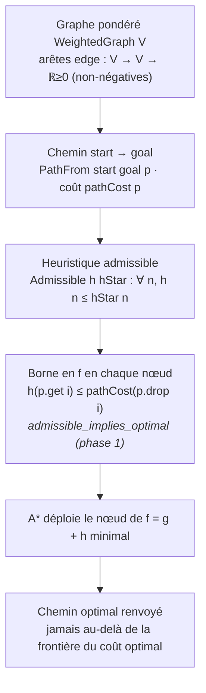
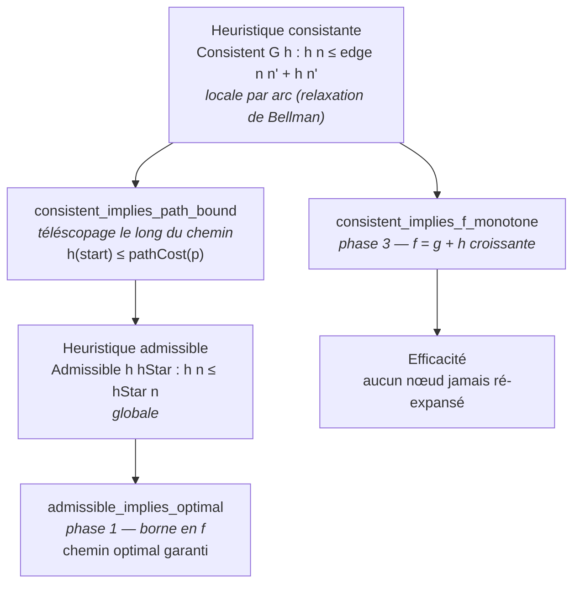

# `astar_lean` — Optimalité de A* en Lean 4

Mini-projet Lean 4 (avec [Mathlib](https://github.com/leanprover-community/mathlib4))
formalisant le **théorème phare d'optimalité de A*** : une heuristique *admissible*
garantit que l'algorithme A* renvoie un chemin de coût optimal
([Hart, Nilsson & Raphael, 1968](https://doi.org/10.1109/TSSC.1968.300136)).

> **Issue** : [#4048](https://github.com/jsboige/CoursIA/issues/4048) —
> **Roadmap** : [#4038](https://github.com/jsboige/CoursIA/issues/4038) —
> **Registre** : [#3801](https://github.com/jsboige/CoursIA/issues/3801) (prong B
> « problème non-trivial »).

---

## Motivation pédagogique : BFS vs A* sur un graphe pondéré

Le grief fondateur (registre #3801) : démontrer A* sur un **graphe à coût uniforme**
est un cas **dégénéré** — l'heuristique n'y discrimine rien et A* dégénère en BFS,
si bien qu'on ne *voit* pas la capacité distinctive de l'algorithme. Ce projet pose
au contraire le cadre **pondéré non-uniforme** où l'heuristique *sert* réellement,
et formalise rigoureusement **pourquoi** l'admissibilité garantit l'optimalité —
la propriété qui distingue A* d'une simple recherche en largeur.

Le notebook compagnon
[`Exploration_non_informée_et_informée_intro.ipynb`](../Exploration_non_informée_et_informée_intro.ipynb)
(série Search) illustre ceci en Python sur un terrain pondéré où A* exploite
l'heuristique pour explorer moins de nœuds que BFS.

## Approche : lemme d'optimalité abstrait

Plutôt que de modéliser intégralement la file de priorité (open/closed sets,
terminaison), on prouve le **lemme d'optimalité abstrait** (plus propre pédagogiquement,
cf #4048) : la **borne en `f`** qui est le mécanisme exact d'optimalité de A*.

- `f(nœud) = g(nœud) + h(nœud)` où `g` est le coût déjà parcouru et `h` l'heuristique ;
- si `h` est *admissible* (`h ≤ h*`, le vrai coût optimal restant), alors
  `f(nœud) ≤ coût optimal` le long du chemin optimal ;
- A* déploie le nœud de `f` minimal, donc ne dépasse jamais la frontière du coût
  optimal : il renvoie un chemin optimal.

## Modèle

| Concept | Formalisation |
|---|---|
| Sommets | type abstrait `V` |
| Graphe pondéré | `WeightedGraph V` (arêtes `V → V → ℝ≥0`, non-négatives) |
| Chemin | `Path V := List V` |
| Coût d'un chemin | `pathCost` : somme des poids des arcs consécutifs |
| Chemin `start → goal` | `PathFrom start goal p` (non-vide, débute en `start`, finit en `goal`) |
| Vrai coût restant | `hStar : V → ℝ≥0`, muni de `IsTrueRemainingCost` (borne inférieure sur le coût des chemins menant au but) |
| Admissible | `Admissible h hStar := ∀ n, h n ≤ hStar n` |
| Consistante | `Consistent h := ∀ n n', h n ≤ edge n n' + h n'` (relaxation de Bellman) |

## Modules

- [`Astar/Graph.lean`](Astar/Graph.lean) — `WeightedGraph`, `pathCost`, `PathFrom`.
- [`Astar/Heuristic.lean`](Astar/Heuristic.lean) — `Admissible`, `Consistent`.
- [`Astar/Optimality.lean`](Astar/Optimality.lean) — théorème phare (`admissible_implies_optimal`).
- [`Astar/Consistency.lean`](Astar/Consistency.lean) — `consistent_implies_path_bound` (consistance ⟹ admissibilité, téléscopage).

## Théorème phare

```lean
theorem admissible_implies_optimal
    (h hStar : V → NNReal) (hAdm : Admissible h hStar)
    (goal start : V) (p : Path V) (hStar_lb : IsTrueRemainingCost G hStar goal)
    (hp : PathFrom start goal p) (i : Fin p.length) :
    h (p.get i) ≤ pathCost G (p.drop i.val)
```

Sous heuristique admissible, pour tout nœud `p.get i` d'un chemin allant au but,
l'heuristique ne dépasse jamais le coût du suffixe restant `pathCost (p.drop i)`.
C'est la borne en `f` en chaque nœud — le mécanisme exact d'optimalité de A*.

**Preuve** (0 `sorry`) : `h(p.get i) ≤ hStar(p.get i)` (admissibilité) `≤ pathCost(p.drop i)`
(`hStar` borne inférieure, le suffixe étant lui-même un chemin allant au but). Deux
le pas via `le_trans`. Le fait clé : un suffixe d'un chemin allant au but va encore au
but (`suffix_pathFrom`).

*Mécanisme de la borne en `f` — pourquoi l'admissibilité garantit l'optimalité de A\** :*



## Consistance ⟹ admissibilité (téléscopage) — phase 2

```lean
theorem consistent_implies_path_bound (h : V → NNReal) (goal : V)
    (hCons : Consistent G h) (hGoal : h goal = 0)
    (start : V) (p : Path V) (hp : PathFrom start goal p) :
    h start ≤ pathCost G p
```

La **consistance** (`h n ≤ edge n n' + h n'`, condition *locale* par arc) implique
l'**admissibilité** (*globale*) par un **téléscopage** le long des arcs d'un chemin
`start = v₀ → v₁ → … → vₖ = goal` :

```text
h(start) ≤ edge(v₀,v₁) + h(v₁) ≤ edge(v₀,v₁) + edge(v₁,v₂) + h(v₂) ≤ … ≤ pathCost(p) + h(goal).
```

Sous l'hypothèse naturelle `h(goal) = 0`, il vient **`h(start) ≤ pathCost(p)` pour tout
chemin `p` allant au but** — exactement la borne globale que l'admissibilité fournit
aussi (`admissible_head_bound`), atteinte ici sans hypothèse sur `hStar`. C'est le
mécanisme exact qui rend A* optimal sous heuristique consistante : la fonction `f = g + h`
est alors croissante le long des chemins, donc aucun nœud n'est jamais ré-expansé.

**Preuve** (0 `sorry`, axiomes `[propext, Classical.choice, Quot.sound]`) : récurrence sur
la liste-chemin. Cas singleton `[goal]` : `pathCost = 0` et `h(goal) = 0`. Cas
`hd :: w :: rest'` : récurrence sur la queue donne `h w ≤ pathCost(w :: rest')`, la
consistance à l'arc `(hd, w)` donne `h hd ≤ edge(hd, w) + h w`, et
`pathCost(hd :: w :: rest') = edge(hd, w) + pathCost(w :: rest')` ; `linarith` conclut.

**Cadrage honnête.** Dans ce modèle abstrait, `hStar` n'est qu'une *borne inférieure* sur
les coûts de chemins (`IsTrueRemainingCost`), pas nécessairement le coût optimal *réalisé*.
Le téléscopage donne `h(start) ≤ pathCost(p)` pour **tout** chemin réalisé `p` — le
mécanisme exact d'optimalité de A* (« ne surestime jamais un coût de chemin réalisé »).
En déduire `h(start) ≤ hStar(start)` nécessiterait que `hStar` soit le *minimum atteint*
(graphe fini, chemins simples en nombre fini) : cette « réalisabilité de `hStar` » est
laissée ouverte (phase suivante, construction effective de `hStar`). On prouve donc ici
la **forme abstraite** suggérée par #4048.

## Consistance ⟹ `f = g + h` monotone (pas de ré-expansion) — phase 3

```lean
theorem consistent_implies_f_monotone (h : V → NNReal)
    (hCons : Consistent G h)
    (g : V → NNReal) (n n' : V)
    (hg : g n' = g n + G.edge n n') :
    g n + h n ≤ g n' + h n'
```

Sous une heuristique **consistante**, la fonction d'évaluation `f = g + h` (coût déjà
parcouru `g` + heuristique `h`) est **croissante** le long des expansions : si `g`
 progresse du poids de l'arc (`g n' = g n + edge n n'`), alors `f` n'augmente pas
(`f n ≤ f n'`). C'est le mécanisme exact qui rend A* **efficace** sous heuristique
consistante : la frontière de `f` ne recule jamais, donc **aucun nœud n'est jamais
ré-expansé** — par contraste avec une heuristique admissible (mais non consistante) qui
garantit l'optimalité (phase 1) mais autorise des ré-expansions.

**Preuve** (0 `sorry`, axiomes `[propext, Classical.choice, Quot.sound]`, 1 ligne) :
`g n' + h n' = g n + edge n n' + h n' ≥ g n + h n` par consistance
(`h n ≤ edge n n' + h n'`), donc `linarith` après réécriture de `g n'`.

**Abstraction.** `g` est laissé paramètre (non calculé) : le résultat vaut pour toute
fonction de coût déjà parcouru satisfaisant la relation d'avancement par arc,
indépendamment du chemin spécifique. La formalisation de la **« non-ré-expansion »
elle-même** (modélisation de la file de priorité, open/closed sets, terminaison) est la
**phase 4** (cf #4048) — on prouve ici le **lemme mathématique central** qui en est la
cause exacte, pas l'algorithme complet.

*Synthèse — hiérarchie des propriétés d'heuristique : la consistance (forte, locale par
arc) garantit à la fois l'optimalité (via l'admissibilité qu'elle entraîne) ET
l'efficacité (monotonie de `f`) ; l'admissibilité seule garantit l'optimalité mais
autorise des ré-expansions :*



## Construction

```bash
lake exe cache get   # récupère les .olean de Mathlib (v4.31.0-rc1)
lake build Astar     # build de la librairie
```

Prérequis : [elan](https://github.com/leanprover/elan) (toolchain
`leanprover/lean4:v4.31.0-rc1`, voir `lean-toolchain`).

## État et suite

Ce livrable couvre les phases 1-3 (#4048) :

- [x] Scaffolding du lake (lakefile, toolchain, `.gitignore`)
- [x] Modèle (`WeightedGraph`, `pathCost`, `PathFrom`)
- [x] Définitions (`Admissible`, `Consistent`, `IsTrueRemainingCost`)
- [x] **Théorème phare `admissible_implies_optimal` — 0 `sorry`** (phase 1, PR #4090)
- [x] **`consistent_implies_admissible` — 0 `sorry`** (phase 2, téléscopage de la consistance le long du chemin)
- [x] **`consistent_implies_f_monotone` — 0 `sorry`** (phase 3, `f = g + h` croissante ⇒ pas de ré-expansion)

Phases suivantes (suivi #4048) :

- [ ] Construction effective de `hStar` sur graphe fini (minimum sur chemins simples)
- [ ] Modélisation de la file de priorité et preuve « A* renvoie le chemin optimal » bout-en-bout

## Références

- P. E. Hart, N. J. Nilsson, B. Raphael, *A Formal Basis for the Heuristic Determination
  of Minimum Cost Paths*, IEEE Trans. Syst. Sci. Cybern. **4**(2), 1968.
- S. Russell, P. Norvig, *Artificial Intelligence: A Modern Approach*, §3.5 (A* Search).
- Notebook compagnon : [`Exploration_non_informée_et_informée_intro.ipynb`](../Exploration_non_informée_et_informée_intro.ipynb).
