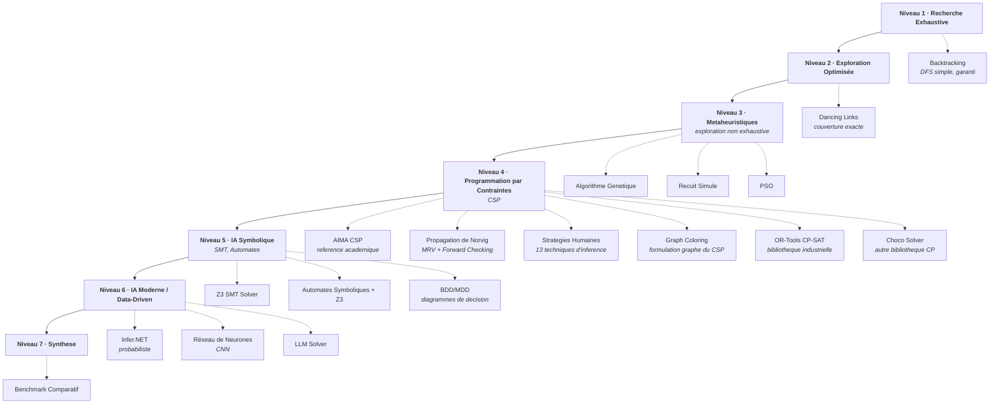

# Sudoku - Résolution par Différentes Approches Algorithmiques

<!-- CATALOG-STATUS
series: Sudoku
pedagogical_count: 32
breakdown: root=32
maturity: PRODUCTION=32
-->

[← Notebooks](../README.md) | [→ Search](../Search/README.md)

Comment résoudre un Sudoku ? Cette série explore les techniques de résolution, des algorithmes classiques (backtracking, contraintes) aux approches symboliques, probabilistes et neuronales. Les 32 notebooks (16 C#, 16 Python) sont proposés en **approche miroir C#/Python** pour permettre à chaque étudiant de choisir son langage.

**A qui s'adresse cette série** : étudiants en informatique (L2-M2) découvrant les paradigmes algorithmiques, candidats a des entretiens techniques, et enseignants cherchant un fil rouge pédagogique. Les notebooks Python ne nécessitent que Python 3.10+. Les notebooks C# requierent .NET 9.0 + dotnet-interactive. Aucun prérequis en IA : les concepts sont introduits depuis le backtracking.

## Objectifs d'apprentissage

A l'issue de cette série, vous serez capable de :

1. **Implementer** un solveur de backtracking avec heuristiques (MRV, Forward Checking) et comprendre sa complexite
2. **Comparer** 7 paradigmes algorithmiques (exhaustif, metaheuristique, CP, SMT, neuronal, LLM) sur un même problème NP-complet
3. **Modeliser** le Sudoku comme un CSP (variables, domaines, contraintes) et utiliser des solveurs industriels (OR-Tools, Choco)
4. **Evaluer** les compromis garantie vs performance vs generalisation pour choisir une strategie de résolution
5. **Mesurer** empiriquement les performances de chaque approche (temps, taux de succès, echelle de difficulte)

## Pourquoi etudier le Sudoku en IA ?

Le Sudoku est bien plus qu'un simple jeu de grilles : c'est un **paradigme fondamental** de l'informatique et de l'intelligence artificielle. Son etude revele des concepts essentiels qui s'appliquent a de nombreux problèmes reels.

### Contexte historique et théorie de la complexite

Le Sudoku generalise (n x n) est un problème **NP-complet**, ce qui signifie qu'il n'existe pas d'algorithme polynomial connu pour le resoudre dans tous les cas. Cette proprietee le place dans la même classe de complexite que le problème du voyageur de commerce ou la satisfaction de contraintes boolennes (SAT).

Cette caracteristique fait du Sudoku un excellent banc d'essai pour comparer différentes strategies algorithmiques : comment des approches très différentes (enumeration, metaheuristiques, contraintes, apprentissage) se comportent-elles face a un même problème computationnel ?

### Concepts fondamentaux enseignes

| Concept | Illustration dans le Sudoku | Application reelle |
|---------|----------------------------|-------------------|
| **Recherche dans un espace d'etats** | Chaque grille est un etat, les mouvements legaux definissent les transitions | Planification robotique, jeux |
| **Propagation de contraintes** | Eliminer les candidats impossibles réduit l'espace de recherche | Calibration de capteurs, ordonnancement |
| **Heuristiques de choix** | MRV (Minimum Remaining Values) guide vers les decisions les plus contraignantes | Diagnostic medical, detection de fraudes |
| **Metaheuristiques d'optimisation** | Recuit simule, algorithmes genetiques pour explorer intelligemment | Logistique, conception de circuits |
| **Programmation par contraintes** | Declarer les regles plutot que l'algorithme de résolution | Emploi du temps, configuration produit |
| **Satisfiabilite modulaire (SMT)** | Combinaison de théorie des ensembles et d'arithmetique | Verification de programmes, preuve de theoremes |
| **Apprentissage automatique** | Entrainement sur des millions de grilles pour apprendre des patterns | Vision par ordinateur, traduction |

### Pourquoi ce parcours pédagogique ?

La résolution du Sudoku permet de comprendre **l'évolution historique de l'IA** :

1. **IA symbolique classique** (annnees 1960-1990) : backtracking, propagation, CSP
2. **Metaheuristiques** (annnees 1980-2000) : algorithmes inspires de la nature
3. **Solveurs SMT/CP modernes** (annnees 2000-present) : outils industriels puissants
4. **IA connexionniste** (annnees 2010-present) : réseaux de neurones, LLM

Chaque approche reflete une philosophie differente de la résolution de problèmes et offre des compromis uniques entre garantie de solution, performance et generalisabilite.

---

## Progression Pédagogique

La série suit une **progression de complexite des approches IA** en 7 niveaux :

```
Niveau 1 : Recherche Exhaustive
    └── Backtracking (DFS simple, garanti)

Niveau 2 : Exploration Optimisée
    └── Dancing Links (couverture exacte, optimisation du backtracking)

Niveau 3 : Metaheuristiques (exploration non exhaustive)
    ├── Algorithme Genetique
    ├── Recuit Simule
    └── PSO

Niveau 4 : Programmation par Contraintes (CSP)
    ├── AIMA CSP (reference academique)
    ├── Propagation de Norvig (MRV + Forward Checking)
    ├── Strategies Humaines (13 techniques d'infenrence)
    ├── Graph Coloring (formulation graphe du CSP)
    ├── OR-Tools CP-SAT (bibliotheque industrielle)
    └── Choco Solver (autre bibliotheque CP)

Niveau 5 : IA Symbolique (SMT, Automates)
    ├── Z3 SMT Solver
    ├── Automates Symboliques + Z3
    └── BDD/MDD (diagrammes de decision)

Niveau 6 : IA Moderne / Data-Driven
    ├── Infer.NET (probabiliste)
    ├── Réseau de Neurones (CNN)
    └── LLM Solver

Niveau 7 : Synthese
    └── Benchmark Comparatif
```



### Ce que chaque niveau enseigne

**Niveau 1 - Recherche Exhaustive** : Comprendre l'espace de recherche. Le backtracking est l'algorithme fondamental qui enumere systematiquement toutes les possibilites. Il garantit de trouver une solution si elle existe, mais peut etre exponentiel dans le pire cas.

**Niveau 2 - Optimisation Structurelle** : Dancing Links (Knuth, 2000) montre comment une representation de donnees intelligente (listes doublement chainees) peut transformer radicalement les performances. Ce n'est pas un nouvel algorithme, mais une implementation optimisée du backtracking.

**Niveau 3 - Metaheuristiques** : Abandonner la garantie pour l'efficacite pratique. Ces algorithmes s'inspirent de la nature (évolution, physique, essaimage) pour explorer intelligemment l'espace de recherche sans garantir l'optimalite.

**Niveau 4 - Programmation par Contraintes** : Declarer le "quoi" plutot que le "comment". On specifie les contraintes (ligne, colonne, bloc uniques) et le solveur trouve la solution. Approche declarative et industrielle.

**Niveau 5 - IA Symbolique Avancée** : Utiliser des outils formels (SMT, BDD) qui combinent raisonnement logique et efficacite computationnelle. Ces techniques sont utilisees en verification de logiciels et en preuve de theoremes.

**Niveau 6 - IA Data-Driven** : Apprendre a resoudre plutot que programmer la résolution. Les réseaux de neurones apprennent des patterns dans les donnees, tandis que les LLM utilisent des connaissances linguistiques.

---

## Comparaison des Approches : Quand Utiliser Quoi ?

### Approches exhaustives vs heuristiques

| Critère | Approches Exhaustives | Approches Heuristiques |
|---------|----------------------|------------------------|
| **Garantie de solution** | Oui (si solution existe) | Non (peut echouer) |
| **Complexite pire cas** | Exponentielle | Souvent polynomiale |
| **Performance pratique** | Variable selon instance | Plus previsible |
| **Problèmes adressables** | Tous | Grands espaces, approximations acceptables |

### Arbitrages fondamentaux

**Vitesse vs Garantie** : Un algorithme genetique peut trouver une solution en quelques millisecondes, mais ne garantit pas de la trouver. OR-Tools prendra peut-etre plus de temps, mais trouvera toujours la solution optimale.

**Simplicite vs Efficacite** : Le backtracking s'implemente en 20 lignes de code. Dancing Links requiert une comprehension approfondie des structures de donnees mais est 10x plus rapide.

**Declaratif vs Imperatif** : En programmation par contraintes, on decrit les regles du Sudoku et le solveur fait le reste. En backtracking, on programme explicitement l'exploration.

### Applications reelles par technique

| Technique | Applications industrielles |
|-----------|---------------------------|
| **Backtracking** | Analysis syntaxique, résolution de puzzles, generation de combinaisons |
| **Dancing Links** | Problèmes de couverture exacte, planification |
| **Algorithmes genetiques** | Conception de circuits, optimisation de portefeuilles, design de molecules |
| **Recuit simule** | Routage de circuits, ordonnancement de production |
| **PSO** | Optimisation de réseaux, calibration de modeles |
| **OR-Tools/CP** | Emplois du temps, logistique, allocation de ressources |
| **Z3/SMT** | Verification de programmes, analyse de securite, preuve de theoremes |
| **BDD/MDD** | Verification de circuits, compilation de requêtes |
| **Réseaux de neurones** | Reconnaissance d'images, traduction, jeux |

### Quand choisir quelle approche ?

- **Problème petit, garantie requise** : Backtracking, Dancing Links
- **Problème NP-difficile, solution rapide** : Metaheuristiques
- **Contraintes complexes, besoin de flexibilite** : Programmation par contraintes (OR-Tools, Choco)
- **Raisonnement formel requis** : Z3, SMT
- **Donnees abondantes, generalisation souhaitée** : Réseau de neurones
- **Pas d'algorithme connu, intuition humaine** : LLM

---

## Parcours d'Apprentissage Recommandes

### Parcours Débutant : Comprendre les Fondamentaux

**Objectif** : Maitriser la recherche exhaustive et comprendre pourquoi elle est insuffisante.

**Notebooks recommandes** :
1. `Sudoku-0-Environment-Csharp` ou comprendre la structure des donnees
2. `Sudoku-1-Backtracking-Csharp` (ou Python) : Premier algorithme de résolution
3. `Sudoku-7-Norvig-Csharp` : Voir comment la propagation accelere drastiquement

**Pourquoi cet ordre ?**
- Le notebook 0 etablit le vocabulaire et les structures de base
- Le notebook 1 montre l'approche naive et ses limitations
- Le notebook 7 demontre qu'une simple optimisation (propagation) peut donner des gains de 100x

**Cles de comprehension** :
- L'espace de recherche du Sudoku est immense : 9^81 configurations possibles
- Le backtracking explore cet espace intelligemment mais peut encore etre lent
- La propagation de contraintes réduit l'espace avant même de chercher

### Parcours Intermédiaire : Explorer les Paradigmes

**Objectif** : Comprendre que différentes philosophies de résolution existent et ont chacune leurs forces.

**Notebooks recommandes** :
1. `Sudoku-3-Genetic-Csharp` (ou Python) : Decouvrir les metaheuristiques
2. `Sudoku-9-GraphColoring-Csharp` (ou Python) : Voir le Sudoku comme un problème de graphe
3. `Sudoku-10-ORTools-Csharp` (ou Python) : Utiliser un outil industriel

**Pourquoi cet ordre ?**
- Le notebook 3 montre qu'on peut "abandonner" la garantie pour la vitesse
- Le notebook 9 change completement de perspective (théorie des graphes)
- Le notebook 10 introduit l'approche declarative moderne

**Cles de comprehension** :
- Les metaheuristiques sont puissantes mais non deterministes
- Reformuler un problème peut reveler des algorithmes optimaux
- Les outils industriels encapsulent des decennies de recherche

### Parcours Avance : Maitriser l'IA Symbolique et Data-Driven

**Objectif** : Utiliser les outils de pointe de l'IA moderne.

**Notebooks recommandes** :
1. `Sudoku-12-Z3-Csharp` (ou Python) : Satisfiabilite modulaire
2. `Sudoku-16-NeuralNetwork-Python` : Apprentissage profond
3. `Sudoku-17-LLM-Python` : Grands modeles de langage
4. `Sudoku-18-Comparison-Python` : Benchmark comparatif final

**Pourquoi cet ordre ?**
- Le notebook 12 montre l'apogée de l'IA symbolique (outils de verification formelle)
- Le notebook 16 introduit l'apprentissage : le modele apprend a resoudre
- Le notebook 17 teste les limites des LLM sur un problème logique pur
- Le notebook 18 synthetise toutes les approches

**Cles de comprehension** :
- Z3 represente des decennies d'optimisation en raisonnement automatique
- Les réseaux de neurones peuvent apprendre des heuristiques mais ne garantissent rien
- Les LLM sont surprenants : ils peuvent resoudre des Sudokus sans algorithme explicite
- Le choix de l'approche depend du contexte : garantie vs vitesse vs generalisation

---

## Points Cles a Retenir par Niveau

### Niveau 1-2 : Recherche Exhaustive

**A retenir** :
- Le backtracking est l'algorithme de base, comprendre sa recursion est fondamental
- L'ordre d'exploration (heuristique de choix) impacte drastiquement les performances
- Dancing Links montre que les structures de donnees peuvent transformer un algorithme

**Pieges courants** :
- Confondre complexite moyenne et pire cas
- Negliger l'importance de l'heuristique de choix (MRV)
- Sous-estimer l'impact de la propagation de contraintes

### Niveau 3 : Metaheuristiques

**A retenir** :
- Ces algorithmes s'inspirent de processus naturels
- Ils ne garantissent pas la solution mais sont souvent très efficaces
- Le parametrage (taux de mutation, temperature, etc.) est crucial et delicat

**Pieges courants** :
- Attendre une garantie de solution
- Mal regler les hyperparametres
- Utiliser une metaheuristique quand un algorithme exact suffirait

### Niveau 4 : Programmation par Contraintes

**A retenir** :
- On declare les contraintes, le solveur fait le reste
- OR-Tools et Choco sont des outils industriels très optimises
- La propagation de contraintes est la cle de l'efficacite

**Pieges courants** :
- Sur-contraindre (pas de solution) ou sous-contraindre (trop de solutions)
- Ignorer les heuristiques de branchement du solveur
- Ne pas profiter des capacites de parallelisation

### Niveau 5 : IA Symbolique

**A retenir** :
- Z3 combine théorie des ensembles, arithmetique et logique
- Les BDD representent compactement des ensembles de solutions
- Ces outils sont utilises en verification de logiciels critiques

**Pieges courants** :
- Ecrire des contraintes inefficaces pour le solveur
- Ignorer les théories integrees (arithmetique lineaire vs non-lineaire)
- Sous-estimer la puissance de la résolution SAT/SMT moderne

### Niveau 6 : IA Data-Driven

**A retenir** :
- Les réseaux de neurones apprennent des patterns mais sans garantie
- Les LLM utilisent des connaissances implicites du web
- Ces approches sont complementaires, non concurrentes, des méthodes symboliques

**Pieges courants** :
- Attendre 100% de succès des modeles appris
- Ignorer le besoin de donnees d'entrainement massives
- Confondre performance sur donnees connues vs inconnues

---

## Ce que chaque notebook apporte

Chaque notebook introduit une technique de résolution spécifique. Le tableau ci-dessous resume en une ligne l'apport pédagogique de chacun — au-dela du titre, c'est le **concept cle** qu'il enseigne.

| # | Notebook | Apport pédagogique |
|---|----------|-------------------|
| 0 | Environment | Structures de donnees Sudoku : grille, candidats, propagation de base |
| 1 | Backtracking | DFS avec retour arriere : l'algorithme fondamental, garantie de solution |
| 2 | Dancing Links | Couverture exacte de Knuth : listes doublement liees pour Algorithm X |
| 3 | Genetic | Algorithmes genetiques : population, crossover, mutation, fitness |
| 4 | Simulated Annealing | Recuit simule : temperature, refroidissement, probabilite d'acceptation |
| 5 | PSO | Essaim de particules : convergence collective, vitesse, position |
| 6 | AIMA CSP | CSP academique : variables, domaines, contraintes, MRV, AC-3 |
| 7 | Norvig | Propagation de Norvig : elimination des candidats + recherche efficace |
| 8 | Human Strategies | 13 techniques humaines : naked/hidden singles, pairs, pointing, box/line |
| 9 | Graph Coloring | Formulation graphe : nx.sudoku_graph(), coloration DSATUR |
| 10 | OR-Tools | CP-SAT industriel : modele declaratif, contraintes globales, parallelisme |
| 11 | Choco | Solveur Java via JPype : API CP alternative, propagateurs custom |
| 12 | Z3 | SMT solving : assertions logiques, théories combinees, garantie formelle |
| 13 | Symbolic Automata | Automates finis + Z3 : alphabets symboliques, transitions prediques |
| 14 | BDD/MDD | Diagrammes de decision binaires : representation compacte d'espaces de solutions |
| 15 | Infer/NumPyro | Inference probabiliste : distribution a posteriori sur les cases |
| 16 | Neural Network | CNN PyTorch : apprentissage de patterns visuels sur grilles |
| 17 | LLM | LLM Solver : prompt engineering pour résolution logique, limites |
| 18 | Comparison | Benchmark comparatif : toutes les approches sur Easy/Medium/Hard/Expert |

---

## Structure des Notebooks

| # | Sujet | C# | Python | Technologie Python |
|---|-------|----|----|-------------------|
| 0 | Environment | Oui | - | - |
| 1 | Backtracking | Oui | Oui | Backtracking + MRV |
| 2 | Dancing Links | Oui | Oui | Algorithm X from scratch |
| 3 | Genetic | Oui | Oui | PyGAD |
| 4 | Simulated Annealing | Oui | Oui | `simanneal` |
| 5 | PSO | Oui | Oui | `mealpy` |
| 6 | AIMA CSP | Oui | Oui | Port Russell & Norvig |
| 7 | Norvig | Oui | Oui | Original Norvig |
| 8 | Human Strategies | Oui | Oui | Port C# vers Python |
| 9 | Graph Coloring | Oui | Oui | **networkx** + `nx.sudoku_graph()` |
| 10 | OR-Tools | Oui | Oui | **ortools** CP-SAT |
| 11 | Choco | Oui | Oui | **JPype** + Choco JAR |
| 12 | Z3 | Oui | Oui | **z3-solver** |
| 13 | Symbolic Automata | Oui | - | (C# uniquement) |
| 14 | BDD | Oui | - | (C# uniquement) |
| 15 | Infer (Probabiliste) | Oui | Oui | **NumPyro** + JAX |
| 16 | Neural Network | - | Oui | **PyTorch** CNN |
| 17 | LLM | - | Oui | **Semantic Kernel** |
| 18 | Comparison | - | Oui | Benchmark comparatif |

**Legende** : Oui = disponible, - = non applicable

## Notebooks avec Versions Miroir C#/Python

Les notebooks suivants sont disponibles dans les deux langages pour comparaison directe :

| # | Sujet | C# | Python | Intérêt pédagogique |
|---|-------|----|----|-------------------|
| 1 | Backtracking | [Sudoku-1-Backtracking-Csharp](Sudoku-1-Backtracking-Csharp.ipynb) | [Sudoku-1-Backtracking-Python](Sudoku-1-Backtracking-Python.ipynb) | Algorithme de base |
| 2 | Dancing Links | [Sudoku-2-DancingLinks-Csharp](Sudoku-2-DancingLinks-Csharp.ipynb) | [Sudoku-2-DancingLinks-Python](Sudoku-2-DancingLinks-Python.ipynb) | Couverture exacte |
| 3 | Genetic | [Sudoku-3-Genetic-Csharp](Sudoku-3-Genetic-Csharp.ipynb) | [Sudoku-3-Genetic-Python](Sudoku-3-Genetic-Python.ipynb) | GeneticSharp vs PyGAD |
| 9 | Graph Coloring | [Sudoku-9-GraphColoring-Csharp](Sudoku-9-GraphColoring-Csharp.ipynb) | [Sudoku-9-GraphColoring-Python](Sudoku-9-GraphColoring-Python.ipynb) | Théorie des graphes |
| 10 | OR-Tools | [Sudoku-10-ORTools-Csharp](Sudoku-10-ORTools-Csharp.ipynb) | [Sudoku-10-ORTools-Python](Sudoku-10-ORTools-Python.ipynb) | CP-SAT solveur |
| 12 | Z3 | [Sudoku-12-Z3-Csharp](Sudoku-12-Z3-Csharp.ipynb) | [Sudoku-12-Z3-Python](Sudoku-12-Z3-Python.ipynb) | SMT solveur |

## Algorithmes Couverts

| Algorithme | Type | Performance | Fiabilite | Notebook C# | Notebook Python |
|------------|------|-------------|-----------|-------------|-----------------|
| **Backtracking** | Recherche exhaustive | Rapide (Easy) | Garantie | 1 | 1 |
| **Dancing Links** | Couverture exacte | Optimal | Garantie | 2 | 2 |
| **Algorithme Genetique** | Metaheuristique | Variable | Non garanti | 3 | 3 |
| **Recuit Simule** | Recherche locale | Variable | Non garanti | 4 | 4 |
| **PSO** | Swarm Intelligence | Variable | Non garanti | 5 | 5 |
| **AIMA CSP** | Contraintes academique | Rapide | Garantie | 6 | 6 |
| **Norvig Propagation** | Propagation | Très rapide | Garantie | 7 | 7 |
| **Strategies Humaines** | Deduction logique | Variable | Partielle | 8 | 8 |
| **Graph Coloring** | Théorie des graphes | Moyen | Garantie | 9 | 9 |
| **OR-Tools CP-SAT** | CP industrielle | Très rapide | Garantie | 10 | 10 |
| **Choco Solver** | CP industrielle | Rapide | Garantie | 11 | 11 |
| **Z3 SMT** | Satisfiabilite | Rapide | Garantie | 12 | 12 |
| **Symbolic Automata** | Automates + SMT | Rapide | Garantie | 13 | - |
| **BDD/MDD** | Diagrammes decision | Moyen | Garantie | 14 | - |
| **Infer.NET/NumPyro** | Inference probabiliste | Experimental | Variable | 15 | 15 |
| **Réseau de Neurones** | Deep Learning | Rapide (inference) | Approx. | - | 16 |
| **LLM Solver** | LLM | Variable | ~10-30% | - | 17 |

## Progression Recommandée

### Parcours C# (Complet)
```
Sudoku-0-Csharp (Environment)
    |
    +---> Niveau 1 : Sudoku-1-Backtracking-Csharp
    |
    +---> Niveau 2 : Sudoku-2-DancingLinks-Csharp
    |
    +---> Niveau 3 : Sudoku-3/4/5-Csharp (Metaheuristiques)
    |
    +---> Niveau 4 : Sudoku-6/7/8/9/10/11-Csharp (CSP)
    |
    +---> Niveau 5 : Sudoku-12/13/14-Csharp (Symbolique)
    |
    +---> Niveau 6 : Sudoku-15-Csharp (Infer.NET)
    |
    +---> Niveau 7 : Sudoku-18-Comparison-Python (Benchmark)
```

### Parcours Python (Complet)
```
Sudoku-0-Csharp (Environment - comprendre les structures)
    |
    +---> Niveau 1 : Sudoku-1-Backtracking-Python
    |
    +---> Niveau 2 : Sudoku-2-DancingLinks-Python
    |
    +---> Niveau 3 : Sudoku-3/4/5-Python (Metaheuristiques)
    |
    +---> Niveau 4 : Sudoku-6/7/8/9/10/11/12-Python (CSP + SMT)
    |
    +---> Niveau 6 : Sudoku-16/17-Python (NN + LLM)
    |
    +---> Niveau 7 : Sudoku-18-Comparison-Python
```

## Prérequis

### C# (.NET Interactive)

```bash
# .NET 9.0 requis
dotnet --version

# Les packages NuGet sont installes dans les notebooks :
# - GeneticSharp
# - Google.OrTools
# - Microsoft.Z3
# - DlxLib
# - Microsoft.ML.Probabilistic
# - Microsoft.SemanticKernel (pour LLM)
# - Plotly.NET
```

**Note sur les outputs** : Les notebooks C# contiennent des outputs de cellule executees. Les notebooks avec dependances `#!import` doivent etre executes dans l'ordre (0 -> 1 -> 2...).

### Python

```bash
# Creer un environnement
python -m venv venv

# Installer les dependances
pip install numpy matplotlib ortools z3-solver pygad torch networkx mealpy simanneal jpype1 semantic-kernel
```

## Performances Attendues

| Solveur | Easy | Medium | Hard | Expert |
|---------|------|--------|------|--------|
| Backtracking | <10ms | ~100ms | ~1s | Variable |
| Dancing Links | <2ms | <5ms | <15ms | <50ms |
| Norvig | <2ms | <5ms | <10ms | <30ms |
| OR-Tools | <1ms | <5ms | <10ms | <50ms |
| Z3 | <5ms | <10ms | <20ms | <100ms |
| Genetic | ~1s | ~10s | Non garanti | Non garanti |
| Simulated Annealing | ~2s | ~5s | Variable | Variable |
| PSO | ~1s | ~5s | Variable | Variable |
| Human Strategies | <10ms | ~100ms | Variable | Variable |
| Choco | <5ms | <10ms | <20ms | <100ms |
| Graph Coloring | ~10ms | ~50ms | ~100ms | Variable |
| Neural Network | ~10ms | ~50ms | ~100ms | Approx. |
| LLM | Variable | Variable | ~10-30% succès | ~10-30% succès |
| Infer.NET | ~1s | ~5s | Variable | Variable |

### Résultats d'Entrainement RRN (Recurrent Relational Network)

Les experiences suivantes ont ete conduites sur GPU (RTX 3070 Laptop 8GB et RTX 4090 24GB) pour tester différentes architectures de RRN sur la résolution de Sudoku. Le modele RRN (Palm et al., 2018) utilise un graphe de contraintes avec passage de messages iteratifs entre les cellules de la grille.

#### Architecture sweep (diverse_200k, 106K puzzles, RTX 3070)

| Architecture | Hidden | Steps | Paramètres | Cell Acc | Grid Acc | Test Grids | Temps |
| ------------- | ------ | ----- | ---------- | -------- | -------- | ---------- | ----- |
| h128_s16 | 128 | 16 | 162K | 62.5% | 33.5% | 5,351/15,974 | 2.3h |
| h192_s16 | 192 | 16 | 353K | 62.5% | 33.5% | 5,352/15,974 | 3.2h |
| h256_s16 | 256 | 16 | 619K | 62.6% | 33.5% | 5,354/15,974 | 5.4h |
| h128_s24 | 128 | 24 | 162K | 62.5% | 33.5% | 5,352/15,974 | 6.4h |
| h192_s24 | 192 | 24 | 353K | - | OOM | - | - |

**Constat** : Avec 106K puzzles d'entrainement, toutes les architectures plafonnent a ~33.5% de grilles complètes. Augmenter la taille du modele n'apporte pas de gain -- le goulot d'etranglement est le volume de donnees.

#### Fine-tuning avec dataset augmente (400K puzzles, RTX 3070)

A partir des modeles pre-entraines sur diverse_200k, fine-tuning avec un dataset combine (300K easy HF + 100K hard), strategie curriculum progressive sur les niveaux de difficulte.

| Architecture | Source | Epochs | Cell Acc | Grid Acc | Test Grids |
|-------------|--------|--------|----------|----------|------------|
| **h192_s16** | sweep_h192_s16 | 19 (ES) | **89.7%** | **83.5%** | 50,087/60,000 |
| h256_s16 | sweep_h256_s16 | 17 (ES) | 89.8% | 83.5% | 50,084/60,000 |
| h192_s24 | - | OOM | - | - | - |

**Meilleur modele** : h192_s16 fine-tune atteint **83.5% de grilles complètes** (50,087/60,000) sur le jeu de test. Le h256_s16 obtient des résultats quasi-identiques (83.5%) pour 75% de paramètres en plus -- h192_s16 est le meilleur compromis taille/performance.

#### Entrainement complet RTX 4090 (24GB VRAM)

| Modele | Dataset | Epochs | Grid Acc | Remarque |
|--------|---------|--------|----------|----------|
| track_a_h256_s24 | diversifie, 1M+ | 2/60 | **99.7%** | Convergence quasi-totale en 2 epochs |
| curriculum_h256_s24 | curriculum 400K | 14/80 | 53.8% | Stagne, oscillations de loss |

**Constats cles** :
- Avec suffisamment de donnees (1M+ puzzles) et un grand modele (h256, 24 steps) sur RTX 4090, le RRN atteint **99.7% de grilles complètes** en seulement 2 epochs (val_loss=0.001)
- L'approche curriculum sur un dataset plus petit stagne a ~54% : le volume de donnees reste le facteur determinant
- Le modele final `sudoku_solver_final.h5` (format Keras) atteint un niveau quasi-optimal en inference

#### Enseignements pédagogiques

1. **Volume de donnees > taille du modele** : Passer de 106K a 400K puzzles fait sauter la precision de 33.5% a 83.5%, alors qu'augmenter les paramètres de 162K a 619K n'apporte rien sur petit dataset
2. **Curriculum learning** : Pas de benefice demontre ici. La strategie progressive ralentit l'apprentissage et provoque des oscillations
3. **RRN vs solveurs classiques** : Même a 99.7% de succès, le RRN reste un approximateur -- les solveurs exacts (OR-Tools, Norvig) garantissent 100% et sont plus rapides en inference

## Sources des Projets Étudiants

Les notebooks sont adaptes de projets étudiants :

| Technique | Contenu | Repertoire |
|-----------|---------|------------|
| **Norvig** | Solveur Norvig + variante BitArray | `Sudoku.Norvig` + `Sudoku.NorvigBitArray` |
| **Simulated Annealing** | Recuit simule | `Sudoku.SimulatedAnnealing` |
| **Human Strategies** | Strategies humaines | `Sudoku.Human` (23 fichiers, 13 techniques) |
| **Neural Network** | 4 architectures de réseaux de neurones | `Sudoku.NeuralNetwork` |
| **PSO** | Optimisation par essaim de particules | `Sudoku.PSO` (7 fichiers) |
| **AIMA CSP** | CSP inspire de AIMA | `Sudoku.CspAima` |
| **Graph Coloring** | Coloration de graphe | `Sodoku.GraphColoring` (11 fichiers) |
| **Choco** | 5 implementations Choco | `Sudoku.ChocoSolvers` |
| **LLM** | Résolution par LLM | `Sudoku.LLM-ChatGPTenzin` |

## Structure des Fichiers

```
Sudoku/
├── README.md                              # Ce fichier
├── Sudoku-0-Environment-Csharp.ipynb      # Classes de base C#
├── Sudoku-1-Backtracking-Csharp.ipynb     # Backtracking C#
├── Sudoku-1-Backtracking-Python.ipynb     # Backtracking Python
├── Sudoku-2-DancingLinks-Csharp.ipynb     # Dancing Links C#
├── Sudoku-2-DancingLinks-Python.ipynb     # Dancing Links Python
├── Sudoku-3-Genetic-Csharp.ipynb          # Algorithme genetique C#
├── Sudoku-3-Genetic-Python.ipynb          # Algorithme genetique Python
├── Sudoku-4-SimulatedAnnealing-Csharp.ipynb  # Recuit simule C#
├── Sudoku-4-SimulatedAnnealing-Python.ipynb  # Recuit simule Python
├── Sudoku-5-PSO-Csharp.ipynb              # PSO C#
├── Sudoku-5-PSO-Python.ipynb              # PSO Python
├── Sudoku-6-AIMA-CSP-Csharp.ipynb         # AIMA CSP C#
├── Sudoku-6-AIMA-CSP-Python.ipynb         # AIMA CSP Python
├── Sudoku-7-Norvig-Csharp.ipynb           # Propagation de Norvig C#
├── Sudoku-7-Norvig-Python.ipynb           # Propagation de Norvig Python
├── Sudoku-8-HumanStrategies-Csharp.ipynb  # Strategies humaines C#
├── Sudoku-8-HumanStrategies-Python.ipynb  # Strategies humaines Python
├── Sudoku-9-GraphColoring-Csharp.ipynb    # Graph Coloring C#
├── Sudoku-9-GraphColoring-Python.ipynb    # Graph Coloring Python
├── Sudoku-10-ORTools-Csharp.ipynb         # OR-Tools C#
├── Sudoku-10-ORTools-Python.ipynb         # OR-Tools Python
├── Sudoku-11-Choco-Csharp.ipynb           # Choco Solver C#
├── Sudoku-11-Choco-Python.ipynb           # Choco Solver Python
├── Sudoku-12-Z3-Csharp.ipynb              # Z3 SMT C#
├── Sudoku-12-Z3-Python.ipynb              # Z3 SMT Python
├── Sudoku-13-SymbolicAutomata-Csharp.ipynb # Automates symboliques C#
├── Sudoku-14-BDD-Csharp.ipynb             # BDD/MDD C#
├── Sudoku-15-Infer-Csharp.ipynb           # Infer.NET C#
├── Sudoku-15-Infer-Python.ipynb           # NumPyro Python
├── Sudoku-16-NeuralNetwork-Python.ipynb   # Réseau de neurones Python
├── Sudoku-17-LLM-Python.ipynb             # LLM Solver Python
├── Sudoku-18-Comparison-Python.ipynb      # Benchmark comparatif Python
└── Puzzles/                               # Fichiers de puzzles
    ├── Sudoku_Easy51.txt
    ├── Sudoku_hardest.txt
    └── Sudoku_top95.txt
```

## Ressources

### Livres et articles
- [Peter Norvig - Solving Every Sudoku Puzzle (2006)](http://norvig.com/sudoku.html)
- [Donald Knuth - Dancing Links (2000)](https://arxiv.org/abs/cs/0011047)
- [Russell & Norvig - Artificial Intelligence: A Modern Approach (CSP Chapter)](https://aima.cs.berkeley.edu/)

### Bibliotheques
- [OR-Tools Documentation](https://developers.google.com/optimization)
- [Z3 Python API](https://z3prover.github.io/api/html/namespacez3py.html)
- [NetworkX](https://networkx.org/) - Graphes et algorithmes de coloration
- [GeneticSharp](https://github.com/giacomelli/GeneticSharp)
- [Choco Solver](https://choco-solver.org/)
- [Infer.NET Documentation](https://dotnet.github.io/infer/)
- [Microsoft Semantic Kernel](https://learn.microsoft.com/en-us/semantic-kernel/)
- [PyTorch](https://pytorch.org/)

## FAQ / Troubleshooting

### Les notebooks C# (.NET Interactive) ne s'executent pas

- Verifiez que .NET SDK 9.0+ est installe : `dotnet --version`
- Installez le kernel : `dotnet tool install -g Microsoft.dotnet-interactive && dotnet interactive jupyter install`
- Verifiez : `jupyter kernelspec list` doit afficher `.net-csharp`
- Le notebook 0 (Environment) definit les classes de base utilisees par les notebooks suivants — executez-le en premier

### OR-Tools ou Z3 ne s'installent pas

- OR-Tools : `pip install ortools` (wheels precompiles disponibles). Si echec, essayez `conda install -c conda-forge ortools-python`
- Z3 : `pip install z3-solver`. Attention : le package s'appelle `z3-solver`, pas `z3`

### PyGAD ou MEALPy causent des erreurs

- PyGAD : `pip install pygad` — requiert numpy compatible
- MEALPy (notebook 5 PSO) : `pip install mealpy` — dependances nombreuses, preferez un env dedie
- Si conflit de versions : `pip install --upgrade numpy pygad mealpy`

### Le solveur Choco (notebook 11) ne fonctionne pas

Choco est un solveur Java appele via JPype :
- Verifiez que Java est installe : `java -version`
- Installez JPype : `pip install jpype1`
- Le JAR Choco est telecharge automatiquement par le notebook

### L'entrainement du réseau de neurones (notebook 16) est lent

- Sans GPU : reduisez `num_epochs` et `hidden_size` dans les cellules de configuration
- Avec GPU CUDA : verifiez `torch.cuda.is_available()` avant l'entrainement
- Le modele pre-entraine `sudoku_solver_final.h5` est inclus pour inference rapide sans entrainement

### Le LLM Solver (notebook 17) echoue souvent

- C'est un comportement attendu : les LLM atteignent generalement 10-30% de succès sur les Sudokus
- Le notebook illustre les **limites** des modeles de langage sur le raisonnement logique pur
- Augmentez le nombre de tentatives pour observer la variabilite

### Quelle difficulte de puzzle utiliser ?

- **Easy** : 36-45 indices donnes — tous les solveurs reussissent
- **Medium** : 30-35 indices — les metaheuristiques commencent a peiner
- **Hard** : 25-29 indices — seuls les solveurs exacts (DLX, Norvig, CP-SAT, Z3) garantissent la solution
- **Expert** : 17-24 indices — benchmark extrême, certaines instances sontNP-difficiles

## Quel parcours choisir ?

### Si vous decouvrez les algorithmes

Commencez par **Sudoku-0 (Environment)** pour comprendre les structures de donnees, puis **Sudoku-1 (Backtracking)** pour le premier solveur. Passez a **Sudoku-7 (Norvig)** pour voir comment une simple optimisation (propagation) donne des gains de 100x. C'est le socle commun.

### Si vous voulez comparer les paradigmes

Suivez l'ordre numerique : 0-5 (exhaustif et metaheuristiques), puis 6-12 (CSP et symbolique), puis 13-15 (automates symboliques, BDD, inférence probabiliste), puis 16-18 (data-driven). Le notebook **18 (Comparison)** synthetise toutes les approches en un benchmark comparatif.

### Si vous venez du C# / .NET

Les notebooks C# (suffixe `-Csharp`) utilisent GeneticSharp, OR-Tools .NET, Z3 .NET et Infer.NET. Commencez par le parcours C# complet (0-15). Les notebooks Python peuvent servir de reference de comparaison.

### Si vous venez du Python / data science

Les notebooks Python (suffixe `-Python`) couvrent 16 solveurs avec PyGAD, OR-Tools Python, Z3 Python, NumPyro et PyTorch. Commencez par **Sudoku-1-Backtracking-Python**, puis montez en complexite. Le notebook **18-Comparison-Python** synthetise tout.

## Conclusion / Prochaines étapes

### Ce que vous avez appris

Cette série a utilisé le Sudoku comme **banc d'essai unique** pour comparer, sur un même problème NP-complet, sept paradigmes algorithmiques radicalement différents. L'arc pédagogique suit une progression naturelle :

- **Le geste fondateur** — poser qu'un problème computationnel peut s'attaquer par des voies très différentes : énumération exhaustive (backtracking), métaheuristiques (recuit simulé, algorithmes génétiques), programmation par contraintes (CP-SAT, OR-Tools), satisfiabilité modulaire (Z3/SMT), inférence probabiliste (NumPyro, Infer.NET), et approches data-driven (réseaux de neurones, LLM). Le Sudoku n'est pas l'objectif : c'est le **terrain commun** qui rend les paradigmes comparables.
- **Le double langage** — l'approche miroir C#/Python (16 + 16 notebooks) ancre une leçon concrète : les mêmes algorithmes se transposent d'un écosystème à l'autre. GeneticSharp ↔ PyGAD, OR-Tools .NET ↔ OR-Tools Python, Z3 .NET ↔ Z3 Python. Le concept précède l'outil.
- **Le compromis fondamental** — chaque paradigme paie un prix différent. Les solveurs exacts (DLX, Norvig, CP-SAT, Z3) **garantissent** la solution mais au coût d'une recherche combinatoire. Les métaheuristiques sont plus rapides en moyenne sans garantie. Les approches neuronales **généralisent** mais échouent sur les instances difficiles. Le notebook 18 (Comparison) synthétise ces compromis : garantie vs performance vs généralisation.

La thèse pratique est honnête : il n'existe pas de « meilleur solveur » dans l'absolu — il existe un solveur adapté à chaque contexte (garantie requise, temps imparti, données disponibles), et savoir le choisir est précisément ce que cette série enseigne.

### Prochaines étapes

- **Approfondir la programmation par contraintes** : la série [Search](../Search/README.md) généralise les techniques vues ici (propagation, CSP, MRV) à une famille beaucoup plus large de problèmes d'optimisation et de satisfaction — le Sudoku n'était qu'un cas particulier.
- **Passer à la résolution symbolique formelle** : Z3/SMT, introduit comme un solveur parmi d'autres, devient un outil de **vérification formelle** dans [SymbolicAI](../SymbolicAI/README.md) — preuve de théorèmes, vérification de programmes, contrats intelligents.
- **Rejoindre l'inférence probabiliste** : les solveurs NumPyro et Infer.NET utilisés ici (notebook 15) sont l'avant-goût de [Probas](../Probas/README.md), où la modélisation probabiliste devient un langage à part entière.
- Pour la pratique : reprenez le notebook 18 (Comparison) et ajoutez votre propre solveur hybride — par exemple une approche CP-guided qui utilise un réseau de neurones pour ordonner les variables. C'est l'exercice le plus formateur pour saisir comment combiner garantie et généralisation.

### Le fil rouge

La résolution du Sudoku illustre une leçon centrale de l'algorithmique appliquée : face à un problème NP-complet, **la question n'est pas de trouver le bon algorithme mais de comprendre quels compromis on est prêt à accepter**. Cette série vous a donné le vocabulaire (backtracking, propagation, métaheuristique, CP, SMT, MCMC, neurones) et le cadre de comparaison (garantie, performance, généralisation) pour transformer ce choix en décision éclairée plutôt qu'en habitude.

## Licence

Voir la licence du repository principal.

---

*Version 1.1.0 — Juin 2026*
