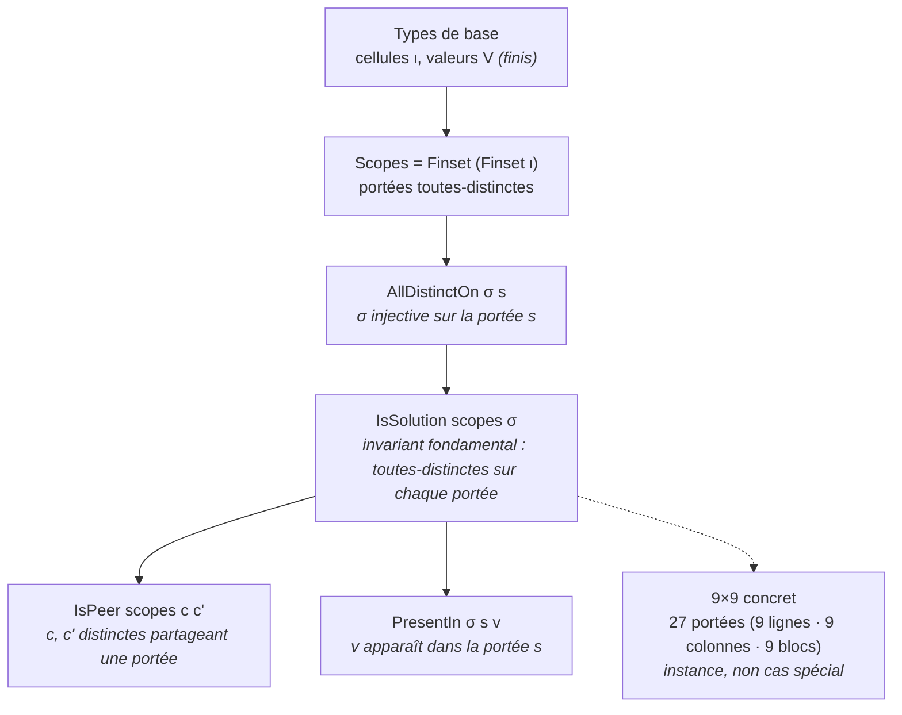
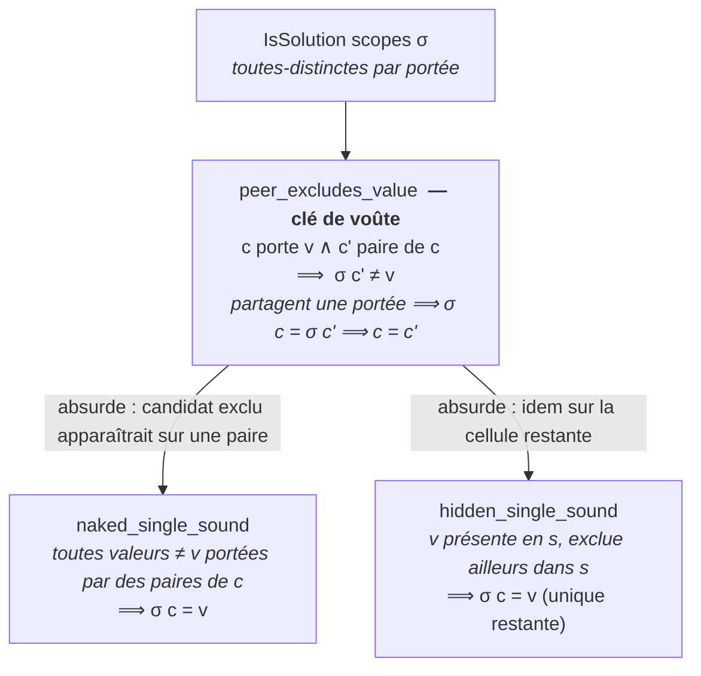

# sudoku_lean — soundness de la propagation de contraintes (Lean 4)

## Hook

`naked single` et `hidden single` accélèrent les solveurs Sudoku en **éliminant des
candidats impossibles** dès qu'une valeur est placée. Mais cette élimination est-elle
**sûre** ? Ce lake prouve formellement que la réponse est **oui** : aucune solution
valide n'est perdue par propagation — la règle ne fait que rendre **explicite** ce que
l'invariant « toutes-distinctes par portée » impose déjà.

Voir `See #4055` (roadmap Lean `See #4038`). Coordination `See #2978` vérifiée :
l'angle Lean de #2978 est la terminaison de reconnaisseur regex (`finiteness-derivatives`),
sans chevauchement avec la propagation/exact-cover formalisés ici.

## À qui

Ce lake s'adresse à trois publics, par ordre de dépendance :

- **Lecteur du cours Sudoku** qui veut comprendre **pourquoi** les règles de
  propagation fonctionnent — pas seulement les utiliser.
- **Lecteur intéressé par la formalisation en Lean 4** d'un problème CSP concret et
  minimal : un Sudoku (ou plus généralement tout CSP « à portées toutes-distinctes »)
  tient en quelques types de base, deux théorèmes de soundness, et une clé de voûte.
- **Lecteur venant d'un autre lake frère** (`Coherence`, `Utility`) qui cherche un
  exemple du **pattern commun** « une direction prouvée, la réciproque ouverte
  documentée ».

## Objectifs

1. Prouver la **soundness** des deux règles canoniques (`naked_single_sound`,
   `hidden_single_sound`) sans `sorry` ni axiome non standard.
2. Formaliser **abstraitement** la structure de contraintes — le 9×9 concret (27 portées)
   est une instance, non un cas spécial.
3. Identifier la **clé de voûte** (`peer_excludes_value`) sur laquelle reposent les deux
   théorèmes, pour rendre la déduction auditable d'un seul coup d'œil.
4. Documenter honnêtement les **jalons ouverts** (réduction Sudoku ⇔ couverture exacte,
   complétude, minimum 17 indices) — non `sorry`-backed.

## Notebooks

Ce lake est un **livrable formel**, pas une série de notebooks. Il **fonde** les
solveurs pédagogiques de la série `Sudoku` :

- `Sudoku-1-Backtracking-Csharp.ipynb` — backtracking C#/.NET.
- `Sudoku-10-ORTools-Csharp.ipynb` — OR-Tools.
- Solveurs Python et Infer.NET (voir `Sudoku/README.md`).

Lake = livrable formel, `lake build` = preuve d'exécution (convention des lakes frères).

## Parcours

| Profil | Étapes |
|--------|--------|
| **Lecteur du cours** | Motivation → Concepts → Théorie → [Statut](#statut) |
| **Lecteur Lean** | Concepts → Théorie → [Modules](#modules) → [Build](#build) |
| **Lecteur déjà familiarisé avec un lake frère** | Théorie → [Statut](#statut) → [Annexes](#annexes) |

## Prérequis

- **Lean 4** `v4.31.0-rc1` (`leanprover/lean4`) — toolchain.
- **Mathlib4** `v4.31.0-rc1` — théorie des `Finset`, injectivité sur un ensemble,
  images finies.
- **`lake`** (via `elan`) — orchestrateur de build.
- **WSL** requis pour un build complet sur Windows (WDAC workaround sur le filesystem
  natif). Depuis WSL : `lake build Sudoku`.

Aucune autre dépendance que Mathlib4. Le premier build est lourd (cache Mathlib) ;
les builds suivants utilisent le cache.

## Limitations

- **Réduction Sudoku ⇔ couverture exacte** (Knuth, 4 familles de contraintes :
  cellule, ligne-valeur, colonne-valeur, bloc-valeur) — l'équivalence des ensembles de
  solutions est un **jalon naturel laissé ouvert** et **non `sorry`-backed**.
- **Complétude** des règles de propagation — les naked/hidden singles ne suffisent pas à
  résoudre tout Sudoku (d'où le recours au backtracking) ; formaliser cette limite est
  un **jalon séparé**.
- **Minimum 17 indices** — résultat de calcul massif (recherche exhaustive),
  **non formalisable**, explicitement **hors scope**.
- Cette structure (soundness prouvée + réduction/complétude ouvertes documentées) est
  cohérente avec les lakes frères `Coherence` / `Utility` du même programme : une
  direction prouvée, la réciproque ouverte.

## Concepts

- **Naked single** — une cellule dont le seul candidat restant est `v` doit contenir
  `v`.
- **Hidden single** — une valeur qui ne peut aller que dans une seule cellule d'une
  portée doit y aller.
- **Portée (scope)** — un sous-ensemble de cellules soumises à la contrainte
  toutes-distinctes (ligne, colonne, bloc dans un Sudoku 9×9).
- **IsSolution** — invariant fondamental : `σ` (affectation candidate) est injective sur
  chaque portée.
- **Peer** — deux cellules distinctes partageant au moins une portée.
- **Soundness** — propriété d'une règle : **aucune solution valide n'est éliminée**.

## Motivation

Les solveurs Sudoku enseignés dans la série `Sudoku` (backtracking, OR-Tools, .NET,
Infer.NET) accélèrent la résolution en **propageant** les contraintes : dès qu'une
valeur est placée, on élimine les candidats devenus impossibles. Deux règles
canoniques :

- **Naked single** — une cellule dont le seul candidat restant est `v` doit contenir `v`.
- **Hidden single** — une valeur qui ne peut aller que dans une seule cellule d'une
  portée doit y aller.

Ce module prouve que ces règles sont **saines** : éliminer un candidat par propagation,
c'est éliminer une affectation qu'**aucune solution n'utilise**. La propagation ne
« devine » jamais — elle ne fait que rendre explicite ce que l'invariant
« toutes-distinctes par portée » impose déjà.

## Théorie

### Modèle abstrait (0 sorry)

La modélisation est **abstraite sur la structure de contraintes** : un Sudoku (plus
généralement tout CSP « à portées toutes-distinctes ») = un type de cellules `ι`, un type
de valeurs `V` (tous deux finis), et un ensemble de **portées** `Scopes` (chacune un
`Finset` de cellules). Le 9×9 concret (27 portées : 9 lignes, 9 colonnes, 9 blocs) en
est une **instance**, non un cas spécial — les théorèmes valent pour toute structure de
ce type.

*La pyramide abstraite du modèle : les types de base `ι`/`V` et les portées `Scopes`
portent l'invariant toutes-distinctes `IsSolution`, dont découlent les deux outils de
propagation `IsPeer` et `PresentIn` :*



### Soundness prouvée

**`Sudoku/Basic.lean`** — primitives :
- `Scopes` (= `Finset (Finset ι)`), `Solution` (= `ι → V`).
- `AllDistinctOn σ s` — `σ` injective sur la portée `s` (aucune valeur répétée).
- `IsSolution scopes σ` — `σ` toutes-distinctes sur chaque portée (invariant fondamental).
- `IsPeer scopes c c'` — `c` et `c'` distinctes partageant une portée.
- `PresentIn σ s v` — `v` apparaît dans la portée `s`.

**`Sudoku/Propagation.lean`** — soundness (0 sorry) :
- `peer_excludes_value` — **clé de voûte** : une cellule `c` portant `v` exclut `v` de
  toute cellule paire `c'` dans toute solution (`σ c' ≠ v`). Preuve : `c, c'` partagent
  une portée `s` ; toutes-distinctes sur `s` ⟹ `σ c = σ c'` impliquerait `c = c'`,
  contredisant `c ≠ c'`.
- `naked_single_sound` — si toutes les valeurs sauf `v` sont portées par des paires de
  `c`, toute solution place `v` en `c` (la cellule n'a plus que `v` comme candidat).
- `hidden_single_sound` — si `v` est présente dans la portée `s` et exclue de toute
  autre cellule de `s`, toute solution place `v` en l'unique cellule restante `c`.

Chaque théorème se réduit à la clé de voûte `peer_excludes_value` par un argument par
l'absurde : un candidat « exclu » apparaîtrait sur une paire, ce que la clé de voûte
interdit.

*La déduction sound, de la clé de voûte jusqu'aux deux règles canoniques — chacune
réduite à `peer_excludes_value` par l'absurde :*



## Portée

La formalisation porte sur **tout CSP à portées toutes-distinctes** : pas seulement
le Sudoku 9×9 (qui n'est qu'une instance), mais aussi :

- **Sudoku NxN** — généralisation triviale (même `Scopes` 3·N portées, valeurs
  `{1, ..., N²}`).
- **Latin squares** — cas limite du Sudoku NxN sans blocs.
- **Tout CSP où les contraintes s'expriment comme `AllDistinctOn σ s`** — le théorème
  reste valide sans modification.

Le 9×9 concret est strictement une **instance**, non un cas spécial — c'est la force
de la modélisation abstraite sur `Finset (Finset ι)`.

## FAQ

### Pourquoi `peer_excludes_value` est-elle la « clé de voûte » ?

Parce qu'elle **factorise** les deux théorèmes de soundness. Naked et hidden single
se réduisent à « un candidat exclu ne peut pas apparaître sur une paire » par
l'absurde — ce que `peer_excludes_value` garantit exactement. Une seule preuve, deux
applications.

### Pourquoi formaliser `IsPeer` et `PresentIn` séparément ?

`IsPeer` = relation structurelle entre cellules (calculable à partir de `Scopes`).
`PresentIn` = prédicat sur l'affectation candidate (`σ c ∈ s ?`). Les deux jouent
des rôles distincts dans la soundness : `IsPeer` pour exclure une valeur d'une paire,
`PresentIn` pour vérifier qu'une valeur est dans une portée donnée.

### Pourquoi Mathlib et pas une réimplémentation ?

`Finset`, `injective`, `Set.image` — toutes les briques élémentaires sont dans
Mathlib et bien auditées. Réimplémenter exposerait à des bugs subtils sur la
finitude (utilisée dans la preuve de `hidden_single_sound`) et violerait la
convention lakes frères (Mathlib4 obligatoire).

### Pourquoi pas `decide` / `decidable` ?

Le module n'utilise pas `decide` car la soundness est une **propriété universelle**
(« pour toute solution, … ») et non une **décision booléenne**. `decide` ne
s'applique pas aux quantifications universelles sur des types non-`Decidable`.

### Pourquoi 0 axiome non standard ?

Les axiomes utilisés sont `[propext, Classical.choice, Quot.sound]` — les standards
Mathlib4 (cf. `mathlib4/Mathlib/Init.lean`). Pas de `sorryAx`, pas d'axiome ad-hoc.
La soundness est **prouvée**, pas postulée.

## Conclusion

`sudoku_lean` prouve que les règles de propagation `naked single` et `hidden single`
sont **sound** : aucune solution valide n'est éliminée. La modélisation abstraite
(`Scopes`, `IsSolution`, `IsPeer`, `PresentIn`) sur `Finset (Finset ι)` permet de
couvrir tout CSP à portées toutes-distinctes, dont le Sudoku 9×9 n'est qu'une
instance. La clé de voûte `peer_excludes_value` factorise les deux théorèmes —
auditable en un coup d'œil. Les jalons ouverts (réduction exact-cover, complétude,
minimum 17 indices) sont documentés honnêtement, **non `sorry`-backed**.

Pattern réutilisable pour les lakes frères : **une direction prouvée + la réciproque
ouverte documentée**.

## Annexes

### Statut

- **Toolchain** : `leanprover/lean4:v4.31.0-rc1`
- **Sorry** : **0** sur l'ensemble du module.
- **Build** : `lake build Sudoku` (dépend de Mathlib4)
- **Dépendances** : Mathlib4 (`v4.31.0-rc1`) — théorie des `Finset`, injectivité sur un
  ensemble, images finies.
- **Axiomes** : `[propext, Classical.choice, Quot.sound]` (standards Mathlib, pas de
  `sorryAx`) sur les trois théorèmes.

### Modules

| Fichier | Contenu |
|---------|---------|
| `Sudoku/Basic.lean` | Types abstraits — `Scopes`, `Solution`, `AllDistinctOn`, `IsSolution`, `IsPeer`, `PresentIn`. |
| `Sudoku/Propagation.lean` | **Clé de voûte** `peer_excludes_value` + soundness `naked_single_sound`, `hidden_single_sound` (0 sorry). |
| `Sudoku.lean` | Imports parapluie + doc de statut. |

### Build

```bash
# Depuis ce répertoire (WSL requis pour un build complet ; WDAC workaround sur Windows)
lake build Sudoku
# Dépend de Mathlib4 — le premier build est lourd, les builds suivants utilisent le cache
```

### Référence croisée

- Série `Sudoku` (`Sudoku-1-Backtracking-Csharp.ipynb`, `Sudoku-10-ORTools-Csharp.ipynb`,
  …) : les solveurs C#/.NET + Python dont ce lake fonde formellement l'étape de
  propagation. Lake = livrable formel, `lake build` = preuve d'exécution (convention des
  lakes frères).
- `See #2978` (Sudoku comme regex symbolique) : angle Lean = terminaison de
  reconnaisseur, sans chevauchement.
