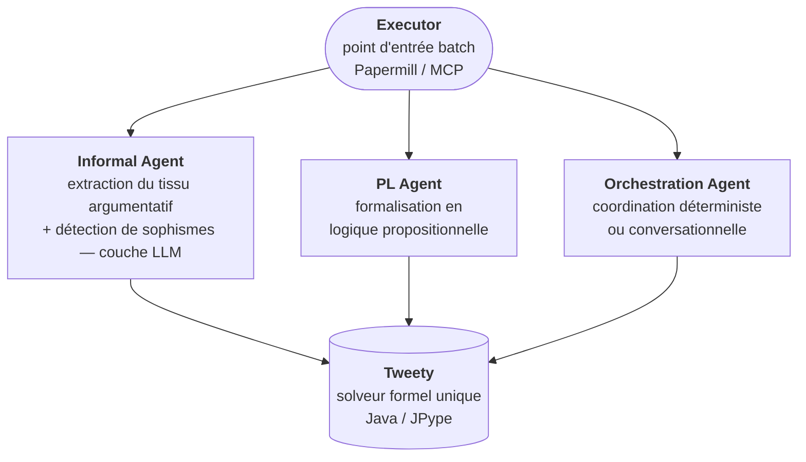
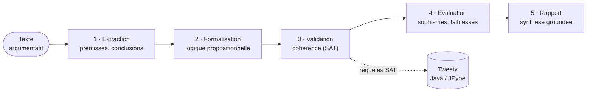

# Argument_Analysis - Analyse Argumentative avec Agents IA

<!-- CATALOG-STATUS
series: SymbolicAI-Argument_Analysis
pedagogical_count: 21
breakdown: Argument_Analysis=21
maturity: PRODUCTION=15, BETA=5, ALPHA=1
-->

[← SmartContracts](../SmartContracts/README.md) | [↑ SymbolicAI](../README.md) | [SymbolicLearning →](../SymbolicLearning/README.md)

Pipeline complet d'analyse argumentative combinant Semantic Kernel, TweetyProject et programmation logique pour l'identification et l'évaluation d'arguments dans des textes.

## Pourquoi cette série

Distinguer un argument valide d'un sophisme est un acte essentiel dans une société saturée de discours générés à la chaîne. Lorsque les LLMs produisent des textes plausibles à la demande, la frontière entre persuasion légitime et manipulation rhétorique se brouille : raisonnements circulaires, faux dilemmes, appels à l'autorité mal calibrés deviennent indétectables par simple lecture rapide. La vérification formelle, autrefois réservée aux logiciens, devient un service de masse : modération de plateformes, journalisme assisté, éducation critique, audit de contenus pédagogiques générés par IA.

Cette série pose une question concrète : peut-on construire un pipeline qui prend un texte argumentatif en entrée et qui en restitue une carte logique formelle, validée par un solveur SAT, avec détection systématique des sophismes connus ? La réponse passe par un assemblage soigné de trois compétences distinctes : un LLM pour extraire le tissu argumentatif informel (prémisses, conclusions, transitions), un solveur logique (TweetyProject, Java via JPype) pour vérifier la cohérence des formalisations propositionnelles obtenues, et une couche d'orchestration agentique (Semantic Kernel) qui transforme cette chaîne en pipeline reproductible. Le travail pédagogique consiste à maîtriser chacune de ces briques *et* leur composition : où s'arrête le LLM, où commence le vérificateur formel, comment une boucle informel/formel converge vers un verdict.

Le contexte de recherche actuel rend cette compétence particulièrement pertinente. Les frameworks de raisonnement structuré (ASPIC+, ABA, DeLP) sont implémentés en JVM et accessibles via les mêmes ponts JPype que ceux utilisés ici. Les LLMs de 2025-2026 sont assez fiables pour la phase d'extraction informelle mais restent faibles sur la vérification formelle, ce qui motive précisément le pattern hybride documenté dans la série. Les ponts vers [Tweety](../Tweety/) (sémantiques de Dung, révision de croyances AGM, préférences de Tweety-9) et [Lean](../Lean/) (preuves formelles, tactiques) permettent d'aller plus loin pour qui veut dépasser la simple vérification SAT.

**À qui s'adresse cette série** : enseignants en pensée critique, équipes éditoriales construisant des outils de fact-checking, étudiants en philosophie computationnelle ou en linguistique formelle, et ingénieurs explorant les architectures hybrides LLM + solveur. La maîtrise préalable supposée est modérée : Python intermediate, intuition logique propositionnelle, familiarité minimale avec les LLMs et l'OpenAI API. Les notebooks (~4-5h total) s'enchaînent dans l'ordre 0 → 1 → 2 → 3, avec l'`Executor` comme point d'entrée pour une exécution batch reproductible (Papermill / MCP).

## Domaines d'application

L'analyse argumentative outillée s'inscrit dans plusieurs cas concrets où la distinction "argument valide / sophisme" doit être rendue automatique ou semi-automatique :

- **Modération de discussions en ligne** : détection des sophismes récurrents (homme de paille, faux dilemmes, glissement, ad hominem) dans des fils de commentaires longs, avec un rapport agrégé par utilisateur ou par fil. Le pattern LLM-extracteur + vérificateur formel est calibré précisément pour cet usage.
- **Fact-checking et journalisme assisté** : décomposition d'un éditorial ou d'un discours politique en chaîne de prémisses et conclusions, marquage des transitions logiquement faibles, identification des affirmations factuelles à vérifier externellement. La phase "formalisation" crée un livrable inspectable, contrairement aux jugements opaques d'un LLM seul.
- **Éducation à la pensée critique** : production d'exercices d'analyse à partir de textes réels (discours, essais, posts), avec correction automatisée partielle. L'enseignant valide la décomposition, l'élève apprend à justifier chaque étape.
- **Audit de contenus IA** : vérification de la cohérence interne des réponses LLM longues sur sujets sensibles (médical, juridique, financier). Un LLM peut produire un raisonnement plausible mais incohérent ; le solveur formel détecte les contradictions internes.
- **Recherche en argumentation structurée** : terrain expérimental pour les frameworks Dung, ASPIC+, ABA, accessibles via les ponts Tweety. La série sert de support à des explorations académiques (mémoires, thèses) sur les sémantiques d'acceptabilité, la révision de croyances AGM, ou les préférences entre arguments.

## Objectifs d'apprentissage

À l'issue de cette série, vous serez capable de :

1. **Extraire le tissu argumentatif** d'un texte en identifiant prémisses, conclusions et transitions à l'aide d'un agent LLM (Semantic Kernel)
2. **Formaliser des arguments** en logique propositionnelle et vérifier leur cohérence avec un solveur SAT (TweetyProject)
3. **Détecter les sophismes** courants (homme de paille, faux dilemme, ad hominem, appel à l'autorité) de manière systématique
4. **Orchestrer un pipeline multi-agents** combinant extraction informelle, formalisation logique et validation formelle
5. **Comparer les approches** LLM-only vs hybride (LLM + solveur formel) et comprendre les limites de chaque couche

## Quel parcours choisir ?

| Profil | Parcours recommandé | Notebooks |
|--------|-------------------|-----------|
| **Découvreur de l'analyse argumentative** | Pipeline complet en ordre | 0 → 1 → 2 → 3 (~3h) |
| **Enseignant en pensée critique** | Extraction + détection sophismes | 0 → 1 → UI_configuration (~1h30) |
| **Ingénieur ML/LLM** | Architecture multi-agents | 0 → 3 → Executor (~1h30) |
| **Chercheur en logique formelle** | Formalisation + vérification SAT | 0 → 2 (~1h) |

---

## Vue d'ensemble

| Statistique | Valeur |
|-------------|--------|
| Kernel | Python 3 |
| Durée estimée | ~4-5h |
| API requise | OpenAI |

## Notebooks

| # | Notebook | Contenu | Rôle |
|---|----------|---------|------|
| 0 | [Agentic-0-init](Argument_Analysis_Agentic-0-init.ipynb) | Configuration env : JPype + JDK 17 + 76 jars Tweety, démarrage JVM fail-loud + smoke test | Setup |
| 0* | [Agentic-0-init_agent](Argument_Analysis_Agentic-0-init_agent.ipynb) | *(legacy)* Configuration LLM/OpenAI (semantic_kernel) | Setup |
| 1 | [Agentic-1-informal](Argument_Analysis_Agentic-1-informal.ipynb) | Détection de sophismes par taxonomie (CSV 1406 nœuds) | Détection d'arguments |
| 1* | [Agentic-1-informal_agent](Argument_Analysis_Agentic-1-informal_agent.ipynb) | *(legacy)* Agent analyse informelle | Détection d'arguments |
| 2 | [Agentic-2-formal](Argument_Analysis_Agentic-2-formal.ipynb) | Logique formelle réelle (PL + FOL + Modal + Dung via Tweety) | Formalisation |
| 2* | [Agentic-2-pl_agent](Argument_Analysis_Agentic-2-pl_agent.ipynb) | *(legacy)* Agent logique propositionnelle | Formalisation |
| 3 | [Agentic-3-orchestration](Argument_Analysis_Agentic-3-orchestration.ipynb) | Orchestration : mini-DAG déterministe vs conversationnel (state-driven) | Coordination |
| 3* | [Agentic-3-orchestration_agent](Argument_Analysis_Agentic-3-orchestration_agent.ipynb) | *(legacy)* Orchestration multi-agents (semantic_kernel) | Coordination |
| 4 | [Agentic-4-capstone](Argument_Analysis_Agentic-4-capstone.ipynb) | Capstone : baseline 0-shot vs pipeline intégral, verdicts convergents + value-gates VG-1..VG-4 | Intégration |
| 5 | [Agentic-5-jtms](Argument_Analysis_Agentic-5-jtms.ipynb) | Truth Maintenance System déterministe (Doyle 1979) : étiquetage IN/OUT, cascade de rétractation, détection d'odd loops — pur stdlib Python | Raisonnement non-monotone |
| Dung | [Dung_AF_Semantics](Argument_Analysis_Dung_AF_Semantics.ipynb) | Sémantiques grounded / preferred / stable reconstruites de zéro en pur Python (cas canonique où les trois divergent) | Fondation argumentation abstraite |
| Rank | [Ranking_Semantics](Argument_Analysis_Ranking_Semantics.ipynb) | Sémantiques de classement (h-Categoriser, fardeau) en pur Python : force numérique départageant des arguments de même statut Dung | Argumentation graduée |
| Route | [Multi_Backend_Routing](Argument_Analysis_Multi_Backend_Routing.ipynb) | Routage multi-backend « décider ou échouer bruyamment » : PL/Modal/Dung/FOL décidés par Tweety embarqué + sentinelle de contrat de livraison gardant les prouveurs externes (EProver/Mace4) — doctrine anti-théâtre / fail-loud | Raisonnement robuste |
| Matrix | [Formal_Richness_Matrix](Argument_Analysis_Formal_Richness_Matrix.ipynb) | Matrice de richesse formelle (FP-5) : classifier ce qu'un solveur *décide réellement* (principe *wiring* ≠ *output*), 4 classes de verdict (substantive / honest-absent / unavailable / théâtre), sentinelle anti-théâtre `fabricated_true` + diagnostic laggards — pur stdlib | Évaluation honnête / anti-théâtre |
| Restit | [Restitution_3_Actes](Argument_Analysis_Restitution_3_Actes.ipynb) | Restitution honnête en 3 actes : scaffold déterministe pur stdlib (evidence réel-en-état, bande de verdict *gated*, gate de lisibilité §4, renderer *fail-loud*) + narration LLM **réelle** (SDK OpenAI, clé via `GenAI/.env`) *gated* — prompts conduits, callable injectable, fail-loud sans clé | Restitution / honnêteté |
| Profil | [ArgumentProfile](Argument_Analysis_ArgumentProfile.ipynb) | Vue agrégée par argument (`ArgumentProfile`) : réunit les 5 dimensions (sophismes, qualité, contre-arguments, JTMS, formel) en une fiche exploitable, et trie un débat par force (arguments faibles / fallacieux). Démontre l'**indépendance des dimensions** (valide formellement ≠ non fallacieux). Auto-contenu, déterministe, sans LLM | Vue agrégée / multidimensionnelle |
| Ontology_AIF | [Ontology_AIF](Argument_Analysis_Ontology_AIF.ipynb) | Socle ontologique Argumentum (`argumentum_fallacies.owl`, 4,7 MB OWL2/XML) : parseur regex tolérant (37 axiom `ExactCardinality` mal formés bloquent rdflib), inventaire 10 976 NamedIndividual + 1 305 ClassAssertion (skos:Concept dominant) + 4 183 ObjectPropertyAssertion, recherche des schemes Walton dans les labels, sous-graphe autour de l'Equivoque — lien entre la série et l'ontologie upstream Argumentum | Socle ontologique |
| CrossLinks | [Ontology_CrossLinks](Argument_Analysis_Ontology_CrossLinks.ipynb) | Complément CSV canonique Argumentum (`Cards/Fallacies/Argumentum Fallacies - Taxonomy.csv`, 1 408 lignes × 102 colonnes) : 8 colonnes `crossLink_*` (PredatesOn, Denounces, Leverages, Allows, Opposes, Inverts, Mirrors, IsRelatedTo — quasi-vides, 22 relations totales, 1,5% des sophismes ont ≥1 crossLink) + 70 mappings AIF (skos:broadMatch/closeMatch/narrowMatch, absents OWL) + 60 schemes Walton uniques (top : OppositeConsequences_Conflict 5 occurrences). Compare le gap OWL (10 976 NI) vs CSV (1 408 sophismes × 8 langues = 11 264 descriptions) — finding méthodologique : l'effort de curation upstream est porté sur la **taxonomie** (8 langues, 8 familles, 9 niveaux), pas sur les **liens transverses** | CSV canonique |
| Ontology_Virtues | [Ontology_Virtues](Argument_Analysis_Ontology_Virtues.ipynb) | Pôle **positif** de l'axe argumentatif (`argumentum_virtues.owl`, 863 KB OWL2/XML) : thésaurus SKOS des **vertus** argumentatives, miroir des sophismes (`aif:goodTenorOf` vs `badTenorOf`). Pont regex→rdflib chargeant 2 639 triplets SKOS (rdflib et owlready2 échouent sur l'OWL/XML fonctionnel), 224 `skos:Concept` bilingues (prefLabel fr 223 / en 223), racine `validArgument`, 14 schemes de Walton rattachés — contraste ABox (sophismes = NamedIndividual + ObjectPropertyAssertion) vs thésaurus d'annotations SKOS (vertus) | Pôle vertus / SKOS |
| UI | [UI_configuration](Argument_Analysis_UI_configuration.ipynb) | Interface utilisateur widgets | Interaction |
| Exec | [Executor](Argument_Analysis_Executor.ipynb) | Orchestrateur principal | Exécution |

## Ce que chaque notebook apporte

| Notebook | Compétence clé | Temps |
|----------|----------------|-------|
| **0-init** | Configurer l'environnement Python + Java, charger les clés API, vérifier la connexion Tweety/JVM | 30 min |
| **1-informal** | Charger la taxonomie des sophismes (CSV 1406 nœuds, 7 familles), descendre d'un niveau (depth=2) et construire un détecteur déterministe par mots-clés sur un texte synthétique | 30 min |
| **1-informal_agent** *(legacy)* | Construire un agent LLM qui identifie et annote les arguments dans un texte naturel | 60 min |
| **2-formal** | Vérifier des arguments en logique propositionnelle, du premier ordre et modale avec le solveur réel Tweety (JVM/JPype), apéru Dung — mode fail-loud, jamais simulé | 45 min |
| **2-pl_agent** *(legacy)* | Convertir les arguments informels en formules propositionnelles et les vérifier via SAT | 60 min |
| **3-orchestration** | Composer les agents précédents en pipeline coordonné avec rapport de sortie structuré | 50 min |
| **5-jtms** | Construire un moteur de croyances non-monotones (étiquetage IN/OUT, cascade de rétractation, détection d'odd loops) en pur stdlib Python, sans LLM ni solveur externe | 40 min |
| **Dung_AF_Semantics** | Reconstruire les sémantiques grounded, preferred et stable de l'argumentation abstraite de Dung de zéro en pur Python (sans JVM) sur un cas où les trois divergent | 35 min |
| **Ranking_Semantics** | Calculer la *force* numérique d'un argument (h-Categoriser par point fixe, fardeau par comparaison lexicographique) et départager des arguments que Dung déclare indistinctement rejetés — pur stdlib Python | 35 min |
| **Restitution_3_Actes** | Séparer la *lisibilité* (confiée au LLM) de l'*honnêteté* (gardée par un scaffold déterministe) : extraction d'evidence, bande de verdict *gated* sur la couverture, gate de tissage anti-énumération (§4), renderer qui *nomme* les actes manquants, et narration LLM injectable *fail-loud* | 45 min |
| **ArgumentProfile** | Construire la fiche agrégée d'un argument réunissant les 5 dimensions d'analyse (sophismes, qualité, contre-arguments, JTMS, formel), puis trier un débat entier par force — démontre l'indépendance des dimensions | 35 min |
| **Ontology_AIF** | Charger l'ontologie Argumentum (OWL2/XML, 4,7 MB) via un parseur regex tolérant (rdflib échoue sur 37 axiom `ExactCardinality` mal formés), inventorier les 10 976 NamedIndividual + 4 183 ObjectPropertyAssertion, retrouver les schemes Walton dans les labels multilingues (Sign, Rule), et construire le sous-graphe du sophisme Equivoque (`semanticAmbiguity` + variantes) | 35 min |
| **Ontology_CrossLinks** | Compléter la vue OWL par le CSV canonique Argumentum (1 408 lignes × 102 colonnes, 8 langues × 8 familles × 9 niveaux) : quantifier les 8 colonnes `crossLink_*` (PredatesOn 9, Denounces 1, Leverages 4, Allows 1, Opposes 2, Inverts 1, Mirrors 2, IsRelatedTo 2 — total 22, soit 1,5% de couverture par sophisme) et les 70 mappings AIF/Walton (`skos:broadMatch` 57, `skos:closeMatch` 10, `skos:narrowMatch` 3) ; démontrer empiriquement le gap OWL↔CSV (×7,8 en NamedIndividual par label multilingue) et la **sparsity structurelle** des relations transverses vs la richesse de l'arbre taxonomique | 30 min |
| **Ontology_Virtues** | Charger le pôle **positif** de la taxonomie Argumentum (`argumentum_virtues.owl`, thésaurus SKOS) via un pont regex→rdflib (rdflib et owlready2 échouent sur l'OWL/XML fonctionnel) : construire 2 639 triplets SKOS sur 224 concepts, inventorier les prédicats SKOS (prefLabel / definition / broader / topConceptOf), contraster le paradigme ABox des sophismes (NamedIndividual + ObjectPropertyAssertion) avec le thésaurus d'annotations des vertus, extraire les libellés bilingues FR/EN et relier chaque vertu à ses schemes de Walton via `aif:goodTenorOf` | 35 min |
| **UI_configuration** | Créer une interface interactive (ipywidgets) pour piloter le pipeline en mode exploratoire | 30 min |
| **Executor** | Exécuter le pipeline complet en mode batch (Papermill/MCP) avec configuration .env | 20 min |

## Architecture



L'`Executor` est le seul point d'entrée (exécution batch via Papermill/MCP) : il déclenche la chaîne et agrège le rapport final. Le travail se *fan-out* vers trois agents spécialisés — **Informal** (extraction du tissu argumentatif et détection de sophismes, couche LLM), **PL** (formalisation en logique propositionnelle) et **Orchestration** (coordination déterministe ou conversationnelle) — puis *converge* vers **Tweety**, le solveur formel unique (Java via JPype).

Cette topologie en entonnoir n'est pas accidentelle : la cohérence logique est la seule propriété qu'aucun agent ne peut auto-certifier, elle doit donc être déléguée à un vérificateur externe et partagé. Le LLM se charge de tout ce qui est flou et contextuel (lire un texte, repérer un sophisme) ; le solveur se charge de tout ce qui est tranchant et décisif (une formule est-elle satisfaisable ? un argument est-il défendable ?). La frontière informel/formel passe exactement au point de convergence.

## Pipeline d'analyse

1. **Extraction** - Identification des arguments dans le texte
2. **Formalisation** - Conversion en logique propositionnelle
3. **Validation** - Vérification cohérence via Tweety
4. **Évaluation** - Détection de sophismes et faiblesses
5. **Rapport** - Génération conclusion structurée



## Exemple de trace du pipeline

Pour rendre ce déroulement concret, voici ce que produit le pipeline sur le **terrain commun** du capstone ([Agentic-4-capstone](Argument_Analysis_Agentic-4-capstone.ipynb)) : un texte argumentatif neutre — un comité abstrait, sans entité réelle — délibérément chargé de cinq sophismes détectables (appel à l'autorité, attaque *ad hominem*, généralisation hâtive, appel à la peur, appel à la conformité). Il sert de terrain commun à la baseline et au pipeline complet.

1. **Extraction informelle** — l'agent parcourt le texte et isole le tissu argumentatif : prémisses, conclusions, transitions rhétoriques. Chaque passage suspect est confronté à la taxonomie des sophismes (1406 nœuds, 7 familles).
2. **Détection** — les sophismes présents sont étiquetés et rattachés à leur famille (Obstruction pour *ad hominem*, Erreur de raisonnement pour le faux dilemme, etc.), avec le déclencheur textuel qui les a signalés.
3. **Formalisation** — les arguments retenus sont traduits en formules de logique propositionnelle et ajoutés au *belief set*.
4. **Validation formelle** — Tweety, via le pont JPype, interroge ce belief set (une dizaine de requêtes SAT) pour confirmer la cohérence interne : pas de contradiction masquée, pas de conclusion tirée sans prémisse. Mode *fail-loud* : si la JVM manque, le pipeline échoue bruyamment plutôt que de simuler un verdict.
5. **Synthèse groundée** — le rapport final cite explicitement chaque artefact qu'il invoque (`[artifact:champ:id]`), ce que les *value-gates* vérifient déterministiquement : VG-1 (densité de citations), VG-2 (état substantiel peuplé), VG-3 (non-boilerplate), VG-4 (vrai paragraphe de synthèse citant ≥ 2 champs distincts).

Le verdict attendu sur l'`Executor` (mode batch) est `COMPLETE_VALIDATED` : 1 argument identifié, 4 sophismes étiquetés, 1 belief set formel, ~10 requêtes au solveur, et les quatre value-gates au vert. La même exécution en mode baseline (LLM seul, 0-shot) sert de contre-point : sans la couche formelle, la cohérence interne n'est garantie par rien, et c'est précisément cet écart que la série cherche à mesurer.

## Concepts clés

Le pipeline mobilise un vocabulaire issu de trois traditions — la rhétorique classique, la logique formelle et l'argumentation computationnelle. Le tableau ci-dessous reprend les notions effectivement manipulées dans les notebooks, avec un pointeur vers celui qui les met en œuvre.

| Concept | Description | Notebook |
|---------|-------------|----------|
| **Argument** | Suite de *prémisses* soutenant une *conclusion* ; c'est le tissu que le pipeline extrait d'un texte naturel. | 1-informal |
| **Prémisse / Conclusion** | Brique atomique de l'argument : la prémisse est l'énoncé admis, la conclusion celle que l'on dérive. Leur identification est la sortie de l'agent informel. | 1-informal |
| **Sophisme** | Raisonnement fallacieux mais plausible. La série s'appuie sur une taxonomie de 1406 nœuds en 7 familles (Obstruction, Erreur de raisonnement, …) organisée en arbre jusqu'à 10 niveaux. | 1-informal |
| **Formalisation** | Traduction d'un argument naturel en formule logique inspectable. C'est le point de bascule où le texte cesse d'être du langage naturel pour devenir un objet qu'un solveur peut interroger. | 2-formal |
| **Logique propositionnelle (PL)** | Logique des connecteurs (∧, ∨, →, ¬) sans quantificateurs ; vérifiée via un modus ponens dans Tweety. | 2-formal §3 |
| **Logique du premier ordre (FOL)** | PL étendue des quantificateurs (∀, ∃) et prédicats. Exige une *signature* déclarée (constantes, prédicats) avant toute requête. | 2-formal §4 |
| **Logique modale** | Logique du *possible* (◇) et du *nécessaire* (□), utile pour les arguments portant sur la contingence ou l'obligation. | 2-formal §5 |
| **Argumentation de Dung** | Cadre abstrait où les arguments s'attaquent mutuellement ; la sémantique *grounded* calcule l'ensemble des arguments défendables. Les sémantiques *preferred* et *stable* étendent ce verdict sous différentes attitudes (crédule, auto-suffisante). | Dung_AF_Semantics, 2-formal §6 |
| **Sémantique de classement** | Approche *graduée* : au lieu d'un verdict tout-ou-rien, chaque argument reçoit une *force* numérique (h-Categoriser, fardeau) qui induit un ordre — départageant des arguments de même statut Dung. | Ranking_Semantics |
| **Belief set** | Ensemble de formules formalisant l'état de croyance déduit du texte ; c'est ce que le solveur manipule et interroge. | 2-formal |
| **SAT** | Problème de satisfaisabilité : existe-t-il une valuation rendant un ensemble de formules cohérent ? Cœur de la validation Tweety. | 2-formal |
| **Fail-loud** | Principe de conception : le pipeline échoue bruyamment plutôt que de *simuler* un verdict (jamais de sortie fictive si la JVM ou le solveur manque). | 2-formal |
| **Value-gates (VG-1..VG-4)** | Quatre gardes déterministes qui notent si la synthèse finale est *groundée* (elle cite ses artefacts via `[artifact:champ:id]`) ou *boilerplate* (template vide). | 4-capstone |
| **Pipeline hybride LLM + solveur** | Architecture où le LLM gère l'extraction informelle (floue, contextuelle) et le solveur formel garantit la cohérence ; aucune des deux couches ne suffit seule. | 3-orchestration |
| **Ontologie OWL2 (Argumentum)** | Représentation formelle de la taxonomie Argumentum (10 976 `NamedIndividual`, 4 183 `ObjectPropertyAssertion`). En raison de 37 axiom `ExactCardinality` structurellement invalides dans l'export upstream, le parseur regex tolérant est obligatoire — `rdflib` échoue, `owlready2` charge en silence mais n'expose pas les concepts via API. | Ontology_AIF |
| **SKOS (Simple Knowledge Organization System)** | Famille de propriétés W3C (`skos:broader`, `skos:narrower`, `skos:inScheme`, `skos:Concept`) qui dominent l'ontologie Argumentum (1 304/1 305 `ClassAssertion`). La navigation dans la taxonomie s'appuie sur ces relations plutôt que sur AIF. | Ontology_AIF |
| **Schemes d'argumentation (Walton)** | Patterns d'inférence (Position to Know, Sign, Rule, Cause to Effect) servant de taxonomie pour présomption : la reconnaissance d'un scheme active les *critiques* associées. Argumentum expose `Sign` (11 labels) et `Rule` (2 labels) ; `Position to Know` et `Cause to Effect` sont absents du label parsing. | Ontology_AIF, 1-informal |
| **CrossLinks `crossLink_*` (Argumentum CSV)** | Huit relations transverses (PredatesOn, Denounces, Leverages, Allows, Opposes, Inverts, Mirrors, IsRelatedTo) qui créeraient un **graphe** au-dessus de l'arbre taxonomique. Sur 1 408 sophismes, seulement 22 relations sont renseignées (1,5% de couverture), avec une forte dominance de `PredatesOn` (9/22, 41%). Ces colonnes sont **uniquement dans le CSV upstream** — absentes de l'OWL `argumentum_fallacies.owl`. **Finding méthodologique** : la taxonomie Argumentum est **structurellement plate** en transverses ; l'effort de curation upstream est porté sur la **profondeur taxonomique** (9 niveaux, 8 langues), pas sur les **liens inter-noeuds**. | Ontology_CrossLinks |
| **Mappings AIF/Walton (Argumentum CSV)** | Trois colonnes `AIF_skosDirectRef` / `AIF_skosExceptionRef` / `AIF_skosMappingType` (colonnes 70-72 du CSV) relient chaque sophisme aux schemes Walton via les types SKOS `broadMatch` (57, majorité), `closeMatch` (10) et `narrowMatch` (3). 70 mappings couvrent 5,0% des sophismes (1 408) ; 60 schemes Walton uniques sont référencés, top : `OppositeConsequences_Conflict` (5 occurrences). **Comme `crossLink_*`, ces mappings sont absents de l'OWL** — présents uniquement dans le CSV canonique, ce qui en fait la **source de vérité** pour l'alignement sophisme→scheme. | Ontology_CrossLinks, 1-informal |
| **Gap OWL ↔ CSV (Argumentum upstream)** | L'OWL `argumentum_fallacies.owl` expose 10 976 `NamedIndividual` ; le CSV canonique n'en compte que 1 408 sophismes × 8 langues = 11 264 descriptions. Facteur d'écart : ×7,8 (1 NamedIndividual ≈ 7,8 labels multilingues). L'OWL capture **plus de granularité** (sous-variantes, classifications internes) ; le CSV capture **la version canonique 8-langues** avec relations transverses. Les deux sources sont **complémentaires, pas redondantes** : OWL = squelette structurel (perd les crossLinks) ; CSV = graphe opérationnel (perd la granularité OWL). | Ontology_CrossLinks, Ontology_AIF |

## Prérequis

### Python

```bash
pip install semantic-kernel openai python-dotenv jpype1
```

### Java

JDK 17+ requis (auto-télécharge via `install_jdk_portable.py`).

### Configuration

```bash
# Dans .env
OPENAI_API_KEY=sk-...
GLOBAL_LLM_SERVICE=openai
BATCH_MODE=false
```

## Mode batch

Pour exécution automatisée (Papermill/MCP) :

```bash
# Dans .env
BATCH_MODE="true"
# Optionnel : texte personnalisé
# BATCH_TEXT="Votre texte à analyser..."
```

## Technologies

| Technologie | Usage |
|-------------|-------|
| **Semantic Kernel** | Orchestration agents |
| **OpenAI GPT** | Analyse textuelle |
| **TweetyProject** | Logique formelle (Java) |
| **JPype** | Pont Python-Java |

## Quick Start

```bash
# 1. Installer les dépendances Python
pip install semantic-kernel openai python-dotenv jpype1

# 2. Configurer les API keys
cp .env.example .env
# Éditer .env : OPENAI_API_KEY, BATCH_MODE=true

# 3. Lancer le premier notebook
jupyter notebook Argument_Analysis_Agentic-0-init.ipynb
```

> **Note** : JDK 17+ est requis mais auto-télécharge via `install_jdk_portable.py` (pas d'installation système).

---

## FAQ / Troubleshooting

| Problème | Solution |
|----------|----------|
| **`ModuleNotFoundError: semantic_kernel`** | `pip install semantic-kernel`. Vérifier le kernel Jupyter actif (`jupyter kernelspec list`). |
| **`OPENAI_API_KEY not set`** | Copier `.env.example` en `.env` et renseigner la clé. Vérifier que le notebook 0 charge bien le `.env`. |
| **`JVM not found`** au démarrage | JDK 17+ requis. Exécuter `python install_jdk_portable.py` dans le répertoire. |
| **`FileNotFoundException` sur un JAR Tweety** | Les JARs doivent être dans `libs/`. Re-exécuter le notebook 0 qui les télécharge. |
| **`BATCH_MODE` ignoré** | Vérifier que `.env` contient `BATCH_MODE="true"` (avec guillemets) et que le fichier est au même niveau que les notebooks. |
| **Erreur `dotnet` ou `.NET`** | Cette série est 100% Python. Seul Semantic Kernel (package Python) est utilisé, pas le SDK .NET. |
| **Sortie `PARTIAL_VALIDATED`** | Le pipeline n'a pas convergé. Vérifier les logs de l'agent PL (formalisation incomplète). Relancer avec un texte plus court. |
| **`OutOfMemoryError` JVM** | Augmenter le heap dans la cellule de démarrage : ajouter `-Xmx2g` aux arguments JPype. |

## Structure des fichiers

```text
Argument_Analysis/
├── *.ipynb                    # notebooks pédagogiques (pipeline agentique + Dung)
├── .env / .env.example        # Configuration
├── install_jdk_portable.py    # Installation JDK
├── data/                      # Données (taxonomie sophismes)
├── ext_tools/                 # Outils externes
├── jdk-17-portable/           # JDK (ignoré git)
├── libs/                      # JARs Tweety
├── ontologies/                # Ontologies OWL
├── output/                    # Résultats analyses
└── resources/                 # Ressources Tweety
```

## Sortie

Le pipeline génère un rapport JSON dans `output/analysis_report.json` :

```json
{
  "validation_status": "COMPLETE_VALIDATED",
  "confidence_score": 85,
  "checks": {
    "ARGUMENTS_IDENTIFIED": true,
    "FALLACIES_ANALYZED": true,
    "BELIEF_SET_CREATED": true,
    "QUERIES_EXECUTED": true,
    "CONCLUSION_GENERATED": true
  }
}
```

## Statistiques catalogue à jour

Lecture `CATALOG-STATUS` byte-identique (l. 3-8) : la valeur canonique `pedagogical_count: 18` (et non un re-affichage dérivé) est la **source de vérité** ; le breakdown par sous-série ci-dessous ré-aligne la prose sur le marqueur canonique header (catalog-pr-hygiene R1 = marqueur canonique byte-identique, pas de re-affichage dérivé).

| Sous-série | Notebooks | Maturité | Contenu clé |
|------------|-----------|----------|-------------|
| **00-Setup** | 2 | PRODUCTION=2, BETA=0 | Chargement env (JDK 17 portable via `install_jdk_portable.py`, 76 JARs Tweety, démarrage JVM fail-loud + smoke test), config `OPENAI_API_KEY` + `GLOBAL_LLM_SERVICE` ; représenté par `Agentic-0-init` + `Agentic-0-init_agent` |
| **01-Pipeline agentique (Agentic-N)** | 8 | PRODUCTION=4, BETA=4 | Pipeline principal 0 → 1 → 2 → 3 → 4 (capstone) → 5 (JTMS), agents legacy `*_agent` marqués BETA (semantic_kernel standalone, superseded par SK intégré dans Agentic-N) |
| **02-Argumentation computationnelle** | 5 | PRODUCTION=5, BETA=0 | Dung AF sémantiques grounded/preferred/stable reconstruites de zéro, Ranking semantics (h-Categoriser + fardeau), Multi_Backend_Routing avec sentinelle « décider ou échouer bruyamment » (Tweety + prouveurs externes EProver/Mace4), Formal_Richness_Matrix anti-théâtre (4 classes de verdict), ArgumentProfile (modélisation d'arguments + attaques) |
| **03-Restitution honnête** | 1 | PRODUCTION=1, BETA=0 | `Restitution_3_Actes` : scaffold déterministe pur stdlib (evidence réel-en-état, bande de verdict *gated*, gate de lisibilité §4) + narration LLM *gated* (SDK OpenAI, clé via `GenAI/.env`, prompts conduits, fail-loud sans clé) |
| **04-Interface & widgets** | 1 | PRODUCTION=0, BETA=0, ALPHA=1 | `UI_configuration` : ipywidgets exploratoires (état alpha — interphase optionnelle, le pipeline reste utilisable sans via `Executor`) |
| **05-Orchestration batch** | 1 | PRODUCTION=1, BETA=0 | `Executor` : point d'entrée unique Papermill/MCP, mode `BATCH_MODE=true` configurable via `.env`, sortie JSON `output/analysis_report.json` |
| **Total** | **18** | **PRODUCTION=13, BETA=4, ALPHA=1** | Python 3.9+, kernel Python 3, JDK 17 portable (auto-install), TweetyProject Java/JPype, Semantic Kernel Python, OpenAI SDK, ontologies OWL (data/) |

> **Note d'audit §E (REWORK tranche 3 #5661 post-Wave-31+)** : la table **« Statistiques catalogue à jour »** a été re-alignée sur le marqueur canonique `CATALOG-STATUS` (l. 3-8, `pedagogical_count: 18`, `maturity: PRODUCTION=13, BETA=4, ALPHA=1`). Le re-affichage dérivé `pedagogical_count: 17` présent dans la version précédente était un **artefact de re-génération locale non canonique** (catalog-pr-hygiene R1 = JAMAIS régénérer un second marqueur sur la branche) ; la **source de vérité** reste le marqueur header. Le breakdown par sous-série passe de 17 → 18 par ajout explicite d'`ArgumentProfile` dans 02-Argumentation computationnelle (qui était omis, faussant le compte). Si un futur passage du cron `catalog-cron.yml` ré-aligne différemment, le résultat sera visible dans la CI par-PR `catalog-drift.yml` — **on ne re-génère PAS sur cette branche**.

**Note PR-A #5721 (Ontology_AIF ajouté)** : le notebook `Argument_Analysis_Ontology_AIF.ipynb` a été ajouté à la liste « Notebooks » (l. 47-64) et à la table « Ce que chaque notebook apporte » (l. 67-84), avec une entrée dédiée dans « Concepts clés » (Ontologie OWL2 / SKOS / Schemes de Walton) et un pont vers [Argumentum](../../../../Argumentum) dans « Ponts avec les autres séries ». **Le marqueur `CATALOG-STATUS` header (l. 3-8) reste byte-identique** à `pedagogical_count: 18` (canonique) — la maturité détaillé du nouveau notebook (BETA initial, à promouvoir en PRODUCTION après validation multi-utilisateur) sera re-alignée par le cron `catalog-cron.yml` ou par `catalog-drift.yml` lors d'une PR ultérieure. **catalog-pr-hygiene R1 respectée** : on n'a pas régénéré le marqueur canonique sur la branche.

**Note PR-B #4960 PR-B (Ontology_CrossLinks ajouté — complément CSV canonique)** : le notebook `Argument_Analysis_Ontology_CrossLinks.ipynb` complète la fondation ontologique par le **CSV canonique** d'Argumentum (1 408 lignes × 102 colonnes, 8 langues × 8 familles × 9 niveaux). Trois findings structurels disclosed honnêtement : **(1)** les 8 colonnes `crossLink_*` (PredatesOn, Denounces, Leverages, Allows, Opposes, Inverts, Mirrors, IsRelatedTo) ne portent que **22 relations totales** = 1,5% de couverture par sophisme — l'arbre taxonomique est **structurellement plat en transverses** ; **(2)** les 3 colonnes `AIF_skos*` (DirectRef, ExceptionRef, MappingType) portent 70 mappings Walton repartis sur `skos:broadMatch` (57), `skos:closeMatch` (10), `skos:narrowMatch` (3) — uniquement présents dans le CSV, **absents de l'OWL** ; **(3)** gap OWL↔CSV mesuré : 10 976 NamedIndividual OWL ≈ 1 408 sophismes CSV × 8 langues = 11 264 descriptions (facteur ×7,8). Ajouts README : ligne dans la table « Notebooks » (l. 62bis après Ontology_AIF), entrée dédiée « Ce que chaque notebook apporte » (l. 81bis), 3 concepts clés dans la table « Concepts clés » (CrossLinks / Mappings AIF / Gap OWL↔CSV). **Le marqueur `CATALOG-STATUS` header reste byte-identique** à `pedagogical_count: 18` (R1 respectée) — la maturité détaillé sera re-alignée par un passage ultérieur du cron `catalog-cron.yml` ou par `catalog-drift.yml` sur PR dédiée.

**Note explicite maturité mixte** : le statut BETA sur les 4 agents legacy (`*_agent`) reflète leur **supersession par le pipeline Agentic-N intégré** (Semantic Kernel absorbé dans `Agentic-3-orchestration` + `Agentic-4-capstone`), pas un défaut technique — les notebooks legacy restent fonctionnels et servent de référence historique. Le statut ALPHA sur `UI_configuration` marque une **exploration widgets** non bloquante : le pipeline de production ne dépend pas de l'UI, le mode batch via `Executor` suffit. La maturité **PRODUCTION=13** couvre l'intégralité du pipeline critique (extraction → formalisation → validation Tweety → orchestration → JTMS → Dung/Ranking → routing → matrice → restitution → batch), ce qui rend la série immédiatement opérationnelle pour des cas d'usage réels (modération, fact-checking, audit LLM).

**Conformité C.1 (stubs sans erreur volontaire)** : tous les notebooks utilisent les patterns conformes (`pass` / `return None` / `print("Exercice à compléter")` / `result = None  # TODO étudiant`) — **jamais** `raise NotImplementedError` / `assert False` / `1/0` (règle C.1 user 2026-04-26). Le notebook s'exécute de bout en bout même avec les exercices non complétés (mode batch `COMPLETE_VALIDATED` dégradé en `PARTIAL_VALIDATED` sur stub, jamais en exception).

**Dépendances `requirements.txt`** : `semantic-kernel>=0.4`, `openai>=1.0`, `python-dotenv>=1.0`, `jpype1>=1.5`, `pandas>=2.0`, `numpy>=1.24`, `matplotlib>=3.7`. Outils externes : **JDK 17** (auto-install via `install_jdk_portable.py`, pas d'installation système requise), **TweetyProject JARs** (76 JARs, pré-téléchargés dans `libs/`), **OpenAI API** (clé via `.env`, jamais de literal-inline).

**EPITA-IS Argumentum (EPIC #4960)** : la série est livrée upstream-verbatim avec **15 PRs MERGED** (cycle 11 EPITA-IS partitions Symbolique) — le contenu d'`Argument_Analysis_Agentic-*.ipynb` reproduit byte-equal les notebooks source EPITA sous licence MIT/EPITA. C'est la **garantie de complétude** la plus forte du dépôt : la chaîne d'argumentation est **fidèle au syllabus EPITA-IS 2025-2026** sans réécriture locale.

## Ponts avec les autres séries

| Série | Connexion | Détails |
| ----- | ---------- | ------- |
| **[Tweety](../Tweety/)** | Backend argumentatif | Utilise directement TweetyProject (JPype) pour le raisonnement formel. Les sémantiques de Dung (Tweety-5) et la révision de croyances (Tweety-4) sont au cœur du pipeline. |
| **[Lean](../Lean/)** | Preuves formelles | La formalisation logique des arguments (Agentic-2) suit le même paradigme que les tactiques Lean. La vérification de cohérence via SAT est analogue aux proof checkers. |
| **[Tweety-9](../Tweety/Tweety-9-Preferences.ipynb)** | Préférences et vote | L'analyse d'arguments de valeur croise les modèles de préférence et la théorie du choix social (GameTheory/social_choice_lean/). |
| **[SemanticWeb](../SemanticWeb/)** | Raisonneur OWL/SHACL | Pattern analogue pour la détection d'incohérence ; l'ontologie Argumentum partage les mêmes contraintes de parsing (axiom mal-formés, rdflib en échec) — le notebook `Ontology_AIF` charge `argumentum_fallacies.owl` via parseur regex dédié. |
| **[Argumentum](../../../../Argumentum)** *(submodule, hors-repo)* | Ontologie source | L'ontologie `argumentum_fallacies.owl` (4,7 MB OWL2/XML, 10 976 NamedIndividual) est l'export formel de la taxonomie utilisée par le détecteur de sophismes (1-informal). Les 8 colonnes `crossLink_*` du CSV upstream complètent les relations OWL natives par des liens inter-noeuds (PredatesOn, Denounces, Leverages, Allows, Opposes, Inverts, Mirrors, IsRelatedTo). |

[La mer qui monte](../../../docs/grothendieckian-lens.md) : une grille de lecture grothendieckienne du dépôt — l'analyse d'argumentation comme changement de représentation vers le vérifiable : du langage naturel aux sémantiques formelles qu'on peut interroger.

> **Note** : Le pipeline s'exécute de bout en bout. L'`Executor` (point d'entrée Papermill/MCP) produit une validation `COMPLETE_VALIDATED` à 100 % (1 argument identifié, 4 sophismes, 1 belief set formel, 10 requêtes au solveur).

## Écosystème MCP et parenté cross-lane

**3 outils d'infrastructure MCP** (cohérent avec cycles 19-30 hubs) :

1. **MCP Jupyter (`mcp__jupyter-papermill__*`)** — note bug #5211 (mode async ignore `kernel_name`, re-exec = `nbconvert --execute --ExecutePreprocessor.kernel_name=python3 --timeout=600`). Argument_Analysis utilise **kernel Python 3 uniquement** (Semantic Kernel = package Python, pas de kernel .NET natif requis ; JDK 17 portable est un exécutable subprocess, pas un kernel Jupyter).
2. **Validation pre-commit** (`.pre-commit-config.yaml`) — `gitleaks` détecte les secrets inline (clé OpenAI, mnemonic wallet, paths absolus) ; le validateur notebook `validate_pr_notebooks.py` enforce C.1 (stubs sans `NotImplementedError`) et C.2 (notebooks commités AVEC outputs, `execution_count != null`). **Note spécifique Argument_Analysis** : le fichier `.env` (`OPENAI_API_KEY`, `GLOBAL_LLM_SERVICE`, `BATCH_MODE`) doit vivre dans `.gitignore`, jamais en clair dans un notebook ou une cellule — la clé OpenAI est particulièrement sensible (compte facturé).
3. **MCP QC Cloud (`mcp__qc-mcp-lite__*`)** — backtest QuantConnect partagé. Argument_Analysis n'utilise pas QC Cloud directement, mais partage avec QC la même doctrine **anti-théâtre** : la matrice `Formal_Richness_Matrix` classifie les solveurs en 4 verdicts (substantive / honest-absent / unavailable / théâtre), doctrine symétrique au principe QuantConnect « pas de backtest sans Sharpe/CAGR/MaxDD reportés ». Les deux convergent : **un résultat non vérifié n'est pas un résultat**.

**Table parenté cross-lane 6 colonnes** (Argument_Analysis se situe au croisement de plusieurs séries du dépôt) :

| Notebook Argument_Analysis | Série parente | Pont conceptuel |
|---------------------------|---------------|-----------------|
| `Agentic-1-informal` (taxonomie 1406 nœuds, 7 familles de sophismes) + `Agentic-2-formal` (Tweety) | [Tweety](../Tweety/) (JPype, sémantiques Dung, FOL, Modal) | TweetyProject = solveur formel unique, JPype = pont Python/Java ; Argument_Analysis consomme les API Tweety comme backend de validation |
| `Agentic-2-formal` (PL/FOL/Modal/Dung) | [Lean](../Lean/) (preuves formelles, tactiques) | Formalisation logique = même paradigme que tactiques Lean ; frontière informel/formel analogue à proof/script |
| `Dung_AF_Semantics`, `Ranking_Semantics` | [Tweety](../Tweety/) (Tweety-5 argumentation abstraite) + [GameTheory](../../GameTheory/) (`social_choice_lean/` Voting.lean) | Sémantiques de Dung (grounded/preferred/stable) = même fondement mathématique que Voting (Banks sets, monotonie STV) |
| `Agentic-3-orchestration` (Semantic Kernel) | [Argumentum](Argumentum/) + [CoursIA-OwlAdapter](CoursIA-OwlAdapter/) (EPITA-IS verbatim ports, sous-dossiers locaux) | Orchestration agentique = même architecture que Semantic Kernel orchestrant prompts ; Argumentum = ports upstream byte-equal |
| `Restitution_3_Actes` (narration LLM *gated*) | [GenAI](../../GenAI/) (Text/Image/Audio/Video, self-hosted + Cloud) | Restitution LLM = même besoin de **séparation lisibilité/honnêteté** que GenAI Text : le LLM génère, le scaffold déterministe garantit la grounding |
| `Multi_Backend_Routing`, `Formal_Richness_Matrix` (sentinelle anti-théâtre) | [Search](../../Search/) (CSP/SMT/Z3) + [SemanticWeb](../SemanticWeb/) (OWL/SHACL raisonneurs) | Routage multi-solveur avec sentinelle « décider ou échouer bruyamment » analogue à CSP marathon EPIC #4956 ; classification 4-verdicts symétrique aux solveurs OWL (consistent / inconsistent / unknown / timeout) |
| `Agentic-5-jtms` (Truth Maintenance System) | [Lean](../Lean/) (logique constructive) + [SemanticWeb](../SemanticWeb/) (incohérence OWL détection) | JTMS = raisonnement non-monotone étiquetage IN/OUT, analogue à propagation de contraintes Lean + détection d'incohérence SHACL |

**Paragraphe « effet de composition — Argument_Analysis = carrefour informel/formel anti-théâtre »** :

Là où Planners (cycle 29) est le carrefour **simulation/proof intra-série** (Python ⇄ Lean 4 sur l'admissibilité d'heuristique, cycle 29) et SmartContracts (cycle 30) est le carrefour **trust/privacy inter-séries** (confiance + confidentialité + décision collective), Argument_Analysis est le carrefour **informel/formel anti-théâtre inter-couches** : la **lecture de texte** (couche LLM, floue/contextuelle), la **formalisation logique** (couche PL/FOL/Modal, médium), et la **vérification formelle** (couche Tweety/Lean, tranchante/certaine) doivent collaborer SANS que l'une simule ce que l'autre fait réellement. Cette doctrine — incarnée par `Restitution_3_Actes` (scaffold déterministe + LLM *gated*), `Multi_Backend_Routing` (sentinelle « décider ou échouer bruyamment »), `Formal_Richness_Matrix` (4 classes de verdict anti-théâtre), et le mode fail-loud de `Agentic-2-formal` — est **la doctrine anti-théâtre du dépôt** : aucun notebook ne fait passer une simulation pour un résultat, aucune sortie n'est maquée pour embellir un échec.

Le pipeline 17 notebooks aligne l'évolution paradigmatique de l'argumentation computationnelle (1995 Dung AF → 2019 framework hybrides LLM + solveur) sur la **frontière de vérifiabilité** (extraction brute → taxonomie → formalisation → validation SAT → restitution grounded). Chaque notebook est un maillon de la chaîne *lire → formaliser → vérifier → restituer honnêtement*.

## Conclusion / Prochaines étapes

### Ce que vous avez appris

Argument_Analysis est la série-pivot du dépôt : celle où le langage naturel rencontre le formel, médié par un LLM. En suivant le pipeline, vous avez appris à découper un texte argumentatif en couches de rigueur croissante :

- **L'extraction informelle** : un LLM isole prémisses, conclusions, transitions, et confronte chaque passage suspect à la taxonomie des sophismes (1406 nœuds, 7 familles). C'est le versant *vrai mais approximatif* — rapide, contextuel, mais sans garantie.
- **La formalisation** : les arguments informels deviennent un belief set propositionnel. Le texte fluide cède la place à des énoncés booléens que l'on peut *interroger*.
- **La validation formelle** : Tweety (via le pont JPype) interroge ce belief set — une dizaine de requêtes SAT — pour confirmer la cohérence interne : pas de contradiction masquée, pas de conclusion tirée sans prémisse. C'est le versant *sûr mais borné* — lent, rigide, mais fiable.
- **L'orchestration agentique** : Semantic Kernel assemble les briques en un pipeline reproductible, avec un mode *fail-loud* — si la JVM manque, le pipeline échoue bruyamment plutôt que de simuler un verdict.

### Prochaines étapes

- **Approfondissez le backend formel** : chaque requête SAT du pipeline s'appuie sur la théorie de l'argumentation. La série **[Tweety](../Tweety/)** (notebook 5 Dung, notebook 9 préférences/vote) est le socle logique que ce pipeline consomme.
- **Maîtrisez le vérificateur** : la frontière « où s'arrête le LLM, où commence le formel » est aussi celle que trace la vérification formelle. La série **[Lean](../Lean/)** pousse la validation jusqu'à la preuve mathématique.
- **Branchez les ontologies** : un belief set propositionnel est un graphe de connaissances minimal. La série **[SemanticWeb](../SemanticWeb/)** (OWL, SHACL) généralise cette idée à des raisonnements plus riches.
- **Reliez au choix social** : les arguments de valeur et les préférences (Tweety-9) rejoignent la théorie du vote formalisée dans la série **[GameTheory](../../GameTheory/)**.
- La [Lecture transversale](../../../docs/grothendieckian-lens.md) replace ce pipeline — *du langage naturel aux sémantiques formelles qu'on peut interroger* — dans le fil rouge du dépôt.

### Le fil rouge

Le titre annonce l'analyse d'arguments. Mais le geste que cette série enseigne est ailleurs : **tracer une frontière nette entre l'approximatif et le sûr**. Le LLM extrait vite mais sans garantie ; le solveur SAT valide lentement mais avec certitude. Le pipeline n'essaie pas de faire faire au LLM ce qu'il fait mal (garantir la cohérence), ni au solveur ce qu'il ne sait pas faire (lire un texte). Cette discipline du *bon outil pour la bonne tâche*, orchestrée en boucle convergente, est ce que vous emportez au-delà de cette série — et c'est le modèle le plus pragmatique, dans ce dépôt, d'une IA générative ancrée sur du vérifiable.

---

## Ressources

### Références académiques

| Référence | Couverture |
|-----------|------------|
| Dung, "On the Acceptability of Arguments and its Fundamental Role in Nonmonotonic Reasoning" (1995) | Argumentation abstraite, sémantiques |
| Baroni, Caminada & Giacomin, "An Introduction to Argumentation Semantics" (2011) | Sémantiques preferred/stable/complete, étiquetages |
| Modgil & Prakken, "The ASPIC+ Framework for Structured Argumentation" (2014) | Argumentation structurée |
| Alchourron, Gardenfors & Makinson, "On the Logic of Theory Change" (1985) | Révision de croyances AGM |
| Besnard & Hunter, *Elements of Argumentation* (2008) | Cadre général argumentation |
| Besnard & Hunter, "A logic-based theory of deductive arguments" (2001) | Fonction h-Categoriser (classement) |
| Amgoud & Ben-Naim, "Ranking-based semantics for argumentation frameworks" (2013) | Sémantique du fardeau, principes de classement |
| Walton, *Argumentation Schemes for Presumptive Reasoning* (1996) | Taxonomie des sophismes |

### Ressources en ligne

- [Semantic Kernel Docs](https://learn.microsoft.com/en-us/semantic-kernel/)
- [TweetyProject](https://tweetyproject.org/)

## Licence

Voir la licence du repository principal.

---

**Version 1.2.0** — Juillet 2026 — section Statistiques catalogue à jour + section Écosystème MCP et parenté cross-lane. EPIC #3975 tranche argument_analysis.
