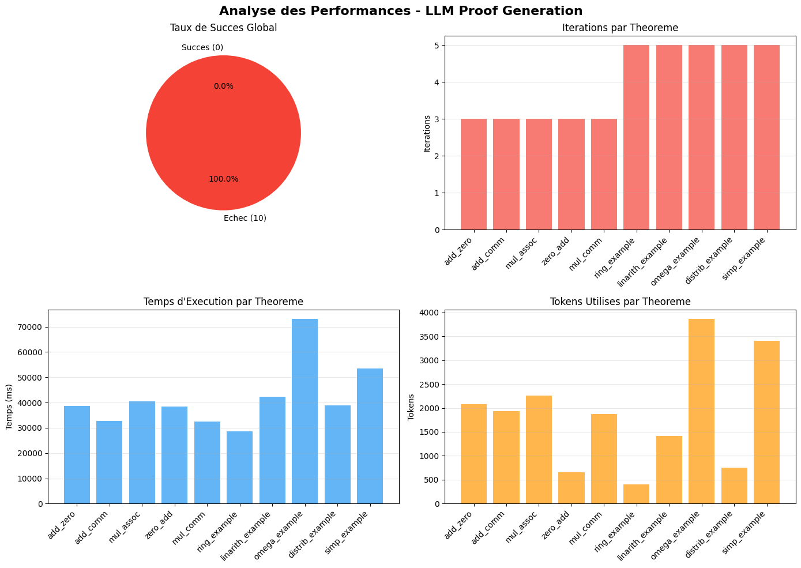
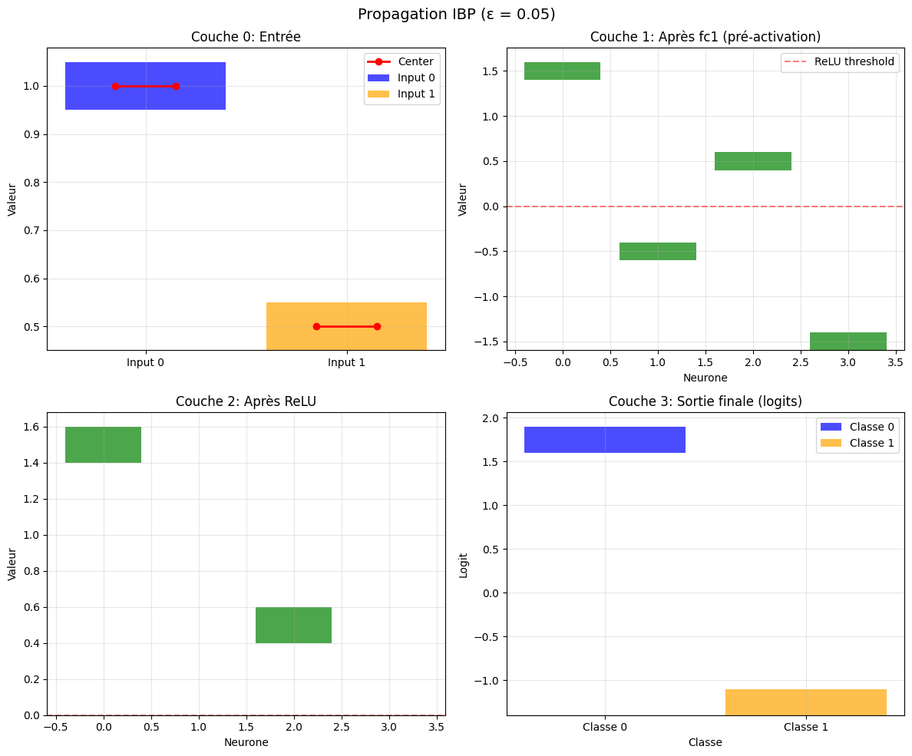
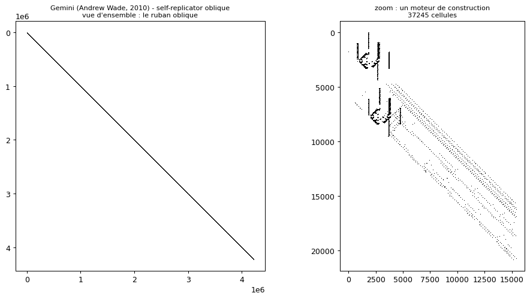
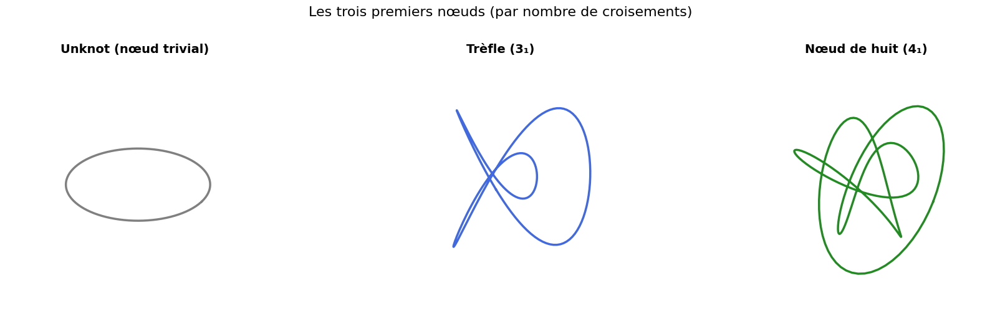
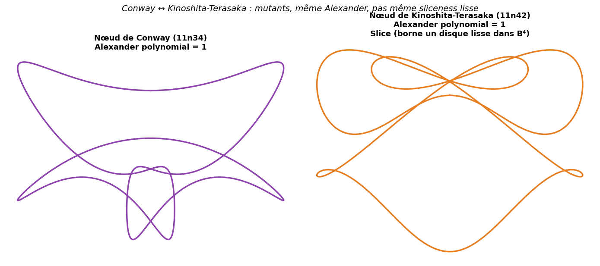
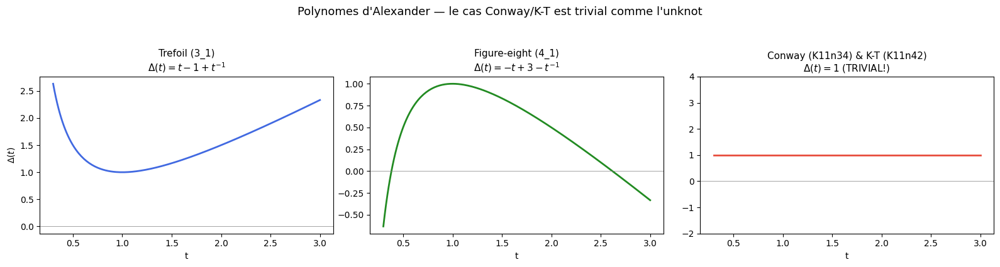

# Lean - Solveur mathématique et Vérification Formelle

<!-- CATALOG-STATUS
series: SymbolicAI-Lean
pedagogical_count: 49
breakdown: Lean=49
maturity: BETA=47, DRAFT=2
-->

[← SemanticWeb](../SemanticWeb/README.md) | [↑ SymbolicAI](../README.md) | [Planners →](../Planners/README.md)

Cette série introduit **Lean 4**, un assistant de preuves et langage de programmation fonctionnel basé sur la théorie des types dépendants. Le fil rouge va des fondations (types dépendants, mode tactique, Mathlib) vers l'état de l'art : assistance aux preuves par LLM et vérification formelle de réseaux de neurones, ports de théorèmes phares (théorème de Kochen-Specker / 18 vecteurs Cabello ; théorème du libre arbitre de Conway-Kochen ; finitude des dérivées symboliques de Brzozowski), théorie des nœuds (mouvements de Reidemeister, tricolorabilité de Fox, noeud de Conway et preuve de Piccirillo), hommages aux mathématiciens (Grothendieck et le langage grothendieckien dans Mathlib 4 ; John Conway, l'homme et l'oeuvre), et théorie de la décision (cohérence de de Finetti : le Dutch book comme témoin d'une incohérence).

## Aperçu — Lean en images

Six visualisations extraites des notebooks illustrent l'arc de la série : de l'assistance aux preuves par LLM et la vérification formelle de réseaux de neurones jusqu'aux automates de Conway (Game of Life) et à la théorie des nœuds (nœuds simples, couple de mutants Conway/Kinoshita-Terasaka, invariant d'Alexander). Provenance détaillée : [`MANIFEST.md`](assets/readme/MANIFEST.md).

### Assistance aux preuves et vérification formelle

L'état de l'art de la série : un LLM génère des preuves Lean, dont on mesure la performance sur un banc de théorèmes ([Lean-7b](Lean-7b-Examples.ipynb)), puis TorchLean propage intervalles (IBP) et bornes (CROWN) pour certifier formellement la robustesse d'un réseau de neurones ([Lean-11b](Lean-11b-TorchLean-Python.ipynb)).

<p align="center">
  <a href="Lean-7b-Examples.ipynb"></a>
</p>

<p align="center">
  <a href="Lean-11b-TorchLean-Python.ipynb"></a>
</p>

### Conway — Game of Life

L'hommage à John Conway passe par le Game of Life comme modèle de calcul ([Lean-16b](Lean-16b-Conway-Game-of-Life-Lean.ipynb)), où Lean sert de certificat pour les structures et leurs périodes.

<p align="center">
  <a href="Lean-16b-Conway-Game-of-Life-Lean.ipynb"></a>
</p>

### Théorie des nœuds

La série dédiée (companion `knot_lean`, Epic #2874) développe trois vues complémentaires : les nœuds les plus simples classés par nombre de croisements ([Lean-17a](Lean-17-Knots-a-Conway-and-Proofs.ipynb)), le couple de mutants Conway (11n34) / Kinoshita-Terasaka (11n42) dont Lisa Piccirillo prouva que seul le second borne un disque lisse (slice), puis le polynôme d'Alexander — trivial (= 1) pour ce couple, et donc incapable à lui seul de distinguer leur sliceness ([Lean-17b](Lean-17b-Knots-Invariants-Companion.ipynb)).

<p align="center">
  <a href="Lean-17-Knots-a-Conway-and-Proofs.ipynb"></a>
</p>

<p align="center">
  <a href="Lean-17-Knots-a-Conway-and-Proofs.ipynb"></a>
</p>

<p align="center">
  <a href="Lean-17b-Knots-Invariants-Companion.ipynb"></a>
</p>

## Navigation

Tous les notebooks incluent une **barre de navigation** en haut et en bas permettant de passer facilement d'un notebook à l'autre. Chaque notebook contient également un **Plan** avec des liens ancres vers chaque section.

## Modes d'exécution suggérés

| Mode | Notebooks | Temps | Description |
|------|-----------|-------|-------------|
| **Fondations** | 1-5 | ~3h | Base théorique complète (types, logique, tactiques) |
| **Avec Mathlib** | 1-6 | ~3h45 | Ajoute les tactiques Mathlib |
| **Intégration IA** | 1-7, 7b | ~5h | Ajoute LLMs, exemples et benchmarks |
| **Complet** | 1-12 | ~11h | Toutes les fonctionnalités incluant LeanDojo et théorème de sensibilité |
| **Avec Pilier 1.B** | 1-12, 13 | ~12h | Inclut le port Kochen-Specker (Cabello 18-vecteurs) - contextuality quantique |
| **Avec hommages** | 1-12, 13, 15, 16a, 16b, 16c, 16d, 16e, 16f, 16g, 16h, 16i, 16j | ~20h10 | Ajoute Lean-15 (Grothendieck), Lean-16a (Conway, l'homme et l'oeuvre), Lean-16b (Conway, Game of Life), Lean-16d (Conway, Game of Life sur kernel Lean natif), Lean-16e (Conway, FRACTRAN sur kernel Lean natif), Lean-16f (Conway, théorème du libre arbitre - adossé à Lean-13), Lean-16g (Conway, canons - le barreau 2 de l'échelle des témoins Life), Lean-16h (tournée des motifs sur kernel natif), Lean-16i (translateur minuscule, Loi II) et Lean-16j (correction Hashlife sur kernel natif) |
| **Avec théorie des nœuds** | 1-12, 13, 15, 16a-c, 16f, 17a, 17b | ~17h30 | Ajoute Lean-17a (Conway, les nœuds et la preuve de Piccirillo) et Lean-17b (invariants : PD-codes, tricolorabilité de Fox, mouvements de Reidemeister) - companion `knot_lean`, Epic #2874 |

## Structure

### Partie 1 : Fondations (basé sur PDF de référence)

| # | Notebook | Contenu | Durée |
|---|----------|---------|-------|
| 1 | [Lean-1-Setup](Lean-1-Setup.ipynb) | Installation elan, kernel Jupyter, vérification | 15 min |
| 2 | [Lean-2-Dependent-Types](Lean-2-Dependent-Types.ipynb) | Calcul des Constructions, types, polymorphisme, déclarer ses propres types (`inductive`, `structure`, `deriving`) | 40 min |
| 3 | [Lean-3-Propositions-Proofs](Lean-3-Propositions-Proofs.ipynb) | Prop, connecteurs, Curry-Howard, preuves par termes | 45 min |
| 4 | [Lean-4-Quantifiers](Lean-4-Quantifiers.ipynb) | forall, exists, égalité, arithmétique Nat | 40 min |
| 5 | [Lean-5-Tactics](Lean-5-Tactics.ipynb) | Mode tactique, apply/exact/intro/rw/simp | 50 min |

### Partie 2 : État de l'art et intégration IA

| # | Notebook | Contenu | Durée |
|---|----------|---------|-------|
| 6 | [Lean-6-Mathlib-Essentials](Lean-6-Mathlib-Essentials.ipynb) | Mathlib4, tactiques ring/linarith/omega, recherche | 45 min |
| 7 | [Lean-7-LLM-Intégration](Lean-7-LLM-Integration.ipynb) | LeanCopilot, AlphaProof, patterns LLM-Lean | 50 min |
| 7b | [Lean-7b-Examples](Lean-7b-Examples.ipynb) | Exemples progressifs, benchmarks, cas pratiques | 40 min |
| 8 | [Lean-8-Agentic-Proving](Lean-8-Agentic-Proving.ipynb) | Agents autonomes, APOLLO, problèmes Erdos | 55 min |
| 9 | [Lean-9-SK-Multi-Agents](Lean-9-SK-Multi-Agents.ipynb) | Agent Framework (Microsoft), orchestration multi-agents | 45 min |
| 10 | [Lean-10-LeanDojo](Lean-10-LeanDojo.ipynb) | LeanDojo: tracing, theorems, Dojo interactif | 45 min |
| 11 | [Lean-11-TorchLean](Lean-11-TorchLean.ipynb) | TorchLean: réseaux de neurones vérifiés, IBP, CROWN | 1h30-2h |
| 11b | [Lean-11b-TorchLean-Python](Lean-11b-TorchLean-Python.ipynb) | Implémentation Python des algorithmes de vérification (IBP, CROWN) | 1h30-2h |
| 12 | [Lean-12-Sensitivity-Theorem](Lean-12-Sensitivity-Theorem.ipynb) | théorème de sensibilité (Huang 2019), hypercube, signing matrix, port Lean 4 | 60 min |
| 12b | [Lean-12b-Lean-Sensitivity-Theorem](Lean-12b-Lean-Sensitivity-Theorem.ipynb) | Companion **natif** (kernel Lean) : preuve formelle 0-sorry de Huang dans le lake `sensitivity_lean`, `#check` + `#print axioms` rendus in-kernel (UNLOCK c.127, jonction Mathlib #2611) | 45 min |

### Partie 3 : théorèmes phares (ports complets)

| # | Notebook | Contenu | Durée |
|---|----------|---------|-------|
| 13 | [Lean-13-Kochen-Specker](Lean-13-Kochen-Specker.ipynb) | théorème de Kochen-Specker (1967), preuve Cabello 18 vecteurs, parité, contextuality quantique - Pilier 1.B Epic #1651 | 60 min |
| 14 | [Lean-14-Finiteness-Derivatives](Lean-14-Finiteness-Derivatives.ipynb) | Dérivées symboliques de Brzozowski : la finitude des dérivées qui garantit le matching linéaire (langages rationnels, automates) | 25 min |
| 14b | [Lean-14b-Finiteness-Lean-Companion](Lean-14b-Finiteness-Lean-Companion.ipynb) | Companion **natif** (kernel Lean) : les 7 déclarations du lake `finiteness_lean` (`Regex`, `nullable`, `deriv`, `derivWord`, `accepts`, `aStar`, `abWord`) re-déclarées fidèlement (kernel sans oleans), vérifiées et exécutées in-kernel, finitude observée sur une regex à union (6 préfixes → 4 dérivées distinctes) | 20 min |

### Partie 4 : Hommages mathématiciens

| # | Notebook | Contenu | Durée |
|---|----------|---------|-------|
| 15 | [Lean-15-Grothendieck-Tribute](Lean-15-Grothendieck-Tribute.ipynb) | Langage grothendieckien dans Mathlib 4 : catégories/foncteurs, cribles et topologies de Grothendieck, faisceaux, schémas, site de Zariski, morphismes étales/lisses - Epic #1646 | 45 min |
| 15b | [Lean-15b-Lean-Grothendieck](Lean-15b-Lean-Grothendieck.ipynb) | Atelier pratique Grothendieck : cribles, topologies et faisceaux en exercices (compagnon `grothendieck_lean`, fait suite à Lean-15) - Epic #1646 | 50 min |
| 15c | [Lean-15c-Lean-Grothendieck-Companion](Lean-15c-Lean-Grothendieck-Companion.ipynb) | Companion formel natif du lake `grothendieck_lean` en kernel `lean4-wsl` : les 51 modules visités par leurs énoncés qui compilent (Yoneda, forme flèche Covers*, faisceautisation, Čech, Mayer-Vietoris, Zariski), 0 sorry attesté par `#print axioms` - Epic #11703 | 40 min |
| 16a | [Lean-16a-Conway-Man-and-Work](Lean-16a-Conway-Man-and-Work.ipynb) | Conway, l'homme et l'oeuvre : biographie et style singulier (le jeu comme méthode) ; panorama des grands résultats (nombres surréels, groupes de Conway & Monstrous Moonshine, réseau de Leech, polynôme de Conway, Doomsday, Look-and-Say, FRACTRAN, problème de l'Ange, Sprouts, théorème du libre arbitre) ; premières noix crackées exécutées depuis conway_lean (Doomsday, Look-and-Say, Nim, Angel, Life - 0 sorry) - Epic #1647 / #2154 | 50 min |
| 16b | [Lean-16b-Conway-Game-of-Life-Lean](Lean-16b-Conway-Game-of-Life-Lean.ipynb) | Hommage à John Conway : Game of Life as Computation, Doomsday, FRACTRAN, Look-and-Say, Nim, Angel - Epic #1647 | 60 min |
| 16c | [Lean-16c-Conway-Game-of-Life-Golly](Lean-16c-Conway-Game-of-Life-Golly.ipynb) | Game of Life : les 3 piliers en images (compagnon Golly, intégration CLI `bgolly` pour simulation certifiée) - Epic #1647 | 45 min |
| 16d | [Lean-16d-Conway-Game-of-Life-Lean-Native](Lean-16d-Conway-Game-of-Life-Lean-Native.ipynb) | Game of Life sur **kernel Lean natif** (`lean4-wsl`) : grille, règle B3/S23, moteur `step`/`evolve`, motifs (bloc, clignoteur, planeur) et faits certifiés par `decide`/`native_decide`, sans axiome `sorry` - Epic #1647 / #3294 | 40 min |
| 16e | [Lean-16e-Conway-FRACTRAN-Lean-Native](Lean-16e-Conway-FRACTRAN-Lean-Native.ipynb) | FRACTRAN sur **kernel Lean natif** (`lean4-wsl`) : type `Frac` (preuve `den > 0`), moteur `fracMulNat`/`fractranStep`/`fractranRun`, programmes (doubler, diviser) et le générateur de nombres premiers de Conway (14 fractions), faits certifiés par `decide` sans axiome `sorry` - Epic #1647 / #3294 | 40 min |
| 16f | [Lean-16f-Conway-Free-Will-Theorem](Lean-16f-Conway-Free-Will-Theorem.ipynb) | théorème du libre arbitre (Conway-Kochen) : les trois axiomes SPIN/TWIN/MIN en profondeur, argument en deux temps (1 particule via Kochen-Specker, puis 2 particules via TWIN), ce que le théorème dit et NE dit PAS, port formel adossé à `FreeWillTheorem.lean` (chaîne de réduction `free_will_theorem -> fwt_single_particle -> kochen_specker`, 0 sorry), registre d'extensibilité - Epic #2162 / #2156 | 40 min |
| 16g | [Lean-16g-Conway-Canons](Lean-16g-Conway-Canons.ipynb) | Barreau 2 de l'échelle des témoins Life (#12223, chantier #12205) : la source périodique (canon de Gosper) — reconnaître (période 30, transitoire 0, cadence d'émission 30 mesurées), générer (recherche bornée 3 000 soupes, zéro calibré par contrôle positif), certifier (prédicat `core (evolve 30 gosper_gun) = core gosper_gun` évalué `#eval` sur horizons 30/60/90 depuis le lake), barreaux 3-4 nommés hors d'atteinte | 45 min |
| 16h | [Lean-16h-Conway-PatternTour-Native](Lean-16h-Conway-PatternTour-Native.ipynb) | La tournée des motifs du Jeu de la Vie en compagnon formel **natif** (kernel `lean4-wsl`) : les théorèmes de `Conway.Life.PatternTour` importés et exécutés in-kernel (still lifes, oscillateurs, vaisseaux — égalités `Bool` réduites par le noyau, `#print axioms` en transparence) - Epic #11703 | 40 min |
| 16i | [Lean-16i-Translateur-Life](Lean-16i-Translateur-Life.ipynb) | Synthèse d'un translateur minuscule : franchir la Loi II (recoordonner, passer du vérificateur au constructeur) — énumération SAT sur grille bornée du motif T (vitesse (2,-2), période 8), sérialisation JSON vers Lean - Grain B1 du Chantier 2 #12205 | 40 min |
| 16j | [Lean-16j-Conway-Hashlife-Correctness-Native](Lean-16j-Conway-Hashlife-Correctness-Native.ipynb) | Compagnon formel **natif** (kernel `lean4-wsl`) des modules de correction Hashlife de `conway_lean` : cône de lumière (`chebDist`, `lightCone_subset_of_le`), MacroCell (niveaux, `emptyOfLevel`), les 4 murs NE/NW/SW/SE (`p4_*_membership_arm`), théorème de marge (`hashlife_correct_margin` + contre-exemples `cexBlock1`), `GridCanonical`, batterie adverse, `DecideProbe`, `Novelty` — imports exécutés in-kernel, transparence axiomatique `#print axioms` - Epic #11703 | 45 min |

### Partie 5 : Théorie des noeuds

| # | Notebook | Contenu | Durée |
|---|----------|---------|-------|
| 17a | [Lean-17-Knots-a-Conway-and-Proofs](Lean-17-Knots-a-Conway-and-Proofs.ipynb) | Conway, les nœuds et la preuve de Piccirillo : le noeud de Conway (11n34), slice-genre et nombre de dénouement, contexte de la preuve (Piccirillo 2020, le noeud de Conway n'est pas slice) - hommage narratif, Epic #2874 | 40 min |
| 17b | [Lean-17b-Knots-Invariants-Companion](Lean-17b-Knots-Invariants-Companion.ipynb) | Invariants de nœuds : PD-codes, mouvements de Reidemeister, tricolorabilité de Fox, diagrammes bien formés - companion `knot_lean` (Epic #2874, transfer forward #3000 sorry-free + backward #3124 partiel) | 60 min |
| 17c | [Lean-17c-Knots-Companion-Formel](Lean-17c-Knots-Companion-Formel.ipynb) | Companion formel du lake `knot_lean` en kernel python3 (kernel lean4-wsl gelé #11874) : les modules que Lean-17 ne cite pas (Basic, Invariant, Reidemeister) interrogés par leurs déclarations réelles, murs nommés R2/R3, sorries réels (14) vs prose, miroir i18n byte-identique attesté par l'instrument canonique - Epic #2874 / #11703 | 40 min |

### Partie 6 : Recherche pondérée et optimalité (A*)

| # | Notebook | Contenu | Durée |
|---|----------|---------|-------|
| 18 | [Search-03e-AStar-Optimality](../../Search/Part1-Foundations/Search-03e-AStar-Optimality.ipynb) | Optimalité de A* sous heuristique admissible : graphe pondéré ℝ≥0 et coût additif `pathCost`, prédicats `Admissible`/`Consistent`, théorème phare `admissible_implies_optimal` (borne en f), téléscopage `consistent_implies_path_bound` + monotonie de f - companion `search_lean` (lake `Search/`, 0 sorry, registre #3801 prong B) | 35 min |

### Partie 7 : Digestions de résultats profonds et companions (Sendov, Tao, PFR, MIMO, Galois, ERC-20, calibration, décision, Hopf S⁶)

| # | Notebook | Contenu | Durée |
|---|----------|---------|-------|
| 19 | [Lean-19-Sendov-Complex-Analysis](Lean-19-Sendov-Complex-Analysis.ipynb) | La conjecture de Sendov (preuve L. Mazur 2026, digestion et formalisation T. Tao) : pour un polynôme dont tous les zéros sont dans le disque unité, chaque zéro a un point critique à distance ≤ 1 — énoncé, illustrations numériques des cas, contexte de la preuve | 45 min |
| 20 | [Lean-20-Analysis-I-Tao-Workflow](Lean-20-Analysis-I-Tao-Workflow.ipynb) | Le manuel *Analysis I* de T. Tao en lac Lean 4 (`teorth/analysis`) : architecture du lac, philosophie d'auto-contenance vs Mathlib, cinq lemmes emblématiques parmi 44k LOC, méta-récit single-agent vs cluster distribué | 40 min |
| 21 | [Lean-21-PFR-Entropy-Method](Lean-21-PFR-Entropy-Method.ipynb) | La conjecture PFR (polynomial Freiman–Ruzsa, ZMod 2) : méthode entropique de la preuve `teorth/pfr` — énoncé combinatoire, illustrations cosets dans F₂³, `#check` réels et axiomes du lac compilé | 45 min |
| 21b | [Lean-21b-PFR-Primitives-Transportables](Lean-21b-PFR-Primitives-Transportables.ipynb) | Trois primitives de PFR, et l'endroit exact où elles cessent de valoir — companion de digestion de Lean-21 : ce qui se transporte hors du cadre d'origine (#12214) | 30 min |
| 22 | [Lean-22-MIMO-Detection-Flips](Lean-22-MIMO-Detection-Flips.ipynb) | Détection MIMO par flips de coordonnées (Papailiopoulos 2026) : le seuil 2·log N — descente simulée et comptage de flips, probabilité d'échappement du bruit (Monte-Carlo vs `e^{−np}`), `#check` réels des quatre phases et du converse complet `ml_error_prob_ge_threshold` (P(erreur ML) ≥ 1 − e^{−(2·log N − log log N)}) du companion `mimo_lean` (sorry-free, lake externe SLT pour Hanson–Wright) | 45 min |
| 22b | [Lean-22b-MIMO-Converse-Native](Lean-22b-MIMO-Converse-Native.ipynb) | Compagnon **natif** (kernel `lean4-wsl`) du lac `mimo_lean` : le lac importé et exécuté dans un kernel Lean 4 réel — la frontière SLT exhibée par `#check` (ce qui est prouvé vs emprunté à `YuanheZ/lean-stat-learning-theory`), les six déclarations de `NormTails` (concentration de Lipschitz gaussienne), les seize briques du converse Hanson–Wright (dont `hanson_wright_noise` et la queue chi-carré `chisq_norm_concentration`), les treize du pont ML (`Bridge`), `#print axioms` sur les théorèmes clés — uniquement les axiomes standards, zéro `sorry` | 40 min |
| 22c | [Lean-22c-Descente-Budget](Lean-22c-Descente-Budget.ipynb) | Le budget de descente : quand la décroissance borne le nombre de flips — l'analyse qui fonde le seuil 2·log N de la détection MIMO (#12219) | 35 min |
| 23 | [Lean-23-Galois-Probleme-Inverse-M23](Lean-23-Galois-Probleme-Inverse-M23.ipynb) | Le problème inverse de Galois refermé (arXiv:2608.08538, 9 août 2026) : M₂₃ prouvé simple d'ordre 10 200 960 **à l'écran** (`card_M23`/`simple_M23` exécutés, `#print axioms` = liste blanche), design de Witt S(4,7,23) vérifié des deux côtés (253 heptades), polynôme f₁ de degré 23 manipulé pour de vrai (empreinte, irréductibilité, discriminant 383 chiffres, Frobenius mod p) — les deux énoncés distingués : prouvé vs cité | 45 min |
| 24 | [Lean-24-ERC20-Invariant-Companion](Lean-24-ERC20-Invariant-Companion.ipynb) | L'invariant de conservation d'un jeton ERC-20 (`Σ balances = totalSupply`) : traces jouets en Python, lectures statiques des 17 déclarations du lake `erc20_lean`, propreté axiomatique par absence de `sorry`, Monte-Carlo sur la tolérance numérique (#11710) | 40 min |
| 24b | [Lean-24b-Lean-ERC20-Native-Companion](Lean-24b-Lean-ERC20-Native-Companion.ipynb) | Compagnon **natif** (kernel `lean4-wsl`) du lake `erc20_lean` : les 17 déclarations **résolues par le kernel** (`#check`), l'invariant et les transitions `mint`/`burn`/`transfer` **évalués** sur un état concret (`by decide`), `#print axioms` natif sur les 5 théorèmes phares, la pyramide op → trace `Reachable` → invariant type-checkée avec ses gardes (#11721) | 30 min |
| 26 | [Lean-26-Calibration-Native-Companion](Lean-26-Calibration-Native-Companion.ipynb) | Compagnon **natif** (kernel `lean4-wsl`) du lake `calibration_lean` : les cibles de calibration du prouveur multi-agents (Epic #1453, P1-P5) importées et exécutées — chaque définition/théorème interrogé par `#check`/`#eval`/`#print axioms`, sorties du compilateur Lean | 35 min |
| 27 | [Lean-27-Coherence-et-Temoin](Lean-27-Coherence-et-Temoin.ipynb) | Cohérence de de Finetti et témoin (Dutch book) : miroir Python **exact** (`fractions.Fraction`) du lake `decision_theory_lean` — un livret (+1,+1,−1,−1) encaisse l'écart d'inclusion-exclusion uniformément dans les 4 états, balayage borné exhaustif (390 625 combinaisons) qui certifie l'absence de livre sur le système réparé, stabilité affine vNM mesurée (0 divergence pour 3u+2 contre 124 pour u² sur les 2145 paires de 66 loteries du simplexe) | 40 min |
| 28 | [Lean-28-Munkres-Tribute](Lean-28-Munkres-Tribute.ipynb) | Hommage à James R. Munkres (1930-2026), le cours 18.901 dans Mathlib en kernel **natif** `lean4-wsl`, exécuté sur le lake `mathlib_examples` (environnement d'exécution Mathlib, cf. [`mathlib_examples/`](mathlib_examples/)) : les cinq chapitres du manuel *Topology* — axiomes (`IsOpen`), adhérence/intérieur (`nhds`, dualités §17 ex. 6), continuité (`continuous_def` = Munkres §18.1), T2/compacité, connexité — chaque notion interrogée par `#check`/`example`/`#print axioms` (0 axiome), 3 exercices `sorry` | 30 min |
| 29 | [Lean-29-EdgeColoring-Tutte-Companion](Lean-29-EdgeColoring-Tutte-Companion.ipynb) | Compagnon **natif** (kernel `lean4-wsl`) du notebook [App-22](../../Search/Applications/CSP/App-22-EdgeColoring-Tutte.ipynb) (théorème apex arXiv 2608.22870, #13031) : définitions `IsCubic`/`Edge3Colorable`/`IsApexRelativeTo` posées sur `SimpleGraph` (absentes de Mathlib, vérifié), Petersen = Kneser KG(5,2) via `SimpleGraph.mk'` — 10 sommets, 15 arêtes, cubique prouvés par `decide`, backtracking `#eval` qui certifie l'absence de toute 3-coloration d'arêtes (`0`) avec contrôle positif K4 (`6`), ancrage `SimpleGraph.tutte` | 35 min |
| 30 | [Lean-30-Complex-Structure-S6](Lean-30-Complex-Structure-S6.ipynb) | Le problème de Hopf résolu : une structure complexe intégrable sur S⁶ (énoncé `Mathoverflow1973` de Formal Conjectures) — digestion du fil constructif (triangle (3,4,∞), accouplement de Shioda ⟨P,P⟩=1/6 calculé, transformations logarithmiques 3 et 4, remplissage de Mumford dP₆, reconnaissance Hurewicz→Smale→Kervaire–Milnor) avec deux invariants **calculés** (|π₁| = |4m+3n| par forme normale de Smith, χ = 2), reproduction **réelle** du dépôt piné `plby/HopfProblem` via `hopf_s6_reproduction.py` (248 818 lignes compilées en 1154 s, 0 sorry/0 axiom, comparator double kernel Lean+nanoda : *« Your solution is okay! »*, axiomes [propext, Classical.choice, Quot.sound]) et attribution différenciée (manuscrit écrit par Claude/communiqué par Alpöge, exposition Engel avec caveat, code Lean majoritairement Codex) | 45 min |

**Durée totale** : ~33h30min

## Acquis d'apprentissage

A l'issue de la série, vous saurez :

- **Modéliser** un raisonnement mathématique dans le Calcul des Constructions : types dépendants, univers, propositions comme types (Curry-Howard). Notebooks 2-3 ancrent ces objets sur des exemples concrets (Vector, propositions logiques) plutôt que sur de l'abstraction nue.
- **Prouver** un théorème en mode tactique avec les briques Mathlib : `intro`/`apply`/`exact`/`rfl` pour la structure, `ring`/`linarith`/`omega`/`simp` pour l'arithmétique et la simplification, `induction`/`cases`/`rcases` pour l'analyse de cas. Notebooks 4-6.
- **Intégrer un LLM** au workflow de preuve : patterns LeanCopilot et AlphaProof (n-best, MCTS), prompts goal-aware, comparaison ND-search vs CoT, agents APOLLO/Erdos — fiables surtout sur les preuves courtes, limites persistantes sur les preuves longues et la couverture Mathlib (usage en assistant, pas en oracle). Notebooks 7-9.
- **Tracer et explorer** une base de preuves à grande échelle : LeanDojo (parsing AST, theorem extraction, interaction Dojo), réseaux de neurones vérifiés via IBP/CROWN (TorchLean). Notebooks 10-11.
- **Porter** un théorème de recherche en Lean 4 : théorème de sensibilité (Huang 2019, hypercube et signing matrix), théorème de Kochen-Specker (Cabello 18 vecteurs, argument de parité, contextuality quantique). Notebooks 12, 13.
- **Lire le langage grothendieckien** dans Mathlib 4 : catégories et foncteurs, cribles et topologies de Grothendieck, faisceaux, schémas et sites, morphismes étales/lisses — comme entrée vers la géométrie algébrique formalisée. Notebook 15.
- **Situer l'oeuvre de Conway** dans sa largeur : des nombres surréels au Monstrous Moonshine, du réseau de Leech au théorème du libre arbitre, en exécutant les premières noix formalisées (Doomsday, Look-and-Say, Nim, Angel, Life) directement depuis le projet conway_lean (0 sorry). Notebook 16a.
- **Explorer les noix de Conway** en Lean 4 : Game of Life as Computation, Doomsday, FRACTRAN, Look-and-Say, Nim, Angel — port formel de résultats combinatoires iconiques. Notebooks 16a-16e.
- **Comprendre le théorème du libre arbitre** (Conway-Kochen) : les axiomes SPIN/TWIN/MIN, l'argument en deux temps qui réduit le cas à deux particules au théorème de Kochen-Specker (Notebook 13), et la lecture honnête de sa portée (ce qu'il dit et ne dit pas) — adossé à `FreeWillTheorem.lean` (0 sorry). Notebook 16f.
- **Franchir un barreau de l'échelle vérifier→construire** : reconnaître une source périodique Life (période, transitoire, cadence d'émission mesurées sur le canon de Gosper), chercher à en générer une dans un budget borné (zéro calibré par contrôle positif), et certifier la périodicité du noyau par un prédicat `Grid` évalué sur horizon fini — l'écart structurel entre vérificateur et constructeur. Notebook 16g.
- **Formaliser les invariants de nœuds** : PD-codes, mouvements de Reidemeister et tricolorabilité de Fox, en s'appuyant sur le companion `knot_lean` (transfert de tricolorabilité le long d'un twist R1 connecté, preuve forward sorry-free + backward partielle). Notebooks 17a, 17b.
- **Lire le paysage galoisien moderne** : la preuve formelle que **M₂₃ (groupe sporadique de Mathieu d'ordre 10 200 960) est simple** est *vendored* dans le companion `galois_lean/` (PR #10486, août 2026, Apache-2.0) ; la réalisation galoisienne — *M₂₃ groupe de Galois sur ℚ* — est **prouvée** dans le préprint (Huang–Jackson–Lee–Poonen–Pries–Zhang, arXiv:2608.08538, 9 août 2026 : polynôme explicite f₁ de degré 23, identification `23T5`) mais **non formalisée** — le notebook [Lean-23](Lean-23-Galois-Probleme-Inverse-M23.ipynb) exécute la preuve formelle côté groupe et vérifie f₁ computationnellement, les deux énoncés soigneusement distingués (Epic #10478).
- **Construire le témoin d'une incohérence** : le Dutch book de de Finetti — si les prix violent l'inclusion-exclusion, un livret (+1,+1,−1,−1) encaisse l'écart uniformément dans tous les états (miroir exact du lake `decision_theory_lean`, arithmétique exacte `Fraction`), et un balayage borné certifie l'absence de livre sur le système réparé ; symétriquement, seule la transformation **affine** d'une utilité vNM préserve les préférences (0 divergence) quand le carré en fabrique (124 sur les 2145 paires de 66 loteries). Notebook 27.

Pour l'état formel détaillé des modules support (preuves résolues vs `sorry` résiduels), voir [LEAN_INVENTORY.md](../../GameTheory/LEAN_INVENTORY.md), le [README du projet conway_lean](conway_lean/README.md), et le [README du projet grothendieck_lean](grothendieck_lean/README.md).

## Statut de maturité

| # | Notebook | Cellules | Exercices | Solutions | Statut |
|---|----------|----------|-----------|-----------|--------|
| 1 | Setup | ~17 | - | - | **COMPLET** |
| 2 | Dependent-Types | ~50 | 3 | 3 | **COMPLET** |
| 3 | Propositions-Proofs | ~50 | 3 | 3 | **COMPLET** |
| 4 | Quantifiers | ~46 | 3 | 3 | **COMPLET** |
| 5 | Tactics | ~70 | 3 | 3 | **COMPLET** |
| 6 | Mathlib-Essentials | ~45 | 3 | 3 | **COMPLET** |
| 7 | LLM-Intégration | ~50 | 2 | 2 | **COMPLET** |
| 7b | Examples | ~40 | 3 | 3 | **COMPLET** |
| 8 | Agentic-Proving | ~70 | 2 | 2 | **COMPLET** |
| 9 | SK-Multi-Agents | ~50 | 2 | 2 | **COMPLET** |
| 10 | LeanDojo | ~100 | 2 | 0 | **COMPLET** |
| 11 | TorchLean | ~40 | 3 | Oui | **COMPLET** |
| 11b | TorchLean Python | ~45 | 3 | Oui | **COMPLET** |
| 12 | Sensitivity-Theorem | ~31 | 4 | Non | **NOUVEAU** |
| 12b | Lean-Sensitivity-Theorem (natif) | ~19 | 3 | 0 | **NOUVEAU** (kernel `lean4-wsl`) |
| 13 | Kochen-Specker | ~25 | 1 | 0 | **NOUVEAU** |
| 14 | Finiteness-Derivatives | ~12 | 1 | - | **NOUVEAU** |
| 14b | Finiteness-Lean-Companion | ~19 | 3 | 0 | **NOUVEAU** (kernel `lean4-wsl`) |
| 15 | Grothendieck-Tribute | ~23 | 0 | - | **NOUVEAU** (hommage) |
| 15b | Lean-Grothendieck (atelier) | ~40 | 4 | Oui | **NOUVEAU** |
| 15c | Lean-Grothendieck-Companion | ~25 | 2 | 0 | **NOUVEAU** (kernel `lean4-wsl`) |
| 16a | Conway-Man-and-Work | ~39 | 3 | 0 | **NOUVEAU** (hommage) |
| 16b | Conway-Game-of-Life-Lean | ~26 | 0 | - | **NOUVEAU** (hommage) |
| 16c | Conway-Game-of-Life-Golly | ~47 | 5 | - | **NOUVEAU** (hommage) |
| 16d | Conway-Game-of-Life-Lean-Native | ~32 | 3 | 0 | **NOUVEAU** (hommage, kernel `lean4-wsl`) |
| 16e | Conway-FRACTRAN-Lean-Native | ~22 | 3 | 0 | **NOUVEAU** (hommage, kernel `lean4-wsl`) |
| 16f | Conway-Free-Will-Theorem | ~28 | 3 | 0 | **NOUVEAU** (hommage) |
| 16g | Conway-Canons | ~23 | 3 | - | **NOUVEAU** (barreau 2 #12223) |
| 16h | Conway-PatternTour-Native | ~9 | 3 | 0 | **NOUVEAU** (kernel `lean4-wsl`, Epic #11703) |
| 16i | Translateur-Life | ~4 | 0 | - | **NOUVEAU** (grain B1 #12205) |
| 16j | Conway-Hashlife-Correctness-Native | ~15 | 3 | 0 | **NOUVEAU** (kernel `lean4-wsl`, Epic #11703) |
| 17a | Knots-a-Conway-and-Proofs | ~13 | 0 | - | **NOUVEAU** (hommage) |
| 17b | Knots-b-Invariants-Companion | ~19 | 3 | - | **NOUVEAU** |
| 17c | Knots-Companion-Formel | ~33 | 3 | 0 | **NOUVEAU** (kernel python3) |
| 18 | Search-AStar-Optimality | ~24 | 6 | 0 | **NOUVEAU** |
| 19 | Sendov-Complex-Analysis | ~22 | 3 | 0 | **NOUVEAU** |
| 20 | Analysis-I-Tao-Workflow | ~18 | 3 | 0 | **NOUVEAU** |
| 21 | PFR-Entropy-Method | ~23 | 3 | 0 | **NOUVEAU** |
| 21b | PFR-Primitives-Transportables | ~6 | 0 | - | **NOUVEAU** (digestion #12214) |
| 22 | MIMO-Detection-Flips | ~34 | 6 | 0 | **NOUVEAU** |
| 22b | MIMO-Converse-Native | ~30 | 0 | - | **NOUVEAU** (kernel `lean4-wsl`) |
| 22c | Descente-Budget | ~9 | 8 | 0 | **NOUVEAU** (#12219) |
| 23 | Galois-Probleme-Inverse-M23 | ~25 | 3 | 0 | **NOUVEAU** (exécution Lean + sympy) |
| 24 | ERC20-Invariant-Companion | ~21 | 3 | 0 | **NOUVEAU** (lecture statique Python du lake) |
| 24b | Lean-ERC20-Native-Companion | ~30 | 2 | - | **NOUVEAU** (kernel `lean4-wsl`) |
| 26 | Calibration-Native-Companion | ~27 | 0 | - | **NOUVEAU** (kernel `lean4-wsl`) |
| 27 | Coherence-et-Temoin | ~21 | 3 | 0 | **NOUVEAU** (kernel python3, miroir exact du lake) |
| 28 | Munkres-Tribute | ~9 | 3 | 0 | **NOUVEAU** (hommage, kernel `lean4-wsl`) |

Tous les notebooks incluent :
- Navigation header/footer avec liens vers notebooks précédent/suivant
- Plan de ce Notebook avec liens ancres (notebooks 2-4)
- Tableaux récapitulatifs en fin de section
- Exercices avec solutions complètes

## Quick Start

```bash
# 1. Installer elan (gestionnaire Lean)
curl https://raw.githubusercontent.com/leanprover/elan/master/elan-init.sh -sSf | sh
elan default leanprover/lean4:stable

# 2. vérifier l'installation
lean --version    # Lean 4.x.x
elan show         # toolchain active

# 3. Ouvrir le premier notebook (WSL requis)
wsl -d Ubuntu -- bash -c "jupyter notebook Lean-1-Setup.ipynb"
```

Pour les notebooks 7-10 (LLM), configurer `.env` avec `OPENAI_API_KEY`. Pour le prover daemon, voir section "Prover daemon".

---

## Prerequisites

- Connaissances de basé en logique mathématique
- Familiarité avec la programmation fonctionnelle (utile mais non obligatoire)
- Pour notebooks 7-8 : compte OpenAI/Anthropic pour APIs LLM (optionnel)

## Installation

### 1. Installer elan (gestionnaire de versions Lean)

```bash
# Linux/macOS
curl https://raw.githubusercontent.com/leanprover/elan/master/elan-init.sh -sSf | sh

# Windows (PowerShell)
Invoke-WebRequest -Uri https://raw.githubusercontent.com/leanprover/elan/master/elan-init.ps1 | Invoke-Expression
```

### 2. Installer Lean 4

```bash
elan default leanprover/lean4:stable
```

### 3. Installer le kernel Jupyter (optionnel)

```bash
# Créer un environnement conda
conda create -n lean4-jupyter python=3.10
conda activate lean4-jupyter

# Installer lean4_jupyter
pip install lean4_jupyter

# vérifier l'installation
jupyter kernelspec list
```

### 4. Configuration API pour notebooks LLM (optionnel)

```bash
cd MyIA.AI.Notebooks/SymbolicAI/Lean
cp .env.example .env
# Éditer .env et ajouter OPENAI_API_KEY ou ANTHROPIC_API_KEY
```

## Ressources externes

### Documentation Lean
- [Theorem Proving in Lean 4](https://leanprover.github.io/theorem_proving_in_lean4/)
- [Lean 4 Documentation](https://leanprover.github.io/lean4/doc/)
- [Mathematics in Lean](https://leanprover-community.github.io/mathematics_in_lean/)
- [lean4_jupyter GitHub](https://github.com/utensil/lean4_jupyter)

### Mathlib
- [Mathlib4 Documentation](https://leanprover-community.github.io/mathlib4_docs/)
- [Mathlib4 GitHub](https://github.com/leanprover-community/mathlib4)
- [Loogle - Recherche syntaxique](https://loogle.lean-lang.org/)
- [Moogle - Recherche sémantique](https://www.moogle.ai/)

### LLM et Preuves Automatiques
- [LeanCopilot](https://github.com/lean-dojo/LeanCopilot)
- [LeanDojo](https://leandojo.readthedocs.io/) - ML/LLM theorem proving
- [AlphaProof Paper Analysis](https://www.julian.ac/blog/2025/11/13/alphaproof-paper/)
- [APOLLO System](https://arxiv.org/html/2505.05758v1)
- [Erdos Problems Formalization](https://xenaproject.wordpress.com/2025/12/05/formalization-of-erdos-problems/)

### LeanDojo

- [LeanDojo Documentation](https://leandojo.readthedocs.io/)
- [LeanDojo Paper](https://arxiv.org/abs/2306.15626) (NeurIPS 2023)
- [lean4-example Repository](https://github.com/yangky11/lean4-example)

### TorchLean

- [TorchLean Documentation](https://leandojo.org/torchlean.html)
- [TorchLean GitHub](https://github.com/lean-dojo/TorchLean)
- [Papers: IBP, CROWN, LiRPA](https://github.com/lean-dojo/TorchLean#references)

### Références académiques

| Référence | Couverture |
|-----------|------------|
| de Moura & Ullrich, "The Lean 4 Theorem Prover and Programming Language" (2021) | système Lean 4 |
| The Mathlib Community, "The Mathlib Library" (2020), arXiv:1910.09436 | Mathlib4 |
| Avigad, "Mathematics and Programming" (2024) — *Mathematics in Lean* | Fondations notebooks 1-5 |
| Jiang et al., "LeanDojo: Theorem Proving with Retrieval-Augmented Language Models" (NeurIPS 2023) | LeanDojo, notebooks 10 |
| First et al., "AlphaProof: Formal Math Reasoning" (DeepMind, 2024) | Notebook 7 |
| Song et al., "Towards Counting Forall: Neural Network Vérification via IBP, CROWN, and LiRPA" | TorchLean, notebooks 11 |
| Geanakoplos, "Three Brief Proofs of Arrow's Impossibility Theorem" (2005) | Cross-séries GameTheory |
| Sen, "Collective Choice and Social Welfare" (1970) | Cross-séries GameTheory |

## Document source

- Notebooks 1-5 basés sur : `D:\Dropbox\IA101\TPs\TP - Z3 - Tweety - Lean.pdf` (Section VI)
- Notebooks 6-8 basés sur : Recherches état de l'art 2025-2026

## Validation

```bash
# vérifier la structure des notebooks
python scripts/verify_notebooks.py MyIA.AI.Notebooks/SymbolicAI/Lean --quick

# vérifier l'installation Lean
lean --version
elan show
```

## Percées récentes (2024-2026)

| système | Accomplissement |
|---------|-----------------|
| **AlphaProof** (DeepMind) | Médaille d'argent IMO 2024 |
| **Harmonic Aristotle** | Résolution Erdos #124 variant (~30 ans ouvert) en 6h |
| **DeepSeek-Prover** | Résolution de problèmes Erdos 379, 987, 730, 198 |
| **Mathlib4** v4.31.0-rc1 | 4M+ lignes, utilisé par Terry Tao |

## Notes techniques

- **Lean 4** (pas Lean 3) - syntaxe moderne
- Preuves constructives + logique classique (via `open Classical`)
- Progression : termes -> tactiques -> Mathlib -> LLMs -> agents
- Kernel Jupyter : lean4_jupyter (recommandé)

## Structure des fichiers

```
Lean/
├── Lean-1-Setup.ipynb              # Python kernel - diagnostics
├── Lean-2-Dependent-Types.ipynb    # Lean4 kernel
├── Lean-3-Propositions-Proofs.ipynb
├── Lean-4-Quantifiers.ipynb
├── Lean-5-Tactics.ipynb
├── Lean-6-Mathlib-Essentials.ipynb
├── Lean-7-LLM-Integration.ipynb    # Python kernel - APIs LLM
├── Lean-7b-Examples.ipynb          # Python kernel - benchmarks
├── Lean-8-Agentic-Proving.ipynb    # Python kernel - orchestration
├── Lean-9-SK-Multi-Agents.ipynb    # Python kernel - Agent Framework
├── Lean-10-LeanDojo.ipynb          # Python kernel - LeanDojo
├── Lean-11-TorchLean.ipynb         # Lean4 kernel - NN verification
├── Lean-11b-TorchLean-Python.ipynb  # Python kernel - Implémentation algorithmes
├── Lean-12-Sensitivity-Theorem.ipynb # Python kernel - théorème de sensibilité (Huang 2019, hypercube, signing matrix)
├── Lean-15-Grothendieck-Tribute.ipynb # Python kernel - hommage Grothendieck (langage grothendieckien Mathlib)
├── Lean-15b-Lean-Grothendieck.ipynb # Python kernel - atelier pratique Grothendieck (compagnon grothendieck_lean)
├── Lean-15c-Lean-Grothendieck-Companion.ipynb # Lean4 (WSL) kernel - companion formel natif grothendieck_lean (51 modules par leurs énoncés, Epic #11703)
├── Lean-16a-Conway-Man-and-Work.ipynb # Python kernel - hommage Conway (l'homme et l'œuvre, noix exécutées depuis conway_lean)
├── Lean-16b-Conway-Game-of-Life-Lean.ipynb   # Python kernel - hommage Conway (Game of Life as Computation)
├── Lean-16c-Conway-Game-of-Life-Golly.ipynb  # Python kernel - hommage Conway (Game of Life en images, compagnon Golly)
├── Lean-16d-Conway-Game-of-Life-Lean-Native.ipynb  # Lean4 (WSL) kernel - Game of Life natif (grille, B3/S23, decide/native_decide, 0 sorry)
├── Lean-16e-Conway-FRACTRAN-Lean-Native.ipynb      # Lean4 (WSL) kernel - FRACTRAN natif (machine universelle de Conway, générateur de premiers)
├── Lean-16g-Conway-Canons.ipynb                    # Python kernel - barreau 2 de l'échelle des témoins : source périodique (canon de Gosper) mesurée, cherchée, certifiée #eval (#12223)
├── Lean-16h-Conway-PatternTour-Native.ipynb        # Lean4 (WSL) kernel - tournée des motifs : PatternTour.lean importé et exécuté in-kernel (Epic #11703)
├── Lean-16i-Translateur-Life.ipynb                 # Python kernel - synthèse d'un translateur minuscule (SAT borné, Loi II, Chantier 2 #12205)
├── Lean-16j-Conway-Hashlife-Correctness-Native.ipynb # Lean4 (WSL) kernel - compagnon Hashlife correctness (cône, MacroCell, 4 murs, marge, batterie adverse, Epic #11703)
├── Lean-13-Kochen-Specker.ipynb    # Lean4 kernel - théorème de Kochen-Specker (Pilier 1.B)
├── Lean-14-Finiteness-Derivatives.ipynb # Python kernel - dérivées symboliques de Brzozowski (finitude, matching linéaire)
├── Lean-14b-Finiteness-Lean-Companion.ipynb # Lean kernel - companion natif du lake finiteness_lean (7 déclarations citées)
├── Lean-16f-Conway-Free-Will-Theorem.ipynb # Python kernel - hommage Conway (théorème du libre arbitre, adossé à FreeWillTheorem.lean)
├── Lean-17-Knots-a-Conway-and-Proofs.ipynb # Python kernel - Conway, les nœuds et la preuve de Piccirillo (noeud de Conway)
├── Lean-17b-Knots-Invariants-Companion.ipynb # Python kernel - invariants de nœuds (PD-codes, Reidemeister, Fox tricolorability), compagnon knot_lean
├── Lean-17c-Knots-Companion-Formel.ipynb # Python kernel - companion formel knot_lean (modules non cités par 17b, murs R2/R3, miroir i18n)
├── Search-03e-AStar-Optimality.ipynb # Python kernel - optimalité de A* sous heuristique admissible (companion search_lean, 0 sorry)
├── Lean-19-Sendov-Complex-Analysis.ipynb # Python kernel - conjecture de Sendov (preuve Mazur 2026, digestion et formalisation Tao)
├── Lean-20-Analysis-I-Tao-Workflow.ipynb # Python kernel - le lac Analysis I de Tao (architecture, 5 lemmes emblématiques)
├── Lean-21-PFR-Entropy-Method.ipynb # Python kernel - conjecture PFR (méthode entropique, #check réels du lac compilé)
├── Lean-21b-PFR-Primitives-Transportables.ipynb # Python kernel - trois primitives de PFR et leurs limites de transport (#12214)
├── Lean-22-MIMO-Detection-Flips.ipynb # Python kernel - détection MIMO par flips (seuil 2·log N, companion mimo_lean)
├── Lean-22b-MIMO-Converse-Native.ipynb # Lean4 (WSL) kernel - converse MIMO natif (NormTails, Hanson-Wright, #print axioms)
├── Lean-22c-Descente-Budget.ipynb # Python kernel - budget de descente (décroissance borne les flips, #12219)
├── Lean-23-Galois-Probleme-Inverse-M23.ipynb # Python kernel - problème inverse de Galois (M₂₃ simple prouvé, f₁ degré 23 vérifié)
├── Lean-24-ERC20-Invariant-Companion.ipynb # Python kernel - invariant ERC-20 (lecture statique du lake erc20_lean, Monte-Carlo)
├── Lean-24b-Lean-ERC20-Native-Companion.ipynb # Lean4 (WSL) kernel - ERC-20 natif (17 déclarations résolues par le kernel)
├── Lean-26-Calibration-Native-Companion.ipynb # Lean4 (WSL) kernel - calibration_lean natif (cibles prover P1-P5, #print axioms)
├── Lean-27-Coherence-et-Temoin.ipynb # Python kernel - cohérence de de Finetti (Dutch book, miroir exact de decision_theory_lean)
├── Lean-28-Munkres-Tribute.ipynb # Lean4 (WSL) kernel - hommage Munkres, cours 18.901 dans Mathlib (mathlib_examples, #check/#print axioms natifs)
├── Lean-29-EdgeColoring-Tutte-Companion.ipynb # Lean4 (WSL) kernel - coloration d'arêtes & Tutte (définitions SimpleGraph, Petersen exécutable, decide/eval)
├── Lean-30-Complex-Structure-S6.ipynb # Python kernel - problème de Hopf sur S⁶ (digestion Engel + reproduction plby/HopfProblem piné, comparator double kernel)
├── _run_lean_snippet.sh            # Helper WSL : run Lean snippet avec cache Mathlib
├── lean_runner.py                  # Module Python multi-backend
├── README.md
├── .env.example
├── sensitivity_lean/               # Théorème de sensibilité (Huang 2019, companion Lean-12/12b) - 0 sorry 0 axiome, Lake build natif (jonction Mathlib)
├── finiteness_lean/                # Finitude des dérivées de Brzozowski (companion Lean-14) - 0 sorry, Lake build
├── conway_lean/                    # Conway tribute workspace (0 sorry, Lake build)
├── grothendieck_lean/              # Grothendieck tribute workspace (0 sorry, Lake build)
├── knot_lean/                      # Knot theory workspace (théorie des nœuds, companion Lean-17a/b, sorries résiduels documentés, Lake build)
├── calibration_lean/               # Cibles de calibration du prouveur multi-agents (Epic #1453, P1-P5) - 0 sorry, Lake build
├── galois_lean/                    # Problème inverse de Galois : M₂₃ (Mathieu 23) groupe simple + preuve formelle vendored (Apache-2.0, [KitaKen1/finite-simple-groups-lean](https://github.com/KitaKen1/finite-simple-groups-lean)) - 0 sorry, Lake build ; companion du notebook Lean-23 (Epic #10478, arXiv:2608.08538, août 2026)
├── mathlib_examples/               # Smoke test Mathlib (ring/linarith/omega/rw, 4 buts) - 0 sorry, Lake build
├── agent_tests/                    # Prover daemon (autonomous Lean proof)
│   ├── multi_agent_proof.py        # CLI principal
│   ├── lean_server.py              # Serveur Lean LSP
│   └── prover/                     # Package prover (Microsoft Agent Framework)
│       ├── __init__.py             # Exports: MultiAgentSorryProver, AutonomousProver
│       ├── provers.py              # Multi-agent + Autonomous prover classes
│       ├── workflow.py             # WorkflowBuilder graph (4 agents)
│       ├── agents.py               # Agent factory (Search/Tactic/Critic/Coordinator)
│       ├── tools.py                # Per-agent tools (file ops, compile, tactics)
│       ├── state.py                # ProofState, SorryContext
│       ├── config.py               # Providers (z.ai GLM-5.1, local Qwen), demos
│       ├── instructions.py         # Agent system prompts
│       ├── lean_utils.py           # Sorry extraction, goal state, verification
│       ├── trace.py                # Conversation trace logger
│       └── vérifier.py             # Lean verification backend
├── examples/
│   ├── basic_logic.lean
│   ├── quantifiers.lean
│   ├── tactics_demo.lean
│   ├── mathlib_examples.lean
│   └── llm_assisted_proof.lean
└── tests/
    ├── test_leandojo_basic.py      # Tests rapides (sans tracing)
    ├── test_leandojo_repos.py      # Tests complets sur repos
    └── test_wsl_lean4_jupyter.py   # Tests backend WSL
```

## Prover daemon

Le package `agent_tests/prover/` implémente un prouveur autonome Lean 4 utilisant le Microsoft Agent Framework.

### Architecture

4 agents spécialisés dans un workflow conditionnel :

1. **SearchAgent** : analyse le contexte, détecte les sorry, identifie les helpers
2. **TacticAgent** : génère des tactiques de preuve (avec outils de compilation)
3. **VerifyExecutor** : vérifie les tactiques via `lake build` (non-LLM)
4. **CriticAgent** : analyse les erreurs et route vers le bon agent

### Usage

```bash
# Prouver un sorry dans un fichier .lean
python agent_tests/multi_agent_proof.py --lean path/to/File.lean --sorry-line 128

# Mode autonome (1 agent avec tous les outils)
python agent_tests/multi_agent_proof.py --lean path/to/File.lean --mode autonomous

# Mode multi-agent (4 agents spécialisés)
python agent_tests/multi_agent_proof.py --lean path/to/File.lean --mode multi

# Batch sur des demos
python agent_tests/multi_agent_proof.py --batch --demos 1,2,3
```

### Configuration

Le fichier `.env` dans `agent_tests/` ou le répertoire parent configure :
- `ZAI_API_KEY` : clé API z.ai pour GLM-5.1 (raisonnement)
- `ZAI_BASE_URL` : endpoint API z.ai
- `LEAN_PROJECT_DIR` : répertoire du projet Lean (pour `lake build`)

## Connections cross-séries

Les concepts de vérification formelle et de preuve assistée par LLM présentés dans cette série se retrouvent dans d'autres séries du curriculum :

### Lean et Théorie des Jeux (GameTheory)

Les notebooks GameTheory side tracks (16b-16f) formalisent en Lean 4 des résultats fondamentaux de théorie des jeux et de choix social :

| résultat | Fichier Lean | Notebook GameTheory | Statut |
|----------|-------------|---------------------|--------|
| théorème d'Arrow (impossibilité) | `game_theory_lean/SocialChoice/Arrow.lean` | 16d | 0 sorry (Geanakoplos 2005) |
| théorème de Sen (libéralisme) | `game_theory_lean/SocialChoice/Sen.lean` | 16e | 0 sorry (bidirectionnel) |
| Valeur de Shapley | `game_theory_lean/CooperativeGames/Shapley.lean` | 16b | 0 sorry (caractérisation + unicité ; Banzhaf #4011/#4037/#4130 ; lake `cooperative_games_lean/` supprimé post-#4365, contenu absorbé) |
| Modèles de vote (Banks, STV) | `game_theory_lean/SocialChoice/Voting.lean` | 16f | 0 sorry |
| Gale-Shapley (stable marriage) | `game_theory_lean/StableMarriage/GaleShapley.lean` | (pas de notebook dédié) | 0 sorry. `gale_shapley_stable`, `gale_shapley_man_optimal` (via `exists_isManOptimal`, `Lattice.lean`) et `gale_shapley_woman_pessimal` prouvés. |

Le notebook Lean-5 (tactiques) et Lean-6 (Mathlib) sont des prérequis directs pour les side tracks Lean de GameTheory.

### Lean et SmartContracts

La vérification formelle en Lean (type theory, Curry-Howard) est conceptuellement liée à la vérification formelle des smart contracts :

- **SC-14 Formal Verification** : Certora/SMTChecker vs. Lean -- la même idée de preuve mathématique de correction, mais sur des cibles différentes (Solidity vs. mathématiques). Les méthodes différent : SMT solving (automatique, borné) vs. tactiques interactives (expressif, guidable).
- **SC-11 LLM-Assisted Contracts** : Le même paradigme d'assistance LLM que les notebooks Lean-7/8/9, appliqué à la génération de smart contracts au lieu de preuves.
- **SC-17 E2E Vérifiable Voting** : Les résultats de `Voting.lean` (théorème du median voter, propriétés Banks/STV) éclairent les propriétés théoriques des systèmes de vote vérifiable.

### Lean et Théorie des Nœuds

Le notebook Lean-17b (Invariants de Nœuds) est le pendant pédagogique du projet formel `knot_lean/` : les invariants introduits en cours (PD-codes, mouvements de Reidemeister, tricolorabilité de Fox) y sont portés en Lean 4, avec un accent sur le théorème de transfert -- la tricolorabilité est préservée par un twist R1 connecté (Epic #2874).

| résultat | Fichier Lean | Notebook | Statut |
|----------|-------------|----------|--------|
| Transfert forward (R1 connecté préserve la tricolorabilité) | `knot_lean/Knots/Invariant.lean` | 17b | 0 sorry (#3000, sorry-free) |
| Transfert backward (partiel) | `knot_lean/Knots/Invariant.lean` | 17b | Path B shipped (#3003/#4035) : invariant de Fox classique restauré (arc-égalité c₂=c₄) + pont GF(3) `triColorFoxCondition_iff_sum_mod_three` prouvé ; `num` prouvé #3163 ; 2 résiduels §9.1 (fox/col all-distinct) OPEN research-HOLD (BG-prover #2874) |
| Tricolorabilité du noeud de Conway (11n34) | `knot_lean/Knots/Conway.lean` | 17a | scaffolding |
| Théorème d'invariance par Reidemeister (PL topology) | `knot_lean/Knots/Reidemeister.lean` | 17b | 2 sorry (out-of-scope PL) |

Le notebook Lean-17a donne le contexte historique (noeud de Conway, slice-genre, preuve de Piccirillo 2020) qui motive le formalisme. Voir [LEAN_INVENTORY.md](../../GameTheory/LEAN_INVENTORY.md) pour l'état détaillé par module.

### Lecture transversale

[La mer qui monte](../../../docs/grothendieckian-lens.md) : une grille de lecture grothendieckienne du dépôt (changement de représentation, certification A/B/C).

## FAQ

### Le kernel lean4-wsl ne démarre pas (timeout après 60s)

**Cause** : le wrapper Python (`~/.lean4-kernel-wrapper.py`) ne trouve pas le venv Lean ou le REPL. vérifier :

```bash
# Dans WSL
test -f ~/.lean4-venv/bin/python3 && echo "venv OK" || echo "venv MISSING"
test -f ~/.elan/bin/repl && echo "repl OK" || echo "repl MISSING"
test -d ~/lean-projects/notebook_context && echo "context OK" || echo "context MISSING"
```

Si un élément manque, relancer le setup : `bash MyIA.AI.Notebooks/GameTheory/scripts/setup_wsl_lean4.sh`. Si le kernel.json pointe vers l'ancien wrapper bash (`~/lean4-jupyter-wrapper.sh`), le mettre à jour pour pointer vers `~/.lean4-kernel-wrapper.py` (incident 2026-05-27).

### `lake build` échoue avec des erreurs Mathlib inattendues

**Cause fréquente** : la toolchain Lean locale est désynchronisée du `lean-toolchain` du projet. Lean 4 évolue rapidement et Mathlib suit.

```bash
# vérifier la toolchain requise par le projet
cat lean-toolchain    # ex: leanprover/lean4:v4.x.0

# vérifier la toolchain installée
elan show

# Forcer la réinstallation de la bonne version
elan toolchain install leanprover/lean4:v4.x.0
lake exe cache get    # Télécharger les artifacts Mathlib précompilés
lake build            # Doit passer
```

### Comment installer Lean 4 sous Windows ?

Lean 4 ne tourne pas nativement sous Windows pour les notebooks. La configuration recommandée utilise **WSL 2 (Ubuntu)** :

1. `wsl --install -d Ubuntu` (si pas encore fait)
2. Dans WSL : `curl https://raw.githubusercontent.com/leanprover/elan/master/elan-init.sh -sSf | sh`
3. `elan default leanprover/lean4:stable`
4. Installer le kernel Jupyter via `scripts/setup_wsl_lean4.sh` (crée le venv, le wrapper, et enregistre le kernel)

Le notebook [Lean-1-Setup](Lean-1-Setup.ipynb) guide l'installation complète et vérifie chaque composant.

### Comment lire les erreurs `type mismatch` ?

Lean 4 signale `type mismatch` quand le type attendu et le type fourni ne coïncident pas. Les causes les plus fréquentes :

- **Universe level** : `Type u` vs `Type` — ajouter `universe u` ou utiliser `Sort _`.
- **Implicit arguments** : Lean ne peut pas inférer un argument implicite. Essayer `@nom_fonction` pour rendre tous les arguments explicites.
- **Definitional equality** : `Nat` vs `Int`, `List` vs `Array` — utiliser les conversions explicites (`Int.ofNat`, `List.toArray`).
- **Motive mismatch** dans `induction`/`cases` : le motif (motive) ne généralise pas correctement. Essayer `generalizing h` ou restructurer le but avec `have` avant l'induction.

### `sorry` dans un notebook pédagogique, c'est grave ?

**Non** dans les cellules d'exercice (stub pour l'étudiant). **Oui** dans le code de production (preuves formelles). La convention CoursIA :

- Cellules d'exercice : `sorry` = placeholder étudiant, normal et attendu.
- Preuves certifiées (ex: `conway_lean/`, `grothendieck_lean/`, `game_theory_lean/`) : `sorry` = axiome implicite = trou dans la chaîne de certification. Le compteur `grep -c sorry` est suivi par les agents du dépôt.

Voir [LEAN_INVENTORY.md](../../GameTheory/LEAN_INVENTORY.md) pour l'état détaillé des preuves par module.

### Quelle est la différence entre Lean-17a et Lean-17b ?

Les deux notebooks couvrent la théorie des nœuds sous des angles complémentaires :

- **Lean-17a (Conway, les nœuds et la preuve de Piccirillo)** : hommage narratif. Le contexte mathématique et historique -- le noeud de Conway (11n34), le slice-genre, le nombre de dénouement, et la preuve de Piccirillo (2020) que le noeud de Conway n'est pas slice. Aucun exercice : c'est une lecture.
- **Lean-17b (Invariants de Nœuds)** : atelier pratique et companion du projet formel `knot_lean/`. On y manipule les PD-codes, les mouvements de Reidemeister et la tricolorabilité de Fox, avec des exercices de calcul et de vérification d'invariants.

Lean-17a donne le *pourquoi* (motivation historique) ; Lean-17b donne le *comment* (calcul des invariants, port formel).

## Conclusion / Prochaines étapes

### Ce que vous avez appris

Lean n'est pas un langage de programmation de plus : c'est le point où **le code devient une preuve**. En parcourant cette série, vous avez traversé le spectre de la vérification formelle :

- **Les fondations** (Lean-1 Setup à Lean-6) : installer l'outil, manipuler les types dépendants, comprendre l'isomorphisme de Curry-Howard — un programme *est* une preuve, un type *est* une proposition.
- **Prouver en pratique** (Lean-7 à Lean-12) : tactiques, lemmes, induction, l'art de *réduire* un énoncé jusqu'à ce que `rfl` ou `decide` le closent. Vous avez vu qu'une preuve formelle n'est pas une invention — c'est un dialogue avec un vérificateur qui n'accepte rien sur confiance.
- **Les mathématiques vivantes** (Lean-15 à Lean-17b) : Game of Life (Hashlife), théorie des jeux sociaux (Arrow, Sen, Shapley), topologie (Grothendieck), théorie des nœuds (Piccirillo, tricolorabilité de Fox). Chaque domaine porté en Lean devient une *certification* — le `sorry` résiduel y est tracé comme une dette, pas caché.

### Prochaines étapes

- **Poussez un port jusqu'au bout** : le projet [`knot_lean/`](knot_lean/) est le companion formel de Lean-17b. Les invariants de nœuds (PD-codes, Reidemeister, Fox) y sont portés avec quelques `sorry` résiduels documentés — un terrain concret où une preuve formelle est *en cours*, pas achevée.
- **Croisez avec la théorie des jeux** : les résultats formels d'Arrow/Sen/Shapley/Voting (notebooks 16b-16f) rencontrent la série **[GameTheory](../../GameTheory/)** — où le choix social est étudié à la fois formellement et computationnellement.
- **Appliquez au monde réel** : la vérification formelle n'est pas qu'abstraite. La série **[SmartContracts](../SmartContracts/)** (SC-14) applique les mêmes principes aux smart contracts — SMT solvers automatiques bornés d'un côté, Lean interactif expressif de l'autre, même ambition : certifier la correction d'un programme exécuté.
- **Élargissez au Web Sémantique** : les shapes SHACL sont des invariants sur les données, analogues aux spécifications Lean. La série **[SemanticWeb](../SemanticWeb/)** (SW-7 OWL, SW-8 SHACL) explore une autre face de la certification — valider la cohérence d'une base de connaissances plutôt que prouver un théorème.
- **Relisez la série sous l'angle de la certification** : la [Lecture transversale](#lecture-transversale) relie ce geste — *certifier par changement de représentation* — à l'ensemble du dépôt CoursIA.

### Le fil rouge

Le titre annonce un solveur mathématique et de la vérification formelle. Mais le geste que cette série enseigne est plus profond : **ne rien laisser sur confiance**. Un `theorem` en Lean n'est pas une affirmation, c'est un objet vérifié mécaniquement ; un `sorry` n'est pas un raccourci, c'est un trou dans la chaîne de certification que l'on trace explicitement. Les domaines changent (topologie, choix social, nœuds, cellular automata), les tactiques changent (`induction`, `native_decide`, `aesop`), mais l'exigence reste — *prouver, pas supposer*. C'est elle que vous emportez au-delà de cette série.

---

## Licence

Voir la licence du repository principal.
