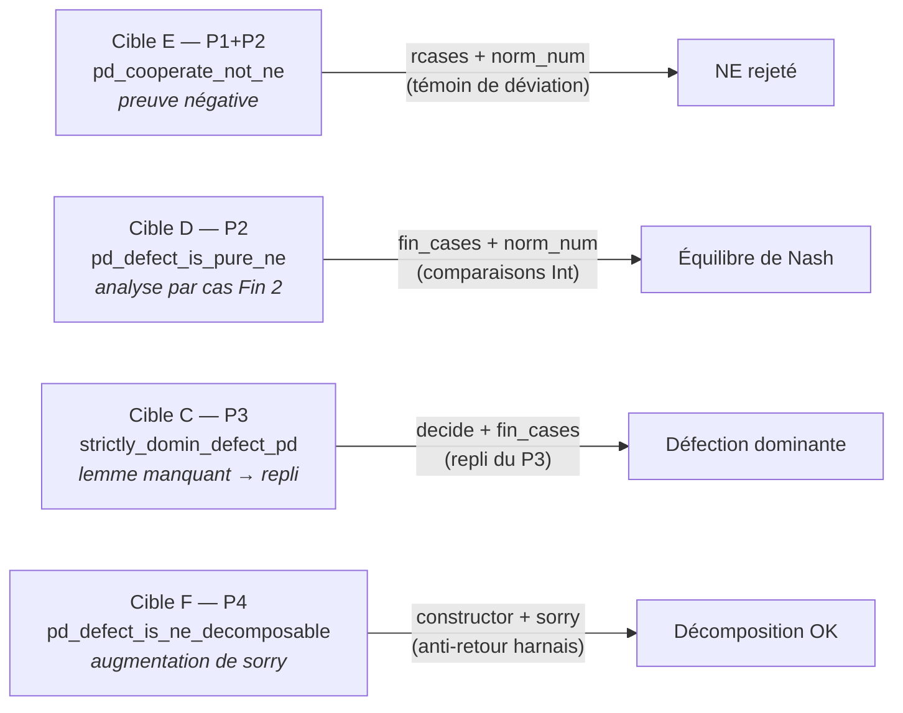
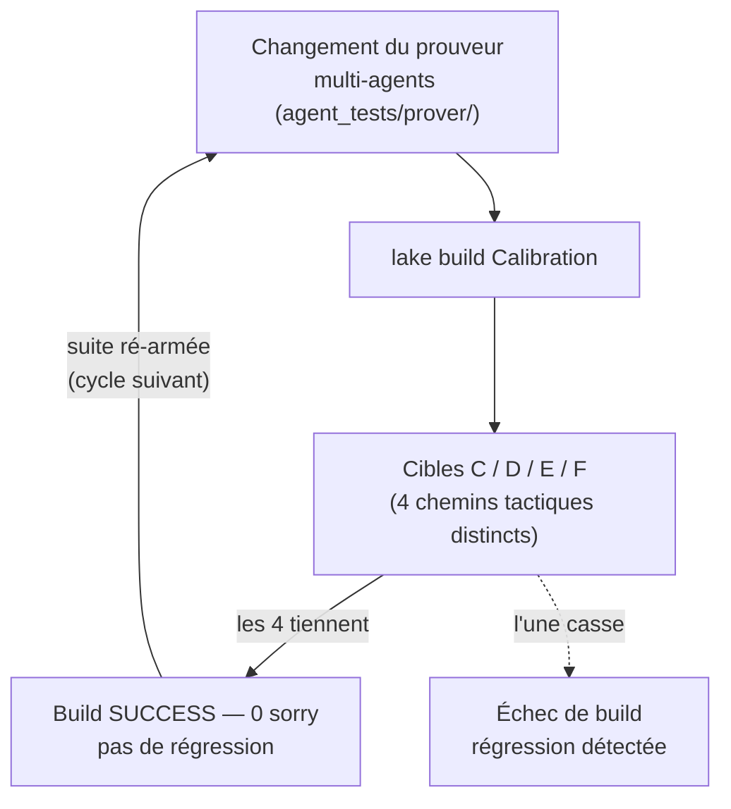

# Calibration Lean

Cibles de calibration du prouveur pour benchmarker le prouveur Lean multi-agents.

Ces cibles sont des preuves **courtes, auto-contenues** du Dilemme du Prisonnier
(jeu 2×2) que le harnais multi-agents ([`agent_tests/prover/`](../agent_tests/prover/))
doit pouvoir clore de bout en bout. Chaque cible est étiquetée par un **niveau de
difficulté P1–P5** (la taxonomie du harnais, du plus facile au plus dur) et
exerce un chemin tactique distinct : recherche de lemme Mathlib puis repli (P3),
analyse par cas sur `Fin 2` (P2), preuve négative par contre-exemple (P1+P2), ou
décomposition en sous-buts avec augmentation de `sorry` (P4). Les quatre étant
prouvées, le module sert de **suite de régression** pour détecter toute
régression du prouveur.

## Statut

- **Toolchain** : v4.31.0-rc1
- **Compte de sorry** : 0 en production (les 4 cibles de calibration sont prouvées ; un ancien compte de « 4 sorry » correspondait à du texte de docstring à l'intérieur de blocs `/-- ... -/`, pas à des termes `sorry` réels)
- **Build** : `lake build Calibration` -- SUCCESS
- **Dépendances** : Mathlib4

## Modules

| Fichier | sorry | Description |
|---------|-------|-------------|
| `Calibration/Nash.lean` | 0 | Cibles de calibration du prouveur (C/D/E/F) |

## Cibles de calibration

Les quatre cibles vivent dans [`Calibration/Nash.lean`](Calibration/Nash.lean),
sur le Dilemme du Prisonnier (`C` = Coopérer, `D` = Trahir). Chacune exerce un
chemin tactique distinct du harnais :

| Cible | Théorème | Niveau | Ce qu'elle exerce |
|-------|----------|--------|-------------------|
| **C** | `strictly_domin_defect_pd` | P3 | Recherche d'un lemme Mathlib inexistant + repli sur l'analyse par cas (`fin_cases` + `decide`) |
| **D** | `pd_defect_is_pure_ne` | P2 | Analyse par cas `Fin 2` + comparaisons `Int` sur les deux joueurs (`norm_num`) |
| **E** | `pd_cooperate_not_ne` | P1+P2 | Preuve **négative** : construire un témoin de déviation (`rcases` + `norm_num`) |
| **F** | `pd_defect_is_ne_decomposable` | P4 | Cas d'**augmentation de sorry** : le harnais ne doit pas revenir en arrière quand le `sorry` augmente mais le build passe |

Les quatre sont **prouvées avec 0 `sorry`** en production. La cible F porte le
mot « sorry » dans sa docstring (elle décrit le chemin `constructor` + 2 `sorry`
que le prouveur *devrait* tenter) ; l'implémentation actuelle réutilise la preuve
de D via `exact`, d'où le faux positif `grep` documenté plus bas.

*Les quatre cibles (Dilemme du Prisonnier 2×2) ordonnées par le chemin tactique
qu'elles forcent le harnais à emprunter — du plus simple (P1) au plus exigeant (P4) :*

## Notes

- Ce module benchmark la capacité du prouveur Lean multi-agents à clore des preuves de type manuel
- Toutes les cibles sont désormais fermées ; le module est conservé comme suite de régression permanente pour les changements du prouveur
- Vérification : `grep -nE '^[^/]*\bsorry\b' Calibration/Nash.lean` retourne 0 correspondance en production (cf [README Lean](../Lean-1-Setup.ipynb))

## Conclusion

Ce projet est une **suite de calibration** pour le prouveur Lean multi-agents :
quatre cibles de preuve de type manuel (C / D / E / F) dans
`Calibration/Nash.lean`, toutes **prouvées avec 0 `sorry`**
(`lake build Calibration` SUCCESS, toolchain `v4.31.0-rc1`).

### Pourquoi ce module existe

Les cibles benchmarkent la capacité du prouveur à clore des preuves courtes et
auto-contenues de bout en bout. Les quatre étant désormais fermées, le module
est conservé comme **suite de régression permanente** : tout changement du
prouveur qui casse l'une de ces preuves remonte ici comme un échec de build.

*La boucle de régression — comment ces quatre cibles protègent le prouveur :*

### La leçon du faux positif grep

Un ancien compte de « 4 `sorry` » était un **artéfact de mesure** — le mot
« sorry » apparaissait à l'intérieur de docstrings `/-- ... -/` (prose), pas
comme termes de preuve. Un `grep sorry` naïf sur-comptait ; la vérification
correcte `grep -nE '^[^/]*\bsorry\b'` (en excluant commentaires/docstrings)
retourne 0. La même distinction — `sorry` la tactique vs « sorry » le mot —
s'applique à toute la série Lean.

### Où aller ensuite

- **Harnais du prouveur** : [`agent_tests/prover/`](../agent_tests/prover/) — le prouveur multi-agents que ces cibles calibrent.
- **Cibles de production** : [`conway_lean/`](../conway_lean/),
  [`knot_lean/`](../knot_lean/) — projets Lean sur lesquels le prouveur
  s'exécute également.
