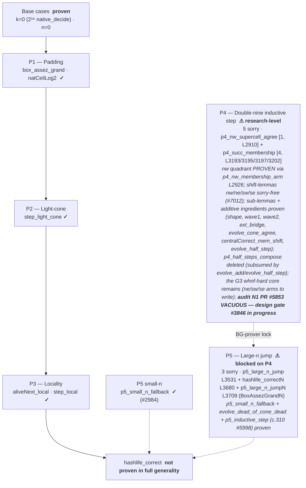

# Conway Lean

Lean 4 formalization of Conway's mathematical games and algorithms.

## Status

- **Toolchain**: v4.31.0-rc1
- **Sorry count**: **8** (all in `HashlifeCorrectness.lean`, Epic #2162 — **P4: 5** + **P5 large-n: 3**; canonical code-level count via `strip_comments` from `scripts/lean/check_i18n_siblings.py`, raw `grep` over-counts ~68 via docstring prose). Growth 2→8 since audit N1 (#5853) = **forward progress**: structural decomposition of the P4 inductive step (membership iff split into quadrant sub-cases, the **nw quadrant PROVEN** via `p4_nw_membership_arm` L2926) + statement of 2 new top-level N-correctness theorems (`hashlife_correctN` L3678, `p5_large_n_jumpN` L3706, `BoxAssezGrandN`, gated P4) — **not a regression**. See § "Honest state of the HashlifeCorrectness lock" for the per-declaration breakdown. Several P4 sub-lemmas and additive ingredients are proven sorry-free (see § "Game of Life" below). `p5_inductive_step` (P5.3 glue) was closed by c.310 PR #5998 via vacuous-arm split (design gate #3846): on non-empty grids, the `¬ hsmall` branch is jointly unsatisfiable with `BoxAssezGrand`, hence vacuous by construction. The P4.4 `p4_half_steps_compose` placeholder was deleted: its pure-evolve composition is already closed (`evolve_add` + `evolve_half_step`), its wave-glue content carried by the `p4_succ_membership` residual. **Audit N1 (PR #5853, ai-01 2026-07-09)**: the initial frame sub-claim (`BoxAssezGrand` ∩ `n ≥ jumpSize`) is **VACUOUS on non-empty grids** (`p5_large_n_hyps_unsat`: padding 2 of `gridFrame` ∧ `lvl ≥ 3` ⇒ `n ≤ 2 ∧ js ≥ 8`). **Design gate ai-01 (#3846, 2026-07-10)**: redesign `gridFrame` for `n`-dependent padding, port the `(off, mc)` state through the `evolveHashlifeFastAux` loop without intermediate re-framing, restate the "margin ≥ remaining n, preserved by jump" invariant. The proof debt (#3846) remains the BG-prover target and the coordinated architectural redesign scope.
- **Build**: `lake build Conway` -- SUCCESS (3352 jobs)
- **Dependencies**: Mathlib4
- **i18n coverage (EPIC #4980)**: **25 conway_lean modules** shipped as FR-canonical + `_en` sibling on `main` (all but `HashlifeCorrectness.lean`, the P4/P5 prover target which remains EN-only) — Phase 1: **10/10**; Phase 2: **13/14** (`ConeGeometry` included); Phase 3: **2/2**. Rollout complete (c.290-#6439 + cycles c.421-c.423 merged).

## Modules

### Phase 1 — Classic algorithms (Epic #1151, COMPLETE)

| File | `_en` | sorry | Description |
|------|-------|-------|-------------|
| `Conway/Doomsday.lean` | `Doomsday_en.lean` | 0 | Doomsday algorithm (day-of-week calculation) |
| `Conway/DoomsdayLemmas.lean` | `DoomsdayLemmas_en.lean` | 0 | Lemmas for the Doomsday algorithm |
| `Conway/Fractran.lean` | `Fractran_en.lean` | 0 | FRACTRAN programming language |
| `Conway/FractranLemmas.lean` | `FractranLemmas_en.lean` | 0 | Lemmas for FRACTRAN (step/run: halt empty, 0-run, `num/1` applicability, concrete trace `{3/2}` 2→3) |
| `Conway/LookAndSay.lean` | `LookAndSay_en.lean` | 0 | Look-and-Say sequence |
| `Conway/LookAndSayLemmas.lean` | `LookAndSayLemmas_en.lean` | 0 | Lemmas for the Look-and-Say sequence |
| `Conway/Nim.lean` | `Nim_en.lean` | 0 | Nim game theory |
| `Conway/Angel.lean` | `Angel_en.lean` | 0 | Angel problem |
| `Conway/CollatzLike.lean` | `CollatzLike_en.lean` | 0 | Collatz-like functions and undecidability (`native_decide`) |
| `Conway/MathlibMap.lean` | `MathlibMap_en.lean` | 0 | Mathlib pinned-snapshot satellite — what Mathlib provides for Conway's work |

### Phase 2 — Game of Life (Epic #1647, IN PROGRESS)

| File | `_en` | sorry | Description |
|------|-------|-------|-------------|
| `Conway/Life.lean` | `Life_en.lean` (root) | 0 | B3/S23 rules, grid operations, step/evolve, `native_decide` proofs |
| `Conway/Life/Spaceships.lean` | `Spaceships_en.lean` | 0 | LWSS/MWSS/HWSS (period 4, displacement (0,2)), 3 `native_decide` proofs |
| `Conway/Life/Oscillators.lean` | `Oscillators_en.lean` | 0 | 5 still-lifes + pulsar (p3) + pentadecathlon (p15), 7 `native_decide` |
| `Conway/Life/RLE.lean` | `RLE_en.lean` | 0 | RLE pattern parser + glider/LWSS/pulsar/Gosper gun, 8 `native_decide` proofs |
| `Conway/Life/MacroCell.lean` | `MacroCell_en.lean` | 0 | Quadtree datatype + `toGrid`/`buildFromGrid` round-trip + `wf` predicate |
| `Conway/Life/Hashlife.lean` | `Hashlife_en.lean` | 0 | `step4x4` + `hashlifeResult` recursive + `padCenter2` + `hashlifeJump` + `evolveHashlifeFast` |
| `Conway/Life/LightCone.lean` | `LightCone_en.lean` | 0 | Light-cone geometry satellite — sorry-free lemmas on `manhattan`/`lightCone` bridging `HashlifeCorrectness` |
| `Conway/Life/ConeGeometry.lean` | `ConeGeometry_en.lean` | 0 | Cone geometry — pure lattice facts (Mathlib only) |
| `Conway/Life/GridCanonical.lean` | `GridCanonical_en.lean` | 0 | `sortDedup` canonical forms, lex-sorted uniqueness, grid equality via canonical form |
| `Conway/Life/Computation.lean` | `Computation_en.lean` | 0 | Hashlife cross-validation (6 + 6 fast), eater1 still-life (1), glider composition (5) |
| `Conway/Life/HashlifeMemo.lean` | `HashlifeMemo_en.lean` | 0 | Memoized Hashlife for community pillar witnesses (OTCA 35K, UnitCell 4096, Gemini 33M) |
| `Conway/Life/HashlifeMarginDemo.lean` | `HashlifeMarginDemo_en.lean` | 0 | Runnable P5 redesign demo (#3846) — n-aware framing margin around `MacroCell`/`HashlifeCorrectness` |
| `Conway/Life/Pillars.lean` | `Pillars_en.lean` (c.417) | 0 | Community-witness theorem scaffolding (4 pillars) |
| `Conway/Life/HashlifeCorrectness.lean` | — | 8 | Bounded correctness `hashlife_correct`; P4/P5 prover targets (Epic #1453, #2162). 8 = P4 (5: `p4_nw_supercell_agree` L2910 + `p4_succ_membership` L3193/3195/3197/3202) + P5 large-n (3: `p5_large_n_jump` L3531 + `hashlife_correctN` L3680 + `p5_large_n_jumpN` L3709) |

### Phase 3 — Free Will Theorem (Epic #1651, COMPLETE)

| File | `_en` | sorry | Description |
|------|-------|-------|-------------|
| `Conway/KochenSpecker.lean` | `KochenSpecker_en.lean` | 0 | KS 18-vec Cabello proof (parity argument) |
| `Conway/FreeWillTheorem.lean` | `FreeWillTheorem_en.lean` | 0 | Conway-Kochen FWT (SPIN + TWIN + MIN) |

## Key Results

### Classic algorithms (Phase 1)

- Doomsday algorithm correctness
- FRACTRAN computation formalization
- Look-and-Say sequence properties
- Nim game strategy
- Angel problem formalization
- Collatz-like undecidability (`native_decide` on finite instances)

### Game of Life (Phase 2)

- **Grid/List encoding**: `Grid = List (Int x Int)` with Bool predicates, `native_decide` proofs
- **RLE parser**: Complete Run Length Encoded format parser with proven correctness
  - 4 parse-success theorems, 2 round-trip equalities, 2 cell-count theorems
  - Gosper Glider Gun (36 live cells, period 30) parsed and verified
- **Spaceships**: LWSS, MWSS, HWSS with period-4 displacement proofs
- **Oscillators**: Blinker (p2), toad (p2), beacon (p2), pulsar (p3), pentadecathlon (p15)
- **MacroCell well-formedness**: `MacroCell.wf` predicate (PR #2795), grid-side constructors produce wf cells
- **Grid canonical forms**: `sortDedup` outputs are lex-sorted and unique (PR #2797)
- **Hashlife**: Quadtree MacroCell + recursive hashlife algorithm with exponential speedup
  - `step4x4`: level-2 base case (B3/S23 direct)
  - `hashlifeResult`: recursive level-k to level-(k-1), `2^(k-2)` generations
  - `padCenter2`: proper centered padding (+2 levels, single copy)
  - `hashlifeJump` + `evolveHashlifeFast`: exponential-speedup API
  - Cross-validated against list-based reference on 12 patterns (6 + 6 fast path)
  - Eater 1 (fishhook) still-life proved by `native_decide`
  - Multi-period glider composition theorems
- **Memoized Hashlife**: Community pillar witnesses (OTCA 35K gen, UnitCell 4096 gen, Gemini 33M gen)
- **HashlifeCorrectness**: bounded correctness `hashlife_correct`, decomposed P1-P5
  - **P1-P3 proven** (base case `k=0` via `2^16 native_decide`, PR #2810)
  - **P4 inductive step** (5 sorry: `p4_nw_supercell_agree` L2910 [1, NET-FLAT isolation of the monolithic nw call-site, ai-01 #6875] + `p4_succ_membership` L3193/3195/3197/3202 [4, ne/sw/se quadrants + mpr direction — the **nw quadrant is PROVEN** via `p4_nw_membership_arm` L2926 on `p4_nw_shift_lemma`]): the #2975 scaffolding decomposes the inductive step into sub-lemmas. **Proven sorry-free** — `p4_double_nine_shape` (structural existence of the nine quadrants of a double-nine cell), `p4_wave1_ih` and `p4_wave2_ih` (propagation of `centralCorrect` via the induction hypothesis over the two waves), `p4_ext_bridge`, plus the additive ingredients closed in cycles 145-160: `evolve_add` (S1), `evolve_half_step` (half-step `2^k`, #4555 — pure-evolve composition closed), `centralCorrect_mem_shift` (G2 offset-generalized gate, #4812) and `evolve_cone_agree` (radius-doubling locality composition gate, #4892). The P4.4 placeholder `p4_half_steps_compose` (`: True`) was **deleted** (N2-bis): its pure-evolve composition is exactly `evolve_add` + `evolve_half_step` (closed), its wave-glue content now split into quadrant sub-cases on `p4_succ_membership` (noncomputable def L3103, sorries L3193/3195/3197/3202) + the nw call-site isolated as `p4_nw_supercell_agree` (L2893, sorry L2910) — the G3 offset-matching assembly core: characterize super-cell `q_*` membership in the four quadrant offsets via `centralCorrect_mem` (G2) + the bridging `evolve_half_step`/`step_light_cone` (G3). Research-level double-nine light-cone composition, whnf-hard — a multi-cycle BG-prover target.
  - **P5 large-n** (3 residual sorry, all gated P4): `p5_small_n_fallback` **PROVEN** (PR #2984); `evolve_dead_of_cone_dead` (P5.2 contrapositive, #4574) **proven sorry-free**; `p5_inductive_step` (P5.3 glue) **PROVEN** by c.310 PR #5998 via vacuous-arm split (non-empty branch closed by `p5_large_n_hyps_unsat`, empty branch by direct unfold). Remaining are 3 top-level `sorry` theorems, all gated P4: `p5_large_n_jump` (P5.2, `evolveHashlifeFast n g = evolve n g`, L3528 sorry L3531), and the 2 newly stated `BoxAssezGrandN` N-steps theorems `hashlife_correctN` (L3678 sorry L3680) + `p5_large_n_jumpN` (L3706 sorry L3709). Base case `n=0` proven (`hashlife_correct_base_zero` #2898, `evolveHashlifeFastAux_zero_n` #2901).

### Kochen-Specker + Free Will Theorem (Phase 3, PROVED)

The `KochenSpecker.lean` module formalizes the 18-vector proof by Cabello,
Estebaranz and Garcia-Alcaine (1996). It is the combinatorial kernel of the
Conway-Kochen Free Will Theorem (2006/2009, Epic #1651).

The `FreeWillTheorem.lean` module proves the full Free Will Theorem from
three physically motivated axioms (SPIN, TWIN, MIN), reducing to the
Kochen-Specker contradiction.

**Hall of Fame**:
- Kochen & Specker (1967) — original 117-vector proof
- Cabello, Estebaranz, Garcia-Alcaine (1996) — 18-vector tight proof
- Conway & Kochen (2006) — 33-vector proof + Free Will Theorem
- Peres (1991), Mermin (1993) — simplifications and pedagogy

## Conclusion

This workspace formalizes in Lean 4 three facets of John Conway's work, from classical algorithms (Phase 1) to the universal computation of the Game of Life (Phase 2) up to the quantum foundation (Phase 3, Free Will Theorem). The through-line is **formal certification**: every result is a proven theorem, not a simulation.

### What this formalism demonstrates

- **Classical algorithms** (Doomsday, FRACTRAN, Look-and-Say, Nim, Angel, Collatz) are proven on their finite instances via `native_decide` or by direct combinatorial arguments (`decide`, `omega`, parity for Kochen-Specker). Zero `sorry`.
- **The Game of Life as a computational engine**: B3/S23 rules, spaceships (LWSS/MWSS/HWSS), oscillators (blinker, pulsar p3, pentadecathlon p15), and the Hashlife method with exponential speedup. Cross-validation on 12 patterns + eater1 + glider compositions confirms that the fast implementation `evolveHashlifeFast` agrees with the `evolve` reference on all tested cases.
- **The Free Will Theorem** (Conway-Kochen 2006/2009) is proven from the three physically motivated axioms SPIN + TWIN + MIN, reducing to the 18-vector Kochen-Specker contradiction (Cabello et al. 1996). Phase 3 COMPLETE, sorry-free.

### Honest state of the HashlifeCorrectness lock

The central theorem `hashlife_correct` (bounded by the padding hypothesis `BoxAssezGrand`) is **not yet proven in full generality**: **8 `sorry`** remain (code-level, canonical count via `strip_comments` — raw `grep` over-counts via docstring prose) in `HashlifeCorrectness.lean`, all concentrated on the research-level P4/P5 lock. The foundation is solid — base case `k=0` proven (`2^16 native_decide`), base case `n=0` proven, P1/P2/P3 (padding, light-cone, locality) proven, `p5_small_n_fallback` proven, `p5_inductive_step` (P5.3 glue) proven by c.310 PR #5998 via vacuous-arm split, the P4 sub-lemmas (`p4_double_nine_shape`, `p4_wave1_ih`, `p4_wave2_ih`, `p4_ext_bridge`) proven sorry-free, as well as the additive ingredients closed in cycles 145-160 (`evolve_add`, `evolve_half_step`, `centralCorrect_mem_shift`, `evolve_cone_agree`) and the P5.2 contrapositive (`evolve_dead_of_cone_dead`) — but the P4 inductive step (offset-matching G3 assembly) and P5 large-n are **research-level**. **Per-declaration breakdown of the 8 sorry** (post P4.4 decomposition #7012 + statement of N-correctness theorems):

- **P4 — `p4_nw_supercell_agree`** (private theorem L2893, sorry L2910, 1): NET-FLAT isolation of the monolithic nw call-site (ai-01 tree-lock #6875; anti-regression §D N/A — nominally replaces a pre-existing sorry, does not add debt).
- **P4 — `p4_succ_membership`** (noncomputable def L3103, 4 sorry L3193/3195/3197/3202): the membership iff of the inductive step, **decomposed into quadrant sub-cases**. The **nw quadrant is PROVEN** via `p4_nw_membership_arm` (L2926, sorry-free wiring on `p4_nw_shift_lemma`); remaining are the ne/sw/se quadrants (L3193/3195/3197) + the mpr direction (L3202). The `p4_half_steps_compose` placeholder was deleted (pure-evolve composition already closed via `evolve_add`+`evolve_half_step`).
- **P5 large-n** (3 sorry, all gated P4): `p5_large_n_jump` (L3528 sorry L3531, P5.2) + `hashlife_correctN` (L3678 sorry L3680) + `p5_large_n_jumpN` (L3706 sorry L3709) — the latter 2 are newly stated top-level N-steps theorems `BoxAssezGrandN`.

**Infrastructure in place**: the 4 shift-lemmas `p4_nw/ne/sw/se_shift_lemma` (L2846/2999/3025/3051, #7012) are sorry-free. **Concrete next step**: write the ne/sw/se membership arms by analogy to `p4_nw_membership_arm` (L2926), which closes 3 of the 4 sorry of `p4_succ_membership`. These are the BG-prover (`agent_tests/prover/`) targets; the multi-wave light-cone composition resists current tactical automation. The P4 scaffolds state each sub-goal precisely in their docstrings.

*The `hashlife_correct` correction pyramid: the proven foundation (base cases, P1-P3,
`p5_small_n_fallback`) carries the theorem; at the top, the research-level P4 lock
(double-nine, **unrestricted statement FALSE** — `p4_unrestricted_counterexample`,
audit N1 PR #5853) blocks P5 large-n:*

### Methodological lessons

- **`List (Int × Int)` + `Bool` predicates + `native_decide`** is the encoding that passes for grids; the `Finset` encoding is blocked by `Quot.lift`/`Eq.rec`.
- **The "intractable" concept often hides a false statement**: the same intuition as for the Lattice breakthrough (7→0) applies — the certified counter-example `p4_unrestricted_counterexample` shows that an unrestricted statement form is false, pointing toward the correct `MacroCell.wf` hypothesis.
- **The sorry-free additive ingredients** (level/wf preservation, `box_assez_grand` arithmetic) accumulate behind the lock and will be deployable once P4 yields.

### Next steps

1. **BG-prover on P4**: attack the double-nine inductive step via the multi-agent harness (`agent_tests/prover/`), leaning on the docstring-restated scaffolds.
2. **Sorry-free geometric sub-claim**: the bound `gridBoundingBox (g').2 ≤ gridBoundingBox g .2 + 2 * jumpSize` (light-cone growth) is an additive grain on the P5.2 frame, dischargeable by `Nat` arithmetic once the light-cone case is bounded — queuable behind the P4 lock.
3. **Witness extension**: add additional HashlifeMemo patterns (community pillars) to strengthen the `native_decide` foundation.

## Notes

- Part of the GameTheory Lean series
- Companion notebook: `Lean-16b-Conway-Game-of-Life-Lean.ipynb`
- Cross-link: Epic #1647 Conway Phase 2 (Life-as-Computation)
- Cross-link: Epic #1651 Conway Phase 3 (Free Will Theorem)
- Cross-link: Epic #2162 Conway depth (HashlifeCorrectness P4/P5)

## Conway.Life Design

- **List(Int x Int) + Bool predicates + `native_decide`** = works reliably
- **Finset(Int x Int) + decide/native_decide** = BLOCKED (Quot.lift, Eq.rec)
- Pulsar (48 cells) and pentadecathlon (p15) are borderline but pass `native_decide`
- Hashlife: partial def (no termination proof) with recursive MacroCell decomposition
- `evolveHashlifeFast`: exponential speedup via `padCenter2` + `hashlifeResult`, validated by `native_decide`
- MacroCell round-trip verified by `#eval` and `native_decide` theorem
- HashlifeMemo: memoization layer for pillar witnesses, `9^k` worst case reduced to tractable

## References

Foundational sources for the results formalized across the three phases. Each entry maps to a module of this workspace.

- **Conway, J. H.** *On Numbers and Games* (ONAG). Academic Press, 1976; 2nd ed., A K Peters, 2001. — Conway's broader framework for combinatorial games (context for the games below).
- **Bouton, C. L.** "Nim, A Game with a Complete Mathematical Theory." *Annals of Mathematics*, 2nd ser., 3(1-4) (1901-1902): 35-39. — Foundational analysis of Nim (`Nim.lean`).
- **Conway, J. H.** "The Weird and Wonderful Chemistry of Audioactive Decay." *Eureka* 46 (1986): 5-16. — The Look-and-Say sequence (`LookAndSay.lean`).
- **Conway, J. H.** "FRACTRAN: A Simple Universal Programming Language for Arithmetic." In *Open Problems in Communication and Computation* (Cover & Gopinath, eds.), Springer, 1987. — FRACTRAN (`Fractran.lean`).
- **Conway, J. H.** "The Angel Problem." In *Games of No Chance*, MSRI Publications 29, Cambridge University Press, 1996. — The Angel vs Devil problem (`Angel.lean`).
- Conway's **Doomsday** algorithm for day-of-week computation — the calendar anchor method formalized in `Doomsday.lean`.
- The **Collatz** (3n+1) conjecture, Lothar Collatz (1937) — bounded instances handled via `native_decide` (`CollatzLike.lean`).
- **Gardner, M.** "The Fantastic Combinations of John Conway's New Solitaire Game 'Life'." *Scientific American* 223(4) (October 1970): 120-123. — First public presentation of the Game of Life (`Life.lean`).
- **Rokicki, T.** "An Algorithm for Compressing Space and Time." *Dr. Dobb's Journal* (2006). — The Hashlife algorithm (`Life/Hashlife.lean`).
- **Rendell, P.** "A Universal Turing Machine in Conway's Game of Life." In *Collision-Based Computing* (Adamatzky, ed.), Springer, 2002. — Life as universal computation (`Life/Computation.lean`).
- **Kochen, S.; Specker, E. P.** "The Problem of Hidden Variables in Quantum Mechanics." *Journal of Mathematics and Mechanics* 17(1) (1967): 59-81. — The original 117-vector theorem (`KochenSpecker.lean`).
- **Cabello, A.; Estebaranz, J. M.; Garcia-Alcaine, G.** "Bell-Kochen-Specker Theorem: A Proof with 18 Vectors." *Physics Letters A* 212 (1996). — The 18-vector tight proof formalized in `KochenSpecker.lean`.
- **Conway, J. H.; Kochen, S.** "The Free Will Theorem." *Foundations of Physics* 36(10) (2006): 1443-1473. — FWT from the SPIN, TWIN, and MIN axioms (`FreeWillTheorem.lean`).
- **Conway, J. H.; Kochen, S.** "The Strong Free Will Theorem." *Notices of the American Mathematical Society* 56(2) (2009): 226-232.
- **Peres, A.** "Two Simple Proofs of the Kochen-Specker Theorem." *Journal of Physics A* 24(4) (1991): L175-L178.
- **Mermin, N. D.** "Hidden Variables and the Two Theorems of John Bell." *Reviews of Modern Physics* 65(3) (1993): 803-815.
