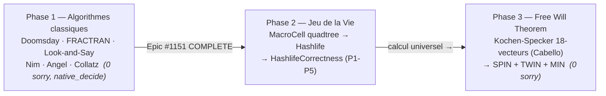
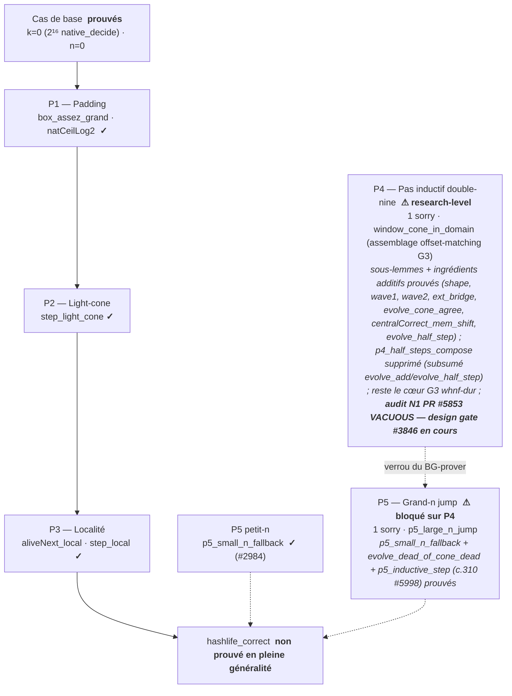

# Conway Lean

Formalisation en Lean 4 des jeux et algorithmes mathématiques de John Conway.

*Les trois facettes de l'œuvre de Conway, chacune un Epic formel distinct — des
algorithmes classiques au calcul universel du Jeu de la Vie, jusqu'au fondement
quantique du Free Will Theorem :*

## Statut

- **Toolchain** : v4.31.0-rc1
- **Compte de sorry** : 2 (tous dans `HashlifeCorrectness.lean` — wave-glue P4 `window_cone_in_domain` [1] + grand-n P5 `p5_large_n_jump` [1], Epic #2162). Plusieurs sous-lemmes P4 et ingrédients additifs sont prouvés sorry-free (voir § « Jeu de la Vie » ci-dessous). `p5_inductive_step` (colle P5.3) a été close par c.310 PR #5998 via vacuous-arm split (design gate #3846) : sur grilles non vides, la branche `¬ hsmall` est conjointement insatisfaisable avec `BoxAssezGrand`, donc vide par construction. Le placeholder `p4_half_steps_compose` (P4.4) a été supprimé : sa composition pure-evolve est déjà close (`evolve_add` + `evolve_half_step`), son contenu wave-glue porté par le résiduel `window_cone_in_domain`. **Audit N1 (PR #5853, ai-01 2026-07-09)** : le frame sub-claim initial (`BoxAssezGrand` ∩ `n ≥ jumpSize`) est **vacuous sur grilles non vides** (`p5_large_n_hyps_unsat` : padding 2 de `gridFrame` ∧ `lvl ≥ 3` ⇒ `n ≤ 2 ∧ js ≥ 8`). **Design gate ai-01 (#3846, 2026-07-10)** : redesigner `gridFrame` pour padding dépendant de `n`, porter l'état `(off, mc)` à travers la boucle de `evolveHashlifeFastAux` sans re-framing intermédiaire, restater l'invariant « marge ≥ n restant, préservé par jump ». La dette de preuve (#3846) reste la cible du BG-prover et du redesign architectural coordonné.
- **Build** : `lake build Conway` — SUCCESS
- **Dépendances** : Mathlib4

## Modules

### Phase 1 — Algorithmes classiques (Epic #1151, COMPLETE)

| Fichier | sorry | Description |
|---------|-------|-------------|
| `Conway/Doomsday.lean` | 0 | Algorithme Doomsday (calcul du jour de la semaine) |
| `Conway/DoomsdayLemmas.lean` | 0 | Lemmes pour l'algorithme Doomsday |
| `Conway/Fractran.lean` | 0 | Langage de programmation FRACTRAN |
| `Conway/FractranLemmas.lean` | 0 | Lemmes pour FRACTRAN (step/run : halt vide, 0-run, applicabilité `num/1`, trace concrète `{3/2}` 2→3) |
| `Conway/LookAndSay.lean` | 0 | Suite Look-and-Say |
| `Conway/LookAndSayLemmas.lean` | 0 | Lemmes pour la suite Look-and-Say |
| `Conway/Nim.lean` | 0 | Théorie des jeux de Nim |
| `Conway/Angel.lean` | 0 | Problème de l'ange (Angel problem) |
| `Conway/CollatzLike.lean` | 0 | Fonctions de type Collatz et indécidabilité (`native_decide`) |
| `Conway/MathlibMap.lean` | 0 | Satellite de cartographie Mathlib pinned (`54f98fd6`) — ce que Mathlib fournit pour l'œuvre de Conway |

### Phase 2 — Jeu de la Vie (Epic #1647, EN COURS)

| Fichier | sorry | Description |
|---------|-------|-------------|
| `Conway/Life.lean` | 0 | Règles B3/S23, opérations sur grille, step/evolve, preuves `native_decide` |
| `Conway/Life/Spaceships.lean` | 0 | LWSS/MWSS/HWSS (période 4, déplacement (0,2)), 3 preuves `native_decide` |
| `Conway/Life/Oscillators.lean` | 0 | 5 still-lifes + pulsar (p3) + pentadecathlon (p15), 7 `native_decide` |
| `Conway/Life/RLE.lean` | 0 | Parseur de motifs RLE + glider/LWSS/pulsar/Gosper gun, 8 preuves `native_decide` |
| `Conway/Life/MacroCell.lean` | 0 | Type quadtree MacroCell + round-trip `toGrid`/`buildFromGrid` + prédicat `wf` |
| `Conway/Life/Hashlife.lean` | 0 | `step4x4` + `hashlifeResult` récursif + `padCenter2` + `hashlifeJump` + `evolveHashlifeFast` |
| `Conway/Life/LightCone.lean` | 0 | Satellite géométrique light-cone — lemmes sorry-free sur `manhattan`/`lightCone` pontant `HashlifeCorrectness` |
| `Conway/Life/GridCanonical.lean` | 0 | Formes canoniques `sortDedup`, unicité lexicographique, égalité de grille via forme canonique |
| `Conway/Life/Computation.lean` | 0 | Cross-validation Hashlife (6 + 6 fast), still-life eater1 (1), composition de planeurs (5) |
| `Conway/Life/HashlifeMemo.lean` | 0 | Hashlife mémoïsé pour témoins des piliers communautaires (OTCA 35K, UnitCell 4096, Gemini 33M) |
| `Conway/Life/HashlifeMarginDemo.lean` | 0 | Démo exécutable P5 redesign (#3846) — n-aware framing margin autour de `MacroCell`/`HashlifeCorrectness` |
| `Conway/Life/Pillars.lean` | 0 | Scaffolding du théorème community-witness (4 piliers) |
| `Conway/Life/HashlifeCorrectness.lean` | 2 | Correction bornée `hashlife_correct` ; cibles P4/P5 du prouveur (Epic #1453, #2162) |

### Phase 3 — Free Will Theorem (Epic #1651, COMPLETE)

| Fichier | sorry | Description |
|---------|-------|-------------|
| `Conway/KochenSpecker.lean` | 0 | Preuve Cabello à 18 vecteurs du KS (argument de parité) |
| `Conway/FreeWillTheorem.lean` | 0 | Conway-Kochen FWT (SPIN + TWIN + MIN) |

## Résultats clés

### Algorithmes classiques (Phase 1)

- Correction de l'algorithme Doomsday
- Formalisation du calcul FRACTRAN
- Propriétés de la suite Look-and-Say
- Stratégie optimale du jeu de Nim
- Formalisation du problème de l'ange
- Indécidabilité de type Collatz (`native_decide` sur instances finies)

### Jeu de la Vie (Phase 2)

- **Encodage Grid/List** : `Grid = List (Int × Int)` avec prédicats `Bool`, preuves `native_decide`
- **Parseur RLE** : parseur complet du format Run Length Encoded avec correction prouvée
  - 4 théorèmes de parse réussi, 2 égalités de round-trip, 2 théorèmes de comptage de cellules
  - Gosper Glider Gun (36 cellules vivantes, période 30) parsé et vérifié
- **Vaisseaux (Spaceships)** : LWSS, MWSS, HWSS avec preuves de déplacement en période 4
- **Oscillateurs** : Blinker (p2), toad (p2), beacon (p2), pulsar (p3), pentadecathlon (p15)
- **Bien-formation MacroCell** : prédicat `MacroCell.wf` (PR #2795), les constructeurs côté grille produisent des cellules bien formées
- **Formes canoniques de grille** : les sorties de `sortDedup` sont triées lexicographiquement et uniques (PR #2797)
- **Hashlife** : MacroCell quadtree + algorithme hashlife récursif avec accélération exponentielle
  - `step4x4` : cas de base niveau 2 (B3/S23 direct)
  - `hashlifeResult` : récursif niveau k vers niveau (k-1), `2^(k-2)` générations
  - `padCenter2` : padding centré correct (+2 niveaux, copie unique)
  - `hashlifeJump` + `evolveHashlifeFast` : API à accélération exponentielle
  - Cross-validé contre la référence basée sur des listes sur 12 motifs (6 + 6 fast path)
  - Eater 1 (fishhook) still-life prouvé par `native_decide`
  - Théorèmes de composition de planeurs multi-périodes
- **Hashlife mémoïsé** : témoins des piliers communautaires (OTCA 35K gen, UnitCell 4096 gen, Gemini 33M gen)
- **HashlifeCorrectness** : correction bornée `hashlife_correct`, décomposée en P1-P5
  - **P1-P3 prouvés** (cas de base `k=0` via `2^16 native_decide`, PR #2810)
  - **Pas inductif P4** (1 sorry résiduel sur `window_cone_in_domain`) : le scaffolding #2975
    décompose le pas inductif en sous-lemmes. Sont **prouvés sorry-free** —
    `p4_double_nine_shape` (existence structurelle des neuf quadrants d'une cellule
    double-nine), `p4_wave1_ih` et `p4_wave2_ih` (propagation du `centralCorrect` par
    l'hypothèse d'induction sur les deux vagues), `p4_ext_bridge`, ainsi que les
    ingrédients additifs clos cycles 145-160 : `evolve_add` (S1), `evolve_half_step` (demi-pas
    `2^k`, #4555 — composition pure-evolve close), `centralCorrect_mem_shift` (gate G2
    offset-généralisé, #4812) et `evolve_cone_agree` (gate de composition de localité
    radius-doubling, #4892). Le placeholder P4.4 `p4_half_steps_compose` (`: True`) a été
    **supprimé** (N2-bis) : sa composition pure-evolve est exactement `evolve_add` +
    `evolve_half_step` (clos), son contenu wave-glue étant porté par le **1 sorry
    résiduel** sur `window_cone_in_domain` (helper privé déclaré L2629) — le cœur
    d'assemblage offset-matching G3 : caractériser l'appartenance des super-cellules
    `q_*` aux quatre offsets de quadrant via `centralCorrect_mem` (G2) + le pontage
    `evolve_half_step`/`step_light_cone` (G3). Composition light-cone double-nine whnf-dure
    de niveau recherche — cible du BG-prover multi-cycle.
  - **Grand-n P5** (1 sorry résiduel) : `p5_small_n_fallback` **PROUVÉ** (PR #2984) ;
    `evolve_dead_of_cone_dead` (contrapositive P5.2, #4574) **prouvé sorry-free** ;
    `p5_inductive_step` (colle P5.3) **PROUVÉ** par c.310 PR #5998 via vacuous-arm split
    (branche non-vide close par `p5_large_n_hyps_unsat`, branche vide par unfold direct).
    Reste `p5_large_n_jump` (P5.2, `evolveHashlifeFast n g = evolve n g`, corps `sorry`,
    bloqué sur P4). Cas de base `n=0` prouvé (`hashlife_correct_base_zero` #2898,
    `evolveHashlifeFastAux_zero_n` #2901).

### Kochen-Specker + Free Will Theorem (Phase 3, PROUVÉ)

Le module `KochenSpecker.lean` formalise la preuve à 18 vecteurs de Cabello,
Estebaranz et Garcia-Alcaine (1996). C'est le noyau combinatoire du Free Will
Theorem de Conway-Kochen (2006/2009, Epic #1651).

Le module `FreeWillTheorem.lean` prouve le Free Will Theorem complet à partir
de trois axiomes physiquement motivés (SPIN, TWIN, MIN), en se réduisant à la
contradiction de Kochen-Specker.

**Panthéon** :

- Kochen & Specker (1967) — preuve originale à 117 vecteurs
- Cabello, Estebaranz, Garcia-Alcaine (1996) — preuve serrée à 18 vecteurs
- Conway & Kochen (2006) — preuve à 33 vecteurs + Free Will Theorem
- Peres (1991), Mermin (1993) — simplifications et pédagogie

## Conclusion

Ce workspace formalise en Lean 4 trois facettes de l'oeuvre de John Conway, des algorithmes classiques (Phase 1) au calcul universel du Jeu de la Vie (Phase 2) jusqu'au fondement quantique (Phase 3, Free Will Theorem). Le fil conducteur est la **certitude formelle** : chaque résultat est un théorème prouvé, pas une simulation.

### Ce que ce formalisme démontre

- **Les algorithmes classiques** (Doomsday, FRACTRAN, Look-and-Say, Nim, Angel, Collatz) sont prouvés sur leurs instances finies via `native_decide` ou par arguments combinatoires directs (`decide`, `omega`, parité pour Kochen-Specker). Aucun `sorry`.
- **Le Jeu de la Vie comme moteur de calcul** : règles B3/S23, vaisseaux (LWSS/MWSS/HWSS), oscillateurs (blinker, pulsar p3, pentadecathlon p15), et la méthode Hashlife à accélération exponentielle. La cross-validation sur 12 patterns + eater1 + compositions de planeurs confirme que l'implémentation rapide `evolveHashlifeFast` agree avec la référence `evolve` sur tous les cas testés.
- **Le Free Will Theorem** (Conway-Kochen 2006/2009) est prouvé depuis les trois axiomes physiques SPIN + TWIN + MIN, en se réduisant à la contradiction 18-vecteurs de Kochen-Specker (Cabello et al. 1996). Phase 3 COMPLETE, sorry-free.

### État honnête du verrou HashlifeCorrectness

Le théorème central `hashlife_correct` (borné par l'hypothèse de padding `BoxAssezGrand`) n'est **pas encore prouvé en pleine généralité** : il reste **2 `sorry`** dans `HashlifeCorrectness.lean`. Le socle est solide — cas de base `k=0` prouvé (`2^16 native_decide`), cas de base `n=0` prouvé, P1/P2/P3 (padding, light-cone, locality) prouvés, `p5_small_n_fallback` prouvé, `p5_inductive_step` (colle P5.3) prouvé par c.310 PR #5998 via vacuous-arm split, les sous-lemmes P4 (`p4_double_nine_shape`, `p4_wave1_ih`, `p4_wave2_ih`, `p4_ext_bridge`) prouvés sorry-free, ainsi que les ingrédients additifs clos cycles 145-160 (`evolve_add`, `evolve_half_step`, `centralCorrect_mem_shift`, `evolve_cone_agree`) et la contrapositive P5.2 (`evolve_dead_of_cone_dead`) — mais le pas inductif P4 (assemblage offset-matching G3, 1 sorry résiduel sur `window_cone_in_domain` — helper privé déclaré L2629, le placeholder `p4_half_steps_compose` a été supprimé, sa composition pure-evolve étant déjà close via `evolve_add`+`evolve_half_step`) et le grand-n P5 (`p5_large_n_jump`, bloqué sur P4) sont **research-level**. Ce sont les cibles du BG-prover (`agent_tests/prover/`), pas des grains bornés : la composition light-cone multi-vagues résiste à l'automatisation tactique courante. Les scaffolds P4 énoncent précisément chaque sous-but dans leurs docstrings.

*La pyramide de correction `hashlife_correct` : le socle prouvé (cas de base, P1-P3,
`p5_small_n_fallback`) porte le théorème ; au sommet, le verrou research-level P4
(double-nine, **énoncé non restreint FAUX** — `p4_unrestricted_counterexample`,
audit N1 PR #5853) bloque le grand-n P5 :*

### Leçons méthodologiques

- **`List (Int × Int)` + prédicats `Bool` + `native_decide`** est l'encodage qui passe pour les grilles ; l'encodage `Finset` est bloqué par `Quot.lift`/`Eq.rec`.
- **Le concept "intractable" cache souvent un énoncé faux** : la même intuition que pour la percée Lattice (7→0) s'applique — le contre-exemple certifié `p4_unrestricted_counterexample` montre qu'une forme d'énoncé non restreinte est fausse, orientant vers la bonne hypothèse `MacroCell.wf`.
- **Les ingrédients additifs sorry-free** (préservation level/wf, arithmétique `box_assez_grand`) s'accumulent derrière le verrou et seront mobilisables quand P4 cédera.

### Prochaines étapes

1. **BG-prover sur P4** : attaquer le pas inductif double-nine via le harness multi-agent (`agent_tests/prover/`), en s'appuyant sur les scaffolds docstring-restated.
2. **Sub-claim géométrique sorry-free** : le bound `gridBoundingBox (g').2 ≤ gridBoundingBox g .2 + 2 * jumpSize` (croissance light-cone) est un grain additif sur la frame P5.2, dischargeable par arithmétique `Nat` une fois le cas light-cone borné — queueable derrière le verrou P4.
3. **Extension des témoins** : ajouter des motifs HashlifeMemo supplémentaires (community pillars) pour renforcer le socle `native_decide`.

## Notes

- Partie de la série Lean GameTheory
- Notebook compagnon : `Lean-16b-Conway-Game-of-Life-Lean.ipynb`
- Lien croisé : Epic #1647 Conway Phase 2 (Life-as-Computation)
- Lien croisé : Epic #1651 Conway Phase 3 (Free Will Theorem)
- Lien croisé : Epic #2162 Conway depth (HashlifeCorrectness P4/P5)

## Conception de Conway.Life

- **`List (Int × Int)` + prédicats `Bool` + `native_decide`** = fonctionne de façon fiable
- **`Finset (Int × Int)` + decide/native_decide** = BLOQUÉ (`Quot.lift`, `Eq.rec`)
- Pulsar (48 cellules) et pentadecathlon (p15) sont à la limite mais passent `native_decide`
- Hashlife : def partielle (sans preuve de terminaison) avec décomposition récursive MacroCell
- `evolveHashlifeFast` : accélération exponentielle via `padCenter2` + `hashlifeResult`, validé par `native_decide`
- Round-trip MacroCell vérifié par `#eval` et théorème `native_decide`
- HashlifeMemo : couche de mémoïsation pour les témoins des piliers, `9^k` pire cas réduit à tractable

## Références

Sources fondatrices des résultats formalisés à travers les trois phases. Chaque entrée correspond à un module de ce workspace.

- **Conway, J. H.** *On Numbers and Games* (ONAG). Academic Press, 1976; 2nd ed., A K Peters, 2001. — Le cadre plus large de Conway pour les jeux combinatoires (contexte des jeux ci-dessous).
- **Bouton, C. L.** "Nim, A Game with a Complete Mathematical Theory." *Annals of Mathematics*, 2nd ser., 3(1-4) (1901-1902): 35-39. — Analyse fondatrice de Nim (`Nim.lean`).
- **Conway, J. H.** "The Weird and Wonderful Chemistry of Audioactive Decay." *Eureka* 46 (1986): 5-16. — La suite Look-and-Say (`LookAndSay.lean`).
- **Conway, J. H.** "FRACTRAN: A Simple Universal Programming Language for Arithmetic." In *Open Problems in Communication and Computation* (Cover & Gopinath, eds.), Springer, 1987. — FRACTRAN (`Fractran.lean`).
- **Conway, J. H.** "The Angel Problem." In *Games of No Chance*, MSRI Publications 29, Cambridge University Press, 1996. — Le problème Angel vs Devil (`Angel.lean`).
- Algorithme **Doomsday** de Conway pour le calcul du jour de la semaine — la méthode d'ancrage calendrier formalisée dans `Doomsday.lean`.
- La conjecture de **Collatz** (3n+1), Lothar Collatz (1937) — instances bornées traitées via `native_decide` (`CollatzLike.lean`).
- **Gardner, M.** "The Fantastic Combinations of John Conway's New Solitaire Game 'Life'." *Scientific American* 223(4) (October 1970): 120-123. — Première présentation publique du Jeu de la Vie (`Life.lean`).
- **Rokicki, T.** "An Algorithm for Compressing Space and Time." *Dr. Dobb's Journal* (2006). — L'algorithme Hashlife (`Life/Hashlife.lean`).
- **Rendell, P.** "A Universal Turing Machine in Conway's Game of Life." In *Collision-Based Computing* (Adamatzky, ed.), Springer, 2002. — La Vie comme calcul universel (`Life/Computation.lean`).
- **Kochen, S.; Specker, E. P.** "The Problem of Hidden Variables in Quantum Mechanics." *Journal of Mathematics and Mechanics* 17(1) (1967): 59-81. — Le théorème original à 117 vecteurs (`KochenSpecker.lean`).
- **Cabello, A.; Estebaranz, J. M.; Garcia-Alcaine, G.** "Bell-Kochen-Specker Theorem: A Proof with 18 Vectors." *Physics Letters A* 212 (1996). — La preuve serrée à 18 vecteurs formalisée dans `KochenSpecker.lean`.
- **Conway, J. H.; Kochen, S.** "The Free Will Theorem." *Foundations of Physics* 36(10) (2006): 1443-1473. — FWT depuis les axiomes SPIN, TWIN et MIN (`FreeWillTheorem.lean`).
- **Conway, J. H.; Kochen, S.** "The Strong Free Will Theorem." *Notices of the American Mathematical Society* 56(2) (2009): 226-232.
- **Peres, A.** "Two Simple Proofs of the Kochen-Specker Theorem." *Journal of Physics A* 24(4) (1991): L175-L178.
- **Mermin, N. D.** "Hidden Variables and the Two Theorems of John Bell." *Reviews of Modern Physics* 65(3) (1993): 803-815.
