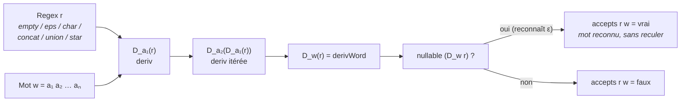
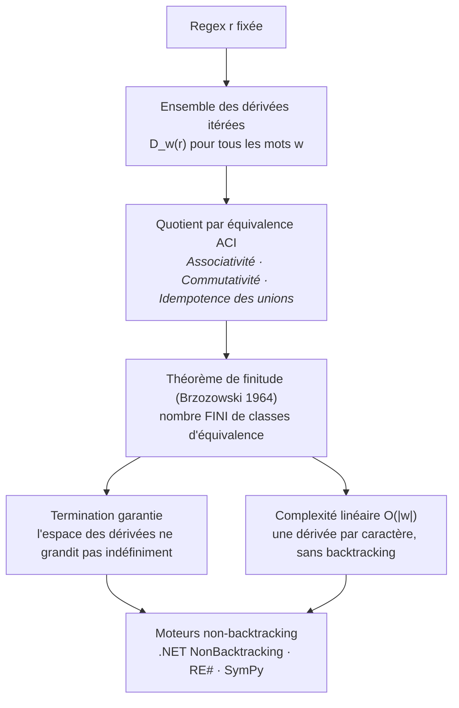

# finiteness_lean — Dérivées symboliques de Brzozowski

Démonstration pédagogique **autonome** (sans dépendance Mathlib) du concept de
**dérivée symbolique** d'une expression régulière et du **théorème de finitude**
de Brzozowski (1964) — la base théorique de la terminaison et de la complexité
**linéaire** des reconnaisseurs modernes non-backtracking.

Mini-projet Lean 4 issu de l'Epic #2978 (livrable C), livré par la PR #3018.

## État

- **Toolchain** : `leanprover/lean4:v4.30.0-rc2`
- **Sorry** : **0 sorry, 0 axiom** — tout est prouvé ou illustré par `#eval`
- **Build** : `lake build Finiteness` — **autonome, sans Mathlib** (Lean core seul)
- **Dépendances** : aucune

## Ce que formalise

Soit une expression régulière `r` sur un alphabet `α`. La **dérivée** de `r` par
un caractère `a` (Brzozowski, *Derivatives of Regular Expressions*, JACM 1964)
est l'expression `D_a(r)` qui reconnaît exactement les mots `w` tels que
`a :: w` est reconnu par `r`. Itérée sur les caractères d'un mot, la dérivée
calcule le **matching sans reculer** (non-backtracking) : un mot `w` est reconnu
par `r` ssi la dérivée de `r` par `w` est *nullable* (reconnaît le mot vide ε).

*Comment la dérivée de Brzozowski reconnaît un mot caractère par caractère, sans
jamais reculer (chaque étape = une fonction de `Basic.lean`) :*



Le **théorème de finitude** (Brzozowski 1964) : l'ensemble des dérivées itérées
d'une expression régulière est **fini** modulo l'équivalence ACI (Associativité,
Commutativité, Idempotence) des unions. C'est cette finitude qui garantit la
terminaison et la complexité linéaire de :

- .NET `RegexOptions.NonBacktracking` (PLDI 2023),
- **RE#** (POPL 2025, Varatalu/Veanes/Ernits),
- SymPy.

*Pourquoi les dérivées itérées restent en nombre fini — la clé de la terminaison
et de la complexité linéaire des moteurs modernes :*



## Modules

| Fichier | Lignes | Contenu |
|---------|-------|---------|
| `Finiteness/Basic.lean` | 125 | `Regex α` inductive minimale (empty/eps/char/concat/union/star), `nullable`, `deriv` (dérivée de Brzozowski), `derivWord`, `accepts` (matching non-backtracking), exemples `#eval` illustrant la finitude, 2 lemmes `example` (`D_a(char a) = ε`, `D_b(char a) = ∅`), note d'homonymie Conway |
| `Finiteness.lean` | 1 | Import parapluie |

## Citer, pas vendorer (HARD)

La formalisation **constructive complète** en Lean 4 — on construit un ensemble
fini majorant l'espace des dérivées modulo équivalence — est due à **Ekaterina
Zhuchko, Hendrik Maarand, Margus Veanes, Gabriel Ebner** (*Finiteness of
Symbolic Derivatives in Lean*, ITP 2025), dépôt
[`ezhuchko/finiteness-derivatives`](https://github.com/ezhuchko/finiteness-derivatives).

Sa licence amont n'étant pas confirmée, **ce projet ne vendore pas leur code** :
il en illustre l'intuition par des définitions et exemples **originaux**, sans
dépendance (pas de Mathlib). La preuve constructive complète reste dans le dépôt
amont cité, non reproduite ici.

## Note d'homonymie (Conway × Conway)

Le pont vers l'Epic Conway #2162 appelle une clarification : **Damian Conway**
(auteur du célèbre *sudoku en regex Perl*, Perlmonks 2002) n'est pas **John
Horton Conway** (mathématicien, créateur du *Game of Life* — héros de l'Epic
Lean `conway_lean`). Les deux Conway « se rencontrent » dans la série
SymbolicAI/Lean : l'un par la reconnaissance par regex, l'autre par la
formalisation du Jeu de la Vie.

## Build

```bash
# Depuis ce dossier (WSL requis pour lake)
lake build Finiteness
# Autonome, sans Mathlib : build en quelques secondes
```

## Notebook pédagogique

[`Lean-14-Finiteness-Derivatives.ipynb`](../Lean-14-Finiteness-Derivatives.ipynb)
— présentation pédagogique complète et pont vers l'Epic Conway #2162.

## Voir aussi

- **Epic #2978** — Le Sudoku comme regex symbolique (Conway → BREX/Rex → RE#), livrable C
- **Epic #2162** — Conway (pont homonymie + base théorique RE#)
- **`conway_lean/`** — Jeu de la Vie en Lean (l'autre Conway)
- Dépôt amont cité : [`ezhuchko/finiteness-derivatives`](https://github.com/ezhuchko/finiteness-derivatives) (Zhuchko et al., ITP 2025)

## Conclusion

`finiteness_lean` démontre de façon **autonome** (Lean core seul, sans Mathlib,
0 `sorry`, 0 axiom) l'intuition derrière deux résultats de Brzozowski (1964) :
la **dérivée symbolique** d'une expression régulière et le **théorème de
finitude** des dérivées itérées modulo équivalence ACI. C'est cette finitude qui
garantit la terminaison et la complexité **linéaire** des reconnaisseurs modernes
non-backtracking (.NET `RegexOptions.NonBacktracking`, RE#, SymPy).

### Ce que le projet apporte

Une définition minimale `Regex α` (empty/eps/char/concat/union/star), la dérivée
`deriv` et son itérée `derivWord`, et le matching `accepts` sans reculer —
illustrés par des exemples `#eval` et deux lemmes `example`. Le tout est prouvé
ou illustré sans axiome ajouté, dans un mini-projet d'un seul module utile.

### Honnêteté de la portée

La **preuve constructive complète** de la finitude (un majorant fini de l'espace
des dérivées modulo ACI) est due à Zhuchko, Maarand, Veanes et Ebner (ITP 2025).
Sa licence amont n'étant pas confirmée, ce projet **ne vendore pas** leur code :
il en donne des définitions et exemples **originaux**, et renvoie au dépôt amont
pour la preuve complète. Le pont vers l'Epic Conway #2162 passe par une
homonymie qu'il faut lever : **Damian Conway** (regex Perl) ≠ **John Horton
Conway** (Game of Life).

### Pour aller plus loin

- **Profondeur** : la preuve constructive complète dans le dépôt amont cité.
- **Pédagogie** : le notebook `Lean-14-Finiteness-Derivatives.ipynb`.
- **Epics liés** : #2978 (Sudoku comme regex symbolique), #2162 (Conway).
