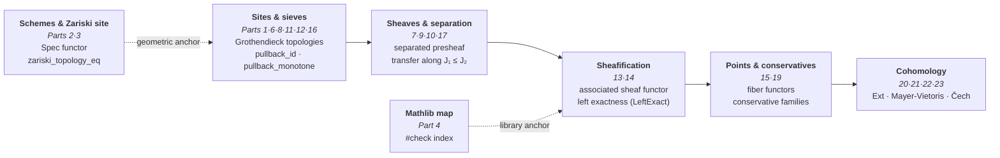
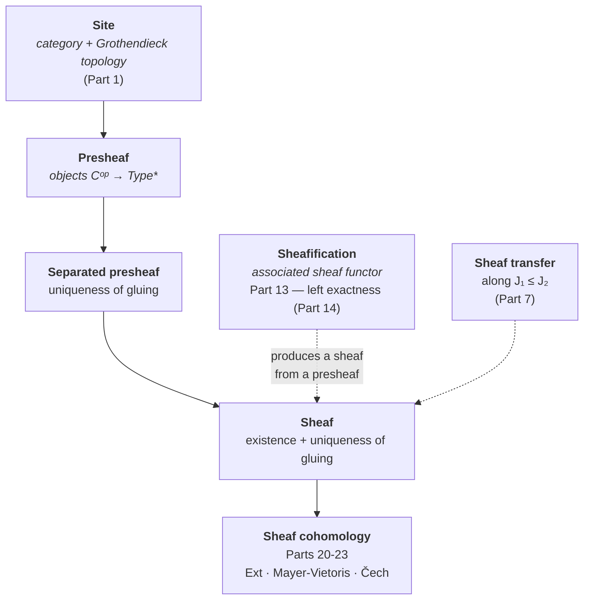

# Grothendieck Tribute — Mathlib Tour

Alexandre Grothendieck (1928-2014).

Grothendieck shifted the object of study: rather than dissecting each structure
in isolation, he built the categories, sites, and sheaves that carry them — and
let theorems fall out as corollaries. This workspace shows that this language
**already lives in Mathlib 4**: a guided tour of the Grothendieckian landscape
as the library formalizes it today.

## The spirit of the tour

This workspace is a **pedagogical homage** — deliberately **not** an attempt to
formalize EGA/SGA. The goal is to give learners a curated entry point into:

- Categories, sieves, and Grothendieck topologies
- Sheaves, separated presheaves, subcanonical topologies
- Coverage generation and sheaf characterization
- The canonical topology and subcanonical sites
- Schemes (locally ringed spaces locally Spec R) and the Zariski site
- What Mathlib has and what it doesn't (yet)

## The arc

The **46 leaf modules** (0 `sorry`, 0 axiom added) trace a coherent path, from
the raw site up to cohomology:

**Laying out the site** (Parts 1, 6, 8, 11, 12, 16). Everything starts from a
category equipped with a Grothendieck topology — trivial, discrete, dense,
canonical. Sieves there form a lattice traversed by pullback (`pullback_id`,
`pullback_pullback`, `pullback_monotone`…), and every topology can be compared,
generated, and closed under covering.

**Building the sheaf** (Parts 7, 9, 10, 13, 14, 17, 18). Above the site live
the presheaves; the gluing condition — uniqueness then existence — defines
separation and then the sheaf, transferable along J₁ ≤ J₂. Sheafification (the
associated sheaf functor, left exact) converts any presheaf into a sheaf:

**Making the points speak, measuring cohomology** (Parts 15, 19, 20-23). The
points of a site (fiber functors) and their conservative families tie the
theory to its models; sheaf cohomology — via Ext, Mayer-Vietoris, and Čech —
is its measuring instrument.

**The anchors.** On the geometry side, schemes and the Zariski site (Parts 2,
3) tie the tour back to the original algebraic geometry, with the bridge
theorem `zariski_topology_eq`. On the library side, the Mathlib map (Part 4,
a `#check` index) states honestly what exists and what is missing, and
`Calibration.lean` (Part 5) feeds the prover harness (Epic #1453).

**The categorical foundations** (Parts 24-32). Yoneda, adjunctions, monads,
comma categories, (co)limits, equivalences, Kan extensions, monoidal
categories: the bedrock on which everything above is written.

**The two recent veins** (Parts 33-46). The *six operations* thread opens with
`DirectImage.lean` (Part 33, indexing the `f^* ⊣ f_*` adjunction) then
`ExceptionalDirect.lean` (Part 34, #10357) which formalizes `f_! ⊣ f^*` at the
presheaf level — the proper-support direct image as a left Kan extension, the
missing link between `f^*` and `f_*`. In parallel, the *covering* program
(Phase 5 of Epic #2159, waves 2026-08-14..16: #10879 → #11285) systematizes
the arrow and bundled forms of the covering — from `covers_comp_iff` to the
pushforward-pullback adjunction at the covering level (Part 45, #11262) and
the bind as indexed transitivity (Part 46, #11285), through the arrow form of
the dense topology (Part 44, #11244), the pullback pseudofunctor laws and the
lattice of topologies.

## Code structure

The formalization spans **46 leaf modules** + **1 umbrella** `Grothendieck.lean`
(imports-only, bilingual inline FR/EN). The three `SheafCohomology/`
sub-modules are Parts 20, 22, and 23 of the table.

| Part | File | `_en` | Content | Lines |
|------|------|-------|---------|-------|
| root | `Grothendieck.lean` | (bilingual inline) | **Umbrella root** (imports-only + bilingual FR/EN doctring); imports all 46 leaves (complete since [#11294](https://github.com/jsboige/CoursIA/pull/11294)) | 221 |
| 1 | `Grothendieck/CategoryAndSites.lean` | `CategoryAndSites_en.lean` | Sieves, Grothendieck topologies (trivial/discrete/dense), three axioms | 243 |
| 2 | `Grothendieck/SchemesTour.lean` | `SchemesTour_en.lean` | Scheme type, Spec functor, Γ, `homeoOfIso`, fully-faithful | 196 |
| 3 | `Grothendieck/ZariskiSite.lean` | `ZariskiSite_en.lean` | Zariski pretopology, `zariskiTopology_eq` bridge theorem, subcanonical | 139 |
| 4 | `Grothendieck/MathlibMap.lean` | `MathlibMap_en.lean` | `#check` index of Grothendieck-related Mathlib definitions | 124 |
| 5 | `Grothendieck/Calibration.lean` | `Calibration_en.lean` | 4 micro-proof targets for the prover harness (Epic #1453) | 95 |
| 6 | `Grothendieck/SieveLattice.lean` | `SieveLattice_en.lean` | Sieve pullback identities (7): `pullback_id`, `pullback_pullback`, `pullback_bot`, `pullback_monotone`, `pullback_union` (#7895), `pullback_ofObjects`, `mem_iff_pullback_eq_top` | 253 |
| 7 | `Grothendieck/SheafBasics.lean` | `SheafBasics_en.lean` | Sheaf/separated presheaf basics, sheaf transfer along J₁ ≤ J₂ | 231 |
| 8 | `Grothendieck/SieveOps.lean` | `SieveOps_en.lean` | Topology ordering, covering closure, sieve composition | 208 |
| 9 | `Grothendieck/CoverageGen.lean` | `CoverageGen_en.lean` | Coverage-to-topology, sheaf characterization, sup of coverages | 233 |
| 10 | `Grothendieck/CanonicalProps.lean` | `CanonicalProps_en.lean` | Canonical topology, subcanonicity, representable sheaves | 155 |
| 11 | `Grothendieck/SieveGenerate.lean` | `SieveGenerate_en.lean` | Sieve generation identities | 243 |
| 12 | `Grothendieck/DenseTopology.lean` | `DenseTopology_en.lean` | The dense topology | 218 |
| 13 | `Grothendieck/Sheafification.lean` | `Sheafification_en.lean` | Sheafification (the associated sheaf functor) | 259 |
| 14 | `Grothendieck/LeftExact.lean` | `LeftExact_en.lean` | Left exactness of sheafification | 219 |
| 15 | `Grothendieck/SitePoints.lean` | `SitePoints_en.lean` | Points of a site (fiber functors) | 411 |
| 16 | `Grothendieck/Subcanonical.lean` | `Subcanonical_en.lean` | Subcanonical Grothendieck topologies | 232 |
| 17 | `Grothendieck/SheafHom.lean` | `SheafHom_en.lean` | Internal hom of sheaves | 273 |
| 18 | `Grothendieck/ConstantSheaf.lean` | `ConstantSheaf_en.lean` | The constant sheaf functor (bridges Mathlib `CategoryTheory.Sites.ConstantSheaf`) | 252 |
| 19 | `Grothendieck/Conservative.lean` | `Conservative_en.lean` | Conservative families of points | 501 |
| 20 | `Grothendieck/SheafCohomology/Basic.lean` | `SheafCohomology/Basic_en.lean` | Sheaf cohomology (Ext-based) | 336 |
| 21 | `Grothendieck/MayerVietorisSquare.lean` | `MayerVietorisSquare_en.lean` | Mayer-Vietoris squares | 338 |
| 22 | `Grothendieck/SheafCohomology/MayerVietoris.lean` | `SheafCohomology/MayerVietoris_en.lean` | Mayer-Vietoris long exact sequence | 235 |
| 23 | `Grothendieck/SheafCohomology/Cech.lean` | `SheafCohomology/Cech_en.lean` | Čech cohomology | 203 |
| 24 | `Grothendieck/YonedaLemma.lean` | `YonedaLemma_en.lean` | The Yoneda lemma (embedding, equivalence, naturality, fully-faithful, coyoneda) | 275 |
| 25 | `Grothendieck/Adjunction.lean` | `Adjunction_en.lean` | Adjunction of functors, unit/counit, turtle lemma, left/right adjoints | 335 |
| 26 | `Grothendieck/Monads.lean` | `Monads_en.lean` | Monads in category theory, unit, multiplication, associativity law | 253 |
| 27 | `Grothendieck/Comma.lean` | `Comma_en.lean` | Comma category, projections, functoriality | 239 |
| 28 | `Grothendieck/Limits.lean` | `Limits_en.lean` | Limits and colimits | 421 |
| 29 | `Grothendieck/Equivalences.lean` | `Equivalences_en.lean` | Equivalences of categories, fully-faithful functors, essentially surjective | 338 |
| 30 | `Grothendieck/Construction.lean` | `Construction_en.lean` | Basic categorical constructions | 256 |
| 31 | `Grothendieck/KanExtensions.lean` | `KanExtensions_en.lean` | Kan extensions (generalized limits/colimits) | 481 |
| 32 | `Grothendieck/MonoidalCategories.lean` | `MonoidalCategories_en.lean` | Monoidal categories, tensor, unit, associator | 397 |
| 33 | `Grothendieck/DirectImage.lean` | `DirectImage_en.lean` | `#check` index (8) of the `f^* ⊣ f_*` adjunction — direct/inverse image of module sheaves (#8882) | 325 |
| 34 | `Grothendieck/ExceptionalDirect.lean` | `ExceptionalDirect_en.lean` | Exceptional direct image `f_!` at the presheaf level and its adjunction `f_! ⊣ f^*` — left Kan extension of `f^*` along `f` (#10357, Phase 2 of #2159) | 202 |
| 35 | `Grothendieck/CoversArrow.lean` | `CoversArrow_en.lean` | Arrow form of the covering: `covers_monotone`, `covers_union`, `covers_inf`, `covers_comp_iff` equivalence (#10879, Phase 5 of #2159) | 199 |
| 36 | `Grothendieck/Cover.lean` | `Cover_en.lean` | Bundled covering `J.Cover X`: coe-injective, pullback/top/inf laws, `bind_mem_iff`, base condition (#10912, Phase 5 of #2159) | 284 |
| 37 | `Grothendieck/PullbackFunctor.lean` | `PullbackFunctor_en.lean` | Coherence laws of the pullback pseudofunctor on `J.Cover`: `pullback_triple`, `pullbackComp_assoc`, left/right units (#11023, Phase 5 of #2159) | 149 |
| 38 | `Grothendieck/PullbackFunctorLaws.lean` | `PullbackFunctorLaws_en.lean` | Pullback functor laws: `pullback_functor_id`, `pullback_functor_comp(_assoc)`, `covers_pullback_comp` (#11035, Phase 5 of #2159) | 141 |
| 39 | `Grothendieck/TopologyLattice.lean` | `TopologyLattice_en.lean` | Lattice laws of Grothendieck topologies: `inf/sup_covering`, `sSup_covering`, `le_covers` (#11038, Phase 5 of #2159) | 211 |
| 40 | `Grothendieck/CoversPullback.lean` | `CoversPullback_en.lean` | Arrow-form laws under pullback: `covers_pullback_comp`, `covers_bind`, `covers_iso_covering/cancel`, `covers_mono` (#11057, Phase 5 of #2159) | 202 |
| 41 | `Grothendieck/CoversOrder.lean` | `CoversOrder_en.lean` | Order laws of the arrow form `J.Covers`: `covers_top/bot_iff`, `covers_inter_iff`, `covers_of_covering`, `covers_generate_sieve` (#11068, Phase 5 of #2159) | 164 |
| 42 | `Grothendieck/PullbackCoversLaws.lean` | `PullbackCoversLaws_en.lean` | Arrow-form laws under iterated pullback: `covers_pullback_assoc`, `covers_pullback_id`, `covers_pullback_generate` (#11217, Phase 5 of #2159) | 160 |
| 43 | `Grothendieck/CoversLattice.lean` | `CoversLattice_en.lean` | Indexed lattice laws of the arrow form: `sInf/sSup_covering`, `sInf/sSup_covers` (#11231, Phase 5 of #2159) | 106 |
| 44 | `Grothendieck/CoversTopologies.lean` | `CoversTopologies_en.lean` | Arrow form of the dense topology: `dense_covers_iff`, `dense_covers_precomp` (precomposition stability), `dense_covers_id` (#11244, Phase 5 of #2159) | 115 |
| 45 | `Grothendieck/CoversPushforward.lean` | `CoversPushforward_en.lean` | Arrow form of the pushforward-pullback adjunction: `covers_pushforward_of_mem`, `covers_pushforward_monotone/comp/union`, `pushforward_id` (#11262, Phase 5 of #2159) | 166 |
| 46 | `Grothendieck/CoversBind.lean` | `CoversBind_en.lean` | Arrow form of indexed transitivity (bind): `covers_bind`, `bind_le`, `covers_bind_id`, `bind_top` (#11285, Phase 5 of #2159) | 158 |

*The `Lines` column counts the **FR file alone**; the `_en` sibling adds
roughly as much again.*

## Build & status

- **Toolchain**: `leanprover/lean4:v4.32.0` (aligned with the other SymbolicAI/Lean projects — conway_lean, game_theory_lean, calibration_lean)
- **Build**: `lake build` (WSL required). The default target (`globs := #[`Grothendieck.*]` in `lakefile.lean`) compiles **all** FR and `_en` modules. Last verified build: 2026-08-16 under v4.32.0, "Build completed successfully". The explicit target `lake build Grothendieck` (the umbrella's import closure) covers all 46 leaves — the `ExceptionalDirect` import, orphaned for 5 days ([#10357](https://github.com/jsboige/CoursIA/pull/10357) → [#11286](https://github.com/jsboige/CoursIA/issues/11286)), was repaired by [#11294](https://github.com/jsboige/CoursIA/pull/11294).
- **Proofs**: **0 `sorry`, 0 axiom added** — every module is complete at creation. (A naive `grep sorry` matches prose mentions in the bilingual docstrings, notably two in `ExceptionalDirect.lean`; CI counts in `real` mode — after comment stripping — and reads 0.)
- **Dependencies**: Mathlib 4 (via `lakefile.lean`)
- **i18n** (EPIC #4980, Option A convention ratified 2026-07-04): complete bilingual coverage — 47 FR files (1 umbrella + 46 canonical leaves) and 46 `_en.lean` siblings (`_en` namespaces anti-collision, non-docstring content byte-identical, CI-detectable). The umbrella is bilingual inline *by design* (FR canonical first, EN mirrored in the same file). **[`README.md`](./README.md)** is the FR canonical sibling of this file. Out-of-scope: `.lake/packages/`, vendored libs.

## References

The language toured here — Grothendieck topologies, sites, sheaves, and schemes — originates in Grothendieck's algebraic geometry. These are the canonical entry points; this workspace is a tour indexed against Mathlib, **not** a formalization of EGA/SGA.

- **Mac Lane, S.; Moerdijk, I.** *Sheaves in Geometry and Logic: A First Introduction to Topos Theory*. Springer Universitext, 1992. — Standard reference for Grothendieck topologies, sieves, sites, and sheaves (Parts 1, 6-8, 10, 13-14).
- **Artin, M.; Grothendieck, A.; Verdier, J. L.**, eds. *Théorie des topos et cohomologie étale des schémas* (SGA 4). Springer Lecture Notes in Mathematics 269, 270, 305, 1972-1973. — Origin of sites, Grothendieck topologies, and points of a topos (Parts 1, 15, 19).
- **Grothendieck, A.; Dieudonné, J.** *Éléments de géométrie algébrique* (EGA). Publications Mathématiques de l'IHÉS, 1960-1967. — Origin of schemes and the Zariski site (Parts 2-3).
- **Vakil, R.** *The Rising Sea: Foundations of Algebraic Geometry*. — Widely used pedagogical notes in the Grothendieckian spirit.
- **The Stacks Project.** [stacks.math.columbia.edu](https://stacks.math.columbia.edu) — Reference for schemes, sheafification, and sheaf cohomology (Parts 13, 20-23).
- **The Mathlib Community.** *Mathlib4, Category Theory and Sites*. [mathlib4 docs](https://leanprover-community.github.io/mathlib4_docs/) — The library this tour indexes (Part 4); see de Moura & Ullrich, "The Lean 4 Theorem Prover" (2021).
- **nLab.** [ncatlab.org](https://ncatlab.org) — Entries on Grothendieck topology, sieve, site, sheaf, and sheafification.

## See also

- Epic #1646 (Grothendieck tribute) — Issue #2159 (formalization depth: Phase 1 shipped, Phase 2 = #10357, Phase 5 = Parts 35-46)
- EPIC #4980 — Lean i18n convention (Option A sibling pair; 46 `_en` pairs in this lake)
- Epic #1453 (prover harness calibration) — Issue #8960 (reconciling the two `Part` numberings)
- [#11286](https://github.com/jsboige/CoursIA/issues/11286) — umbrella import of `ExceptionalDirect` (resolved by [#11294](https://github.com/jsboige/CoursIA/pull/11294))
- Conway tribute workspace (`../conway_lean/`) — Lean notebook series (`../README.md`)
- **[`README.md`](./README.md)** — FR canonical sibling of this file

## Scope, honestly

Every result is fully proven (0 `sorry`, 0 axiom added), and Part 4's `#check`
index documents explicitly the boundary between what Mathlib has and what it
does not (yet) — the tour exposes that boundary rather than papering over it.
The companion `Calibration.lean` (Part 5) ties the formalization to the
broader proving effort.

This tribute is a **curated index** that lets learners see the library through
Grothendieckian eyes; Issue #2159 / Epic #1646 track further formalization —
this tour is the foundation, not the ceiling. To go further: `conway_lean/`
and the Lean notebook series as companions; Mac Lane–Moerdijk and SGA 4 for
the topos-theoretic core; Vakil and the Stacks Project for schemes and
cohomology.
