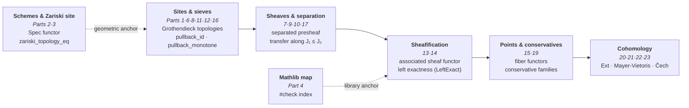
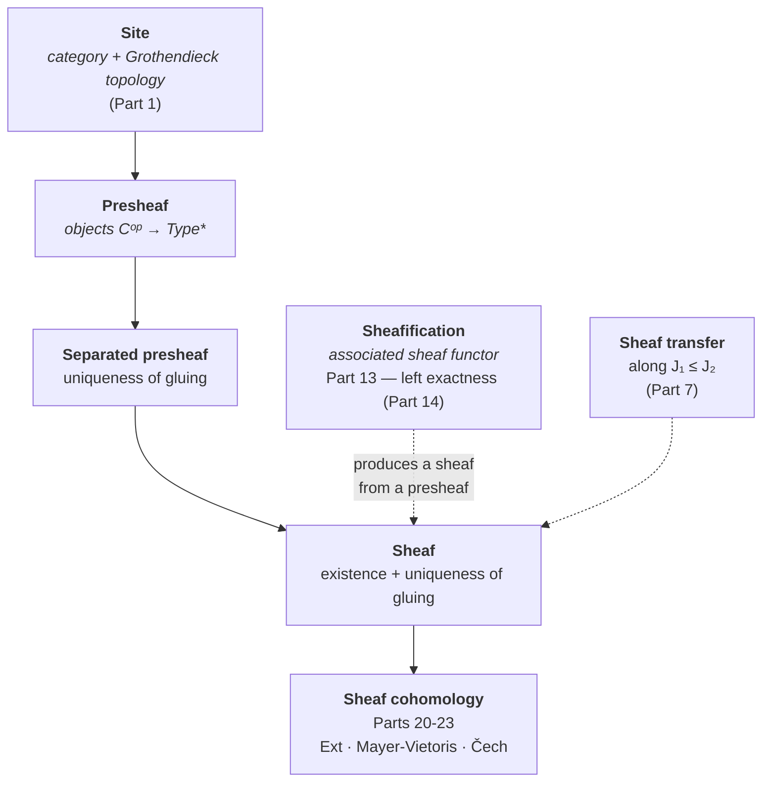

# Grothendieck Tribute — Mathlib Tour

Alexandre Grothendieck (1928-2014).

Grothendieck shifted the object of study: rather than dissecting each structure
in isolation, he built the categories, sites, and sheaves that carry them — and
let theorems fall out as corollaries. This workspace shows that this language
**already lives in Mathlib 4**: a guided tour of the Grothendieckian landscape
as the library formalizes it today.

## The spirit of the tour

This workspace is a **pedagogical homage** — deliberately **not** an attempt to
formalize EGA/SGA. The goal is to give learners a curated entry point into:

- Categories, sieves, and Grothendieck topologies
- Sheaves, separated presheaves, subcanonical topologies
- Coverage generation and sheaf characterization
- The canonical topology and subcanonical sites
- Schemes (locally ringed spaces locally Spec R) and the Zariski site
- What Mathlib has and what it doesn't (yet)

## How to read this workspace

Three paths are offered depending on your goal:

1. **Reader discovering Grothendieck for the first time.** Follow the arc « laying out the site → building the sheaf → letting the points speak ». Parts 1 (categories and sites), 6 (sieves), 8 (order on topologies) lay the foundations; 13 (sheafification) and 14 (left exactness) deliver the key theorem; 15 (points of a site) and 19 (conservative families) tie the theory to its models; 20-23 (cohomology) measure the obstruction. The table of Parts below gives a one-line content summary per module.

2. **Reader interested in the six operations** (direct image / inverse image / exceptional image). The thread runs from Part 33 (`DirectImage`, `f^* ⊣ f_*`) to Part 34 (`ExceptionalDirect`, `f_! ⊣ f^*`), then Part 68 (`ExceptionalTriple`, `f_! ⊣ f^* ⊣ f_*` in full). Three adjunctions, ordered best-known to least-known.

3. **Reader interested in the Lawvere–Tierney ↔ Grothendieck bridge.** Parts 58 (classifier `Ω`), 59 (closure operator `j` on Ω), 60 (the dictionary: Grothendieck topologies = Lawvere–Tierney topologies, the two notions coincide). This is the bridge where categorical logic meets relative geometry.

**Navigation conventions.** Modules are grouped into `Grothendieck/` and `SheafCohomology/` folders; each `Foo.lean` module has a sibling `Foo_en.lean` for the English version (i18n convention, EPIC #4980). The table below gives, for each Part, the FR module + the `_en` module + one content line.

## The arc

Les **74 modules leaf** (0 `sorry`, 0 axiome ajouté) tracent un chemin cohérent,
du site brut jusqu'à la cohomologie :

**Laying out the site** (Parts 1, 6, 8, 11, 12, 16). Everything starts from a
category equipped with a Grothendieck topology — trivial, discrete, dense,
canonical. Sieves there form a lattice traversed by pullback (`pullback_id`,
`pullback_pullback`, `pullback_monotone`…), and every topology can be compared,
generated, and closed under covering.

**Building the sheaf** (Parts 7, 9, 10, 13, 14, 17, 18). Above the site live
the presheaves; the gluing condition — uniqueness then existence — defines
separation and then the sheaf, transferable along J₁ ≤ J₂. Sheafification (the
associated sheaf functor, left exact) converts any presheaf into a sheaf:

**Making the points speak, measuring cohomology** (Parts 15, 19, 20-23). The
points of a site (fiber functors) and their conservative families tie the
theory to its models; sheaf cohomology — via Ext, Mayer-Vietoris, and Čech —
is its measuring instrument.

**The anchors.** On the geometry side, schemes and the Zariski site (Parts 2,
3) tie the tour back to the original algebraic geometry, with the bridge
theorem `zariski_topology_eq`. On the library side, the Mathlib map (Part 4,
a `#check` index) states honestly what exists and what is missing, and
`Calibration.lean` (Part 5) reuses the prover harness calibration taxonomy
(Epic #1453, P1-P4) without being consumed by it: the harness's live targets
live in `calibration_lean/` (HARNESS class, boundary arbitrated in #13212).

**The categorical foundations** (Parts 24-32). Yoneda, adjunctions, monads,
comma categories, (co)limits, equivalences, Kan extensions, monoidal
categories: the bedrock on which everything above is written.

**The two recent veins** (Parts 33-44). The *six operations* thread opens with
`DirectImage.lean` (Part 33, indexing the `f^* ⊣ f_*` adjunction) then
`ExceptionalDirect.lean` (Part 34, #10357) which formalizes `f_! ⊣ f^*` at the
presheaf level — the proper-support direct image as a left Kan extension, the
missing link between `f^*` and `f_*`. In parallel, the *covering* program
(Phase 5 of Epic #2159, waves 2026-08-14..16: #10879 → #11244) systematizes
the arrow and bundled forms of the covering — from `covers_comp_iff` to the
arrow form of the dense topology (Part 44), through the pullback pseudofunctor
laws and the lattice of topologies. A third vein opens with `Classifier.lean` (Part 58, #2159): the **subobject classifier** Ω — literally the presheaf of sieves of Part 6 — which makes presheaves and sheaves of sets over an essentially small site elementary topoi (Lawvere–Tierney). It closes in two steps: `LawvereTierney.lean` (Part 59) installs the closure operator `j` on Ω (three laws + naturality), then `TopologyDictionary.lean` (Part 60) proves the **dictionary** — Grothendieck topologies and Lawvere–Tierney topologies are the same data, the two transports being inverse to each other.

## Code structure

La formalisation couvre **74 modules leaf** + **1 umbrella** `Grothendieck.lean`
(imports-only, bilingue inline FR/EN). Les trois sous-modules de
`SheafCohomology/` sont les Parties 20, 22 et 23 du tableau.

| Part | File | `_en` | Content | Lines |
|------|------|-------|---------|-------|
| racine | `Grothendieck.lean` | (bilingue inline) | **Racine umbrella** (imports-only + docstring bilingue FR/EN) ; importe une sélection de leaf FR et un sous-ensemble des siblings `_en` (cf. corps du fichier ; les 74 leaf FR et 74 siblings `_en` sont auto-découverts par les `globs` du lakefile — l'umbrella n'importe pas tous les `_en`, par design) ; `ExceptionalDirect` importé c.2026-08-15, **fermeture #11286** | 273 |
| 1 | `Grothendieck/CategoryAndSites.lean` | `CategoryAndSites_en.lean` | Sieves, Grothendieck topologies (trivial/discrete/dense), three axioms | 243 |
| 2 | `Grothendieck/SchemesTour.lean` | `SchemesTour_en.lean` | Scheme type, Spec functor, Γ, `homeoOfIso`, fully-faithful | 196 |
| 3 | `Grothendieck/ZariskiSite.lean` | `ZariskiSite_en.lean` | Zariski pretopology, `zariskiTopology_eq` bridge theorem, subcanonical | 139 |
| 4 | `Grothendieck/MathlibMap.lean` | `MathlibMap_en.lean` | `#check` index of Grothendieck-related Mathlib definitions | 124 |
| 5 | `Grothendieck/Calibration.lean` | `Calibration_en.lean` | 4 micro-proof targets in the spirit of the prover harness (Epic #1453, not consumed by it — cf `calibration_lean/`, boundary #13212) | 95 |
| 6 | `Grothendieck/SieveLattice.lean` | `SieveLattice_en.lean` | Sieve pullback identities (7): `pullback_id`, `pullback_pullback`, `pullback_bot`, `pullback_monotone`, `pullback_union` (#7895), `pullback_ofObjects`, `mem_iff_pullback_eq_top` | 253 |
| 7 | `Grothendieck/SheafBasics.lean` | `SheafBasics_en.lean` | Sheaf/separated presheaf basics, sheaf transfer along J₁ ≤ J₂ | 231 |
| 8 | `Grothendieck/SieveOps.lean` | `SieveOps_en.lean` | Topology ordering, covering closure, sieve composition | 208 |
| 9 | `Grothendieck/CoverageGen.lean` | `CoverageGen_en.lean` | Coverage-to-topology, sheaf characterization, sup of coverages | 233 |
| 10 | `Grothendieck/CanonicalProps.lean` | `CanonicalProps_en.lean` | Canonical topology, subcanonicity, representable sheaves | 155 |
| 11 | `Grothendieck/SieveGenerate.lean` | `SieveGenerate_en.lean` | Sieve generation identities | 243 |
| 12 | `Grothendieck/DenseTopology.lean` | `DenseTopology_en.lean` | The dense topology | 218 |
| 13 | `Grothendieck/Sheafification.lean` | `Sheafification_en.lean` | Sheafification (the associated sheaf functor) | 259 |
| 14 | `Grothendieck/LeftExact.lean` | `LeftExact_en.lean` | Left exactness of sheafification | 219 |
| 15 | `Grothendieck/SitePoints.lean` | `SitePoints_en.lean` | Points of a site (fiber functors) | 411 |
| 16 | `Grothendieck/Subcanonical.lean` | `Subcanonical_en.lean` | Subcanonical Grothendieck topologies | 232 |
| 17 | `Grothendieck/SheafHom.lean` | `SheafHom_en.lean` | Internal hom of sheaves | 273 |
| 18 | `Grothendieck/ConstantSheaf.lean` | `ConstantSheaf_en.lean` | The constant sheaf functor (bridges Mathlib `CategoryTheory.Sites.ConstantSheaf`) | 252 |
| 19 | `Grothendieck/Conservative.lean` | `Conservative_en.lean` | Conservative families of points | 501 |
| 20 | `Grothendieck/SheafCohomology/Basic.lean` | `SheafCohomology/Basic_en.lean` | Sheaf cohomology (Ext-based) | 336 |
| 21 | `Grothendieck/MayerVietorisSquare.lean` | `MayerVietorisSquare_en.lean` | Mayer-Vietoris squares | 338 |
| 22 | `Grothendieck/SheafCohomology/MayerVietoris.lean` | `SheafCohomology/MayerVietoris_en.lean` | Mayer-Vietoris long exact sequence | 235 |
| 23 | `Grothendieck/SheafCohomology/Cech.lean` | `SheafCohomology/Cech_en.lean` | Čech cohomology | 203 |
| 24 | `Grothendieck/YonedaLemma.lean` | `YonedaLemma_en.lean` | The Yoneda lemma (embedding, equivalence, naturality, fully-faithful, coyoneda) | 275 |
| 25 | `Grothendieck/Adjunction.lean` | `Adjunction_en.lean` | Adjunction of functors, unit/counit, turtle lemma, left/right adjoints | 335 |
| 26 | `Grothendieck/Monads.lean` | `Monads_en.lean` | Monads in category theory, unit, multiplication, associativity law | 253 |
| 27 | `Grothendieck/Comma.lean` | `Comma_en.lean` | Comma category, projections, functoriality | 239 |
| 28 | `Grothendieck/Limits.lean` | `Limits_en.lean` | Limits and colimits | 421 |
| 29 | `Grothendieck/Equivalences.lean` | `Equivalences_en.lean` | Equivalences of categories, fully-faithful functors, essentially surjective | 338 |
| 30 | `Grothendieck/Construction.lean` | `Construction_en.lean` | Basic categorical constructions | 256 |
| 31 | `Grothendieck/KanExtensions.lean` | `KanExtensions_en.lean` | Kan extensions (generalized limits/colimits) | 481 |
| 32 | `Grothendieck/MonoidalCategories.lean` | `MonoidalCategories_en.lean` | Monoidal categories, tensor, unit, associator | 397 |
| 33 | `Grothendieck/DirectImage.lean` | `DirectImage_en.lean` | `#check` index (8) of the `f^* ⊣ f_*` adjunction — direct/inverse image of module sheaves (#8882) | 325 |
| 34 | `Grothendieck/ExceptionalDirect.lean` | `ExceptionalDirect_en.lean` | Exceptional direct image `f_!` at the presheaf level and its adjunction `f_! ⊣ f^*` — left Kan extension of `f^*` along `f` (#10357, Phase 2 of #2159) | 202 |
| 35 | `Grothendieck/CoversArrow.lean` | `CoversArrow_en.lean` | Arrow form of the covering: `covers_monotone`, `covers_union`, `covers_inf`, `covers_comp_iff` equivalence (#10879, Phase 5 of #2159) | 199 |
| 36 | `Grothendieck/Cover.lean` | `Cover_en.lean` | Bundled covering `J.Cover X`: coe-injective, pullback/top/inf laws, `bind_mem_iff`, base condition (#10912, Phase 5 of #2159) | 284 |
| 37 | `Grothendieck/PullbackFunctor.lean` | `PullbackFunctor_en.lean` | Coherence laws of the pullback pseudofunctor on `J.Cover`: `pullback_triple`, `pullbackComp_assoc`, left/right units (#11023, Phase 5 of #2159) | 149 |
| 38 | `Grothendieck/PullbackFunctorLaws.lean` | `PullbackFunctorLaws_en.lean` | Pullback functor laws: `pullback_functor_id`, `pullback_functor_comp(_assoc)`, `covers_pullback_comp` (#11035, Phase 5 of #2159) | 141 |
| 39 | `Grothendieck/TopologyLattice.lean` | `TopologyLattice_en.lean` | Lattice laws of Grothendieck topologies: `inf/sup_covering`, `sSup_covering`, `le_covers` (#11038, Phase 5 of #2159) | 211 |
| 40 | `Grothendieck/CoversPullback.lean` | `CoversPullback_en.lean` | Arrow-form laws under pullback: `covers_pullback_comp`, `covers_bind`, `covers_iso_covering/cancel`, `covers_mono` (#11057, Phase 5 of #2159) | 202 |
| 41 | `Grothendieck/CoversOrder.lean` | `CoversOrder_en.lean` | Order laws of the arrow form `J.Covers`: `covers_top/bot_iff`, `covers_inter_iff`, `covers_of_covering`, `covers_generate_sieve` (#11068, Phase 5 of #2159) | 164 |
| 42 | `Grothendieck/PullbackCoversLaws.lean` | `PullbackCoversLaws_en.lean` | Arrow-form laws under iterated pullback: `covers_pullback_assoc`, `covers_pullback_id`, `covers_pullback_generate` (#11217, Phase 5 of #2159) | 160 |
| 43 | `Grothendieck/CoversLattice.lean` | `CoversLattice_en.lean` | Indexed lattice laws of the arrow form: `sInf/sSup_covering`, `sInf/sSup_covers` (#11231, Phase 5 of #2159) | 106 |
| 44 | `Grothendieck/CoversTopologies.lean` | `CoversTopologies_en.lean` | Arrow form of the dense topology: `dense_covers_iff`, `dense_covers_precomp` (precomposition stability), `dense_covers_id` (#11244, Phase 5 of #2159) | 115 |
| 45 | `Grothendieck/CoversBind.lean` | `CoversBind_en.lean` | Sequential composition of the arrow form `J.Covers`: `covers_bind`, `covers_bind_assoc`, `covers_bind_id_left/right`, `covers_bind_of_covering` (PR #11285 MERGED 2026-08-16 by po-2025, Part 46 of #2159) | 138 |
| 46 | `Grothendieck/CoversPushforward.lean` | `CoversPushforward_en.lean` | Direct image of the arrow form along a functor: `covers_pushforward`, `covers_pushforward_comp`, `covers_pushforward_iso`, `covers_pushforward_of_covering` (PR #11262 MERGED 2026-08-16 by po-2025, Part 45 of #2159) | 152 |
| 52 | `Grothendieck/CoversCoverageArrow.lean` | `CoversCoverageArrow_en.lean` | Arrow form of the topology generated by a `Coverage` (#11396, Phase 5 of #2159) | 174 |
| 53 | `Grothendieck/CoversPrecoverageArrow.lean` | `CoversPrecoverageArrow_en.lean` | Arrow form of the topology generated by a pre-coverage `Precoverage.toGrothendieck`: bridge `covers_iff_toGrothendieck` with the inductive extension `Saturate` (#11402, Phase 5 of #2159) | 187 |
| 54 | `Grothendieck/CoversPretopologyArrow.lean` | `CoversPretopologyArrow_en.lean` | Arrow form of the **topology generated by a pretopology** (`Pretopology.toGrothendieck`): central bridge `covers_iff_toGrothendieck`, `covers_of_mem_toGrothendieck`, `covers_iff_pullback_toGrothendieck` (Phase 5 of #2159) | 189 |
| 55a | `Grothendieck/CoversCoherentArrow.lean` | `CoversCoherentArrow_en.lean` | Arrow form of the **coherent topology** (`coherentTopology`): instantiation of the `covers_iff_toGrothendieck` / pullback-stability pattern (Phase 5 of #2159) | 183 |
| 55b | `Grothendieck/CoversRegularArrow.lean` | `CoversRegularArrow_en.lean` | Arrow form of the **regular topology** (`regularTopology`, `Preregular` category): same bridge pattern (Phase 5 of #2159) | 175 |
| 55c | `Grothendieck/CoversExtensiveArrow.lean` | `CoversExtensiveArrow_en.lean` | Arrow form of the **extensive topology** (`extensiveTopology`, `FinitaryPreExtensive` category): same bridge pattern (Phase 5 of #2159) | 181 |
| 56 | `Grothendieck/CoversZariskiArrow.lean` | `CoversZariskiArrow_en.lean` | Arrow form of the **Zariski topology** (first named concrete topology of the series): `covers_iff_zariski` + geometric characterization by open covers `covers_iff_exists_cover` (Phase 5 of #2159, standalone on main) | 233 |
| 57 | `Grothendieck/CoversAtomicArrow.lean` | `CoversAtomicArrow_en.lean` | Arrow form of the **atomic topology** (`GrothendieckTopology.atomic`, right Ore condition): pointwise bridge `atomic_covering` (the missing analogue of `dense_covering`), `covers_iff_atomic` (central), `covers_atomic_of_mem`, stability `covers_atomic_precomp`, collapses `covers_atomic_id`/`covers_atomic_top` (Phase 5 of #2159) | 159 |
| 58 | `Grothendieck/Classifier.lean` | `Classifier_en.lean` | **The subobject classifier**: Ω = the presheaf of sieves (`Functor.sieves`), `truth`/`χ`, `Presheaf.classifier`, J-closed sieves (`Sheaf.Ω`), `HasSubobjectClassifier` instances for presheaves + sheaves; 4 own theorems (`truth_picks_top`, `chi_app_mem_iff`, `chi_app_downward_closed`, `chi_app_eq_top_of_app`) (Part 58 of #2159) | 202 |
| 59 | `Grothendieck/LawvereTierney.lean` | `LawvereTierney_en.lean` | **The Lawvere–Tierney topology**: the closure operator on Ω (`LawvereTierney`), 3 laws (extensivity, idempotence, meet preservation) + naturality under pullback; discrete (`j S = S`) and indiscrete (`j S = ⊤`) topologies, `j_top`/`j_monotone`/`closure_isClosed`, closed sieves of the indiscrete (Part 59 of #2159) | 241 |
| 60 | `Grothendieck/TopologyDictionary.lean` | `TopologyDictionary_en.lean` | **The Grothendieck ↔ Lawvere–Tierney dictionary**: the closure `jClosure J S = {f \| S.pullback f ∈ J}` (direction J → j, `grothendieckToLawvereTierney`), the dense sieves `j S = ⊤` (direction j → J, `lawvereTierneyToGrothendieck`), central bridge `covering_iff_jClosure`, and the **two inverse round-trips** — the frontier declared open by Part 59 ("requires an operator absent from Mathlib v4.32.1") is closed by building it from the raw axioms (Part 60 of #2159) | 328 |
| 61 | `Grothendieck/SitesComparison.lean` | `SitesComparison_en.lean` | **Continuous functors and the comparison lemma**: the presheaf→sheaf bridge (`sheafPushforwardContinuous`), functoriality (identity, composition — the sheaf-level mirror of `pullback_pullback`), and the induced adjunction on sheaf categories `adjunction_sheafPushforwardContinuous` (**SGA 4 III.1.6**) — adjunctions descend to sheaves without explicit sheafification (Part 61 of #2159) | 158 |
| 62 | `Grothendieck/PlusConstruction.lean` | `PlusConstruction_en.lean` | **The Plus construction**: the constructive ingredient of the two-pass sheafification (SGA 4 II.3) — functoriality (`plusFunctor`), canonical arrow `toPlus` (naturality), key identity `(P ⟶ P⁺)⁺ = P⁺ ⟶ P⁺⁺`, sheaf fixed point (`isoToPlus`), universal property of the lift (`plusLift`/`plusLift_unique`/`plus_hom_ext`) (Part 62 of #2159) | 196 |
| 63 | `Grothendieck/SheafCondition.lean` | `SheafCondition_en.lean` | **The sheaf condition as equalizer product**: reformulation of `Presheaf.IsSheaf J P` as the equalizer diagram `P(X) → ∏ᵢ P(U_i) ⇉ ∏ᵢⱼ P(U_i ×_X U_j)` — sieve form (`sheaf_iff_equalizer_sieve`), arrow-family form under `HasPullbacks C` (`sheaf_iff_equalizer_arrows`, Stacks 00VM), pretopology bridge (`sheaf_pretopology_iff`, Stacks 00VL, SGA 4 II.1) (Part 63 of #2159) | 129 |
| 64 | `Grothendieck/SheafConditionInvariance.lean` | `SheafConditionInvariance_en.lean` | **Invariance de la condition de faisceau** : stabilité de `Presheaf.IsSheaf` sous changement de site équivalent (morphismes couverts, équivalence de catégories, refinements) — pont avec Partie 61 | — |
| 65 | `Grothendieck/SheafConditionCharacterization.lean` | `SheafConditionCharacterization_en.lean` | **Caractérisations de la condition de faisceau** : reformulations équivalentes de `Presheaf.IsSheaf` sous des hypothèses structurelles (présence de produits fibrés, finitude) — pont direct avec Partie 63 | — |
| 66 | `Grothendieck/SheafTopologySpectrum.lean` | `SheafTopologySpectrum_en.lean` | **Spectre de topologies de Grothendieck** : treillis des topologies sur un site fixé, comparaisons canoniques (discrète, triviale, canonique, sous-canonique, dense) | — |
| 67 | `Grothendieck/LocalSurjectivitySpectrum.lean` | `LocalSurjectivitySpectrum_en.lean` | **Spectre de la surjectivité locale** : treillis des conditions de surjectivité locale (faithfully flat, fppf, étale) et leurs rapports | — |
| 68 | `Grothendieck/Spaces.lean` | `Spaces_en.lean` | **Espaces annelés** : la structure `RingedSpace` revisitée pour le contexte topos-théorique (introduction pédagogique, pré-Partie 2) | — |
| 69 | `Grothendieck/CoversEtaleArrow.lean` | `CoversEtaleArrow_en.lean` | **Forme flèche de la topologie étale** : instanciation du patron `covers_iff_toGrothendieck` sur `GrothendieckTopology.etale` (Phase 5 de #2159, voisinage des Parties 55a-c) | — |
| 70 | `Grothendieck/SpacesMathlib.lean` | `SpacesMathlib_en.lean` | **Espaces Mathlib** : index `#check` des constructions Mathlib liées aux `RingedSpace` / `SheafedSpace` / `PresheafedSpace` — cartographie pédagogique | — |
| 71 | `Grothendieck/SpacesSubcanonical.lean` | `SpacesSubcanonical_en.lean` | **Espaces sous-canoniques** : instanciation du critère de sous-canonicalité (Partie 16) sur les espaces annelés | — |
| 72 | `Grothendieck/Stalks.lean` | `Stalks_en.lean` | **Tige du représentable** : `unique_stalk_yoneda`, `isEmpty_stalk_yoneda` et `nonempty_stalk_yoneda_iff` montrent qu'elle est un singleton si `x ∈ U`, et vide sinon — premier maillon faisceaux ↔ espaces étalés (cf. PR #14903) | 110 |
| 73 | `Grothendieck/StalkPoints.lean` | `StalkPoints_en.lean` | **Le foncteur fibre du point est la tige** : `opensPoint` et l'isomorphisme naturel `stalkFiberIso` réalisent le TODO explicite de Mathlib `Topology/Sheaves/Points.lean` (SGA 4 IV 6.3 ; cf. PR #14919) | 210 |
| 74 | `Grothendieck/StalkSeparated.lean` | `StalkSeparated_en.lean` | **Les tiges détectent l'égalité des sections (préfaisceau séparé)** : `eq_of_germ_eq_of_isSeparated` — relâchement séparé du `section_ext` Mathlib (cf. PR #15416) | 154 |
| 75 | `Grothendieck/StalkGluing.lean` | `StalkGluing_en.lean` | **Recollement des familles de germes** : toute famille localement représentable provient d'une unique section globale ; reformulation comme surjectivité vers le sous-type `GermFamily.IsLocallyRepresentable` | 161 |
| 35 (complément) | `Grothendieck/ExceptionalTriple.lean` | `ExceptionalTriple_en.lean` | **Triade d'images exceptionnelles** : `f_! ⊣ f^* ⊣ f_*` au niveau préfaisceau — complément à la Partie 35, autour de l'image réciproque (pont avec Partie 34 `ExceptionalDirect` et Partie 33 `DirectImage`) | — |
| hors-série | `Grothendieck/Fppf.lean` | `Fppf_en.lean` | **Topologie fppf** : forme flèche de la topologie fidèlement plate de présentation finie — module sans numéro de Partie déclaré | — |

*The `Lines` column counts the **FR file alone**; the `_en` sibling adds
roughly as much again.*

## Build & status

- **Toolchain**: `leanprover/lean4:v4.33.0` (cf. `lean-toolchain` of the lake; migration v4.32.1 → v4.33.0 happened post-#11294, attested by `git log -- lean-toolchain`)
- **Build** : `lake build` (WSL requis). La cible par défaut (`globs := #[`Grothendieck.*]` dans `lakefile.lean`) compile **tous** les modules FR et `_en` (75 sources de modules FR : 1 umbrella + 74 leaf, auxquelles s'ajoutent 74 modules `_en`, soit 149 sources de modules ; le lake contient 150 fichiers `.lean` en comptant aussi `lakefile.lean`, vérifié par `git ls-tree -r HEAD`). Dernier build vérifié sur la branche de cette PR : `lake build Grothendieck` SUCCESS local (preuve jointe dans le body de PR, §Validation). Le compte disque **74 leaf FR + 74 leaf `_en` + 1 umbrella** est contrôlé par `scripts/lean/check_grothendieck_readme.py` (sortie JSON, code non nul en cas de dérive).
- **Proofs**: **0 `sorry`, 0 axiom added** — every module is complete at creation. (A naive `grep sorry` matches prose mentions in the bilingual docstrings, notably two in `ExceptionalDirect.lean`; CI counts in `real` mode — after comment stripping — and reads 0.)
- **Dependencies**: Mathlib 4 (via `lakefile.lean`)
- **i18n** (EPIC #4980, convention Option A ratifiée le 2026-07-04) : couverture bilingue complète — **75 fichiers FR** (1 umbrella `Grothendieck.lean` + 74 leaf canoniques, mesurés par `git ls-tree -r HEAD`) et **74 siblings `_en.lean`**, ratio 1:1 intégral (vérifié par `scripts/lean/check_i18n_siblings.py`). Le gap historique `PullbackFunctor.lean` sans `_en` est fermé depuis c.2026-08-18 : `PullbackFunctor_en.lean` est sur disque, et les **74** modules FR ont leur sibling `_en`. Les namespaces `_en` évitent les collisions et le contenu hors docstrings reste byte-identique, vérifiable par CI. L'umbrella est bilingue inline *by design* (FR canonique d'abord, EN en miroir dans le même fichier). **[`README.md`](./README.md)** est le sibling FR canonique. Hors scope : `.lake/packages/`, bibliothèques vendored.

*Note de cohérence* : couverture 1:1 intégrale — 74 leaf FR canoniques et 74 siblings `_en` (le gap historique `PullbackFunctor` sans `_en`, nommé dans d'anciennes révisions, est fermé sur disque). Le `globs` du lakefile auto-découvre chaque module présent, FR comme `_en`. Vérification reproductible : `python scripts/lean/check_grothendieck_readme.py` — code non nul à la moindre dérive entre la prose et le disque.

## References

The language toured here — Grothendieck topologies, sites, sheaves, and schemes — originates in Grothendieck's algebraic geometry. These are the canonical entry points; this workspace is a tour indexed against Mathlib, **not** a formalization of EGA/SGA.

- **Mac Lane, S.; Moerdijk, I.** *Sheaves in Geometry and Logic: A First Introduction to Topos Theory*. Springer Universitext, 1992. — Standard reference for Grothendieck topologies, sieves, sites, and sheaves (Parts 1, 6-8, 10, 13-14).
- **Artin, M.; Grothendieck, A.; Verdier, J. L.**, eds. *Théorie des topos et cohomologie étale des schémas* (SGA 4). Springer Lecture Notes in Mathematics 269, 270, 305, 1972-1973. — Origin of sites, Grothendieck topologies, and points of a topos (Parts 1, 15, 19).
- **Grothendieck, A.; Dieudonné, J.** *Éléments de géométrie algébrique* (EGA). Publications Mathématiques de l'IHÉS, 1960-1967. — Origin of schemes and the Zariski site (Parts 2-3).
- **Vakil, R.** *The Rising Sea: Foundations of Algebraic Geometry*. — Widely used pedagogical notes in the Grothendieckian spirit.
- **The Stacks Project.** [stacks.math.columbia.edu](https://stacks.math.columbia.edu) — Reference for schemes, sheafification, and sheaf cohomology (Parts 13, 20-23).
- **The Mathlib Community.** *Mathlib4, Category Theory and Sites*. [mathlib4 docs](https://leanprover-community.github.io/mathlib4_docs/) — The library this tour indexes (Part 4); see de Moura & Ullrich, "The Lean 4 Theorem Prover" (2021).
- **nLab.** [ncatlab.org](https://ncatlab.org) — Entries on Grothendieck topology, sieve, site, sheaf, and sheafification.

## See also

- Epic #1646 (hommage à Grothendieck) — Issue #2159 (profondeur de formalisation : Phase 1 livrée, Phase 2 = #10357, Phase 5 = Parties 35-44, puis Parties 64-75)
- EPIC #4980 — convention i18n Lean (Option A sibling pair ; 74 paires `_en` dans ce lake, ratio 1:1)
- Epic #1453 (prover harness calibration) — Issue #8960 (reconciling the two `Part` numberings)
- ~~#11286~~ — **CLOSED** 2026-08-16 (PR #11294 MERGED): umbrella import of `ExceptionalDirect` realized; the #10357 orphan lived 6 weeks before this merge
- Conway tribute workspace (`../conway_lean/`) — Lean notebook series (`../README.md`)
- **[`README.md`](./README.md)** — FR canonical sibling of this file

## Scope, honestly

Every result is fully proven (0 `sorry`, 0 axiom added), and Part 4's `#check`
index documents explicitly the boundary between what Mathlib has and what it
does not (yet) — the tour exposes that boundary rather than papering over it.
The companion `Calibration.lean` (Part 5) ties the formalization to the
broader proving effort.

This tribute is a **curated index** that lets learners see the library through
Grothendieckian eyes; Issue #2159 / Epic #1646 track further formalization —
this tour is the foundation, not the ceiling. To go further: `conway_lean/`
and the Lean notebook series as companions; Mac Lane–Moerdijk and SGA 4 for
the topos-theoretic core; Vakil and the Stacks Project for schemes and
cohomology.

## Digestion (grid #13106)

First-level digestion of the lake against the mandatory grid of [#13106](https://github.com/jsboige/CoursIA/issues/13106) (digestion & canonicalisation EPIC). Verdicts based on the README, module docstrings and formalisation issues — marked PRESENT/PARTIAL/ABSENT with the verified `file:line` evidence. A finer digestion (reconstructing each `Partie`'s path) remains for dedicated grains.

| # | Grid point | Verdict | Evidence / status |
|---|---|---|---|
| 1 | Exact statement + guarantee level | **PRESENT** | modules `Grothendieck/*.lean` ; guarantee "0 `sorry`, 0 added axiom" (`README.md` §Build & status, `lakefile.lean` `globs`) |
| 2 | Provenance, literature, priority, attribution | **PARTIAL** | §References (`README.md`: Mac Lane–Moerdijk, SGA 4, EGA, Vakil, Stacks, Mathlib, nLab) + docstrings citing SGA 4 I/II (§ `CategoryAndSites.lean:1-20`) ; attribution **per `Partie`** (which author, which snippet) is not systematic |
| 3 | Real novelty vs dependencies | **PARTIAL** | "already lives in Mathlib 4", boundary indexed by Partie 4 (`#check`) ; no explicit claim "what this lake adds to Mathlib" |
| 4 | Dependency / toolchain / axioms map | **PRESENT** | §Build & status (`README.md`): v4.32.1 toolchain, Mathlib dependency, 0 added axiom ; i18n #4980 |
| 5 | Trivial vs new developed | **PARTIAL** | the arc (sites→sheaves→cohomology) stratifies, but trivial/new is not declared party-by-party |
| 6 | Natural friction (obstacles, failed tries, debt) | **ABSENT→filled below** | §Scope, honestly + `Classifier.lean:190` (`ElementaryTopos` "not yet available"), `#11286` (pending umbrella import of `ExceptionalDirect`), phases #2159/#10357 |
| 7 | Discovery path vs reconstruction | **ABSENT→filled below** | the arc is pedagogical but doesn't spell out "why this order / what was discarded" |
| 8 | Limits, unestablished claims, review reservations | **PRESENT** | §Scope, honestly: "foundation, not ceiling", Mathlib boundary exposed |
| 9 | Corpus connection + prerequisites | **PRESENT** | navlinks `Lean-15-Grothendieck-Tribute.ipynb` / `Lean-15b-Lean-Grothendieck.ipynb` / `Lean-15c-Lean-Grothendieck-Companion.ipynb` (re-link the lake) ; §See also |

### Point 6 — natural friction (fill)

Four real frictions, documented at source:

1. **Self-imposed anti-regression constraint**: every module complete at creation (0 `sorry`, 0 added axiom) — the lake's ceiling is bounded by what Mathlib already exposes, not by a choice of sub-formalisation. This is a **scope** friction: when a concept is missing from Mathlib, it is either reconstructed locally or deferred.
2. **Living Mathlib boundary**: `Classifier.lean:190` — `ElementaryTopos` "not yet available in this revision": the lake's bound moves with Mathlib.
3. **Open reconnection debt**: `#11286` — pending umbrella import of `ExceptionalDirect`: a module built yet not linked to the umbrella.
4. **Historical i18n friction**: a missing `_en` sibling for `PullbackFunctor` (filled since, cf §Build & status) — the bilingual pair is a maintenance constraint, not just a format.

### Point 7 — discovery path (fill)

The path is not a reconstruction — it is an **indexed tour**, and this fact is the central discovery: "the Grothendieckian language already lives in Mathlib 4". The pedagogical order (sites → sieves/topologies → sheaves → sheafification → cohomology, anchored by Spec/Zariski and by the `#check` index) is a **reading path**, not the trace of a development. A learner's entry point: README → companions (`Lean-15*`) → modules, with Mac Lane–Moerdijk and SGA 4 as background reading. What was **discarded** and why (the "hommage, not an EGA/SGA formalisation" choice) is explicit in §The spirit of the tour and §Scope, honestly — but the trace of the real development (which attempts were abandoned) is not recorded per `Partie`; that is this digestion's limit, to be completed by a grain that interviews the authors.
