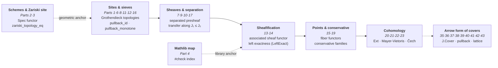

# Grothendieck Tribute — Mathlib Tour

Alexandre Grothendieck (1928-2014).

## Status

- **Toolchain**: `leanprover/lean4:v4.31.0-rc1`
- **Sorry**: **0 sorry, 0 axiom** — all 43 leaf modules are complete at creation (verified `count_code_sorry.py --json`: `distinct_code_sorry = 0`, measured 2026-08-16)
- **Build**: `lake build Grothendieck` — compiles the 43 leaf modules + 1 bilingual umbrella (10,944 FR + 10,245 EN = **21,189 FR+EN lines total**, measured 2026-08-16)
- **Dependencies**: Mathlib 4 (via `lakefile.lean`)
- **i18n coverage (EPIC #4980, ratified 2026-07-04)**: complete bilingual FR/EN coverage — **44 FR files** (1 umbrella `Grothendieck.lean` bilingual inline FR+EN + **43 leaf modules** FR canonical) + **43 `_en.lean` siblings** on `main` (leaf modules only; the umbrella is bilingual inline). Per the ratified convention (Option A: `Foo.lean` FR canonical + `Foo_en.lean` EN mirror for leaves), **all 43 leaf modules** are bilingual in Pattern A (`_en` namespaces anti-collision, non-docstring content byte-identical CI-detectable). The umbrella `Grothendieck.lean` is bilingual inline (FR canonical first, EN mirror, see final doctring in the file) — *by design*, not an i18n gap. **`README.md`** present (FR canonical sibling of this file). Out-of-scope: `.lake/packages/`, vendored libs.

## Purpose

This workspace is a **pedagogical homage** showing how Grothendieck's mathematical
language already lives in Mathlib 4. It is **not** an attempt to formalize EGA/SGA.

The goal is to give learners a curated entry point into:
- Categories, sieves, and Grothendieck topologies
- Sheaves, separated presheaves, subcanonical topologies
- Coverage generation and sheaf characterization
- The canonical topology and subcanonical sites
- Schemes (locally ringed spaces locally Spec R)
- The Zariski site
- What Mathlib has and what it doesn't (yet)

## Structure

The formalization spans **43 leaf modules (0 sorry)** — of which 3 are
`SheafCohomology/` submodules (Basic + MayerVietoris + Cech, Parts 20, 22, 23) —
imported by the umbrella `Grothendieck.lean` (itself bilingual inline FR/EN; no `_en` sibling for the umbrella). The umbrella imports **42 of the 43 leaves**: Part 34 `ExceptionalDirect.lean` is **standalone** (not imported by the umbrella — extension added by **PR #10357, MERGED 2026-08-11**, Phase 2 of Epic #2159 formalizing the exceptional direct image `f_!` at the presheaf level and its adjunction `f_! ⊣ f^*`), yet still compiled via the `globs := #[`Grothendieck.*]` in the lakefile (cf. i18n convention #4980).

*The pedagogical arc of the 43 leaf modules — from sites and sieves up to cohomology, with schemes/Zariski, the Mathlib map, and the arrow form of covers as extension:*



| Part | File | `_en` | Content | Lines |
|------|------|-------|---------|-------|
| root | `Grothendieck.lean` | (bilingual inline) | **Umbrella root** (imports-only of the 42 leaves except `ExceptionalDirect` + bilingual FR/EN doctring); no `_en` sibling (the EN content lives in the same file as a mirror) | 217 |
| 1 | `Grothendieck/CategoryAndSites.lean` | `CategoryAndSites_en.lean` | Sieves, Grothendieck topologies (trivial/discrete/dense), three axioms | 243 |
| 2 | `Grothendieck/SchemesTour.lean` | `SchemesTour_en.lean` | Scheme type, Spec functor, Γ, `homeoOfIso`, fully-faithful | 196 |
| 3 | `Grothendieck/ZariskiSite.lean` | `ZariskiSite_en.lean` | Zariski pretopology, `zariskiTopology_eq` bridge theorem, subcanonical | 139 |
| 4 | `Grothendieck/MathlibMap.lean` | `MathlibMap_en.lean` | `#check` index of Grothendieck-related Mathlib definitions | 123 |
| 5 | `Grothendieck/Calibration.lean` | `Calibration_en.lean` | 4 micro-proof targets for the prover harness (Epic #1453) | 95 |
| 6 | `Grothendieck/SieveLattice.lean` | `SieveLattice_en.lean` | Sieve pullback identities (7): `pullback_id`, `pullback_pullback`, `pullback_bot`, `pullback_monotone`, `pullback_union` (#7895), `pullback_ofObjects`, `mem_iff_pullback_eq_top` | 252 |
| 7 | `Grothendieck/SheafBasics.lean` | `SheafBasics_en.lean` | Sheaf/separated presheaf basics, sheaf transfer along J₁ ≤ J₂ | 230 |
| 8 | `Grothendieck/SieveOps.lean` | `SieveOps_en.lean` | Topology ordering, covering closure, sieve composition | 207 |
| 9 | `Grothendieck/CoverageGen.lean` | `CoverageGen_en.lean` | Coverage-to-topology, sheaf characterization, sup of coverages | 233 |
| 10 | `Grothendieck/CanonicalProps.lean` | `CanonicalProps_en.lean` | Canonical topology, subcanonicity, representable sheaves | 154 |
| 11 | `Grothendieck/SieveGenerate.lean` | `SieveGenerate_en.lean` | Sieve generation identities | 242 |
| 12 | `Grothendieck/DenseTopology.lean` | `DenseTopology_en.lean` | The dense topology | 218 |
| 13 | `Grothendieck/Sheafification.lean` | `Sheafification_en.lean` | Sheafification (the associated sheaf functor) | 258 |
| 14 | `Grothendieck/LeftExact.lean` | `LeftExact_en.lean` | Left exactness of sheafification | 219 |
| 15 | `Grothendieck/SitePoints.lean` | `SitePoints_en.lean` | Points of a site (fiber functors) | 411 |
| 16 | `Grothendieck/Subcanonical.lean` | `Subcanonical_en.lean` | Subcanonical Grothendieck topologies | 232 |
| 17 | `Grothendieck/SheafHom.lean` | `SheafHom_en.lean` | Internal hom of sheaves | 273 |
| 18 | `Grothendieck/ConstantSheaf.lean` | `ConstantSheaf_en.lean` | The constant sheaf functor (bridges Mathlib `CategoryTheory.Sites.ConstantSheaf`) | 252 |
| 19 | `Grothendieck/Conservative.lean` | `Conservative_en.lean` | Conservative families of points | 501 |
| 20 | `Grothendieck/SheafCohomology/Basic.lean` | `SheafCohomology/Basic_en.lean` | Sheaf cohomology (Ext-based) | 336 |
| 21 | `Grothendieck/MayerVietorisSquare.lean` | `MayerVietorisSquare_en.lean` | Mayer-Vietoris squares | 338 |
| 22 | `Grothendieck/SheafCohomology/MayerVietoris.lean` | `SheafCohomology/MayerVietoris_en.lean` | Mayer-Vietoris long exact sequence | 235 |
| 23 | `Grothendieck/SheafCohomology/Cech.lean` | `SheafCohomology/Cech_en.lean` | Čech cohomology | 203 |
| 24 | `Grothendieck/YonedaLemma.lean` | `YonedaLemma_en.lean` | The Yoneda lemma (embedding, equivalence, naturality, fully-faithful, coyoneda) | 274 |
| 25 | `Grothendieck/Adjunction.lean` | `Adjunction_en.lean` | Adjunction of functors, unit/counit, turtle lemma, left/right adjoints | 335 |
| 26 | `Grothendieck/Monads.lean` | `Monads_en.lean` | Monads in category theory, unit, multiplication, associativity law | 253 |
| 27 | `Grothendieck/Comma.lean` | `Comma_en.lean` | Comma category, projections, functoriality | 239 |
| 28 | `Grothendieck/Limits.lean` | `Limits_en.lean` | Limits and colimits | 421 |
| 29 | `Grothendieck/Equivalences.lean` | `Equivalences_en.lean` | Equivalences of categories, fully-faithful functors, essentially surjective | 338 |
| 30 | `Grothendieck/Construction.lean` | `Construction_en.lean` | Basic categorical constructions | 256 |
| 31 | `Grothendieck/KanExtensions.lean` | `KanExtensions_en.lean` | Kan extensions (generalized limits/colimits) | 481 |
| 32 | `Grothendieck/MonoidalCategories.lean` | `MonoidalCategories_en.lean` | Monoidal categories, tensor, unit, associator | 397 |
| 33 | `Grothendieck/DirectImage.lean` | `DirectImage_en.lean` | `#check` index (8) of the `f^* ⊣ f_*` adjunction — direct/inverse image of module sheaves (#8882) | 325 |
| 34 | `Grothendieck/ExceptionalDirect.lean` | `ExceptionalDirect_en.lean` | Exceptional direct image `f_!` at the presheaf level and its adjunction `f_! ⊣ f^*` — left Kan extension of `f^*` along `f` (#10357, Phase 2 of #2159); **standalone** (not imported by the umbrella) | 202 |
| 35 | `Grothendieck/CoversArrow.lean` | `CoversArrow_en.lean` | Arrow form of the cover — 7 dedicated theorems (#10879, Phase 5) | 199 |
| 36 | `Grothendieck/Cover.lean` | `Cover_en.lean` | Bundled cover `J.Cover X` — 15 dedicated theorems (#10912, Phase 5) | 284 |
| 37 | `Grothendieck/PullbackFunctor.lean` | `PullbackFunctor_en.lean` | Coherence laws of the pullback (pseudofunctor on `J.Cover`) (#11023, Phase 5) | 149 |
| 38 | `Grothendieck/PullbackFunctorLaws.lean` | `PullbackFunctorLaws_en.lean` | Pullback functor laws on `J.Cover` (#11035, Phase 5) | 141 |
| 39 | `Grothendieck/TopologyLattice.lean` | `TopologyLattice_en.lean` | Lattice laws of Grothendieck topologies (#11038, Phase 5) | 211 |
| 40 | `Grothendieck/CoversPullback.lean` | `CoversPullback_en.lean` | Arrow-form `J.Covers` laws under pullback (#11057, Phase 5) | 202 |
| 41 | `Grothendieck/CoversOrder.lean` | `CoversOrder_en.lean` | Order laws of the arrow form `J.Covers` (#11068, Phase 5) | 164 |
| 42 | `Grothendieck/PullbackCoversLaws.lean` | `PullbackCoversLaws_en.lean` | Arrow-form laws under iterated pullback (#11217, Phase 5) | 160 |
| 43 | `Grothendieck/CoversLattice.lean` | `CoversLattice_en.lean` | Indexed lattice laws of the arrow form (#11231, Phase 5) | 106 |

*The `Lines` column counts the **FR file alone** (`wc -l`, measured 2026-08-16); the FR+EN total is **21,189 lines** (10,944 FR + 10,245 EN).*

The extension was developed under Issue #2159 / Epic #1646: the 43 leaf modules
are merged + 1 bilingual umbrella, 0 `sorry`, 0 axiom added. **Phase 1** (Parts 1-33)
shipped through successive PR waves (#2675, #8882, etc.); **Phase 2** (Part 34 `f_! ⊣ f^*`)
delivered by PR #10357 (MERGED 2026-08-11); **Phase 5** (Parts 35-43, arrow form of covers)
delivered by PRs #10879, #10912, #11023, #11035, #11038, #11057, #11068, #11217, #11231.

## Build

```bash
# From this directory (WSL required)
lake build Grothendieck
# Builds the 43 leaf modules + 1 bilingual umbrella (21,189 FR+EN lines total)
# Last verified build: 2026-08-12, "Build completed successfully" (state 34 modules);
# Parts 35-43 (Phase 5) merged with lake build SUCCESS in their respective PRs
```

## Sorry count

**0 sorry, 0 axiom** — all 43 leaf modules are complete at creation
(verified `count_code_sorry.py --json`: `distinct_code_sorry = 0`, measured 2026-08-16;
the umbrella `Grothendieck.lean` is imports-only without declarations). Part 34
`ExceptionalDirect.lean` (#10357) cites `sorry` twice in prose docstring
(marker of the bounded formalization) but contains **no sorry tactic**.

## Toolchain

Aligned with other SymbolicAI/Lean projects: `leanprover/lean4:v4.31.0-rc1`

## References

The language toured here — Grothendieck topologies, sites, sheaves, and schemes — originates in Grothendieck's algebraic geometry. These are the canonical entry points. This workspace is a pedagogical tour indexed against Mathlib, **not** a formalization of EGA/SGA.

- **Mac Lane, S.; Moerdijk, I.** *Sheaves in Geometry and Logic: A First Introduction to Topos Theory*. Springer Universitext, 1992. — Standard reference for Grothendieck topologies, sieves, sites, and sheaves (Parts 1, 6-8, 10, 13-14).
- **Artin, M.; Grothendieck, A.; Verdier, J. L.**, eds. *Theorie des topos et cohomologie etale des schemas* (SGA 4). Springer Lecture Notes in Mathematics 269, 270, 305, 1972-1973. — Origin of sites, Grothendieck topologies, and points of a topos (Parts 1, 15, 19).
- **Grothendieck, A.; Dieudonne, J.** *Elements de geometrie algebrique* (EGA). Publications Mathematiques de l'IHES, 1960-1967. — Origin of schemes and the Zariski site (Parts 2-3).
- **Vakil, R.** *The Rising Sea: Foundations of Algebraic Geometry*. — Widely used pedagogical notes in the Grothendieckian spirit.
- **The Stacks Project.** [stacks.math.columbia.edu](https://stacks.math.columbia.edu) — Reference for schemes, sheafification, and sheaf cohomology (Parts 13, 20-23).
- **The Mathlib Community.** *Mathlib4, Category Theory and Sites*. [mathlib4 docs](https://leanprover-community.github.io/mathlib4_docs/) — The library this tour indexes (Part 4); see de Moura & Ullrich, "The Lean 4 Theorem Prover" (2021).
- **nLab.** [ncatlab.org](https://ncatlab.org) — Entries on Grothendieck topology, sieve, site, sheaf, and sheafification.

## See also

- Epic #1646 (Grothendieck tribute)
- Issue #2159 (Grothendieck formalization depth — Phase 1 shipped, **Phase 2** delivered by #10357 on 2026-08-11: `f_! ⊣ f^*` at the presheaf level = Part 34 `ExceptionalDirect.lean`; **Phase 5** delivered by #10879/#10912/#11023/#11035/#11038/#11057/#11068/#11217/#11231: Parts 35-43, arrow form of covers)
- PR #2675 (Phases 4-6: SieveOps + CoverageGen + CanonicalProps)
- **PR #10357** (Phase 2 #2159: exceptional direct image `f_! ⊣ f^*` at the presheaf level, bounded formalization of the missing link between `f^*` and `f_*`)
- Epic #1453 (prover harness calibration)
- Conway tribute workspace (`../conway_lean/`)
- Lean notebook series (`../README.md`)
- **EPIC #4980** — Lean i18n convention (Option A sibling pair post-2026-07-04; 43 `_en.lean` siblings on `main` in this lake + 1 bilingual inline umbrella)
- Issue #8960 (reconciling the two `Part` numberings)
- **[`README.md`](./README.md)** — FR canonical sibling of this file

## Conclusion

This tribute is a **complete pedagogical tour** (43 leaf modules + 1 bilingual umbrella, 21,189 FR+EN lines, 0 `sorry`,
0 axiom added) showing how Grothendieck's language — sites, sheaves,
sheafification, points, cohomology, Yoneda, direct images, exceptional direct
image `f_!`, arrow form of covers — already lives in Mathlib 4. It is
deliberately **not** a formalization of EGA/SGA; it is a curated index that lets
learners see the library through Grothendieckian eyes.

### The arc

The modules trace a coherent path: **sites and sieves** (Parts 1, 6, 8, 11, 12,
16) → **sheaves, separation, and transfer** (7, 9, 10, 17) → **sheafification and
its left exactness** (13, 14) → **points and conservative families** (15, 19) →
**sheaf cohomology, Mayer-Vietoris, and Čech** (20-23), with **schemes and the
Zariski site** (2, 3), a **Mathlib map** (4), and the **Yoneda lemma** (24)
anchoring the tour to the library it indexes. The categorical foundations
(Adjunction, Equivalences, Monads) at Parts 25, 29, 26 underpin the whole
formalization. `DirectImage.lean` (Part 33) indexes the `f^* ⊣ f_*` adjunction — the
simplest instance of the "six operations", transporting sheaves along morphisms
of schemes. `ExceptionalDirect.lean` (Part 34, #10357) takes a further step by
formalizing `f_! ⊣ f^*` at the presheaf level — the *proper support* direct image as a
left Kan extension of `f^*`, missing link between `f^*` (inverse image) and `f_*`
(direct image). Finally, **Phase 5** (Parts 35-43) unfolds the arrow-form structure of
covers: `CoversArrow` (35), the bundled cover `J.Cover X` (36), the pullback coherence
and functor laws (37-38), the lattice of topologies (39), and the arrow-form `J.Covers`
laws under pullback, order, iteration, and indexed lattice (40-43).

### Scope, honestly

Per the `## Sorry count` section above, the tour is **0 `sorry`, 0 axiom added** —
every result is fully proven. Part 4's `#check` index is explicit about what
Mathlib has and what it does not (yet); the tour documents that boundary rather
than papering over it. The companion `Calibration.lean` (Part 5) feeds the prover
harness (Epic #1453), tying this formalization to the broader proving effort.

### Where to go next

- **Depth**: Issue #2159 / Epic #1646 track further formalization — this tour is
  the foundation, not the ceiling.
- **Companions**: `conway_lean/` (Conway's mathematics), the Lean notebook series.
- **References**: Mac Lane–Moerdijk and SGA 4 for the topos-theoretic core; Vakil
  and the Stacks Project for schemes and cohomology.
