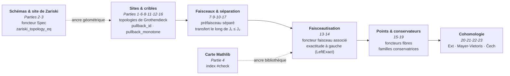
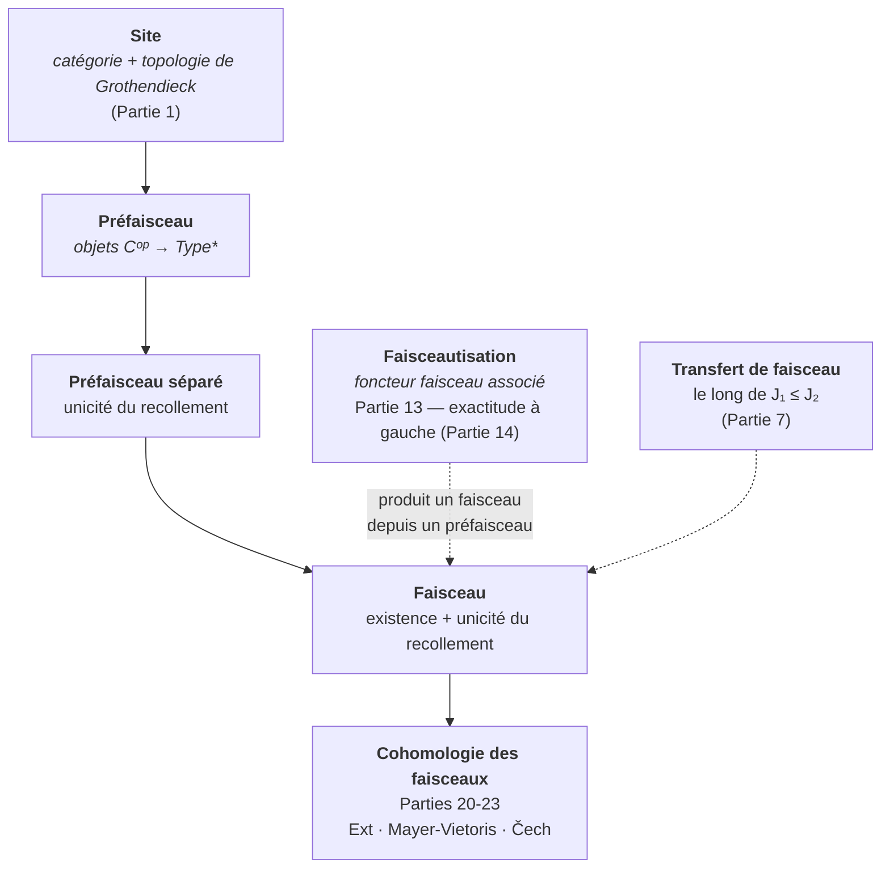

# Hommage à Grothendieck — Visite de Mathlib

Alexandre Grothendieck (1928-2014).

## État

- **Toolchain** : `leanprover/lean4:v4.31.0-rc1`
- **Sorry** : **0 sorry, 0 axiome** — les 33 modules leaf sont complets à la création
- **Build** : `lake build Grothendieck` — compile 33 modules leaf (11 206 lignes FR+EN, + 208 pour l'umbrella = **11 414 au total**, mesuré 2026-07-30)
- **Dépendances** : Mathlib 4 (via `lakefile.lean`)
- **Couverture i18n (EPIC #4980 ratifiée 2026-07-04)** : couverture bilingue FR/EN complète — **34 fichiers FR** (1 umbrella `Grothendieck.lean` bilingue inline FR+EN + **33 modules leaf** FR canonique) + **33 siblings `_en.lean`** sur `main` (les 33 modules leaf uniquement ; l'umbrella est bilingue inline). Conformément à la convention ratifiée (Option A : `Foo.lean` FR canonique + `Foo_en.lean` miroir EN pour les leafs), **tous les 33 modules leaf** sont déjà bilingues au pattern A (namespaces `_en` anti-collision, contenu non-docstring byte-identique détectable par CI). L'umbrella `Grothendieck.lean` est bilingue inline (FR canonique d'abord, EN en miroir, cf doctring final du fichier) — c'est *by design*, pas un gap i18n. **`README.en.md`** présent (miroir EN du présent fichier). Hors-scope : `.lake/packages/`, libs vendored.

## Objectif

Ce workspace est un **hommage pédagogique** montrant comment le langage
mathématique de Grothendieck vit déjà dans Mathlib 4. Ce n'est **pas** une
tentative de formaliser EGA/SGA.

Le but est d'offrir aux apprenants un point d'entrée curaté vers :
- Catégories, cribles (sieves) et topologies de Grothendieck
- Faisceaux (sheaves), prefaisceaux séparés, topologies sous-canoniques
- Génération de recouvrements (coverage) et caractérisation des faisceaux
- La topologie canonique et les sites sous-canoniques
- Schémas (espaces annelés en anneaux locaux localement Spec R)
- Le site de Zariski
- Ce que Mathlib possède et ce qu'il n'a pas (encore)

## Structure

La formalisation couvre **33 modules leaf (11 206 lignes FR+EN, 0 sorry)**,
importés dans l'ordre par le parapluie `Grothendieck.lean` (qui est lui-même bilingue inline FR/EN, pas de sibling `_en` pour l'umbrella).

*La trajectoire pédagogique des 33 modules leaf — des sites et cribles jusqu'à la cohomologie, avec schémas/Zariski et carte Mathlib en ancrage :*



| Partie | Fichier | `_en` | Contenu | Lignes |
|--------|---------|-------|---------|--------|
| racine | `Grothendieck.lean` | (bilingue inline) | **Racine umbrella** (imports-only des 33 leaf + doctring bilingue FR/EN) ; pas de sibling `_en` (le contenu EN vit dans le même fichier en miroir) | 208 |
| 1 | `Grothendieck/CategoryAndSites.lean` | `CategoryAndSites_en.lean` | Cribles, topologies de Grothendieck (triviale/discrète/dense), trois axiomes | 243 |
| 2 | `Grothendieck/SchemesTour.lean` | `SchemesTour_en.lean` | Type des schémas, foncteur Spec, Γ, `homeoOfIso`, pleinement fidèle | 109 |
| 3 | `Grothendieck/ZariskiSite.lean` | `ZariskiSite_en.lean` | Prétopologie de Zariski, théorème-pont `zariskiTopology_eq`, sous-canonique | 93 |
| 4 | `Grothendieck/MathlibMap.lean` | `MathlibMap_en.lean` | Index `#check` des définitions Mathlib liées à Grothendieck | 107 |
| 5 | `Grothendieck/Calibration.lean` | `Calibration_en.lean` | 4 cibles de micro-preuve pour le harnais du prouveur (Epic #1453) | 95 |
| 6 | `Grothendieck/SieveLattice.lean` | `SieveLattice_en.lean` | Identités de pullback de cribles (7) : `pullback_id`, `pullback_pullback`, `pullback_bot`, `pullback_monotone`, `pullback_union` (#7895), `pullback_ofObjects`, `mem_iff_pullback_eq_top` | 164 |
| 7 | `Grothendieck/SheafBasics.lean` | `SheafBasics_en.lean` | Bases faisceau/préfaisceau séparé, transfert de faisceau le long de J₁ ≤ J₂ | 148 |
| 8 | `Grothendieck/SieveOps.lean` | `SieveOps_en.lean` | Ordre sur les topologies, clôture de recouvrement, composition de cribles | 141 |
| 9 | `Grothendieck/CoverageGen.lean` | `CoverageGen_en.lean` | Coverage-vers-topologie, caractérisation des faisceaux, sup de coverages | 177 |
| 10 | `Grothendieck/CanonicalProps.lean` | `CanonicalProps_en.lean` | Topologie canonique, sous-canoïcité, faisceaux représentables | 154 |
| 11 | `Grothendieck/SieveGenerate.lean` | `SieveGenerate_en.lean` | Identités de génération de cribles | 172 |
| 12 | `Grothendieck/DenseTopology.lean` | `DenseTopology_en.lean` | La topologie dense | 155 |
| 13 | `Grothendieck/Sheafification.lean` | `Sheafification_en.lean` | Faisceautisation (le foncteur faisceau associé) | 189 |
| 14 | `Grothendieck/LeftExact.lean` | `LeftExact_en.lean` | Exactitude à gauche de la faisceautisation | 219 |
| 15 | `Grothendieck/SitePoints.lean` | `SitePoints_en.lean` | Points d'un site (foncteurs fibres) | 226 |
| 16 | `Grothendieck/Subcanonical.lean` | `Subcanonical_en.lean` | Topologies de Grothendieck sous-canoniques | 105 |
| 17 | `Grothendieck/SheafHom.lean` | `SheafHom_en.lean` | Hom interne des faisceaux | 173 |
| 18 | `Grothendieck/ConstantSheaf.lean` | `ConstantSheaf_en.lean` | Le foncteur faisceau constant (ponte vers `CategoryTheory.Sites.ConstantSheaf` de Mathlib) | 185 |
| 19 | `Grothendieck/Conservative.lean` | `Conservative_en.lean` | Familles conservatrices de points | 226 |
| 20 | `Grothendieck/SheafCohomology/Basic.lean` | `SheafCohomology/Basic_en.lean` | Cohomologie des faisceaux (basée sur Ext) | 254 |
| 21 | `Grothendieck/MayerVietorisSquare.lean` | `MayerVietorisSquare_en.lean` | Carrés de Mayer-Vietoris | 195 |
| 22 | `Grothendieck/SheafCohomology/MayerVietoris.lean` | `SheafCohomology/MayerVietoris_en.lean` | Suite exacte longue de Mayer-Vietoris | 167 |
| 23 | `Grothendieck/SheafCohomology/Cech.lean` | `SheafCohomology/Cech_en.lean` | Cohomologie de Čech | 130 |
| 24 | `Grothendieck/YonedaLemma.lean` | `YonedaLemma_en.lean` | Le lemme de Yoneda (plongement, équivalence, naturalité, pleinement fidèle, coyoneda) | 274 |
| 25 | `Grothendieck/Adjunction.lean` | `Adjunction_en.lean` | Adjonction de foncteurs, unité/co-unit, lemme de la tortue (turtle), adjoints à droite/gauche | 168 |
| 26 | `Grothendieck/Monads.lean` | `Monads_en.lean` | Monades en théorie des catégories, unité, multiplication, loi d'association | 172 |
| 27 | `Grothendieck/Comma.lean` | `Comma_en.lean` | Catégorie comma, projections, fonctorialité | 129 |
| 28 | `Grothendieck/Limits.lean` | `Limits_en.lean` | Limites et colimites | 242 |
| 29 | `Grothendieck/Equivalences.lean` | `Equivalences_en.lean` | Équivalences de catégories, foncteurs pleinement fidèles, essentiellement surjectifs | 189 |
| 30 | `Grothendieck/Construction.lean` | `Construction_en.lean` | Constructions catégorielles de base | 152 |
| 31 | `Grothendieck/KanExtensions.lean` | `KanExtensions_en.lean` | Extensions de Kan (limites/colimites généralisées) | 270 |
| 32 | `Grothendieck/MonoidalCategories.lean` | `MonoidalCategories_en.lean` | Catégories monoïdales, tenseur, unité, associateur | 244 |
| 33 | `Grothendieck/DirectImage.lean` | `DirectImage_en.lean` | Index `#check` (8) de l'adjonction `f^* ⊣ f_*` — image directe / réciproque des faisceaux de modules (#8882) | 152 |

*La colonne `Lignes` compte le **fichier FR seul** ; le total FR+EN est le double approximatif.*

L'extension a été développée sous l'Issue #2159 / Epic #1646 : les 33 modules leaf
sont mergés + 1 umbrella bilingue, 0 `sorry`, 0 axiome ajouté.

## Build

```bash
# Depuis ce répertoire (WSL requis)
lake build Grothendieck
# Compile les 33 modules leaf + 1 umbrella bilingue (11 414 lignes FR+EN au total)
# Dernier build vérifié : 2026-07-30, « Build completed successfully (2821 jobs) »
```

## Compte de sorry

**0 sorry, 0 axiome** — tous les 33 modules leaf sont complets à la création
(l'umbrella `Grothendieck.lean` est imports-only sans déclaration).

## Toolchain

Alignée avec les autres projets SymbolicAI/Lean : `leanprover/lean4:v4.31.0-rc1`

## References

The language toured here — Grothendieck topologies, sites, sheaves, and schemes — originates in Grothendieck's algebraic geometry. These are the canonical entry points. This workspace is a pedagogical tour indexed against Mathlib, **not** a formalization of EGA/SGA.

- **Mac Lane, S.; Moerdijk, I.** *Sheaves in Geometry and Logic: A First Introduction to Topos Theory*. Springer Universitext, 1992. — Standard reference for Grothendieck topologies, sieves, sites, and sheaves (Parts 1, 6-8, 10, 13-14).
- **Artin, M.; Grothendieck, A.; Verdier, J. L.**, eds. *Theorie des topos et cohomologie etale des schemas* (SGA 4). Springer Lecture Notes in Mathematics 269, 270, 305, 1972-1973. — Origin of sites, Grothendieck topologies, and points of a topos (Parts 1, 15, 19).
- **Grothendieck, A.; Dieudonne, J.** *Elements de geometrie algebrique* (EGA). Publications Mathematiques de l'IHES, 1960-1967. — Origin of schemes and the Zariski site (Parts 2-3).
- **Vakil, R.** *The Rising Sea: Foundations of Algebraic Geometry*. — Widely used pedagogical notes in the Grothendieckian spirit.
- **The Stacks Project.** [stacks.math.columbia.edu](https://stacks.math.columbia.edu) — Reference for schemes, sheafification, and sheaf cohomology (Parts 13, 20-23).
- **The Mathlib Community.** *Mathlib4, Category Theory and Sites*. [mathlib4 docs](https://leanprover-community.github.io/mathlib4_docs/) — The library this tour indexes (Part 4); see de Moura & Ullrich, "The Lean 4 Theorem Prover" (2021).
- **nLab.** [ncatlab.org](https://ncatlab.org) — Entries on Grothendieck topology, sieve, site, sheaf, and sheafification.

## Voir aussi

- Epic #1646 (hommage à Grothendieck)
- Issue #2159 (profondeur de formalisation Grothendieck)
- PR #2675 (Phases 4-6 : SieveOps + CoverageGen + CanonicalProps)
- Epic #1453 (calibration du harnais prouveur)
- Workspace hommage Conway (`../conway_lean/`)
- **EPIC #4980** — convention i18n Lean (Option A sibling pair post-2026-07-04 ; 33 siblings `_en.lean` sur `main` dans cette lake + 1 umbrella bilingue inline)
- Issue #8960 (réconciliation des deux numérotations `Partie`)
- **[`README.en.md`](./README.en.md)** — miroir EN du présent fichier
- Série de notebooks Lean (`../README.md`)

## Conclusion

Cet hommage est une **visite pédagogique complète** (33 modules leaf + 1 umbrella bilingue, 11 414 lignes FR+EN,
0 `sorry`, 0 axiome ajouté) montrant comment le langage de Grothendieck — sites,
faisceaux, faisceautisation, points, cohomologie, Yoneda, images directes — vit déjà dans Mathlib 4. Ce
n'est délibérément **pas** une formalisation d'EGA/SGA ; c'est un index curaté
qui laisse les apprenants voir la bibliothèque à travers des yeux grothendieckiens.

### La trajectoire

Les modules tracent un chemin cohérent : **sites et cribles** (Parties 1, 6, 8,
11, 12, 16) → **faisceaux, séparation et transfert** (7, 9, 10, 17) →
**faisceautisation et son exactitude à gauche** (13, 14) → **points et familles
conservatrices** (15, 19) → **cohomologie des faisceaux, Mayer-Vietoris et Čech**
(20-23), avec **schémas et site de Zariski** (2, 3), une **carte Mathlib** (4)
et le **lemme de Yoneda** (24) ancrant la visite à la bibliothèque qu'elle indexe. Les bases catégorielles (Adjonction, Équivalences, Monades) aux Parties 25, 29, 26 soutiennent toute la formalisation. Enfin, `DirectImage.lean` indexe l'adjonction `f^* ⊣ f_*` — l'instance la plus simple des « six opérations », qui transporte les faisceaux le long des morphismes de schémas.

*La construction verticale « faisceau » — chaque couche bâtie sur la précédente, de la donnée du site jusqu'à la cohomologie :*



### Le périmètre, honnêtement

Selon la section `## Compte de sorry` ci-dessus, la visite est à **0 `sorry`,
0 axiome ajouté** — chaque résultat est pleinement prouvé. L'index `#check` de la
Partie 4 est explicite sur ce que Mathlib possède et ce qu'il n'a pas (encore) ;
la visite documente cette frontière au lieu de la maquiller. Le module compagnon
`Calibration.lean` (Partie 5) alimente le harnais du prouveur (Epic #1453),
reliant cette formalisation à l'effort de preuve plus large.

### Où aller ensuite

- **Profondeur** : l'Issue #2159 / l'Epic #1646 suivent la formalisation
  ultérieure — cette visite est le socle, pas le plafond.
- **Compagnons** : `conway_lean/` (mathématiques de Conway), la série de
  notebooks Lean.
- **Références** : Mac Lane–Moerdijk et SGA 4 pour le cœur topos-théorique ;
  Vakil et le Stacks Project pour les schémas et la cohomologie.
