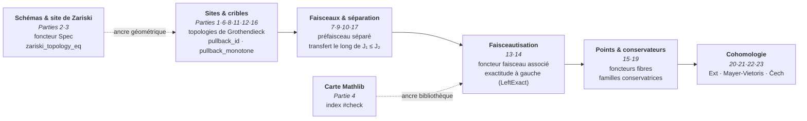
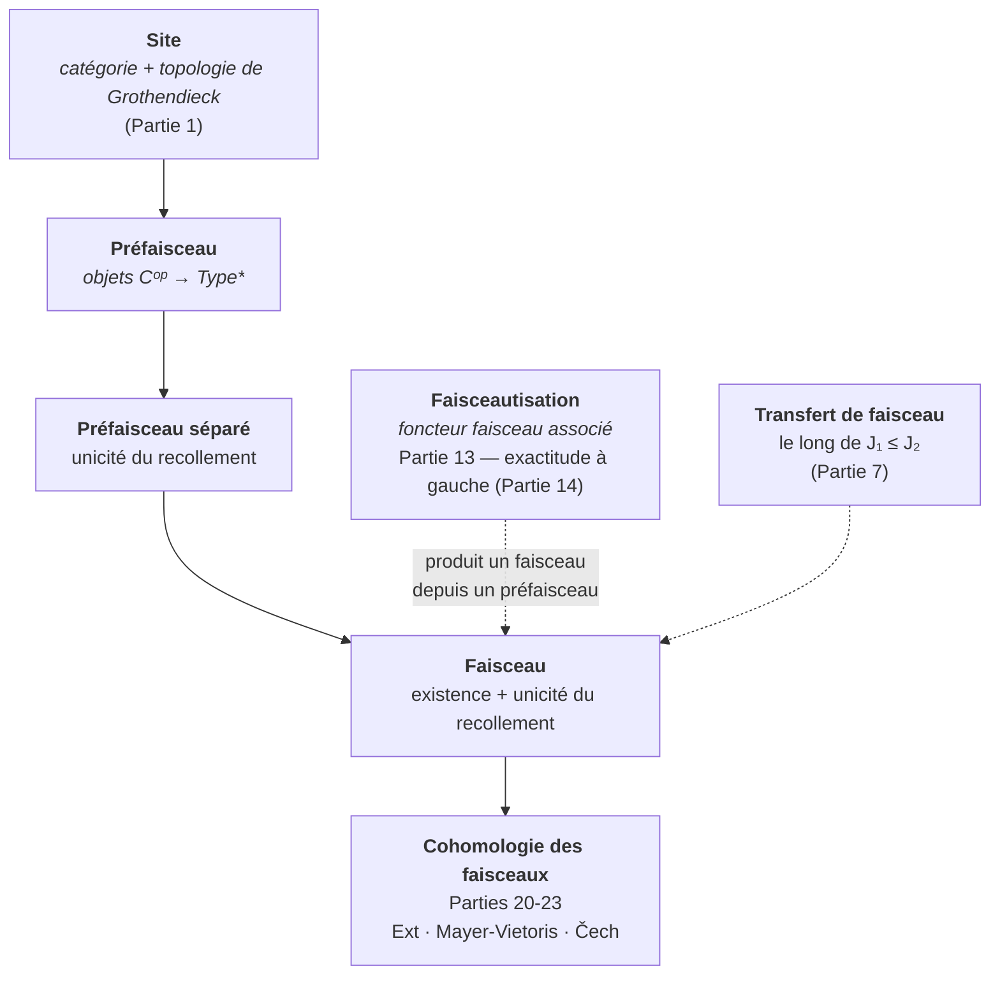

# Hommage à Grothendieck — Visite de Mathlib

Alexandre Grothendieck (1928-2014).

Grothendieck a déplacé l'objet d'étude : plutôt que disséquer chaque structure
isolément, il a construit les catégories, les sites et les faisceaux qui les
portent — et laissé les théorèmes tomber comme des corollaires. Ce workspace
montre que ce langage **vit déjà dans Mathlib 4** : c'est une visite guidée du
paysage grothendieckien telle que la bibliothèque la formalise aujourd'hui.

## L'esprit de la visite

Ce workspace est un **hommage pédagogique** — délibérément **pas** une
tentative de formaliser EGA/SGA. Le but est d'offrir aux apprenants un point
d'entrée curaté vers :

- Catégories, cribles (sieves) et topologies de Grothendieck
- Faisceaux (sheaves), prefaisceaux séparés, topologies sous-canoniques
- Génération de recouvrements (coverage) et caractérisation des faisceaux
- La topologie canonique et les sites sous-canoniques
- Schémas (espaces annelés en anneaux locaux localement Spec R) et site de Zariski
- Ce que Mathlib possède et ce qu'il n'a pas (encore)

## La trajectoire

Les **46 modules leaf** (0 `sorry`, 0 axiome ajouté) tracent un chemin cohérent,
du site brut jusqu'à la cohomologie :

**Poser le site** (Parties 1, 6, 8, 11, 12, 16). Tout part de la donnée d'une
catégorie munie d'une topologie de Grothendieck — triviale, discrète, dense,
canonique. Les cribles y forment un treillis que le pullback parcourt
(`pullback_id`, `pullback_pullback`, `pullback_monotone`…), et chaque topologie
se compare, se génère et se ferre par clôture de recouvrement.

**Construire le faisceau** (Parties 7, 9, 10, 13, 14, 17, 18). Au-dessus du
site vivent les préfaisceaux ; la condition de recollement — unicité puis
existence — définit la séparation puis le faisceau, transférable le long de
J₁ ≤ J₂. La faisceautisation (foncteur faisceau associé, exact à gauche)
convertit tout préfaisceau en faisceau :

**Faire parler les points, mesurer la cohomologie** (Parties 15, 19, 20-23).
Les points d'un site (foncteurs fibres) et leurs familles conservatrices
relient la théorie à ses modèles ; la cohomologie des faisceaux — via Ext,
Mayer-Vietoris et Čech — en est l'instrument de mesure.

**Les ancrages.** Côté géométrie, les schémas et le site de Zariski
(Parties 2, 3) relient la visite à la géométrie algébrique d'origine, avec le
théorème-pont `zariski_topology_eq`. Côté bibliothèque, la carte Mathlib
(Partie 4, index `#check`) dit honnêtement ce qui existe et ce qui manque, et
`Calibration.lean` (Partie 5) alimente le harnais du prouveur (Epic #1453).

**Les fondations catégorielles** (Parties 24-32). Yoneda, adjonctions,
monades, catégories comma, (co)limites, équivalences, extensions de Kan,
catégories monoïdales : le socle sur lequel tout ce qui précède s'écrit.

**Les deux veines récentes** (Parties 33-46). Le fil des *six opérations*
s'ouvre avec `DirectImage.lean` (Partie 33, index de l'adjonction `f^* ⊣ f_*`)
puis `ExceptionalDirect.lean` (Partie 34, #10357) qui formalise `f_! ⊣ f^*`
au niveau préfaisceau — l'image directe à support propre comme extension de
Kan à gauche, chaînon manquant entre `f^*` et `f_*`. En parallèle, le
programme *couverture* (Phase 5 de l'Epic #2159, vagues 2026-08-14..16 :
#10879 → #11285) systématise la forme flèche et la forme bundlée de la
couverture — de `covers_comp_iff` jusqu'à l'adjonction pushforward-pullback
au niveau couverture (Partie 45, #11262) et au bind comme transitivité
indexée (Partie 46, #11285), en passant par la forme flèche de la topologie
dense (Partie 44, #11244), les lois du pseudofoncteur pullback et le
treillis des topologies.

## Structure du code

La formalisation couvre **46 modules leaf** + **1 umbrella** `Grothendieck.lean`
(imports-only, bilingue inline FR/EN). Les trois sous-modules de
`SheafCohomology/` sont les Parties 20, 22 et 23 du tableau.

| Partie | Fichier | `_en` | Contenu | Lignes |
|--------|---------|-------|---------|--------|
| racine | `Grothendieck.lean` | (bilingue inline) | **Racine umbrella** (imports-only + doctring bilingue FR/EN) ; importe les 46 leaf (complète depuis [#11294](https://github.com/jsboige/CoursIA/pull/11294)) | 221 |
| 1 | `Grothendieck/CategoryAndSites.lean` | `CategoryAndSites_en.lean` | Cribles, topologies de Grothendieck (triviale/discrète/dense), trois axiomes | 243 |
| 2 | `Grothendieck/SchemesTour.lean` | `SchemesTour_en.lean` | Type des schémas, foncteur Spec, Γ, `homeoOfIso`, pleinement fidèle | 196 |
| 3 | `Grothendieck/ZariskiSite.lean` | `ZariskiSite_en.lean` | Prétopologie de Zariski, théorème-pont `zariskiTopology_eq`, sous-canonique | 139 |
| 4 | `Grothendieck/MathlibMap.lean` | `MathlibMap_en.lean` | Index `#check` des définitions Mathlib liées à Grothendieck | 124 |
| 5 | `Grothendieck/Calibration.lean` | `Calibration_en.lean` | 4 cibles de micro-preuve pour le harnais du prouveur (Epic #1453) | 95 |
| 6 | `Grothendieck/SieveLattice.lean` | `SieveLattice_en.lean` | Identités de pullback de cribles (7) : `pullback_id`, `pullback_pullback`, `pullback_bot`, `pullback_monotone`, `pullback_union` (#7895), `pullback_ofObjects`, `mem_iff_pullback_eq_top` | 253 |
| 7 | `Grothendieck/SheafBasics.lean` | `SheafBasics_en.lean` | Bases faisceau/préfaisceau séparé, transfert de faisceau le long de J₁ ≤ J₂ | 231 |
| 8 | `Grothendieck/SieveOps.lean` | `SieveOps_en.lean` | Ordre sur les topologies, clôture de recouvrement, composition de cribles | 208 |
| 9 | `Grothendieck/CoverageGen.lean` | `CoverageGen_en.lean` | Coverage-vers-topologie, caractérisation des faisceaux, sup de coverages | 233 |
| 10 | `Grothendieck/CanonicalProps.lean` | `CanonicalProps_en.lean` | Topologie canonique, sous-canoïcité, faisceaux représentables | 155 |
| 11 | `Grothendieck/SieveGenerate.lean` | `SieveGenerate_en.lean` | Identités de génération de cribles | 243 |
| 12 | `Grothendieck/DenseTopology.lean` | `DenseTopology_en.lean` | La topologie dense | 218 |
| 13 | `Grothendieck/Sheafification.lean` | `Sheafification_en.lean` | Faisceautisation (le foncteur faisceau associé) | 259 |
| 14 | `Grothendieck/LeftExact.lean` | `LeftExact_en.lean` | Exactitude à gauche de la faisceautisation | 219 |
| 15 | `Grothendieck/SitePoints.lean` | `SitePoints_en.lean` | Points d'un site (foncteurs fibres) | 411 |
| 16 | `Grothendieck/Subcanonical.lean` | `Subcanonical_en.lean` | Topologies de Grothendieck sous-canoniques | 232 |
| 17 | `Grothendieck/SheafHom.lean` | `SheafHom_en.lean` | Hom interne des faisceaux | 273 |
| 18 | `Grothendieck/ConstantSheaf.lean` | `ConstantSheaf_en.lean` | Le foncteur faisceau constant (ponte vers `CategoryTheory.Sites.ConstantSheaf` de Mathlib) | 252 |
| 19 | `Grothendieck/Conservative.lean` | `Conservative_en.lean` | Familles conservatrices de points | 501 |
| 20 | `Grothendieck/SheafCohomology/Basic.lean` | `SheafCohomology/Basic_en.lean` | Cohomologie des faisceaux (basée sur Ext) | 336 |
| 21 | `Grothendieck/MayerVietorisSquare.lean` | `MayerVietorisSquare_en.lean` | Carrés de Mayer-Vietoris | 338 |
| 22 | `Grothendieck/SheafCohomology/MayerVietoris.lean` | `SheafCohomology/MayerVietoris_en.lean` | Suite exacte longue de Mayer-Vietoris | 235 |
| 23 | `Grothendieck/SheafCohomology/Cech.lean` | `SheafCohomology/Cech_en.lean` | Cohomologie de Čech | 203 |
| 24 | `Grothendieck/YonedaLemma.lean` | `YonedaLemma_en.lean` | Le lemme de Yoneda (plongement, équivalence, naturalité, pleinement fidèle, coyoneda) | 275 |
| 25 | `Grothendieck/Adjunction.lean` | `Adjunction_en.lean` | Adjonction de foncteurs, unité/co-unité, lemme de la tortue (turtle), adjoints à droite/gauche | 335 |
| 26 | `Grothendieck/Monads.lean` | `Monads_en.lean` | Monades en théorie des catégories, unité, multiplication, loi d'association | 253 |
| 27 | `Grothendieck/Comma.lean` | `Comma_en.lean` | Catégorie comma, projections, fonctorialité | 239 |
| 28 | `Grothendieck/Limits.lean` | `Limits_en.lean` | Limites et colimites | 421 |
| 29 | `Grothendieck/Equivalences.lean` | `Equivalences_en.lean` | Équivalences de catégories, foncteurs pleinement fidèles, essentiellement surjectifs | 338 |
| 30 | `Grothendieck/Construction.lean` | `Construction_en.lean` | Constructions catégorielles de base | 256 |
| 31 | `Grothendieck/KanExtensions.lean` | `KanExtensions_en.lean` | Extensions de Kan (limites/colimites généralisées) | 481 |
| 32 | `Grothendieck/MonoidalCategories.lean` | `MonoidalCategories_en.lean` | Catégories monoïdales, tenseur, unité, associateur | 397 |
| 33 | `Grothendieck/DirectImage.lean` | `DirectImage_en.lean` | Index `#check` (8) de l'adjonction `f^* ⊣ f_*` — image directe / réciproque des faisceaux de modules (#8882) | 325 |
| 34 | `Grothendieck/ExceptionalDirect.lean` | `ExceptionalDirect_en.lean` | Image directe exceptionnelle `f_!` au niveau préfaisceau et son adjonction `f_! ⊣ f^*` — extension de Kan à gauche de `f^*` le long de `f` (#10357, Phase 2 de #2159) | 202 |
| 35 | `Grothendieck/CoversArrow.lean` | `CoversArrow_en.lean` | Forme flèche de la couverture : `covers_monotone`, `covers_union`, `covers_inf`, équivalence `covers_comp_iff` (#10879, Phase 5 de #2159) | 199 |
| 36 | `Grothendieck/Cover.lean` | `Cover_en.lean` | Couverture bundlée `J.Cover X` : coe-injective, lois pullback/top/inf, `bind_mem_iff`, condition de base (#10912, Phase 5 de #2159) | 284 |
| 37 | `Grothendieck/PullbackFunctor.lean` | `PullbackFunctor_en.lean` | Lois de cohérence du pseudofoncteur pullback sur `J.Cover` : `pullback_triple`, `pullbackComp_assoc`, unités gauche/droite (#11023, Phase 5 de #2159) | 149 |
| 38 | `Grothendieck/PullbackFunctorLaws.lean` | `PullbackFunctorLaws_en.lean` | Lois de foncteur du pullback : `pullback_functor_id`, `pullback_functor_comp(_assoc)`, `covers_pullback_comp` (#11035, Phase 5 de #2159) | 141 |
| 39 | `Grothendieck/TopologyLattice.lean` | `TopologyLattice_en.lean` | Lois de treillis des topologies de Grothendieck : `inf/sup_covering`, `sSup_covering`, `le_covers` (#11038, Phase 5 de #2159) | 211 |
| 40 | `Grothendieck/CoversPullback.lean` | `CoversPullback_en.lean` | Lois de la forme flèche sous pullback : `covers_pullback_comp`, `covers_bind`, `covers_iso_covering/cancel`, `covers_mono` (#11057, Phase 5 de #2159) | 202 |
| 41 | `Grothendieck/CoversOrder.lean` | `CoversOrder_en.lean` | Lois d'ordre de la forme flèche `J.Covers` : `covers_top/bot_iff`, `covers_inter_iff`, `covers_of_covering`, `covers_generate_sieve` (#11068, Phase 5 de #2159) | 164 |
| 42 | `Grothendieck/PullbackCoversLaws.lean` | `PullbackCoversLaws_en.lean` | Lois de la forme flèche sous pullback itéré : `covers_pullback_assoc`, `covers_pullback_id`, `covers_pullback_generate` (#11217, Phase 5 de #2159) | 160 |
| 43 | `Grothendieck/CoversLattice.lean` | `CoversLattice_en.lean` | Lois de treillis indexées de la forme flèche : `sInf/sSup_covering`, `sInf/sSup_covers` (#11231, Phase 5 de #2159) | 106 |
| 44 | `Grothendieck/CoversTopologies.lean` | `CoversTopologies_en.lean` | Forme flèche de la topologie dense : `dense_covers_iff`, `dense_covers_precomp` (stabilité par précomposition), `dense_covers_id` (#11244, Phase 5 de #2159) | 115 |
| 45 | `Grothendieck/CoversPushforward.lean` | `CoversPushforward_en.lean` | Forme flèche de l'adjonction pushforward-pullback : `covers_pushforward_of_mem`, `covers_pushforward_monotone/comp/union`, `pushforward_id` (#11262, Phase 5 de #2159) | 166 |
| 46 | `Grothendieck/CoversBind.lean` | `CoversBind_en.lean` | Forme flèche de la transitivité indexée (bind) : `covers_bind`, `bind_le`, `covers_bind_id`, `bind_top` (#11285, Phase 5 de #2159) | 158 |

*La colonne `Lignes` compte le **fichier FR seul** ; le sibling `_en` ajoute
approximativement autant.*

## Build & état

- **Toolchain** : `leanprover/lean4:v4.32.0` (alignée sur les autres projets SymbolicAI/Lean — conway_lean, game_theory_lean, calibration_lean)
- **Build** : `lake build` (WSL requis). La cible défaut (`globs := #[`Grothendieck.*]` du `lakefile.lean`) compile **tous** les modules FR et `_en`. Dernier build vérifié : 2026-08-16 sous v4.32.0, « Build completed successfully ». La cible explicite `lake build Grothendieck` (closure des imports de l'umbrella) couvre les 46 leaf — l'import de `ExceptionalDirect`, orphelin 5 jours ([#10357](https://github.com/jsboige/CoursIA/pull/10357) → [#11286](https://github.com/jsboige/CoursIA/issues/11286)), a été réparé par [#11294](https://github.com/jsboige/CoursIA/pull/11294).
- **Preuves** : **0 `sorry`, 0 axiome ajouté** — tous les modules sont complets à la création. (Un `grep sorry` naïf matche des mentions en prose dans les docstrings bilingues, notamment deux dans `ExceptionalDirect.lean` ; la CI compte en mode `real` — après strip des commentaires — et vaut 0.)
- **Dépendances** : Mathlib 4 (via `lakefile.lean`)
- **i18n** (EPIC #4980, convention Option A ratifiée 2026-07-04) : couverture bilingue complète — 47 fichiers FR (1 umbrella + 46 leaf canoniques) et 46 siblings `_en.lean` (namespaces `_en` anti-collision, contenu non-docstring byte-identique, vérifiable par CI). L'umbrella est bilingue inline *by design* (FR canonique d'abord, EN en miroir dans le même fichier). **[`README.en.md`](./README.en.md)** est le miroir EN du présent fichier. Hors-scope : `.lake/packages/`, libs vendored.

## Références

Le langage visité ici — topologies de Grothendieck, sites, faisceaux, schémas —
naît de la géométrie algébrique de Grothendieck. Voici les points d'entrée
canoniques ; ce workspace est une visite indexée sur Mathlib, **pas** une
formalisation d'EGA/SGA.

- **Mac Lane, S.; Moerdijk, I.** *Sheaves in Geometry and Logic: A First Introduction to Topos Theory*. Springer Universitext, 1992. — La référence standard pour topologies de Grothendieck, cribles, sites et faisceaux (Parties 1, 6-8, 10, 13-14).
- **Artin, M.; Grothendieck, A.; Verdier, J. L.** (éd.) *Théorie des topos et cohomologie étale des schémas* (SGA 4). Springer Lecture Notes in Mathematics 269, 270, 305, 1972-1973. — L'origine des sites, topologies de Grothendieck et points d'un topos (Parties 1, 15, 19).
- **Grothendieck, A.; Dieudonné, J.** *Éléments de géométrie algébrique* (EGA). Publications Mathématiques de l'IHÉS, 1960-1967. — L'origine des schémas et du site de Zariski (Parties 2-3).
- **Vakil, R.** *The Rising Sea: Foundations of Algebraic Geometry*. — Notes pédagogiques largement utilisées, dans l'esprit grothendieckien.
- **The Stacks Project.** [stacks.math.columbia.edu](https://stacks.math.columbia.edu) — Référence pour schémas, faisceautisation et cohomologie des faisceaux (Parties 13, 20-23).
- **The Mathlib Community.** *Mathlib4, Category Theory and Sites*. [mathlib4 docs](https://leanprover-community.github.io/mathlib4_docs/) — La bibliothèque que cette visite indexe (Partie 4) ; voir de Moura & Ullrich, « The Lean 4 Theorem Prover » (2021).
- **nLab.** [ncatlab.org](https://ncatlab.org) — Entrées *Grothendieck topology*, *sieve*, *site*, *sheaf*, *sheafification*.

## Voir aussi

- Epic #1646 (hommage à Grothendieck) — Issue #2159 (profondeur de formalisation : Phase 1 shippée, Phase 2 = #10357, Phase 5 = Parties 35-46)
- EPIC #4980 — convention i18n Lean (Option A sibling pair ; 46 paires `_en` dans ce lake)
- Epic #1453 (calibration du harnais prouveur) — Issue #8960 (réconciliation des numérotations `Partie`)
- [#11286](https://github.com/jsboige/CoursIA/issues/11286) — import umbrella de `ExceptionalDirect` (résolu par [#11294](https://github.com/jsboige/CoursIA/pull/11294))
- Workspace hommage Conway (`../conway_lean/`) — série de notebooks Lean (`../README.md`)
- **[`README.en.md`](./README.en.md)** — miroir EN du présent fichier

## Le périmètre, honnêtement

Chaque résultat est pleinement prouvé (0 `sorry`, 0 axiome ajouté), et l'index
`#check` de la Partie 4 documente explicitement la frontière entre ce que
Mathlib possède et ce qu'il n'a pas (encore) — la visite expose cette frontière
au lieu de la maquiller. Le module compagnon `Calibration.lean` (Partie 5)
relie la formalisation à l'effort de preuve plus large.

Cet hommage est un **index curaté** qui laisse les apprenants voir la
bibliothèque à travers des yeux grothendieckiens ; l'Issue #2159 / l'Epic
#1646 suivent la formalisation ultérieure — cette visite est le socle, pas le
plafond. Pour prolonger : `conway_lean/` et la série de notebooks Lean côté
compagnons ; Mac Lane–Moerdijk et SGA 4 pour le cœur topos-théorique ; Vakil
et le Stacks Project pour les schémas et la cohomologie.
