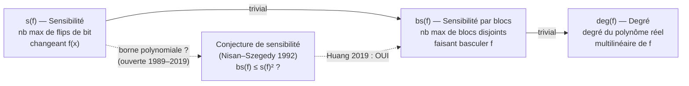
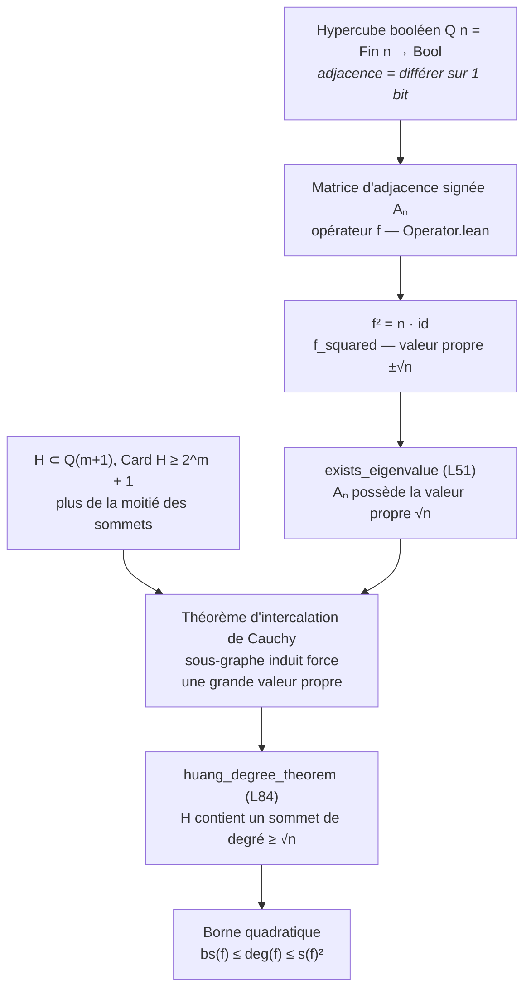

# sensitivity_lean — Conjecture de sensibilité (Huang 2019)

> Série : [`SymbolicAI/Lean`](../README.md) · [`sensitivity_lean`](./)

Formalisation en Lean 4 du **théorème de sensibilité** (Sensitivity Theorem)
issu de l'analyse des fonctions booléennes — la borne de degré qui **résout la
conjecture de sensibilité** (ouverte depuis 1989/1992, établie par Hao Huang en
2019 via un argument combinatoire de quatre pages).

Mini-projet complet : **0 sorry, 0 axiome** au-delà des axiomes du cœur de Lean.

## Statut

- **Toolchain** : `v4.31.0-rc1`
- **Sorry** : **0** — chaque preuve est close
- **Build** : `lake build Sensitivity` — SUCCESS
- **Dépendances** : Mathlib4

## Ce qui est formalisé

Pour une fonction booléenne `f : {0,1}^n → {0,1}`, trois mesures de complexité
sont reliées par la chaîne `s(f) ≤ bs(f) ≤ deg(f)` :

- **Sensibilité** `s(f)` : le maximum, sur les entrées `x`, du nombre de
  coordonnées `i` dont le flip `x ⊕ eᵢ` change `f(x)`.
- **Sensibilité par blocs** `bs(f)` : le nombre maximal de blocs *disjoints* de
  coordonnées pouvant chacun individuellement faire basculer `f`.
- **Degré** `deg(f)` : le degré de `f` vu comme polynôme réel multilinéaire.

*Les trois mesures de complexité d'une fonction booléenne, et la conjecture qui
les relie (résolue 2019) :*



La **conjecture de sensibilité** (Nisan–Szegedy 1992, affinant Wegener 1989 et
Cook et al. 1986) demandait si `bs(f)` est polynomialement borné en `s(f)`. Huang
(2019) l'a établie positivement en prouvant le théorème du degré : **tout
sous-graphe induit du `n`-cube sur plus de la moitié de ses sommets contient un
sommet de degré `≥ √n`** (`huang_degree_theorem`, `MainTheorem.lean` L84). Le
corollaire est la borne quadratique `deg(f) ≤ s(f)²`, i.e. `bs(f) ≤ s(f)²`.

La preuve repose sur un argument spectral (`exists_eigenvalue`, L51) : une
matrice d'adjacence signée `Aₙ` de l'hypercube possède la valeur propre `√n`, et
le théorème d'intercalation de Cauchy force un sommet de haut degré dans tout
grand sous-graphe induit.

*L'argument spectral de Huang — comment une valeur propre force un sommet de haut
degré dans tout grand sous-graphe induit de l'hypercube (chaque arête = un
lemme de `MainTheorem.lean` / `Operator.lean`) :*



## Modules

| Fichier | Lignes | sorry | Contenu |
|---------|-------:|------:|---------|
| `Sensitivity.lean` | 1 | 0 | Ombrelle d'import racine |
| `Sensitivity/Hypercube.lean` | 124 | 0 | Hypercube booléen `Q n`, sommets, adjacence |
| `Sensitivity/VectorSpace.lean` | 132 | 0 | Espace vectoriel réel des fonctions booléennes, base `ℝ^{2^n}` |
| `Sensitivity/Operator.lean` | 100 | 0 | Opérateurs de sensibilité et de sensibilité par blocs |
| `Sensitivity/MainTheorem.lean` | 131 | 0 | `exists_eigenvalue` (L51), `huang_degree_theorem` (L84) |

## Résultats clés

- **`huang_degree_theorem`** (`MainTheorem.lean` L84) — le résultat principal :
  pour `H : Set (Q m.succ)` avec `Card H ≥ 2^m + 1` (plus de la moitié des
  `2^{m+1}` sommets de `Q_{m+1}`), `H` contient un sommet de degré `≥ √(m+1)`.
- **`exists_eigenvalue`** (`MainTheorem.lean` L51) — le lemme spectral nourrissant
  le théorème du degré.
- Infrastructure complète hypercube + espace vectoriel + opérateurs (0 sorry).

## Notes

- La conjecture de sensibilité a été posée par Nisan et Szegedy (1992) et résolue
  par Hao Huang (*Induced subgraphs of hypercubes and a proof of the Sensitivity
  Conjecture*, Annals of Mathematics 190(3), 2019).
- Partie de la série de formalisation [`SymbolicAI/Lean`](../README.md).

## Build

```bash
# Depuis ce répertoire (WSL recommandé pour lake sous Windows)
lake build Sensitivity
```

## Voir aussi

- **[`SymbolicAI/Lean`](../README.md)** — index de la série parente
- Huang (2019), *Induced subgraphs of hypercubes and a proof of the Sensitivity
  Conjecture*, Ann. Math. 190(3).
- Nisan & Szegedy (1992), *On the degree of Boolean functions as real
  polynomials*, DIMACS.

## Conclusion

Ce mini-projet formalise en Lean 4 (0 `sorry`, 0 axiome au-delà du cœur de Lean)
la preuve qui **a résolu la conjecture de sensibilité** — ouverte depuis 1989/1992,
établie par Hao Huang en 2019 via un argument combinatoire de quatre pages. Toute
la chaîne `s(f) ≤ bs(f) ≤ deg(f)` et le théorème du degré de Huang sont clos.

### Ce qui est prouvé

Le résultat phare `huang_degree_theorem` (`MainTheorem.lean`) : tout sous-graphe
induit du `n`-cube sur plus de la moitié de ses sommets contient un sommet de
degré `≥ √n`. Le corollaire est la borne quadratique `deg(f) ≤ s(f)²`,
équivalentement `bs(f) ≤ s(f)²` — sensibilité et sensibilité par blocs sont
polynomialement liées, comme le demandait la conjecture. L'infrastructure
support (hypercube `Q n`, espace vectoriel réel des fonctions booléennes,
opérateurs de sensibilité / sensibilité par blocs) est entièrement construite.

### Pourquoi ça marche

L'argument est spectral (`exists_eigenvalue`) : une matrice d'adjacence signée
de l'hypercube possède la valeur propre `√n`, et le théorème d'intercalation de
Cauchy force un sommet de haut degré dans tout grand sous-graphe induit. La
formalisation porte ce squelette valeur propre / intercalation à travers Mathlib.

### Où aller ensuite

- **Source** : Huang (2019), *Induced subgraphs of hypercubes and a proof of the
  Sensitivity Conjecture*, Annals of Mathematics 190(3).
- **Contexte** : Nisan & Szegedy (1992), la conjecture telle que posée.
- **Série** : l'index de formalisation [`SymbolicAI/Lean`](../README.md).
