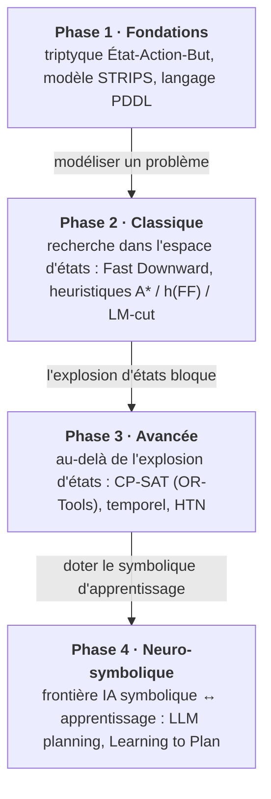

# Planification Automatique - Automated Planning

[← Lean](../Lean/README.md) | [↑ SymbolicAI](../README.md) | [SmartContracts →](../SmartContracts/README.md)

<!-- CATALOG-STATUS
series: SymbolicAI-Planners
pedagogical_count: 14
breakdown: Planners=14
maturity: PRODUCTION=13, BETA=1
-->

Cette série de notebooks introduit la **Planification Automatique**, une branche fondamentale de l'IA qui génère des séquences d'actions pour atteindre des objectifs.

La planification répond à une question différente de celle de l'apprentissage : non pas « que prédire ? » mais « **que faire ?** ». À partir d'un modèle du monde — un état initial, des actions avec leurs préconditions et effets, un but — un planificateur cherche automatiquement une suite d'actions qui mène au but. C'est une technologie éprouvée : elle pilote des robots (manipulation, navigation), optimise la logistique et l'ordonnancement, et a dirigé des engins spatiaux autonomes (Remote Agent sur Deep Space 1, planification d'activités des rovers martiens). Le langage **PDDL** a standardisé la manière de décrire ces problèmes, donnant naissance à tout un écosystème de solveurs comparables. La planification connaît aujourd'hui un regain d'intérêt avec les LLMs, comme moyen de doter les modèles de langage d'une capacité d'action vérifiable et orientée vers un but.

**14 notebooks** | **5 parties** | **~8h**

**À qui s'adresse cette série** : étudiants en IA, ingénieurs en robotique et logistique, développeurs souhaitant intégrer la planification symbolique dans leurs applications. Aucun prérequis en planification : les concepts sont introduits progressivement depuis les fondements STRIPS jusqu'aux approches neuro-symboliques modernes.

## Vue d'ensemble

| Statistique | Valeur |
|-------------|--------|
| Notebooks | 14 (1 setup + 3 foundation + 4 classical dont 1 companion Lean + 3 advanced + 3 neuro-symbolic) |
| Durée totale | ~8h |
| Langage | Python 3.9+ |
| Kernel | Python 3 |
| Solveurs | Fast Downward, OR-Tools CP-SAT, unified-planning |
| Environnement | Docker (Fast Downward), pip (Python packages) |

La progression pédagogique suit l'**évolution des paradigmes** de planification : chaque phase répond aux limites de la précédente, du modèle formel jusqu'à la frontière neuro-symbolique.



## Parcours d'apprentissage

### Phase 1 : Fondations (Notebooks 1-3, ~2h)

La série débute par le notebook Setup (0) qui configure automatiquement l'environnement : installation de `unified-planning`, OR-Tools, vérification de Docker et lancement du conteneur Fast Downward. Le notebook 1 (Introduction) présente le triptyque fondamental État-Action-But, le modèle STRIPS (1971) avec ses hypothèses — statique, déterministe, observable, discret, instantané — et le contexte historique depuis Fikes & Nilsson jusqu'aux LLMs modernes. Le notebook 2 (PDDL-Basics) plonge dans la syntaxe PDDL : domaines, problèmes, types, prédicats, actions, préconditions et effets. Le notebook 3 (State-Space) explore l'explosion combinatoire ($O(2^n)$ prédicats) et la nécessité des heuristiques pour guider la recherche dans l'espace d'états. À l'issue de cette phase, vous savez modéliser un problème en PDDL et comprendre pourquoi la recherche aveugle ne suffit pas.

### Phase 2 : Planification Classique (Notebooks 4-6, ~3h)

Les notebooks 4 à 6 constituent le cœur technique de la série. Le notebook 4 (Fast-Downward) présente l'architecture en trois étapes de Fast Downward (translator PDDL→SAS+, preprocessor C++, search C++) et montre comment l'exécuter via Docker et unified-planning. Les algorithmes de recherche (A*, Greedy, EHC) y sont testés sur Blocks World et Logistics. Le notebook 5 (Heuristics) approfondit la théorie : classification admissible/non-admissible ($h^{add}$, $h^{max}$, $h^{FF}$, LM-cut), comparaison expérimentale des heuristiques sur le nombre de nœuds expansés, et guide de sélection. Le notebook **5b** (Lean-Relaxation) est un **companion natif** au kernel Lean 4 : il prouve formellement, sans `sorry`, l'admissibilité de la relaxation $h^{+} \leq h^{*}$ dans le lake `planning_lean` — la certification mathématique de la propriété que le notebook 5 constate empiriquement. Le notebook 6 (Domains) couvre les domaines standards de l'IPC (Blocks World, Logistics, Gripper, Satellite) avec des problèmes de complexité croissante. À l'issue, vous pouvez configurer un planificateur optimal, choisir l'heuristique adéquate, et modéliser n'importe quel domaine IPC.

### Phase 3 : Approches Avancées (Notebooks 7-9, ~3h)

La planification classique épuise ses limites dès que les problèmes deviennent trop grands pour l'exploration d'états. Les notebooks 7 à 9 proposent des alternatives. Le notebook 7 (OR-Tools) introduit la programmation par contraintes avec CP-SAT de Google OR-Tools : modélisation de contraintes (all-different, cumulative, table), scheduling, et optimisation multi-objectif. Le notebook 8 (Temporal) étend au domaine temporel avec PDDL 2.1 : durées d'actions, parallélisme, contraintes temporelles simples et denses, ordonnancement de tâches. Le notebook 9 (HTN) présente la planification hiérarchique (Task Networks) : tâches primitives vs abstraites, méthodes de décomposition, langage HDDL, solveur inspiré de SHOP2, et comparaison avec STRIPS. À l'issue, vous disposez de trois paradigmes complémentaires pour les problèmes qui dépassent la planification classique.

### Phase 4 : Neuro-Symbolique (Notebooks 10-12, ~3h)

La dernière partie explore la frontière entre IA symbolique et apprentissage profond. Le notebook 10 (LLM-Planning) montre comment les Large Language Models peuvent générer des plans à partir de descriptions en langage naturel, le prompting pour la planification, et le plan repair. Le notebook 11 (Unified-Planning) détaille l'interface unifiée `unified-planning` : connexion à plusieurs solveurs en quelques lignes, comparaison croisée des performances, et portabilité du modèle PDDL entre moteurs. Le notebook 12 (LOOP) introduit le paradigme **Learning to Plan** : architecture LOOP (state encoder, policy network, value network), encodage PDDL en tenseurs (one-hot, GNN), entraînement par imitation et renforcement, résultats sur benchmarks IPC (85.8% coverage), et comparaison avec KRCL. Ce notebook conclut la série avec les tendances futures : foundation models, meta-learning, inverse reinforcement learning.

### Parcours alternatifs

#### Parcours rapide (4h, minimum viable)
Pour découvrir l'essentiel rapidement :
1. `0-Setup` (20 min) : installer et vérifier l'environnement
2. `1-Introduction` (30 min) : comprendre les concepts
3. `4-Fast-Downward` (45 min) : exécuter un vrai planificateur
4. `11-Unified-Planning` (40 min) : comparer les solveurs

#### Parcours classique (5h, optimalité)
Pour maîtriser les planificateurs optimaux :
1. `0-Setup` → `1-Introduction` → `2-PDDL-Basics` → `3-State-Space`
2. `4-Fast-Downward` → `5-Heuristics` → `6-Domains`

#### Parcours contraintes + temporel (6h, scheduling)
Pour les applications de planification par contraintes et temporelles :
1. `0-Setup` → `1-Introduction` → `2-PDDL-Basics`
2. `7-OR-Tools` → `8-Temporal` → `9-HTN`

#### Parcours neuro-symbolique (5h, recherche)
Pour les approches combinées apprentissage profond + symbolique :
1. `0-Setup` → `1-Introduction` → `4-Fast-Downward`
2. `10-LLM-Planning` → `11-Unified-Planning` → `12-LOOP`

## Quel parcours choisir ?

### Si vous débutez en planification
**Commencez par les fondations.** Le notebook 1 (Introduction) pose le vocabulaire (état, action, but, STRIPS) et le contexte historique. Le notebook 2 (PDDL-Basics) apprend la syntaxe standard du domaine. Sans ces bases, les notebooks suivants seront difficiles à suivre.

**Passez à la planification classique quand :** vous avez un domaine PDDL défini et voulez trouver un plan optimal rapidement. Fast Downward + LM-cut est le choix par défaut.

### Si vous venez de la recherche opérationnelle
**Commencez par OR-Tools (notebook 7).** Le CP-SAT est familier aux optimiseurs : modélisation par contraintes, fonctions objectif, solveur commercial (ou open-source). La transition vers la planification est naturelle.

**Passez à PDDL quand :** vous avez besoin de la portabilité du modèle (même domaine, solveurs multiples) ou que vous voulez exploiter les heuristiques spécialisées de Fast Downward.

### Si vous ne savez pas quoi choisir

| Critère | Recommandation |
|---------|----------------|
| Juste découvrir la planification | **Planners-0-Setup** + **Planners-1-Introduction** |
| Un premier planificateur qui marche | **Planners-4-Fast-Downward** (Docker + Blocks World) |
| Optimisation de scheduling | **Planners-7-OR-Tools** |
| Planification hiérarchique | **Planners-9-HTN** (SHOP2, decomposition) |
| Frontière LLM + IA | **Planners-10-LLM-Planning** |
| Approche neuro-symbolique avancée | **Planners-12-LOOP** (85.8% IPC coverage) |
| Comparer tous les solveurs | **Planners-11-Unified-Planning** |

## Structure

```
SymbolicAI/Planners/
├── README.md
├── 00-Environment/
│   └── Planners-0-Setup.ipynb           # Configuration environnement
├── 01-Foundation/
│   ├── Planners-1-Introduction.ipynb    # Concepts, STRIPS
│   ├── Planners-2-PDDL-Basics.ipynb     # Syntaxe PDDL
│   └── Planners-3-State-Space.ipynb     # Espaces d'états
├── 02-Classical/
│   ├── Planners-4-Fast-Downward.ipynb   # A*, heuristiques
│   ├── Planners-5-Heuristics.ipynb      # h-add, h-max, h-FF
│   ├── Planners-5b-Lean-Relaxation.ipynb # Companion Lean 4 : preuve h+ <= h*
│   └── Planners-6-Domains.ipynb         # Domaines classiques
├── 03-Advanced/
│   ├── Planners-7-OR-Tools.ipynb        # CP-SAT
│   ├── Planners-8-Temporal.ipynb        # Planification temporelle
│   └── Planners-9-HTN.ipynb             # Planification hiérarchique
├── 04-NeuroSymbolic/
│   ├── Planners-10-LLM-Planning.ipynb   # LLM + Planning
│   ├── Planners-11-Unified-Planning.ipynb # Interface unifiée
│   └── Planners-12-LOOP.ipynb           # Learning to Plan
├── planning_lean/                        # Projet Lake Lean 4 (preuve formelle 0-sorry de l'admissibilité de la relaxation h+ <= h*, cf Planners-5b)
├── requirements.txt                      # Dépendances Python (unified-planning, Fast Downward, etc.)
└── archive/
    └── Fast-Downward-Legacy.ipynb       # Version archivée
```

## Objectifs d'apprentissage

A l'issue de cette série, vous saurez :

1. **Modéliser** des problèmes de planification en PDDL (Planning Domain Definition Language)
2. **Utiliser** les planificateurs modernes (Fast Downward, OR-Tools, unified-planning)
3. **Comprendre** les heuristiques de recherche ($h^{add}$, $h^{max}$, $h^{FF}$, LM-cut)
4. **Étendre** la planification au temporel, hiérarchique et neuro-symbolique

## Niveaux de difficulté

| Niveau | Description | Notebooks |
|--------|-------------|-----------|
| Foundation | Introduction, concepts de base | 0, 1, 2, 3 |
| Intermediate | Algorithmes, outils pratiques | 4, 5, 6, 7, 8, 9 |
| Advanced | Extensions, recherche | 10, 11, 12 |

## Contenu détaillé des notebooks

Chaque notebook introduit un concept ou modèle spécifique. Le tableau ci-dessous résume en une ligne l'apport pédagogique de chacun — au-delà du titre, c'est le **concept clé** qu'il enseigne.

| # | Notebook | Apport pédagogique |
|---|----------|-------------------|
| 0 | Setup | Boucle environnement : vérification Python → installation packages → Docker → premier PDDL |
| 1 | Introduction | Triptyque État-Action-But, hypothèses STRIPS (1971), taxonomie des paradigmes |
| 2 | PDDL-Basics | Syntaxe PDDL : domaines, problèmes, types, prédicats, actions, préconditions, effets |
| 3 | State-Space | Explosion combinatoire $O(2^n)$, nécessité des heuristiques, graphe d'états |
| 4 | Fast-Downward | Architecture 3 étapes (translator/preprocessor/search), A* vs Greedy vs EHC via Docker |
| 5 | Heuristics | Classification admissible/non-admissible : $h^{add}$, $h^{max}$, $h^{FF}$, LM-cut, comparaison expérimentale |
| 5b | Lean-Relaxation | Companion **natif** (kernel Lean 4) : preuve formelle 0-sorry de l'admissibilité de la relaxation ($h^{+} \leq h^{*}$) dans le lake `planning_lean`, `#check` + `#print axioms` in-kernel |
| 6 | Domains | Domaines IPC standards (Blocks, Logistics, Gripper, Satellite), complexité croissante |
| 7 | OR-Tools | CP-SAT, programmation par contraintes, modélisation de scheduling, contraintes alldifferent |
| 8 | Temporal | PDDL 2.1, durées d'actions, parallélisme, contraintes temporelles, ordonnancement |
| 9 | HTN | Planification hiérarchique : tâches primitives/abstraites, méthodes, HDDL, SHOP2 |
| 10 | LLM-Planning | Planification avec LLMs, prompting, plan repair, limites et avantages |
| 11 | Unified-Planning | Interface multi-solveurs, comparaison croisée, portabilité du modèle |
| 12 | LOOP | Learning to Plan : state encoder, policy network, value network, 85.8% IPC coverage |

---

## Vue d'ensemble des parties

### Partie 0 : Environnement (00-Environment/)

| # | Notebook | Kernel | Contenu | Durée |
|---|----------|--------|---------|-------|
| 0 | [Planners-0-Setup](00-Environment/Planners-0-Setup.ipynb) | Python | Installation unified-planning, OR-Tools, Docker Fast Downward | 20 min |

### Partie 1 : Fondations ([01-Foundation/](01-Foundation/README.md))

| # | Notebook | Kernel | Contenu | Durée |
|---|----------|--------|---------|-------|
| 1 | [Planners-1-Introduction](01-Foundation/Planners-1-Introduction.ipynb) | Python | Concepts, modèle STRIPS, triptyque État-Action-But | 30 min |
| 2 | [Planners-2-PDDL-Basics](01-Foundation/Planners-2-PDDL-Basics.ipynb) | Python | Syntaxe PDDL, domaines, problèmes, prédicats, actions | 40 min |
| 3 | [Planners-3-State-Space](01-Foundation/Planners-3-State-Space.ipynb) | Python | Espaces d'états, graphes de recherche, explosion combinatoire | 35 min |

### Partie 2 : Planification Classique ([02-Classical/](02-Classical/README.md))

| # | Notebook | Kernel | Contenu | Durée |
|---|----------|--------|---------|-------|
| 4 | [Planners-4-Fast-Downward](02-Classical/Planners-4-Fast-Downward.ipynb) | Python | Architecture FD, Docker, A*, GBFS, EHC, heuristiques | 45 min |
| 5 | [Planners-5-Heuristics](02-Classical/Planners-5-Heuristics.ipynb) | Python | h-add, h-max, h-FF, landmarks | 40 min |
| 5b | [Planners-5b-Lean-Relaxation](02-Classical/Planners-5b-Lean-Relaxation.ipynb) | Lean 4 | Companion **natif** (kernel Lean) : preuve formelle 0-sorry de l'admissibilité de la relaxation (h⁺ ≤ h\*) dans le lake `planning_lean`, `#check` + `#print axioms` in-kernel (UNLOCK c.127, jonction Mathlib #2611) | 45 min |
| 6 | [Planners-6-Domains](02-Classical/Planners-6-Domains.ipynb) | Python | Blocks World, Logistics, Gripper, Ferry, Hanoi | 50 min |

### Partie 3 : Approches Avancées ([03-Advanced/](03-Advanced/README.md))

| # | Notebook | Kernel | Contenu | Durée |
|---|----------|--------|---------|-------|
| 7 | [Planners-7-OR-Tools](03-Advanced/Planners-7-OR-Tools.ipynb) | Python | CP-SAT, programmation par contraintes, scheduling | 45 min |
| 8 | [Planners-8-Temporal](03-Advanced/Planners-8-Temporal.ipynb) | Python | PDDL 2.1, durées, parallélisme, ordonnancement | 40 min |
| 9 | [Planners-9-HTN](03-Advanced/Planners-9-HTN.ipynb) | Python | Hierarchical Task Networks, méthodes, décomposition | 45 min |

### Partie 4 : Neuro-Symbolique ([04-NeuroSymbolic/](04-NeuroSymbolic/README.md))

| # | Notebook | Kernel | Contenu | Durée |
|---|----------|--------|---------|-------|
| 10 | [Planners-10-LLM-Planning](04-NeuroSymbolic/Planners-10-LLM-Planning.ipynb) | Python | LLMs pour la planification, prompting, plan repair | 50 min |
| 11 | [Planners-11-Unified-Planning](04-NeuroSymbolic/Planners-11-Unified-Planning.ipynb) | Python | Interface unifiée, multi-solveurs, comparaisons | 40 min |
| 12 | [Planners-12-LOOP](04-NeuroSymbolic/Planners-12-LOOP.ipynb) | Python | Learning to Plan, modèles neuronaux pour heuristiques | 45 min |

---

## Qu'est-ce que la planification ?

| Aspect | Description |
|--------|-------------|
| **Entrée** | État initial + modèle du domaine + condition but |
| **Sortie** | Séquence d'actions (plan) exécutable |
| **Hypothèse** | Déterministe, observable, discret (STRIPS classique) |
| **Complexité** | NP-complet en général ($O(2^n)$ états possibles) |
| **Garantie** | Optimal si heuristique admissible (A*) |

## Prérequis

### Connaissances requises

- **Python 3.9+** : programmation orientée objet, types, dataclasses
- **Algorithmique de base** : graphes (BFS, DFS, A*), recherche
- **Logique propositionnelle** : prédicats, connecteurs logiques, quantificateurs

### Pour les notebooks avancés

- **Bases en machine learning** (notebooks 10-12) : réseaux de neurones, loss, backpropagation
- **API OpenAI/Anthropic** (notebook 10) : prompts LLM, génération de texte
- **Connaissance de PDDL** (notebooks 8-9) : domaines, problèmes, types

### Pour les notebooks pratiques

- **Docker** (notebooks 4-6) : exécution du conteneur Fast Downward sur le port 8200
- **OR-Tools** (notebook 7) : modélisation de contraintes, solveur CP-SAT

### Prérequis techniques

#### 1. Environnement Python

```bash
# Créer un environnement virtuel
python -m venv venv
source venv/bin/activate  # Linux/Mac
# ou venv\Scripts\activate  # Windows

# Installer les dépendances
pip install unified-planning ortools numpy matplotlib networkx
```

#### 2. Docker pour Fast Downward (recommandé)

```bash
# Télécharger l'image Docker Fast Downward (serveur HTTP port 8200)
docker pull jsboige/coursia-fast-downward:latest
```

L'image fournit un serveur API HTTP sur le port 8200. Les notebooks appellent l'endpoint `/plan` avec un payload JSON `{domain, problem, search}` et reçoivent le plan optimal.

#### 3. Vérification

```bash
python -c "import unified_planning; from ortools.sat.python import cp_model; print('OK')"
# Vérifier le serveur Fast Downward (port 8200)
curl -s http://localhost:8200/health
```

## Outils couverts

| Outil | Description | Notebooks |
|-------|-------------|-----------|
| **unified-planning** | Interface Python unifiée pour planificateurs PDDL | Tous |
| **Fast Downward** | Planificateur optimal IPC winner (A*, LM-cut) | 4, 5, 6 |
| **OR-Tools CP-SAT** | Solveur de contraintes Google (scheduling) | 7 |
| **PDDL** | Planning Domain Definition Language (standard IPC) | 2-9 |
| **HDDL** | Hierarchical Domain Definition Language (HTN) | 9 |
| **OpenAI/Anthropic API** | LLMs pour génération de plans | 10 |
| **PyTorch** | Réseaux de neurones pour heuristiques (LOOP) | 12 |

## Domaines PDDL classiques

Les notebooks utilisent les domaines standards de l'IPC (International Planning Competition) :

| Domaine | Description | Complexité | Notebooks |
|---------|-------------|------------|-----------|
| **Blocks World** | Empiler des blocs pour une tour | Simple | 1, 2, 4, 5, 6 |
| **Gripper** | Robot avec pinces déplace des balles | Simple | 4, 6, 12 |
| **Logistics** | Transport de colis entre lieux avec véhicules | Moyen | 4, 6, 8, 9 |
| **Depots** | Gestion d'entrepôt avec grues | Moyen | 6 |
| **Satellite** | Planification d'observations spatiales | Complexe | 6 |
| **Hanoi** | Tour de Hanoi (récursivité naturelle) | Moyen | 6 |

## PDDL - Planning Domain Definition Language

PDDL est le langage standard pour décrire des problèmes de planification.

### Domaine (domain.pddl)

```lisp
(define (domain blocks)
  (:requirements :strips :typing)
  (:types block)
  (:predicates
    (on ?x - block ?y - block)
    (clear ?x - block)
    (ontable ?x - block)
    (holding ?x - block)
    (handempty)
  )
  (:action pick-up
    :parameters (?x - block)
    :precondition (and (clear ?x) (ontable ?x) (handempty))
    :effect (and (holding ?x) (not (ontable ?x)) (not (clear ?x)) (not (handempty))))
)
```

### Problème (problem.pddl)

```lisp
(define (problem blocks-tower)
  (:domain blocks)
  (:objects a b c - block)
  (:init
    (ontable a) (ontable b) (ontable c)
    (clear a) (clear b) (clear c)
    (handempty)
  )
  (:goal (and (on a b) (on b c)))
)
```

## Comparaison des approches

| Approche | Optimalité | Vitesse | Expressivité |
|----------|------------|---------|--------------|
| **A* + LM-cut** | Admissible | Rapide | STRIPS |
| **A* + FF** | Non garanti | Très rapide | STRIPS+ |
| **GBFS + FF** | Non | Très rapide | STRIPS+ |
| **CP-SAT** | Optimal | Variable | Contraintes |
| **HTN** | Variable | Rapide | Hiérarchique |
| **LOOP** | Non | Variable | Généralisé |

## Fast Downward

Planificateur optimal développé à l'Université de Bâle :

| Caractéristique | Description |
|-----------------|-------------|
| **Architectures** | Translator (PDDL→SAS+) → Preprocessor → Search |
| **Algorithmes** | A*, GBFS (eager/lazy), EHC, LAMA |
| **Heuristiques** | FF, add, hmax, LM-cut, merge-and-shrink |
| **Performance** | Gagnant IPC plusieurs fois |

### Utilisation via Docker (serveur HTTP)

```bash
# Lancer le conteneur Fast Downward (port 8200)
docker run -d --name coursia-fast-downward -p 8200:8200 jsboige/coursia-fast-downward:latest

# Soumettre un problème via l'API HTTP
curl -X POST http://localhost:8200/plan \
  -H "Content-Type: application/json" \
  -d '{"domain": "<domain.pddl>", "problem": "<problem.pddl>", "search": "astar(lmcut())"}'
```

### Utilisation via unified-planning

```python
from unified_planning.shortcuts import *
from up_fast_downward import FastDownwardPDDLPlanner

# Définir le problème avec unified-planning
problem = Problem('my-problem')
# ... (voir notebooks pour détails)

# Résoudre avec Fast Downward
planner = FastDownwardPDDLPlanner()
result = planner.solve(problem)
```

## HTN - Planification Hiérarchique

La planification HTN (Hierarchical Task Network) structure la recherche par décomposition de tâches :

| Concept | Définition |
|---------|------------|
| **Tâche primitive** | Action directement exécutable (ex: `drive(truck, A, B)`) |
| **Tâche abstraite** | Tâche à décomposer (ex: `deliver(pkg, A, B)`) |
| **Méthode** | Règle de décomposition avec préconditions et sous-tâches |
| **HDDL** | Langage standard pour domaines HTN (extension de PDDL) |

### Algorithme SHOP2

SHOP2 (Simple Hierarchical Ordered Planner 2) utilise la décomposition ordonnée :

1. Traiter la première tâche de la liste
2. Si primitive : vérifier préconditions, appliquer, passer à la suivante
3. Si abstraite : choisir une méthode applicable, remplacer par sous-tâches
4. Backtracking : essayer la méthode suivante si échec

## Concepts clés

| Concept | Définition |
|---------|------------|
| **STRIPS** | Modèle de planification avec préconditions/add/delete (1971) |
| **PDDL** | Planning Domain Definition Language - standard IPC depuis 1998 |
| **Heuristique** | Fonction estimant le coût pour atteindre le but |
| **A*** | Algorithme de recherche optimale avec heuristique admissible |
| **Landmark** | Fait qui doit être vrai à un moment du plan |
| **HTN** | Hierarchical Task Network - décomposition de tâches |
| **LM-cut** | Heuristique admissible basée sur les landmarks |
| **CP-SAT** | Constraint Programming-Satisfiability (OR-Tools) |
| **Learning to Plan** | Apprentissage d'heuristiques par réseaux de neurones |
| **LOOP** | Framework neuro-symbolique, 85.8% coverage IPC |

## Caractéristiques de la série

| Caractéristique | Description |
|-----------------|-------------|
| **Progression** | Fondations → Classique → Avancé → Neuro-symbolique |
| **Pratique** | Chaque notebook contient des exemples exécutés et des exercices |
| **Outils réels** | Fast Downward (IPC winner), OR-Tools (Google), unified-planning |
| **Domaines IPC** | Blocks World, Logistics, Gripper — les mêmes que les compétitions |
| **Output verify** | Tous les notebooks sont exécutés avec outputs inclus |
| **Navigation** | Headers avec liens précédent/suivant dans chaque notebook |

## Quick Start

```bash
# 1. Installer les dépendances Python
pip install unified-planning ortools numpy matplotlib networkx

# 2. Vérifier l'installation
python -c "import unified_planning; from ortools.sat.python import cp_model; print('OK')"

# 3. Premier notebook (introduction aux concepts)
jupyter notebook 01-Foundation/Planners-1-Introduction.ipynb
```

Pour les notebooks 4-6 (Fast Downward), l'image Docker `jsboige/coursia-fast-downward` fournit un serveur API HTTP sur le port 8200 : `docker pull jsboige/coursia-fast-downward:latest`. Les notebooks théoriques (1-3, 7-12) ne nécessitent que Python.

## Navigation guide

### Progression recommandée

1. **Débutants** : Commencer par `00-Environment/Planners-0-Setup.ipynb`
2. **Fondations** : Suivre `01-Foundation/` dans l'ordre
3. **Pratique** : Explorer `02-Classical/` pour les outils
4. **Avancé** : `03-Advanced/` et `04-NeuroSymbolic/` selon intérêts

### Liens de navigation

Chaque notebook contient :
- Header avec liens vers précédent/suivant
- Navigation vers cet index
- Ancres internes pour les sections

## Tests et validation

```bash
# Vérifier la structure des notebooks
python scripts/notebook_tools/notebook_tools.py validate MyIA.AI.Notebooks/SymbolicAI/Planners --quick

# Execution complete (mode batch)
BATCH_MODE=true python scripts/notebook_tools/notebook_tools.py execute MyIA.AI.Notebooks/SymbolicAI/Planners
```

## Ressources externes

### Documentation

- [unified-planning](https://github.com/aiplan4eu/unified-planning) - Bibliothèque Python
- [Fast Downward](https://www.fast-downward.org/) - Planificateur de référence
- [PDDL Reference](https://planning.wiki/) - Documentation PDDL complète
- [OR-Tools CP-SAT](https://developers.google.com/optimization/cp/cp_sat) - Documentation Google

### Cours et tutoriels

- [AI Planning - University of Edinburgh](https://www.coursera.org/learn/ai-planning)
- [Classical Planning - Stanford](https://www.youtube.com/watch?v=WEDagb6TsK8)
- [IPC Benchmarks](https://github.com/aibasel/downward-benchmarks) - Problèmes standards

### Publications

| Référence | Couverture |
|-----------|------------|
| Ghallab, Nau & Traverso, *Automated Planning: Theory and Practice* (2004) | Textbook de référence, toute la série |
| Russell & Norvig, *AIMA* 4e éd., ch. 10-11 | Cadre général planification |
| Helmert, "The Fast Downward Planning System" (2006) | Notebooks 4-6 |
| Hoffmann & Nebel, "The FF Planning System" (2001) | Heuristique h-FF, notebook 5 |
| Richter & Westphal, "LAMA: Planner" (2010) | Landmarks, notebook 5 |
| Fox & Long, "PDDL2.1: An Extension to PDDL for Expressing Temporal Planning Domains" (2003) | Notebook 8 |
| Erol, Hendler & Nau, "HTN Planning: Complexity and Expressivity" (1994) | Notebook 9 |
| Valmeekam et al., "On the Planning Abilities of Large Language Models" (2024) | Notebook 10 |

## Relation avec SymbolicAI

La planification automatique est une branche de l'IA symbolique :

- Raisonnement sur actions et états
- Recherche dans l'espace d'états
- Heuristiques admissibles pour optimalité

### Ponts avec les autres séries

| Série | Connection | Détails |
| ----- | ---------- | ------- |
| **[Tweety](../Tweety/)** | Logique et argumentation | Les solveurs SAT/CSP de Tweety complètent les planificateurs PDDL. Les dialogues argumentatifs (Tweety-8) sont des instances de planification multi-agents. |
| **[Lean](../Lean/)** | Vérification formelle | Les plans générés peuvent être vérifiés formellement. Les heuristiques d'admissibilité (h-max, LM-cut) reposent sur des preuves de correction similaires aux tactiques Lean. |
| **[SmartContracts](../SmartContracts/)** | Exécution planifiée | Les smart contracts DeFi (liquidations, arbitrage) sont des problèmes de planification sous contraintes temporelles et de gaz. Le notebook SC-14 (vérification formelle) croise OR-Tools (Planners-7). |
| **[GameTheory](../../GameTheory/)** | Jeux séquentiels | La recherche adversariale (A*, minimax) est commune à la planification classique et à la théorie des jeux. Les jeux coopératifs (Shapley) sont des problèmes d'allocation de tâches planifiables. |
| **[Search](../../Search/)** | Fondements communs | La série Search couvre les algorithmes de base (BFS, DFS, A*) utilisés dans les planificateurs. CSP (Search Part2) correspond à OR-Tools CP-SAT (Planners-7). |
| Lecture transversale | [La mer qui monte](../../../docs/grothendieckian-lens.md) | Grille de lecture grothendieckienne du dépôt : changement de représentation, certification A/B/C |

## Cross-séries Bridges

| Série | Lien | Connection |
| ------- | ------ | ----------- |
| [Lean](../Lean/README.md) | Vérification formelle | Les plans PDDL générés peuvent être vérifiés formellement dans Lean |
| [Tweety](../Tweety/README.md) | Logique et argumentation | Les solveurs SAT de Tweety peuvent résoudre des sous-problèmes de planification |
| [SmartContracts](../SmartContracts/README.md) | Ordonnancement | Les liquidations DeFi sont des problèmes de planification temporelle (notebook 8) |
| [GameTheory](../../GameTheory/README.md) | Recherche séquentielle | A* en planification et minimax en jeux partagent la même structure de graphe |
| [Search](../../Search/README.md) | Fondations algorithmiques | A*, BFS, DFS de Search sont les bases des planificateurs classiques |

## FAQ / Troubleshooting

### 1. Le conteneur Docker Fast Downward ne répond pas sur le port 8200

**Symptôme** : `ConnectionRefusedError` ou timeout dans les notebooks 4-6.

**Causes et solutions** :

```bash
# Vérifier que le conteneur tourne
docker ps | grep coursia-fast-downward

# S'il n'apparaît pas, le lancer
docker run -d --name coursia-fast-downward -p 8200:8200 jsboige/coursia-fast-downward:latest

# Vérifier que le port est accessible
curl -s http://localhost:8200/health
```

Si le port 8200 est déjà pris par un autre service, utiliser un port différent :
```bash
docker run -d --name coursia-fast-downward -p 8201:8200 jsboige/coursia-fast-downward:latest
```
Dans ce cas, adapter l'URL dans les notebooks de `localhost:8200` vers `localhost:8201`.

### 2. unified-planning ne détecte pas Fast Downward

**Symptôme** : `up_fast_downward` importé mais `FastDownwardPDDLPlanner()` échoue avec une erreur de chemin.

**Cause** : `unified-planning` attend l'exécutable `downward` dans le PATH ou dans le répertoire configuré. Avec Docker, ce n'est pas nécessaire — les notebooks utilisent l'API HTTP à la place.

**Solution** : Les notebooks 4-6 utilisent le serveur Docker (endpoint `/plan`), pas l'exécutable local. Vérifier que les appels HTTP fonctionnent :
```python
import requests
resp = requests.post("http://localhost:8200/plan",
    json={"domain": domain_pddl, "problem": problem_pddl, "search": "astar(lmcut())"})
print(resp.status_code, resp.json())
```

### 3. Erreurs PDDL "undeclared variable" ou "type mismatch"

**Symptôme** : Le solveur rejette le domaine ou le problème PDDL avec une erreur de parsing.

**Causes fréquentes** :

| Erreur | Cause | Correction |
| ------ | ----- | ---------- |
| `undeclared variable '?x'` | Paramètre non déclaré dans `:parameters` | Ajouter `?x - type` dans la signature de l'action |
| `type mismatch` | Type de paramètre incorrect | Vérifier que le type existe dans `:types` |
| `unsupported requirement` | Requirement non supporté par le solveur | Retirer `:adl`, `:quantified-preconditions` ou utiliser un solveur compatible |
| `precondition false` | Conjonction vide ou variable non initialisée | Vérifier les noms de prédicats dans `:predicates` |

**Astuce** : Valider le PDDL avec [planning.wiki](https://planning.wiki/) avant de le soumettre au solveur. Le notebook 2 (PDDL-Basics) couvre la syntaxe complète.

### 4. OR-Tools CP-SAT : "model is infeasible" sur un problème simple

**Symptôme** : Le solveur CP-SAT retourne `INFEASIBLE` alors que le problème devrait avoir une solution.

**Causes** :

1. **Contradiction entre contraintes** : deux contraintes `model.Add(x == 1)` et `model.Add(x == 2)` sur la même variable.
2. **Domaine vide** : `model.NewIntVar(5, 3, "x")` (borne inférieure > supérieure).
3. **Contraintes cumulatives** : la capacité cumulée est inférieure à la demande totale.

**Diagnostic** :
```python
# Activer le log du solveur pour comprendre l'infeasibilité
solver = cp_model.CpSolver()
solver.parameters.max_time_in_seconds = 30.0
status = solver.Solve(model)
if status == cp_model.INFEASIBLE:
    # Vérifier les contraintes une par une en les désactivant
    for i, ct in enumerate(model.proto.constraint):
        print(f"Constraint {i}: {ct}")
```

### 5. Explosion combinatoire : le solveur ne termine pas

**Symptôme** : Le planificateur tourne indéfiniment sur un problème de taille moyenne.

**Cause** : L'espace d'états explose ($O(2^n)$ pour $n$ prédicats). Les domaines comme Logistics ou Satellite avec beaucoup d'objets sont particulièrement sensibles.

**Solutions** :

| Stratégie | Configuration | Quand l'utiliser |
| --------- | ------------- | ---------------- |
| **Limiter le temps** | `solver.parameters.max_time_in_seconds = 60` | Problème trop grand |
| **Heuristique rapide** | Utiliser `eager_greedy([ff()])` au lieu de `astar(lmcut())` | Solution rapide, pas forcément optimale |
| **Réduire le problème** | Moins d'objets dans `:objects` | Prototypage, validation du modèle |
| **Sous-optimal** | `astar(ff())` avec weight > 1 | Bon compromis qualité/temps |

### 6. Docker sur Windows : "permission denied" ou "daemon not running"

**Symptôme** : Les commandes `docker` échouent sur Windows.

**Solutions** :

1. Vérifier que Docker Desktop est lancé (icône dans la barre des tâches).
2. Sur Windows, utiliser PowerShell en mode Administrateur si nécessaire.
3. Alternative sans Docker : installer Fast Downward nativement (Linux/WSL uniquement) :
   ```bash
   # Dans WSL
   git clone https://github.com/aibasel/downward.git
   cd downward && ./build.py
   # Puis pointer unified-planning vers le binaire
   ```

Les notebooks théoriques (1-3, 7-12) ne nécessitent **pas** Docker et fonctionnent avec uniquement `pip install unified-planning ortools`.

## Contribution

Pour contribuer à cette série :

1. Suivre les conventions de [CLAUDE.md](../../../CLAUDE.md)
2. Respecter la structure pédagogique (header, objectifs, interprétations)
3. Utiliser `scripts/notebook_tools/notebook_helpers.py` pour la manipulation
4. Tester avec `python scripts/notebook_tools/notebook_tools.py validate`

## Conclusion / Prochaines étapes

### Ce que vous avez appris

La planification automatique est le versant **décisionnel** de l'IA — là où le machine learning demande « que prédire ? », la planification demande « **que faire ?** ». Cette série en a parcouru tout le spectre :

- **Les fondations classiques** (notebooks 1-4) : le triptyque État-Action-But, STRIPS, les heuristiques de recherche (A*, h-max, LM-cut). Vous avez vu qu'un plan n'est pas une prédiction — c'est une *séquence d'actions* justifiée par une structure de coût.
- **Les standards et solveurs** (notebooks 5-7) : PDDL comme langage commun, Fast Downward, OR-Tools CP-SAT, le passage du « plan à la main » au « plan par solveur industriel ».
- **La composition et la hiérarchie** (notebooks 8-9) : planification temporelle, réseaux de tâches hiérarchiques (HTN/SHOP2) — comment découper un but complexe en sous-but réutilisables.
- **La synthèse neuro-symbolique** (notebooks 10-12) : plan repair par LLM, l'API unified-planning, et surtout *Learning to Plan* (notebook 12) — le point où l'apprentissage rencontre la planification, clôture naturelle de la série vers les foundation models.

### Prochaines étapes

- **Poussez vers l'apprentissage par renforcement** : un plan est une politique déterministe ; le RL en calcule une stochastique. Le pont vers les politiques apprises et le décisionnel sous incertitude se fait naturellement.
- **Reliez au raisonnement formel** : les domaines PDDL formalisent un monde ; les ontologies OWL font de même. La série **[SemanticWeb](../SemanticWeb/)** offre la représentation, Planners l'exploite pour agir.
- **Certifiez vos plans** : un plan correct n'est pas un plan sûr. La vérification formelle (séries **[Lean](../Lean/)** et **[SmartContracts](../SmartContracts/)**) s'applique aussi aux séquences d'actions critiques.
- **Élargissez à la recherche adversariale** : la planification mono-agent rencontre la théorie des jeux multi-agents dans la série **[GameTheory](../../GameTheory/)** ; la recherche combinatoire (CSP, satisfaction de contraintes) se trouve dans la série **[Search](../../Search/)**.
- Les tables « Ponts avec les autres séries » et « Cross-séries Bridges » ci-dessus cartographient l'ensemble de ces connexions ; la [Lecture transversale](../../../docs/grothendieckian-lens.md) les relie au fil rouge du dépôt.

### Le fil rouge

Le titre annonce la planification automatique. Mais le geste que cette série enseigne est plus simple : **transformer un but en action**. Les formalismes changent (STRIPS, PDDL, HTN), les solveurs changent (A*, Fast Downward, LLM), mais la structure reste — un état, un but, une séquence d'actions qui mène de l'un à l'autre. Le passage du *classique* au *neuro-symbolique* (notebook 12) ne change pas cette structure : il change qui la *cherche*. C'est elle que vous emportez au-delà de cette série.

---

## Statistiques catalogue à jour

Le décompte exact ci-dessous est synchronisé avec le bloc `<!-- CATALOG-STATUS -->` en tête de ce README. Toute modification d'un notebook (ajout, dépréciation, mise à jour de statut) doit s'accompagner d'une régénération du marqueur par le pipeline catalogue (cron quotidien ou bot par-PR `catalog-drift` sur `main`) — un agent sur une branche feature ne **régénère jamais** le catalogue à la main (cf règle R1 `catalog-pr-hygiene`).

| Sous-série | Notebooks | Maturité | Contenu clé |
|------------|-----------|----------|-------------|
| **00-Environment** | 1 | PRODUCTION=1, BETA=0 | Setup `unified-planning` + OR-Tools + vérification Docker Fast Downward (port 8200) |
| **01-Foundation** | 3 | PRODUCTION=3, BETA=0 | Triptyque État-Action-But, modèle STRIPS, syntaxe PDDL, explosion combinatoire $O(2^n)$ |
| **02-Classical** | 4 | PRODUCTION=3, BETA=1 | Fast Downward (translator→preprocessor→search), heuristiques admissibles ($h^{add}$, $h^{max}$, $h^{FF}$, LM-cut), domaines IPC (Blocks World, Logistics, Gripper, Satellite), companion Lean `5b-Lean-Relaxation` |
| **03-Advanced** | 3 | PRODUCTION=3, BETA=0 | CP-SAT (OR-Tools), planification temporelle PDDL 2.1 (durées, parallélisme), HTN/SHOP2 (décomposition hiérarchique, HDDL) |
| **04-NeuroSymbolic** | 3 | PRODUCTION=3, BETA=0 | LLM-Planning (génération plans depuis langage naturel, plan repair), `unified-planning` (portabilité cross-solveur), LOOP — *Learning to Plan* (state encoder + policy + value nets, 85.8% IPC coverage) |
| **Total** | **14** | **PRODUCTION=13, BETA=1** | Python 3.9+, kernel Python 3, solveurs : Fast Downward (Docker) + OR-Tools 9.8+ + unified-planning 1.1+ |

> **Note sur la maturité.** Le notebook `BETA=1` correspond à `Planners-5b-Lean-Relaxation.ipynb` (companion natif du lake `planning_lean/`) : la **preuve formelle 0-sorry** de l'admissibilité $h^{+} \leq h^{*}$ y est certifiée par `lake build` ; le statut `BETA` reflète la phase de relecture pédagogique (intégration au parcours d'apprentissage) plutôt qu'un défaut technique. Le déploiement industriel est validé.

**Conformité C.1 — stubs d'exercice.** Les cellules `student/` suivent les patterns conformes (jamais `raise NotImplementedError`) : `pass` / `return None` / `print("Exercice à compléter")` / `result = None  # TODO étudiant`. Le notebook s'exécute end-to-end même avant résolution des exercices. Dépendances Python (cf `requirements.txt` racine) : `unified-planning>=1.1`, `networkx>=3.1`, `matplotlib>=3.7`, `numpy>=1.24`, `ortools>=9.8`, `torch>=2.0` (LOOP uniquement) ; optionnels LLM : `openai>=1.0`, `anthropic>=0.30`, `python-dotenv`, `pandas>=2.0`. **Docker** requis pour Fast Downward (port 8200). **Lean 4** (`elan`) requis pour `5b-Lean-Relaxation` via le sous-lake `planning_lean/` (toolchain `lean-toolchain` local). Côté `student/` : `pip install -r requirements.txt` puis exécution kernel Python 3 standard.

---

## Écosystème MCP et parenté cross-lane

L'infrastructure du dépôt fournit trois familles d'outils MCP qui soutiennent cette série sans en être le sujet :

1. **MCP Jupyter (`mcp__jupyter-papermill__*`)** — exécution programmée de notebooks dans un kernel Jupyter géré. **Note bug** : le mode async (`mode: "async"`) ignore `kernel_name` et bascule sur `python3` par défaut — re-exécution via `nbconvert --execute --ExecutePreprocessor.kernel_name=python3 --timeout=600` en contournement (cf issue #5211). Planners utilise Python 3 exclusivement (kernel dédié, pas d'IKVM).
2. **Validation pre-commit** (`.pre-commit-config.yaml`) — `gitleaks` détecte les secrets inline ; le validateur notebook `validate_pr_notebooks.py` enforce C.1 (stubs sans `NotImplementedError`) et C.2 (notebooks commités AVEC outputs, `execution_count != null`). Toute PR Planners qui dégraderait l'un de ces contrats est bloquée en CI avant review.
3. **MCP QC Cloud (`mcp__qc-mcp-lite__*`)** — backtest QuantConnect partagé inter-agents. Planners n'utilise pas QC Cloud directement, mais le notebook `Planners-12-LOOP.ipynb` (Learning to Plan) partage avec QC le même besoin de reproductibilité déterministe : un seed fixe, un benchmark reproductible, une mesure de couverture sur des jeux d'instances standardisés (IPC vs historique SPY).

**Parenté cross-lane** (5 colonnes) — Planners se situe au croisement de plusieurs séries du dépôt, chacune capturant un aspect différent du « transformer un but en action » :

| Notebook Planners | Série parente | Pont conceptuel |
|-------------------|---------------|-----------------|
| `Planners-5b-Lean-Relaxation` | [Lean math](../Lean/) (et `planning_lean/` local) | Admissibilité $h^{+}$ prouvée formellement (lake 0-sorry) ; companion natif = pont intra-série simulation/proof |
| `Planners-7-OR-Tools` | [Search](../../Search/) (CSP-1/2/6/8/9 marathon #4956) | CP-SAT = même moteur que CSP ; planification = CSP avec variables = actions |
| `Planners-9-HTN` | [SmartContracts](../SmartContracts/) (planification déterministe d'opérations) | HTN/SHOP2 = décomposition hiérarchique ; Smart Contracts = décomposition vérifiable de transactions |
| `Planners-10-LLM-Planning` | [Argument_Analysis](../Argument_Analysis/) (Semantic Kernel orchestration) | LLM-Planning via SK : prompting structuré → génération de plan → validation par solveur |
| `Planners-11-Unified-Planning` | [Lean](../Lean/) + [SemanticWeb](../SemanticWeb/) (ontologies de domaine) | Modèle PDDL ↔ ontologie OWL/SHACL : un domaine PDDL peut être annoté sémantiquement |
| `Planners-12-LOOP` | [Probas](../../Probas/) (PyMC, Infer.NET) + [ML](../../ML/) (parité Python/.NET #4956) | Apprentissage par renforcement / imitation sur politiques de planification |

**Effet de composition — Planners = carrefour action/représentation.** Là où GameTheory est le carrefour **simulation/proof inter-séries** (Python ⇄ Lean 4 sur des théorèmes économiques), Planners est le carrefour **simulation/proof intra-série** : le notebook `5b-Lean-Relaxation` et son lake `planning_lean/` natif démontrent qu'une même propriété (ici l'admissibilité d'une heuristique) peut être **observée empiriquement** dans le kernel Python 3 (notebook `5-Heuristics.ipynb`) ET **prouvée formellement** dans le kernel Lean 4 (`Admissibility.lean`). C'est le pattern de dualité rendu **interne à la série**, là où GameTheory le déploie **entre séries distinctes**. La séquence pédagogique : STRIPS → PDDL → Fast Downward → heuristiques → **preuve de l'admissibilité de la relaxation** → CP-SAT → temporel → HTN → LLM-Planning → LOOP. Le pipeline 14 notebooks aligne l'évolution paradigmatique du domaine (1971 STRIPS → 2024 Learning to Plan) sur la **frontière de preuve** (informelle → formelle).

---

**Version 1.2.0** — Juillet 2026 — section Statistiques catalogue à jour + section Écosystème MCP et parenté cross-lane. EPIC #3975 tranche planners.

---

## Licence

Voir la licence du repository principal.

---

**Navigation** : [SymbolicAI](../README.md) | [Accueil](../../../CLAUDE.md)
