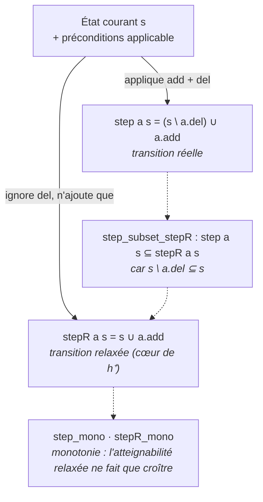
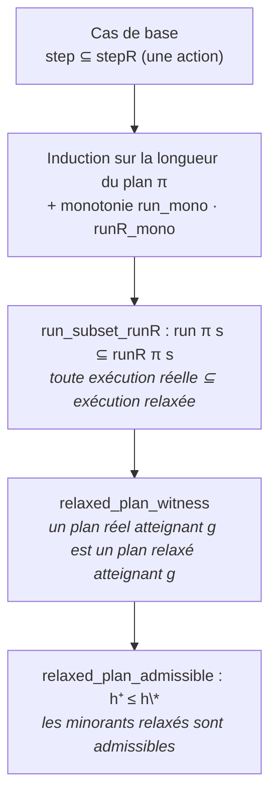

# planning_lean — admissibilité de la relaxation sans-delete (h⁺ ≤ h\*)

Mini-projet Lean 4 (avec Mathlib, toolchain `v4.31.0-rc1`) prouvant l'**admissibilité de
la relaxation sans-delete** en planification STRIPS : le coût du plan relaxé optimal
`h⁺` n'excède jamais le coût du plan réel optimal `h*`,

> **h⁺ ≤ h\***

Ce résultat justifie *formellement* l'usage des heuristiques de relaxation (h_max, h_add,
FF) comme **minorants admissibles** du coût réel — la base de la planification classique
moderne. Voir l'issue
[#4053](https://github.com/jsboige/CoursIA/issues/4053) (roadmap Lean
[#4038](https://github.com/jsboige/CoursIA/issues/4038), Tier 2).

## Modèle STRIPS

| Concept | Définition |
|---------|------------|
| **Fluent** `F` | type (décidablement égalable) des faits atomiques |
| **État** `s : Finset F` | ensemble des fluents vrais |
| **Action** `a = (pre, add, del)` | préconditions, effets additifs, effets de *deletion* |
| **Transition réelle** `step a s = (s \ a.del) ∪ a.add` | applique add ET del |
| **Transition relaxée** `stepR a s = s ∪ a.add` | ignore les deletions (cœur de h⁺) |

*La machinerie duale au cœur de la relaxation : la transition réelle applique add **et**
del, la transition relaxée ignore del — d'où l'inclusion fondamentale qui engendre
l'admissibilité :*



## Stratégie de preuve

La **relaxation sans-delete** ignore les effets `del` : l'état relaxé ne fait donc que
**croître** (monotonie de l'atteignabilité). Le résultat d'admissibilité suit de
l'inclusion fondamentale

> **`run π s ⊆ runR π s`** — toute exécution réelle d'un plan est incluse dans son
> exécution relaxée.

Preuve : le lemme clé `step a s ⊆ stepR a s` (car `s \ a.del ⊆ s`), remonté aux séquences
d'actions par induction sur la longueur du plan via la monotonie de `run` et `runR`.
Conséquence : tout plan réel atteignant le but `g` est aussi un plan relaxé atteignant
`g` ; par minimalité des coûts optimaux, `h⁺ ≤ h*`.

*La chaîne causale de l'admissibilité, de l'inclusion par action unique jusqu'au résultat
phare — induction, monotonie, puis minimalité des coûts optimaux :*



## Modules

| Module | Contenu |
|--------|---------|
| [`Planning/Strips.lean`](Planning/Strips.lean) | Modèle STRIPS : `State`, `Action`, `applicable`, `step` (réel), `stepR` (relaxé), `goalSatisfied`. Lemmas `step ⊆ stepR`, monotonie de `step`/`stepR`. |
| [`Planning/Relaxation.lean`](Planning/Relaxation.lean) | Exécution réelle `run` et relaxée `runR`, `reaches`/`reachesR`, **monotonie de l'atteignabilité relaxée** `runR_mono`, **lemme central** `run_subset_runR`. |
| [`Planning/Admissibility.lean`](Planning/Admissibility.lean) | **Théorème phare `relaxed_plan_admissible`** (h⁺ ≤ h\*) : tout plan réel est un plan relaxé. |

## Théorèmes prouvés (0 sorry)

- `relaxed_plan_admissible : reaches π s g → reachesR π s g` — tout plan réel atteignant
  le but `g` est aussi un plan relaxé atteignant `g` (h⁺ ≤ h\*).
- `run_subset_runR : run π s ⊆ runR π s` — toute exécution réelle est incluse dans
  l'exécution relaxée (lemme central).
- `runR_mono : s ⊆ s' → runR π s ⊆ runR π s'` — monotonie de l'atteignabilité relaxée
  (justifie la résolution polynomiale du plan relaxé).
- Supports : `step_subset_stepR`, `step_mono`, `stepR_mono`, `run_mono`.

Axiomes : `[propext, Classical.choice, Quot.sound]` (fondations standard Mathlib,
**pas de `sorryAx`**).

## Build

```bash
lake build Planning          # 8496 jobs, 0 sorry, exit 0
```

Vérifié localement : `lake build Planning` SUCCESS, `grep -E '^\s*sorry\b' Planning/` = 0,
CI `lean-planning.yml` (`sorry-baseline: "0"`, `sorry-filter-mode: standalone-tactic`).

## Jalon ouvert (non sorry-backed)

La **machinerie complète des heuristiques h_max / h_add** (fixpoint de l'atteignabilité
relaxée et l'inégalité `h_max ≤ h⁺ ≤ h_add`) n'est pas formalisée ici : elle nécessite
une définition récursive du point fixe relaxed-reachability et la preuve de convergence,
substantielle. L'admissibilité fondamentale `h⁺ ≤ h*` — le résultat qui légitime toute la
famille d'heuristiques de relaxation — est prouvée 0 sorry.

## Notebook compagnon

Présentation pédagogique des heuristiques de relaxation (h_max, h_add, FF) à venir dans la
série Planners. Conventions des lakes frères : le lake est le livrable formel, le
`lake build` est la preuve d'exécution ; le câblage du notebook compagnon revient au
propriétaire de la série Planners.
