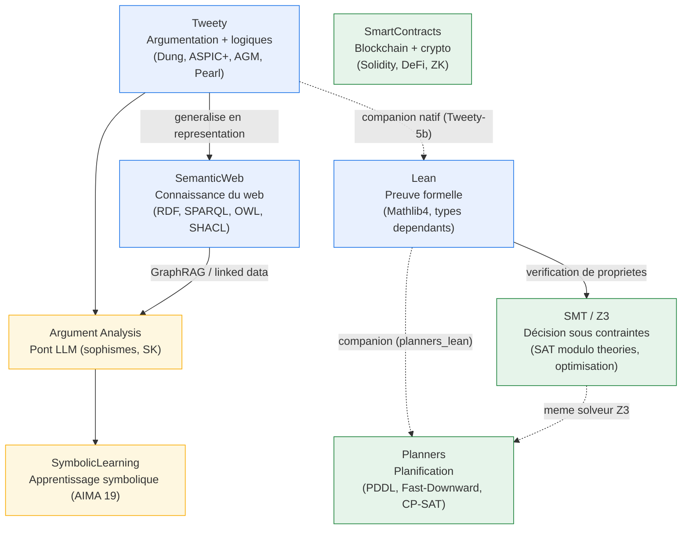

# SymbolicAI - Intelligence Artificielle Symbolique

[← Notebooks](../README.md) | [→ Sudoku](../Sudoku/README.md)

<!-- CATALOG-STATUS
series: SymbolicAI
pedagogical_count: 207
breakdown: Tweety=32, SMT=30, Lean=28, SmartContracts=27, SemanticWeb=25, Planners=23, Argument_Analysis=21, SymbolicLearning=20, root=1
maturity: PRODUCTION=172, BETA=34, ALPHA=1
-->

L'intelligence artificielle n'est pas qu'apprentissage automatique et réseaux de neurones. Une grande partie de l'IA classique repose sur le **raisonnement symbolique** : représenter la connaissance sous forme de propositions, de règles et de structures logiques, puis dériver mécaniquement de nouvelles conclusions. C'est cette tradition — des systèmes experts des années 80 aux assistants de preuve modernes comme Lean 4 — que cette série explore en profondeur.

Vous y découvrirez huit domaines complémentaires. Le **Web Sémantique** (RDF, SPARQL, OWL) montre comment structurer les connaissances du web pour les rendre exploitables par les machines. La **vérification formelle** avec Lean 4 vous apprend à écrire des preuves mathématiques vérifiées par un ordinateur. L'**argumentation computationnelle** (TweetyProject) modélise le débat et la délibération. La **résolution SMT** (Z3, satisfiability modulo theories) automatise la décision sous contraintes — cryptarithmes, planification, vérification de propriétés. La **planification automatique** résout des problèmes concrets de logistique et d'ordonnancement. Les **smart contracts** relient la cryptographie et la logique formelle aux blockchains. L'**analyse argumentative** avec les LLMs jette un pont entre l'IA symbolique et l'IA neuronale. Et l'**apprentissage symbolique** (AIMA ch. 19) montre comment un agent apprend à partir de connaissances existantes plutôt que de données brutes, jusqu'aux pipelines neuro-symboliques couplés aux LLMs. Chaque sous-série est autonome, mais ensemble elles dessinent une vision cohérente de l'IA symbolique moderne.

**Carte de la famille** — les huit sous-séries et leurs ponts (formalismes fondamentaux → applications → ponts neuro-symboliques) :



**À qui s'adresse cette série** : étudiants en IA, ingénieurs logiciel curieux de logique formelle, et chercheurs souhaitant aller au-delà du machine learning. Les notebooks Python (Tweety, Planners, SmartContracts, SemanticWeb Python, SymbolicLearning) ne nécessitent que Python 3.10+. Les notebooks .NET C# (SemanticWeb, optimisation) requièrent .NET 9.0 + dotnet-interactive. Les notebooks Lean nécessitent WSL + elan. Aucun prérequis en logique avancée : chaque série introduit ses concepts progressivement depuis les fondements.

## Parcours d'apprentissage

### Phase 1 : Logique et argumentation (Tweety, ~9h)

Le parcours commence par Tweety-1-Setup qui configure l'environnement Java/JPype et charge les 35 modules TweetyProject. Les notebooks 2-3 introduisent les logiques formelles (propositionnelle, premier ordre, modale, description) avec des solveurs SAT et des prouveurs de théorèmes. Les notebooks 4-7 couvrent la révision de croyances (postulats AGM), l'argumentation abstraite (sémantiques de Dung), l'argumentation structurée (ASPIC+, ABA, ASP avec Clingo), et les extensions (bipolaire, probabiliste). Les notebooks 8-9 appliquent ces théories aux dialogues d'agents et aux préférences collectives, tandis que les notebooks 10-11 étendent au raisonnement incertain (Markov Logic Networks, FOL pondérée) et causal (do-calculus de Pearl, interventions, contrefactuels). Un companion natif Lean (Tweety-5b) double l'argumentation abstraite d'une preuve formelle 0-sorry. À l'issue de cette phase, vous maîtrisez les formalismes de base du raisonnement symbolique et pouvez implémenter des systèmes argumentatifs.

### Phase 2 : Représentation de connaissances (SemanticWeb, ~13h)

Le Web Sémantique généralise les concepts logiques de la Phase 1 au web. Les notebooks 1-4 (C# et Python) couvrent RDF (triplets, graphes, sérialisation) et SPARQL (requêtes, filtres, unions). Les notebooks 5-7 abordent les données liées (DBpedia, Wikidata), RDFS (inférence), et OWL (ontologies, profils EL/QL/RL). Les notebooks 8-10 introduisent les standards modernes : SHACL (validation), JSON-LD (SEO), RDF-Star (métadonnées sur métadonnées). Les notebooks 11-12 ferment la boucle avec les graphes de connaissances et GraphRAG (extraction d'entités par LLM). Cette phase présuppose les bases logiques de la Phase 1 mais peut être suivie indépendamment.

### Phase 3 : Vérification formelle (Lean, ~10h)

La série Lean 4 passe de la théorie à la pratique de la preuve formelle. Les notebooks 1-5 posent les fondations : types dépendants, Curry-Howard, quantificateurs, mode tactique. Les notebooks 6-10 explorent l'état de l'art 2024-2026 : Mathlib4, intégration LLM (AlphaProof, LeanCopilot), agents autonomes (Harmonic, Erdos), et Semantic Kernel multi-agents. Les notebooks 11-11py relient la vérification formelle au machine learning (certificats de robustesse pour réseaux de neurones), et le notebook 12 porte le théorème de sensibilité de Huang (2019) en Lean 4. Cette phase est la plus exigeante techniquement (WSL obligatoire, concepts mathématiques avancés) mais aussi la plus innovante.

### Phase 4 : Applications (Planners + SmartContracts, ~30h)

Deux séries applicatives indépendantes exploitent les formalismes des phases précédentes. La **planification automatique** (13 notebooks Python, doublés de 9 jumeaux C# livrés par le marathon parité #4956) couvre PDDL, Fast-Downward, CP-SAT (OR-Tools), planification temporelle, HTN, et l'intégration LLM pour la génération de plans, plus un companion natif Lean (Planners-5b) qui formalise la relaxation h-add dans le lake `planners_lean`. Les **smart contracts** (27 notebooks) constituent la plus longue sous-série : Solidity fondamental, DeFi (ERC-20/721, swaps, liquidités), DAO, vérification formelle (Foundry fuzz/invariants), cryptographie avancée (ZK proofs, chiffrement homomorphe, vote vérifiable), écosystèmes alternatifs (Move, Solana, Bitcoin, Vyper), et déploiement mainnet. Chaque série est autonome mais enrichie par les phases 1-3.

### Parcours alternatif : Pont LLM (Argument Analysis, ~4h)

Si vous vous intéressez au croisement IA symbolique / IA neuronale, la série Argument Analysis (18 notebooks : 10 `Agentic-*` d'orchestration — 6 principaux + 4 traces d'exécution `_agent` — et 8 notebooks d'analyse Dung/ranking/routage/restitution, adossés au port verbatim des sources Argumentum EPITA-IS, EPIC #4960) implémente un pipeline multi-agents avec Semantic Kernel : détection de sophismes par LLM, formalisation en logique propositionnelle, et validation par TweetyProject. C'est une démo concrète du pont entre les deux paradigmes, présupposant les bases de Tweety (Phase 1) et un accès API OpenAI.

### Parcours alternatif : Apprentissage symbolique (SymbolicLearning, ~9h30)

La série SymbolicLearning (12 notebooks Python, doublés de jumeaux C# from-scratch) suit le chapitre 19 d'AIMA : induction pure (Version Space), apprentissage guidé par la connaissance (EBL, RBL), programmation logique inductive (FOIL, résolution inverse, Progol), apprentissage actif d'automates (L* d'Angluin), puis intégration neuro-symbolique jusqu'à un capstone LLM + knowledge graph. Elle ne requiert que Python standard pour l'essentiel et peut être suivie indépendamment des autres phases.

---

## Quick Start

**Premier notebook recommandé par série :**

| Série | Premier notebook | Commande rapide |
|-------|-----------------|-----------------|
| **Tweety** | `Tweety/Tweety-1-Setup.ipynb` | Ouvrir dans Jupyter, exécuter toutes les cellules |
| **Lean** | `Lean/Lean-1-Setup.ipynb` | `wsl -d Ubuntu -- bash -c "jupyter notebook Lean-1-Setup.ipynb"` |
| **SemanticWeb** | `SemanticWeb/SW-1-CSharp-Setup.ipynb` (.NET) ou `SW-2b-Python-RDFBasics.ipynb` (Python) | `pip install rdflib pySHACL` |
| **Planners** | `Planners/00-Environment/Planners-0-Setup.ipynb` | `pip install ortools unified_planning` |
| **SmartContracts** | `SmartContracts/00-Foundations/SC-0-Cypherpunk-Origins.ipynb` | `pip install py-solc-x web3` |
| **SymbolicLearning** | `SymbolicLearning/SL-1-LogicalLearning.ipynb` | Python 3.10+ standard library, aucune installation |
| **Argument Analysis** | `Argument_Analysis/Argument_Analysis_Agentic-0-init.ipynb` | `pip install semantic-kernel jpype1` + `.env` |

**Pour commencer sans rien installer** : les notebooks Python (Tweety, Planners, SemanticWeb Python, SmartContracts) ne nécessitent que `pip install jupyter ipykernel` + les packages listes ci-dessus.

---

## Prérequis par série

| Série | Kernel | Environnement spécial | Packages principaux | API Keys |
|-------|--------|----------------------|---------------------|----------|
| **Tweety** | Python | Java/JPype, JDK 17 | jpype1, pysat, clingo | Non |
| **Lean** | Lean 4 / Python (WSL) | WSL, elan, Lean 4 | lean4_jupyter | OPENAI_API_KEY (7-10) |
| **SemanticWeb** | .NET C# / Python | Node.js (certains) | dotNetRDF, rdflib, pySHACL | Non |
| **Planners** | Python | WSL ou Docker (Fast-Downward) | ortools, unified_planning | Non |
| **SmartContracts** | Python | Solidity/solc, Foundry | py-solc-x, web3 | OPENAI_API_KEY (8b) |
| **SymbolicLearning** | Python | Aucun (WSL pour la section Popper de SL-4) | sklearn, rdflib, clingo (optionnels) | OPENROUTER_API_KEY optionnelle (SL-8/SL-10) |
| **Argument Analysis** | Python | Java/JPype | semantic-kernel | OPENAI_API_KEY |
| **Autres** | .NET C# | Aucun | Google.OrTools, Z3.Linq | Non |

---

## Tweety - TweetyProject

Série sur [TweetyProject](https://tweetyproject.org/), bibliothèque Java pour l'IA symbolique. Couvre les logiques formelles, la révision de croyances, l'argumentation computationnelle, le raisonnement incertain (Markov Logic) et causal. **Double stack Python (JPype) et C#/.NET (IKVM)** — voir EPIC #4667 (Tweety .NET) pour le marathon de portage : 12 modules C# mergés en complément des 13 notebooks Python originaux.

### Structure détaillée (Python / JPype)

| # | Notebook | Contenu | Exercices | Prérequis |
|---|----------|---------|-----------|-----------|
| **Fondations** |
| 1 | [Tweety-1-Setup](Tweety/Tweety-1-Setup.ipynb) | Configuration JVM via JPype, JARs (35 modules), outils externes | Setup | Java/JPype |
| 2 | [Tweety-2-Basic-Logics](Tweety/Tweety-2-Basic-Logics.ipynb) | Logique Propositionnelle, SAT4J, PySAT. FOL : prédicats, quantificateurs | 2 | Java/JPype |
| 3 | [Tweety-3-Advanced-Logics](Tweety/Tweety-3-Advanced-Logics.ipynb) | Description Logic, Logique Modale (SPASS), QBF, Conditionnelle | 2 | Java/JPype, SPASS |
| **Revision de Croyances** |
| 4 | [Tweety-4-Belief-Revision](Tweety/Tweety-4-Belief-Revision.ipynb) | Postulats AGM, MUS, MaxSAT, mesures d'incohérence | 2 | Java/JPype |
| **Argumentation** |
| 5 | [Tweety-5-Abstract-Argumentation](Tweety/Tweety-5-Abstract-Argumentation.ipynb) | Frameworks de Dung, sémantiques (grounded, preferred, stable, CF2) | 2 | Java/JPype |
| 5b | [Tweety-5b-Lean-Argumentation](Tweety/Tweety-5b-Lean-Argumentation.ipynb) | Companion natif (kernel Lean) : preuve formelle 0-sorry de l'argumentation de Dung (grounded = point fixe Knaster–Tarski) dans le lake `argumentation_lean` | 3 | Lean 4 / WSL |
| 6 | [Tweety-6-Structured-Argumentation](Tweety/Tweety-6-Structured-Argumentation.ipynb) | ASPIC+, DeLP, ABA, ASP avec Clingo | 2 | Java/JPype, Clingo |
| 7a | [Tweety-7a-Extended-Frameworks](Tweety/Tweety-7a-Extended-Frameworks.ipynb) | ADF, Bipolar, WAF, SAF, SetAF, EAF | 2 | Java/JPype |
| 7b | [Tweety-7b-Ranking-Probabilistic](Tweety/Tweety-7b-Ranking-Probabilistic.ipynb) | Ranking semantics, argumentation probabiliste | 2 | Java/JPype |
| **Applications** |
| 8 | [Tweety-8-Agent-Dialogues](Tweety/Tweety-8-Agent-Dialogues.ipynb) | Agents argumentatifs, protocoles de dialogue, loteries | 2 | Java/JPype |
| 9 | [Tweety-9-Preferences](Tweety/Tweety-9-Preferences.ipynb) | Ordres de préférence, théorie du vote (Borda, Copeland) | 1 | Java/JPype |
| **Raisonnement avancé** |
| 10 | [Tweety-10-MLN](Tweety/Tweety-10-MLN.ipynb) | Markov Logic Networks : FOL pondérée, inférence probabiliste sur formules | 3 | Java/JPype |
| 11 | [Tweety-11-Causal](Tweety/Tweety-11-Causal.ipynb) | Raisonnement causal : do-calculus (Pearl), interventions, contrefactuels | 3 | Java/JPype |

> 13/13 notebooks Python ont des exercices. La configuration de Tweety-1-Setup constitue l'exercice setup de la série.

### Parité C# / .NET (EPIC #4667 — Tweety .NET via IKVM 8.14/8.15)

En complément du parcours Python, **12 modules .NET C#** sont mergés dans le tronc, executés in-kernel `.net-csharp` via IKVM (DLL natives générées par shading Maven + `dotnet build`). Chaque notebook C# porte le suffixe `-Csharp` et expose les mêmes APIs TweetyProject via `Activator.CreateInstance` (IKVM efface les génériques, voir leçon C188). Tableau indicatif (catalogue fait foi pour les chiffres exacts) :

| Module C# | Equivalent Python | Stack IKVM | Statut |
|-----------|-------------------|------------|--------|
| Tweety-2-Basic-Logics-Csharp | Tw-2 | IKVM 8.14 + Choco | MERGED |
| Tweety-2b-Semantics-Csharp | Tw-2 (semantics) | IKVM 8.14 | MERGED |
| Tweety-2c-FOL-Csharp | Tw-2 (FOL) | IKVM 8.14 | MERGED |
| Tweety-3-Advanced-Logics-Csharp | Tw-3 | IKVM 8.14 | MERGED |
| Tweety-3-Conditional-Logics-Csharp | Tw-3 (CL) | IKVM 8.14 | MERGED |
| Tweety-3-Dung-Csharp | Tw-5 (Dung) | IKVM 8.14 | MERGED |
| Tweety-3-ModalLogic-Csharp | Tw-3 (ML) | IKVM 8.14 | MERGED |
| Tweety-3-QBF-Csharp | Tw-3 (QBF) | IKVM 8.14 | MERGED |
| Tweety-4-Belief-Revision-Csharp | Tw-4 | IKVM 8.14 | MERGED |
| Tweety-4-Aspic-Csharp | Tw-6 (ASPIC+) | IKVM 8.14 | MERGED |
| Tweety-7b-Ranking-Probabilistic-Csharp | Tw-7b | IKVM 8.14 | MERGED |
| Tweety-10-MLN-Csharp | Tw-10 | IKVM 8.14 | MERGED |

Tw-9 Preferences (PR #5268 OPEN) et Tw-1-Setup-Csharp / Tw-11-Causal-Csharp sont en cours ou planifiés ; leur statut vit dans le tracker EPIC #4667. La documentation complète de la chaîne de build (Maven shade → `dotnet build` → nbconvert `.net-csharp`) est dans le README de chaque notebook C#.

### Technologies

| Technologie | Usage |
|-------------|-------|
| **JPype** | Bridge Java/Python pour appeler les classes Tweety |
| **PySAT** | Solveurs SAT natifs Python (CaDiCaL, Glucose4, MiniSat) |
| **Clingo** | Answer Set Programming pour ABA et logiques non-monotones |
| **SPASS** | Prouveur de théorèmes pour logique modale |
| **EProver** | Prouveur FOL haute performance |

Documentation complète : [Tweety/README.md](Tweety/README.md)

---

## Lean - Vérification Formelle

Série de **28 notebooks** sur **Lean 4**, proof assistant basé sur la théorie des types dépendants. Couvre des fondations théoriques jusqu'à l'intégration des LLMs pour l'assistance automatique aux preuves, un tribut à Grothendieck (Lean-15/15b), les jeux de Conway (Lean-16a/16b/16c/16d/16e) avec ports natifs Lean, les noeuds de Conway (Lean-17a/17b), les théorèmes de Kochen-Specker (Lean-13) et du Libre Arbitre (Lean-16f), la sensibilité de Huang (Lean-12/12b), la finitude des dérivées (Lean-14) et l'optimalité A* (Lean-18).

### Structure détaillée

| # | Notebook | Kernel | Contenu | Exercices |
|---|----------|--------|---------|-----------|
| **Fondations** |
| 1 | [Lean-1-Setup](Lean/Lean-1-Setup.ipynb) | Python WSL | Diagnostic environnement, installation elan, Lean 4, lean4_jupyter | Setup |
| 2 | [Lean-2-Dependent-Types](Lean/Lean-2-Dependent-Types.ipynb) | Lean 4 | Calcul des Constructions, types, fonctions, Pi/Sigma-types, inductifs | 9 |
| 3 | [Lean-3-Propositions-Proofs](Lean/Lean-3-Propositions-Proofs.ipynb) | Lean 4 | Curry-Howard, connecteurs, preuves comme fonctions, logique classique vs constructive | 8 |
| 4 | [Lean-4-Quantifiers](Lean/Lean-4-Quantifiers.ipynb) | Lean 4 | Quantificateurs universels et existentiels, propriétés arithmétiques | 7 |
| 5 | [Lean-5-Tactics](Lean/Lean-5-Tactics.ipynb) | Lean 4 | Mode tactique, exact, intro, apply, cases, induction, rw, simp, calc | 5 |
| **État de l'art 2024-2026** |
| 6 | [Lean-6-Mathlib-Essentials](Lean/Lean-6-Mathlib-Essentials.ipynb) | Lean 4 | Mathlib4, tactiques puissantes (ring, linarith, omega), Loogle/Moogle | 4 |
| 7 | [Lean-7-LLM-Integration](Lean/Lean-7-LLM-Integration.ipynb) | Python WSL | AlphaProof, LeanCopilot, collaboration humain-LLM-Lean | 2 |
| 7b | [Lean-7b-Examples](Lean/Lean-7b-Examples.ipynb) | Python WSL | Exemples progressifs, comparaison OpenAI vs Anthropic, Erdos | 8 |
| 8 | [Lean-8-Agentic-Proving](Lean/Lean-8-Agentic-Proving.ipynb) | Python WSL | Agents autonomes, Harmonic Aristotle, Erdos #124 | 7 |
| 9 | [Lean-9-SK-Multi-Agents](Lean/Lean-9-SK-Multi-Agents.ipynb) | Python WSL | Semantic Kernel, 5 agents spécialisés, ProofState | 2 |
| 10 | [Lean-10-LeanDojo](Lean/Lean-10-LeanDojo.ipynb) | Python WSL | LeanDojo, tracing, extraction théorèmes, ML pour theorem proving | 2 |
| 11 | [Lean-11-TorchLean](Lean/Lean-11-TorchLean.ipynb) | Lean 4 | Vérification formelle de réseaux de neurones | 2 |
| 11py | [Lean-11-TorchLean-Python](Lean/Lean-11-TorchLean-Python.ipynb) | Python | IBP, certificats de robustesse, vérification | 7 |
| 12 | [Lean-12-Sensitivity-Theorem](Lean/Lean-12-Sensitivity-Theorem.ipynb) | Lean 4 | Port Lean du théorème de sensibilité de Huang (2019), hypercube, signing matrix | 4 |
| 12b | [Lean-12b-Lean-Sensitivity-Theorem](Lean/Lean-12b-Lean-Sensitivity-Theorem.ipynb) | Python WSL | Companion natif : sources `sensitivity_lean/`, snippets via WSL | 3 |
| 14 | [Lean-14-Finiteness-Derivatives](Lean/Lean-14-Finiteness-Derivatives.ipynb) | Lean 4 | Finitude des dérivées, formalisation constructive, dépendance sur les réels | 3 |
| **Hommages et théorèmes** |
| 13 | [Lean-15-Grothendieck-Tribute](Lean/Lean-15-Grothendieck-Tribute.ipynb) | Lean 4 | Hommage à Grothendieck : tour Mathlib, micro-formalisations | 3 |
| 13b | [Lean-15b-Lean-Grothendieck](Lean/Lean-15b-Lean-Grothendieck.ipynb) | Python WSL | Grothendieck en Lean, atelier pratique : sources `grothendieck_lean/`, snippets via WSL | 3 |
| 14a | [Lean-16a-Conway-Man-and-Work](Lean/Lean-16a-Conway-Man-and-Work.ipynb) | Python WSL | Conway, l'homme et l'oeuvre : panorama des grands résultats, premières formalisations exécutées depuis `conway_lean` | 3 |
| 14b | [Lean-16b-Conway-Game-of-Life-Lean](Lean/Lean-16b-Conway-Game-of-Life-Lean.ipynb) | Python WSL | Game of Life as Computation : Doomsday, FRACTRAN, Look-and-Say, Nim, Angel | 4 |
| 14c | [Lean-16c-Conway-Game-of-Life-Golly](Lean/Lean-16c-Conway-Game-of-Life-Golly.ipynb) | Python | Game of Life en images : les 3 piliers, compagnon Golly | 4 |
| 15 | [Lean-13-Kochen-Specker](Lean/Lean-13-Kochen-Specker.ipynb) | Lean 4 | Théorème de Kochen-Specker (1967), 18 vecteurs Cabello-Estebaranz-Garcia-Alcaine, contextuality quantique | 5 |
| 16 | [Lean-16f-Conway-Free-Will-Theorem](Lean/Lean-16f-Conway-Free-Will-Theorem.ipynb) | Python WSL | Théorème du libre arbitre (Conway-Kochen) : axiomes SPIN/TWIN/MIN, port formel adossé à `FreeWillTheorem.lean` | 2 |
| 16d | [Lean-16d-Conway-Game-of-Life-Lean-Native](Lean/Lean-16d-Conway-Game-of-Life-Lean-Native.ipynb) | Lean 4 / WSL | Port natif Lean du Game of Life : Life semantics, registres, preuves de conservation | 3 |
| 16e | [Lean-16e-Conway-FRACTRAN-Lean-Native](Lean/Lean-16e-Conway-FRACTRAN-Lean-Native.ipynb) | Lean 4 / WSL | Port natif Lean de FRACTRAN : encodage fractions, machine à fractions, premiers programmes | 3 |
| 17 | [Lean-17-Knots-a-Conway-and-Proofs](Lean/Lean-17-Knots-a-Conway-and-Proofs.ipynb) | Python WSL | Noeuds de Conway : introduction, énoncés, premier port formel adossé à `conway_knots_lean/` | 3 |
| 17b | [Lean-17-Knots-b-Invariants-Companion](Lean/Lean-17-Knots-b-Invariants-Companion.ipynb) | Python WSL | Companion natif : invariants de noeuds, snippets WSL, sources `conway_knots_lean/` | 3 |
| 18 | [Lean-18-Search-AStar-Optimality](Lean/Lean-18-Search-AStar-Optimality.ipynb) | Lean 4 / WSL | Preuve d'optimalité A* dans le lake `planners_lean` : consistance, admissibilité, branchement | 3 |

### Kernels requis

- **Lean 4 (WSL)** : Notebooks 2-6, 11, 12, 13, 15 (preuves Lean natives)
- **Python 3 (WSL)** : Notebooks 1, 7-10, 11py, 15b, 16a-16c, 16f (setup, LLM, LeanDojo, hommages)

> Note : Les kernels Windows ne fonctionnent pas (signal.SIGPIPE, problèmes chemins)

Documentation complète : [Lean/README.md](Lean/README.md)

---

## SemanticWeb - Web Sémantique

Série de **23 notebooks** sur le Web Sémantique (12 Python + 11 C#, dont les jumeaux SW-8/9/10/13 et les side-tracks SW-3b/SW-6b du marathon parité #4956), combinant **.NET C#** (dotNetRDF) et **Python** (rdflib). Double parcours C#/Python pour les concepts fondamentaux.

### Structure détaillée

| # | Notebook | Kernel | Contenu | Exercices |
|---|----------|--------|---------|-----------|
| **Partie 1 : Fondations RDF** |
| 1 | [SW-1-CSharp-Setup](SemanticWeb/SW-1-CSharp-Setup.ipynb) | .NET C# | Installation dotNetRDF, pile W3C "Layer Cake" | Setup |
| 2 | [SW-2-CSharp-RDFBasics](SemanticWeb/SW-2-CSharp-RDFBasics.ipynb) | .NET C# | Triplets RDF, noeuds, serialisation (Turtle, N-Triples, RDF/XML) | 6 |
| 2b | [SW-2b-Python-RDFBasics](SemanticWeb/SW-2b-Python-RDFBasics.ipynb) | Python | Équivalent Python avec rdflib | 5 |
| 3 | [SW-3-CSharp-GraphOperations](SemanticWeb/SW-3-CSharp-GraphOperations.ipynb) | .NET C# | Parsers/Writers, fusion de graphes, LINQ sur RDF | 7 |
| 4 | [SW-4-CSharp-SPARQL](SemanticWeb/SW-4-CSharp-SPARQL.ipynb) | .NET C# | Query Builder, SELECT/FILTER, OPTIONAL, UNION | 7 |
| 4b | [SW-4b-Python-SPARQL](SemanticWeb/SW-4b-Python-SPARQL.ipynb) | Python | Équivalent Python avec SPARQLWrapper | 5 |
| **Partie 2 : Données Liees et Ontologies** |
| 5 | [SW-5-CSharp-LinkedData](SemanticWeb/SW-5-CSharp-LinkedData.ipynb) | .NET C# | DBpedia, Wikidata, requêtes federees SERVICE | 6 |
| 5b | [SW-5b-Python-LinkedData](SemanticWeb/SW-5b-Python-LinkedData.ipynb) | Python | Équivalent Python | 5 |
| 6 | [SW-6-CSharp-RDFS](SemanticWeb/SW-6-CSharp-RDFS.ipynb) | .NET C# | RDFS, inference automatique, OntologyGraph | 4 |
| 7 | [SW-7-CSharp-OWL](SemanticWeb/SW-7-CSharp-OWL.ipynb) | .NET C# | OWL 2, profils (EL/QL/RL), restrictions | 5 |
| 7b | [SW-7b-Python-OWL](SemanticWeb/SW-7b-Python-OWL.ipynb) | Python | Équivalent Python avec OWLReady2 | 5 |
| **Partie 3 : Standards Modernes (Python)** |
| 8 | [SW-8-Python-SHACL](SemanticWeb/SW-8-Python-SHACL.ipynb) | Python | SHACL, NodeShape, PropertyShape, pySHACL | 7 |
| 9 | [SW-9-Python-JSONLD](SemanticWeb/SW-9-Python-JSONLD.ipynb) | Python | JSON-LD, Schema.org, SEO | 7 |
| 10 | [SW-10-Python-RDFStar](SemanticWeb/SW-10-Python-RDFStar.ipynb) | Python | RDF 1.2, quoted triples, SPARQL-Star | 5 |
| **Partie 4 : Graphes de Connaissances et IA** |
| 11 | [SW-11-Python-KnowledgeGraphs](SemanticWeb/SW-11-Python-KnowledgeGraphs.ipynb) | Python | kglab, OWLReady2, visualisation NetworkX | 6 |
| 12 | [SW-12-Python-GraphRAG](SemanticWeb/SW-12-Python-GraphRAG.ipynb) | Python | GraphRAG, extraction entites LLM | 6 |
| **Bonus** | [SW-13-Python-Reasoners](SemanticWeb/SW-13-Python-Reasoners.ipynb) | Python | Comparaison raisonneurs OWL (owlrl, HermiT, reasonable) | 3 (faible) |

Documentation complète : [SemanticWeb/README.md](SemanticWeb/README.md)

---

## Planners - Planification Automatique

Série de **15 notebooks** sur la planification automatique, couvrant PDDL classique, CP-SAT (OR-Tools), VRP, planification temporelle, HTN, intégration LLM, et un companion natif Lean (Planners-5b) qui formalise la relaxation h-add dans le lake `planners_lean`.

### Structure détaillée

| # | Notebook | Contenu | Exercices | Prérequis |
|---|----------|---------|-----------|-----------|
| **Fondations** |
| 0 | [Planners-0-Setup](Planners/00-Environment/Planners-0-Setup.ipynb) | Configuration environnement, Fast-Downward | Setup | WSL/Docker |
| 1 | [Planners-1-Introduction](Planners/01-Foundation/Planners-1-Introduction.ipynb) | Concepts de planification, représentations | 5 | Python |
| 2 | [Planners-2-PDDL-Basics](Planners/01-Foundation/Planners-2-PDDL-Basics.ipynb) | Syntaxe PDDL, domaines et problèmes | 4 | Fast-Downward |
| **Classique** |
| 3 | [Planners-3-State-Space](Planners/01-Foundation/Planners-3-State-Space.ipynb) | Recherche dans l'espace d'états | 7 | Fast-Downward |
| 4 | [Planners-4-Fast-Downward](Planners/02-Classical/Planners-4-Fast-Downward.ipynb) | Fast Downward, heuristiques | 6 | Docker, Fast-Downward |
| 5 | [Planners-5-Heuristics](Planners/02-Classical/Planners-5-Heuristics.ipynb) | Heuristiques (FF, LM-Cut, Merge-and-Shrink) | 5 | Fast-Downward |
| 5b | [Planners-5b-Lean-Relaxation](Planners/02-Classical/Planners-5b-Lean-Relaxation.ipynb) | Companion natif (kernel Lean) : formalisation de la relaxation h-add dans le lake `planners_lean` | 3 | Lean 4 / WSL |
| 6 | [Planners-6-Domains](Planners/02-Classical/Planners-6-Domains.ipynb) | Catalogue de domaines PDDL | 3 | Fast-Downward |
| 6b | [Fast-Downward-Legacy](Planners/archive/Fast-Downward-Legacy.ipynb) | Legacy Fast-Downward .NET | 0 | .NET kernel |
| **Avancé** |
| 7 | [Planners-7-OR-Tools](Planners/03-Advanced/Planners-7-OR-Tools.ipynb) | CP-SAT, Job Shop, VRP | 2 | ortools |
| 8 | [Planners-8-Temporal](Planners/03-Advanced/Planners-8-Temporal.ipynb) | Planification temporelle (PDDL 2.1) | 6 | Python |
| 9 | [Planners-9-HTN](Planners/03-Advanced/Planners-9-HTN.ipynb) | Hierarchical Task Networks | 7 | Python |
| **Neuro-symbolique** |
| 10 | [Planners-10-LLM-Planning](Planners/04-NeuroSymbolic/Planners-10-LLM-Planning.ipynb) | LLMs pour la planification | 2 | API keys |
| 11 | [Planners-11-Unified-Planning](Planners/04-NeuroSymbolic/Planners-11-Unified-Planning.ipynb) | Unified Planning Framework | 3 | unified_planning |
| 12 | [Planners-12-LOOP](Planners/04-NeuroSymbolic/Planners-12-LOOP.ipynb) | LLM + OR-Tools + planification | 2 | Fast-Downward |

> 14/15 notebooks ont des exercices. Seuls Planners-0-Setup (configuration) et le legacy Fast-Downward-Legacy (archive) n'en ont pas.

Documentation complète : [Planners/README.md](Planners/README.md)

---

## SmartContracts - Blockchain et Contrats Intelligents

Série de **27 notebooks** sur les smart contracts et la blockchain, organisée en 7 modules progressifs couvrant Solidity, DeFi, DAO, vérification formelle, cryptographie, et les écosystèmes alternatifs (Move, Solana, Bitcoin, Vyper).

### Structure détaillée

| Module | Notebooks | Contenu |
|--------|-----------|---------|
| **00-Foundations** | SC-0 (Cypherpunk Origins), SC-1 (Setup Foundry), SC-2 (Setup Web3py) | Histoire blockchain, configuration environnement |
| **01-Solidity-Foundation** | SC-3 (Basics), SC-4 (Functions/State), SC-5 (Inheritance), SC-6 (Errors/Events) | Fondations Solidity avec code exécutable (compile_and_deploy) |
| **02-Solidity-Advanced** | SC-7 (Token Standards), SC-8 (DeFi), SC-9 (DAO), SC-10 (Account Abstraction), SC-11 (LLM-Assisted) | ERC-20/721, DeFi, gouvernance, audit LLM |
| **03-Foundry-Testing** | SC-12 (Foundry Testing), SC-13 (Fuzz/Invariants), SC-14 (Formal Verification) | Tests unitaires, fuzz testing, vérification formelle |
| **04-Privacy-Cryptography** | SC-15 (ZK Proofs), SC-16 (Homomorphic Encryption), SC-17 (E2E Voting) | Zero-knowledge, chiffrement homomorphe, vote vérifiable |
| **05-Alternative-Chains** | SC-18 (Vyper), SC-19 (Ripple), SC-20 (Bitcoin), SC-21 (Move/Sui), SC-22 (Solana) | Écosystèmes alternatifs |
| **06-Real-World** | SC-23 (Cross-Chain), SC-24 (Testnet), SC-25 (Mainnet), SC-26 (Final Project) | Déploiement, interopérabilité, projet final |

Documentation complète : [SmartContracts/README.md](SmartContracts/README.md)

---

## Argument Analysis - Analyse Argumentative LLM

Pipeline d'analyse argumentative multi-agents avec **Semantic Kernel** et LLMs. Combine détection de sophismes, formalisation logique, et validation par TweetyProject. La série intègre désormais un **port verbatim EPITA-IS (Argumentum, EPIC #4960)** : `argumentation_analysis/Argumentum/` contient les modules Python originaux (`TweetyBridge`, `PLHandler`, `FOLHandler`, `ModalHandler`, `ADFHandler`, `AFHandler`, `RankingHandler`, `TweetyInitializer`, `informal_definitions`, JVM shim) préservés avec leur NOTICE-EPITA + headers MIT, et accessibles via des **lazy accessors** (échec d'import = symbole non-instantiable aujourd'hui, importe futur-safe). PRs MERGED : #5237, #5234, #5242, #5251, #5253, #5255, #5258, #5216.

> **Note** : Cette série est un projet/demo, pas un cours. Aucun exercice étudiant. Non adaptée en l'etat pour un cours structuré.

### Structure détaillée

| # | Notebook | Role |
|---|----------|------|
| 0 | [Agentic-0-init](Argument_Analysis/Argument_Analysis_Agentic-0-init.ipynb) | Configuration LLM, JPype/Tweety, ProjectManagerAgent |
| 1 | [Agentic-1-informal_agent](Argument_Analysis/Argument_Analysis_Agentic-1-informal_agent.ipynb) | InformalAnalysisAgent, détection sophismes |
| 2 | [Agentic-2-pl_agent](Argument_Analysis/Argument_Analysis_Agentic-2-pl_agent.ipynb) | PropositionalLogicAgent, formalisation PL |
| 3 | [Agentic-3-orchestration](Argument_Analysis/Argument_Analysis_Agentic-3-orchestration.ipynb) | Orchestration multi-agents |
| 4 | [Executor](Argument_Analysis/Argument_Analysis_Executor.ipynb) | Pipeline complet, rapport JSON |
| 5 | [UI_configuration](Argument_Analysis/Argument_Analysis_UI_configuration.ipynb) | Interface widgets ipywidgets |

Documentation complète : [Argument_Analysis/README.md](Argument_Analysis/README.md)

---

## SymbolicLearning - Apprentissage Symbolique

Série de **12 notebooks** Python sur l'apprentissage symbolique (AIMA ch. 19) : induction pure (Version Space), apprentissage guidé par la connaissance (EBL, RBL), programmation logique inductive (FOIL, résolution inverse, Progol), moteurs ILP modernes réels (Aleph, Metagol, Popper, dILP), apprentissage actif d'automates (L* d'Angluin), intégration neuro-symbolique (T-norms, LTN, DeepProbLog, KG mining, LLM-driven rule extraction) jusqu'au capstone LLM + knowledge graph + SL-12 DifferentiableLogicGateNetworks (réseaux de portes logiques différenciables).

### Structure détaillée

| # | Notebook | Contenu | Exercices | Prérequis |
|---|----------|---------|-----------|-----------|
| 1 | [SL-1-LogicalLearning](SymbolicLearning/SL-1-LogicalLearning.ipynb) | CBH, Version Space, Candidate Elimination | 5 | Python |
| 2 | [SL-2-KnowledgeBasedLearning](SymbolicLearning/SL-2-KnowledgeBasedLearning.ipynb) | EBL, introduction au RBL (déterminations) | 3 | SL-1 |
| 3 | [SL-3-RelevanceLearning](SymbolicLearning/SL-3-RelevanceLearning.ipynb) | Treillis des déterminations, MINIMAL-CONSISTENT-DET, RBL vs sklearn | 3 | SL-2 |
| 4 | [SL-4-InductiveLogicProgramming](SymbolicLearning/SL-4-InductiveLogicProgramming.ipynb) | FOIL, résolution inverse, knowledge graphs, Popper (LFF) | 4 | SL-1 |
| 5 | [SL-5-InverseResolution](SymbolicLearning/SL-5-InverseResolution.ipynb) | LGG de Plotkin, theta-subsomption, clause bottom, recherche Progol | 5 | SL-4 |
| 6 | [SL-6-ModernILP](SymbolicLearning/SL-6-ModernILP.ipynb) | Aleph, Metagol, Popper, dILP (Lernd) — 4 moteurs ILP réels en face à face sur ancestor/2 | 3 | SL-4, SL-5 |
| 7 | [SL-7-NeuroSymbolic](SymbolicLearning/SL-7-NeuroSymbolic.ipynb) | T-norms, prédicats neuronaux, LTN, DeepProbLog | 4 | SL-1 |
| 8 | [SL-8-KnowledgeGraphs-ILP](SymbolicLearning/SL-8-KnowledgeGraphs-ILP.ipynb) | rdflib, AMIE rule mining, complétion KG, ASP avec clingo | 4 | SL-4 |
| 9 | [SL-9-LLM-SymbolicLearning](SymbolicLearning/SL-9-LLM-SymbolicLearning.ipynb) | Extraction de règles LLM, vérification symbolique (Gemini optionnel) | 4 | SL-1 |
| 10 | [SL-10-ActiveAutomataLearning](SymbolicLearning/SL-10-ActiveAutomataLearning.ipynb) | L* d'Angluin, table d'observation, requêtes MQ/EQ, Myhill-Nerode | 4 | SL-1 |
| 11 | [SL-11-Capstone-NeuroSymbolic](SymbolicLearning/SL-11-Capstone-NeuroSymbolic.ipynb) | Pipeline neuro-symbolique 6 étages, LLM réel aux deux extrémités | 4 | SL-7 a SL-9 |
| 12 | [SL-12-DifferentiableLogicGateNetworks](SymbolicLearning/SL-12-DifferentiableLogicGateNetworks.ipynb) | Réseaux de portes logiques différenciables (difflogic), relaxation continue → circuit discret | 3 | SL-7 |

> 12/12 notebooks ont des exercices — répartis entre Version Space (SL-1), EBL/RBL (SL-2-3), ILP (SL-4-6), NeuroSymbolique (SL-7), KG mining (SL-8), LLM-symbolique (SL-9), Active Automata Learning L* (SL-10), capstone neuro-symbolique (SL-11), DifferentiableLogicGateNetworks (SL-12).
>
> **Jumeaux C# from-scratch** (BCL-only, marathon parité #4956) : SL-1/2/3/4/5/10-Csharp + SL-6-ModernILP-Csharp (FOIL relationnel sur `ancestor/2`, mergé 07/07) — mêmes algorithmes réimplémentés sans dépendance externe, pour comparer les écosystèmes.

Documentation complète : [SymbolicLearning/README.md](SymbolicLearning/README.md)

---

## Autres Notebooks

### Optimisation et Contraintes (2 notebooks)

| Notebook | Kernel | Contenu | Exercices |
|----------|--------|---------|-----------|
| [OR-tools-Stiegler](OR-tools-Stiegler.ipynb) | .NET C# | Problème de Stigler, programmation linéaire avec OR-Tools | 2 |
| [01_Linq2Z3_Intro](SMT/Z3/01_Linq2Z3_Intro.ipynb) | .NET C# | SMT avec LINQ, Z3.Linq, Missionnaires et Cannibales | 3 |

Le notebook Z3 inaugure la série [SMT/Z3/](SMT/Z3/README.md) (SMT declaratif via Z3.Linq), regroupée avec la série Python [SMT/Z3-Python/](SMT/Z3-Python/README.md) sous le chapeau [SMT/](SMT/README.md) (Satisfiability Modulo Theories).

---

## Structure du Répertoire

```
SymbolicAI/
├── Tweety/                    # Serie TweetyProject (32 notebooks : 13 Python/JPype + 18 C#/IKVM — EPICs #4667 + #4956 — + 1 _probes)
│   ├── Tweety-1-Setup.ipynb ... Tweety-11-Causal.ipynb
│   ├── Tweety-*-Csharp.ipynb  # Modules .NET mergés via IKVM 8.14/8.15
│   ├── tweety_init.py         # Module d'initialisation partage
│   ├── libs/                  # JARs TweetyProject (35 modules)
│   ├── ext_tools/             # Clingo, SPASS, EProver
│   └── README.md
│
├── Lean/                      # Serie Lean 4 (28 notebooks : 18 proof natifs + 10 companions Python/WSL)
│   ├── Lean-1-Setup.ipynb ... Lean-18-Search-AStar-Optimality.ipynb
│   ├── lean_runner.py         # Backend Python multi-mode
│   ├── scripts/               # Installation, validation WSL
│   └── README.md
│
├── SemanticWeb/               # Web semantique (23 notebooks : 12 Python + 11 C#)
│   ├── SW-1-CSharp-Setup.ipynb ... SW-13-Python-Reasoners.ipynb
│   ├── data/                 # Fichiers RDF, OWL, SHACL, JSON-LD
│   ├── RDF.Net-Legacy/      # Notebook original (référence historique)
│   └── README.md
│
├── Planners/                  # Planification automatique (24 notebooks : 13 Python + 9 jumeaux C# + companion Lean 5b + 1 archive)
│   ├── 00-Environment/       # Setup
│   ├── 01-Foundation/        # Introduction, PDDL Basics, State Space
│   ├── 02-Classical/         # Fast-Downward, Heuristics, Lean Relaxation, Domains
│   ├── 03-Advanced/          # OR-Tools, Temporal, HTN
│   ├── 04-NeuroSymbolic/     # LLM-Planning, Unified-Planning, LOOP
│   └── README.md
│
├── SmartContracts/            # Blockchain et smart contracts (27 notebooks)
│   ├── 00-Foundations/        # SC-0 a SC-2 (Origins, Setup)
│   ├── 01-Solidity-Foundation/ # SC-3 a SC-6 (Basics, Functions, Inheritance, Events)
│   ├── 02-Solidity-Advanced/  # SC-7 a SC-11 (Tokens, DeFi, DAO, AA, LLM)
│   ├── 03-Foundry-Testing/    # SC-12 a SC-14 (Testing, Fuzz, Formal)
│   ├── 04-Privacy-Cryptography/ # SC-15 a SC-17 (ZK, HE, Voting)
│   ├── 05-Alternative-Chains/ # SC-18 a SC-22 (Vyper, XRP, BTC, Move, Solana)
│   ├── 06-Real-World/         # SC-23 a SC-26 (Cross-chain, Deploy, Project)
│   └── README.md
│
├── Argument_Analysis/         # Analyse argumentative (18 notebooks : 10 Agentic + 8 analytiques ; sources Argumentum verbatim EPIC #4960)
│   ├── Argument_Analysis_Agentic-0-init.ipynb ... UI_configuration.ipynb
│   ├── Argument_Analysis_ArgumentProfile.ipynb ... Restitution_3_Actes.ipynb
│   │   # 12 modules Argumentum/EPITA-IS verbatim port EPIC #4960 MERGED
│   ├── argumentation_analysis/Argumentum/   # submodule source verbatim
│   └── README.md
│
├── SymbolicLearning/          # Apprentissage symbolique (12 notebooks Python + 7 jumeaux C#)
│   ├── SL-1-LogicalLearning.ipynb ... SL-12-DifferentiableLogicGateNetworks.ipynb
│   ├── SL-*-Csharp.ipynb       # Jumeaux from-scratch BCL-only (marathon #4956)
│   ├── reference/             # Notes AIMA ch. 19
│   └── README.md
│
├── SMT/                       # Solveurs SMT (Satisfiability Modulo Theories)
│   ├── Z3/                     # Serie Z3.Linq C# (SMT declaratif via LINQ) (18 notebooks)
│   │   ├── 01_Linq2Z3_Intro.ipynb ... 18_Einsteins_Riddle.ipynb
│   │   └── README.md
│   ├── Z3-Python/              # Serie z3-py (API complete imperative) (12 notebooks : 6 Python + 6 jumeaux C#)
│   │   ├── Z3-Python-01-Introduction.ipynb ... Z3-Python-06-Advanced-Optimization.ipynb (+ *-Csharp)
│   │   └── README.md
│   └── README.md              # Chapeau SMT
├── OR-tools-Stiegler.ipynb    # Optimisation LP
│
├── scripts/                   # Scripts utilitaires
├── archive/                   # Versions historiques
├── data/                      # Donnees partagees
├── ext_tools/                 # Outils externes partages
├── libs/                      # Bibliotheques partagees
├── reports/                   # Rapports de qualite
└── README.md                  # Ce fichier
```

---

## Installation

### Prérequis communs

```bash
# Python 3.10+
pip install jupyter ipykernel

# Pour notebooks .NET (C#) -- ATTENTION: Windows policy peut bloquer dotnet-interactive.exe
dotnet tool install -g Microsoft.dotnet-interactive
dotnet interactive jupyter install
```

> **Windows Policy** : Si `dotnet-interactive.exe` est bloque (Win32Exception 4551), exécuter en admin PowerShell :
> `Set-ExecutionPolicy -Scope CurrentUser RemoteSigned` puis relancer.

### Tweety

**Status exécution : 10/10 SUCCESS**

Le setup est entièrement automatisé via `Tweety-1-Setup.ipynb` :

1. **JDK 17 portable** : Auto-télécharge dans `Tweety/jdk-17-portable/` (Azul Zulu, ~180MB). Aucune installation système requise, pas de UAC.
2. **JARs TweetyProject** : Auto-télécharges dans `Tweety/libs/` depuis Maven Central (35 modules, ~50MB total).
3. **Outils externes** : Clingo, SPASS, EProver dans `Tweety/ext_tools/` (inclus dans le dépôt).

**Problèmes connus :**
- `asp-1.30.jar` et `rpcl-1.30.jar` : Modules absents de Maven Central pour la version 1.30. Non bloquant -- les notebooks gèrent l'absence avec try/except.
- Si un JAR fait 0 bytes ou ~554 bytes : re-télécharger manuellement depuis `https://repo1.maven.org/maven2/org/tweetyproject/`.

### Planners

**Status exécution : 13/14 SUCCESS** (Fast-Downward-Legacy.ipynb échoue -- kernel .NET bloque)

1. **Packages Python** : `pip install ortools unified_planning`
2. **Fast-Downward** (requis pour notebooks 2-6, 12) : Installer via WSL ou Docker
   - WSL : `sudo apt install fast-downward` ou compiler depuis source
   - Docker : Image `aiblazor/fast-downward` disponible
3. **Notebooks théoriques** (7-11) : Ne nécessitent que Python + les packages ci-dessus

### SmartContracts

**Status exécution : 15/27 (avec anvil lance : 25/27)**

1. **Kernel Jupyter** : Enregistrer le kernel custom :
   ```bash
   python -m ipykernel install --user --name smartcontracts --display-name "Python (SmartContracts + Foundry)"
   ```
2. **Foundry** (requis pour SC-12 a SC-14) : Installer dans WSL :
   ```bash
   # Dans WSL Ubuntu
   curl -L https://foundry.paradigm.xyz | bash
   source ~/.bashrc
   foundryup
   ```
   Versions testées : forge/cast/anvil/chisel 1.5.1-stable
3. **Solidity** : `pip install py-solc-x web3` -- solc auto-installe par py-solc-x
4. **Anvil** (requis pour SC-3 a SC-10) : Lancer avant l'exécution :
   ```bash
   # Dans un terminal WSL
   anvil --host 0.0.0.0
   ```
   Ou en arrière-plan : `wsl -d Ubuntu -- bash -c 'anvil --host 0.0.0.0 &'`
5. **Fichier `.env`** : Configurer dans `SmartContracts/.env` :
   - `ANVIL_RPC=http://127.0.0.1:8545` (local)
   - `LLM_API_KEY` pour SC-11 (via OpenRouter)
   - `DEPLOYER_PRIVATE_KEY` : Mettre une clé de testnet réelle pour SC-24/25, ou laisser le placeholder (ces notebooks échoueront)

**Problèmes connus :**
- **SC-3 a SC-10** : Échouent si anvil n'est pas lance sur le port 8545. Solution : lancer `anvil` avant l'exécution.
- **SC-15 Zero-Knowledge-Proofs** : SyntaxError f-string imbriquée (`{"CONVAINCU" if ...}`) -- incompatible Python 3.11. Fix : utiliser des parentheses ou une variable intermédiaire.
- **SC-24/25** : `hexstr_to_bytes` erreur si `DEPLOYER_PRIVATE_KEY` contient un placeholder non-hex.

### Argument_Analysis

**Status exécution : 3/5 (demo, pas cours étudiant)**

1. **JDK 17 portable** : Partage avec Tweety (même `jdk-17-portable/` si configure)
2. **Fichier `.env`** : Configurer dans `Argument_Analysis/.env` :
   - `OPENAI_API_KEY` (via OpenRouter : `sk-or-v1-...`)
   - `OPENAI_BASE_URL=https://openrouter.ai/api/v1`
   - `TEXT_CONFIG_PASSPHRASE=Propaganda`
   - `BATCH_MODE=true`
3. **Packages** : `pip install semantic-kernel jpype1`

**Problèmes connus :**
- **AA-3 orchestration** : Papermill ne préserve pas l'etat entre notebooks. Les définitions de AA-0/1/2 ne sont pas disponibles. Ce notebook doit être exécute manuellement après les 3 précédents.
- **AA Executor** : Timeout a 300s (pipeline multi-agents long).

### Lean

**Status exécution : validé via papermill sur les kernels WSL (`lean4`, `python3-wsl`)**

1. **WSL obligatoire** : Les notebooks Lean ne fonctionnent pas sous Windows natif (SIGPIPE, problèmes de chemins)
2. **Installation** : Exécuter `Lean-1-Setup.ipynb` sous WSL (installe elan + Lean 4 + lean4_jupyter)
3. **Kernels** :
   - `Lean 4 (WSL)` : Notebooks 2-6, 11 (preuves natives)
   - `Python 3 (WSL)` : Notebooks 1, 7-10, 11py (setup, LLM, LeanDojo)
4. **Fichier `.env`** (pour notebooks 7-10) : `OPENAI_API_KEY` via OpenRouter

### SemanticWeb

**Python : 10/10 SUCCESS | C# : 0/7 (Windows policy)**

1. **Python** : `pip install rdflib pySHACL owlready2 kglab` -- tous les notebooks Python passent
2. **C#** : `dotnet restore MyIA.CoursIA.sln` -- nécessite dotnet-interactive fonctionnel
3. **Win32Exception 4551** : Windows peut bloquer dotnet-interactive.exe. Fix admin PowerShell :
   `Set-ExecutionPolicy -Scope CurrentUser RemoteSigned`

---

## Outils Externes

| Outil | Usage | Series |
|-------|-------|--------|
| **JPype** | Bridge Java/Python | Tweety, Argument Analysis |
| **PySAT** | Solveurs SAT natifs | Tweety |
| **Clingo** | Answer Set Programming | Tweety |
| **SPASS / EProver** | Prouveurs de théorèmes | Tweety |
| **Z3** | SMT solver | Tweety, Z3 |
| **elan / Lean 4** | Proof assistant | Lean |
| **Mathlib4** | Bibliothèque maths Lean | Lean |
| **Semantic Kernel** | Orchestration LLM | Argument Analysis, Lean |
| **OR-Tools** | Optimisation, CP-SAT, VRP | OR-Tools, Planners |
| **Fast Downward** | Planification PDDL | Planners |
| **dotNetRDF** | RDF/SPARQL .NET | SemanticWeb |
| **rdflib** | RDF/SPARQL Python | SemanticWeb |
| **pySHACL** | Validation SHACL | SemanticWeb |
| **Solidity/solc** | Smart contracts | SmartContracts |
| **Foundry** | Test framework Solidity | SmartContracts |

---

## Audit Qualité (juillet 2026 — §E whole-file)

### Couverture exercices (réconciliation disque ↔ catalogue, mise à jour 5 juillet 2026)

| Série | Notebooks | Avec exercices | Sans exercices | Status |
|-------|-----------|----------------|----------------|--------|
| Tweety (Python/JPype + C#/.NET) | 27 | 14 Python / 12 Csharp (≥96%) | 1 Probe (non pédagogique) | Très bon |
| Lean (proofs natifs + companions Python) | 28 | 26 (93%) | 2 (Lean-1-Setup + Lean-7b-Examples) | Très bon |
| SemanticWeb (C# + Python) | 18 | 16 (89%) | 2 (Setup + RDF.Net-Legacy) | Très bon |
| Planners (PDDL classique + neuro-symbolique) | 15 | 14 (93%) | 1 (Planners-0-Setup) | Très bon |
| SmartContracts | 27 | 27 (100%) | 0 | Excellent |
| Argument Analysis (Argumentum + Agentic demo) | 18 | 0 (0%) | 18 (demo, no exercices) | N/A (projet) |
| SymbolicLearning (AIMA ch. 19 + SL-12 differentiable logic gates) | 12 | 12 (100%) | 0 | Excellent |
| SMT/Z3 (C# Linq2Z3) | 18 | 18 (100%) | 0 | Excellent |
| SMT/Z3-Python | 6 | 6 (100%) | 0 | Excellent |

**Total** : 131/150 notebooks de contenu pédagogique avec exercices (87%). Les notebooks sans exercices sont uniquement les notebooks de setup (SW-1-CSharp-Setup, Planners-0-Setup, Lean-1-Setup, Tweety-1-Setup, Argument_Analysis_Agentic-0-init), les notebooks legacy/démo (RDF.Net-Legacy, Argument_Analysis_*), et le probe IKVM (`Tweety-IKVM-Init-Probe` non pédagogique). Les chiffres ci-dessus sont la **réconciliation disque ↔ catalogue** en date du 5 juillet 2026 (post-#5390, post-EPIC #4667 Tweety .NET marathon, post-EPIC #4960 Argumentum EPITA-IS landing).

> **Note (07/07)** : cet instantané précède la fin du marathon parité #4956, qui porte depuis Tweety à 32 notebooks (18 C#), Planners à 23 actifs (9 jumeaux C#), SemanticWeb à 23 (11 C#), Z3-Python à 12 (6 jumeaux) et SymbolicLearning à 19 (7 jumeaux C#). Pour les comptes courants, le marqueur `CATALOG-STATUS` (régénéré quotidiennement) fait foi.

### Problèmes connus (juillet 2026)

- **Lean-11-TorchLean** : code cells sans outputs (kernel lean4 natif, timeouts PyTorch IBP sur certaines plateformes GPU-only)
- **SmartContracts** : SC-21-Move-Sui nécessite compilation Sui CLI (warning sur Windows natif)
- **Argument Analysis EPITA-IS verbatim port** : imports peuvent échouer (lazy accessors, échec d'import → symbole non-instantiable aujourd'hui)
- **Tweety `_probes`** : `Tweety-IKVM-Init-Probe.ipynb` est un probe de diagnostic IKVM, non pédagogique
- **SymbolicLearning SL-12** : DifferentiableLogicGateNetworks livré récemment (PR #5375), kernels DiffLogic en cours de stabilisation

---

## Ressources

### Références académiques

| Domaine | Référence | Couverture |
|---------|-----------|------------|
| IA Symbolique (général) | Russell & Norvig, *AIMA* 4e ed., ch. 7-12 | Recherche, logique, planification |
| Théorie des jeux / choix social | Osborne & Rubinstein, *A Course in Game Theory* (1994) | GameTheory, Lean social choice |
| Logiques formelles | Enderton, *A Mathematical Introduction to Logic* (2001) | Tweety, Lean |
| Argumentation | Dung, "On the Acceptability of Arguments" (1995) | Tweety-5, Argument Analysis |
| Argumentation structurée | Modgil & Prakken, "The ASPIC+ Framework" (2014) | Tweety-6 |
| Révision de croyances | Alchourron, Gardenfors & Makinson, "On the Logic of Theory Change" (1985) | Tweety-4 |
| Web sémantique | Berners-Lee et al., "The Semantic Web", *Scientific American* (2001) | SemanticWeb |
| RDF/SPARQL | W3C RDF 1.1 Primer, https://www.w3.org/TR/rdf11-primer/ | SemanticWeb |
| Planification automatique | Ghallab, Nau & Traverso, *Automated Planning: Theory and Practice* (2004) | Planners |
| Planification PDDL | Helmert, "The Fast Downward Planning System" (2006) | Planners-4 |
| Lean 4 | de Moura & Ullrich, "The Lean 4 Theorem Prover" (2021) | Lean |
| Mathlib4 | The Mathlib Community, "The Mathlib Library" (2020) | Lean-6 |
| Smart contracts | Buterin, "Ethereum White Paper" (2014) | SmartContracts |
| Vérification formelle | Appel, "Verification of a Cryptographic Primitive: SHA-256" (2015) | SC-14 |
| Zero-knowledge | Ben-Sasson et al., "Scalable Zero Knowledge" (2014) | SC-15 |

### Ressources en ligne

| Ressource | URL |
|-----------|-----|
| TweetyProject | https://tweetyproject.org/ |
| Lean 4 - Theorem Proving | https://leanprover.github.io/theorem_proving_in_lean4/ |
| Mathlib4 docs | https://leanprover-community.github.io/mathlib4_docs/ |
| LeanDojo | https://leandojo.readthedocs.io/ |
| OR-Tools | https://developers.google.com/optimization |
| Z3 Prover | https://github.com/Z3Prover/z3 |
| dotNetRDF | https://dotnetrdf.org/ |
| Fast Downward | https://www.fast-downward.org/ |
| Solidity docs | https://docs.soliditylang.org/ |
| W3C RDF 1.1 | https://www.w3.org/TR/rdf11-primer/ |
| Foundry Book | https://book.getfoundry.sh/ |

---

## FAQ

### Qu'est-ce que l'IA symbolique et pourquoi l'étudier a l'ere des LLMs ?

L'IA symbolique repose sur la **manipulation explicite de symboles et de règles** (logique, ontologies, planification, contrats) plutôt que sur l'apprentissage statistique. Les LLMs sont puissants mais opaques : ils ne garantissent pas la correction logique, ne peuvent pas vérifier formellement un résultat, et hallucinent. L'IA symbolique apporte ce que les modèles statistiques ne fournissent pas : raisonnement **vérifiable, explicable et certifié**. Les deux paradigmes sont complémentaires — l'avenir est neuro-symbolique.

### Quelle est la différence entre Tweety et Z3 ?

**TweetyProject** est une bibliothèque Java pour la logique formelle (propositionnelle, FOL, modale, argumentation, révision de croyances). Elle est utilisée via JPype en Python. **Z3** (Microsoft Research) est un solveur SMT (Satisfiability Modulo Theories) qui automatisé la resolution de problèmes logiques complexes. Tweety est orienté enseignement (comprendre les sémantiques), Z3 est orienté résolution (prouver/infirmer des propriétés). Les deux apparaissent dans GameTheory (Arrow/SAT) et Search (CSP).

### Comment installer l'environnement Tweety ?

Ouvrez le notebook `Tweety-1-Setup.ipynb` : il télécharge automatiquement JDK 17 et les 35 JARs TweetyProject. Vous pouvez aussi lancer `python scripts/download_tweety_tools.py --all` en ligne de commande. Les dependances Python sont `jpype1 requests tqdm clingo z3-solver python-sat`.

### Par quelle sous-série commencer si je n'ai pas de JDK installe ?

Les séries **SemanticWeb** (notebooks Python), **Planners** (notebooks théoriques 7-11) et **Lean** (notebooks Python 1, 7-10) ne nécessitent aucun JDK. **Tweety** et **Argument Analysis** utilisent JPype (bridge Java/Python) avec un JDK 17 portable auto-télécharge par le notebook de setup (pas d'installation système, pas de UAC). Si vous évitez les notebooks C# (qui requièrent dotnet-interactive), vous pouvez travailler entièrement en Python avec uniquement `pip install rdflib ortools unified_planning`.

### Pourquoi Tweety utilise-t-il JPype plutôt que des implémentations Python natives ?

TweetyProject est la bibliothèque de référence pour l'IA symbolique formelle (argumentation de Dung, ASPIC+, révision de croyances, logiques modales). Elle couvre des domaines ou il n'existe pas d'équivalent Python mature : solveurs d'argumentation structurée, frameworks d'agent dialogues, logiques épistémiques. JPype permet d'appeler directement les JARs Java depuis Python sans réimplémentation. Les notebooks gèrent la bridge de manière transparente via `tweety_init.py`.

### Quelle est la différence entre les notebooks C# et Python de SemanticWeb ?

Les **notebooks Python** (SW-8 a SW-13) utilisent `rdflib`, `pySHACL`, `owlready2` et `kglab` — 10/10 s'exécutent sans problème. Les **notebooks C#** (SW-1 a SW-7) utilisent `dotNetRDF` via .NET Interactive et peuvent echouer sous Windows si la policy d'exécution bloque `dotnet-interactive.exe` (Win32Exception 4551). Les mêmes concepts (RDF, SPARQL, OWL, SHACL) sont couverts dans les deux stacks. Si vous n'avez pas besoin spécifiquement de .NET, les notebooks Python suffisent pour le parcours complet.

### Comment exécuter les notebooks Lean sans GPU ni installation système ?

Les notebooks Lean utilisent **WSL (Windows Subsystem for Linux)** comme runtime — pas de GPU nécessaire. Le notebook `Lean-1-Setup.ipynb` installe automatiquement `elan` (gestionnaire de toolchains Lean) et `lean4_jupyter` dans WSL. Les notebooks de preuves (2-6, 11) tournent sur le kernel `Lean 4 (WSL)` natif. Les notebooks LLM/prover (7-10) tournent sur `Python 3 (WSL)` et nécessitent une clé API OpenRouter. Si WSL n'est pas disponible, les notebooks Python du même domaine (1, 7-10) peuvent être exécutés en Python natif.

### Peut-on étudier les SmartContracts sans blockchain réelle ?

Oui, c'est l'approche pédagogique de la série. **Anvil** (Foundry) fournit un simulateur Ethereum local qui tourne en une commande (`anvil --host 0.0.0.0`) sous WSL. Les notebooks SC-3 a SC-10 deploient et testent des contrats sur cette chaine locale — aucun ether réel, aucun testnet. Les notebooks théoriques (SC-0 a SC-2, SC-15 a SC-26) explorent les concepts (ZK proofs, DeFi, DAO, cross-chain) principalement via code Python/Solidity sans déploiement. Seuls SC-24 et SC-25 (déploiement réel) nécessitent une clé testnet.

---

## Parité Python / C# / Lean — différenciant structurant

La famille SymbolicAI est couverte sur **trois stacks** selon les formalismes (EPIC #4667 marathon Tweety .NET + EPIC #4956 parité CSP) ; chaque ligne reflète l'état mergé dans `origin/main` au moment de cette rédaction (catalogue fait foi).

| Sous-série | Python | C# / .NET | Lean 4 | Note |
|------------|:---:|:---:|:---:|------|
| **Tweety** (TweetyProject) | ● (13) | ● (18) | ◐ (1, Tw-5b) | Double stack Python JPype + C# IKVM in-kernel (EPICs #4667 + #4956) + 1 companion Lean formalisant Dung grounded |
| **Lean** | ◐ (mixed WSL) | — | ● (21) | Trilangage Python-WSL + Lean 4 natif + Mathlib4 ; WSL obligatoire |
| **SemanticWeb** | ● (12) | ◐ (11) | — | dotNetRDF (C#) + rdflib/pySHACL (Python) ; jumeaux SW-8/9/10/13 + side-tracks 3b/6b (#4956) |
| **Planners** | ● (13) | ◐ (9 jumeaux) | ◐ (1, Planners-5b) | PDDL/CP-SAT Python + jumeaux C# 1-9 (#4956) + companion Lean pour la relaxation h-add |
| **SmartContracts** | ● (27) | — | ◐ (lake `erc20_lean`) | Pipeline Solidity/Foundry/Wagmi en Python, focus DeFi et ZK ; invariant de conservation ERC-20 prouvé (0 sorry, bilingue FR/EN) |
| **Argument Analysis** | ● (18) | — | — | Pipeline SK multi-agents + port verbatim EPITA-IS Argumentum (couches Python) |
| **SymbolicLearning** | ● (12) | ◐ (7 jumeaux) | — | AIMA ch. 19 induction pure + ILP + neuro-symbolique ; jumeaux from-scratch BCL-only dont SL-6c FOIL |
| **SMT / Z3** | ● (6) | ● (24) | — | Z3-Python API complète + 6 jumeaux C# (#4956) + Z3.Linq DSL C# 18 nb (missionnaires, cryptarithms, sudoku) |

Légende : ● couverture large ; ◐ couverture partielle / companion ; — absent.

## Conclusion / Prochaines étapes

### Ce que cette série dessine

Les huit domaines ci-dessus ne sont pas huit sujets indépendants : ils forment un **pipeline complet du raisonnement symbolique**, du représentationnel au certifié. L'architecture implicite du parcours :

- **Représenter** la connaissance (Tweety : logiques formelles ; SemanticWeb : RDF/OWL/SHACL pour le web de données).
- **Raisonner** dessus (Tweety : argumentation, révision de croyances ; SMT/Z3 : décision automatique par contraintes).
- **Prouver** quand la certitude est exigée (Lean 4 : preuves mathématiques vérifiées par ordinateur, certification de réseaux de neurones).
- **Décider et agir** dans le monde réel (Planners : ordonnancement et logistique ; SmartContracts : logique exécutable et vérifiable sur blockchain).
- **Apprendre** à partir de connaissances plutôt que de données brutes (SymbolicLearning : de l'induction logique aux pipelines neuro-symboliques).
- **Relier** ce pipeline aux LLMs (Argument Analysis : le symbolique comme garde-fou vérifiable du génératif).

La thèse de la série, posée dès l'introduction et rappelée dans la FAQ : à l'ère des modèles statistiques opaques, l'IA symbolique apporte ce que les LLMs ne garantissent pas — un raisonnement **vérifiable, explicable et certifié**. Les deux paradigmes ne s'opposent pas : l'avenir est neuro-symbolique, et chaque sous-série montre un point de jonction concret (GraphRAG en SemanticWeb, AlphaProof/LeanCopilot en Lean, le capstone de SymbolicLearning, le pipeline Argument Analysis).

### Prochaines étapes

- **Choisir un point d'entrée** selon votre objectif : Tweety ou SemanticWeb pour les fondations logiques, Lean pour la rigueur de la preuve, SmartContracts ou Planners pour des applications concrètes, SymbolicLearning pour le pont avec le machine learning.
- Chaque sous-série possède désormais sa propre section « Conclusion / Prochaines étapes » qui détaille son arc et ses ponts vers les autres séries — suivez la chaîne de navigation en haut de chaque README.
- **Pour aller plus loin au-delà du SymbolicAI** : [Search / CSP](../Search/README.md) et [Sudoku](../Sudoku/README.md) (résolution par contraintes et SAT), [GameTheory](../GameTheory/README.md) (choix social, théorie des jeux, ports Lean), [Probas](../Probas/README.md) (programmation probabiliste avec Infer.NET), et la [Lecture transversale](../../docs/grothendieckian-lens.md) qui relie ces séries par la grille de lecture grothendieckienne (changement de représentation, certification A/B/C).

### Le fil rouge

L'IA symbolique moderne n'est pas un retour en arrière vers les systèmes experts : c'est la **colonne vertébrale certifiée** qui peut ancrer l'IA générative. Représenter explicitement, raisonner mécaniquement, prouver formellement, décider de manière auditable, apprendre à partir de connaissances, puis boucler avec les LLMs — c'est l'arc complet que cette série vous a permis de parcourir, domaine par domaine, jusqu'au moment où le symbolique et le neuronal cessent d'être deux camps et deviennent deux couches d'un même système fiable.

---

## Licence

Les notebooks sont distribués sous licence MIT.
Voir LICENSE à la racine du dépôt pour détails.

---

*Version 1.2.0 — Juillet 2026*

---

**Dernière mise à jour** : 2026-07-07
