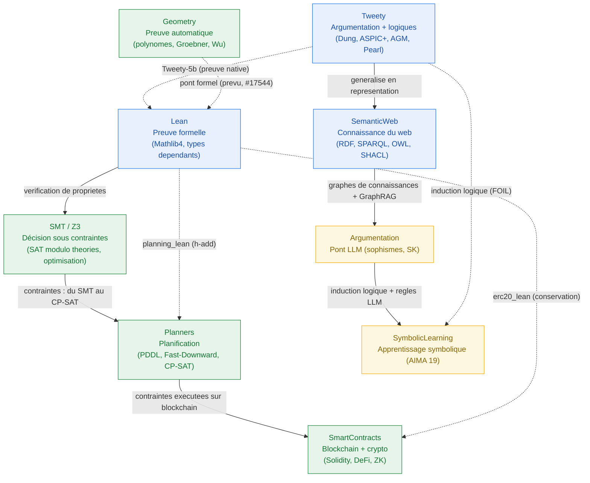

# SymbolicAI - Intelligence Artificielle Symbolique

[← Notebooks](../README.md) | [→ Sudoku](../Sudoku/README.md)

<!-- CATALOG-STATUS
series: SymbolicAI
pedagogical_count: 294
breakdown: Lean=67, SMT=46, Tweety=36, Argument_Analysis=33, SmartContracts=31, SemanticWeb=28, SymbolicLearning=26, Planners=25, Geometry=1, root=1
maturity: BETA=282, ALPHA=8, DRAFT=4
-->

L'intelligence artificielle n'est pas qu'apprentissage automatique et réseaux de neurones. Une grande partie de l'IA classique repose sur le **raisonnement symbolique** : représenter la connaissance sous forme de propositions, de règles et de structures logiques, puis dériver mécaniquement de nouvelles conclusions. C'est cette tradition — des systèmes experts des années 80 aux assistants de preuve modernes comme Lean 4 — que cette famille de séries explore.

Les séries couvrent ensemble le **cycle complet du raisonnement vérifiable** :

- **représenter** la connaissance : Tweety pour les logiques formelles et l'argumentation, SemanticWeb pour le web de données ;
- **prouver** quand la certitude est exigée : Lean 4 et Mathlib4 ;
- **décider sous contraintes** : SMT avec le solveur Z3 ;
- **démontrer automatiquement** en géométrie : Geometry ;
- **agir** dans le monde : Planners pour la planification, SmartContracts pour la logique exécutable sur blockchain ;
- **apprendre** à partir de connaissances plutôt que de données : SymbolicLearning ;
- **relier** ce pipeline aux LLMs : Argumentation.

Chaque série est autonome. Un fil rouge les traverse pourtant : du formalisme pur à la vérification certifiée, jusqu'au moment où le symbolique et le neuronal cessent d'être deux camps pour devenir deux couches d'un même système fiable.

## Comment lire ce README

Le dépôt se lit à trois vitesses ([choisir sa vitesse de lecture](../../README.md#choisir-sa-vitesse-de-lecture)), et la famille SymbolicAI aussi :

| Vitesse | Vous voulez… | Lisez… |
|---|---|---|
| **Découverte** | comprendre ce qu'est l'IA symbolique et essayer un outil | le [parcours de la famille](#parcours-de-la-famille), puis **une** série, en suivant ses numéros nus |
| **Licence** | maîtriser un domaine | le parcours principal d'une série (ses numéros nus), puis ses approfondissements quand un palier vous retient |
| **Recherche** | les preuves formelles, les compagnons Lean, les lakes | [Pour aller plus loin](#pour-aller-plus-loin), puis, dans chaque série, les lettres et les lakes |

Ce README ne liste pas les notebooks un par un. Chaque série a son README, qui fait foi pour sa structure ; celui-ci donne la carte, les portes d'entrée et ce qui relie les séries. Les comptes de notebooks et la maturité vivent dans le bloc `CATALOG-STATUS` ci-dessus, régénéré chaque jour par la CI.

### Lire un nom de fichier

Un nom de notebook suit la forme `<Prefixe>-<NN><lettre?>-<Titre>[-Part<N>]-<Noyau>.ipynb` :

| Élément | Exemple | Ce qu'il vous dit |
|---|---|---|
| numéro nu `<NN>` | `Z3-05-Quantifiers-Proofs-Python` | une marche du parcours principal : on peut s'arrêter là |
| lettre après le numéro | `Tweety-07b-Ranking-Probabilistic-Python` | un approfondissement du palier 07, facultatif |
| `-Part<N>` | — | un notebook découpé en parties à lire dans l'ordre |
| noyau en dernier | `-Python`, `-CSharp`, `-Lean`, `-Lean-Python` | le kernel à installer ; `-Lean-Python` désigne un notebook Python qui pilote Lean |

La normalisation des noms est en cours (#16231). Beaucoup de fichiers de la famille n'ont pas encore leur padding ou leur suffixe de noyau (`Lean-2-Dependent-Types`, `SL-4-InductiveLogicProgramming`). En attendant, la colonne Noyau des tables fait foi.

## Carte de la famille

Les flèches pleines (`-->`) marquent un pont conceptuel direct : la série aval consomme ou généralise l'amont. Les flèches pointillées (`-.->`) marquent un pont par **compagnon**, un notebook d'une série qui formalise la théorie d'une autre, le plus souvent en Lean. Trois couleurs séparent les rôles :

- **Fondations** (bleu) : les formalismes de base — Tweety, SemanticWeb, Lean.
- **Applications** (vert) : les séries qui exploitent ces formalismes — SMT, Planners, SmartContracts, Geometry.
- **Ponts neuro-symboliques** (ambre) : les séries qui relient le symbolique au génératif — Argumentation, SymbolicLearning.


```mermaid
flowchart TD
    TW["Tweety<br/>Argumentation + logiques<br/>(Dung, ASPIC+, AGM, Pearl)"]
    SW["SemanticWeb<br/>Connaissance du web<br/>(RDF, SPARQL, OWL, SHACL)"]
    LEAN["Lean<br/>Preuve formelle<br/>(Mathlib4, types dependants)"]
    SMT["SMT / Z3<br/>Décision sous contraintes<br/>(SAT modulo theories, optimisation)"]
    PL["Planners<br/>Planification<br/>(PDDL, Fast-Downward, CP-SAT)"]
    SC["SmartContracts<br/>Blockchain + crypto<br/>(Solidity, DeFi, ZK)"]
    AA["Argumentation<br/>Pont LLM (sophismes, SK)"]
    SL["SymbolicLearning<br/>Apprentissage symbolique (AIMA 19)"]
    GEO["Geometry<br/>Preuve automatique<br/>(polynomes, Groebner, Wu)"]

    %% Ponts conceptuels (fleches pleines = consommation / generalisation)
    TW -->|"generalise en representation"| SW
    LEAN -->|"verification de proprietes"| SMT
    SMT -->|"contraintes : du SMT au CP-SAT"| PL
    PL -->|"contraintes executees sur blockchain"| SC
    SW -->|"graphes de connaissances + GraphRAG"| AA
    AA -->|"induction logique + regles LLM"| SL

    %% Ponts par compagnon (fleches pointillees = notebook natif en Lean)
    TW -.->|"Tweety-5b (preuve native)"| LEAN
    LEAN -.->|"planning_lean (h-add)"| PL
    LEAN -.->|"erc20_lean (conservation)"| SC
    TW -.->|"induction logique (FOIL)"| SL
    GEO -.->|"pont formel (prevu, #17544)"| LEAN

    %% color: explicite -- sans lui, libelle clair sur fond clair en mode sombre GitHub (#15022) ; ton parfois plus fonce que le stroke (le stroke en couleur de texte rendrait infer illisible) : ne pas harmoniser
    classDef found fill:#e8f0fe,stroke:#1a73e8,color:#174ea6
    classDef app fill:#e6f4ea,stroke:#188038,color:#137333
    classDef bridge fill:#fef7e0,stroke:#f9ab00,color:#856404
    class TW,SW,LEAN found
    class SMT,PL,SC,GEO app
    class AA,SL bridge
```

On peut lire la carte comme un parcours : Tweety ou SemanticWeb pour représenter, Lean pour la rigueur de la preuve, SMT ou Planners pour une première application, puis les ponts avec les LLMs. Un chercheur en vérification formelle peut l'inverser : Lean, puis SMT, Planners (compagnon `planning_lean`) et SmartContracts (compagnon `erc20_lean`), avant de revenir à Tweety pour l'argumentation structurée.

## Parcours de la famille

L'ordre proposé ci-dessous n'est pas une obligation : chaque série se suit seule. Pour chacune, la **porte d'entrée** est le premier notebook du parcours principal. Le **parcours léger** d'une série, ce sont ses numéros nus : on peut les enchaîner sans ouvrir une seule lettre.

| Étape | Série | Ce qu'on y apprend | Porte d'entrée | Public | Noyau |
|---|---|---|---|---|---|
| 1 | [Tweety](Tweety/README.md) | Logiques formelles, révision de croyances, argumentation abstraite et structurée, raisonnement incertain et causal | [Tweety-01-Setup-Python](Tweety/Tweety-01-Setup-Python.ipynb) | Licence | Python (JPype) · C# |
| 2 | [SemanticWeb](SemanticWeb/README.md) | RDF, SPARQL, données liées, RDFS et OWL, SHACL, graphes de connaissances | [SW-2b-Python-RDFBasics](SemanticWeb/SW-2b-Python-RDFBasics.ipynb) · [SW-1-CSharp-Setup](SemanticWeb/SW-1-CSharp-Setup.ipynb) | Découverte → Licence | Python · C# |
| 3 | [Lean](Lean/README.md) | Types dépendants, Curry-Howard, quantificateurs, tactiques, Mathlib4 | [Lean-1-Setup](Lean/Lean-1-Setup.ipynb) | Licence → Recherche | Lean (WSL) · Python |
| 4 | [SMT / Z3](SMT/README.md) | Satisfiabilité modulo théories, du premier `solve()` aux preuves par `unsat` | [Z3-01-Introduction-Python](SMT/Z3-API/Z3-01-Introduction-Python.ipynb) · [C#](SMT/Z3-API/Z3-01-Introduction-CSharp.ipynb) | Découverte → Licence | Python · C# |
| 5 | [Planners](Planners/README.md) | PDDL, recherche dans l'espace d'états, heuristiques, CP-SAT, planification temporelle et hiérarchique | [Planners-0-Setup](Planners/00-Environment/Planners-0-Setup.ipynb) | Licence | Python · C# |
| 6 | [SmartContracts](SmartContracts/README.md) | Solidity, standards de jetons, DeFi, gouvernance, tests et vérification, cryptographie | [SC-0-Cypherpunk-Origins](SmartContracts/00-Foundations/SC-0-Cypherpunk-Origins.ipynb) | Découverte → Licence | Python (Foundry) |

Trois séries se prennent **à côté** de ce parcours, selon ce qui vous attire :

| Série | Ce qu'on y apprend | Ce qu'elle suppose | Porte d'entrée | Public | Noyau |
|---|---|---|---|---|---|
| [Argumentation](Argument_Analysis/README.md) | Analyse argumentative outillée : Toulmin, sophismes, sémantiques de Dung, orchestration d'agents LLM validés par Tweety | les bases de Tweety, une clé d'API | [Argumentation-00-Setup-Tweety-Python](Argument_Analysis/Argumentation-00-Setup-Tweety-Python.ipynb) | Licence | Python |
| [SymbolicLearning](SymbolicLearning/README.md) | Apprentissage à partir de connaissances (AIMA ch. 19) : Version Space, EBL, programmation logique inductive, automates, neuro-symbolique | Python seul | [SL-1-LogicalLearning](SymbolicLearning/SL-1-LogicalLearning.ipynb) | Licence | Python · C# |
| [Geometry](Geometry/README.md) | Démonstration automatique en géométrie : vérification probabiliste, bases de Gröbner, méthode de Wu | la géométrie du lycée | [Geometry-01-From-Figure-To-Equation](Geometry/Geometry-01-From-Figure-To-Equation.ipynb) | Découverte | Python |

## Les séries en bref

Chaque série se présente en trois temps : ce qu'elle apprend, son **parcours léger** (les numéros nus, qu'on peut enchaîner seuls) et ce qui l'**approfondit** (lettres, jumeaux dans un autre langage, compagnons Lean, lakes, sous-séries). Le détail notebook par notebook est dans le README de chaque série.

### Tweety — logiques et argumentation

[TweetyProject](https://tweetyproject.org/) est une bibliothèque Java de référence pour l'IA symbolique. On l'appelle depuis Python par JPype, et depuis C# par IKVM.

- **Parcours léger** — de 01 à 12 : installation (01), logiques de base (02) puis avancées (3), révision de croyances (4), argumentation abstraite (5) puis structurée (06), cadres étendus (07a, qui porte le palier 07), dialogues d'agents (08), préférences (09), raisonnement incertain par réseaux logiques de Markov (10), causalité de Pearl (11), et le bouclage de la sémantique fondée entre Python et Lean (12).
- **Pour approfondir** — 02b à 02d (sémantiques, premier ordre), 07b (ranking et argumentation probabiliste) ; les laboratoires 02d, 3b et 5e, notebooks Python qui pilotent Lean ; le compagnon Lean natif 5b, qui prouve l'argumentation de Dung dans le lake `argumentation_lean`, et 5d, qui synthétise en Python des extensions stables certifiées (de Z3 vers Lean). Presque chaque palier a un jumeau C#, et quelques modules n'existent qu'en C# (Dung, QBF, logique modale, logiques conditionnelles, ASPIC+).
- [README de la série Tweety](Tweety/README.md)

### SemanticWeb — le web de données

- **Parcours léger** — SW-1 à SW-12 : RDF, opérations sur les graphes, SPARQL, données liées, RDFS, OWL, puis SHACL, JSON-LD, RDF-Star, graphes de connaissances et GraphRAG. Les paliers 1 à 7 sont en C# (dotNetRDF) ; les lettres `b` de 2b à 7b en sont les **jumeaux Python** (rdflib, owlready2). Un lecteur Python-only prend donc SW-2b à SW-7b, puis SW-8 et la suite. Cette série est la seule de la famille où la lettre désigne un jumeau et non un approfondissement : la normalisation (#16231) résorbera l'exception.
- **Pour approfondir** — SW-13 (comparatif de raisonneurs), SW-14 et SW-15 (le coup ontologique, la greffe argumentative AIF/Dung), SW-16 (ontologies porteuses de preuve).
- [README de la série SemanticWeb](SemanticWeb/README.md)

### Lean — la preuve formelle

- **Parcours léger** — 1 à 6, les fondations : installation, types dépendants, propositions et preuves (Curry-Howard), quantificateurs, mode tactique, Mathlib4. Puis 7 à 10, la preuve à l'ère des LLMs : intégration LLM, preuve agentique, orchestration multi-agents, LeanDojo.
- **Chapitres thématiques** — à partir de 11, chaque numéro ouvre un chapitre qui suppose les fondations et se choisit selon son intérêt : réseaux de neurones vérifiés (11), théorème de sensibilité de Huang (12), contextualité de Kochen-Specker (13), hommages à Grothendieck (15) et à Conway (16), théorie des nœuds (17), puis les digestions de résultats récents (Sendov, *Analysis I* de Tao, PFR, détection MIMO, problème inverse de Galois pour M₂₃…).
- **Pour approfondir** — les lettres sont surtout des **compagnons** : un compagnon Lean natif (`-Native`, kernel Lean) qui prouve ce que le notebook principal raconte, ou un compagnon Python qui l'illustre. Les preuves vivent dans des **lakes** (`sensitivity_lean`, `conway_lean`, `knot_lean`, `grothendieck_lean`, `galois_lean`…).
- **Sous-série** — [Serre100](Lean/Serre100/README.md) a sa propre numérotation et son lake `serre100_lean`. Un notebook d'escalier dans le parcours principal la présentera et y renverra (#17789). Ce modèle doit ensuite servir aux familles de chapitres les plus denses, comme Conway et Grothendieck.
- [README de la série Lean](Lean/README.md)

### SMT / Z3 — décider sous contraintes

Deux sous-séries, deux façons d'utiliser le même solveur :

- **[Z3-API](SMT/Z3-API/README.md)** (Python, z3-py, API complète). **Parcours léger** : 01 à 18, du premier `solve()` aux tactiques, chaînes, quantificateurs et preuves, optimisation, ordonnancement, énigmes, arithmétique réelle, cœurs insatisfiables, tableaux, vecteurs de bits, planification de repas (16) et modes de résolution du sudoku (18) ; le numéro 07 est vacant. **Pour approfondir** : 01b (style déclaratif), l'arc 16b à 16e (planification de repas sur données réelles), les jumeaux C# de 01 à 06.
- **[Z3-Linq2Z3](SMT/Z3-Linq2Z3/README.md)** (C#, Z3.Linq, style déclaratif). Parcours de 01 à 18, avec bascule sur l'API .NET brute quand le DSL ne suffit plus.
- [README de la famille SMT](SMT/README.md)

### Planners — planification automatique

- **Parcours léger** — 0 (installation), puis 1 à 12 par parties : fondations (introduction, PDDL, espace d'états), planification classique (Fast Downward, heuristiques, domaines), approches avancées (OR-Tools et CP-SAT, planification temporelle, HTN), neuro-symbolique (planification par LLM, Unified Planning, LOOP). Les sous-dossiers `00-Environment` à `04-NeuroSymbolic` suivent ce découpage.
- **Pour approfondir** — 5b (compagnon Lean : la relaxation h-add prouvée dans le lake `planning_lean`), 5c (différentiel d'atteignabilité), 10b (le LLM comme réducteur d'espace de recherche) ; jumeaux C# des paliers 1 à 9.
- [README de la série Planners](Planners/README.md)

### SmartContracts — logique exécutable sur blockchain

- **Parcours léger** — de SC-0 à SC-27 par parties : origines et installation, Solidity fondamental, Solidity avancé (standards de jetons, DeFi, DAO, abstraction de compte, assistance LLM), tests Foundry et vérification, cryptographie (preuves à divulgation nulle, chiffrement homomorphe, vote vérifiable), chaînes alternatives, déploiement réel. Le README de la série propose des parcours plus courts : Solidity intensif, cryptographie, chaînes alternatives, sécurité d'abord.
- **Pour approfondir** — 2b (bac à sable institutionnel), 7b et 7c (l'invariant de conservation ERC-20, compagnon Python puis preuve Lean native dans le lake `erc20_lean`).
- [README de la série SmartContracts](SmartContracts/README.md)

### Argumentation — le pont avec les LLMs

Le dossier s'appelle encore `Argument_Analysis/`, mais la série s'appelle Argumentation.

- **Parcours léger** — 00 à 08 : installation de Tweety, modèle de Toulmin, détection de sophismes, sémantiques de Dung, dialogues protocolisés, vérification formelle, JTMS, orchestration d'agents, capstone.
- **Pour approfondir** — les lettres de 01b à 08e : schémas de Walton, cartes Argumentum, argumentation par valeurs, sémantiques de ranking, base de connaissances, routage multi-backend, canaux de communication, exécuteur, interface, restitution, entre autres. Les notebooks `Argument_Analysis_*` regroupent la démonstration agentique d'origine et des travaux en cours de rangement en sous-séries (ontologies, observatoire, #17721).
- [README de la série Argumentation](Argument_Analysis/README.md)

### SymbolicLearning — apprendre à partir de connaissances

- **Parcours léger** — SL-1 à SL-11 suivent le chapitre 19 d'AIMA jusqu'au capstone : Version Space, apprentissage guidé par la connaissance (EBL, RBL), programmation logique inductive (FOIL, résolution inverse, moteurs ILP modernes), neuro-symbolique, graphes de connaissances, LLM, apprentissage actif d'automates (L* d'Angluin), capstone LLM et graphe de connaissances. SL-12 à SL-15 prolongent vers la recherche récente : portes logiques différentiables, diagnostic DISCOVER, découverte d'équations, conjectures apprises.
- **Pour approfondir** — 1b (compagnon Lean natif), les lettres 12b (synthèse spectrale, reproduction Pavlov DLS), les jumeaux C# écrits sans dépendance externe.
- [README de la série SymbolicLearning](SymbolicLearning/README.md)

### Geometry — démontrer en géométrie

Un même théorème (le milieu de l'hypoténuse est équidistant des trois sommets) est d'abord vérifié numériquement (01, Découverte), puis démontré exactement par bases de Gröbner (02, Licence). Viennent ensuite la méthode de Wu, le raisonnement du géomètre (DD+AR) et un pont formel vers Lean. Le programme gradué (Epic #17544) et son état sont tenus dans le [README de la série Geometry](Geometry/README.md).

### Hors série

- [OR-tools-Stiegler](OR-tools-Stiegler.ipynb) (C#) : le problème du régime de Stigler, programmation linéaire avec OR-Tools.

## Installation

Chaque série décrit son installation complète ; cette section donne ce qui est commun et ce que chaque noyau exige.

### Python — toutes les séries

```bash
# Python 3.10+
pip install jupyter ipykernel
```

| Série | Paquets principaux |
|---|---|
| Tweety | `jpype1 python-sat clingo z3-solver` |
| SemanticWeb | `rdflib pyshacl owlready2 kglab` |
| SMT / Z3 | `z3-solver` |
| Planners | `ortools unified_planning` |
| SmartContracts | `py-solc-x web3` (solc est installé par py-solc-x) |
| Argumentation | `semantic-kernel jpype1` |
| SymbolicLearning | bibliothèque standard pour l'essentiel ; dépendances par notebook listées dans le README de la série |
| Geometry | `sympy numpy matplotlib` |

### Java — Tweety et Argumentation

Aucune installation système : `Tweety-01-Setup-Python` télécharge un JDK 17 portable dans `Tweety/jdk-17-portable/` (sans droits administrateur) et les JARs TweetyProject depuis Maven Central dans `Tweety/libs/`. Les outils externes (Clingo, SPASS, EProver) vont dans `Tweety/ext_tools/`, non versionné. En ligne de commande : `python Tweety/scripts/download_tweety_tools.py --all`. Argumentation réutilise ce même JDK.

Deux points d'attention :

- `asp-1.30.jar` et `rpcl-1.30.jar` sont absents de Maven Central pour la version 1.30. Ce n'est pas bloquant : les notebooks gèrent leur absence.
- Un JAR de 0 octet ou d'environ 554 octets est un téléchargement raté : le récupérer à la main depuis `https://repo1.maven.org/maven2/org/tweetyproject/`.

### .NET — les notebooks C#

```bash
dotnet tool install -g Microsoft.dotnet-interactive
dotnet interactive jupyter install
```

> **Windows** : si `dotnet-interactive.exe` est bloqué (Win32Exception 4551), exécuter `Set-ExecutionPolicy -Scope CurrentUser RemoteSigned` dans PowerShell, puis relancer.
>
> **macOS / Linux** : la politique d'exécution ne s'applique pas. Installation complète du poste : [setup-linux-macos.md](../../docs/reference/setup-linux-macos.md).

### WSL — Lean, et quelques outils

- **Lean** : WSL est obligatoire, les notebooks Lean ne fonctionnent pas sous Windows natif (SIGPIPE, chemins). `Lean-1-Setup` installe elan, Lean 4 et `lean4_jupyter` dans WSL. Les preuves natives tournent sur les kernels `lean4` / `lean4-wsl`, certains compagnons Python sur `python3-wsl`, les autres sur un noyau Python natif. Le noyau exact de chaque notebook est dans le README de la série.
- **Planners** : Fast Downward s'installe dans WSL ou par Docker.
- **SymbolicLearning** : Popper et SWI-Prolog (SL-4, SL-6) demandent un noyau Linux ou WSL.

### Foundry — SmartContracts

Foundry s'installe dans WSL (`curl -L https://foundry.paradigm.xyz | bash`, puis `foundryup`). Avant d'exécuter SC-3 à SC-10, lancer la chaîne locale `anvil --host 0.0.0.0`. Le fichier `SmartContracts/.env` porte `ANVIL_RPC`, la clé LLM de SC-11 et, pour SC-24 et SC-25, une clé de testnet dans `DEPLOYER_PRIVATE_KEY` : un texte d'exemple non hexadécimal y fait échouer `hexstr_to_bytes`.

### Clés d'API

Elles vivent dans un fichier `.env` non versionné, jamais dans un notebook.

| Série | Notebooks | Variable |
|---|---|---|
| Lean | 7 à 10 | `OPENAI_API_KEY` (OpenRouter) |
| Argumentation | la plupart | `OPENAI_API_KEY`, et `OPENAI_BASE_URL` pour OpenRouter ; configuration complète dans le README de la série |
| SmartContracts | SC-11 | `LLM_API_KEY` |
| SymbolicLearning | SL-9, SL-11 | clé OpenRouter facultative ; un simulateur déterministe prend le relais sans elle |
| SemanticWeb | SW-12 | facultative |

Dans Argumentation, la démonstration agentique d'origine (`Argument_Analysis_Agentic-0` à `-3`) doit s'exécuter dans l'ordre, à la main. Papermill ne conserve pas l'état entre notebooks, et le notebook d'orchestration dépend des définitions des trois précédents.

## FAQ

### Qu'est-ce que l'IA symbolique et pourquoi l'étudier à l'ère des LLMs ?

L'IA symbolique repose sur la **manipulation explicite de symboles et de règles** (logique, ontologies, planification, contrats) plutôt que sur l'apprentissage statistique. Les LLMs sont puissants mais opaques : ils ne garantissent pas la correction logique, ne peuvent pas vérifier formellement un résultat, et hallucinent. L'IA symbolique apporte ce que les modèles statistiques ne fournissent pas : un raisonnement **vérifiable, explicable et certifié**. Les deux paradigmes sont complémentaires, et l'avenir est neuro-symbolique.

### Quelle est la différence entre Tweety et Z3 ?

**TweetyProject** est une bibliothèque Java de logique formelle (propositionnelle, premier ordre, modale, argumentation, révision de croyances), utilisée depuis Python par JPype. **Z3** (Microsoft Research) est un solveur SMT qui automatise la résolution de problèmes logiques sous contraintes. Tweety sert à comprendre les sémantiques, Z3 à prouver ou infirmer des propriétés.

### Comment installer l'environnement Tweety ?

Ouvrez `Tweety-01-Setup-Python.ipynb` : il télécharge le JDK 17 portable et les JARs TweetyProject. En ligne de commande : `python Tweety/scripts/download_tweety_tools.py --all`. Les dépendances Python sont `jpype1 requests tqdm clingo z3-solver python-sat`.

### Par quelle série commencer si je n'ai pas de JDK ?

SemanticWeb (en Python), SMT, Planners, SymbolicLearning, Geometry et Lean n'utilisent pas Java. Tweety et Argumentation passent par JPype, mais avec un JDK portable téléchargé par le notebook d'installation, sans installation système ni droits administrateur. En évitant les notebooks C#, on peut suivre toute la famille en Python.

### Pourquoi Tweety utilise-t-il JPype plutôt que des implémentations Python natives ?

TweetyProject couvre des domaines où il n'existe pas d'équivalent Python mature : argumentation structurée, dialogues d'agents, logiques épistémiques, révision de croyances. JPype appelle directement les JARs Java depuis Python, sans réimplémentation ; les notebooks gèrent le pont de façon transparente via `tweety_init.py`.

### Quelle est la différence entre les notebooks C# et Python de SemanticWeb ?

Les paliers 1 à 7 sont écrits en C# avec dotNetRDF ; leurs jumeaux Python (2b à 7b) couvrent les mêmes notions avec rdflib et owlready2. À partir de 8, la série passe en Python (pySHACL, kglab), avec des jumeaux C# pour une partie des paliers. Les concepts (RDF, SPARQL, OWL, SHACL) sont les mêmes dans les deux piles : si vous n'avez pas besoin de .NET, le chemin Python suffit.

### Comment exécuter les notebooks Lean sans GPU ni installation système ?

Les notebooks Lean tournent dans WSL, sans GPU. `Lean-1-Setup.ipynb` installe elan (le gestionnaire de toolchains Lean) et `lean4_jupyter`. Les preuves natives utilisent les kernels Lean 4 ; les notebooks LLM et prouveur (7 à 10) tournent sur `Python 3 (WSL)` et demandent une clé d'API.

### Peut-on étudier les SmartContracts sans blockchain réelle ?

Oui, c'est l'approche de la série. **Anvil** (Foundry) simule une chaîne Ethereum locale en une commande (`anvil --host 0.0.0.0`, sous WSL). Les notebooks SC-3 à SC-10 y déploient et testent leurs contrats, sans ether réel ni testnet. Les notebooks plus théoriques explorent leurs concepts (preuves à divulgation nulle, DeFi, DAO, cross-chain) en Python et Solidity, sans déploiement. Seuls SC-24 et SC-25 (déploiement réel) demandent une clé de testnet.

## Pour aller plus loin

### Trois piles : Python, C# et Lean

La famille est couverte sur trois piles, selon les formalismes. La table dit **où** chaque pile est présente ; le catalogue dit combien.

| Série | Python | C# / .NET | Lean 4 | Ce qui la porte |
|---|:---:|:---:|:---:|---|
| Tweety | ● | ● | ◐ | JPype et IKVM ; compagnon Lean de l'argumentation de Dung (5b) |
| Lean | ● | — | ● | preuves natives dans WSL, compagnons Python, Mathlib4 |
| SemanticWeb | ● | ● | — | dotNetRDF (C#), rdflib et pySHACL (Python) |
| SMT / Z3 | ● | ● | — | z3-py, jumeaux `Microsoft.Z3`, DSL Z3.Linq |
| Planners | ● | ◐ | ◐ | PDDL et CP-SAT en Python ; jumeaux C# ; relaxation h-add en Lean (5b) |
| SmartContracts | ● | — | ◐ | Solidity et Foundry pilotés depuis Python ; invariant ERC-20 en Lean (7c) |
| Argumentation | ● | — | — | pipeline Semantic Kernel multi-agents, port des sources Argumentum |
| SymbolicLearning | ● | ◐ | ◐ | AIMA ch. 19 ; jumeaux C# ; compagnon Lean (1b) |
| Geometry | ● | — | prévu | Gröbner et Wu en sympy ; pont formel vers Lean au programme |

Légende : ● couverture large ; ◐ couverture partielle ou compagnon ; — absent.

### Ce que la famille dessine

Les séries ne sont pas des sujets indépendants : elles forment un **pipeline du raisonnement symbolique**, du représentationnel au certifié. On représente la connaissance (Tweety, SemanticWeb), on raisonne dessus (argumentation, révision de croyances, décision par Z3), on prouve quand la certitude est exigée (Lean), on décide et on agit (Planners, SmartContracts), on apprend à partir de connaissances (SymbolicLearning), et on relie le tout aux LLMs (Argumentation).

Ce pipeline est aussi un **cercle**. Une décision Z3 peut être certifiée par une preuve Lean ; un plan PDDL peut s'exécuter sur une blockchain qui garantit qu'il n'a pas été altéré ; un argument détecté par un LLM peut être formalisé dans Tweety, validé par un prouveur, puis rejoué dans un notebook d'apprentissage. Les **compagnons Lean** (Tweety-5b, Planners-5b, SC-7c, SL-1b) ne sont pas des sous-produits : ce sont les points de certification où le symbolique passe du raisonnement plausible à la preuve vérifiée.

À l'ère des modèles statistiques opaques, l'IA symbolique apporte ce que les LLMs ne garantissent pas : un raisonnement vérifiable, explicable et certifié. Chaque série montre un point de jonction concret avec le neuronal : GraphRAG dans SemanticWeb, les prouveurs assistés par LLM dans Lean, le capstone de SymbolicLearning, le pipeline d'Argumentation.

### Organisation du dossier

```
SymbolicAI/
├── Tweety/              # TweetyProject (Python/JPype, C#/IKVM, compagnons Lean), lake argumentation_lean
├── SemanticWeb/         # RDF, SPARQL, OWL, SHACL, graphes de connaissances (C# et Python)
├── Lean/                # preuve formelle ; lakes *_lean ; sous-série Serre100/
├── SMT/
│   ├── Z3-API/          # z3-py, jumeaux C#
│   └── Z3-Linq2Z3/      # Z3.Linq (C#)
├── Planners/            # 00-Environment … 04-NeuroSymbolic, lake planning_lean
├── SmartContracts/      # 00-Foundations … 06-Real-World, lake erc20_lean
├── Argument_Analysis/   # série Argumentation
├── SymbolicLearning/    # AIMA ch. 19
├── Geometry/            # démonstration automatique en géométrie
└── OR-tools-Stiegler.ipynb
```

### Outils externes

| Outil | Usage | Séries |
|---|---|---|
| **JPype** | pont Java/Python | Tweety, Argumentation |
| **PySAT** | solveurs SAT natifs | Tweety |
| **Clingo** | Answer Set Programming | Tweety, SymbolicLearning |
| **SPASS / EProver** | prouveurs de théorèmes | Tweety |
| **Z3** | solveur SMT | SMT, Tweety |
| **elan / Lean 4** | assistant de preuve | Lean |
| **Mathlib4** | bibliothèque mathématique Lean | Lean |
| **Semantic Kernel** | orchestration LLM | Argumentation, Lean |
| **OR-Tools** | optimisation, CP-SAT | Planners, OR-tools-Stiegler |
| **Fast Downward** | planification PDDL | Planners |
| **dotNetRDF** | RDF/SPARQL .NET | SemanticWeb |
| **rdflib / pySHACL** | RDF/SPARQL et validation SHACL en Python | SemanticWeb |
| **Solidity / solc** | contrats intelligents | SmartContracts |
| **Foundry** | tests Solidity, chaîne locale anvil | SmartContracts |

### Les comptes

Nombre de notebooks par série, noyaux et maturité : le bloc `CATALOG-STATUS` en tête de ce fichier, et le [catalogue du dépôt](../../COURSE_CATALOG.generated.md). Ils sont régénérés par la CI ; aucune prose de ce README ne les recopie.

### Vers les autres familles

- [Search](../Search/README.md) et [Sudoku](../Sudoku/README.md) : résolution par contraintes et SAT.
- [GameTheory](../GameTheory/README.md) : choix social, théorie des jeux, formalisations Lean.
- [Probas](../Probas/README.md) : programmation probabiliste avec Infer.NET.
- La [lecture transversale](../../docs/grothendieckian-lens.md) relie ces séries par une même grille : changement de représentation et niveaux de certification.

## Ressources

### Références académiques

| Domaine | Référence | Où dans la famille |
|---|---|---|
| IA symbolique (général) | Russell & Norvig, *AIMA* 4e éd., ch. 7-12 | recherche, logique, planification |
| Apprentissage symbolique | Russell & Norvig, *AIMA* 4e éd., ch. 19 | SymbolicLearning |
| Théorie des jeux, choix social | Osborne & Rubinstein, *A Course in Game Theory* (1994) | GameTheory, formalisations Lean |
| Logiques formelles | Enderton, *A Mathematical Introduction to Logic* (2001) | Tweety, Lean |
| Argumentation | Dung, « On the Acceptability of Arguments » (1995) | Tweety-5, Argumentation |
| Argumentation structurée | Modgil & Prakken, « The ASPIC+ Framework » (2014) | Tweety-06 |
| Révision de croyances | Alchourrón, Gärdenfors & Makinson, « On the Logic of Theory Change » (1985) | Tweety-4 |
| Web sémantique | Berners-Lee et al., « The Semantic Web », *Scientific American* (2001) | SemanticWeb |
| RDF/SPARQL | W3C, *RDF 1.1 Primer* | SemanticWeb |
| Planification automatique | Ghallab, Nau & Traverso, *Automated Planning: Theory and Practice* (2004) | Planners |
| Planification PDDL | Helmert, « The Fast Downward Planning System » (2006) | Planners-4 |
| Lean 4 | de Moura & Ullrich, « The Lean 4 Theorem Prover » (2021) | Lean |
| Mathlib | The Mathlib Community, « The Lean Mathematical Library » (2020) | Lean-6 |
| Contrats intelligents | Buterin, *Ethereum White Paper* (2014) | SmartContracts |
| Vérification formelle | Appel, « Verification of a Cryptographic Primitive: SHA-256 » (2015) | SC-14 |
| Divulgation nulle | Ben-Sasson et al., « Scalable Zero Knowledge » (2014) | SC-15 |

### Ressources en ligne

| Ressource | URL |
|---|---|
| TweetyProject | https://tweetyproject.org/ |
| Theorem Proving in Lean 4 | https://leanprover.github.io/theorem_proving_in_lean4/ |
| Documentation Mathlib4 | https://leanprover-community.github.io/mathlib4_docs/ |
| LeanDojo | https://leandojo.readthedocs.io/ |
| OR-Tools | https://developers.google.com/optimization |
| Z3 Prover | https://github.com/Z3Prover/z3 |
| dotNetRDF | https://dotnetrdf.org/ |
| Fast Downward | https://www.fast-downward.org/ |
| Documentation Solidity | https://docs.soliditylang.org/ |
| W3C RDF 1.1 Primer | https://www.w3.org/TR/rdf11-primer/ |
| Foundry Book | https://book.getfoundry.sh/ |

## Licence

Les notebooks sont distribués sous licence MIT. Voir LICENSE à la racine du dépôt.

---

*Version 1.4.0 — Septembre 2026*

**Dernière mise à jour** : 2026-09-25
