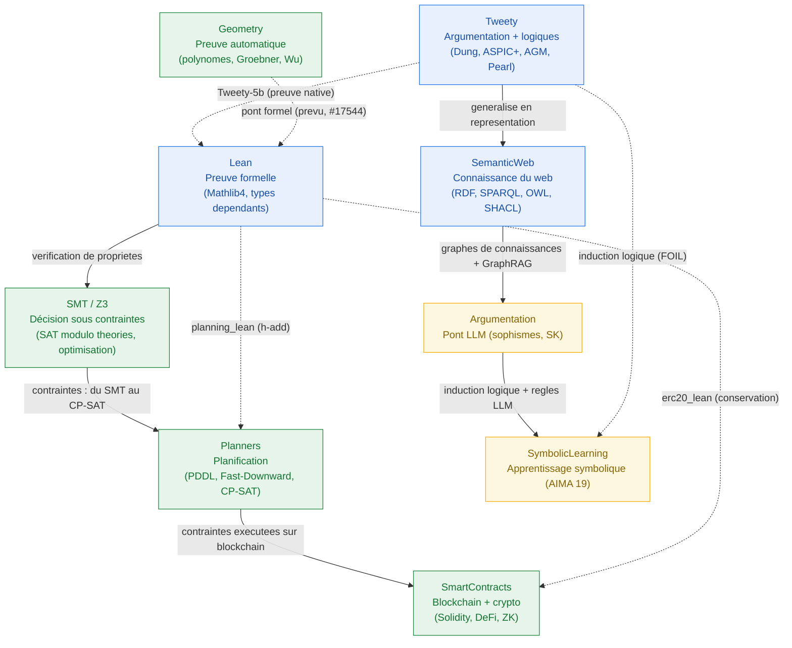

# SymbolicAI - Intelligence Artificielle Symbolique

[← Notebooks](../README.md) | [→ Sudoku](../Sudoku/README.md)

<!-- CATALOG-STATUS
series: SymbolicAI
pedagogical_count: 294
breakdown: Lean=67, SMT=46, Tweety=36, Argument_Analysis=33, SmartContracts=31, SemanticWeb=28, SymbolicLearning=26, Planners=25, Geometry=1, root=1
maturity: BETA=282, ALPHA=8, DRAFT=4
-->

L'intelligence artificielle n'est pas qu'apprentissage automatique et réseaux de neurones. Une grande partie de l'IA classique repose sur le **raisonnement symbolique** : représenter la connaissance sous forme de propositions, de règles et de structures logiques, puis dériver mécaniquement de nouvelles conclusions. C'est cette tradition — des systèmes experts des années 80 aux assistants de preuve modernes comme Lean 4 — que cette famille de séries explore.

Les séries couvrent ensemble le **cycle complet du raisonnement vérifiable** :

- **représenter** la connaissance : Tweety pour les logiques formelles et l'argumentation, SemanticWeb pour le web de données ;
- **prouver** quand la certitude est exigée : Lean 4 et Mathlib4 ;
- **décider sous contraintes** : SMT avec le solveur Z3 ;
- **démontrer automatiquement** en géométrie : Geometry ;
- **agir** dans le monde : Planners pour la planification, SmartContracts pour la logique exécutable sur blockchain ;
- **apprendre** à partir de connaissances plutôt que de données : SymbolicLearning ;
- **relier** ce pipeline aux LLMs : Argumentation.

Chaque série est autonome. Un fil rouge les traverse pourtant : du formalisme pur à la vérification certifiée, jusqu'au moment où le symbolique et le neuronal cessent d'être deux camps pour devenir deux couches d'un même système fiable.

## Comment lire ce README

Le dépôt se lit à trois vitesses ([choisir sa vitesse de lecture](../../README.md#choisir-sa-vitesse-de-lecture)), et la famille SymbolicAI aussi :

| Vitesse | Vous voulez… | Lisez… |
|---|---|---|
| **Découverte** | comprendre ce qu'est l'IA symbolique et essayer un outil | le [parcours de la famille](#parcours-de-la-famille), puis **une** série, en suivant ses numéros nus |
| **Licence** | maîtriser un domaine | le parcours principal d'une série (ses numéros nus), puis ses approfondissements quand un palier vous retient |
| **Recherche** | les preuves formelles, les compagnons Lean, les lakes | [Pour aller plus loin](#pour-aller-plus-loin), puis, dans chaque série, les lettres et les lakes |

Ce README ne liste pas les notebooks un par un. Chaque série a son README, qui fait foi pour sa structure ; celui-ci donne la carte, les portes d'entrée et ce qui relie les séries. Les comptes de notebooks et la maturité vivent dans le bloc `CATALOG-STATUS` ci-dessus, régénéré chaque jour par la CI.

### Lire un nom de fichier

Un nom de notebook suit la forme `<Prefixe>-<NN><lettre?>-<Titre>[-Part<N>]-<Noyau>.ipynb` :

| Élément | Exemple | Ce qu'il vous dit |
|---|---|---|
| numéro nu `<NN>` | `Z3-05-Quantifiers-Proofs-Python` | une marche du parcours principal : on peut s'arrêter là |
| lettre après le numéro | `Tweety-07b-Ranking-Probabilistic-Python` | un approfondissement du palier 07, facultatif |
| `-Part<N>` | — | un notebook découpé en parties à lire dans l'ordre |
| noyau en dernier | `-Python`, `-CSharp`, `-Lean`, `-Lean-Python` | le kernel à installer ; `-Lean-Python` désigne un notebook Python qui pilote Lean |

La normalisation des noms est en cours (#16231). Beaucoup de fichiers de la famille n'ont pas encore leur padding ou leur suffixe de noyau (`Lean-2-Dependent-Types`, `SL-4-InductiveLogicProgramming`). En attendant, la colonne Noyau des tables fait foi.

## Carte de la famille

Les flèches pleines (`-->`) marquent un pont conceptuel direct : la série aval consomme ou généralise l'amont. Les flèches pointillées (`-.->`) marquent un pont par **compagnon**, un notebook d'une série qui formalise la théorie d'une autre, le plus souvent en Lean. Trois couleurs séparent les rôles :

- **Fondations** (bleu) : les formalismes de base — Tweety, SemanticWeb, Lean.
- **Applications** (vert) : les séries qui exploitent ces formalismes — SMT, Planners, SmartContracts, Geometry.
- **Ponts neuro-symboliques** (ambre) : les séries qui relient le symbolique au génératif — Argumentation, SymbolicLearning.


```mermaid
flowchart TD
    TW["Tweety<br/>Argumentation + logiques<br/>(Dung, ASPIC+, AGM, Pearl)"]
    SW["SemanticWeb<br/>Connaissance du web<br/>(RDF, SPARQL, OWL, SHACL)"]
    LEAN["Lean<br/>Preuve formelle<br/>(Mathlib4, types dependants)"]
    SMT["SMT / Z3<br/>Décision sous contraintes<br/>(SAT modulo theories, optimisation)"]
    PL["Planners<br/>Planification<br/>(PDDL, Fast-Downward, CP-SAT)"]
    SC["SmartContracts<br/>Blockchain + crypto<br/>(Solidity, DeFi, ZK)"]
    AA["Argumentation<br/>Pont LLM (sophismes, SK)"]
    SL["SymbolicLearning<br/>Apprentissage symbolique (AIMA 19)"]
    GEO["Geometry<br/>Preuve automatique<br/>(polynomes, Groebner, Wu)"]

    %% Ponts conceptuels (fleches pleines = consommation / generalisation)
    TW -->|"generalise en representation"| SW
    LEAN -->|"verification de proprietes"| SMT
    SMT -->|"contraintes : du SMT au CP-SAT"| PL
    PL -->|"contraintes executees sur blockchain"| SC
    SW -->|"graphes de connaissances + GraphRAG"| AA
    AA -->|"induction logique + regles LLM"| SL

    %% Ponts par compagnon (fleches pointillees = notebook natif en Lean)
    TW -.->|"Tweety-5b (preuve native)"| LEAN
    LEAN -.->|"planning_lean (h-add)"| PL
    LEAN -.->|"erc20_lean (conservation)"| SC
    TW -.->|"induction logique (FOIL)"| SL
    GEO -.->|"pont formel (prevu, #17544)"| LEAN

    %% color: explicite -- sans lui, libelle clair sur fond clair en mode sombre GitHub (#15022) ; ton parfois plus fonce que le stroke (le stroke en couleur de texte rendrait infer illisible) : ne pas harmoniser
    classDef found fill:#e8f0fe,stroke:#1a73e8,color:#174ea6
    classDef app fill:#e6f4ea,stroke:#188038,color:#137333
    classDef bridge fill:#fef7e0,stroke:#f9ab00,color:#856404
    class TW,SW,LEAN found
    class SMT,PL,SC,GEO app
    class AA,SL bridge
```

On peut lire la carte comme un parcours : Tweety ou SemanticWeb pour représenter, Lean pour la rigueur de la preuve, SMT ou Planners pour une première application, puis les ponts avec les LLMs. Un chercheur en vérification formelle peut l'inverser : Lean, puis SMT, Planners (compagnon `planning_lean`) et SmartContracts (compagnon `erc20_lean`), avant de revenir à Tweety pour l'argumentation structurée.

## Parcours de la famille

L'ordre proposé ci-dessous n'est pas une obligation : chaque série se suit seule. Pour chacune, la **porte d'entrée** est le premier notebook du parcours principal. Le **parcours léger** d'une série, ce sont ses numéros nus : on peut les enchaîner sans ouvrir une seule lettre.

| Étape | Série | Ce qu'on y apprend | Porte d'entrée | Public | Noyau |
|---|---|---|---|---|---|
| 1 | [Tweety](Tweety/README.md) | Logiques formelles, révision de croyances, argumentation abstraite et structurée, raisonnement incertain et causal | [Tweety-01-Setup-Python](Tweety/Tweety-01-Setup-Python.ipynb) | Licence | Python (JPype) · C# |
| 2 | [SemanticWeb](SemanticWeb/README.md) | RDF, SPARQL, données liées, RDFS et OWL, SHACL, graphes de connaissances | [SW-2b-Python-RDFBasics](SemanticWeb/SW-2b-Python-RDFBasics.ipynb) · [SW-1-CSharp-Setup](SemanticWeb/SW-1-CSharp-Setup.ipynb) | Découverte → Licence | Python · C# |
| 3 | [Lean](Lean/README.md) | Types dépendants, Curry-Howard, quantificateurs, tactiques, Mathlib4 | [Lean-1-Setup](Lean/Lean-1-Setup.ipynb) | Licence → Recherche | Lean (WSL) · Python |
| 4 | [SMT / Z3](SMT/README.md) | Satisfiabilité modulo théories, du premier `solve()` aux preuves par `unsat` | [Z3-01-Introduction-Python](SMT/Z3-API/Z3-01-Introduction-Python.ipynb) · [C#](SMT/Z3-API/Z3-01-Introduction-CSharp.ipynb) | Découverte → Licence | Python · C# |
| 5 | [Planners](Planners/README.md) | PDDL, recherche dans l'espace d'états, heuristiques, CP-SAT, planification temporelle et hiérarchique | [Planners-0-Setup](Planners/00-Environment/Planners-0-Setup.ipynb) | Licence | Python · C# |
| 6 | [SmartContracts](SmartContracts/README.md) | Solidity, standards de jetons, DeFi, gouvernance, tests et vérification, cryptographie | [SC-0-Cypherpunk-Origins](SmartContracts/00-Foundations/SC-0-Cypherpunk-Origins.ipynb) | Découverte → Licence | Python (Foundry) |

Trois séries se prennent **à côté** de ce parcours, selon ce qui vous attire :

| Série | Ce qu'on y apprend | Ce qu'elle suppose | Porte d'entrée | Public | Noyau |
|---|---|---|---|---|---|
| [Argumentation](Argument_Analysis/README.md) | Analyse argumentative outillée : Toulmin, sophismes, sémantiques de Dung, orchestration d'agents LLM validés par Tweety | les bases de Tweety, une clé d'API | [Argumentation-00-Setup-Tweety-Python](Argument_Analysis/Argumentation-00-Setup-Tweety-Python.ipynb) | Licence | Python |
| [SymbolicLearning](SymbolicLearning/README.md) | Apprentissage à partir de connaissances (AIMA ch. 19) : Version Space, EBL, programmation logique inductive, automates, neuro-symbolique | Python seul | [SL-1-LogicalLearning](SymbolicLearning/SL-1-LogicalLearning.ipynb) | Licence | Python · C# |
| [Geometry](Geometry/README.md) | Démonstration automatique en géométrie : vérification probabiliste, bases de Gröbner, méthode de Wu | la géométrie du lycée | [Geometry-01-From-Figure-To-Equation](Geometry/Geometry-01-From-Figure-To-Equation.ipynb) | Découverte | Python |

## Les séries en bref

Chaque série se présente en trois temps : ce qu'elle apprend, son **parcours léger** (les numéros nus, qu'on peut enchaîner seuls) et ce qui l'**approfondit** (lettres, jumeaux dans un autre langage, compagnons Lean, lakes, sous-séries). Le détail notebook par notebook est dans le README de chaque série.

### Tweety — logiques et argumentation

[TweetyProject](https://tweetyproject.org/) est une bibliothèque Java de référence pour l'IA symbolique. On l'appelle depuis Python par JPype, et depuis C# par IKVM.

- **Parcours léger** — de 01 à 12 : installation (01), logiques de base (02) puis avancées (3), révision de croyances (4), argumentation abstraite (5) puis structurée (06), cadres étendus (07a, qui porte le palier 07), dialogues d'agents (08), préférences (09), raisonnement incertain par réseaux logiques de Markov (10), causalité de Pearl (11), et le bouclage de la sémantique fondée entre Python et Lean (12).
- **Pour approfondir** — 02b à 02d (sémantiques, premier ordre), 07b (ranking et argumentation probabiliste) ; les laboratoires 02d, 3b et 5e, notebooks Python qui pilotent Lean ; le compagnon Lean natif 5b, qui prouve l'argumentation de Dung dans le lake `argumentation_lean`, et 5d, qui synthétise en Python des extensions stables certifiées (de Z3 vers Lean). Presque chaque palier a un jumeau C#, et quelques modules n'existent qu'en C# (Dung, QBF, logique modale, logiques conditionnelles, ASPIC+).
- [README de la série Tweety](Tweety/README.md)

### SemanticWeb — le web de données

- **Parcours léger** — SW-1 à SW-12 : RDF, opérations sur les graphes, SPARQL, données liées, RDFS, OWL, puis SHACL, JSON-LD, RDF-Star, graphes de connaissances et GraphRAG. Les paliers 1 à 7 sont en C# (dotNetRDF) ; les lettres `b` de 2b à 7b en sont les **jumeaux Python** (rdflib, owlready2). Un lecteur Python-only prend donc SW-2b à SW-7b, puis SW-8 et la suite. Cette série est la seule de la famille où la lettre désigne un jumeau et non un approfondissement : la normalisation (#16231) résorbera l'exception.
- **Pour approfondir** — SW-13 (comparatif de raisonneurs), SW-14 et SW-15 (le coup ontologique, la greffe argumentative AIF/Dung), SW-16 (ontologies porteuses de preuve).
- [README de la série SemanticWeb](SemanticWeb/README.md)

### Lean — la preuve formelle

- **Parcours léger** — 1 à 6, les fondations : installation, types dépendants, propositions et preuves (Curry-Howard), quantificateurs, mode tactique, Mathlib4. Puis 7 à 10, la preuve à l'ère des LLMs : intégration LLM, preuve agentique, orchestration multi-agents, LeanDojo.
- **Chapitres thématiques** — à partir de 11, chaque numéro ouvre un chapitre qui suppose les fondations et se choisit selon son intérêt : réseaux de neurones vérifiés (11), théorème de sensibilité de Huang (12), contextualité de Kochen-Specker (13), hommages à Grothendieck (15) et à Conway (16), théorie des nœuds (17), puis les digestions de résultats récents (Sendov, *Analysis I* de Tao, PFR, détection MIMO, problème inverse de Galois pour M₂₃…).
- **Pour approfondir** — les lettres sont surtout des **compagnons** : un compagnon Lean natif (`-Native`, kernel Lean) qui prouve ce que le notebook principal raconte, ou un compagnon Python qui l'illustre. Les preuves vivent dans des **lakes** (`sensitivity_lean`, `conway_lean`, `knot_lean`, `grothendieck_lean`, `galois_lean`…).
- **Sous-série** — [Serre100](Lean/Serre100/README.md) a sa propre numérotation et son lake `serre100_lean`. Un notebook d'escalier dans le parcours principal la présentera et y renverra (#17789). Ce modèle doit ensuite servir aux familles de chapitres les plus denses, comme Conway et Grothendieck.
- [README de la série Lean](Lean/README.md)

### SMT / Z3 — décider sous contraintes

Deux sous-séries, deux façons d'utiliser le même solveur :

- **[Z3-API](SMT/Z3-API/README.md)** (Python, z3-py, API complète). **Parcours léger** : 01 à 18, du premier `solve()` aux tactiques, chaînes, quantificateurs et preuves, optimisation, ordonnancement, énigmes, arithmétique réelle, cœurs insatisfiables, tableaux, vecteurs de bits, planification de repas (16) et modes de résolution du sudoku (18) ; le numéro 07 est vacant. **Pour approfondir** : 01b (style déclaratif), l'arc 16b à 16e (planification de repas sur données réelles), les jumeaux C# de 01 à 06.
- **[Z3-Linq2Z3](SMT/Z3-Linq2Z3/README.md)** (C#, Z3.Linq, style déclaratif). Parcours de 01 à 18, avec bascule sur l'API .NET brute quand le DSL ne suffit plus.
- [README de la famille SMT](SMT/README.md)

### Planners — planification automatique

- **Parcours léger** — 0 (installation), puis 1 à 12 par parties : fondations (introduction, PDDL, espace d'états), planification classique (Fast Downward, heuristiques, domaines), approches avancées (OR-Tools et CP-SAT, planification temporelle, HTN), neuro-symbolique (planification par LLM, Unified Planning, LOOP). Les sous-dossiers `00-Environment` à `04-NeuroSymbolic` suivent ce découpage.
- **Pour approfondir** — 5b (compagnon Lean : la relaxation h-add prouvée dans le lake `planning_lean`), 5c (différentiel d'atteignabilité), 10b (le LLM comme réducteur d'espace de recherche) ; jumeaux C# des paliers 1 à 9.
- [README de la série Planners](Planners/README.md)

### SmartContracts — logique exécutable sur blockchain

- **Parcours léger** — de SC-0 à SC-27 par parties : origines et installation, Solidity fondamental, Solidity avancé (standards de jetons, DeFi, DAO, abstraction de compte, assistance LLM), tests Foundry et vérification, cryptographie (preuves à divulgation nulle, chiffrement homomorphe, vote vérifiable), chaînes alternatives, déploiement réel. Le README de la série propose des parcours plus courts : Solidity intensif, cryptographie, chaînes alternatives, sécurité d'abord.
- **Pour approfondir** — 2b (bac à sable institutionnel), 7b et 7c (l'invariant de conservation ERC-20, compagnon Python puis preuve Lean native dans le lake `erc20_lean`).
- [README de la série SmartContracts](SmartContracts/README.md)

### Argumentation — le pont avec les LLMs

Le dossier s'appelle encore `Argument_Analysis/`, mais la série s'appelle Argumentation.

- **Parcours léger** — 00 à 08 : installation de Tweety, modèle de Toulmin, détection de sophismes, sémantiques de Dung, dialogues protocolisés, vérification formelle, JTMS, orchestration d'agents, capstone.
- **Pour approfondir** — les lettres de 01b à 08e : schémas de Walton, cartes Argumentum, argumentation par valeurs, sémantiques de ranking, base de connaissances, routage multi-backend, canaux de communication, exécuteur, interface, restitution, entre autres. Les notebooks `Argument_Analysis_*` regroupent la démonstration agentique d'origine et des travaux en cours de rangement en sous-séries (ontologies, observatoire, #17721).
- [README de la série Argumentation](Argument_Analysis/README.md)

### SymbolicLearning — apprendre à partir de connaissances

- **Parcours léger** — SL-1 à SL-11 suivent le chapitre 19 d'AIMA jusqu'au capstone : Version Space, apprentissage guidé par la connaissance (EBL, RBL), programmation logique inductive (FOIL, résolution inverse, moteurs ILP modernes), neuro-symbolique, graphes de connaissances, LLM, apprentissage actif d'automates (L* d'Angluin), capstone LLM et graphe de connaissances. SL-12 à SL-15 prolongent vers la recherche récente : portes logiques différentiables, diagnostic DISCOVER, découverte d'équations, conjectures apprises.
- **Pour approfondir** — 1b (compagnon Lean natif), les lettres 12b (synthèse spectrale, reproduction Pavlov DLS), les jumeaux C# écrits sans dépendance externe.
- [README de la série SymbolicLearning](SymbolicLearning/README.md)

### Geometry — démontrer en géométrie

Un même théorème, le milieu de l'hypoténuse équidistant des trois sommets, traverse des méthodes de plus en plus fortes.

- **Parcours léger** — 01 à 03 :
  - [01](Geometry/Geometry-01-From-Figure-To-Equation.ipynb) (Découverte) : on vérifie le théorème numériquement (Schwartz–Zippel) ;
  - [02](Geometry/Geometry-02-From-Equation-To-Proof.ipynb) (Licence) : on le démontre exactement par bases de Gröbner, en traitant les non-dégénérescences par saturation ;
  - [03](Geometry/Geometry-03-Wu-Method-Python.ipynb) (Licence) : on le redémontre par la méthode de Wu, qui fait apparaître ces conditions explicitement.
- **Pour approfondir** — [03b](Geometry/Geometry-03b-Ritt-Decomposition-Python.ipynb) : le théorème du papillon et la décomposition de Ritt, avec le bord dégénéré où l'énoncé est muet et non faux.
- **À venir** — le raisonnement du géomètre (DD+AR) et un pont formel vers Lean.
- [README de la série Geometry](Geometry/README.md) : programme gradué (Epic #17544) et état.

### Hors série

### Parité C# / .NET (EPIC #4667 — Tweety .NET via IKVM 8.14/8.15)

En complément du parcours Python, **18 modules .NET C#** sont mergés dans le tronc, exécutés in-kernel `.net-csharp`. Deux approches cohabitent : les jumeaux **IKVM** (DLL natives générées par shading Maven + `dotnet build`, exposant les mêmes APIs TweetyProject via `Activator.CreateInstance` — IKVM efface les génériques, voir leçon C188) et les jumeaux **from-scratch** (réimplémentation BCL-only des mêmes algorithmes, sans dépendance Java, pour comparer les écosystèmes sur du code pur). Tableau indicatif (catalogue fait foi pour les chiffres exacts) :

| Module C# | Equivalent Python | Stack | Statut |
|-----------|-------------------|------------|--------|
| Tweety-2-Basic-Logics-Csharp | Tw-2 | IKVM 8.14 + Choco | MERGED |
| Tweety-2b-Semantics-Csharp | Tw-2 (semantics) | IKVM 8.14 | MERGED |
| Tweety-2c-FOL-Csharp | Tw-2 (FOL) | IKVM 8.14 | MERGED |
| Tweety-3-Advanced-Logics-Csharp | Tw-3 | IKVM 8.14 | MERGED |
| Tweety-3-Conditional-Logics-Csharp | Tw-3 (CL) | IKVM 8.14 | MERGED |
| Tweety-3-Dung-Csharp | Tw-5 (Dung) | IKVM 8.14 | MERGED |
| Tweety-3-ModalLogic-Csharp | Tw-3 (ML) | IKVM 8.14 | MERGED |
| Tweety-3-QBF-Csharp | Tw-3 (QBF) | IKVM 8.14 | MERGED |
| Tweety-4-Belief-Revision-Csharp | Tw-4 | IKVM 8.14 | MERGED |
| Tweety-4-Aspic-Csharp | Tw-6 (ASPIC+) | IKVM 8.14 | MERGED |
| Tweety-7b-Ranking-Probabilistic-Csharp | Tw-7b | IKVM 8.14 | MERGED |
| Tweety-10-MLN-Csharp | Tw-10 | IKVM 8.14 | MERGED |
| Tweety-5-Abstract-Argumentation-Csharp | Tw-5 (Dung) | from-scratch (BCL) | MERGED |
| Tweety-6-Structured-Argumentation-Csharp | Tw-6 (ASPIC+) | from-scratch (BCL) | MERGED |
| Tweety-7a-Extended-Frameworks-Csharp | Tw-7a (ADF/SetAF/EAF/VAF) | from-scratch (BCL) | MERGED |
| Tweety-8-Agent-Dialogues-Csharp | Tw-8 (Dialogues) | from-scratch (BCL) | MERGED |
| Tweety-9-Preferences-Csharp | Tw-9 (Preferences) | IKVM 8.15 + pref DLL | MERGED |
| Tweety-11-Causal-Csharp | Tw-11 (Causal) | from-scratch (BCL) | MERGED |

Seul `Tweety-1-Setup-Csharp` reste planifié ; tous les autres jumeaux C# (Tw-2 à Tw-11) sont mergés (statut détaillé dans le tracker EPIC #4667). La documentation complète de la chaîne de build (Maven shade pour les jumeaux IKVM, BCL-only pour les jumeaux from-scratch → `dotnet build` → nbconvert `.net-csharp`) est dans le README de chaque notebook C#.

### Technologies

| Technologie | Usage |
|-------------|-------|
| **JPype** | Bridge Java/Python pour appeler les classes Tweety |
| **PySAT** | Solveurs SAT natifs Python (CaDiCaL, Glucose4, MiniSat) |
| **Clingo** | Answer Set Programming pour ABA et logiques non-monotones |
| **SPASS** | Prouveur de théorèmes pour logique modale |
| **EProver** | Prouveur FOL haute performance |

Documentation complète : [Tweety/README.md](Tweety/README.md)

---

## Lean - Vérification Formelle

Série de **49 notebooks** sur **Lean 4**, proof assistant basé sur la théorie des types dépendants. Couvre des fondations théoriques jusqu'à l'intégration des LLMs pour l'assistance automatique aux preuves, un tribut à Grothendieck (Lean-15/15b/15c), les jeux de Conway (Lean-16a-16j) avec ports natifs Lean, les noeuds de Conway (Lean-17/17b/17c), les théorèmes de Kochen-Specker (Lean-13) et du Libre Arbitre (Lean-16f), la sensibilité de Huang (Lean-12/12b), la finitude des dérivées (Lean-14/14b), l'optimalité A* (Lean-18), la conjecture de Sendov (Lean-18, preuve L. Mazur 2026 digérée par T. Tao), le manuel *Analysis I* de T. Tao en lac Lean 4 (Lean-19), la méthode entropique de la conjecture PFR (Lean-20/21b, `teorth/pfr`), la détection MIMO par flips de coordonnées (Lean-21/22b/22c, Papailiopoulos 2026), le problème inverse de Galois refermé pour M₂₃ (Lean-22, arXiv:2608.08538), les compagnons ERC-20 (Lean-23/24b, lake `erc20_lean`), la calibration (Lean-24), la cohérence et le témoin (Lean-25), l'hommage à Munkres (Lean-26), la coloration d'arêtes et la conjecture de Tutte (Lean-27), et la structure complexe de S⁶ (Lean-28).

### Structure détaillée

| # | Notebook | Kernel | Contenu | Exercices |
|---|----------|--------|---------|-----------|
| **Fondations** |   |   |   |   |
| 1 | [Lean-1-Setup](Lean/Lean-1-Setup.ipynb) | Python WSL | Diagnostic environnement, installation elan, Lean 4, lean4_jupyter | Setup |
| 2 | [Lean-2-Dependent-Types](Lean/Lean-2-Dependent-Types.ipynb) | Lean 4 (WSL) | Calcul des Constructions, types, fonctions, Pi/Sigma-types, inductifs | 9 |
| 3 | [Lean-3-Propositions-Proofs](Lean/Lean-3-Propositions-Proofs.ipynb) | Lean 4 | Curry-Howard, connecteurs, preuves comme fonctions, logique classique vs constructive | 8 |
| 4 | [Lean-4-Quantifiers](Lean/Lean-4-Quantifiers.ipynb) | Lean 4 (WSL) | Quantificateurs universels et existentiels, propriétés arithmétiques | 7 |
| 5 | [Lean-5-Tactics](Lean/Lean-5-Tactics.ipynb) | Lean 4 | Mode tactique, exact, intro, apply, cases, induction, rw, simp, calc | 5 |
| **État de l'art 2024-2026** |   |   |   |   |
| 6 | [Lean-6-Mathlib-Essentials](Lean/Lean-6-Mathlib-Essentials.ipynb) | Lean 4 | Mathlib4, tactiques puissantes (ring, linarith, omega), Loogle/Moogle | 4 |
| 7 | [Lean-7-LLM-Integration](Lean/Lean-7-LLM-Integration.ipynb) | Python WSL | AlphaProof, LeanCopilot, collaboration humain-LLM-Lean | 2 |
| 7b | [Lean-7b-Examples](Lean/Lean-7b-Examples.ipynb) | Python WSL | Exemples progressifs, comparaison OpenAI vs Anthropic, Erdos | 8 |
| 8 | [Lean-8-Agentic-Proving](Lean/Lean-8-Agentic-Proving.ipynb) | Python WSL | Agents autonomes, Harmonic Aristotle, Erdos #124 | 7 |
| 9 | [Lean-9-SK-Multi-Agents](Lean/Lean-9-SK-Multi-Agents.ipynb) | Python WSL | Semantic Kernel, 5 agents spécialisés, ProofState | 2 |
| 10 | [Lean-10-LeanDojo](Lean/Lean-10-LeanDojo.ipynb) | Python WSL | LeanDojo, tracing, extraction théorèmes, ML pour theorem proving | 2 |
| 11 | [Lean-11-TorchLean](Lean/Lean-11-TorchLean.ipynb) | Lean 4 (WSL) | Vérification formelle de réseaux de neurones | 2 |
| 11py | [Lean-11b-TorchLean-Python](Lean/Lean-11b-TorchLean-Python.ipynb) | Python | IBP, certificats de robustesse, vérification | 7 |
| 12 | [Lean-12-Sensitivity-Theorem](Lean/Lean-12-Sensitivity-Theorem.ipynb) | Python | Port Lean du théorème de sensibilité de Huang (2019), hypercube, signing matrix | 4 |
| 12b | [Lean-12b-Lean-Sensitivity-Theorem](Lean/Lean-12b-Lean-Sensitivity-Theorem.ipynb) | Lean 4 (WSL) | Companion natif : sources `sensitivity_lean/`, snippets via WSL | 3 |
| 14 | [Lean-14-Finiteness-Derivatives](Lean/Lean-14-Finiteness-Derivatives.ipynb) | Python | Finitude des dérivées, formalisation constructive, dépendance sur les réels | 3 |
| 14b | [Lean-14b-Finiteness-Lean-Companion](Lean/Lean-14b-Finiteness-Lean-Companion.ipynb) | Lean 4 (WSL) | Finiteness des dérivées de Brzozowski — compagnon kernel Lean | 1 |
| **Hommages et théorèmes** |   |   |   |   |
| 15 | [Lean-15-Grothendieck-Tribute](Lean/Lean-15-Grothendieck-Tribute.ipynb) | Python | Hommage à Grothendieck : tour Mathlib, micro-formalisations | 3 |
| 15b | [Lean-15b-Lean-Grothendieck](Lean/Lean-15b-Lean-Grothendieck.ipynb) | Python WSL | Grothendieck en Lean, atelier pratique : sources `grothendieck_lean/`, snippets via WSL | 3 |
| 15c | [Lean-15c-Lean-Grothendieck-Companion](Lean/Lean-15c-Lean-Grothendieck-Companion.ipynb) | Lean 4 (WSL) | Le lake Grothendieck par ses énoncés (companion formel natif) | 1 |
| 14a | [Lean-16a-Conway-Man-and-Work](Lean/Lean-16a-Conway-Man-and-Work.ipynb) | Python WSL | Conway, l'homme et l'oeuvre : panorama des grands résultats, premières formalisations exécutées depuis `conway_lean` | 3 |
| 16b | [Lean-16b-Conway-Game-of-Life-Lean](Lean/Lean-16b-Conway-Game-of-Life-Lean.ipynb) | Python WSL | Game of Life as Computation : Doomsday, FRACTRAN, Look-and-Say, Nim, Angel | 4 |
| 16c | [Lean-16c-Conway-Game-of-Life-Golly](Lean/Lean-16c-Conway-Game-of-Life-Golly.ipynb) | Python | Game of Life en images : les 3 piliers, compagnon Golly | 4 |
| 13 | [Lean-13-Kochen-Specker](Lean/Lean-13-Kochen-Specker.ipynb) | Python | Théorème de Kochen-Specker (1967), 18 vecteurs Cabello-Estebaranz-Garcia-Alcaine, contextuality quantique | 5 |
| 16 | [Lean-16f-Conway-Free-Will-Theorem](Lean/Lean-16f-Conway-Free-Will-Theorem.ipynb) | Python WSL | Théorème du libre arbitre (Conway-Kochen) : axiomes SPIN/TWIN/MIN, port formel adossé à `FreeWillTheorem.lean` | 2 |
| 16d | [Lean-16d-Conway-Game-of-Life-Lean-Native](Lean/Lean-16d-Conway-Game-of-Life-Lean-Native.ipynb) | Lean 4 / WSL | Port natif Lean du Game of Life : Life semantics, registres, preuves de conservation | 3 |
| 16e | [Lean-16e-Conway-FRACTRAN-Lean-Native](Lean/Lean-16e-Conway-FRACTRAN-Lean-Native.ipynb) | Lean 4 / WSL | Port natif Lean de FRACTRAN : encodage fractions, machine à fractions, premiers programmes | 3 |
| 16g | [Lean-16g-Conway-Canons](Lean/Lean-16g-Conway-Canons.ipynb) | Python | Canons : le barreau 2 de l'échelle des témoins Life | 6 |
| 16h | [Lean-16h-Conway-PatternTour-Native](Lean/Lean-16h-Conway-PatternTour-Native.ipynb) | Lean 4 (WSL) | Tournée des motifs du Jeu de la Vie — compagnon natif de `conway_lean` | 4 |
| 16i | [Lean-16i-Translateur-Life](Lean/Lean-16i-Translateur-Life.ipynb) | Python | Synthèse d'un translateur minuscule : franchir la Loi II | 0 |
| 16j | [Lean-16j-Conway-Hashlife-Correctness-Native](Lean/Lean-16j-Conway-Hashlife-Correctness-Native.ipynb) | Lean 4 (WSL) | Preuve de correction Hashlife — compagnon natif du lake `conway_lean` | 4 |
| 17 | [Lean-17a-Knots-Conway-Proofs](Lean/Lean-17a-Knots-Conway-Proofs.ipynb) | Python WSL | Noeuds de Conway : introduction, énoncés, premier port formel adossé à `conway_knots_lean/` | 3 |
| 17b | [Lean-17b-Knots-Invariants-Companion](Lean/Lean-17b-Knots-Invariants-Companion.ipynb) | Python WSL | Companion natif : invariants de noeuds, snippets WSL, sources `conway_knots_lean/` | 3 |
| 17c | [Lean-17c-Knots-Companion-Formel](Lean/Lean-17c-Knots-Companion-Formel.ipynb) | Python | Le lake `knot_lean` par ses déclarations (compagnon formel) | 3 |
| 18 | [Search-03e-AStar-Optimality](../Search/Part1-Foundations/Search-03e-AStar-Optimality.ipynb) | Python 3 | Optimalité de A* sous heuristique admissible/consistante : graphe pondéré ℝ≥0, `pathCost` additif, prédicats `Admissible`/`Consistent`, théorèmes phares `admissible_le_suffix_cost` + `consistent_implies_path_bound` - companion `search_lean` (lake `Search/`, 0 sorry, registre #3801 prong B) | 3 |
| **Théorèmes phares 2026** |  |  |  |  |
| 18 | [Lean-18-Sendov-Complex-Analysis](Lean/Lean-18-Sendov-Complex-Analysis.ipynb) | Python WSL | Conjecture de Sendov (preuve L. Mazur 2026, digestion et formalisation T. Tao) : pour un polynôme dont tous les zéros sont dans le disque unité, chaque zéro a un point critique à distance ≤ 1 — énoncé, illustrations numériques, contexte de la preuve | 4 |
| 19 | [Lean-19-Analysis-I-Tao-Workflow](Lean/Lean-19-Analysis-I-Tao-Workflow.ipynb) | Python WSL | Manuel *Analysis I* de T. Tao en lac Lean 4 (`teorth/analysis`) : architecture du lac, philosophie d'auto-contenance vs Mathlib, cinq lemmes emblématiques parmi 44k LOC, méta-récit single-agent vs cluster distribué | 4 |
| 20 | [Lean-20-PFR-Entropy-Method](Lean/Lean-20-PFR-Entropy-Method.ipynb) | Lean 4 (WSL) | Conjecture PFR (polynomial Freiman–Ruzsa, ZMod 2) : méthode entropique de la preuve `teorth/pfr` — énoncé combinatoire, illustrations cosets dans F₂³, `#check` réels et axiomes du lac compilé | 0 |
| 20b | [Lean-20b-PFR-Primitives-Transportables](Lean/Lean-20b-PFR-Primitives-Transportables.ipynb) | Python | Trois primitives de PFR, et l'endroit exact où elles cessent de valoir | 0 |
| 21 | [Lean-21-MIMO-Detection-Flips](Lean/Lean-21-MIMO-Detection-Flips.ipynb) | Python WSL | Détection MIMO par flips de coordonnées (Papailiopoulos 2026) : le seuil 2·log N — descente simulée et comptage de flips, probabilité d'échappement du bruit (Monte-Carlo vs `e^{−np}`), `#check` réels des quatre phases du companion `mimo_lean` (sorry-free, lake externe SLT pour Hanson–Wright) | 3 |
| 21b | [Lean-21b-MIMO-Converse-Native](Lean/Lean-21b-MIMO-Converse-Native.ipynb) | Lean 4 (WSL) | Le lake `mimo_lean` par ses énoncés — compagnon formel natif | 1 |
| 21c | [Lean-21c-Descente-Budget](Lean/Lean-21c-Descente-Budget.ipynb) | Python | Le budget de descente — quand la décroissance borne le nombre de flips | 5 |
| 22 | [Lean-22-Galois-Probleme-Inverse-M23](Lean/Lean-22-Galois-Probleme-Inverse-M23.ipynb) | Python WSL | Problème inverse de Galois refermé (arXiv:2608.08538, 9 août 2026) : M₂₃ prouvé simple d'ordre 10 200 960 à l'écran (`card_M23`/`simple_M23` exécutés, `#print axioms` = liste blanche), design de Witt S(4,7,23) vérifié des deux côtés (253 heptades), polynôme f₁ de degré 23 manipulé pour de vrai (empreinte, irréductibilité, discriminant 383 chiffres, Frobenius mod p) — les deux énoncés distingués : prouvé vs cité | 3 |
| **ERC-20, calibration et théorèmes 2026 (suite)** |  |  |  |  |
| 23 | [Lean-23-ERC20-Invariant-Companion](Lean/Lean-23-ERC20-Invariant-Companion.ipynb) | Python | ERC-20 sous Lean 4 — l'invariant de conservation prouvé (lake `erc20_lean`) | 4 |
| 23b | [Lean-23b-Lean-ERC20-Native-Companion](Lean/Lean-23b-Lean-ERC20-Native-Companion.ipynb) | Lean 4 (WSL) | ERC-20 natif : l'invariant de conservation évalué sous le kernel Lean | 3 |
| 24 | [Lean-24-Calibration-Native-Companion](Lean/Lean-24-Calibration-Native-Companion.ipynb) | Lean 4 (WSL) | Le lake `calibration_lean` par ses énoncés — compagnon formel natif | 1 |
| 25 | [Lean-25-Coherence-et-Temoin](Lean/Lean-25-Coherence-et-Temoin.ipynb) | Python | Cohérence et témoin : de Finetti construit le livre qui paie, vNM légitime le pari | 5 |
| 26 | [Lean-26-Munkres-Tribute](Lean/Lean-26-Munkres-Tribute.ipynb) | Lean 4 (WSL) | Hommage à James R. Munkres — le cours 18.901 dans Mathlib 4 | 4 |
| 27 | [Lean-27-EdgeColoring-Tutte-Companion](Lean/Lean-27-EdgeColoring-Tutte-Companion.ipynb) | Lean 4 (WSL) | Coloration d'arêtes et conjecture de Tutte — compagnon formel | 1 |
| 28 | [Lean-28-Complex-Structure-S6](Lean/Lean-28-Complex-Structure-S6.ipynb) | Python | Le problème de Hopf sur S⁶ — digestion d'une preuve constructive mécanisée | 3 |
| 29 | [Lean-29-Hecke-Operators-Native](Lean/Lean-29-Hecke-Operators-Native.ipynb) | Lean 4 (WSL) | Les opérateurs de Hecke $T_p$ et $U_p$ — compagnon natif du lake `hecke_lean` (toolchain 4.33.0, #14784) | 9 |
| 30 | [Lean-30-FormalGroups-Native](Lean/Lean-30-FormalGroups-Native.ipynb) | Lean 4 (WSL) | Groupes formels multivariés — compagnon natif du lake `formal_groups_lean` (toolchain 4.33.0, #14785) | 3 |

### Kernels requis

- **Lean 4** (kernels `lean4` + `lean4-wsl`) : 21 notebooks à preuve native — `lean4` : 3, 5, 6 ; `lean4-wsl` : 2, 4, 11, 12b, 14b, 15c, 16d, 16e, 16h, 16j, 20, 21b, 23b, 24, 26, 27, 29, 30
- **Python** : les 30 companions — kernel `python3-wsl` pour 1, 7, 7b, 10 (setup, LLM, LeanDojo) ; kernel Python natif (`python3`) pour le reste, `global-3.13` pour Lean-8

> Note : Les kernels Windows ne fonctionnent pas (signal.SIGPIPE, problèmes chemins)

Documentation complète : [Lean/README.md](Lean/README.md)

---

## SMT - Résolution SMT / Z3

Série de **46 notebooks** sur la résolution **SMT** (*Satisfiability Modulo Theories*) via le solveur **Z3** (Microsoft Research). Deux bindings complémentaires coexistent : **`Z3-API`** (28 notebooks : 22 Python + 6 jumeaux C# sur 01..06) procure l'API impérative complète (`z3-py` / `Z3.API` natif C#) — exponentielle expressive (BitVec, Array, String, Regex, optimisation) ; **`Z3-Linq2Z3`** (18 notebooks C#) offre un binding déclaratif natif .NET via LINQ — exprimer des contraintes sans quitter le langage hôte. Couvre du puzzle classique (Sudoku, missionnaires et cannibales, einstein, cryptarithmes) aux capstones `Meal Planner` (série 16 / 16b / 16c / 16d / 16e : modélisation, données externes, patient capstone, convergence à l'échelle, optimisation) qui enchaînent synthèse de modèles, validation de propriétés, et preuve de bornitude.

La série joue un rôle charnière dans la famille SymbolicAI : elle **consomme** la vérification de propriétés de Lean (Phase 3, par exemple Lean-10 ou SMT-LIB dumps) et **fournit** le solveur sous-jacent à Planners (CP-SAT et outils dérivés, voir Phase 4). Pour les étudiants, SMT est aussi la manière la plus rapide de passer de la logique propositionnelle (Phase 1, Tweety) à un outil industriel moderne.

### Structure détaillée

| # | Notebook | Kernel | Contenu | Exercices |
|---|----------|--------|---------|-----------|
| **Fondations Z3-API (Python + jumeaux C#)** |   |   |   |   |
| 01 | [Z3-Python-01-Introduction](SMT/Z3-API/Z3-01-Introduction-Python.ipynb) · [C#](SMT/Z3-API/Z3-01-Introduction-CSharp.ipynb) | Python / .NET | Premier solve() : booléens, entiers, solveur, modèle | 3 |
| 02 | [Z3-Python-02-Sudoku](SMT/Z3-API/Z3-02-Sudoku-Python.ipynb) · [C#](SMT/Z3-API/Z3-02-Sudoku-CSharp.ipynb) | Python / .NET | Sudoku 9×9 par contraintes, propagation, unicité | 3 |
| 03 | [Z3-Python-03-Tactics](SMT/Z3-API/Z3-03-Tactics-Python.ipynb) · [C#](SMT/Z3-API/Z3-03-Tactics-CSharp.ipynb) | Python / .NET | Tactiques (simplify, solve-eq, bit-blast), combinaison de solveurs | 3 |
| 04 | [Z3-Python-04-Strings-Regex](SMT/Z3-API/Z3-04-Strings-Regex-Python.ipynb) · [C#](SMT/Z3-API/Z3-04-Strings-Regex-CSharp.ipynb) | Python / .NET | Théorie des chaînes, regex, exemples Sphinx | 3 |
| 05 | [Z3-Python-05-Quantifiers-Proofs](SMT/Z3-API/Z3-05-Quantifiers-Proofs-Python.ipynb) · [C#](SMT/Z3-API/Z3-05-Quantifiers-Proofs-CSharp.ipynb) | Python / .NET | Quantificateurs ∀/∃, preuve par instantiation, incomplétude | 3 |
| 06 | [Z3-Python-06-Advanced-Optimization](SMT/Z3-API/Z3-06-Advanced-Optimization-Python.ipynb) · [C#](SMT/Z3-API/Z3-06-Advanced-Optimization-CSharp.ipynb) | Python / .NET | Optimisation MaxSAT, Optimize(), Pareto | 3 |
| **Z3-API patterns impératifs (Python)** |   |   |   |   |
| 01b | [Z3-Python-01b-Style-Declaratif-Linq](SMT/Z3-API/Z3-01b-Style-Declaratif-Linq.ipynb) | Python | Comparaison style impératif vs LINQ-like avec Z3 Python | 2 |
| 08 | [Z3-Python-08-Ordonnancement](SMT/Z3-API/Z3-08-Ordonnancement-Python.ipynb) | Python | Ordonnancement de tâches, précédences, disjonctions | 3 |
| 09 | [Z3-Python-09-Enigme-Einstein](SMT/Z3-API/Z3-09-Enigme-Einstein-Python.ipynb) | Python | Énigme d'Einstein, 5 maisons, 5 attributs × 5 valeurs | 3 |
| 10 | [Z3-Python-10-Cryptarithmetic](SMT/Z3-API/Z3-10-Cryptarithmetic-Python.ipynb) | Python | Cryptarithmes SEND+MORE=MONEY, alphamétique | 3 |
| 11 | [Z3-Python-11-Graph-Coloring](SMT/Z3-API/Z3-11-Graph-Coloring-Python.ipynb) | Python | Coloration de graphes, k-coloriage, contraintes de différence | 3 |
| 12 | [Z3-Python-12-Real-Arithmetic](SMT/Z3-API/Z3-12-Real-Arithmetic-Python.ipynb) | Python | Arithmétique réelle, contraintes linéaires, comparaison | 3 |
| 13 | [Z3-Python-13-UnsatCores](SMT/Z3-API/Z3-Python-13-UnsatCores.ipynb) | Python | Unsat cores, extraction de sous-ensembles incohérents | 3 |
| 14 | [Z3-Python-14-BitVectors-Overflow](SMT/Z3-API/Z3-14-BitVectors-Overflow-Python.ipynb) | Python | Bit-vectors, overflow, unsigned/signed, wrap-around | 3 |
| 15 | [Z3-Python-15-Nested-Arrays-2D](SMT/Z3-API/Z3-15-Nested-Arrays-2D-Python.ipynb) | Python | Tableaux imbriqués, select/store, modèles 2D | 3 |
| **Capstone Meal Planner (16..16e)** |   |   |   |   |
| 16 | [Z3-Python-16-Meal-Planner](SMT/Z3-API/Z3-16-Meal-Planner-Python.ipynb) | Python | Modélisation du problème de planification de repas | 3 |
| 16b | [Z3-Python-16b-Meal-Planner-Data-External](SMT/Z3-API/Z3-16b-Meal-Planner-Data-External-Python.ipynb) | Python | Données externes (CSV, JSON), intégration | 3 |
| 16c | [Z3-Python-16c-Meal-Planner-Patient-Capstone](SMT/Z3-API/Z3-16c-Meal-Planner-Patient-Capstone-Python.ipynb) | Python | Profil patient, contraintes médicales, capstone | 3 |
| 16d | [Z3-Python-16d-Meal-Planner-Convergence-Scale](SMT/Z3-API/Z3-16d-Meal-Planner-Convergence-Scale-Python.ipynb) | Python | Convergence à l'échelle, temps de réponse, bench | 3 |
| 16e | [Z3-Python-16e-Meal-Planner-Optimize](SMT/Z3-API/Z3-16e-Meal-Planner-Optimize-Python.ipynb) | Python | Optimisation multi-critères, Pareto, compromis | 3 |
| 17 | [Z3-Python-17-Array-Theory](SMT/Z3-API/Z3-Python-17-Array-Theory.ipynb) | Python | Array theory avancée, axiomes, modèles | 3 |
| 18 | [Z3-Python-18-Sudoku-Modes](SMT/Z3-API/Z3-18-Sudoku-Modes-Python.ipynb) | Python | Sudoku modes étendus (diagonal, jigsaw, killer) | 3 |
| **Z3-Linq2Z3 (C# déclaratif)** |   |   |   |   |
| 1 | [01_Linq2Z3_Intro](SMT/Z3-Linq2Z3/01_Linq2Z3_Intro.ipynb) | .NET C# | SMT avec LINQ, Z3.Linq, Missionnaires et Cannibales | 3 |
| 2 | [02_Sudoku_Theorem_vs_Array](SMT/Z3-Linq2Z3/02_Sudoku_Theorem_vs_Array.ipynb) | .NET C# | Sudoku : approche theorem vs Array via LINQ | 3 |
| 3 | [03_Sudoku_Modes_Comparison](SMT/Z3-Linq2Z3/03_Sudoku_Modes_Comparison.ipynb) | .NET C# | Comparaison des modes Sudoku (standard, jigsaw, killer) | 3 |
| 4 | [04_Array_Theory](SMT/Z3-Linq2Z3/04_Array_Theory.ipynb) | .NET C# | Array theory appliquée via LINQ | 3 |
| 5 | [05_Nested_Arrays_2D](SMT/Z3-Linq2Z3/05_Nested_Arrays_2D.ipynb) | .NET C# | Tableaux imbriqués 2D, bindings LINQ | 3 |
| 6 | [06_Meal_Planner_Modelisation](SMT/Z3-Linq2Z3/06_Meal_Planner_Modelisation.ipynb) | .NET C# | Modélisation déclarative du Meal Planner | 3 |
| 7 | [07_Meal_Planner_Data_External](SMT/Z3-Linq2Z3/07_Meal_Planner_Data_External.ipynb) | .NET C# | Données externes via LINQ-to-Z3 | 3 |
| 8 | [08_Meal_Planner_Patient_Capstone](SMT/Z3-Linq2Z3/08_Meal_Planner_Patient_Capstone.ipynb) | .NET C# | Capstone patient, contraintes médicales | 3 |
| 9 | [09_Meal_Planner_Convergence_Scale](SMT/Z3-Linq2Z3/09_Meal_Planner_Convergence_Scale.ipynb) | .NET C# | Convergence et passage à l'échelle | 3 |
| 10 | [10_Witness_Generation_Automata](SMT/Z3-Linq2Z3/10_Witness_Generation_Automata.ipynb) | .NET C# | Génération de témoins via automates | 3 |
| 11 | [11_Job_Shop_Scheduling](SMT/Z3-Linq2Z3/11_Job_Shop_Scheduling.ipynb) | .NET C# | Job-shop scheduling, précédences, machines | 3 |
| 12 | [12_Graph_Coloring_Petersen](SMT/Z3-Linq2Z3/12_Graph_Coloring_Petersen.ipynb) | .NET C# | Coloration du graphe de Petersen | 3 |
| 13 | [13_Cryptarithmetic_SMT](SMT/Z3-Linq2Z3/13_Cryptarithmetic_SMT.ipynb) | .NET C# | Cryptarithmétique via LINQ | 3 |
| 14 | [14_Optimize_MaxSAT](SMT/Z3-Linq2Z3/14_Optimize_MaxSAT.ipynb) | .NET C# | Optimisation MaxSAT, Pareto | 3 |
| 15 | [15_BitVectors_Overflow](SMT/Z3-Linq2Z3/15_BitVectors_Overflow.ipynb) | .NET C# | Bit-vectors Z3.Linq, overflow | 3 |
| 16 | [16_RealArithmetic](SMT/Z3-Linq2Z3/16_RealArithmetic.ipynb) | .NET C# | Arithmétique réelle via Z3.Linq | 3 |
| 17 | [17_UnsatCores](SMT/Z3-Linq2Z3/17_UnsatCores.ipynb) | .NET C# | Unsat cores en C# | 3 |
| 18 | [18_Einsteins_Riddle](SMT/Z3-Linq2Z3/18_Einsteins_Riddle.ipynb) | .NET C# | Énigme d'Einstein en LINQ déclaratif | 3 |

### Kernels et packages

- **Z3-API (Python)** : `pip install z3-solver` — notebooks 01..06 + 08..18, kernel Python 3.10+
- **Z3-API (jumeaux C#)** : `dotnet add package Z3.Linq` — notebooks `*-Csharp.ipynb` (01..06), kernel `.NET Interactive`
- **Z3-Linq2Z3 (C#)** : binding `Z3.Linq` natif — notebooks 01..18, kernel `.NET Interactive`

> Note : Les notebooks C# SMT dépendent de `dotnet-interactive` fonctionnel. Sur Windows, la policy d'exécution peut bloquer `dotnet-interactive.exe` (Win32Exception 4551) — fix `Set-ExecutionPolicy -Scope CurrentUser RemoteSigned` en admin PowerShell.

Documentation complète : [SMT/README.md](SMT/README.md)

---

## SemanticWeb - Web Sémantique

Série de **27 notebooks** sur le Web Sémantique (**13 C#** incluant le notebook historique `RDF.Net-Legacy` + **14 Python**, dont les jumeaux SW-8/9/10/13, les side-tracks SW-3b/SW-6b du marathon parité #4956 et les SW-14/15 ajoutés depuis), combinant **.NET C#** (dotNetRDF) et **Python** (rdflib). Double parcours C#/Python pour les concepts fondamentaux.

**Note décomposition (réconciliée c.1297, étendue 04/09/2026)** : la prose historique « 12 Python + 12 C# + 1 historique » datait d'avant la consolidation des jumeaux C# livrés par le marathon parité #4956 (SW-8/9/10/13 + side-tracks). Disk-truth vérifié firsthand via catalogue : `RDF.Net-Legacy/RDF.Net.ipynb` est un notebook **.NET (C#)** (cf marker `kernel: '.NET (C#)'`), donc la décomposition canonique est **13 C# (incluant `RDF.Net-Legacy`) + 14 Python = 27** — SW-14 (coup ontologique) et SW-15 (coup argumentatif) ont porté Python de 12 à 14 après la réconciliation c.1296/c.1297 (PR #9966). Alignée sur le marqueur autoritatif `CATALOG-STATUS` (`SemanticWeb=27`).

### Structure détaillée

| # | Notebook | Kernel | Contenu | Exercices |
|---|----------|--------|---------|-----------|
| **Partie 1 : Fondations RDF** |   |   |   |   |
| 1 | [SW-1-CSharp-Setup](SemanticWeb/SW-1-CSharp-Setup.ipynb) | .NET C# | Installation dotNetRDF, pile W3C "Layer Cake" | Setup |
| 2 | [SW-2-CSharp-RDFBasics](SemanticWeb/SW-2-CSharp-RDFBasics.ipynb) | .NET C# | Triplets RDF, noeuds, serialisation (Turtle, N-Triples, RDF/XML) | 6 |
| 2b | [SW-2b-Python-RDFBasics](SemanticWeb/SW-2b-Python-RDFBasics.ipynb) | Python | Équivalent Python avec rdflib | 5 |
| 3 | [SW-3-CSharp-GraphOperations](SemanticWeb/SW-3-CSharp-GraphOperations.ipynb) | .NET C# | Parsers/Writers, fusion de graphes, LINQ sur RDF | 7 |
| 3b | [SW-3b-Python-GraphOperations](SemanticWeb/SW-3b-Python-GraphOperations.ipynb) | Python | Twin Python (rdflib) — opérations sur graphes RDF | twin |
| 4 | [SW-4-CSharp-SPARQL](SemanticWeb/SW-4-CSharp-SPARQL.ipynb) | .NET C# | Query Builder, SELECT/FILTER, OPTIONAL, UNION | 7 |
| 4b | [SW-4b-Python-SPARQL](SemanticWeb/SW-4b-Python-SPARQL.ipynb) | Python | Équivalent Python avec SPARQLWrapper | 5 |
| **Partie 2 : Données Liees et Ontologies** |   |   |   |   |
| 5 | [SW-5-CSharp-LinkedData](SemanticWeb/SW-5-CSharp-LinkedData.ipynb) | .NET C# | DBpedia, Wikidata, requêtes federees SERVICE | 6 |
| 5b | [SW-5b-Python-LinkedData](SemanticWeb/SW-5b-Python-LinkedData.ipynb) | Python | Équivalent Python | 5 |
| 6 | [SW-6-CSharp-RDFS](SemanticWeb/SW-6-CSharp-RDFS.ipynb) | .NET C# | RDFS, inference automatique, OntologyGraph | 4 |
| 6b | [SW-6b-Python-RDFS](SemanticWeb/SW-6b-Python-RDFS.ipynb) | Python | Sidetrack Python (rdflib + owlrl) — schéma et inférence RDFS | twin |
| 7 | [SW-7-CSharp-OWL](SemanticWeb/SW-7-CSharp-OWL.ipynb) | .NET C# | OWL 2, profils (EL/QL/RL), restrictions | 5 |
| 7b | [SW-7b-Python-OWL](SemanticWeb/SW-7b-Python-OWL.ipynb) | Python | Équivalent Python avec OWLReady2 | 5 |
| **Partie 3 : Standards Modernes (Python + jumeaux C#)** |   |   |   |   |
| 8 | [SW-8-Python-SHACL](SemanticWeb/SW-8-Python-SHACL.ipynb) | Python | SHACL, NodeShape, PropertyShape, pySHACL | 7 |
| 8c | [SW-8-CSharp-SHACL](SemanticWeb/SW-8-CSharp-SHACL.ipynb) | .NET C# | Jumeau C# (dotNetRDF) — validation SHACL | twin |
| 9 | [SW-9-Python-JSONLD](SemanticWeb/SW-9-Python-JSONLD.ipynb) | Python | JSON-LD, Schema.org, SEO | 7 |
| 9c | [SW-9-CSharp-JSONLD](SemanticWeb/SW-9-CSharp-JSONLD.ipynb) | .NET C# | Jumeau C# (dotNetRDF) — JSON-LD | twin |
| 10 | [SW-10-Python-RDFStar](SemanticWeb/SW-10-Python-RDFStar.ipynb) | Python | RDF 1.2, quoted triples, SPARQL-Star | 5 |
| 10c | [SW-10-CSharp-RDFStar](SemanticWeb/SW-10-CSharp-RDFStar.ipynb) | .NET C# | Jumeau C# (dotNetRDF) — réification/annotation de triplets | twin |
| **Partie 4 : Graphes de Connaissances et IA (Python + jumeaux C#)** |   |   |   |   |
| 11 | [SW-11-Python-KnowledgeGraphs](SemanticWeb/SW-11-Python-KnowledgeGraphs.ipynb) | Python | kglab, OWLReady2, visualisation NetworkX | 6 |
| 11c | [SW-11-CSharp-KnowledgeGraphs](SemanticWeb/SW-11-CSharp-KnowledgeGraphs.ipynb) | .NET C# | Jumeau C# (dotNetRDF) — construction/requête d'un KG | twin |
| 12 | [SW-12-Python-GraphRAG](SemanticWeb/SW-12-Python-GraphRAG.ipynb) | Python | GraphRAG, extraction entites LLM | 6 |
| **Bonus** | [SW-13-Python-Reasoners](SemanticWeb/SW-13-Python-Reasoners.ipynb) | Python | Comparaison raisonneurs OWL (owlrl, HermiT, reasonable) | 3 (faible) |
| **Bonus** | [SW-13-Reasoners-CSharp](SemanticWeb/SW-13-Reasoners-CSharp.ipynb) | .NET C# | Jumeau C# (dotNetRDF) — raisonneurs RDF/OWL | twin |
| **Bonus** | [SW-14-Python-Coup-Ontologique](SemanticWeb/SW-14-Python-Coup-Ontologique.ipynb) | Python | Le coup ontologique comme diff de graphe exécutable | 4 |
| **Bonus** | [SW-15-Python-Coup-Argumentatif](SemanticWeb/SW-15-Python-Coup-Argumentatif.ipynb) | Python | Le coup argumentatif : greffer AIF sur le coup ontologique | 8 |

Documentation complète : [SemanticWeb/README.md](SemanticWeb/README.md)

---

## Planners - Planification Automatique

Série de **25 notebooks** (15 Python + 9 jumeaux C# + 1 companion natif Lean, plus l'archive Fast-Downward-Legacy hors compte) sur la planification automatique, couvrant PDDL classique, CP-SAT (OR-Tools), VRP, planification temporelle, HTN, intégration LLM, et un companion natif Lean (Planners-5b) qui formalise la relaxation h-add dans le lake `planning_lean`.

### Structure détaillée

| # | Notebook | Contenu | Exercices | Prérequis |
|---|----------|---------|-----------|-----------|
| **Fondations** |   |   |   |   |
| 0 | [Planners-0-Setup](Planners/00-Environment/Planners-0-Setup.ipynb) | Configuration environnement, Fast-Downward | Setup | WSL/Docker |
| 1 | [Planners-1-Introduction](Planners/01-Foundation/Planners-1-Introduction.ipynb) | Concepts de planification, représentations | 5 | Python |
| 2 | [Planners-2-PDDL-Basics](Planners/01-Foundation/Planners-2-PDDL-Basics.ipynb) | Syntaxe PDDL, domaines et problèmes | 4 | Fast-Downward |
| **Classique** |   |   |   |   |
| 3 | [Planners-3-State-Space](Planners/01-Foundation/Planners-3-State-Space.ipynb) | Recherche dans l'espace d'états | 7 | Fast-Downward |
| 4 | [Planners-4-Fast-Downward](Planners/02-Classical/Planners-4-Fast-Downward.ipynb) | Fast Downward, heuristiques | 6 | Docker, Fast-Downward |
| 5 | [Planners-5-Heuristics](Planners/02-Classical/Planners-5-Heuristics.ipynb) | Heuristiques (FF, LM-Cut, Merge-and-Shrink) | 5 | Fast-Downward |
| 5b | [Planners-5b-Lean-Relaxation](Planners/02-Classical/Planners-5b-Lean-Relaxation.ipynb) | Companion natif (kernel Lean) : formalisation de la relaxation h-add dans le lake `planning_lean` | 3 | Lean 4 / WSL |
| 5c | [Planners-5c-Differentiel-Atteignabilite](Planners/02-Classical/Planners-5c-Differentiel-Atteignabilite.ipynb) | Différentiel d'atteignabilité : ce que l'ajout d'une primitive rend possible | 3 | Fast-Downward |
| 6 | [Planners-6-Domains](Planners/02-Classical/Planners-6-Domains.ipynb) | Catalogue de domaines PDDL | 3 | Fast-Downward |
| 6b | [Fast-Downward-Legacy](Planners/_archive/Fast-Downward-Legacy.ipynb) | Legacy Fast-Downward .NET | 0 | .NET kernel |
| **Avancé** |   |   |   |   |
| 7 | [Planners-7-OR-Tools](Planners/03-Advanced/Planners-7-OR-Tools.ipynb) | CP-SAT, Job Shop, VRP | 2 | ortools |
| 8 | [Planners-8-Temporal](Planners/03-Advanced/Planners-8-Temporal.ipynb) | Planification temporelle (PDDL 2.1) | 6 | Python |
| 9 | [Planners-9-HTN](Planners/03-Advanced/Planners-9-HTN.ipynb) | Hierarchical Task Networks | 7 | Python |
| **Neuro-symbolique** |   |   |   |   |
| 10 | [Planners-10-LLM-Planning](Planners/04-NeuroSymbolic/Planners-10-LLM-Planning.ipynb) | LLMs pour la planification | 2 | API keys |
| 10b | [Planners-10b-LLM-Space-Reducer](Planners/04-NeuroSymbolic/Planners-10b-LLM-Space-Reducer.ipynb) | Le LLM comme réducteur d'espace de recherche (side de Planners-10) | 3 | API keys |
| 11 | [Planners-11-Unified-Planning](Planners/04-NeuroSymbolic/Planners-11-Unified-Planning.ipynb) | Unified Planning Framework | 3 | unified_planning |
| 12 | [Planners-12-LOOP](Planners/04-NeuroSymbolic/Planners-12-LOOP.ipynb) | LLM + OR-Tools + planification | 2 | Fast-Downward |

> 25/25 notebooks actifs ont des exercices, y compris Planners-0-Setup (exercice de vérification de l'environnement de planification). Seule l'archive Fast-Downward-Legacy n'en comporte pas.

Documentation complète : [Planners/README.md](Planners/README.md)

---

## SmartContracts - Blockchain et Contrats Intelligents

Série de **31 notebooks** sur les smart contracts et la blockchain, organisée en 7 modules progressifs couvrant Solidity, DeFi, DAO, vérification formelle (dont les compagnons ERC-20 Lean SC-7b/SC-7c adossés au lake `erc20_lean`), cryptographie, les écosystèmes alternatifs (Move, Solana, Bitcoin, Vyper), le bac à sable institutionnel (SC-2b) et la dette d'irréversibilité (SC-27).

### Structure détaillée

| Module | Notebooks | Contenu |
|--------|-----------|---------|
| **00-Foundations** | SC-0 (Cypherpunk Origins), SC-1 (Setup Foundry), SC-2 (Setup Web3py), SC-2b (Bac à sable institutionnel) | Histoire blockchain, configuration environnement |
| **01-Solidity-Foundation** | SC-3 (Basics), SC-4 (Functions/State), SC-5 (Inheritance), SC-6 (Errors/Events) | Fondations Solidity avec code exécutable (compile_and_deploy) |
| **02-Solidity-Advanced** | SC-7 (Token Standards), SC-7b/7c (ERC-20 Lean : vérification + compagnon natif), SC-8 (DeFi), SC-9 (DAO), SC-10 (Account Abstraction), SC-11 (LLM-Assisted) | ERC-20/721, DeFi, gouvernance, audit LLM |
| **03-Foundry-Testing** | SC-12 (Foundry Testing), SC-13 (Fuzz/Invariants), SC-14 (Formal Verification) | Tests unitaires, fuzz testing, vérification formelle |
| **04-Privacy-Cryptography** | SC-15 (ZK Proofs), SC-16 (Homomorphic Encryption), SC-17 (E2E Voting) | Zero-knowledge, chiffrement homomorphe, vote vérifiable |
| **05-Alternative-Chains** | SC-18 (Vyper), SC-19 (Ripple), SC-20 (Bitcoin), SC-21 (Move/Sui), SC-22 (Solana) | Écosystèmes alternatifs |
| **06-Real-World** | SC-23 (Cross-Chain), SC-24 (Testnet), SC-25 (Mainnet), SC-26 (Final Project), SC-27 (Dette d'irréversibilité) | Déploiement, interopérabilité, gouvernance mesurée, projet final |

Documentation complète : [SmartContracts/README.md](SmartContracts/README.md)

---

## Argument Analysis - Analyse Argumentative LLM

Pipeline d'analyse argumentative multi-agents avec **Semantic Kernel** et LLMs. Combine détection de sophismes, formalisation logique, et validation par TweetyProject. La série intègre désormais un **port verbatim EPITA-IS (Argumentum, EPIC #4960)** : `Argument_Analysis/Argumentum/` (submodule) contient les modules Python originaux (`TweetyBridge`, `PLHandler`, `FOLHandler`, `ModalHandler`, `ADFHandler`, `AFHandler`, `RankingHandler`, `TweetyInitializer`, `informal_definitions`, JVM shim) préservés avec leur NOTICE-EPITA + headers MIT, et accessibles via des **lazy accessors** (échec d'import = symbole non-instantiable aujourd'hui, importe futur-safe). PRs MERGED : #5237, #5234, #5242, #5251, #5253, #5255, #5258, #5216.

> **Note** : Cette série est un projet/demo, pas un cours. Aucun exercice étudiant. Non adaptée en l'etat pour un cours structuré.

### Structure détaillée

| # | Notebook | Role |
|---|----------|------|
| 0 | [Argumentation-00-Setup-Tweety-Python](Argument_Analysis/Argumentation-00-Setup-Tweety-Python.ipynb) | Configuration LLM, JPype/Tweety, ProjectManagerAgent |
| 1 | [Agentic-1-informal_agent](Argument_Analysis/_archive/Argument_Analysis_Agentic-1-informal_agent.ipynb) | *(legacy, archivé)* InformalAnalysisAgent, détection sophismes |
| 2 | [Agentic-2-pl_agent](Argument_Analysis/_archive/Argument_Analysis_Agentic-2-pl_agent.ipynb) | *(legacy, archivé)* PropositionalLogicAgent, formalisation PL |
| 3 | [Argumentation-07-Orchestration-Python](Argument_Analysis/Argumentation-07-Orchestration-Python.ipynb) | Orchestration multi-agents |
| 4 | [Argumentation-08b-Executor-Python](Argument_Analysis/Argumentation-08b-Executor-Python.ipynb) | Pipeline complet, rapport JSON |
| 5 | [Argumentation-08c-UI-Configuration-Python](Argument_Analysis/Argumentation-08c-UI-Configuration-Python.ipynb) | Interface widgets ipywidgets |

> Vue partielle (pipeline Agentic historique). Ses carnets `*_agent` sont **archivés** dans [`Argument_Analysis/_archive/`](Argument_Analysis/_archive/README.md) — l'inventaire de ce qu'ils portaient et de ce qui les supplante y est consigné. La structure complète de la série et ses comptes sont dans le [README de la sous-série](Argument_Analysis/README.md) et le catalogue.

Documentation complète : [Argument_Analysis/README.md](Argument_Analysis/README.md)

---

## SymbolicLearning - Apprentissage Symbolique

Série de **21 notebooks** (12 Python + 8 jumeaux C# from-scratch BCL-only + 1 companion natif Lean SL-1b) sur l'apprentissage symbolique (AIMA ch. 19) : induction pure (Version Space), apprentissage guidé par la connaissance (EBL, RBL), programmation logique inductive (FOIL, résolution inverse, Progol), moteurs ILP modernes réels (Aleph, Metagol, Popper, dILP), apprentissage actif d'automates (L* d'Angluin), intégration neuro-symbolique (T-norms, LTN, DeepProbLog, KG mining, LLM-driven rule extraction) jusqu'au capstone LLM + knowledge graph + SL-12 DifferentiableLogicGateNetworks (réseaux de portes logiques différenciables).

### Structure détaillée

| # | Notebook | Contenu | Exercices | Prérequis |
|---|----------|---------|-----------|-----------|
| 1 | [SL-1-LogicalLearning](SymbolicLearning/SL-1-LogicalLearning.ipynb) | CBH, Version Space, Candidate Elimination | 5 | Python |
| 1b | [SL-1b-LogicalLearning-Lean-Native](SymbolicLearning/SL-1b-LogicalLearning-Lean-Native.ipynb) | Apprentissage PAC formellement : le lake `learning_theory_lean` exécuté en kernel Lean natif | 5 | Lean 4 / WSL |
| 2 | [SL-2-KnowledgeBasedLearning](SymbolicLearning/SL-2-KnowledgeBasedLearning.ipynb) | EBL, introduction au RBL (déterminations) | 3 | SL-1 |
| 3 | [SL-3-RelevanceLearning](SymbolicLearning/SL-3-RelevanceLearning.ipynb) | Treillis des déterminations, MINIMAL-CONSISTENT-DET, RBL vs sklearn | 3 | SL-2 |
| 4 | [SL-4-InductiveLogicProgramming](SymbolicLearning/SL-4-InductiveLogicProgramming.ipynb) | FOIL, résolution inverse, knowledge graphs, Popper (LFF) | 4 | SL-1 |
| 5 | [SL-5-InverseResolution](SymbolicLearning/SL-5-InverseResolution.ipynb) | LGG de Plotkin, theta-subsomption, clause bottom, recherche Progol | 5 | SL-4 |
| 6 | [SL-6-ModernILP](SymbolicLearning/SL-6-ModernILP.ipynb) | Aleph, Metagol, Popper, dILP (Lernd) — 4 moteurs ILP réels en face à face sur ancestor/2 | 3 | SL-4, SL-5 |
| 7 | [SL-7-NeuroSymbolic](SymbolicLearning/SL-7-NeuroSymbolic.ipynb) | T-norms, prédicats neuronaux, LTN, DeepProbLog | 4 | SL-1 |
| 8 | [SL-8-KnowledgeGraphs-ILP](SymbolicLearning/SL-8-KnowledgeGraphs-ILP.ipynb) | rdflib, AMIE rule mining, complétion KG, ASP avec clingo | 4 | SL-4 |
| 9 | [SL-9-LLM-SymbolicLearning](SymbolicLearning/SL-9-LLM-SymbolicLearning.ipynb) | Extraction de règles LLM, vérification symbolique (Gemini optionnel) | 4 | SL-1 |
| 10 | [SL-10-ActiveAutomataLearning](SymbolicLearning/SL-10-ActiveAutomataLearning.ipynb) | L* d'Angluin, table d'observation, requêtes MQ/EQ, Myhill-Nerode | 4 | SL-1 |
| 11 | [SL-11-Capstone-NeuroSymbolic](SymbolicLearning/SL-11-Capstone-NeuroSymbolic.ipynb) | Pipeline neuro-symbolique 6 étages, LLM réel aux deux extrémités | 4 | SL-7 a SL-9 |
| 12 | [SL-12-DifferentiableLogicGateNetworks](SymbolicLearning/SL-12-DifferentiableLogicGateNetworks.ipynb) | Réseaux de portes logiques différenciables (difflogic), relaxation continue → circuit discret | 3 | SL-7 |

> 21/21 notebooks ont des exercices (12 Python + 8 jumeaux C# + SL-1b Lean) — répartis entre Version Space (SL-1/1b), EBL/RBL (SL-2-3), ILP (SL-4-6), NeuroSymbolique (SL-7), KG mining (SL-8), LLM-symbolique (SL-9), Active Automata Learning L* (SL-10), capstone neuro-symbolique (SL-11), DifferentiableLogicGateNetworks (SL-12).
>
> **Jumeaux C# from-scratch** (BCL-only, marathon parité #4956) : SL-1/2/3/4/5/8/10-Csharp + SL-6-ModernILP-Csharp (FOIL relationnel sur `ancestor/2`, mergé 07/07) — mêmes algorithmes réimplémentés sans dépendance externe, pour comparer les écosystèmes.

Documentation complète : [SymbolicLearning/README.md](SymbolicLearning/README.md)

---

## Geometry - Preuve Automatique en Géométrie

Série en ouverture (Epic #17544, première volée 01-02-03 en cours de livraison) : la **démonstration automatique** de théorèmes de géométrie élémentaire par l'algèbre des polynômes. Un théorème fil rouge — le milieu de l'hypoténuse équidistant des trois sommets — est traversé par des méthodes de plus en plus fortes.

### Structure détaillée

| # | Notebook | Contenu | Exercices | Prérequis |
|---|----------|---------|-----------|-----------|
| 01 | [Geometry-01-From-Figure-To-Equation](Geometry/Geometry-01-From-Figure-To-Equation.ipynb) | Hypothèses/conclusion en polynômes, vérification numérique sur 10 000 figures, témoin négatif, Schwartz–Zippel et preuve probabiliste | 3 | Géométrie lycée, Python |

> Les positions 02 (Gröbner, `sympy.groebner`), 03 (méthode de Wu, reprise de #17511), 03b (décomposition de Ritt), 04/04b (DD+AR, IMO-AG-30) et 05 (pont formel Lean) sont cadrées dans l'Epic #17544 et se livrent par volées — le chemin principal ne suppose jamais un notebook non encore publié.

Documentation complète : [Geometry/README.md](Geometry/README.md)

---

## Autres Notebooks

### Optimisation et Contraintes (1 notebook)

| Notebook | Kernel | Contenu | Exercices |
|----------|--------|---------|-----------|
| [OR-tools-Stiegler](OR-tools-Stiegler.ipynb) | .NET C# | Problème de Stigler, programmation linéaire avec OR-Tools | 2 |

> Note : La série SMT / Z3 (46 notebooks) est traitée dans la section dédiée ci-dessus. La série Z3 (LINQ C# + Python) et ses capstones Meal Planner font partie de la Phase 4 Applications.

---

## Structure du Répertoire

```
SymbolicAI/
├── Tweety/                    # Serie TweetyProject (34 notebooks : 14 Python/JPype + 18 C#/IKVM — EPICs #4667 + #4956 — + 1 Lean Tweety-5b + 1 _probes)
│   ├── Tweety-01-Setup-Python.ipynb ... Tweety-12-Grounded-Via-TweetyProject.ipynb
│   ├── Tweety-*-Csharp.ipynb  # Modules .NET mergés via IKVM 8.14/8.15
│   ├── tweety_init.py         # Module d'initialisation partage
│   ├── libs/                  # JARs TweetyProject (35 modules)
│   ├── ext_tools/             # Clingo, SPASS, EProver
│   └── README.md
│
├── Lean/                      # Serie Lean 4 (49 notebooks : 19 proof natifs lean4/lean4-wsl + 30 companions Python)
│   ├── Lean-1-Setup.ipynb ... Lean-28-Complex-Structure-S6.ipynb
│   ├── lean_runner.py         # Backend Python multi-mode
│   ├── scripts/               # Installation, validation WSL
│   ├── conway_lean/            # Companion lean du Lean-16 (ports natifs Game of Life, FRACTRAN)
│   ├── grothendieck_lean/      # Companion lean du Lean-15 (atelier Micro-Formalisation)
│   ├── sensitivity_lean/       # Companion lean du Lean-12 (Huang 2019)
│   ├── knot_lean/              # Companion lean du Lean-17 (noeuds de Conway)
│   ├── galois_lean/            # Companion lean du Lean-22 (M₂₃ simple, PR #10486)
│   ├── mimo_lean/              # Companion lean du Lean-21 (détection MIMO)
│   ├── calibration_lean/       # Companion lean du Lean-14 (finitude des dérivées)
│   ├── finiteness_lean/        # Companion lean du Lean-14 (finitude Mathlib)
│   ├── mathlib_examples/       # Exemples Mathlib
│   ├── examples/               # Exemples Lean (assistés LLM)
│   ├── agent_tests/            # Tests harnais Lean
│   ├── tests/                  # Tests unitaires Lean
│   ├── assets/                 # Figures, snippets .lean
│   ├── _run_lean_snippet.sh    # Script WSL exécution snippet
│   ├── install_wsl_kernel.md   # Doc install kernel `Lean 4 (WSL)`
│   └── README.md
│
├── SemanticWeb/               # Web semantique (27 notebooks : 13 C# + 14 Python, incluant RDF.Net-Legacy)
│   ├── SW-1-CSharp-Setup.ipynb ... SW-15-Python-Coup-Argumentatif.ipynb
│   ├── data/                 # Fichiers RDF, OWL, SHACL, JSON-LD
│   ├── RDF.Net-Legacy/      # Notebook original (référence historique)
│   └── README.md
│
├── Planners/                  # Planification automatique (25 notebooks : 15 Python incluant Planners-0-Setup + 9 jumeaux C# + 1 companion Lean ; archive Fast-Downward-Legacy hors compte)
│   ├── 00-Environment/       # Setup
│   ├── 01-Foundation/        # Introduction, PDDL Basics, State Space
│   ├── 02-Classical/         # Fast-Downward, Heuristics, Lean Relaxation, Domains
│   ├── 03-Advanced/          # OR-Tools, Temporal, HTN
│   ├── 04-NeuroSymbolic/     # LLM-Planning, Unified-Planning, LOOP
│   └── README.md
│
├── SmartContracts/            # Blockchain et smart contracts (31 notebooks)
│   ├── 00-Foundations/        # SC-0 a SC-2 + SC-2b (Origins, Setup, Bac a sable institutionnel)
│   ├── 01-Solidity-Foundation/ # SC-3 a SC-6 (Basics, Functions, Inheritance, Events)
│   ├── 02-Solidity-Advanced/  # SC-7 a SC-11 + SC-7b/7c (Tokens, ERC-20 Lean, DeFi, DAO, AA, LLM)
│   ├── 03-Foundry-Testing/    # SC-12 a SC-14 (Testing, Fuzz, Formal)
│   ├── 04-Privacy-Cryptography/ # SC-15 a SC-17 (ZK, HE, Voting)
│   ├── 05-Alternative-Chains/ # SC-18 a SC-22 (Vyper, XRP, BTC, Move, Solana)
│   ├── 06-Real-World/         # SC-23 a SC-27 (Cross-chain, Deploy, Project, Dette d'irreversibilite)
│   └── README.md
│
├── Argument_Analysis/         # Analyse argumentative (28 notebooks : 10 Agentic + 17 analytiques + 1 groupe-I2 ASPIC ; sources Argumentum verbatim EPIC #4960)
│   ├── Argumentation-00-Setup-Tweety-Python.ipynb ... UI_configuration.ipynb
│   ├── Argumentation-08e-Argument-Profile-Python.ipynb ... Restitution_3_Actes.ipynb
│   │   # 12 modules Argumentum/EPITA-IS verbatim port EPIC #4960 MERGED
│   ├── Argumentum/                          # submodule source verbatim
│   ├── groupe-I2-contre-arguments-aspic/    # I2_Contre_arguments_ASPIC.ipynb (sous-dossier)
│   └── README.md
│
├── SymbolicLearning/          # Apprentissage symbolique (21 notebooks : 12 Python + 8 jumeaux C# + 1 companion Lean SL-1b)
│   ├── SL-1-LogicalLearning.ipynb ... SL-12-DifferentiableLogicGateNetworks.ipynb
│   ├── SL-*-Csharp.ipynb       # Jumeaux from-scratch BCL-only (marathon #4956)
│   ├── reference/             # Notes AIMA ch. 19
│   └── README.md
│
├── Geometry/                  # Preuve automatique en géométrie (série en ouverture, Epic #17544)
│   ├── Geometry-01-From-Figure-To-Equation.ipynb   # Découverte : figure -> polynômes, Schwartz-Zippel
│   └── README.md
│
├── SMT/                       # Solveurs SMT (Satisfiability Modulo Theories) — 46 notebooks (cf. marqueur CATALOG-STATUS)
│   ├── Z3-Linq2Z3/             # Serie Z3.Linq C# (SMT declaratif via LINQ) (18 notebooks)
│   │   ├── 01_Linq2Z3_Intro.ipynb ... 18_Einsteins_Riddle.ipynb
│   │   └── README.md
│   ├── Z3-API/                 # Serie z3-py (API complete imperative) (28 notebooks : 22 Python [01..18 dont 16b-16e] + 6 jumeaux C# sur 01..06)
│   │   ├── Z3-01-Introduction-Python.ipynb ... Z3-18-Sudoku-Modes-Python.ipynb (+ *-Csharp pour 01..06)
│   │   └── README.md
│   ├── Z3.Linq/                # Submodule / package a part (solutions/polyglot-repro CrossSubmissionCaptureRepro.ipynb) — support
│   ├── Automata/               # Submodule support (temoignages, generation de witnesses)
│   ├── Resharp/                # DLLs natives .deploy — support non pedagogique
│   └── README.md              # Chapeau SMT
├── OR-tools-Stiegler.ipynb    # Optimisation LP
│
├── scripts/                   # Scripts utilitaires
├── _archive/                  # Versions historiques (Tweety.ipynb legacy ; archives parité EML dans les sous-séries)
├── ext_tools/                 # Outils externes partages (generes par le setup, non versionnes)
├── libs/                      # Bibliotheques partagees (generes par le setup, non versionnes)
└── README.md                  # Ce fichier
```

---

## Installation

Chaque série décrit son installation complète ; cette section donne ce qui est commun et ce que chaque noyau exige.

### Python — toutes les séries

```bash
# Python 3.10+
pip install jupyter ipykernel
```

| Série | Paquets principaux |
|---|---|
| Tweety | `jpype1 python-sat clingo z3-solver` |
| SemanticWeb | `rdflib pyshacl owlready2 kglab` |
| SMT / Z3 | `z3-solver` |
| Planners | `ortools unified_planning` |
| SmartContracts | `py-solc-x web3` (solc est installé par py-solc-x) |
| Argumentation | `semantic-kernel jpype1` |
| SymbolicLearning | bibliothèque standard pour l'essentiel ; dépendances par notebook listées dans le README de la série |
| Geometry | `sympy numpy matplotlib` |

### Java — Tweety et Argumentation

Aucune installation système : `Tweety-01-Setup-Python` télécharge un JDK 17 portable dans `Tweety/jdk-17-portable/` (sans droits administrateur) et les JARs TweetyProject depuis Maven Central dans `Tweety/libs/`. Les outils externes (Clingo, SPASS, EProver) vont dans `Tweety/ext_tools/`, non versionné. En ligne de commande : `python Tweety/scripts/download_tweety_tools.py --all`. Argumentation réutilise ce même JDK.

Deux points d'attention :

- `asp-1.30.jar` et `rpcl-1.30.jar` sont absents de Maven Central pour la version 1.30. Ce n'est pas bloquant : les notebooks gèrent leur absence.
- Un JAR de 0 octet ou d'environ 554 octets est un téléchargement raté : le récupérer à la main depuis `https://repo1.maven.org/maven2/org/tweetyproject/`.

### .NET — les notebooks C#

```bash
dotnet tool install -g Microsoft.dotnet-interactive
dotnet interactive jupyter install
```

> **Windows** : si `dotnet-interactive.exe` est bloqué (Win32Exception 4551), exécuter `Set-ExecutionPolicy -Scope CurrentUser RemoteSigned` dans PowerShell, puis relancer.
>
> **macOS / Linux** : la politique d'exécution ne s'applique pas. Installation complète du poste : [setup-linux-macos.md](../../docs/reference/setup-linux-macos.md).

### WSL — Lean, et quelques outils

- **Lean** : WSL est obligatoire, les notebooks Lean ne fonctionnent pas sous Windows natif (SIGPIPE, chemins). `Lean-1-Setup` installe elan, Lean 4 et `lean4_jupyter` dans WSL. Les preuves natives tournent sur les kernels `lean4` / `lean4-wsl`, certains compagnons Python sur `python3-wsl`, les autres sur un noyau Python natif. Le noyau exact de chaque notebook est dans le README de la série.
- **Planners** : Fast Downward s'installe dans WSL ou par Docker.
- **SymbolicLearning** : Popper et SWI-Prolog (SL-4, SL-6) demandent un noyau Linux ou WSL.

### Foundry — SmartContracts

Foundry s'installe dans WSL (`curl -L https://foundry.paradigm.xyz | bash`, puis `foundryup`). Avant d'exécuter SC-3 à SC-10, lancer la chaîne locale `anvil --host 0.0.0.0`. Le fichier `SmartContracts/.env` porte `ANVIL_RPC`, la clé LLM de SC-11 et, pour SC-24 et SC-25, une clé de testnet dans `DEPLOYER_PRIVATE_KEY` : un texte d'exemple non hexadécimal y fait échouer `hexstr_to_bytes`.

### Clés d'API

Elles vivent dans un fichier `.env` non versionné, jamais dans un notebook.

| Série | Notebooks | Variable |
|---|---|---|
| Lean | 7 à 10 | `OPENAI_API_KEY` (OpenRouter) |
| Argumentation | la plupart | `OPENAI_API_KEY`, et `OPENAI_BASE_URL` pour OpenRouter ; configuration complète dans le README de la série |
| SmartContracts | SC-11 | `LLM_API_KEY` |
| SymbolicLearning | SL-9, SL-11 | clé OpenRouter facultative ; un simulateur déterministe prend le relais sans elle |
| SemanticWeb | SW-12 | facultative |

Dans Argumentation, la démonstration agentique d'origine (`Argument_Analysis_Agentic-0` à `-3`) doit s'exécuter dans l'ordre, à la main. Papermill ne conserve pas l'état entre notebooks, et le notebook d'orchestration dépend des définitions des trois précédents.

## FAQ

### Qu'est-ce que l'IA symbolique et pourquoi l'étudier à l'ère des LLMs ?

L'IA symbolique repose sur la **manipulation explicite de symboles et de règles** (logique, ontologies, planification, contrats) plutôt que sur l'apprentissage statistique. Les LLMs sont puissants mais opaques : ils ne garantissent pas la correction logique, ne peuvent pas vérifier formellement un résultat, et hallucinent. L'IA symbolique apporte ce que les modèles statistiques ne fournissent pas : un raisonnement **vérifiable, explicable et certifié**. Les deux paradigmes sont complémentaires, et l'avenir est neuro-symbolique.

### Quelle est la différence entre Tweety et Z3 ?

**TweetyProject** est une bibliothèque Java de logique formelle (propositionnelle, premier ordre, modale, argumentation, révision de croyances), utilisée depuis Python par JPype. **Z3** (Microsoft Research) est un solveur SMT qui automatise la résolution de problèmes logiques sous contraintes. Tweety sert à comprendre les sémantiques, Z3 à prouver ou infirmer des propriétés.

### Comment installer l'environnement Tweety ?

Ouvrez `Tweety-01-Setup-Python.ipynb` : il télécharge le JDK 17 portable et les JARs TweetyProject. En ligne de commande : `python Tweety/scripts/download_tweety_tools.py --all`. Les dépendances Python sont `jpype1 requests tqdm clingo z3-solver python-sat`.

### Par quelle série commencer si je n'ai pas de JDK ?

SemanticWeb (en Python), SMT, Planners, SymbolicLearning, Geometry et Lean n'utilisent pas Java. Tweety et Argumentation passent par JPype, mais avec un JDK portable téléchargé par le notebook d'installation, sans installation système ni droits administrateur. En évitant les notebooks C#, on peut suivre toute la famille en Python.

### Pourquoi Tweety utilise-t-il JPype plutôt que des implémentations Python natives ?

TweetyProject couvre des domaines où il n'existe pas d'équivalent Python mature : argumentation structurée, dialogues d'agents, logiques épistémiques, révision de croyances. JPype appelle directement les JARs Java depuis Python, sans réimplémentation ; les notebooks gèrent le pont de façon transparente via `tweety_init.py`.

### Quelle est la différence entre les notebooks C# et Python de SemanticWeb ?

Les paliers 1 à 7 sont écrits en C# avec dotNetRDF ; leurs jumeaux Python (2b à 7b) couvrent les mêmes notions avec rdflib et owlready2. À partir de 8, la série passe en Python (pySHACL, kglab), avec des jumeaux C# pour une partie des paliers. Les concepts (RDF, SPARQL, OWL, SHACL) sont les mêmes dans les deux piles : si vous n'avez pas besoin de .NET, le chemin Python suffit.

### Comment exécuter les notebooks Lean sans GPU ni installation système ?

Les notebooks Lean tournent dans WSL, sans GPU. `Lean-1-Setup.ipynb` installe elan (le gestionnaire de toolchains Lean) et `lean4_jupyter`. Les preuves natives utilisent les kernels Lean 4 ; les notebooks LLM et prouveur (7 à 10) tournent sur `Python 3 (WSL)` et demandent une clé d'API.

### Peut-on étudier les SmartContracts sans blockchain réelle ?

Oui, c'est l'approche de la série. **Anvil** (Foundry) simule une chaîne Ethereum locale en une commande (`anvil --host 0.0.0.0`, sous WSL). Les notebooks SC-3 à SC-10 y déploient et testent leurs contrats, sans ether réel ni testnet. Les notebooks plus théoriques explorent leurs concepts (preuves à divulgation nulle, DeFi, DAO, cross-chain) en Python et Solidity, sans déploiement. Seuls SC-24 et SC-25 (déploiement réel) demandent une clé de testnet.

## Pour aller plus loin

### Trois piles : Python, C# et Lean

La famille est couverte sur trois piles, selon les formalismes. La table dit **où** chaque pile est présente ; le catalogue dit combien.

| Série | Python | C# / .NET | Lean 4 | Ce qui la porte |
|---|:---:|:---:|:---:|---|
| Tweety | ● | ● | ◐ | JPype et IKVM ; compagnon Lean de l'argumentation de Dung (5b) |
| Lean | ● | — | ● | preuves natives dans WSL, compagnons Python, Mathlib4 |
| SemanticWeb | ● | ● | — | dotNetRDF (C#), rdflib et pySHACL (Python) |
| SMT / Z3 | ● | ● | — | z3-py, jumeaux `Microsoft.Z3`, DSL Z3.Linq |
| Planners | ● | ◐ | ◐ | PDDL et CP-SAT en Python ; jumeaux C# ; relaxation h-add en Lean (5b) |
| SmartContracts | ● | — | ◐ | Solidity et Foundry pilotés depuis Python ; invariant ERC-20 en Lean (7c) |
| Argumentation | ● | — | — | pipeline Semantic Kernel multi-agents, port des sources Argumentum |
| SymbolicLearning | ● | ◐ | ◐ | AIMA ch. 19 ; jumeaux C# ; compagnon Lean (1b) |
| Geometry | ● | — | prévu | Gröbner, Wu et Ritt en sympy ; pont formel vers Lean au programme |

Légende : ● couverture large ; ◐ couverture partielle ou compagnon ; — absent.

### Ce que la famille dessine

Les séries ne sont pas des sujets indépendants : elles forment un **pipeline du raisonnement symbolique**, du représentationnel au certifié. On représente la connaissance (Tweety, SemanticWeb), on raisonne dessus (argumentation, révision de croyances, décision par Z3), on prouve quand la certitude est exigée (Lean), on décide et on agit (Planners, SmartContracts), on apprend à partir de connaissances (SymbolicLearning), et on relie le tout aux LLMs (Argumentation).

Ce pipeline est aussi un **cercle**. Une décision Z3 peut être certifiée par une preuve Lean ; un plan PDDL peut s'exécuter sur une blockchain qui garantit qu'il n'a pas été altéré ; un argument détecté par un LLM peut être formalisé dans Tweety, validé par un prouveur, puis rejoué dans un notebook d'apprentissage. Les **compagnons Lean** (Tweety-5b, Planners-5b, SC-7c, SL-1b) ne sont pas des sous-produits : ce sont les points de certification où le symbolique passe du raisonnement plausible à la preuve vérifiée.

À l'ère des modèles statistiques opaques, l'IA symbolique apporte ce que les LLMs ne garantissent pas : un raisonnement vérifiable, explicable et certifié. Chaque série montre un point de jonction concret avec le neuronal : GraphRAG dans SemanticWeb, les prouveurs assistés par LLM dans Lean, le capstone de SymbolicLearning, le pipeline d'Argumentation.

### Organisation du dossier

```
SymbolicAI/
├── Tweety/              # TweetyProject (Python/JPype, C#/IKVM, compagnons Lean), lake argumentation_lean
├── SemanticWeb/         # RDF, SPARQL, OWL, SHACL, graphes de connaissances (C# et Python)
├── Lean/                # preuve formelle ; lakes *_lean ; sous-série Serre100/
├── SMT/
│   ├── Z3-API/          # z3-py, jumeaux C#
│   └── Z3-Linq2Z3/      # Z3.Linq (C#)
├── Planners/            # 00-Environment … 04-NeuroSymbolic, lake planning_lean
├── SmartContracts/      # 00-Foundations … 06-Real-World, lake erc20_lean
├── Argument_Analysis/   # série Argumentation
├── SymbolicLearning/    # AIMA ch. 19
├── Geometry/            # démonstration automatique en géométrie
└── OR-tools-Stiegler.ipynb
```

### Outils externes

| Outil | Usage | Séries |
|---|---|---|
| **JPype** | pont Java/Python | Tweety, Argumentation |
| **PySAT** | solveurs SAT natifs | Tweety |
| **Clingo** | Answer Set Programming | Tweety, SymbolicLearning |
| **SPASS / EProver** | prouveurs de théorèmes | Tweety |
| **Z3** | solveur SMT | SMT, Tweety |
| **elan / Lean 4** | assistant de preuve | Lean |
| **Mathlib4** | bibliothèque mathématique Lean | Lean |
| **Semantic Kernel** | orchestration LLM | Argumentation, Lean |
| **OR-Tools** | optimisation, CP-SAT | Planners, OR-tools-Stiegler |
| **Fast Downward** | planification PDDL | Planners |
| **dotNetRDF** | RDF/SPARQL .NET | SemanticWeb |
| **rdflib / pySHACL** | RDF/SPARQL et validation SHACL en Python | SemanticWeb |
| **Solidity / solc** | contrats intelligents | SmartContracts |
| **Foundry** | tests Solidity, chaîne locale anvil | SmartContracts |

### Les comptes

Nombre de notebooks par série, noyaux et maturité : le bloc `CATALOG-STATUS` en tête de ce fichier, et le [catalogue du dépôt](../../COURSE_CATALOG.generated.md). Ils sont régénérés par la CI ; aucune prose de ce README ne les recopie.

### Vers les autres familles

- [Search](../Search/README.md) et [Sudoku](../Sudoku/README.md) : résolution par contraintes et SAT.
- [GameTheory](../GameTheory/README.md) : choix social, théorie des jeux, formalisations Lean.
- [Probas](../Probas/README.md) : programmation probabiliste avec Infer.NET.
- La [lecture transversale](../../docs/grothendieckian-lens.md) relie ces séries par une même grille : changement de représentation et niveaux de certification.

## Ressources

### Références académiques

| Domaine | Référence | Où dans la famille |
|---|---|---|
| IA symbolique (général) | Russell & Norvig, *AIMA* 4e éd., ch. 7-12 | recherche, logique, planification |
| Apprentissage symbolique | Russell & Norvig, *AIMA* 4e éd., ch. 19 | SymbolicLearning |
| Théorie des jeux, choix social | Osborne & Rubinstein, *A Course in Game Theory* (1994) | GameTheory, formalisations Lean |
| Logiques formelles | Enderton, *A Mathematical Introduction to Logic* (2001) | Tweety, Lean |
| Argumentation | Dung, « On the Acceptability of Arguments » (1995) | Tweety-5, Argumentation |
| Argumentation structurée | Modgil & Prakken, « The ASPIC+ Framework » (2014) | Tweety-06 |
| Révision de croyances | Alchourrón, Gärdenfors & Makinson, « On the Logic of Theory Change » (1985) | Tweety-4 |
| Web sémantique | Berners-Lee et al., « The Semantic Web », *Scientific American* (2001) | SemanticWeb |
| RDF/SPARQL | W3C, *RDF 1.1 Primer* | SemanticWeb |
| Planification automatique | Ghallab, Nau & Traverso, *Automated Planning: Theory and Practice* (2004) | Planners |
| Planification PDDL | Helmert, « The Fast Downward Planning System » (2006) | Planners-4 |
| Lean 4 | de Moura & Ullrich, « The Lean 4 Theorem Prover » (2021) | Lean |
| Mathlib | The Mathlib Community, « The Lean Mathematical Library » (2020) | Lean-6 |
| Contrats intelligents | Buterin, *Ethereum White Paper* (2014) | SmartContracts |
| Vérification formelle | Appel, « Verification of a Cryptographic Primitive: SHA-256 » (2015) | SC-14 |
| Divulgation nulle | Ben-Sasson et al., « Scalable Zero Knowledge » (2014) | SC-15 |

### Ressources en ligne

| Ressource | URL |
|---|---|
| TweetyProject | https://tweetyproject.org/ |
| Theorem Proving in Lean 4 | https://leanprover.github.io/theorem_proving_in_lean4/ |
| Documentation Mathlib4 | https://leanprover-community.github.io/mathlib4_docs/ |
| LeanDojo | https://leandojo.readthedocs.io/ |
| OR-Tools | https://developers.google.com/optimization |
| Z3 Prover | https://github.com/Z3Prover/z3 |
| dotNetRDF | https://dotnetrdf.org/ |
| Fast Downward | https://www.fast-downward.org/ |
| Documentation Solidity | https://docs.soliditylang.org/ |
| W3C RDF 1.1 Primer | https://www.w3.org/TR/rdf11-primer/ |
| Foundry Book | https://book.getfoundry.sh/ |

## Licence

Les notebooks sont distribués sous licence MIT. Voir LICENSE à la racine du dépôt.

---

*Version 1.4.0 — Septembre 2026*

**Dernière mise à jour** : 2026-09-25
