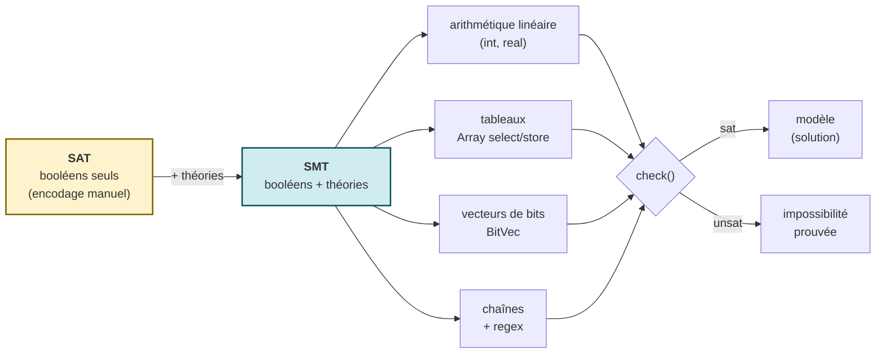

# SMT - Satisfiability Modulo Theories

[← Intelligence Symbolique](../README.md) | [Z3 (C# .NET) →](Z3/README.md) | [Z3-Python →](Z3-Python/README.md)

## En quelques mots

Ce répertoire regroupe les séries consacrées aux **solveurs SMT** (*Satisfiability Modulo Theories*) et, en pratique, au solveur de référence **Z3** (Microsoft Research). On y aborde le même changement de paradigme — passer de l'impératif (écrire l'algorithme de résolution) au déclaratif (décrire les contraintes, laisser le solveur résoudre) — sous deux angles complémentaires : une approche **C# déclarative bornée** (Z3.Linq) et une approche **Python impérative complète** (z3-py).

## Qu'est-ce que SMT ?

Un solveur **SAT** décide si une formule booléenne est satisfiable. Un solveur **SMT** étend SAT en raisonnant directement sur des *théories* : arithmétique linéaire sur les entiers et les réels, tableaux (`Array`), vecteurs de bits (`BitVec`), chaînes de caractères, fonctions non interprétées. Plutôt que d'encoder un Sudoku ou un planificateur de repas en variables booléennes à la main, on exprime les contraintes dans le langage naturel de la théorie concernée, et le solveur retourne un modèle (`sat`) ou prouve l'impossibilité (`unsat`).

Le saut **SAT → SMT** : plutôt que d'encoder un problème en variables booléennes à la main (coûteux, illisible), on l'exprime directement dans sa théorie naturelle — entiers, tableaux, bits, chaînes — et le solveur raisonne sur cette expressivité avant de rendre son verdict.

**Z3** est le solveur SMT le plus utilisé en recherche comme en industrie (vérification de programmes, planification, synthèse, sécurité). Les deux séries ci-dessous l'exploitent via deux bindings différents.

## Les deux séries

| Série | Langage / Binding | Style | Notebooks | Statut |
|-------|-------------------|-------|-----------|--------|
| [**Z3/**](Z3/README.md) | C# .NET 9 / **Z3.Linq** | Déclaratif borné : on traduit des expressions LINQ en formules SMT | 5 (`01` -> `05`) | PRODUCTION / BETA |
| [**Z3-Python/**](Z3-Python/README.md) | Python / **z3-py** | Impératif complet : accès à l'API intégrale du solveur | 6 (`01` -> `06`, série complète) | PRODUCTION |

### Z3.Linq (C#) — la porte d'entrée déclarative

`Z3.Linq` traduit des expressions LINQ C# en formules SMT. On écrit une requête proche de la syntaxe métier (`from ... where ... select ...`) et la couche cache les appels Z3 bas niveau. L'avantage pédagogique est la lisibilité : un théorème s'énonce presque comme une spécification. La contrepartie est une **couverture bornée** de l'API (pas de tactiques, pas de théories exotiques) et une montée en charge limitée sur les très grandes instances.

### z3-py (Python) — l'API complète

`z3-py` n'impose aucune couche déclarative restrictive : tactiques (`simplify`, `Then`, `OrElse`), théories `BitVec` et `Array`, `Optimize`, quantificateurs, `SolverFor(...)` spécialisés. C'est l'outil de référence pour aller au-delà de la modélisation introductive et explorer les ressorts internes du solveur.

## Quelle série choisir ?

- **Découvrir le paradigme déclaratif en C# / .NET** : commencer par [Z3/](Z3/README.md). Idéal si vous venez de l'écosystème .NET (Sudoku, Search/CSP du dépôt).
- **Exploiter toute la puissance de Z3 en Python** : aller vers [Z3-Python/](Z3-Python/README.md). Idéal pour la recherche, le prototypage rapide et les théories avancées (BitVec, Array, tactiques).

Les deux séries traitent volontairement des **mêmes problèmes phares** (théorèmes linéaires, Sudoku comme CSP) afin de rendre la comparaison déclaratif/impératif explicite d'un binding à l'autre.

## Voir aussi

- [Série Sudoku](../../Sudoku/README.md) — compare Z3 à une dizaine d'autres approches algorithmiques
- [Search / CSP](../../Search/README.md) — programmation par contraintes et automates symboliques (prédicats Z3)
- [Z3 Prover (upstream)](https://github.com/Z3Prover/z3) — le solveur SMT lui-même
- [Z3.Linq (endjin)](https://github.com/endjin/Z3.Linq) — le binding C# déclaratif

## Conclusion / Prochaines étapes

### Ce que vous avez appris

Ce répertoire vous a introduit à l'un des outils les plus puissants de l'informatique symbolique : le **solveur SMT** Z3, et au changement de regard qu'il rend possible — décrire *ce que l'on veut*, pas *comment l'obtenir*. L'arc pédagogique repose sur deux angles complémentaires du même paradigme déclaratif :

- **Le saut SAT → SMT** — un solveur SAT décide une formule booléenne ; un solveur SMT raisonne directement sur des *théories* (arithmétique linéaire, tableaux, vecteurs de bits, chaînes). Plutôt qu'encoder un Sudoku ou un planificateur en variables booléennes à la main, on énonce les contraintes dans le langage naturel de la théorie, et le solveur retourne un modèle (`sat`) ou prouve l'impossibilité (`unsat`). C'est ce gain d'expressivité qui rend Z3 indispensable en vérification de programmes, en planification et en sécurité.
- **La double porte d'entrée, délibérément juxtaposée** — le même paradigme s'atteint par deux bindings aux compromis opposés. **Z3.Linq (C#)** traduit des expressions LINQ en formules SMT : lisible, idiomatique .NET, mais à la couverture bornée (pas de tactiques ni de théories exotiques). **z3-py (Python)** expose l'API intégrale du solveur (tactiques, `BitVec`, `Array`, `Optimize`, quantificateurs) : tout puissant, mais au prix d'une syntaxe plus explicite. Comprendre les deux, c'est comprendre **quand la lisibilité déclarative suffit, et quand il faut descendre au contrôle de bas niveau**.
- **Le fil rouge commun** — les deux séries traitent volontairement des **mêmes problèmes phares** (théorèmes linéaires, Sudoku comme CSP) afin que la comparaison déclaratif/impératif soit explicite d'un binding à l'autre. La leçon transversale : la modélisation est un art autant qu'une technique, et le choix du binding dépend moins du problème que du contexte (écosystème .NET vs recherche Python, lisibilité vs expressivité).

La thèse est puissante et honnêtement présentée : il n'existe pas de « bon » binding dans l'absolu — Z3.Linq gagne en lisibilité ce qu'il perd en couverture, z3-py gagne en puissance ce qu'il perd en abstraction — et la compétence du développeur est de savoir choisir selon le problème et l'écosystème.

### Prochaines étapes

- **Z3 en C# déclaratif (Z3.Linq)** : la série [Z3/](Z3/README.md) (5 notebooks, .NET 9) est la porte d'entrée idéale si vous venez de l'écosystème .NET — patron `Theorem<T>`, théorie des tableaux, optimisation hiérarchique, génération de témoins.
- **Z3 en Python (z3-py)** : la série [Z3-Python/](Z3-Python/README.md) (6 notebooks) ouvre l'API complète — tactiques, `BitVec`/`Array`/`String`, quantificateurs, preuve par réfutation, optimisation Pareto/MaxSAT.
- **Z3 parmi d'autres paradigmes** : la [série Sudoku](../../Sudoku/README.md) compare Z3 à une dizaine d'autres approches algorithmiques (backtracking, DLX, métaheuristiques, inférence probabiliste, réseaux de neurones) sur un même problème NP-complet — le terrain idéal pour situer la résolution SMT dans le spectre des solveurs.
- **Programmation par contraintes industrielle** : la série [Search / CSP](../../Search/README.md) généralise la modélisation par contraintes (OR-Tools CP-SAT) à une famille plus large de problèmes d'optimisation et d'ordonnancement, avec un solveur complémentaire de Z3.

### Le fil rouge

La résolution SMT propose un changement de regard sur la modélisation de problèmes : ne plus demander « quel algorithme écrire pour résoudre ceci ? » mais **« quelles contraintes doivent être satisfaites, et dans quelle théorie les exprimer ? »**. Ce répertoire vous a donné le concept (SMT = SAT + théories), le solveur de référence (Z3), et deux portes d'entrée aux compromis clairement cartographiés (Z3.Linq déclaratif borné vs z3-py impératif complet) — en gardant à l'esprit que Z3 n'est qu'un point du spectre des solveurs, et que savoir le situer face à un backtracking, un CP-SAT ou une métaheuristique est précisément ce que les séries voisines (Sudoku, Search/CSP) enseignent.
