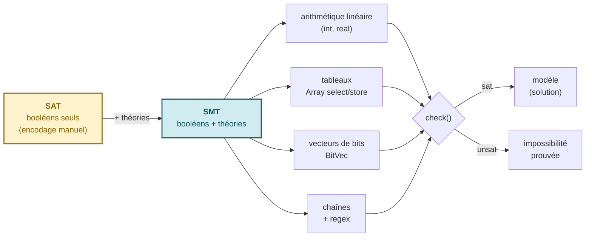

<!-- CATALOG-STATUS
series: SymbolicAI-SMT
pedagogical_count: 47
breakdown: SMT=47
maturity: BETA=46, DRAFT=1
-->

# SMT - Satisfiability Modulo Theories

[← Intelligence Symbolique](../README.md) | [Z3 (C# .NET) →](Z3-Linq2Z3/README.md) | [Z3-Python →](Z3-API/README.md)

## En quelques mots

Ce répertoire regroupe les séries consacrées aux **solveurs SMT** (*Satisfiability Modulo Theories*) et, en pratique, au solveur de référence **Z3** (Microsoft Research). On y aborde le même changement de paradigme — passer de l'impératif (écrire l'algorithme de résolution) au déclaratif (décrire les contraintes, laisser le solveur résoudre) — sous deux angles complémentaires : une approche **C# déclarative bornée** (Z3.Linq) et une approche **Python impérative complète** (z3-py).

## Qu'est-ce que SMT ?

Un solveur **SAT** décide si une formule booléenne est satisfiable. Un solveur **SMT** étend SAT en raisonnant directement sur des *théories* : arithmétique linéaire sur les entiers et les réels, tableaux (`Array`), vecteurs de bits (`BitVec`), chaînes de caractères, fonctions non interprétées. Plutôt que d'encoder un Sudoku ou un planificateur de repas en variables booléennes à la main, on exprime les contraintes dans le langage naturel de la théorie concernée, et le solveur retourne un modèle (`sat`) ou prouve l'impossibilité (`unsat`).

```mermaid
flowchart LR
    SAT["<b>SAT</b><br/>booléens seuls<br/>(encodage manuel)"]
    SMT["<b>SMT</b><br/>booléens + théories"]
    SAT -->|"+ théories"| SMT
    TH1["arithmétique linéaire<br/>(int, real)"]
    TH2["tableaux<br/>Array select/store"]
    TH3["vecteurs de bits<br/>BitVec"]
    TH4["chaînes<br/>+ regex"]
    SMT --> TH1
    SMT --> TH2
    SMT --> TH3
    SMT --> TH4
    TH1 --> V{"check()"}
    TH2 --> V
    TH3 --> V
    TH4 --> V
    V -->|"sat"| M["modèle<br/>(solution)"]
    V -->|"unsat"| U["impossibilité<br/>prouvée"]
    %% color: explicite -- sans lui, libelle clair sur fond clair en mode sombre GitHub (#15022) ; ton parfois plus fonce que le stroke (le stroke en couleur de texte rendrait infer illisible) : ne pas harmoniser
    classDef sat fill:#fff3cd,stroke:#856404,stroke-width:2px,color:#856404;
    classDef smt fill:#d1ecf1,stroke:#0c5460,stroke-width:2px,color:#0c5460;
    class SAT sat;
    class SMT smt;
```

Le saut **SAT → SMT** : plutôt que d'encoder un problème en variables booléennes à la main (coûteux, illisible), on l'exprime directement dans sa théorie naturelle — entiers, tableaux, bits, chaînes — et le solveur raisonne sur cette expressivité avant de rendre son verdict.

**Z3** est le solveur SMT le plus utilisé en recherche comme en industrie (vérification de programmes, planification, synthèse, sécurité). Les deux séries ci-dessous l'exploitent via deux bindings différents.

## Les deux séries

| Série | Langage / Binding | Style | Notebooks | Statut |
|-------|-------------------|-------|-----------|--------|
| [**Z3-Linq2Z3/**](Z3-Linq2Z3/README.md) | C# .NET 9 / **Z3.Linq** | Déclaratif borné : on traduit des expressions LINQ en formules SMT — avec bascule sur l'API .NET brute `Microsoft.Z3` quand la démonstration l'exige (notebooks `09`, `15`-`17`) | 18 (`01` -> `18`) | PRODUCTION / BETA |
| [**Z3-API/**](Z3-API/README.md) | Python / **z3-py** (+ 6 twins C# parité `Microsoft.Z3`) | Impératif complet : accès à l'API intégrale du solveur | 28 (18 Python `01`->`18` + 4 compagnons Meal-Planner `16b`->`16e` + 6 twins C# `01ᶜˢ`->`06ᶜˢ`) | PRODUCTION |

### Z3.Linq (C#) — la porte d'entrée déclarative

`Z3.Linq` traduit des expressions LINQ C# en formules SMT. On écrit une requête proche de la syntaxe métier (`from ... where ... select ...`) et la couche cache les appels Z3 bas niveau. L'avantage pédagogique est la lisibilité : un théorème s'énonce presque comme une spécification. La contrepartie est une **couverture bornée** de l'API du *binding* (pas de tactiques, pas de théories au-delà des entiers/booléens/tableaux) — c'est pourquoi quatre notebooks de la série basculent volontairement sur l'API .NET brute `Microsoft.Z3` : contraintes pseudo-booléennes à l'échelle (`09`), bit-vectors (`15`), réels exacts (`16`), UNSAT cores (`17`). La série montre ainsi *et* la porte d'entrée déclarative, *et* le solveur nu quand le DSL ne suffit plus.

### z3-py (Python) — l'API complète

`z3-py` n'impose aucune couche déclarative restrictive : tactiques (`simplify`, `Then`, `OrElse`), théories `BitVec` et `Array`, `Optimize`, quantificateurs, `SolverFor(...)` spécialisés. C'est l'outil de référence pour aller au-delà de la modélisation introductive et explorer les ressorts internes du solveur.

> **Parité .NET** : depuis le regroupement des séries par techno d'API (#6404, Schéma A #6300), la série `Z3-API/` héberge aussi **6 jumeaux C#** (`Z3-Python-01`…`06-Csharp`) qui rejouent les mêmes problèmes via le binding `Microsoft.Z3` brut — miroir direct des notebooks Python, pour comparer l'API impérative pyz3 et l'API .NET déclarative. Voir le [README de la série](Z3-API/README.md) (table twins `01ᶜˢ`-`06ᶜˢ`).

## Quelle série choisir ?

- **Découvrir le paradigme déclaratif en C# / .NET** : commencer par [Z3-Linq2Z3/](Z3-Linq2Z3/README.md). Idéal si vous venez de l'écosystème .NET (Sudoku, Search/CSP du dépôt).
- **Exploiter toute la puissance de Z3 en Python** : aller vers [Z3-API/](Z3-API/README.md). Idéal pour la recherche, le prototypage rapide et les théories avancées (BitVec, Array, tactiques).

## Voir aussi

- [Série Sudoku](../../Sudoku/README.md) — compare Z3 à une dizaine d'autres approches algorithmiques
- [Search / CSP](../../Search/README.md) — programmation par contraintes et automates symboliques (prédicats Z3)
- [Z3 Prover (upstream)](https://github.com/Z3Prover/z3) — le solveur SMT lui-même
- [Z3.Linq (endjin)](https://github.com/endjin/Z3.Linq) — le binding C# déclaratif

## Fondements bibliographiques

Cette série ne se réduit pas à Z3 : elle s'appuie sur un **arc de recherche autour des automates symboliques** (SFA) et de la résolution de contraintes regex étendues, dont Z3 (via la théorie des chaînes et le SMT-LIB regex) est un point d'application. L'arc est constitué en grande partie par Margus Veanes et collaborateurs (Microsoft Research) entre 2010 et 2025, et alimente deux sous-séries de ce répertoire : [`Automata/`](Automata/) (la **lib vendored en source** par Microsoft Research, point d'arrivée opérationnel de l'arc sur le binding .NET) et [`Resharp/`](Resharp/) (l'arrivée 2025 RE-sharp, en cours d'intégration ; coquille de dépôt en attendant la décision d'accueil — voir ci-dessous).

### Arc de recherche (chemins GDrive, jamais copiés dans le dépôt)

| Année | Papier | Statut lecture worker | Ancre typique dans le dépôt |
|-------|--------|----------------------|-----------------------------|
| 2010 | Veanes, Bjørner, de Moura, *Symbolic Automata Constraint Solving* (CAV) | lisible PyMuPDF 2026-10-05, 15 pages | fondement théorique de `Automata/` ; `Search-10` |
| 2010 | Veanes, de Halleux, Tillmann, *Rex — Symbolic Regular Expression Explorer* (ICST) | fichier absent de la biblio (cf `ls "G:\Mon Drive\MyIA\IA\Bibliographie IA\Automata\"`) | `Search-10` (exploration interactive) |
| 2013 | Veanes, *Applications of Symbolic Finite Automata* (CIAA) | lisible 2026-10-05, 8 pages | panorama applications, `Sudoku-13` |
| 2020 | Turonova, Holik, Lengal, Saarikivi, Veanes, Vojnar, *Regex Matching with Counting-Set Automata* (OOPSLA) | PDF corrompu (taille disque non-nulle, 0 page extractible) | `Automata/` (Counting-Set automata) |
| 2021 | D'Antoni, Veanes, *Automata Modulo Theories* (CACM) | PDF corrompu | théorie générale, `Automata/` |
| 2021 | Stanford, Veanes, Bjørner, *Symbolic Boolean Derivatives for Extended Regex Constraints* (PLDI) | lisible 2026-10-05, 16 pages | `Lean-14`, `Lean-14b` (dérivées booléennes) |
| 2024 | Zhuchko, Veanes, Ebner, *Lean Formalization of Extended Regex Matching with Lookarounds* (CPP) | PDF corrompu | pont direct `Lean-14b` / `Automata/` (formalisation Lean) |
| 2025 | Veanes et al, *RE-sharp — High-Performance Derivative-Based Regex Matching* (POPL) | PDF corrompu | `Resharp/` (point d'arrivée 2025) |
| 2025 | Veanes, Ball, Ebner, Zhuchko, *Symbolic Automata: ω-Regularity Modulo Theories* (POPL) | lisible 2026-10-05, 32 pages | `Automata/`, perspective ω-régularité |

Socle théorique en amont : Mohri 1997 (*Finite-State Transducers in Language and Speech Processing*, PDF corrompu) et le collectif Tree Automata 2008 (*TATA*, théorie générale).

**Avertissement — défaut biblio au 2026-10-05** : 4 des 9 papiers Veanes de l'arc ont un PDF structurellement corrompu sur la machine worker po-2026 (taille disque non-nulle, 0 page extractible par PyMuPDF). Le fichier Rex 2010 (ICST) est absent de la biblio. Les ancres qui dépendent de ces papiers sont marquées `a_confirmer` dans le dépôt tant qu'une copie lisible n'est pas réacquise sur le disque GDrive. Issue de suivi à ouvrir par le mainteneur (hors périmètre worker — c'est un geste bibliothèque, pas un geste de code). Les ancres vérifiées firsthand (4/9 : Bjørner 2010, Veanes 2013, Stanford 2021, Veanes 2025) sont les seules affirmées sans réserve dans les cellules `## References` ajoutées par cette PR.

### Cross-références curriculaires

L'arc SFA est mis en œuvre dans le dépôt sous **trois angles complémentaires**, qui se répondent :

- **Exploration** — `Search/Part1-Foundations/Search-10-SymbolicAutomata{-CSharp}.ipynb` : exploration interactive d'un automate symbolique (papier Rex 2010, à confirmer).
- **Solve** — `Sudoku/Sudoku-13-SymbolicAutomata-{CSharp,Python}.ipynb` : utilisation d'un SFA pour résoudre un cas pédagogique (Veanes 2013 *Applications*, vérifié).
- **Witness generation** — `SymbolicAI/SMT/Z3-Linq2Z3/10_Witness_Generation_Automata.ipynb` : génération de témoins à partir d'un automate (lien avec `Automata/`).

Le pont **théorie ↔ exécution certifiée** passe par `SymbolicAI/Lean/Lean-14-Finiteness-Derivatives.ipynb` et `Lean-14b-Finiteness-Lean-Companion.ipynb`, qui rejouent les dérivées booléennes de Stanford/Veanes/Bjørner 2021 (PLDI, vérifié) et le pont vers la formalisation Lean 4 de Zhuchko/Veanes/Ebner 2024 (CPP, à confirmer).

### Décision sur `Resharp/`

Le dossier `Resharp/` porte un **package compilé** RE-sharp (3 DLLs : `Resharp.dll`, `Resharp.Runtime.dll`, `FSharp.Core.dll`) référencé par 8 fichiers du dépôt (Config/Settings.cs, Config/SkiaUtils.cs, Sudoku/Sudoku-13-SymbolicAutomata-{CSharp,Python}.ipynb, etc.). RE-sharp (POPL 2025, Veanes et al) est le point d'arrivée opérationnel de l'arc SFA et mérite un notebook d'accueil dédié ; le PDF n'étant pas lisible sur la machine worker au 2026-10-05 (corrompu), la **décision** consignée dans cette PR est : **garder `Resharp/` en place, ajouter un README narratif** (voir [`Resharp/README.md`](Resharp/README.md)) qui documente l'état en attente, l'action à ouvrir par le mainteneur (réacquisition PDF + notebook d'accueil), et la raison pour laquelle un retrait brutal est impossible (anti-régression §D : les DLLs sont consommées par 8 fichiers).

## Conclusion / Prochaines étapes

### Ce que vous avez appris

Ce répertoire vous a introduit à l'un des outils les plus puissants de l'informatique symbolique : le **solveur SMT** Z3, et au changement de regard qu'il rend possible — décrire *ce que l'on veut*, pas *comment l'obtenir*. L'arc pédagogique repose sur deux angles complémentaires du même paradigme déclaratif :

- **Le saut SAT → SMT** — un solveur SAT décide une formule booléenne ; un solveur SMT raisonne directement sur des *théories* (arithmétique linéaire, tableaux, vecteurs de bits, chaînes). Plutôt qu'encoder un Sudoku ou un planificateur en variables booléennes à la main, on énonce les contraintes dans le langage naturel de la théorie, et le solveur retourne un modèle (`sat`) ou prouve l'impossibilité (`unsat`). C'est ce gain d'expressivité qui rend Z3 indispensable en vérification de programmes, en planification et en sécurité.
- **La double porte d'entrée, délibérément juxtaposée** — le même paradigme s'atteint par deux bindings aux compromis opposés. **Z3.Linq (C#)** traduit des expressions LINQ en formules SMT : lisible, idiomatique .NET, mais à la couverture bornée côté *binding* — la série C# bascule d'ailleurs sur l'API .NET brute (`Microsoft.Z3`) quand la démonstration l'exige (pseudo-booléens, bit-vectors, réels exacts, UNSAT cores). **z3-py (Python)** expose l'API intégrale du solveur (tactiques, `BitVec`, `Array`, `Optimize`, quantificateurs) : tout puissant, mais au prix d'une syntaxe plus explicite. Comprendre les deux, c'est comprendre **quand la lisibilité déclarative suffit, et quand il faut descendre au contrôle de bas niveau**.
- **Le fil rouge commun** — les deux séries traitent volontairement des **mêmes problèmes phares** (théorèmes linéaires, Sudoku comme CSP) afin que la comparaison déclaratif/impératif soit explicite d'un binding à l'autre. La leçon transversale : la modélisation est un art autant qu'une technique, et le choix du binding dépend moins du problème que du contexte (écosystème .NET vs recherche Python, lisibilité vs expressivité).

La thèse est puissante et honnêtement présentée : il n'existe pas de « bon » binding dans l'absolu — Z3.Linq gagne en lisibilité ce qu'il perd en couverture, z3-py gagne en puissance ce qu'il perd en abstraction — et la compétence du développeur est de savoir choisir selon le problème et l'écosystème.

### Prochaines étapes

- **Z3 en C# déclaratif (Z3.Linq)** : la série [Z3-Linq2Z3/](Z3-Linq2Z3/README.md) (18 notebooks, .NET 9) est la porte d'entrée idéale si vous venez de l'écosystème .NET — patron `Theorem<T>`, théorie des tableaux, planificateur de repas à l'échelle réelle (bloc 06→09 sur corpus RecipeML × Ciqual), ordonnancement, coloration, cryptarithmes, MaxSAT, puis bit-vectors, réels exacts et UNSAT cores via l'API brute.
- **Z3 en Python (z3-py)** : la série [Z3-API/](Z3-API/README.md) (28 notebooks : 18 Python + 4 compagnons Meal-Planner + 6 twins C# parité `Microsoft.Z3`) ouvre l'API complète — tactiques, `BitVec`/`Array`/`String`, quantificateurs, preuve par réfutation, optimisation Pareto/MaxSAT.
- **Z3 parmi d'autres paradigmes** : la [série Sudoku](../../Sudoku/README.md) compare Z3 à une dizaine d'autres approches algorithmiques (backtracking, DLX, métaheuristiques, inférence probabiliste, réseaux de neurones) sur un même problème NP-complet — le terrain idéal pour situer la résolution SMT dans le spectre des solveurs.
- **Programmation par contraintes industrielle** : la série [Search / CSP](../../Search/README.md) généralise la modélisation par contraintes (OR-Tools CP-SAT) à une famille plus large de problèmes d'optimisation et d'ordonnancement, avec un solveur complémentaire de Z3.

### Le fil rouge

La résolution SMT propose un changement de regard sur la modélisation de problèmes : ne plus demander « quel algorithme écrire pour résoudre ceci ? » mais **« quelles contraintes doivent être satisfaites, et dans quelle théorie les exprimer ? »**. Ce répertoire vous a donné le concept (SMT = SAT + théories), le solveur de référence (Z3), et deux portes d'entrée aux compromis clairement cartographiés (Z3.Linq déclaratif borné vs z3-py impératif complet) — en gardant à l'esprit que Z3 n'est qu'un point du spectre des solveurs, et que savoir le situer face à un backtracking, un CP-SAT ou une métaheuristique est précisément ce que les séries voisines (Sudoku, Search/CSP) enseignent.
