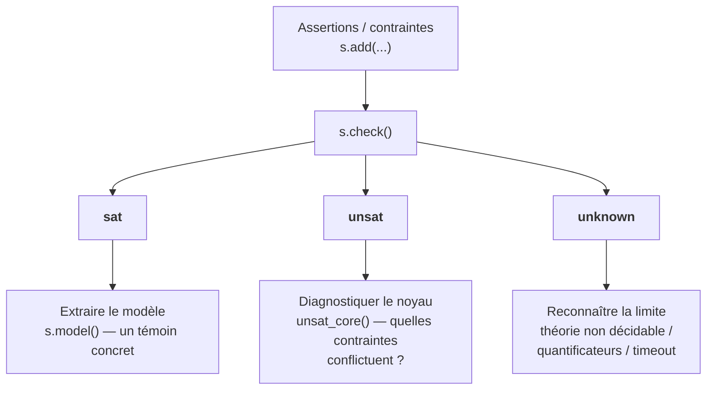
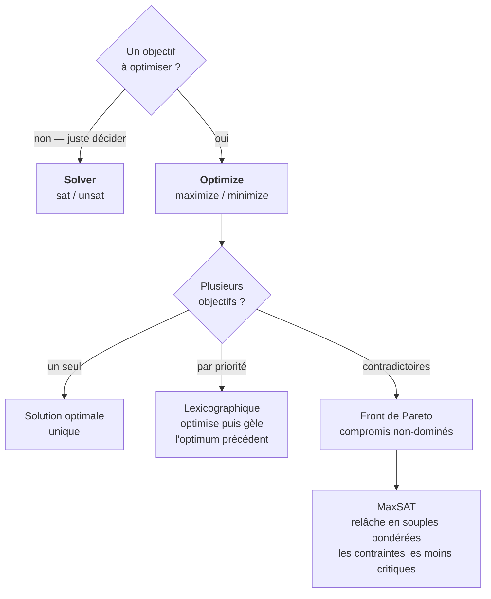

# Série Z3-Python - Résolution de contraintes SMT en Python

[← SMT](../README.md) | [Z3 C# (Z3.Linq) →](../Z3/README.md)

## Série en quelques mots

L'API z3-py expose l'intégralité du solveur Z3 en Python — `Solver`, `Optimize`, tactiques, théories `BitVec`/`Array`/`String`. Série complète de **11 notebooks** (z3-solver + matplotlib), de la satisfaction de contraintes à l'optimisation avancée, à l'ordonnancement combinatoire, aux énigmes logiques (CSP), à l'arithmétique symbolique (cryptarithmes), à la coloration de graphe (NP-complet) et au pont déclaratif avec la série sœur Z3.Linq (C#).

**À qui s'adresse cette série** : étudiants en IA, développeurs Python souhaitant découvrir la programmation par contraintes, et tout curieux voulant comprendre comment exprimer un problème non pas comme un algorithme de résolution, mais comme un ensemble de contraintes que le solveur satisfait automatiquement. Aucun prérequis en logique formelle n'est supposé : les notebooks partent de la syntaxe de base de z3-py pour monter progressivement vers l'optimisation et la modélisation de problèmes combinatoires.

## Présentation

**Z3** (Microsoft Research) est un solveur SMT (*Satisfiability Modulo Theories*) qui résout des systèmes de contraintes sur des entiers, des réels, des booléens, des vecteurs de bits, des tableaux et des chaînes. Cette série utilise **z3-py** (package pip `z3-solver`), le binding Python officiel qui expose **l'intégralité** de l'API Z3 : `Solver`, `Optimize`, théories (BitVec, Array, String, Real), tactiques et quantificateurs.

L'intérêt pédagogique : au lieu d'écrire un algorithme de backtracking pour un Sudoku ou un planificateur, on décrit les contraintes (une seule valeur par case, pas de doublon par ligne) et le solveur trouve les solutions. Ce changement de paradigme — de l'impératif au déclaratif — est au cœur de cette série.

### Python (z3-py) vs C# (Z3.Linq)

Une série sœur existe en C# : [SymbolicAI/Z3/](../Z3/README.md), basée sur le binding **Z3.Linq** qui traduit des expressions LINQ en formules SMT. La série Python présentée ici va plus loin : z3-py n'impose **aucune couche déclarative restrictive**, ce qui donne accès à l'API complète (tactiques, `Optimize`, théories de bas niveau).

| Aspect | Z3.Linq (C#) | z3-py (Python, cette série) |
|--------|--------------|------------------------------|
| **Binding** | LINQ -> Z3 (déclaratif) | API Z3 directe (impératif-symbolique) |
| **Theories** | Entiers, arrays (via lambdas) | BitVec, Array, String, Real, quantificateurs |
| **Optimisation** | Limitée | `Optimize` complet (maximize/minimize) |
| **Tactiques** | Non exposées | `Tactic`, `Then`, `Repeat` |
| **Courbe** | Syntaxe C# familière | API Python explicite, plus de contrôle |

### Déclaratif vs Impératif

| Aspect | Impératif (classique) | Déclaratif (Z3) |
|--------|----------------------|---------------------|
| **Approche** | Écrire l'algorithme de résolution | Décrire les contraintes, laisser le solveur résoudre |
| **Complexité** | Backtracking, heuristiques, pruning | Syntaxe Python naturelle |
| **Évolution** | Modifier l'algorithme pour chaque nouveau problème | Ajouter des contraintes, le solveur s'adapte |
| **Vérification** | Tester les solutions | Les solutions satisfont les contraintes par construction |
| **Limite** | Difficile à généraliser | Performance sur les très grandes instances |

## Vue d'ensemble

| # | Notebook | Sujet | Durée | Statut |
|---|----------|-------|------|--------|
| 01 | [Introduction](Z3-Python-01-Introduction.ipynb) | `Solver`, `Int`/`Bool`/`Real`, sat/unsat, `Optimize` | ~30 min | PRODUCTION |
| 01ᶜˢ | [Introduction (twin C# .NET)](Z3-Python-01-Introduction-Csharp.ipynb) | Parité .NET : même moteur Z3 via `Microsoft.Z3` (NuGet) | ~30 min | PRODUCTION |
| 02 | [Sudoku](Z3-Python-02-Sudoku.ipynb) | Sudoku comme CSP, `Distinct`, visualisation matplotlib | ~25 min | PRODUCTION |
| 02ᶜˢ | [Sudoku (twin C# .NET)](Z3-Python-02-Sudoku-Csharp.ipynb) | Parité .NET : même moteur Z3, visualisation ASCII | ~25 min | PRODUCTION |
| 03 | [Tactiques et théories](Z3-Python-03-Tactics.ipynb) | `Tactic`, `BitVec`, `Array` | ~35 min | PRODUCTION |
| 03ᶜˢ | [Tactiques et théories (twin C# .NET)](Z3-Python-03-Tactics-Csharp.ipynb) | Parité .NET : tactiques, `BitVec`, `Array` via `Microsoft.Z3` (NuGet) | ~35 min | PRODUCTION |
| 04 | [Chaînes et expressions régulières](Z3-Python-04-Strings-Regex.ipynb) | `String`, `Re` (théorie des chaînes Z3) | ~30 min | PRODUCTION |
| 04ᶜˢ | [Chaînes et expressions régulières (twin C# .NET)](Z3-Python-04-Strings-Regex-Csharp.ipynb) | Parité .NET : théorie des chaînes, regex via `Microsoft.Z3` (NuGet) | ~30 min | PRODUCTION |
| 05 | [Quantificateurs et preuves](Z3-Python-05-Quantifiers-Proofs.ipynb) | `ForAll`, `Exists`, preuves par réfutation, `unknown` | ~35 min | PRODUCTION |
| 05ᶜˢ | [Quantificateurs et preuves (twin C# .NET)](Z3-Python-05-Quantifiers-Proofs-Csharp.ipynb) | Parité .NET : `MkForall`, `MkExists`, réfutation, `ReasonUnknown` via `Microsoft.Z3` (NuGet) | ~35 min | PRODUCTION |
| 06 | [Optimisation avancée](Z3-Python-06-Advanced-Optimization.ipynb) | Pareto, objectifs multiples, `Optimize` hiérarchique, MaxSAT | ~40 min | PRODUCTION |
| 06ᶜˢ | [Optimisation avancée (twin C# .NET)](Z3-Python-06-Advanced-Optimization-Csharp.ipynb) | Parité .NET : `MkOptimize`, `MkMaximize`/`MkMinimize`, front de Pareto, `AssertSoft` (MaxSAT) via `Microsoft.Z3` (NuGet) | ~40 min | PRODUCTION |
| 07 | [Du style déclaratif LINQ au solveur Z3](Z3-Python-07-Style-Declaratif-Linq.ipynb) | Pont C# Z3.Linq ↔ pyz3 : `assert_and_track`, `unsat_core`, coloration de graphe (Australie) | ~30 min | PRODUCTION |
| 08 | [Ordonnancement (Job-Shop Scheduling)](Z3-Python-08-Ordonnancement.ipynb) | `Optimize.minimize`, contrainte disjonctive `Or(...)`, makespan minimal, diagramme de Gantt | ~35 min | PRODUCTION |
| 09 | [L'énigme d'Einstein (Zebra puzzle)](Z3-Python-09-Enigme-Einstein.ipynb) | Encodage par position, `Distinct`, adjacences, satisfiabilité vs optimisation, unicité prouvée | ~30 min | PRODUCTION |
| 10 | [Cryptarithmes (SEND + MORE = MONEY)](Z3-Python-10-Cryptarithmetic.ipynb) | `Int`, `Distinct`, équation positionnelle, propagation vs brute force, retenues déduites | ~25 min | PRODUCTION |
| 11 | [Coloration de graphe (Petersen)](Z3-Python-11-Graph-Coloring.ipynb) | `Int` par sommet, contraintes d'arêtes `!=`, recherche linéaire du nombre chromatique, `unsat` = preuve d'optimalité | ~30 min | PRODUCTION |

### Fil pédagogique

1. **Notebook 01** pose les bases : le patron `Solver()`, les types de base (`Int`, `Bool`, `Real`), les réponses `sat`/`unsat`/`unknown`, et l'optimisation avec `Optimize`
2. **Notebook 02** applique l'approche déclarative au Sudoku : modélisation par `Distinct`, résolution et visualisation (donné en noir / résolu en bleu)
3. **Notebook 03** explore les tactiques (`simplify`, `Then`, `OrElse`), les théories `BitVec` (arithmétique modulaire) et `Array` (tableaux symboliques)
4. **Notebook 04** introduit la théorie des chaînes : `String`, `Contains`, `IndexOf`, `Replace`, et les expressions régulières (`Re`, `Star`, `Range`, `InRe`)
5. **Notebook 05** aborde les quantificateurs (`ForAll`, `Exists`) et la notion de preuve formelle par réfutation (une formule est valide si sa négation est insatisfiable), avec le cas honnête `unknown`
6. **Notebook 06** explore l'optimisation avancée : contraintes hiérarchiques pondérées, objectifs multiples, front de Pareto et MaxSAT (contraintes souples)
7. **Notebook 07** fait le pont avec la série sœur C# Z3.Linq : il montre que l'idiome déclaratif LINQ (`where`/`select`) et l'API impérative pyz3 (`s.add`) expriment la même intention, puis exploite le noyau d'insatisfiabilité (`unsat_core`) et la coloration de graphe (carte d'Australie) pour révéler où le déclaratif surpasse l'impératif
8. **Notebook 08** applique l'optimisation à l'ordonnancement de tâches (job-shop scheduling, NP-difficile) : la contrainte disjonctive `Or(s_a + d_a ≤ s_b, s_b + d_b ≤ s_a)` (exclusion mutuelle sur une machine) et l'objectif de makespan minimal (`Optimize.minimize`) révèlent où le solveur surpasse une heuristique gloutonne FIFO — l'optimum trouvé (8 h) écrase le glouton (14 h)
9. **Notebook 09** illustre la **satisfiabilité** pure (versus l'optimisation du 08) sur l'énigme d'Einstein : l'encodage par position (25 variables entières) transforme un puzzle qualitatif en contraintes arithmétiques (`Distinct`, égalités, adjacences), et `Solver` trouve l'unique solution en quelques millisecondes là où la brute force affronte (5!)^5 = 24,9 milliards de combinaisons — l'unicité est **prouvée** par négation (`unsat`)
10. **Notebook 10** généralise à l'**arithmétique symbolique sur entiers** avec les cryptarithmes (`SEND + MORE = MONEY`) : chaque lettre est un `Int` dans `{0..9}`, `Distinct` impose l'unicité, et l'équation positionnelle (`1000·S + 100·E + …`) est résolue par propagation — Z3 trouve l'unique solution (`9567 + 1085 = 10652`) en millisecondes tandis que la brute force énumère `P(10,8) = 1 814 400` candidats (~9 s), illustrant le gain du paradigme déclaratif
11. **Notebook 11** aborde la **coloration de graphe** (NP-complet) sur le graphe de Petersen : une variable `Int` par sommet, des contraintes d'arêtes `C_a != C_b`, et une **recherche linéaire sur k** qui trouve le nombre chromatique `chi = 3` **et le prouve minimal** (`k = 2` → `unsat`). Là où le glouton first-fit hésite (3 ou 4 couleurs selon l'ordre) sans jamais certifier l'optimum, le verdict `unsat` de Z3 est une **preuve formelle** d'impossibilité — la double capacité (trouver ET prouver) est le cœur de l'apport SMT en optimisation combinatoire

## Concepts clés

La série manipule un vocabulaire précis hérité de la programmation par contraintes et de la logique. Le tableau ci-dessous reprend les notions effectivement utilisées dans les notebooks, avec un pointeur vers celui qui les introduit.

| Concept | Description | Notebook |
|---------|-------------|----------|
| **Solveur SMT (Z3)** | Décide la satisfiabilité d'une formule sur des *théories* (entiers, réels, vecteurs de bits, tableaux, chaînes), pas seulement sur des booléens. | 01 |
| **`Solver` vs `Optimize`** | `Solver` répond sat/unsat (le problème a-t-il une solution ?) ; `Optimize` ajoute un objectif à maximiser ou minimiser sous contraintes. | 01, 06 |
| **`sat` / `unsat` / `unknown`** | Les trois verdicts de `check()` : il existe un modèle / aucune solution / le solveur ne tranche pas (théorie non décidable, timeout). | 01 |
| **Modèle** | L'assignation concrète des variables qui satisfait les contraintes, obtenu via `s.model()`. Un seul exemple parmi les solutions possibles, à n'appeler que sur `sat`. | 01 |
| **Noyau d'insatisfiabilité** | Sous-ensemble minimal de contraintes responsable d'un `unsat` (`unsat_core()`), qui pointe exactement ce qu'il faut assouplir pour rendre le problème réalisable. | 01 |
| **Assertion / contrainte** | Une formule ajoutée au solveur via `s.add(...)`. Dite *dure* (hard) par défaut : elle doit être satisfaite. | 01 |
| **`Distinct`** | Contrainte « tous différents » sur un ensemble de variables, raccourci central pour modéliser un Sudoku, un N-reines ou tout CSP d'exclusivité sans énumérer les inégalités deux à deux. | 02 |
| **`BitVec`** | Vecteur de bits pour l'arithmétique modulaire (modéliser un overflow, un registre, une primitive cryptographique). | 03 |
| **`Array`** | Tableau symbolique fonctionnel (théorie des tableaux : select/store) manipulé comme une valeur, pas comme un effet de bord. | 03 |
| **Tactique** | Transformation du problème avant résolution (`simplify`, `Then`, `OrElse`) pour guider le solveur vers une réponse plus rapide. | 03 |
| **Contrainte dure vs souple** | Dure : doit être satisfaite. Souple (*soft*) : une violation est tolérée moyennant une pénalité, quand on ne peut pas tout satisfaire. | 06 |
| **MaxSAT** | Relaxation des contraintes dures en contraintes souples via des variables booléennes, pour satisfaire un maximum de contraintes simultanément. | 06 |
| **Optimisation lexicographique** | Plusieurs objectifs résolus par priorité de déclaration : le premier objectif est optimisé, puis le second sous la contrainte que le premier reste optimal. | 06 |
| **Front de Pareto** | Ensemble des solutions non-dominées lorsque plusieurs objectifs se contredisent : les compromis optimaux, à départager par un humain. | 06 |
| **Preuve par réfutation** | Une formule est valide si sa négation est insatisfiable (`unsat` sur la négation = la formule tient dans tous les cas). | 05 |



Les **trois verdicts** de `check()` appellent trois postures distinctes — c'est l'épine dorsale de l'usage du solveur, posée au notebook 01 et raffinée jusqu'au noyau d'insatisfiabilité et à la preuve par réfutation.

## Prérequis

| Besoin | Détail |
|--------|--------|
| **Python 3.10+** | [Download](https://www.python.org/downloads/) |
| **z3-solver** | `pip install z3-solver` |
| **matplotlib** | `pip install matplotlib` (visualisation, notebooks 02 et 08) |
| **Kernel Jupyter** | `python3` |

> Les notebooks sont autonomes : les imports sont inclus dans la cellule de setup de chaque notebook. Le package s'appelle `z3-solver` (et non `z3`).

```bash
# Installation complete
pip install -r requirements.txt
```

## Objectifs d'apprentissage

À l'issue de cette série, l'étudiant sera capable de :

1. **Modéliser** un problème de satisfaction de contraintes en Python avec z3-py
2. **Utiliser** les types et théories Z3 (`Int`, `Real`, `Bool`, `BitVec`, `Array`, `String`)
3. **Optimiser** une fonction objectif sous contraintes (`Optimize`)
4. **Comparer** l'approche déclarative (Z3) aux approches impératives (backtracking, CP)
5. **Appliquer** la résolution SMT à des problèmes concrets (Sudoku, ordonnancement, allocation)

## Domaines d'application

Le pattern « décrire les contraintes, laisser le solveur résoudre » s'applique dès qu'un problème se réduit à un système de contraintes sur des variables. Les exercices de la série en couvrent plusieurs, et l'usage industriel de Z3 en couvre d'autres :

- **Résolution de puzzles et CSP** : Sudoku, N-reines, cryptarithmes — modélisation déclarative (`Distinct`, `And`, `Or`), sans écrire de backtracking à la main. Le notebook 02 en fait l'expérience sur le Sudoku. Comparer avec les 10 autres approches algorithmiques de la [série Sudoku](../../../Sudoku/README.md).
- **Ordonnancement (scheduling)** : placer des tâches dans le temps sous contraintes de précédence, de ressources et de fenêtres (notebook 08, job-shop ; exercice 2 du notebook 01). Le solveur trouve un planning réalisable, ou retourne le noyau d'insatisfiabilité qui pointe les contraintes conflictuelles.
- **Allocation de ressources** : maximiser un gain ou minimiser un coût sous bornes et exclusivités (notebook 01, exercice 3 ; notebook 06). `Optimize` traitera directement la fonction objectif.
- **Vérification de programmes** : prouver qu'un code respecte sa spécification (absence d'overflow entiers via `BitVec`, invariants de boucle, propriétés de sûreté) — l'usage industriel historique de Z3 en analyse statique et model-checking.
- **Configuration** : sélectionner des options compatibles (catalogue produit, planning d'emplois du temps) parmi un ensemble de contraintes d'exclusion et de cardinalité. MaxSAT (notebook 06) permet de relâcher les préférences les moins importantes quand tout n'est pas satisfaisable.
- **Cryptanalyse et sécurité** : raisonner sur des schémas via `BitVec` (trouver des collisions, des contre-exemples à une propriété cryptographique, des attaques symboliques sur des protocoles).

## Contexte technique

**z3-py** combine deux technologies :

- **Z3** : solveur SMT (*Satisfiability Modulo Theories*) capable de résoudre des contraintes sur des entiers, réels, booléens, vecteurs de bits, tableaux et chaînes
- **Python** : le binding `z3-solver` expose l'API C++ de Z3 via des wrappers Python, avec surcharge des opérateurs (`==`, `+`, `*`) pour construire des formules symboliques de façon naturelle

### Liens

- [Z3 Guide (officiel)](https://microsoft.github.io/z3guide/) — documentation et tutoriels
- [Z3 Python API](https://z3prover.github.io/api/html/namespacez3py.html) — référence de l'API z3-py
- [PyPI : z3-solver](https://pypi.org/project/z3-solver/) — package pip
- [Série Z3 C# (Z3.Linq)](../Z3/README.md) — série sœur en .NET 9
- [Série Sudoku](../../../Sudoku/README.md) — compare Z3 à 10 autres approches algorithmiques

## Références académiques

La série manipule un vocabulaire précis (SMT, tactiques, MaxSAT, théories) hérité de la logique et de la vérification automatique. Les fondements théoriques et les papiers fondateurs des concepts introduits :

| Référence | Couverture |
|-----------|------------|
| de Moura & Bjorner, "Z3: An Efficient SMT Solver" (TACAS 2008) | Solveur Z3 utilisé tout au long de la série |
| Nieuwenhuis, Oliveras & Tinelli, "Solving SAT and SAT Modulo Theories: From an Abstract DPLL Procedure to DPLL(T)" (JACM 2006) | Fondements théoriques de la résolution SMT (DPLL(T)) |
| de Moura & Passmore, "The Strategy Challenge in SMT Solving" (2013) | Tactiques et stratégies de résolution (notebook 03) |
| Morgado, Heras, Liffiton, Planes & Marques-Silva, "Iterative and core-guided MaxSAT solving: A survey and assessment" (Constraints 2013) | MaxSAT, relaxation des contraintes dures en souples (notebook 06) |

## FAQ / Troubleshooting

| Problème | Solution |
|----------|----------|
| **`ModuleNotFoundError: No module named 'z3'`** | Le package pip s'appelle `z3-solver` (et non `z3`). Installer avec `pip install z3-solver`, puis `import z3`. Le notebook 0 le rappelle dans sa cellule de setup. |
| **`check()` renvoie `unknown`** | Le solveur ne peut pas conclure : théorie non décidable, quantificateurs (notebook 5) ou timeout. Simplifier le modèle, changer de tactique (`Then`, `OrElse`, notebook 3) ou augmenter le timeout du solveur. |
| **`s.model()` échoue ou lève une exception** | `model()` n'a de sens que si `check() == sat`. Sur `unsat`, il n'y a pas de modèle à extraire (consulter `unsat_core()` à la place) ; sur `unknown`, le résultat est incertain. |
| **`Optimize` ou `Solver` ?** | `Solver` = satisfiabilité seule (le problème a-t-il une solution ?). Dès qu'il y a un objectif à maximiser/minimiser, utiliser `Optimize` (notebook 1 §4, notebook 6). |
| **Plusieurs objectifs — ordre des résultats** | Z3 résout les objectifs de manière *lexicographique* (ordre de déclaration). Déclarer en priorité l'objectif le plus important : il sera optimisé, puis le suivant sous la contrainte que le premier reste optimal (notebook 6). |
| **Lenteur sur une grande instance** | Z3 est NP-difficile : la performance n'est pas garantie. Factoriser les contraintes communes, borner le domaine des entiers, appliquer une tactique, ou décomposer le problème en sous-problèmes. |

## Conclusion / Prochaines étapes

### Ce que vous avez appris

Cette série vous a donné accès à **l'intégralité de la machinerie Z3**, sans la couche déclarative restrictive d'un binding de haut niveau. L'arc pédagogique suit une montée en abstraction délibérée :

- **Le geste fondateur** — modéliser un problème non pas comme un algorithme (backtracking, heuristiques) mais comme un *ensemble de contraintes* que le solveur satisfait automatiquement. Le patron `Solver()` de z3-py incarne ce basculement : déclarer des variables symboliques (`Int`, `Bool`, `Real`), ajouter des assertions, lire le verdict `sat`/`unsat`/`unknown`. C'est le socle posé au notebook 01 (types de base, optimisation avec `Optimize`) sur lequel tout le reste se construit.
- **La pleine puissance de l'API, délibérément exposée** — là où la série sœur Z3.Linq (C#) masque l'API derrière LINQ, z3-py ouvre **toutes** les théories et tous les leviers : les **tactiques** (`simplify`, `Then`, `OrElse`) pour transformer le problème avant résolution (notebook 03), les **vecteurs de bits** `BitVec` pour l'arithmétique modulaire et la cryptanalyse, les **tableaux symboliques** `Array` (théorie `select`/`store`), les **chaînes et regex** `String`/`Re` (notebook 04, où Z3 *génère* un témoin satisfaisant un motif, pas seulement le vérifie), et les **quantificateurs** `ForAll`/`Exists` avec la preuve par réfutation (notebook 05).
- **L'instrument** — les outils qui opérationnalisent chaque facette du solveur : `Distinct` pour l'exclusivité (Sudoku, N-reines), le **noyau d'insatisfiabilité** `unsat_core()` qui pointe exactement les contraintes conflictuelles, et l'**optimisation avancée** du notebook 06 — contraintes hiérarchiques pondérées, objectifs multiples lexicographiques, **front de Pareto** pour les objectifs contradictoires, et **MaxSAT** pour relâcher les contraintes les moins importantes quand tout n'est pas satisfaisable. Chaque notebook dévoile un levier de plus que les approches impératives n'offrent pas.
- **La finesse** — que la distinction **satisfiabilité vs optimisation** structure l'usage du solveur : `Solver` répond « le problème a-t-il une solution ? » (`sat`/`unsat`), `Optimize` ajoute « quelle est la *meilleure* solution ? ». Et que les trois verdicts (`sat`/`unsat`/`unknown`) appellent trois postures distinctes : extraire un modèle, diagnostiquer le noyau d'insatisfiabilité, ou reconnaître honnêtement la limite du solveur (théorie non décidable, quantificateurs, timeout).

La thèse est puissante et honnêtement présentée : z3-py ne promet pas la performance (Z3 est NP-difficile), mais il promet l'**expressivité** — modéliser ce que l'on *veut*, dans un langage naturel riche (entiers, réels, bits, tableaux, chaînes, quantificateurs), et laisser le solveur faire le travail de recherche. Le compromis est clair : on troque la garantie de performance contre la concision déclarative et l'accès aux théories.



Le diagramme ci-dessus situe les deux postures du solveur — **décider** (`Solver`) ou **optimiser** (`Optimize`) — et l'escalade du notebook 06 : d'un objectif unique à plusieurs objectifs par priorité (lexicographique), puis, lorsque les objectifs se contredisent, au **front de Pareto** et à la relaxation **MaxSAT**.

### Prochaines étapes

- **Série sœur Z3 C# (Z3.Linq)** : [Z3](../Z3/README.md) propose la même idée — décrire des contraintes, laisser le solveur résoudre — mais via le binding LINQ en .NET 9. C'est le miroir de cette série pour les développeurs C# : plus restrictif (pas de tactiques ni de `BitVec` exposés directement) mais plus idiomatique en C#. Comparer les deux fait saisir le compromis entre abstraction déclarative et contrôle de bas niveau.
- **Comparaison multi-paradigmes** : la [série Sudoku](../../../Sudoku/README.md) compare Z3 à **10 autres approches algorithmiques** (backtracking, DLX, CP-SAT, métaheuristiques, inférence probabiliste, réseaux de neurones) sur un même problème NP-complet — le terrain idéal pour situer Z3 dans le spectre des solveurs.
- **Regex symbolique à l'échelle** : la théorie des chaînes du notebook 04 (`Re`/`InRe`, génération de témoin) trouve son aboutissement dans [Sudoku-13 — Automates symboliques](../../../Sudoku/Sudoku-13-SymbolicAutomata-Csharp.ipynb) (Epic **#2978**), qui met en scène la distinction reconnaissance (RE#, temps linéaire) vs résolution (Z3, production de témoin) sur une grille de Sudoku.
- **Programmation par contraintes industrielle** : la série [Search](../../../Search/README.md) (Part 2-CSP, OR-Tools CP-SAT) généralise la modélisation par contraintes à une famille plus large de problèmes d'optimisation, avec un solveur (CP-SAT) dont le compromis performance/expressivité diffère de Z3.
- Pour la pratique : reprenez le [notebook 06 (Advanced Optimization)](Z3-Python-06-Advanced-Optimization.ipynb) et formulez un problème multi-objectifs de votre choix (allocation budgétaire, planning sous préférences contradictoires). Explorez ensuite la frontière de Pareto : quelles solutions le solveur propose-t-il, et comment MaxSAT permet-il de relâcher les contraintes les moins critiques quand le problème devient irréalisable ? C'est l'exercice le plus formateur pour saisir la différence entre *satisfaire* et *optimiser*.

### Le fil rouge

La programmation par contraintes avec z3-py propose un changement de regard sur la résolution de problèmes : ne plus demander « quel algorithme écrire pour résoudre ceci ? » mais **« quelles contraintes doivent être satisfaites, et quelle est la meilleure solution parmi celles qui le sont ? »**. Cette série vous a donné l'API complète (types, théories, tactiques, quantificateurs), les deux postures (`Solver` pour décider, `Optimize` pour optimiser), et l'intuition des compromis (expressivité vs performance, contraintes dures vs souples, Pareto quand les objectifs se contredisent) — en gardant à l'esprit que Z3 n'est qu'un point du spectre des solveurs, et que la compétence est de savoir quand l'utiliser plutôt qu'un backtracking, un CP-SAT ou une métaheuristique.
