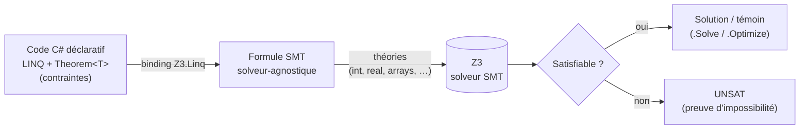
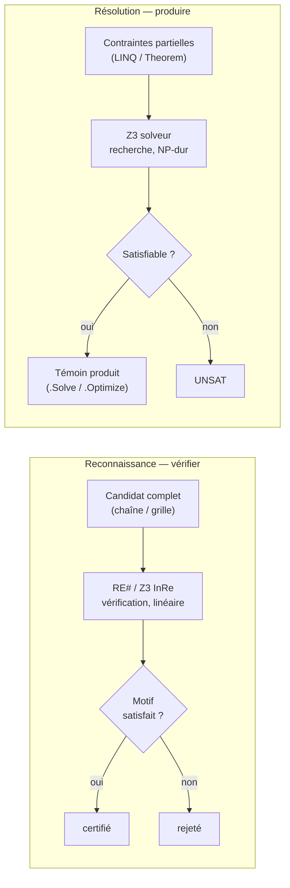

# Série Z3 - Programmation Déclarative avec Z3.Linq

[← SMT](../README.md) | [Z3-Python (série sœur) →](../Z3-Python/README.md)

## Série en quelques mots

Le binding Z3.Linq traduit des requêtes LINQ C# en formules SMT — on décrit les contraintes, le solveur produit la solution. Série .NET 9 de **18 notebooks** (~15h), du théorème linéaire à l'optimisation sous contraintes molles (sac à dos, MaxSAT) — en passant par les cryptarithmes positionnels (arithmétique positionnelle + contrainte globale `Distinct` sur le classique SEND + MORE = MONEY), la vérification de débordement sur **bit-vectors**, le **raisonnement exact sur les réels**, et l'**explication de l'insatisfiabilité** (UNSAT cores — quelles contraintes, parmi des dizaines, se contredisent).

**À qui s'adresse cette série** : étudiants en IA, développeurs C# souhaitant découvrir la programmation par contraintes, et tout curieux voulant comprendre comment exprimer un problème non pas comme un algorithme de résolution, mais comme un ensemble de contraintes que le solveur satisfait automatiquement. Aucun prérequis en logique formelle n'est supposé : les notebooks partent de théorèmes linéaires simples pour monter progressivement vers les théories de tableaux et l'optimisation hiérarchique.

## Présentation

**Z3** (Microsoft Research) est un solveur SMT (*Satisfiability Modulo Theories*) qui résout des systèmes de contraintes sur des entiers, des réels, des booléens et des tableaux. **Z3.Linq** est un binding qui traduit des expressions LINQ C# en formules SMT, permettant de modéliser des problèmes déclarativement sans écrire les appels Z3 bas niveau.

L'intérêt pédagogique : au lieu d'écrire un algorithme de backtracking pour un Sudoku ou un planificateur de repas, on décrit les contraintes (une seule valeur par case, pas de doublon par ligne, apports nutritionnels requis) et le solveur trouve les solutions. Ce changement de paradigme — de l'impératif au déclaratif — est au cœur de cette série.

### Déclaratif vs Impératif

| Aspect | Impératif (classique) | Déclaratif (Z3.Linq) |
|--------|----------------------|---------------------|
| **Approche** | Écrire l'algorithme de résolution | Décrire les contraintes, laisser le solveur résoudre |
| **Complexité** | Backtracking, heuristiques, pruning | Syntaxe LINQ naturelle en C# |
| **Évolution** | Modifier l'algorithme pour chaque nouveau problème | Ajouter des contraintes, le solveur s'adapte |
| **Vérification** | Tester les solutions | Les solutions satisfont les contraintes par construction |
| **Limite** | Difficile à généraliser | Performance sur les très grandes instances |

L'abstraction centrale du binding : on reste en C#, on décrit des contraintes, et le pipeline ci-dessus — traduction vers le solveur puis décision — se fait sans écrire un seul appel Z3 bas niveau.

## Les deux stacks

La série illustre **deux façons** de piloter le solveur Z3 depuis C#, délibérément juxtaposées :

| Stack | API | Esprit | Notebooks |
|-------|-----|--------|-----------|
| **A — Z3.Linq (DSL)** | `Theorem<T>`, `.Solve()`, `.Optimize()`, lambdas LINQ | Déclaratif haut-niveau : on décrit contraintes et modèle, le binding traduit vers SMT. | `01`–`08`, `10`–`14`, `18` |
| **B — Microsoft.Z3 (API brute)** | `MkBV`, `MkBVAdd`, `MkPBEq`, `MkPBGe`, `MkExtract`, `Check`, `UnsatCore` | Bas-niveau : on assemble soi-même termes et sorts Z3. Indispensable pour les théories que le DSL n'expose pas (bit-vectors, contraintes pseudo-booléennes) ou les fonctionnalités sans équivalent LINQ complet (preuve par réfutation ; les UNSAT cores ont désormais une surface diagnostique DSL `Explain()`, cf bloc B6 dans `17`). | `09`, `15`–`17` |

**Pourquoi deux stacks ?** Le binding Z3.Linq est une *porte d'entrée* : il rend la modélisation lisible mais masque l'API Z3. Quatre notebooks franchissent volontairement ce voile — `09` (contraintes pseudo-booléennes `MkPBEq`/`MkPBLe`/`MkPBGe`, la seule écriture qui fait converger le planificateur à l'échelle réelle), `15` (bit-vectors : le raw pour l'extraction bit-à-bit `MkExtract`, complété d'un bloc B4 où le DSL *exprime* la largeur fixe via `[BitVecWidth(n)]`), `16` (réels exacts, raisonnement algébrique — complété d'un bloc B7 où le DSL *porte* la fraction exacte via `Rational.Of(num, den)`) et `17` (UNSAT cores, explication de l'insatisfiabilité — complété d'un bloc B6 où le DSL *diagnostique* le core minimal via `Explain()`) — pour montrer **le solveur nu**, là où la vérification de code et de matériel se joue réellement. Chacun ouvre par un appel `> Stack : B — pourquoi` qui signale le changement d'API. La série sœur [Z3-Python](../Z3-Python/README.md) expose l'API complète côté Python ; ces trois notebooks en sont l'équivalent C#.

**Et quand le DSL suffit, on juxtapose les deux écritures.** C'est le cas du bloc **B1** dans `14` : le raw `MkOptimize + AssertSoft(BoolExpr, uint, group)` (API B) et le DSL `.SoftWhere(constraint, weight: N, group: "default")` (API A) sont mis côte-à-côte dans le même notebook, parce que le DSL est ici *équivalent en expressivité* au raw — le routage vers `MkOptimize` est automatique dès qu'une soft est présente (`Theorem.cs:144`). La juxtaposition montre que la frontière A/B n'est pas une hiérarchie de qualité mais une affaire d'**exposition** : quand le DSL couvre, on gagne en lisibilité sans rien perdre en expressivité. Le bloc **B4** dans `15` étend ce principe à la théorie des bit-vectors : l'attribut `[BitVecWidth(n)]` sur une propriété entière suffit à router `+`/`<` vers les opérateurs modulaires (`Theorem.cs:548`), si bien que le prédicat de débordement `a + b < a` s'écrit en arithmétique C# naturelle côté DSL, face au raw `MkBitVecSort + MkBVAdd + MkBVULT` — même double verdict (SAT en 4 bits, UNSAT sur les entiers non bornés), la largeur vivant désormais dans le type et non dans l'appel. Le bloc **B7** dans `16` applique le même geste à l'exactitude des constantes réelles : `Rational.Of(1, 3)` porte la fraction exacte dans l'arbre d'expression (émise en `MkReal("1/3")`, `ExpressionVisitor.cs:660`) là où un littéral `double` `1.0/3.0` glisse silencieusement vers le chemin lossy (`ExpressionVisitor.cs:679`) — sur le prédicat `x == 1/3 ∧ 3x == 1`, la version exacte est SAT et la version approchée UNSAT, l'exactitude vivant dans le *type* de la constante et non dans le site d'appel `MkReal`. Le bloc **B6** dans `17` étend la juxtaposition à un cas longtemps réputé « raw seulement » — les cores UNSAT : `Theorem<T>.Explain()` (`Explanation.cs:41`) renvoie une `Explanation` distinguant `SolveStatus` Sat/Unsat/Unknown et, sur UNSAT, le core minimal comme liste de `ConstraintRef (Index, Expression)`, face au raw `Check(assumptions) + UnsatCore` — les deux isolent le même core minimal `{#0, #2}` (la contrainte innocente écartée), mais le DSL porte en plus la ligne `.Where` source de chaque coupable. Seule la *preuve par réfutation* reste l'apanage du raw. Le bloc **B5** dans `11` (ordonnancement) déplace la juxtaposition vers l'*après-solution* : lire une quantité **dérivée** — non membre du type résultat — sous le modèle qui a produit la solution. Le raw garde le `Model` et re-exprime la dérivée en termes Z3 (`model.Eval(MkAdd(s0, MkInt(d0)), true)`), tandis que le DSL `Theorem<T>.Solve(w => w.Eval(x => x.S0 + d0))` (`Theorem.cs`) la fait ressortir par un callback typé, évaluée en lambda C# sur le modèle-objet — même témoin (fin de job, makespan, fait de non-chevauchement), et le callback n'est pas invoqué sur UNSAT. Le bloc **B2** dans `12` (coloration) porte la juxtaposition sur les **indicateurs conditionnels** : réifier une condition en 0/1 via un ternaire pour la *compter* au lieu de l'interdire. Sur un triangle sous-coloré (3 sommets tous adjacents, 2 couleurs), le nombre de conflits d'arête s'écrit `(cu == cv ? 1 : 0)` sommé — raw `MkITE(MkEq(cu,cv), MkInt(1), MkInt(0))` + `MkAdd`, DSL ternaire C# naturel que [`VisitConditional`](../Z3.Linq/solutions/Z3.Linq/ExpressionVisitor.cs#L212) traduit en `MkITE` (`ExpressionVisitor.cs:218`) — même double verdict : `somme <= 1` SAT (un triangle bicolore a au moins un conflit), `somme == 0` UNSAT (preuve que `χ > 2`). L'indicateur réifié est ce qui fait passer d'un modèle dur (interdire) à un modèle souple (compter et borner). Enfin, le bloc **B8** dans `02` (Sudoku) porte la juxtaposition sur les **quantificateurs bornés** : la section 3 y déroule à la main les contraintes de cellule (une boucle émet une propriété par index), là où un quantificateur fini les exprime en une ligne. Sur une rangée de 4 cellules, « chaque cellule dans [1,4] » et « au moins une cellule vaut 4 » s'écrivent côté raw en dépliant une conjonction `MkAnd` et une disjonction `MkOr` index par index, côté DSL via `Z3Methods.ForAll(Enumerable.Range(0, N), i => …)` (`Z3Methods.cs:57`, déplié en `MkAnd`) et `Z3Methods.Exists(…)` (`Z3Methods.cs:77`, déplié en `MkOr`) — même double verdict : SAT avec témoin, puis UNSAT dès qu'on réduit les bornes à [1,3] (aucune cellule ne peut alors valoir 4). Le domaine étant un `IEnumerable` évalué dans l'hôte, ce sont des quantificateurs *finis* (le domaine vide donne un universel vrai et un existentiel faux, comme en logique classique), non les quantificateurs SMT non bornés — le déroulage vit désormais dans le `.Where` et non dans une boucle C#. Le bloc **B3** dans `14` (le notebook de B1) porte la juxtaposition sur les **sommes variadiques** : le sac à dos 0/1 agrège une somme pondérée `4·x0 + 5·x1 + … + 2·x4` que le visiteur ne sait replier qu'**opérande par opérande** (le `+` binaire). Côté raw on remplit à la main un tableau `MkMul(poids[i], x[i])` puis `z3.MkAdd(ArithExpr[])` (l'API brute est déjà variadique), côté DSL `Z3Methods.Sum(new[]{ 4*t.x0, … })` ([`Z3Methods.cs:37`](../Z3.Linq/solutions/Z3.Linq/Z3Methods.cs#L37)) replie la liste entière en un seul `MkAdd` via le visiteur ([`ExpressionVisitor.cs:482`](../Z3.Linq/solutions/Z3.Linq/ExpressionVisitor.cs#L482), branche `NewArrayExpression` littérale ou `Select(…).ToArray()` sur une collection hôte) — même optimum (valeur 27, poids 10/10), le DSL supprimant le déroulage terme-à-terme sur les agrégations de longueur variable (`sum_i Sel[i]·coût[i]`, charge de bin, ligne Sudoku). Le pont manquant n'est pas une théorie Z3 cachée — `MkAdd` est déjà variadique — mais l'agrégation d'une **collection C#** en un **terme SMT unique**. Le bloc **B9** dans `01` porte la juxtaposition sur les **environnements record positionnels** : un `record Point(int X, int Y)` n'expose aucun constructeur sans paramètre, si bien que l'ancienne branche de reconstruction (`Activator.CreateInstance(t)`) lançait `MissingMethodException` sur les positional records. La nouvelle branche `ConstructFromModel` ([`Theorem.cs:993-1099`](../Z3.Linq/solutions/Z3.Linq/Theorem.cs#L993)) matche le *primary constructor* dont tous les paramètres sont dans l'environnement, évalue chaque paramètre depuis le `Model`, puis passe les valeurs positionnellement à `Activator.CreateInstance`. Côté raw la reconstruction est entièrement à la charge du chercheur (`Model.Eval + cast IntNum + reconstruction (x, y)`), côté DSL elle est *incluse par défaut* dans `NewTheorem<Point>().Solve()` qui rend un `Point { X = 8, Y = 4 }` typé C#. Le routage se joue dans le type d'environnement — `class` mutable / record positionnel / type anonyme — et les tests unitaires `RecordEnvTheoryTests` (4 cas : 2-3 paramètres, scalaires mixtes int+bool, UNSAT) couvrent les variantes.

## Vue d'ensemble

| # | Notebook | Sujet | Durée | Statut |
|---|----------|-------|------|--------|
| 01 | [Linq2Z3 Intro](01_Linq2Z3_Intro.ipynb) | Théorèmes linéaires, Missionnaires-Cannibales, optimisation | ~45 min | PRODUCTION |
| 02 | [Sudoku Theorem vs Array](02_Sudoku_Theorem_vs_Array.ipynb) | Sudoku explicite (81 propriétés) vs implicite (`List<int>` + lambdas/closures). **Bloc B8 — DSL `ForAll`/`Exists`** : quantificateurs bornés sur une rangée de cellules en double-stack (raw boucle `MkAnd`/`MkOr` ↔ DSL `Z3Methods.ForAll(Enumerable.Range(0,N), …)`, `Z3Methods.cs:57`/`:77`) — `∀ c∈[1,4] ∧ ∃ c=4` SAT / bornes [1,3] UNSAT (dérouler en une ligne, sémantique du domaine vide) | ~50 min | PRODUCTION |
| 03 | [Sudoku Modes Comparison](03_Sudoku_Modes_Comparison.ipynb) | **`CollectionHandling`** ressuscité : même Sudoku 4x4 résolu en mode `Array` vs `Constants` | ~25 min | BETA |
| 04 | [Array Theory](04_Array_Theory.ipynb) | Z3 array theory : Select/Store, switching dynamique | ~45 min | BETA |
| 05 | [Nested Arrays 2D](05_Nested_Arrays_2D.ipynb) | Tableaux imbriqués, grilles 2D, Sudoku 4x4, carré magique | ~40 min | BETA |
| 06 | [Meal Planner Modelisation](06_Meal_Planner_Modelisation.ipynb) | **Modélisation déclarative du planificateur de repas** (*fil rouge*, Epic #4677) : data fusion LINQ + théorème hiérarchique `int[][]` (Partie A) ; couplage hebdomadaire jour×plat — glouton bloqué au jour 4 vs SMT global (Partie B) ; rendu HTML des solutions — cartes color-codées, grille, front de Pareto (Partie C) | ~75 min | BETA |
| 07 | [Meal Planner Data External](07_Meal_Planner_Data_External.ipynb) | **La couche de données du bloc meal-planner (0 Z3)** : fusion du corpus **RecipeML** (XML culinaire auto-décrit, `<amt><qty>` + `<unit>` + `<item>` — avec les quantités) et de **Ciqual ANSES 2025** (4 fichiers XML lus en flux). Appariement lexical **curé sans faux positifs** (head-noun + synonymes : `White sugar` → *Sugar, white*, pas *White pudding*), **normalisation des quantités en grammes** (unités culinaires + densités), agrégation nutritionnelle **pondérée par la masse** — le contraire du raccourci per-100g. Gating par couverture d'appariement (100 % / ≥80 % / ≥50 %) et cache `mealplan_cache.json` consommé par 09 | ~45 min | BETA |
| 08 | [Meal Planner Patient Capstone](08_Meal_Planner_Patient_Capstone.ipynb) | **Le cœur du capstone à l'échelle réelle** : réalise le **port *fidèle* de `PlanificateurDeMenus.Create`** (Demo2) en deux mouvements sur le **corpus réel** Ciqual ANSES 2025 × Recettes, chargé depuis **`mealplan_cache.json`** (couche de données 07 — 5 constituants, énergies recalées **kcal→kJ ×4,184**). Mouvement 1 : le **théorème structurel `int[][]`** — bornes de catégorie, montée en gamme, permutation totale `Distinct` cross-row — passe *sans modification* du corpus jouet de 06 au réel (SAT en dizaines de ms). Mouvement 2 : le **théorème hiérarchique à 4 niveaux** Patient→Menus→Plats→Denrées avec ce que 06 n'avait pas — le **linking de composition** (`PlatId != candidat \|\| Comp == teneur`, variable nutritionnelle liée au plat réellement choisi) **et** les **restrictions patient Min/Max** par constituant (fenêtre énergie + plancher protéines + plafond lipides). Sous-ensemble curé tractable ; l'instance complète `7 × 5 × R × C` fait exploser le linking = convergence à l'échelle réservée à 09 | ~45 min | BETA |
| 09 | [Meal Planner Convergence at Scale](09_Meal_Planner_Convergence_Scale.ipynb) | **Clôture du bloc meal-planner (Epic #4677, capstone #4617)** : le problème patient complet (7 menus × 5 plats × fenêtres Min/Max par constituant) reste-t-il tractable à l'échelle réelle ? Charge le **cache solveur-usable produit par 07** (R=2387 recettes à couverture ≥80 %, sur 5 424 brutes) et **auto-calibre les bornes patient depuis les quartiles mesurés** (fenêtre énergie [13 230, 71 605] kJ/menu). Puis **trois encodages SMT comparés** : disjonction naïve (~105 000 disjonctions dès R=1000, la construction seule explose), théorie des tableaux (`UNKNOWN` en 15 s sur chaînes de `Store` symboliques — compact mais insoluble), **one-hot pseudo-booléen** (`MkPBEq`/`MkPBLe`/`MkPBGe`, 83 545 booléens, SAT en ~5 s) = le seul qui passe l'échelle. Puis **partitionnement par catégorie** (un pool par créneau, 16 709 booléens, SAT en 0,9 s) et **restriction patient végétarienne** (316 recettes bannies, SAT en 0,8 s). Leçon structurante : les recettes sont des **contraintes énablantes** (plus de données = plus de solutions), et l'**encodage** décide seul de la tractabilité — la puissance brute du solveur ne compense pas un mauvais encodage | ~50 min | BETA |
| 10 | [Witness Generation Automata](10_Witness_Generation_Automata.ipynb) | **Fork Automata** : générer un *témoin* depuis `A & ~B` (intersection/complément de surface), cap des 21 caractères levé (#6), émission SMT-LIB `re.inter`/`re.comp` | ~40 min | BETA |
| 11 | [Job Shop Scheduling](11_Job_Shop_Scheduling.ipynb) | **Ordonnancement d'atelier** : 3 jobs × 2 machines, contraintes disjonctives de non-chevauchement (OU exclusif sur les créneaux), optimisation du `Cmax` par recherche linéaire SAT ascendante. Glouton FIFO **12h → Z3 optimal 9h** (= borne inférieure, charge Machine A) — NP-difficile, met le solveur en valeur (Prong-B). **Bloc B5 — DSL `Solve(inspect)`** : témoin d'une quantité dérivée (fin de job, makespan) en double-stack (raw `Model.Eval(MkAdd(s0,d0))` ↔ DSL `Solve(w => w.Eval(x => x.S0 + d0))`), même témoin sous le même modèle, callback non invoqué sur UNSAT | ~40 min | BETA |
| 12 | [Graph Coloring Petersen](12_Graph_Coloring_Petersen.ipynb) | **Coloration de graphe** sur le graphe de Petersen : recherche du nombre chromatique `χ = 3` par requêtes SAT successives, glouton first-fit order-sensible (3 ou 4 couleurs) vs optimum prouvé Z3 (UNSAT à 2 couleurs). **Bloc B2 — DSL ternaire `? :`** : indicateur de conflit `(cu == cv ? 1 : 0)` en double-stack (raw `MkITE + MkAdd` ↔ DSL ternaire C# → `MkITE`, `ExpressionVisitor.cs:218`) sur un triangle sous-coloré à 2 couleurs — `somme conflits <= 1` SAT / `== 0` UNSAT (réifier pour compter, preuve χ>2) | ~40 min | BETA |
| 13 | [Cryptarithmetic SMT](13_Cryptarithmetic_SMT.ipynb) | **Cryptarithmes** (SEND + MORE = MONEY) : arithmétique positionnelle traduite en contraintes linéaires + contrainte globale `Distinct` sur 8 lettres. Comparaison brute force P(10,8)=1,8M candidats vs propagation Z3 (`M=1` déduit sans essai) | ~35 min | BETA |
| 14 | [Optimize MaxSAT](14_Optimize_MaxSAT.ipynb) | **De SAT à OPT** : le sac à dos 0/1 (`.Optimize(Maximize, …)`) puis le **MaxSAT** (roulement d'infirmières) — contraintes dures dans `.Where(…)`, préférences molles dans l'objectif, conflit A/B sur G1 arbitré globalement (optimum 2/3 prouvé vs glouton qui bégaie). Le passage de *une* solution à la *meilleure*. **Bloc B1 — DSL `SoftWhere`** : MaxSAT pondéré en double-stack (raw `MkOptimize + AssertSoft` ↔ DSL `.SoftWhere(constraint, weight: N)` côte-à-côte, routage automatique vers `MkOptimize` dès qu'une soft est présente, Theorem.cs:144). **Bloc B3 — DSL `Z3Methods.Sum`** : somme variadique en double-stack sur le sac à dos (raw `MkAdd(ArithExpr[])` rempli à la main ↔ DSL `Z3Methods.Sum(new[]{…})`, même optimum 27, le `+` binaire du visiteur ne repliant que deux opérandes, ExpressionVisitor.cs:482) | ~40 min | BETA |
| 15 | [BitVectors Overflow](15_BitVectors_Overflow.ipynb) | **Théorie des bit-vectors** (`BV32`) : la seule théorie Z3 non couverte par 01-14. Arithmétique modulaire (3e9 + 1.5e9 *enveloppe* à 205032704 en `uint32`), puis **preuve** par réfutation (UNSAT) que le débordement est inévitable pour `x,y ≥ 2³¹`, et réciproque (absence prouvée pour `p,q < 1000`). API Z3 .NET brute (`MkBV`/`MkBVAdd`/`MkBVULT`/`MkExtract`) — le terrain de la vérification de code et de matériel. **Bloc B4 — DSL `[BitVecWidth(n)]`** : le prédicat de débordement `a + b < a` en double-stack (raw `MkBitVecSort + MkBVAdd + MkBVULT` ↔ DSL où l'attribut sur une propriété entière route `+`/`<` vers les opérateurs modulaires, `Theorem.cs:548`), même double verdict SAT en 4 bits / UNSAT sur les entiers non bornés — la largeur vit dans le type | ~45 min | BETA |
| 16 | [Real Arithmetic](16_RealArithmetic.ipynb) | **Théorie des réels** (`RealSort`) : la seconde théorie Z3 non couverte par 01-15. Rationnels exacts (`1/3` reste `1/3`), irrationnels exacts (√2 renvoyé comme *objet racine algébrique*, pas approximation flottante), et **preuve d'absence de racine** (`x²+1=0` → UNSAT par élimination des quantificateurs sur les corps réels clos). Application géométrique (inégalité triangulaire). La théorie du continu et de l'exactitude algébrique. **Bloc B7 — DSL `Rational`** : le prédicat `x == 1/3 ∧ 3x == 1` en double-stack (raw `MkReal(1,3)` exact ↔ `MkReal("0.333…")` lossy ; DSL `Rational.Of(1,3)` ↔ littéral `double`), même double verdict SAT exact / UNSAT approché — l'exactitude vit dans le type de la constante (`ExpressionVisitor.cs:660`) | ~45 min | BETA |
| 17 | [Unsat Cores](17_UnsatCores.ipynb) | **Expliquer l'insatisfiabilité** : non plus *décider* qu'un système est UNSAT, mais **isoler le sous-ensemble minimal** de contraintes qui se contredisent (le « pourquoi »). Sur 5 contraintes d'un planificateur, Z3 pointe les 2 coupables et ignore les 3 compatibles (`Check(assumptions)` + `UnsatCore`). L'outil canonique du débogage de spécifications surcontraintes — complète l'arc *décider* (15) → *prouver* (16) → *expliquer* (17). **Bloc B6 — DSL `Explain()`** : le même core minimal en double-stack (raw `Check(assumptions)` + `UnsatCore` ↔ DSL `Theorem<T>.Explain()` qui rend `SolveStatus` + le core comme `ConstraintRef (Index, Expression)`, `Explanation.cs:41`), le DSL portant en plus la ligne `.Where` source de chaque coupable | ~45 min | BETA |
| 18 | [Einsteins Riddle](18_Einsteins_Riddle.ipynb) | **Énigme d'Einstein** (Zebra puzzle) : 5 maisons, 5 attributs (nationalité, couleur, boisson, cigarette, animal), 15 indices entrelacés. **Encodage par position** : 25 variables entières (une par couple attribut/valeur), « voisin de » traduit en disjonction `|X-Y|==1`. Z3 résout un espace de **(5!)^5 ≈ 2,5 milliards** de combinaisons en ~122 ms et **prouve l'unicité** de la solution par block-and-resolve (UNSAT) — le CSP à attributs croisés canonique, qui met la propagation globale en valeur (Prong-B) | ~45 min | BETA |

### Fil pédagogique

1. **Notebook 01** pose les bases : le patron `Theorem<T>` de Z3.Linq, les théorèmes linéaires, la recherche de plus court chemin, et le classique Missionnaires-Cannibales
2. **Notebook 02** compare deux approches du Sudoku : 81 propriétés explicites vs modélisation implicite via arrays et lambdas
3. **Notebook 03** démontre la feature ressuscitée `CollectionHandling` (mode `Array` vs `Constants`) sur un même Sudoku 4x4, preuve directe que l'enum précédemment morte est désormais câblée bout-en-bout
4. **Notebook 04** plonge dans la théorie des tableaux Z3 (Select/Store), avec switching dynamique entre représentations
5. **Notebook 05** généralise aux tableaux imbriqués (2D) : grilles, carrés magiques, Sudoku 4x4
6. **Notebooks 06 → 09 — le bloc meal-planner (Epic #4677, capstone #4617)** : le planificateur de repas, fil rouge de la série, monte par paliers. **06** pose la **modélisation déclarative complète** sur un corpus jouet : le théorème hiérarchique (data fusion LINQ + mode `CollectionHandling.Constants` ressuscité, Partie A), le **couplage hebdomadaire jour×plat** (Partie B, où un glouton se bloque au jour 4 quand le SMT résout globalement) et le **rendu HTML des solutions** (Partie C, cartes color-codées et front de Pareto). **07** construit la **couche de données réelle** (fusion RecipeML × Ciqual ANSES 2025 : appariement lexical curé sans faux positifs, quantités normalisées en grammes, agrégation pondérée par la masse — **zéro raisonnement SMT**) et la sérialise en cache solveur-usable. **08** porte le **théorème patient à 4 niveaux** Patient→Menus→Plats→Denrées, avec le **linking de composition** et les **restrictions patient Min/Max** que 06 n'avait pas. **09** branche enfin le solveur sur le cache de 07 et compare **trois encodages** à l'échelle réelle (~2 400 recettes) : la disjonction naïve explose dès la construction, la théorie des tableaux retourne `unknown`, seul l'**one-hot pseudo-booléen** converge. L'arc tout entier démontre la leçon structurante du solveur sous contraintes : *l'encodage décide seul de la tractabilité, la puissance brute ne compense pas un mauvais encodage*
7. **Notebook 10** ferme la boucle *reconnaissance vs production* : le fork [Automata](https://github.com/MyIntelligenceAgency/Automata) (modernisation net8.0 de AutomataDotNet, gelé ~2020) génère un **témoin** depuis la syntaxe de surface `&`/`~` (intersection/complément), démontre que le cap des 21 caractères (#6) est levé, et émet du SMT-LIB (`re.inter`/`re.comp`). C'est le payoff général de la génération de témoin `A & ~B` que [Sudoku-13](../../../Sudoku/Sudoku-13-SymbolicAutomata-Csharp.ipynb) mesure ensuite à l'échelle (§6b)
8. **Notebook 11** passe à l'**optimisation** : un problème d'ordonnancement (Job Shop) NP-difficile — 3 jobs × 2 machines, chacun avec un itinéraire fixe. Les contraintes disjonctives de non-chevauchement expriment que deux opérations ne peuvent occuper la même machine au même instant, et le `Cmax` (durée totale) est minimisé par **recherche linéaire ascendante** (suite de requêtes SAT). Le glouton FIFO atteint 12 h ; le solveur prouve l'optimum à 9 h, égalant la borne inférieure (charge cumulée de la machine critique). C'est le terrain où le SMT *discrimine* face à une heuristique séquentielle aveugle
9. **Notebook 12** aborde une **structure irrégulière** : la coloration de graphe sur le graphe de Petersen (10 sommets, 15 arêtes). Le nombre chromatique `χ = 3` est trouvé par recherche linéaire SAT (UNSAT à 2 couleurs, SAT à 3), confronté à une heuristique first-fit order-sensible qui gaspille une couleur selon l'ordre de parcours. Petersen, célèbre contre-exemple de la théorie des graphes, illustre pourquoi un solveur *exhaustif* bat une heuristique *locale* sur les structures pièges
10. **Notebook 13** aborde un **problème combinatoire canonique** : les cryptarithmes (SEND + MORE = MONEY). L'arithmétique positionnelle (chaque lettre = un chiffre, `SEND = 1000·S + 100·E + 10·N + D`) se traduit en contraintes linéaires, et la contrainte globale `Distinct` impose que les 8 lettres soient deux à deux différentes. La comparaison mesurée brute force (P(10,8) ≈ 1,8 million de candidats) vs propagation Z3 (`M = 1` déduit sans aucun essai) illustre pourquoi la modélisation déclarative *passe à l'échelle* là où l'énumération explose
11. **Notebook 14** franchit le seuil **SAT → OPT** : jusqu'ici tous les notebooks cherchaient *une* solution (`.Solve()`), on introduit l'**optimisation** (`.Optimize()`) sur deux terrains. D'abord le **sac à dos 0/1** (un objectif quantitatif à maximiser sous contrainte de capacité). Puis le **MaxSAT** sur un roulement d'infirmières : les contraintes *dures* (couverture, pas de double-garde) vont dans `.Where(…)`, les préférences *molles* dans l'objectif — et quand A et B veulent toutes deux la garde G1, le solveur arbitre **globalement** (optimum 2 préférences sur 3, prouvé) là où un glouton « chacun son tour » bégaie au premier conflit. C'est le terrain où l'optimisation SMT *discrimine* face à une approche naïve, et la clôture naturelle de la série sur la frontière décision/optimisation
12. **Notebook 15** change radicalement de **théorie** : après les entiers non bornés (`IntSort`) des notebooks 01-14, il introduit les **bit-vectors** (`BV32`) — des entiers *modulo 2³²* qui débordent. C'est la théorie Z3 originelle (née chez Microsoft Research *pour* la vérification de drivers et de matériel), et la seule que les 14 notebooks précédents n'exerçaient pas. L'arithmétique machine **enveloppe** là où l'arithmétique mathématique ne déborde jamais (`3e9 + 1.5e9 = 205032704` en `uint32`, perte exacte de 2³²), et Z3 sait non seulement *calculer* ce débordement mais le **prouver** : par réfutation (UNSAT), il certifie que pour tout `x,y ≥ 2³¹` le débordement est inévitable, et réciproquement qu'il est impossible pour `p,q < 1000`. Le notebook bascule dans l'**API Z3 .NET brute** (`MkBV`/`MkBVAdd`/`MkBVULT`/`MkExtract`) — comme les notebooks 04-06 le faisaient déjà pour la théorie des tableaux — et enseigne la distinction cardinale SAT vs UNSAT : un solveur ne *trouve* pas seulement des solutions, il **certifie** des propriétés. C'est la frontière entre « ça a l'air de marcher » (tests) et « c'est prouvé » (vérification formelle)
13. **Notebook 16** introduit une **seconde théorie** inédite : l'arithmétique **réelle** (`RealSort`). Le README lui-même définit Z3 comme résolvant des contraintes « sur des entiers, des réels, des booléens et des tableaux » — pourtant aucun des 15 notebooks précédents n'avait manipulé de réels. La différence n'est pas cosmétique : un solveur d'entiers raisonne sur un ensemble **discret**, un solveur de réels sur un ensemble **dense** qui inclut les **irrationnels** (√2, π). Là où un calcul numérique flottant n'en donne qu'une *approximation* (`1.4142…`), Z3 raisonne de façon **exacte** — √2 est renvoyé comme un *objet racine algébrique* (`root-obj`, la racine d'un polynôme à coefficients rationnels), et le solveur peut **prouver** qu'une équation comme `x² + 1 = 0` n'a **pas** de racine réelle (UNSAT, par élimination des quantificateurs sur les corps réels clos — Tarski). C'est la théorie du **continu** et de l'**exactitude algébrique**, appliquée à un cas géométrique concret (l'inégalité triangulaire : `(3,4,5)` forme un triangle, `(1,2,5)` non). Chaque théorie de Z3 ouvre ainsi une classe de problèmes que les autres ne sauraient formaliser
14. **Notebook 17** franchit un **troisième seuil** : du *verdict* à l'*explication*. Les notebooks 15 (bit-vectors) et 16 (réels) avaient mis en scène la distinction cardinale **SAT vs UNSAT** — un solveur *certifie* l'impossibilité. Mais quand Z3 répond UNSAT, **pourquoi** ? L'utilisateur a écrit une dizaine de contraintes ; lesquelles, précisément, se contredisent ? L'**UNSAT core** répond : fournissons les contraintes comme *hypothèses* (`Check(assumptions)`), et Z3 isole le **sous-ensemble minimal** suffisant à prouver l'insatisfiabilité, écartant les contraintes *irrelevantes* (compatibles). Sur une spécification de 5 contraintes (un planificateur de réunion : `h≥9`, `h≤17`, `h≠12`, `h=12`, `h≥9` redondant), le core ne contient que `{h≠12, h=12}` — les 3 autres sont ignorées car compatibles. C'est l'outil canonique du **débogage de spécifications surcontraintes** : plutôt que de lire 100 contraintes à la main pour trouver l'incohérence, le solveur pointe les coupables. Le notebook **clôt l'arc des trois capacités** de Z3 ouvert par les notebooks 15-17 : *décider* (SAT, trouver un témoin) → *prouver* (UNSAT, certifier l'impossibilité) → *expliquer* (core, isoler les contraintes responsables)
15. **Notebook 18** referme la série sur un **CSP à attributs croisés** canonique : l'énigme d'Einstein (Zebra puzzle) — 5 maisons, 5 attributs (nationalité, couleur, boisson, cigarette, animal), 15 indices entrelacés. L'encodage par position (25 variables entières, « voisin de » traduit en disjonction `|X-Y|==1`) résout un espace de **(5!)⁵ ≈ 2,5 milliards** de combinaisons en ~122 ms et **prouve l'unicité** de la solution par block-and-resolve (UNSAT). Le pendant *attributs croisés* du Sudoku, où la propagation globale du solveur écrase l'énumération brute (Prong-B)

## Concepts clés

La série manipule un vocabulaire précis hérité de la programmation par contraintes et du binding Z3.Linq. Le tableau ci-dessous reprend les notions effectivement utilisées dans les notebooks, avec un pointeur vers celui qui les introduit.

| Concept | Description | Notebook |
|---------|-------------|----------|
| **Solveur SMT (Z3)** | Décide la satisfiabilité d'une formule sur des *théories* (entiers, réels, booléens, tableaux). Z3.Linq l'expose indirectement via le binding LINQ, sans appels Z3 bas niveau. | 01 |
| **Binding Z3.Linq** | Traduit des expressions LINQ C# (`.Where`, projections) en formules SMT. On décrit le modèle et les contraintes, le binding fait la traduction vers le solveur. | 01 |
| **Patron `Theorem<T>`** | Abstraction centrale de la série : déclarer une classe modèle `T`, des contraintes sous forme de lambdas LINQ, puis appeler `.Solve()` ou `.Optimize()`. | 01, 06 |
| **`.Solve()` vs `.Optimize()`** | `.Solve()` trouve une solution satisfaisant les contraintes ; `.Optimize()` ajoute un objectif à maximiser ou minimiser sous ces contraintes. | 01 |
| **Théorème linéaire** | Contraintes linéaires (égalités/inégalités) sur entiers et réels — le terrain de base de la série (Missionnaires-Cannibales, plus court chemin). | 01 |
| **`CollectionHandling`** | Feature du fork contrôlant la traduction d'une collection C# : mode `Array` (un tableau Z3 via la théorie des tableaux) ou `Constants` (une constante Z3 par élément). Ressuscitée et câblée le 14/06/2026. | 03, 04, 06 |
| **Théorie des tableaux (Select/Store)** | Modélisation de structures dynamiques via `select`/`store`, manipulées symboliquement par le solveur plutôt qu'en effet de bord. | 04 |
| **Tableaux imbriqués (`int[][]`)** | Grilles 2D (Sudoku 4x4, carré magique) via `int[][]` — support du fork absent du NuGet public endjin. | 05 |
| **Théorème hiérarchique** | Contraintes multi-niveaux organisées par priorité (objectifs durs puis souples), illustrées par le planificateur de repas. | 06 |
| **Data fusion LINQ** | Intégration de sources de données hétérogènes (catalogue d'ingrédients, contraintes nutritionnelles) dans un même théorème via LINQ. | 06 |
| **Matching lexical flou** | Réconcilier deux nomenclatures libres (denrées Recettes ↔ aliments Ciqual) sans clé commune : `CalculeProximiteLexicale` score un sac-de-mots normalisé (majuscules, suppression ponctuation, troncature pluriel/féminin), chaque denrée étant appariée à l'aliment de proximité maximale. Le « pont » qui transforme des données brutes hétérogènes en corpus jointurable, avant tout raisonnement SMT. | 07 |
| **Linking de composition** | Lever l'impossibilité d'indexer un tableau C# par une variable Z3 (`Plats[PlatId]` interdit) : on introduit une variable auxiliaire `Comp[slot]` *liée* au plat choisi par une disjonction `PlatId != candidat \|\| Comp == teneur(candidat)`. Le motif canonique pour faire dépendre une grandeur (ici la nutrition) d'un choix symbolique du solveur. | 08 |
| **Théorème hiérarchique à restrictions** | Contraintes organisées sur plusieurs niveaux (Patient→Menus→Plats→Denrées) où un niveau agrège le niveau inférieur (nutrition du menu = somme des plats) et un acteur externe (le patient) impose des bornes `Min`/`Max` par dimension. Le solveur arbitre globalement un choix combinatoire sous contraintes nutritionnelles réelles. | 08 |
| **Génération de témoin** | Produire une solution concrète depuis `A & ~B` (intersection/complément de surface), via le fork Automata. | 10 |
| **Reconnaissance vs résolution** | Distinction centrale : un vérificateur (RE#) *certifie* une solution existante en temps linéaire ; un résolveur (Z3) *produit* une solution (NP-dur). Les notebooks 10 et Sudoku-13 mettent cette distinction en scène. | 10 |
| **Données externes (RecipeML/XML + Ciqual)** | La couche de données parse un corpus XML réel (RecipeML, LINQ-to-XML), le fusionne avec la table nutritionnelle Ciqual ANSES 2025 et sérialise un cache solveur-usable, consommé par le notebook 09 — plutôt que des littéraux *in-notebook*. Démontre que le paradigme déclaratif s'applique à des données structurées hétérogènes. | 07, 09 |
| **Rendu HTML des solutions** | Production d'une sortie visuellement interprétable (`display(HTML(...))`) : cartes color-codées, grilles, front de Pareto. Un solveur se jauge aussi à la lisibilité de ses solutions pour l'humain. | 06 |
| **Matrice booléenne jour×plat** | Modéliser un choix par `(jour, plat)` comme `Sel[j][i] ∈ {0,1}` plutôt que par un index `Plan[j]`. Permet d'**agréger linéairement** des attributs par jour (`sum_i Sel[j][i] × kcal[i]`) — impossible avec une grille d'index car on ne peut pas indexer un tableau C# par une variable Z3. | 06 |
| **CSP couplé non trivial** | Couplage de deux contraintes **globales non compositionnelles** (fenêtre kcal par jour × variété une fois/semaine) : un glouton sans retour arrière s'y bloque (jour 4), alors que la propagation du solveur résout globalement. Définit le seuil où un solveur SMT *discrimine* face à une heuristique triviale (Prong-B). | 06 |
| **Bit-vectors (`BV32`)** | Entiers *modulo 2ⁿ* (théorie SMT originelle de Z3) : l'addition **enveloppe** au-delà de la borne, là où les entiers non bornés ne débordent jamais. Permet de **prouver** (par réfutation UNSAT) qu'un débordement est inévitable ou impossible pour des entrées données — le service qu'attend la vérification de code. API Z3 .NET brute (`MkBV`/`MkBVAdd`/`MkBVULT`/`MkExtract`). | 15 |
| **Réels (`RealSort`)** | Théorie du continu : les rationnels sont stockés exactement (`1/3 ≠ 0.333…`), les irrationnels algébriques (√2) comme *objets racine* (`root-obj`) — **pas** d'approximation flottante. Permet de **prouver** l'absence de racine réelle (`x²+1=0` → UNSAT) par élimination des quantificateurs sur les corps réels clos (Tarski). Raisonnement géométrique exact. | 16 |
| **UNSAT cores** | Du *verdict* à l'*explication* : sur un système insatisfiable, Z3 isole le **sous-ensemble minimal** de contraintes (hypothèses) qui se contredisent (`Check(assumptions)` + `UnsatCore`), écartant les contraintes *irrelevantes* (compatibles). Outil canonique du débogage de spécifications surcontraintes — clôt l'arc *décider → prouver → expliquer*. | 17 |

## Prérequis

| Besoin | Détail |
|--------|--------|
| **.NET 9.0 SDK** | [Download](https://dotnet.microsoft.com/download/dotnet/9.0) |
| **.NET Interactive** | `dotnet tool install --global Microsoft.dotnet-interactive` |
| **Kernel Jupyter** | `.net-csharp` (installe automatiquement par .NET Interactive) |
| **Package NuGet** | `Z3.Linq` (NB-01, 02 : charge automatiquement via `#r nuget:...`) |
| **NB-01 à 06 — fork Z3.Linq** | Ces notebooks utilisent le fork [MyIntelligenceAgency/Z3.Linq](https://github.com/MyIntelligenceAgency/Z3.Linq) : NB-05 pour le support `int[][]` (absent du NuGet public endjin), NB-03, NB-04 et NB-06 pour la feature `CollectionHandling` (mode `Constants` ressuscité, câblée le 14/06/2026), NB-01 et NB-02 pour l'homogénéité de la série (toute la série sur la même build fork, cohérence pédagogique). Exécuter **une fois** : [`scripts/environment/z3-build-deploy.ps1`](../../../../scripts/environment/z3-build-deploy.ps1) (Windows) ou [`.sh`](../../../../scripts/environment/z3-build-deploy.sh) (Linux/macOS) — compile uniquement le wrapper (~1,5 s) et rassemble les 4 DLL dans `.deploy/`. |
| **NB-10 — fork Automata** | Le notebook 10 consomme un fork **distinct**, [MyIntelligenceAgency/Automata](https://github.com/MyIntelligenceAgency/Automata) (modernisation net8.0 de AutomataDotNet, gelé ~2020 ; ajoute les opérateurs de surface `&`/`~` et lève le cap du témoin #6), monté en sous-module sibling de `Z3.Linq/`. Exécuter **une fois** : [`scripts/environment/automata-build-deploy.ps1`](../../../../scripts/environment/automata-build-deploy.ps1) — compile le wrapper (~6 s) et rassemble `Microsoft.Automata.dll` + `System.CodeDom.dll` dans `.deploy/`. |

> Les notebooks sont autonomes : le chargement du fork Z3.Linq et l'initialisation du contexte sont inclus dans les cellules de setup de chaque notebook via `#r "../Z3.Linq/.deploy/..."`, d'où le pré-requis du script de build ci-dessus (décision ai-01 [DECISION COORD] 2026-06-13, option (b), étendue à 03/04/06 le 14/06/2026 pour `CollectionHandling`, puis à 01/02 le 15/06/2026 pour l'homogénéité de la série).

### Configuration : fork unique pour toute la série

Toute la série Z3 charge le **même fork** [MyIntelligenceAgency/Z3.Linq](https://github.com/MyIntelligenceAgency/Z3.Linq) via `.deploy/`, ce qui garantit la cohérence pédagogique (tous les notebooks partagent la même build, incluant la feature `CollectionHandling` ressuscitée) :

| Notebooks                   | Source                | Chargement                    | Pré-requis      |
|-----------------------------|-----------------------|-------------------------------|-----------------|
| 01, 02, 03, 04, 05, 06     | Fork [Z3.Linq](https://github.com/MyIntelligenceAgency/Z3.Linq) | `#r "../Z3.Linq/.deploy/..."` | [`z3-build-deploy.ps1`](../../../../scripts/environment/z3-build-deploy.ps1) |
| 10                          | Fork [Automata](https://github.com/MyIntelligenceAgency/Automata) | `#r "../Automata/.deploy/..."` | [`automata-build-deploy.ps1`](../../../../scripts/environment/automata-build-deploy.ps1) |

> **Notebook 10 fait exception au « fork unique »** : il consomme le fork *Automata* (regex symbolique → génération de témoin, opérateurs de surface `&`/`~`, cap #6 levé), monté en sous-module sibling de `Z3.Linq/`, via son propre script de build. Les notebooks 01-06 (résolution LINQ → SMT) partagent la build Z3.Linq ; le 10 (reconnaissance/production de témoin) est le compagnon « regex symbolique » de la série, relié à l'Epic #2978/#2979.

**Pourquoi un fork ?** Trois raisons : (1) le support des tableaux imbriqués `int[][]` (construction de sort Z3 `Array Int (Array Int Int)`, extraction récursive `ExtractCollection`) provient de [Z3.LinqBinding@EPFdevelopment](https://github.com/MyIntelligenceAgency/Z3.LinqBinding/tree/EPFdevelopment) et n'existe pas dans le NuGet public endjin (`Z3.Linq` 2.0.1, qui ne gère qu'un seul niveau de collection) ; (2) la feature `CollectionHandling` (mode `Constants`, un constant Z3 par élément) a été ressuscitée et câblée le 14/06/2026 ; (3) l'homogénéité de la série (NB-01 et NB-02 basculés sur le fork le 15/06/2026). Publier un NuGet forké n'est pas possible (nous ne sommes pas propriétaires du *package-id*), d'où le script qui compile **uniquement** le wrapper fin et rassemble le solveur natif + les dépendances managées depuis le cache NuGet.

## Objectifs d'apprentissage

À l'issue de cette série, l'étudiant sera capable de :

1. **Modéliser** un problème de satisfaction de contraintes en C# via LINQ
2. **Comparer** les approches explicites (propriétés) vs implicites (arrays/lambdas)
3. **Utiliser** la théorie des tableaux Z3 (Select/Store) pour des structures de données dynamiques
4. **Construire** des modèles imbriqués (tableaux 2D, grilles)
5. **Intégrer** des sources de données hétérogènes dans un théorème hiérarchique

## Domaines d'application

Le pattern « décrire les contraintes en C#, laisser le binding traduire vers Z3 » s'applique dès qu'un problème se réduit à un système de contraintes sur des variables. Les exercices de la série en couvrent plusieurs :

- **Résolution de puzzles et CSP** : Sudoku (81 propriétés explicites vs modélisation implicite via arrays), Missionnaires-Cannibales, carrés magiques, N-reines — décrits déclarativement en LINQ, sans écrire de backtracking à la main. Notebooks 01, 02, 05.
- **Planification et ordonnancement** : planificateur de repas sous contraintes de précédence, de fenêtres (apports nutritionnels cibles) et d'exclusivité, avec optimisation hiérarchique multi-niveaux. Notebook 06.
- **Optimisation sous contraintes** : maximiser un gain ou minimiser un coût (plus court chemin, allocation de ressources) via `.Optimize()` sur un théorème linéaire. Notebook 01.
- **Structures de données dynamiques** : modéliser des structures indexées via la théorie des tableaux (Select/Store) et des grilles 2D (`int[][]`), utile dès qu'une collection doit évoluer symboliquement. Notebooks 04, 05.
- **Génération vs vérification de motifs** : le pont avec les expressions régulières symboliques (fork Automata) — produire un témoin satisfaisant une contrainte de surface `&`/`~`, complément de la reconnaissance. Notebook 10, Epic #2978.
- **Prototypage .NET métier** : embarquer la résolution déclarative dans un code C# existant (le binding LINQ s'intègre naturellement à un pipeline .NET) pour des outils internes de configuration, d'allocation ou de vérification.

## Contexte technique

**Z3.Linq** combine deux technologies :

- **Z3** : solveur SMT (*Satisfiability Modulo Theories*) capable de résoudre des contraintes sur des entiers, réels, booléens, tableaux et structures de données
- **LINQ** : syntaxe C# pour exprimer des requêtes déclarativement, automatiquement traduites en formules SMT par le binding

### Historique du projet

| Période | Acteur | Contribution |
|---------|--------|-------------|
| 2015 | Ricardo Niepel | Base Z3.LinqBinding (LINQ -> Z3 binding) |
| 2018-2023 | jsboige | Arrays, hierarchical objects, nested arrays, meal planner |
| 2022-2023 | endjin | Modernisation .NET, CI, structure professionnelle |
| 2026 | MyIntelligenceAgency | Réintégration EPFdevelopment + série pédagogique |

## Pour aller plus loin : regex symbolique, reconnaissance vs résolution

Cette série (LINQ → SMT) est l'une des deux faces d'une même idée — **décrire des contraintes haut-niveau, laisser le solveur témoigner**. L'autre face est l'histoire des **expressions régulières symboliques**, où la contrainte est un motif de chaîne plutôt qu'un système d'entiers. Deux ressources voisines l'explorent et complètent directement cette série :

| Ressource | Langage | Ce qu'elle enseigne | Lien |
|-----------|---------|---------------------|------|
| **Z3-Python-04 — Chaînes et regex** | Python (z3-py) | La théorie **native** des chaînes Z3 : `Re`, `InRe`, `Star`, `Range`. Z3 ne se contente pas de vérifier — il **génère un témoin** (une chaîne satisfaisant le regex). Extraction d'extension, détection d'insatisfiabilité. | [Z3-Python/04](../Z3-Python/Z3-Python-04-Strings-Regex.ipynb) |
| **Sudoku-13 — Automates symboliques** | C# (.NET) | L'échelle en trois barreaux : Conway (PCRE folklore) → BREX/Rex 2020 (murs documentés) → RE# 2025. RE# **reconnaît** une grille remplie en temps linéaire ; Z3 **résout** et produit la grille. Le Sudoku donne à voir la distinction. | [Sudoku/13](../../../Sudoku/Sudoku-13-SymbolicAutomata-Csharp.ipynb) |

### Reconnaître ≠ Résoudre

La distinction centrale, que le Sudoku met en scène de façon frappante :

| Critère | Reconnaissance (RE#, Z3 `InRe` en vérification) | Résolution (Z3 en production de témoin) |
|---------|--------------------------------------------------|------------------------------------------|
| **Question** | « Cette chaîne/grille satisfait-elle le motif ? » | « Trouve une chaîne/grille satisfaisant le motif » |
| **Complexité** | Linéaire, non-backtracking | NP-dur en général (recherche dans l'espace des solutions) |
| **Rôle** | Vérificateur (certifie) | Producteur (témoigne) |
| **Dans cette série** | — (Z3.Linq cible la résolution d'entiers/arrays) | Cœur de la série : `Theorem<T>.Solve()` / `.Optimize()` |

L'asymétrie visible : la reconnaissance reçoit un **candidat complet** et le juge, la résolution ne reçoit que des **contraintes partielles** et doit construire le candidat. Le vérificateur est donc imbattable sur une grille donnée (linéaire), mais ne sait rien *inventer* — c'est ce que la série enseigne à demander au solveur.

> **Leçon** : un vérificateur rapide (RE# valide une ligne Sudoku en ~18 ms) peut être **plus rapide qu'un résolveur** (Z3 produit la grille en ~27 ms) — il certifie ce qu'il ne peut produire. Les notebooks de cette série enseignent le côté *résolution* ; Z3-Python-04 et Sudoku-13 enseignent le côté *reconnaissance* et le pont entre les deux.

Ces ressources relèvent de l'Epic **#2978** (le Sudoku comme regex symbolique) et sont les compagnons naturels de cette série.

### Liens

- [endjin/Z3.Linq](https://github.com/endjin/Z3.Linq) (upstream)
- [MyIntelligenceAgency/Z3.Linq](https://github.com/MyIntelligenceAgency/Z3.Linq) (fork cette série)
- [MyIntelligenceAgency/Z3.LinqBinding@EPFdevelopment](https://github.com/MyIntelligenceAgency/Z3.LinqBinding/tree/EPFdevelopment) (branche contributions jsboige)
- [Issue upstream #29](https://github.com/endjin/Z3.Linq/issues/29) (discussion contributions)

## Références académiques

La série manipule un vocabulaire précis (SMT, théorie des tableaux, standard SMT-LIB) hérité de la logique et de la vérification automatique. Les fondements théoriques des concepts introduits aux points d'enseignement :

| Référence | Couverture |
|-----------|------------|
| de Moura & Bjørner, "Z3: An Efficient SMT Solver" (TACAS 2008) | Solveur Z3 utilisé tout au long de la série |
| Nieuwenhuis, Oliveras & Tinelli, "Solving SAT and SAT Modulo Theories: From an Abstract DPLL Procedure to DPLL(T)" (JACM 2006) | Fondements théoriques de la résolution SMT (DPLL(T)) |
| Barrett, Fontaine & Tinelli, "The SMT-LIB Standard: Version 2.6" (2017) | Standard SMT-LIB émis par le convertisseur et consommé par Z3 (notebooks 04, 10) |
| McCarthy, "Towards a Mathematical Science of Computation" (IFIP 1962) | Axiomes de la théorie des tableaux `select`/`store` (notebook 04) |
| Tarski, "A Decision Method for Elementary Algebra and Geometry" (1948) | Décidabilité de la théorie des réels (élimination des quantificateurs sur les corps réels clos) — fondement des preuves d'absence de racine réelle (notebook 16) |

## FAQ / Troubleshooting

| Problème | Solution |
|----------|----------|
| **`Could not load file or assembly Z3.Linq`** | Le fork n'est pas buildé localement. Exécuter une fois [`scripts/environment/z3-build-deploy.ps1`](../../../../scripts/environment/z3-build-deploy.ps1) (Windows) ou le `.sh` (Linux/macOS) — compile le wrapper (~1,5 s) et rassemble les DLL dans `.deploy/`. |
| **`#r "../Z3.Linq/.deploy/..."` échoue au démarrage du notebook** | Le dossier `.deploy/` est absent = script de build non exécuté. Les notebooks 01-06 chargent le fork depuis `.deploy/`, pas depuis NuGet. |
| **`CollectionHandling` introuvable ou mode `Constants` inopérant** | Cette feature a été ressuscitée et câblée le 14/06/2026 **dans le fork**. Vérifier que le notebook charge `.deploy/` depuis [MyIntelligenceAgency/Z3.Linq](https://github.com/MyIntelligenceAgency/Z3.Linq), pas le NuGet public endjin (qui ne l'expose pas). |
| **Support `int[][]` (tableaux 2D) absent** | Le support des tableaux imbriqués provient de la branche [EPFdevelopment](https://github.com/MyIntelligenceAgency/Z3.LinqBinding/tree/EPFdevelopment) du fork, absent du NuGet public. Le notebook 05 le nécessite. |
| **Le notebook 10 échoue (`Microsoft.Automata.dll` manquant)** | Le notebook 10 consomme un fork **distinct** (Automata, pas Z3.Linq). Exécuter [`automata-build-deploy.ps1`](../../../../scripts/environment/automata-build-deploy.ps1) une fois pour peupler son propre `.deploy/`. |
| **`Theorem<T>` vs écriture Z3 bas niveau** | Z3.Linq masque volontairement l'API Z3 : on décrit le modèle et les contraintes LINQ, le binding traduit. Pour la théorie des **bit-vectors**, le notebook [15 (BitVectors Overflow)](15_BitVectors_Overflow.ipynb) de *cette* série montre l'API Z3 .NET brute (`MkBV`/`MkBVAdd`/`MkBVULT`) en C#. Pour les tactiques, la théorie des chaînes ou les quantificateurs, la [série sœur Z3-Python](../Z3-Python/README.md) expose l'API complète côté Python. |

## Conclusion / Prochaines étapes

### Ce que vous avez appris

Cette série vous a fait franchir l'un des changements de regard les plus féconds de la programmation .NET : **décrire ce que l'on veut, pas comment l'obtenir**. L'arc pédagogique suit une montée en puissance délibérée :

- **Le geste fondateur** — modéliser un problème non pas comme un algorithme de résolution (backtracking, heuristiques) mais comme un *ensemble de contraintes* que le solveur satisfait automatiquement. Le patron `Theorem<T>` de Z3.Linq incarne ce basculement : une classe modèle `T`, des contraintes sous forme de lambdas LINQ, un appel `.Solve()` ou `.Optimize()`. C'est le socle commun posé au notebook 01 (théorèmes linéaires, Missionnaires-Cannibales, plus court chemin) sur lequel tout le reste se construit.
- **La double modélisation, délibérément juxtaposée** — le notebook 02 met face à face deux approches du Sudoku : 81 propriétés *explicites* (une contrainte par case) vs modélisation *implicite* via la théorie des tableaux et des lambdas. Comprendre les deux, c'est saisir **quand la redondance explicite gagne en lisibilité, et quand l'abstraction symbolique gagne en généralité** — une leçon qui se rejoue au notebook 03 avec le mode `CollectionHandling` (`Array` vs `Constants`) ressuscité du fork.
- **L'instrument** — les outils qui opérationnalisent le paradigme déclaratif : la **théorie des tableaux Z3** (`Select`/`Store`) pour les structures dynamiques (notebook 04), les **tableaux imbriqués** `int[][]` pour les grilles 2D (notebook 05, support apporté par la branche EPFdevelopment du fork), le **théorème hiérarchique** avec data fusion LINQ pour l'optimisation multi-niveaux (notebook 06, planificateur de repas). Chaque notebook ajoute une brique de complexité sans jamais abandonner le patron `Theorem<T>` initial.
- **La finesse** — que la distinction **reconnaissance vs résolution** structure tout le domaine : un *vérificateur* (RE#, ou Z3 en vérification) *certifie* une solution existante en temps linéaire, tandis qu'un *résolveur* (Z3 en production de témoin) *produit* une solution au prix d'une recherche NP-dure. Le notebook 10 (fork Automata) ferme la boucle en générant un témoin depuis la syntaxe de surface `&`/`~`, et le pont vers [Sudoku-13](../../../Sudoku/Sudoku-13-SymbolicAutomata-Csharp.ipynb) met cette distinction à l'échelle.
- **Le débouché** — que le paradigme déclaratif se généralise au-delà des exemples jouets : le notebook 07 construit une **couche de données externe réelle** (corpus RecipeML parsé en LINQ-to-XML, fusionné avec Ciqual ANSES 2025) et le notebook 09 y branche le solveur à l'échelle, prouvant que les mêmes contraintes s'appliquent à des données réelles ; et la **Partie C du notebook 06** montre que la **valeur d'un solveur se jauge aussi à la lisibilité de ses solutions**, rendues ici en cartes HTML color-codées et front de Pareto plutôt qu'en tableaux plats. C'est le pont entre la modélisation et la communication du résultat.

La thèse est puissante et honnêtement présentée : il n'existe pas de « bon » niveau d'abstraction dans l'absolu — la modélisation explicite est lisible mais verbeuse, la modélisation symbolique est concise mais exige une compréhension de la théorie sous-jacente — et la compétence du développeur est de savoir choisir, voire combiner, selon le problème.

### Prochaines étapes

- **Série sœur Z3-Python** : [Z3-Python](../Z3-Python/README.md) expose l'API Z3 *complète* (tactiques, théorie des chaînes `Re`/`InRe`, quantificateurs, preuves) que le binding LINQ masque volontairement. C'est le prolongement naturel quand on veut pousser la modélisation au-delà des entiers et tableaux, notamment pour la **théorie native des chaînes** (génération de témoin depuis un regex, notebook Z3-Python-04). La théorie des **bit-vectors**, elle, se découvre déjà en C# dans le [notebook 15 (BitVectors Overflow)](15_BitVectors_Overflow.ipynb) de cette série.
- **Regex symbolique à l'échelle** : [Sudoku-13 — Automates symboliques](../../../Sudoku/Sudoku-13-SymbolicAutomata-Csharp.ipynb) (Epic **#2978**) développe l'échelle Conway → BREX/Rex → RE# et met en scène la distinction reconnaissance/résolution sur une grille de Sudoku — le compagnon naturel du notebook 10.
- **Programmation par contraintes industrielle** : la série [Search](../../../Search/README.md) (Part 2-CSP, OR-Tools CP-SAT) généralise l'idée de « décrire les contraintes, laisser le solveur trouver » à une famille beaucoup plus large de problèmes d'optimisation et d'ordonnancement, avec un solveur (CP-SAT) complémentaire de Z3.
- Pour la pratique : reprenez le [notebook 06 (Meal Planner)](06_Meal_Planner_Modelisation.ipynb) et ajoutez votre propre contrainte hiérarchique — par exemple un budget maximal ou une contrainte d'exclusivité entre ingrédients. C'est l'exercice le plus formateur pour saisir comment le paradigme déclaratif absorbe naturellement de nouvelles contraintes sans réécrire l'algorithme de résolution. Poussez plus loin avec le [07 (couche de données)](07_Meal_Planner_Data_External.ipynb) en branchant votre propre source de données XML, et avec la **Partie C** de ce même notebook 06 en concevant un rendu HTML personnalisé de vos solutions.

### Le fil rouge

La programmation déclarative avec Z3.Linq propose un changement de regard sur la résolution de problèmes : ne plus demander « quel algorithme écrire pour résoudre ceci ? » mais **« quelles contraintes doivent être satisfaites, pour que la solution émerge ? »**. Cette série vous a donné le paradigme (`Theorem<T>`, `.Solve()`/`.Optimize()`), les théories (entiers, tableaux, tableaux imbriqués, optimisation hiérarchique), et l'intuition du moment où modéliser explicitement vs symboliquement — en gardant à l'esprit que le binding LINQ est une *porte d'entrée* vers le solveur, et que la série sœur Z3-Python ouvre l'API complète pour ceux qui veulent descendre au niveau tactic.
