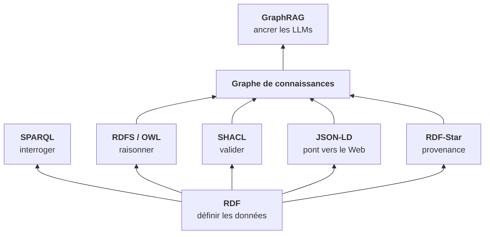
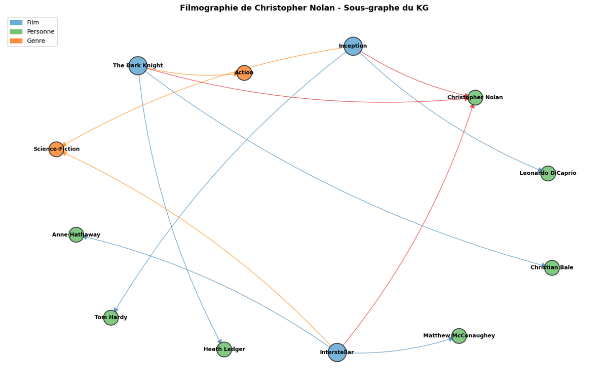
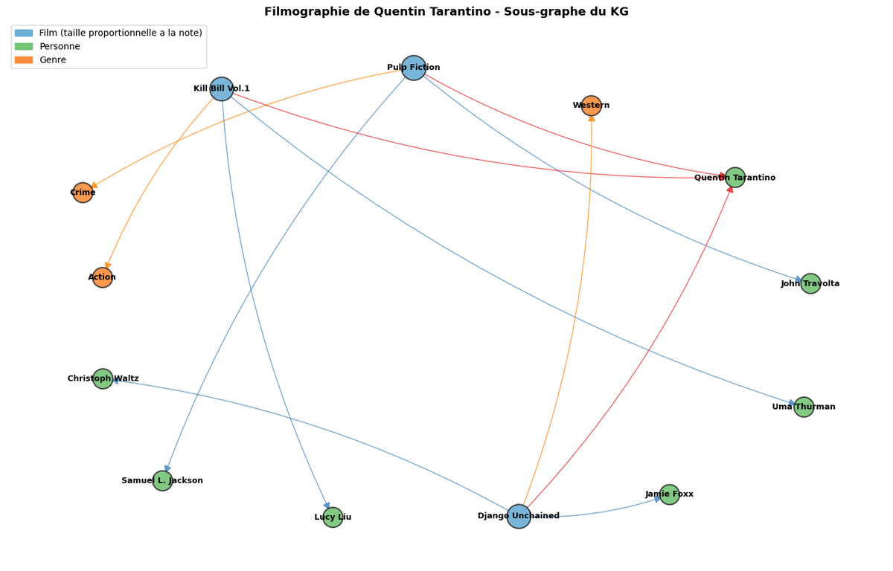
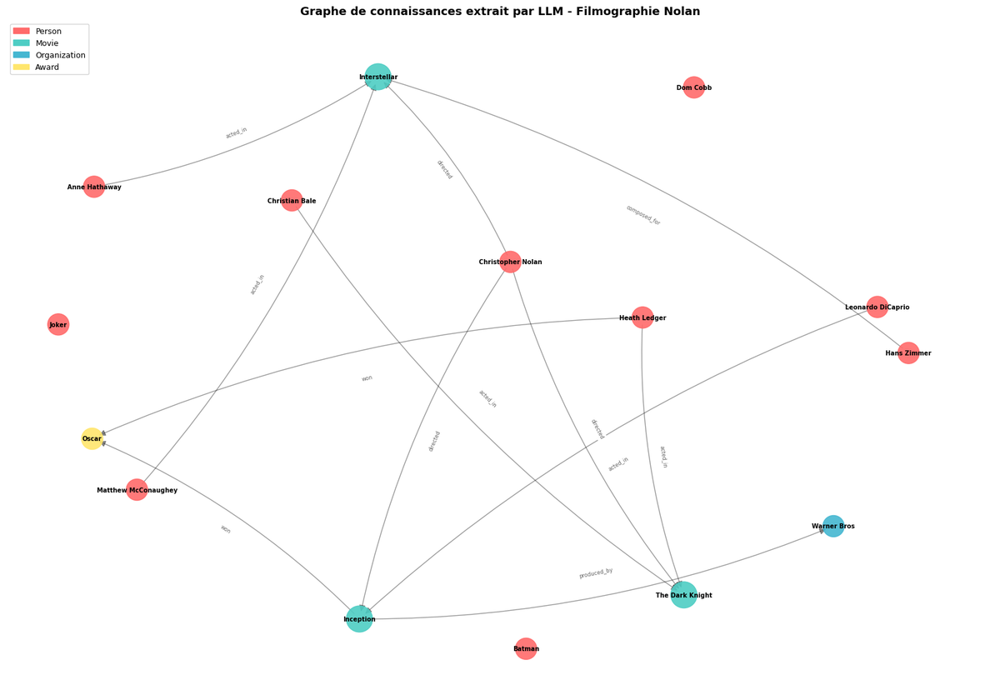
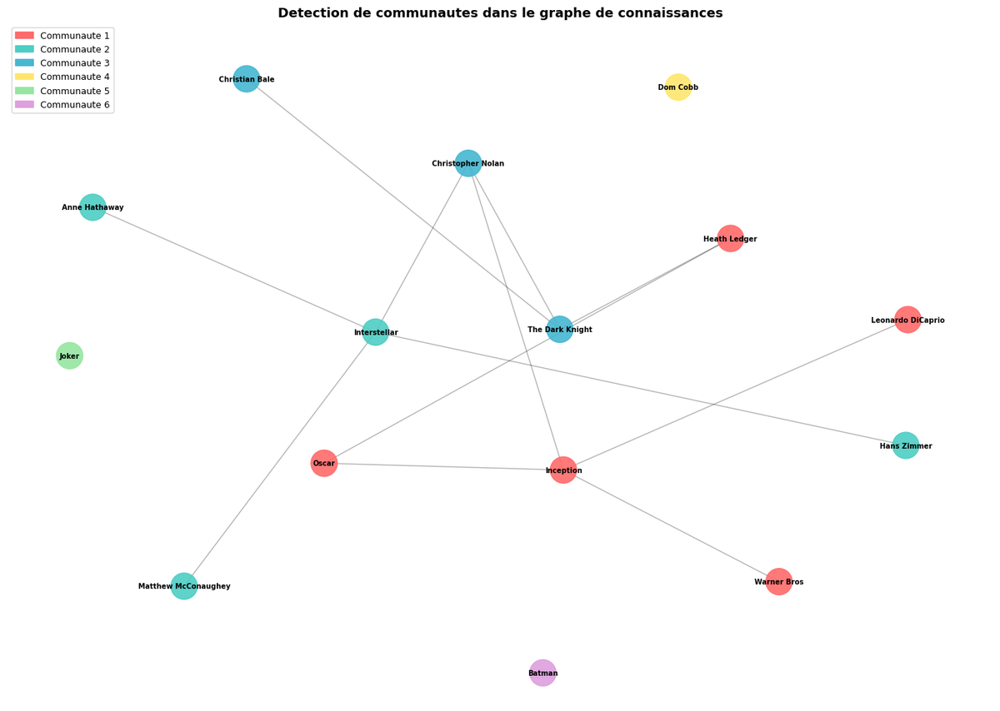
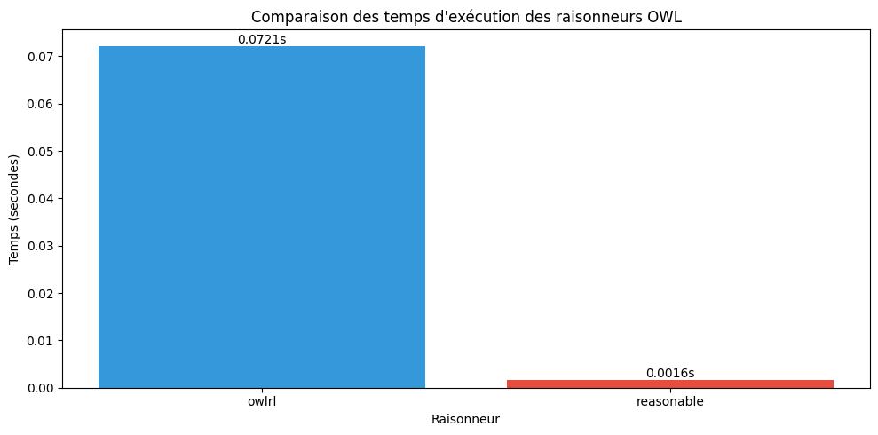
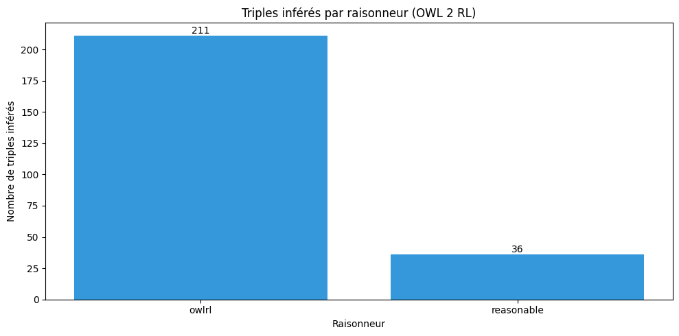

# Web Sémantique - Semantic Web

[← Tweety](../Tweety/README.md) | [↑ SymbolicAI](../README.md) | [Lean →](../Lean/README.md)

<!-- CATALOG-STATUS
series: SymbolicAI-SemanticWeb
pedagogical_count: 25
breakdown: SemanticWeb=25
maturity: PRODUCTION=23, BETA=2
-->

Le Web Sémantique est la promesse d'un Web où les machines comprennent la signification des données, pas seulement leur syntaxe. RDF, SPARQL, OWL, SHACL : ces standards du W3C définissent un langage commun pour décrire, interroger, valider et raisonner sur des graphes de connaissances. Cette série vous mène des fondations (.NET C# avec dotNetRDF) aux applications modernes (Python avec rdflib, pySHACL, GraphRAG), en passant par les ontologies, les données liées et les standards émergents (RDF 1.2, JSON-LD 1.1).

**À qui s'adresse cette série** : développeurs web curieux du sens caché dans leurs données, data scientists voulant structurer leurs pipelines, et étudiants en IA souhaitant comprendre comment les graphes de connaissances ancrent les LLMs. Aucun prérequis en logique formelle. Le décompte exact des notebooks et leur maturité figurent dans le catalogue généré ci-dessous.

## Pourquoi cette série

Le Web Sémantique a traversé des cycles de hype et de désillusion. En 2001, Tim Berners-Lee en faisait la couverture de *Scientific American*. En 2010, les données liées semblaient une niche académique. En 2024, GraphRAG (Microsoft) a montré que les graphes de connaissances RDF pouvaient ancrer les LLMs sur des faits vérifiables : le Web Sémantique devenait un garde-fou pour l'IA générative.

Cette série couvre le spectre complet parce que les briques s'articulent : RDF définit les données, SPARQL les interroge, RDFS/OWL structurent le raisonnement, SHACL valide la qualité, JSON-LD ponte vers le Web, RDF-Star ajoute la provenance, et les KG+LLMs ferment la boucle. Chaque standard est une couche qui s'appuie sur les précédentes :



La série propose délibérément deux stacks en parité (.NET ⇄ Python, marathon #4956) : **.NET C#** avec dotNetRDF (fondations SW-1 à SW-7, standards modernes SW-8/9/10/11/13) et **Python** avec rdflib/pySHACL/owlready2 (miroirs fondations SW-2b à SW-7b, standards modernes SW-8 à SW-13). Les sidetracks Python (SW-2b, 3b, 4b, 5b, 6b, 7b) offrent un miroir des notebooks C# fondations en Python.

## Concepts clés

| Concept | En une phrase | Notebook |
|---------|---------------|----------|
| **Triplet RDF** | Un fait élémentaire : sujet-prédicat-objet (comme une phrase simple) | SW-2 |
| **Graphe RDF** | Un ensemble de triplets formant un réseau sémantique | SW-3 |
| **SPARQL** | Le SQL du Web Sémantique : interroger des graphes avec des patterns | SW-4 |
| **Linked Data** | Des données publiées sur le Web avec des URIs résolvables | SW-5 |
| **RDFS** | Un vocabulaire pour définir des hiérarchies de classes et propriétés | SW-6 |
| **OWL** | Une logique de description pour le raisonnement automatique | SW-7 |
| **SHACL** | Des contraintes de validation sur les graphes (comme des schémas JSON) | SW-8 |
| **JSON-LD** | Du JSON avec un contexte sémantique (le pont Web classique ↔ Web Sémantique) | SW-9 |
| **RDF-Star** | Des métadonnées sur les triplets (provenance, confiance, annotations) | SW-10 |
| **Graphe de connaissances** | Un RDF riche, visualisable, requêtable, ancré dans une ontologie | SW-11 |
| **GraphRAG** | Un KG ancré dans un LLM pour du RAG structuré (anti-hallucination) | SW-12 |

## Vue d'ensemble

| Statistique | Valeur |
|-------------|--------|
| Notebooks .NET C# (dotNetRDF) | 13 (fondations SW-1..7, standards SW-8/9/10/11/13, setup RDF.Net) |
| Notebooks Python (rdflib/pySHACL/owlready2/kglab) | 12 (miroirs SW-2b..7b, standards SW-8..13) |
| Total | 25 notebooks (parité marathon #4956) |
| Durée totale | ~10h (parcours principal), +4h (twins optionnels) |
| Langages | .NET C# + Python |
| Niveau | Débutant à avancé |

> **Nouvelle convention** : Tous les noms de notebooks incluent explicitement le langage (`CSharp` ou `Python`) pour une identification immédiate.

---

## Progression recommandée

### Parcours principal
Suivez les notebooks **SW-1 à SW-13** dans l'ordre numérique pour une progression logique des concepts.

### Sidetracks Python (optionnels)
Les sidetracks marqués `b-Python` sont des notebooks complémentaires qui présentent l'équivalent Python des concepts .NET. Ils sont **optionnels** mais recommandés si vous souhaitez travailler avec Python plutôt qu'avec .NET.

| Sidetrack | Notebook principal | Contenu |
|-----------|-------------------|---------|
| SW-2b-Python-RDFBasics | SW-2-CSharp-RDFBasics | RDF en Python avec rdflib |
| SW-3b-Python-GraphOperations | SW-3-CSharp-GraphOperations | Graphes RDF en Python avec rdflib |
| SW-4b-Python-SPARQL | SW-4-CSharp-SPARQL | SPARQL en Python avec rdflib |
| SW-5b-Python-LinkedData | SW-5-CSharp-LinkedData | DBpedia/Wikidata avec SPARQLWrapper |
| SW-6b-Python-RDFS | SW-6-CSharp-RDFS | RDFS en Python avec rdflib/owlready2 |
| SW-7b-Python-OWL | SW-7-CSharp-OWL | Ontologies OWL avec OWLReady2 |

---

## Structure détaillée des notebooks

### Partie 1 : Fondations RDF (.NET C#)

Cette partie pose les fondations du Web Sémantique en utilisant l'écosystème .NET avec la bibliothèque **dotNetRDF**.

| # | Notebook | Durée | Sidetrack Python |
|---|----------|-------|------------------|
| 1 | **SW-1-CSharp-Setup** | 20 min | - |
| 2 | **SW-2-CSharp-RDFBasics** | 45 min | SW-2b-Python-RDFBasics |
| 3 | **SW-3-CSharp-GraphOperations** | 50 min | SW-3b-Python-GraphOperations |
| 4 | **SW-4-CSharp-SPARQL** | 45 min | SW-4b-Python-SPARQL |

#### SW-1-CSharp-Setup : Premier pas dans le Web Sémantique (20 min)

Ce notebook d'introduction vous guide à travers l'installation de dotNetRDF et découvre la vision historique du Web Sémantique. Vous créerez votre premier graphe RDF "Hello World" et comprendrez l'architecture en couches du W3C.

**Points clés appris** :
- La pile technologique W3C : Unicode → URI → RDF → RDFS → OWL → SPARQL
- Installation de dotNetRDF via NuGet dans .NET Interactive
- Création d'un graphe et assertion de triplets (sujet-prédicat-objet)
- Les différents types de nœuds : URI, blank nodes, littéraux

#### SW-2-CSharp-RDFBasics : Triples, Nœuds et Sérialisation (45 min)

Dans ce notebook, vous approfondirez votre compréhension du modèle de données RDF. Vous manipulerez les différents types de nœuds et découvrirez les principaux formats de sérialisation.

**Points clés appris** :
- Structure d'un triplet RDF : sujet (URI/blank), prédicat (URI), objet (URI/blank/literal)
- Littéraux typés (xsd:integer, xsd:dateTime) et avec tags de langue ("Bonjour"@fr)
- Formats de sérialisation : Turtle, N-Triples, RDF/XML
- Création de namespaces pour simplifier l'écriture

> **Sidetrack Python disponible** : [SW-2b-Python-RDFBasics](SW-2b-Python-RDFBasics.ipynb) - Équivalent Python avec rdflib

#### SW-3-CSharp-GraphOperations : Manipulation Avancée de Graphes (50 min)

Ce notebook couvre les opérations quotidiennes sur les graphes RDF : lecture/écriture, fusion, et sélection avancée avec LINQ.

**Points clés appris** :
- Parsers (`TurtleParser`, `NTriplesParser`) et Writers (`CompressingTurtleWriter`, `RdfXmlWriter`)
- Fusion de graphes avec `Merge()` : déduplication automatique, renommage des blank nodes
- Méthodes `GetTriplesWithXxx()` pour la sélection pattern-based
- Utilisation de LINQ pour des requêtes complexes sur les triplets
- Listes RDF : `AssertList()`, `GetListItems()`, `AddToList()`

#### SW-4-CSharp-SPARQL : Le Langage de Requête (45 min)

SPARQL est au RDF ce que SQL est aux bases de données relationnelles. Ce notebook vous apprendra à interroger vos graphes avec le Query Builder de dotNetRDF.

**Points clés appris** :
- SELECT SPARQL : projections, patterns de base
- Filtrage : `FILTER`, comparaisons, regex, tests d'existence
- Jointures implicites et `OPTIONAL` (LEFT JOIN semantics)
- `UNION` pour combiner plusieurs patterns
- `ORDER BY`, `LIMIT`, `OFFSET` pour pagination

> **Sidetrack Python disponible** : [SW-4b-Python-SPARQL](SW-4b-Python-SPARQL.ipynb) - Équivalent Python avec rdflib

---

### Partie 2 : Données Liées et Ontologies (.NET C#)

Cette partie étend vos compétences aux données du Web ouvert et aux ontologies qui permettent le raisonnement automatique.

| # | Notebook | Durée | Sidetrack Python |
|---|----------|-------|------------------|
| 5 | **SW-5-CSharp-LinkedData** | 50 min | SW-5b-Python-LinkedData |
| 6 | **SW-6-CSharp-RDFS** | 40 min | SW-6b-Python-RDFS |
| 7 | **SW-7-CSharp-OWL** | 50 min | SW-7b-Python-OWL |

#### SW-5-CSharp-LinkedData : DBpedia, Wikidata et Requêtes Fédérées (50 min)

Découvrez le Web de données liées en interrogeant des endpoints publics comme DBpedia et Wikidata.

**Points clés appris** :
- Endpoint SPARQL public vs. graphe local
- `SparqlRemoteEndpoint` pour exécuter des requêtes distantes
- Requêtes fédérées avec `SERVICE` : interroger plusieurs endpoints simultanément
- Exploration de DBpedia : sujets, catégories, liens inter-langues
- Wikidata et ses Q-items/P-properties

> **Sidetrack Python disponible** : [SW-5b-Python-LinkedData](SW-5b-Python-LinkedData.ipynb) - DBpedia/Wikidata avec SPARQLWrapper

#### SW-6-CSharp-RDFS : Schema et Inférence (40 min)

RDFS (RDF Schema) est la couche vocabulaire du Web Sémantique. Ce notebook vous montre comment définir des classes, des propriétés et comment l'inférence fonctionne.

**Points clés appris** :
- Vocabulaire RDFS : `rdfs:Class`, `rdfs:subClassOf`, `rdfs:domain`, `rdfs:range`
- Hiérarchies de classes et transitivité de `subClassOf`
- Inférence RDFS : déduction automatique de types et de relations
- `OntologyGraph` de dotNetRDF pour activer l'inférence

#### SW-7-CSharp-OWL : Ontologies et Raisonnement Avancé (50 min)

OWL (Web Ontology Language) étend RDFS avec des constructeurs logiques puissants. Ce notebook présente les profils OWL 2 et le raisonnement.

**Points clés appris** :
- OWL 2 vs. RDFS : expressivité accrue (restrictions, cardinalités, disjonction)
- Profils OWL 2 : EL (grandes ontologies), QL (query rewriting), RL (règles)
- Constructeurs clés : `owl:equivalentClass`, `owl:unionOf`, `owl:intersectionOf`
- Restrictions : `owl:someValuesFrom` (∃), `owl:allValuesFrom` (∀)
- Raisonnement avec `OntologyGraph`

> **Sidetrack Python disponible** : [SW-7b-Python-OWL](SW-7b-Python-OWL.ipynb) - Ontologies OWL avec OWLReady2

---

### Partie 3 : Standards Modernes (Python, avec jumeau C# SW-8)

Cette partie couvre les standards modernes du Web Sémantique. L'écosystème Python (rdflib, pySHACL, owlready2) y domine, complété par un jumeau C# / dotNetRDF pour SHACL (parité .NET ⇄ Python, marathon #4956).

| # | Notebook | Durée | Contenu |
|---|----------|-------|---------|
| 8 | **SW-8-Python-SHACL** | 45 min | Validation de données avec pySHACL |
| 8 (C#) | **SW-8-CSharp-SHACL** | 45 min | Jumeau .NET de SW-8 : validation SHACL avec dotNetRDF (`VDS.RDF.Shacl`) |
| 9 | **SW-9-Python-JSONLD** | 40 min | Données structurées pour le web |
| 10 | **SW-10-Python-RDFStar** | 40 min | RDF 1.2, annotations et provenance |
| 10 (C#) | **SW-10-CSharp-RDFStar** | 40 min | Jumeau .NET de SW-10 : réification + annotations de confiance avec dotNetRDF (`Graph`, `TripleStore`, graphes nommés) |

#### SW-8-Python-SHACL : Validation de Qualité des Données (45 min)

SHACL (Shapes Constraint Language) est le standard W3C pour valider la conformité des données RDF. Ce notebook utilise pySHACL pour définir des shapes et valider des graphes.

**Points clés appris** :
- Concepts SHACL : `NodeShape`, `PropertyShape`, contraintes
- Contraintes communes : `sh:minCount`, `sh:maxCount`, `sh:datatype`, `sh:nodeKind`
- `sh:property` pour valider les propriétés d'un nœud
- `sh:pattern` (regex), `sh:in` (enum), `sh:class` (type checking)
- Validation avec pySHACL : `Validate(graph, data_graph)`

#### SW-9-Python-JSONLD : Données Structurées pour le Web (40 min)

JSON-LD est le pont entre le monde JSON des développeurs web et le Web Sémantique. Ce notebook montre comment utiliser JSON-LD avec Schema.org pour le SEO.

**Points clés appris** :
- Format JSON-LD : `@context`, `@id`, `@type` pour mapper JSON vers RDF
- Intégration Schema.org (vocabulaire Google, Bing, Yahoo)
- Compactage et expansion JSON-LD avec `jsonld` Python
- Rich snippets Google : 73% des résultats utilisent des données structurées
- Cas d'usage : e-commerce (Produit), articles (Article), organisations (Organization)

> **Twin C# disponible** : [SW-9-CSharp-JSONLD](SW-9-CSharp-JSONLD.ipynb) — JSON-LD via dotNetRDF (`JsonLdParser`/`JsonLdWriter`, `TripleStore`). Compagnon cross-langage du notebook Python `rdflib` + `pyld` sur le même standard W3C JSON-LD 1.1 (marathon parité .NET ⇄ Python #4956, Prong B).

#### SW-10-Python-RDFStar : Annotations et Provenance (40 min)

RDF-Star (RDF 1.2) permet d'exprimer des statements à propos de statements, essentiel pour les annotations, la provenance et la confiance.

**Points clés appris** :
- Quoted triples : `<<<:s :p :o>>> :confidence 0.9`
- Use cases : annotations, provenance, confiance, probabilités
- Syntaxe Turtle-Star et N-Triples-Star
- SPARQL-Star : requêtes sur les quoted triples
- rdflib support expérimental RDF-Star

> **Twin C# disponible** : [SW-10-CSharp-RDFStar](SW-10-CSharp-RDFStar.ipynb) — réification classique (4 triplets `rdf:Statement` par fait annoté), annotations de confiance/source et graphes nommés via dotNetRDF (`Graph(IRefNode)`, `TripleStore`, `SparqlQueryParser`). Compagnon cross-langage du notebook Python `rdflib` sur la même thématique RDF-Star/provenance (marathon parité .NET ⇄ Python #4956, Prong B).

---

### Partie 4 : Graphes de Connaissances et IA (Python)

Cette partie connecte le Web Sémantique avec l'IA moderne, notamment les LLMs et les graphes de connaissances.

| # | Notebook | Durée | Contenu |
|---|----------|-------|---------|
| 11 | **SW-11-Python-KnowledgeGraphs** | 55 min | Construction et visualisation de KGs |
| 11 (C#) | **SW-11-CSharp-KnowledgeGraphs** | 45 min | Jumeau .NET : construction KG (dotNetRDF), SPARQL, adjacence/BFS, qualité, centralité |
| 12 | **SW-12-Python-GraphRAG** | 50 min | KG + LLMs pour le RAG |
| **Bonus** | **SW-13-Python-Reasoners** | 45 min | Comparaison raisonneurs OWL |
| 13 (C#) | **SW-13-Reasoners-CSharp** | 40 min | Jumeau .NET : raisonnement RDFS forward-chaining avec dotNetRDF (`StaticRdfsReasoner`) |

#### SW-11-Python-KnowledgeGraphs : Construction et Visualisation (55 min)

Ce notebook pratique vous guide dans la construction d'un graphe de connaissances complet, depuis des données brutes jusqu'à la visualisation interactive.

**Points clés appris** :
- kglab : abstraction haut niveau pour les KGs (Pandas + NetworkX + rdflib)
- Import depuis CSV/JSON vers RDF
- OWLReady2 : manipulation d'ontologies Python, raisonnement HermiT
- Visualisation avec NetworkX et pyvis : graphes interactifs HTML
- Patterns de modélisation : entités, relations, attributs

> **Twin C# disponible** : [SW-11-CSharp-KnowledgeGraphs](SW-11-CSharp-KnowledgeGraphs.ipynb) — construction d'un Knowledge Graph avec dotNetRDF (`Graph`, `Assert`, TurtleFormatter), requêtage SPARQL (`ExecuteQuery` : SELECT, agrégats, GROUP_CONCAT), adjacence from-scratch + BFS, métriques de qualité (orphelins, complétude, cohérence range), centralité de degré. Compagnon cross-langage du notebook Python (rdflib + networkx + kglab) sur la même thématique KG (marathon parité .NET ⇄ Python #4956, Prong B). Verdict SOTA honnête : le cœur (construction RDF, SPARQL, parcours graphe, qualité, centralité) est SOTA-OK (vrai moteur dotNetRDF, adjacence/BFS réimplémentée) ; pyvis (interactif web) et kglab (surcouche Python) sont INTRINSIC ; HermiT (OWL 2 DL complet, Java) est RECOVERABLE-MACHINE — documenté in-notebook.

**Figures — sous-graphes RDF interrogés en SPARQL.** `SW-11-Python-KnowledgeGraphs.ipynb`
construit un graphe RDF (vocabulaire `schema.org`), l'interroge en SPARQL (`UNION` sur `actor` /
`genre` / `director`) et visualise le sous-graphe filtré par réalisateur — la brique élémentaire
d'un KG opérationnel :



*SW-11 : sous-graphe orienté filtré par SPARQL sur les films de **Christopher Nolan** (cellule 46) — noeuds colorés par type (Film / Personne / Genre), arêtes orientées étiquetées par relation (`director`, `actor`, `genre`).*



*SW-11 (Exercice 2, cellule 71) : même requête SPARQL ré-aimée sur les films de **Quentin Tarantino** — la taille des noeuds-films est **proportionnelle à la note** (`aggregateRating`), illustrant un enrichissement du graphe de base.*

#### SW-12-Python-GraphRAG : KG + LLMs pour le RAG (50 min)

GraphRAG combine les graphes de connaissances avec les LLMs pour un Retrieval-Augmented Generation structuré. Ce notebook présente l'approche de Microsoft GraphRAG.

**Points clés appris** :
- RAP (Retrieval-Augmented Generation) : limiter les hallucinations LLM
- GraphRAG Microsoft : extraction d'entités, construction de communautés
- LeMay-Huan framework : KG + LLM pour question answering
- Implémentation avec OpenAI/Anthropic APIs
- Comparaison RAP vectoriel vs. RAP structuré (GraphRAG)

**Figures — pipeline GraphRAG en action.** `SW-12-Python-GraphRAG.ipynb` implémente le pipeline
Microsoft GraphRAG : extraction LLM des entités et relations d'un corpus, construction du graphe
de connaissances, puis détection de communautés par modularité pour la synthèse multi-niveau.
C'est l'anti-hallucination par excellence : un LLM ancré sur des faits RDF vérifiables :



*SW-12 (cellule 18) : **graphe orienté des entités extraites par LLM** (filmographie Nolan) — noeuds colorés par type d'entité (Person / Movie / Organization / Award / Genre / Concept), arêtes orientées étiquetées par la relation extraite.*



*SW-12 (cellule 30) : **détection de communautés par modularité gloutonne** (`networkx.algorithms.community.greedy_modularity_communities` sur le graphe non-dirigé) — chaque couleur = une communauté, partition des entités pour la synthèse multi-niveau.*

#### SW-13-Python-Reasoners (Bonus) : Benchmarks et Performances (45 min)

Ce notebook bonus compare différents raisonneurs OWL (owlrl, HermiT, reasonable, Growl) sur des critères de performance et de facilité d'intégration.

**Points clés appris** :
- owlrl : Python pur, OWL 2 RL, facile à installer
- OWLReady2 + HermiT : Java bridge, OWL 2 DL complet
- reasonable : Rust + Python bindings, OWL 2 RL, performance native
- Growl : C (vérifié Z3), OWL 2 RL, installation manuelle
- Benchmark temps d'exécution : Python vs. compilé

> **Twin C# disponible** : [SW-13-Reasoners-CSharp](SW-13-Reasoners-CSharp.ipynb) — raisonnement RDFS forward-chaining avec dotNetRDF (`StaticRdfsReasoner.Apply`, `SimpleN3RulesReasoner`), materialisation des inferences (sous-classes, domain/range) et benchmark sur ontologie croissante. Compagnon cross-langage du notebook Python (owlrl/HermiT/reasonable) sur la même thématique d'inférence (marathon parité .NET ⇄ Python #4956, Prong B). Verdict SOTA honnête : la couche RDFS est SOTA-OK (vrai moteur .NET) ; OWL 2 DL complet (HermiT/Pellet, Java) est RECOVERABLE-MACHINE — documenté in-notebook.

**Figures — benchmarks quantitatifs des raisonneurs OWL.** `SW-13-Python-Reasoners.ipynb` compare
plusieurs raisonneurs OWL sur un même graphe via `owlrl`. Les figures ne montrent pas le graphe
inféré lui-même mais des **benchmarks quantitatifs** de l'inférence — le coût et le rendement de la
couche logique qui transforme un graphe déclaratif en connaissances déductibles :



*SW-13 (cellule 49) : **diagramme en barres des temps d'exécution** des raisonneurs OWL (Y = secondes, un raisonneur par barre) — benchmark comparatif du coût de calcul de l'inférence.*



*SW-13 (cellule 52) : **diagramme en barres du nombre de triples inférés** par raisonneur (Y = nombre de triples, profil OWL 2 RL) — comparaison du rendement de l'inférence entre raisonneurs, pas une matérialisation des triples eux-mêmes.*

> **Convention d'accessibilité** : Toutes les figures portent un `alt-text` français (régénérés via `extract_readme_figures.py`, EPIC #5654). Poids total ≈ 626 KB (≤ 1.5 MB borne), max-dim 1200 px (≤ 1200 px borne), max fichier 163 KB (≤ 200 KB borne).

---

## Acquis d'apprentissage

À l'issue de cette série, l'apprenant est capable de :

**Techniques**

1. **Modéliser un domaine en RDF** (triplets, IRIs, littéraux typés, namespaces) et manipuler des graphes en C# avec dotNetRDF (`SW-2-CSharp-RDFBasics.ipynb`, `SW-3-CSharp-GraphOperations.ipynb`) ou en Python avec rdflib (`SW-2b-Python-RDFBasics.ipynb`).
2. **Interroger un graphe en SPARQL 1.1** (SELECT, CONSTRUCT, ASK, DESCRIBE, federations via SERVICE) côté .NET (`SW-4-CSharp-SPARQL.ipynb`) et Python (`SW-4b-Python-SPARQL.ipynb`), puis publier des données Linked Data résolvables (`SW-5-CSharp-LinkedData.ipynb`, `SW-5b-Python-LinkedData.ipynb`).
3. **Formaliser une ontologie en RDFS puis OWL** (classes, propriétés, restrictions, hiérarchies) et tirer parti d'un raisonneur pour matérialiser les inférences (`SW-6-CSharp-RDFS.ipynb`, `SW-7-CSharp-OWL.ipynb`, `SW-7b-Python-OWL.ipynb`, `SW-13-Python-Reasoners.ipynb`).
4. **Valider la conformité d'un graphe** avec SHACL (NodeShapes/PropertyShapes, contraintes de cardinalité et de type, rapport de validation) via pySHACL (`SW-8-Python-SHACL.ipynb`).
5. **Sérialiser et échanger des données RDF en JSON-LD** (`@context`, framing, compaction/expansion) pour interopérer avec les APIs Web modernes (`SW-9-Python-JSONLD.ipynb`).
6. **Annoter des assertions avec RDF-Star / SPARQL-Star** (citations de triplets, provenance, niveau de confiance) pour modéliser métadonnées et réification compacte (`SW-10-Python-RDFStar.ipynb`).

**Applicatives**

7. **Construire et exploiter un graphe de connaissances intégré à un LLM** (extraction de triplets, embeddings, GraphRAG) pour ancrer les réponses génératives sur des données structurées (`SW-11-Python-KnowledgeGraphs.ipynb`, `SW-12-Python-GraphRAG.ipynb`).

---

## Parcours alternatifs

### Parcours Python-only (~5h)

Si vous n'avez pas d'environnement .NET, vous pouvez suivre uniquement les notebooks Python :

1. **SW-2b** (RDF Basics Python) → **SW-3b** (Graph Ops Python) → **SW-4b** (SPARQL Python) → **SW-5b** (Linked Data Python) → **SW-6b** (RDFS Python) → **SW-7b** (OWL Python) : les 6 sidetracks couvrent les fondamentaux avec rdflib/owlready2.
2. Puis **SW-8** (SHACL) → **SW-9** (JSON-LD) → **SW-10** (RDF-Star) → **SW-11** (KG) → **SW-12** (GraphRAG) : les standards modernes et l'IA.

### Parcours data engineer (~3h)

Pour les praticiens qui veulent aller vite :

1. **SW-2b** (RDF en 5 min) → **SW-4b** (SPARQL) → **SW-8** (SHACL : valider vos données) → **SW-9** (JSON-LD : exposer en API) → **SW-12** (GraphRAG : connecter aux LLMs).

### Parcours ontologue (~4h)

Pour les personnes créant des ontologies et des vocabulaires :

1. **SW-6** (RDFS) → **SW-7** (OWL) → **SW-7b** (OWL Python) → **SW-8** (SHACL : contraintes sur les données) → **SW-13** (comparaison raisonneurs).

## Quick Start

```bash
# Python (notebooks SW-2b a SW-7b, SW-8 a SW-13)
pip install rdflib pySHACL owlready2 kglab SPARQLWrapper

# .NET (notebooks SW-1 a SW-7, jumeaux C# SW-8/9/10/11/13)
dotnet restore

# Premier notebook recommandé (Python) :
jupyter notebook SW-2b-Python-RDFBasics.ipynb

# Ou en .NET :
jupyter notebook SW-1-CSharp-Setup.ipynb
```

Aucune API key requise pour les notebooks fondamentaux (SW-1 à SW-11). SW-12 (GraphRAG) nécessite une clé LLM.

---

## Prérequis

### Pour les notebooks .NET (SW-1 à SW-7)

- .NET SDK 9.0+
- .NET Interactive (Jupyter kernel)
- VS Code avec Polyglot Notebooks (recommandé)

### Pour les notebooks Python (SW-8 à SW-13 et sidetracks)

- Python 3.10+
- pip install -r requirements.txt

### Pour le notebook 12 (GraphRAG)

- Clé API OpenAI ou Anthropic (voir `.env.example`)

## Installation

### 1. Environnement .NET

```bash
dotnet tool install -g Microsoft.dotnet-interactive
dotnet interactive jupyter install
```

### 2. Environnement Python

```bash
python -m venv venv
venv\Scripts\activate  # Windows
pip install -r requirements.txt
```

### 3. Configuration API (optionnel, pour SW-12)

```bash
cp .env.example .env
# Éditer .env avec vos clés API
```

## FAQ / Troubleshooting

| Problème | Solution |
|----------|----------|
| `dotNetRDF` NuGet restore échoue | Vérifier .NET SDK 9.0+ (`dotnet --version`). Relancer la cellule d'import. |
| Endpoint DBpedia/Wikidata timeout | Les endpoints publics ont des limites. Ajouter `LIMIT 100` aux requêtes. Réessayer hors heures de pointe. |
| pySHACL validation vide | Vérifier que les préfixes du graphe de données correspondent aux shapes (même `ex:` namespace). |
| OWLReady2 Java bridge error | Installer JDK 11+ (OWlReady2 utilise HermiT en Java). Sur Windows : `winget install EclipseAdoptium.Temurin.11.JDK`. |
| RDF-Star syntax non reconnue | rdflib 7.x supporte RDF-Star en mode expérimental. Vérifier `rdflib.__version__ >= 7.0`. |
| GraphRAG : `OPENAI_API_KEY` manquant | SW-12 requiert une clé LLM (OpenAI ou Anthropic). Configurer `.env` (voir `.env.example`). Les notebooks SW-1 à SW-11 n'ont pas besoin de clé. |

## Lecture transversale

La série SemanticWeb illustre un mouvement profond du dépôt CoursIA : **prendre des données non-structurées et les re-représenter dans un cadre vérifiable**. RDF donne un sens formel à du JSON, OWL ajoute le raisonnement, SHACL ajoute la validation, GraphRAG ancre les LLMs sur des faits. Ce geste — trouver la représentation où le problème se dissout — traverse toutes les séries du dépôt, des CSP (Search) aux preuves Lean (SymbolicAI). La clé de lecture [La mer qui monte](../../../docs/grothendieckian-lens.md) développe ce fil conducteur.

---

## Technologies et versions

| Technologie | Version | Notebooks | Rôle |
|-------------|---------|-----------|------|
| dotNetRDF | 3.4.1 | SW-1 à SW-7 | Core RDF/SPARQL en .NET |
| rdflib | 7.5.0 | Sidetracks, SW-8 à SW-13 | Core RDF/SPARQL en Python |
| pySHACL | 0.27.0 | SW-8 | Validation SHACL |
| OWLReady2 | 0.50+ | SW-7b, SW-11 | Manipulation ontologies |
| SPARQLWrapper | 2.0+ | SW-5b | Requêtes endpoints distants |
| kglab | 0.6.1+ | SW-11 | Abstraction graphes de connaissances |
| owlrl | 6.0+ | SW-13 | Raisonneur OWL 2 RL Python pur |
| reasonable | 0.1+ | SW-13 | Raisonneur OWL 2 RL Rust |

## Standards W3C couverts

| Standard | Version | Notebook |
|----------|---------|----------|
| RDF | 1.1 / 1.2 | SW-2, SW-10 |
| SPARQL | 1.1 | SW-4, SW-5 |
| RDFS | 1.0 | SW-6 |
| OWL | 2 | SW-7, SW-13 |
| SHACL | 1.0 | SW-8 |
| JSON-LD | 1.1 | SW-9 |

## Structure des fichiers

```
SemanticWeb/
├── README.md
├── requirements.txt
├── .env.example
├── data/
│   ├── Example.ttl          # Exemple Turtle
│   ├── animals.ttl          # Hiérarchie RDFS
│   ├── university.owl       # Ontologie OWL 2
│   ├── person-shape.ttl     # Shapes SHACL
│   ├── person-data.ttl      # Données test (avec erreurs)
│   ├── movies.csv           # Dataset pour KG
│   ├── temp_company.ttl     # Données Turtle entreprise (SW-7b)
│   ├── temp_company.owl     # Ontologie OWL entreprise (SW-7b)
│   ├── pizza_test.owl       # Ontologie test reasoners (SW-13)
│   ├── product.jsonld       # Exemple JSON-LD (SW-9)
│   ├── example.srj          # Résultats SPARQL JSON (SW-5)
│   └── example.srx          # Résultats SPARQL XML (SW-5)
├── SW-1-CSharp-Setup.ipynb
├── SW-2-CSharp-RDFBasics.ipynb
├── SW-2b-Python-RDFBasics.ipynb     # Sidetrack
├── SW-3-CSharp-GraphOperations.ipynb
├── SW-3b-Python-GraphOperations.ipynb   # Sidetrack
├── SW-4-CSharp-SPARQL.ipynb
├── SW-4b-Python-SPARQL.ipynb        # Sidetrack
├── SW-5-CSharp-LinkedData.ipynb
├── SW-5b-Python-LinkedData.ipynb    # Sidetrack
├── SW-6-CSharp-RDFS.ipynb
├── SW-6b-Python-RDFS.ipynb           # Sidetrack
├── SW-7-CSharp-OWL.ipynb
├── SW-7b-Python-OWL.ipynb           # Sidetrack
├── SW-8-CSharp-SHACL.ipynb           # Jumeau .NET de SW-8 (dotNetRDF.SHACL, marathon #4956)
├── SW-8-Python-SHACL.ipynb
├── SW-9-Python-JSONLD.ipynb
├── SW-9-CSharp-JSONLD.ipynb         # Twin C# (marathon #4956 Prong B)
├── SW-10-Python-RDFStar.ipynb
├── SW-10-CSharp-RDFStar.ipynb       # Twin C# (marathon #4956 Prong B)
├── SW-11-Python-KnowledgeGraphs.ipynb
├── SW-12-Python-GraphRAG.ipynb
├── SW-13-Python-Reasoners.ipynb     # Bonus
├── SW-13-Reasoners-CSharp.ipynb     # Twin C# (marathon #4956 Prong B)
├── movie_kg_interactive.html        # Livrable interactif SW-11 (pyvis)
└── RDF.Net-Legacy/                  # Archive C# RDF.NET (pré-migration Python)
    ├── RDF.Net.ipynb                # Notebook .NET historique
    ├── Example.ttl                  # Données Turtle
    ├── example.srj                  # Résultats SPARQL JSON
    └── example.srx                  # Résultats SPARQL XML
```

> **Note** — `RDF.Net-Legacy/` conserve l'ancien notebook C# (kernel .NET Interactive)
> avant la bascule pédagogique vers Python (`SW-2b-Python-RDFBasics.ipynb` et suivants).
> Archive de référence, non maintenue. Pour le RDF actuel, voir SW-2 / SW-2b.

## Ressources

### Références académiques

| Référence | Couverture |
|-----------|------------|
| Berners-Lee, Hendler & Lassila, "The Semantic Web", *Scientific American* (2001) | Vision originale, introduction |
| Russell & Norvig, *AIMA* 4e ed., ch. 12 "Knowledge Representation" | Cadre général IA symbolique |
| Hitzler et al., *Foundations of Semantic Web Technologies* (2010) | OWL, RDF, raisonnement |
| Allemang & Hendler, *Semantic Web for the Working Ontologist* (2011) | Modélisation OWL/RDFS |
| Harris & Seaborne, "SPARQL 1.1 Query Language", W3C Rec. (2013) | Standard SPARQL |
| Cyganiak, Wood & Lanthaler, "RDF 1.1 Concepts", W3C Rec. (2014) | Standard RDF |
| Knublauch et al., "SHACL Shapes Constraint Language", W3C Rec. (2017) | Standard SHACL |
| Edge & Tramer, "GraphRAG" (Microsoft, 2024) | SW-12 GraphRAG |

### Ressources en ligne

- [dotNetRDF](https://dotnetrdf.org/) - Bibliothèque .NET pour RDF
- [rdflib](https://rdflib.readthedocs.io/) - Bibliothèque Python pour RDF
- [W3C RDF](https://www.w3.org/RDF/) - Standard RDF
- [W3C SPARQL](https://www.w3.org/TR/sparql11-overview/) - Standard SPARQL
- [W3C OWL](https://www.w3.org/OWL/) - Standard OWL
- [W3C SHACL](https://www.w3.org/TR/shacl/) - Standard SHACL
- [JSON-LD](https://json-ld.org/) - JSON pour les données liées
- [DBpedia](https://dbpedia.org/) - Données structurées de Wikipedia
- [Wikidata](https://www.wikidata.org/) - Base de connaissances libre

## Connections cross-séries

### SemanticWeb et Planners (Planification Automatique)

Les graphes de connaissances RDF/OWL (SW-1 à SW-6) fournissent des représentations riches du monde que les planificateurs PDDL (Planners-2 à Planners-9) peuvent exploiter :

- **Ontologies OWL (SW-7) et domaines PDDL (Planners-6)** : les ontologies définissent les types et relations du domaine ; les fichiers PDDL définissent les actions et contraintes. Les deux formalisent la sémantique d'un domaine pour le raisonnement automatique.
- **SPARQL (SW-4) + planification** : les requêtes SPARQL sur un graphe de connaissances peuvent générer les états initiaux et buts d'un problème de planification.
- **GraphRAG (SW-12) + LLM Planning (Planners-10)** : le RAG basé sur les graphes de connaissances améliore la génération de plans par les LLMs en fournissant un contexte structuré.

### SemanticWeb et Tweety (Logique et Argumentation)

Les logiques de description (OWL) et les logiques classiques (Tweety) partagent des fondements communs :

- **OWL-DL (SW-7) et logique propositionnelle/FOL (Tweety-2/3)** : OWL-DL est une logique de description décidable, fragment de la logique du premier ordre. Les SAT solvers de Tweety complètent les raisonneurs OWL (HermiT, Pellet).
- **SHACL (SW-8) et validation** : les contraintes SHACL sur les graphes RDF sont analogues aux contraintes logiques de Tweety. Les deux approches valident la cohérence de bases de connaissances.
- **Raisonnement monotone (OWL) vs non-monotone (Tweety-6/7)** : les ontologies OWL font du raisonnement monotone (ajout de faits ne rétracte rien) ; Tweety explore le raisonnement non-monotone (defeasible, priorité).

### SemanticWeb et Lean (Vérification Formelle)

La vérification de cohérence des ontologies OWL est une forme de vérification formelle :

- **OWL consistency checking** : les raisonneurs OWL prouvent la cohérence d'une ontologie, similaire aux preuves Lean de correction de programmes.
- **SHACL shapes** : les shapes SHACL sont des invariants sur les données RDF, analogues aux types dépendants Lean comme spécifications.

### SemanticWeb et SmartContracts

Les smart contracts et le web sémantique convergent dans les données décentralisées :

- **Graphes de connaissances on-chain** : les NFTs ERC-721 (SC-7) avec métadonnées JSON-LD (SW-9) créent des graphes de connaissances décentralisés. Les DID (Decentralized Identifiers) utilisent RDF pour l'identité auto-souveraine.
- **Oracle data integration** : les oracles blockchain (SC-8 DeFi) peuvent servir de sources RDF pour enrichir les graphes de connaissances en temps réel.

---

## Conclusion / Prochaines étapes

### Ce que vous avez appris

Le fil de cette série épouse celui du Web Sémantique lui-même : **donner du sens formel à des données**, couche par couche.

- **Modéliser** (Parties 1-2, .NET C#) : un domaine se découpe en triplets RDF, s'interroge en SPARQL, se structure en hiérarchies RDFS puis en ontologies OWL où le raisonneur déduit ce que vous n'avez pas écrit explicitement.
- **Valider et échanger** (Partie 3, Python) : SHACL garantit la conformité d'un graphe, JSON-LD ponte vers le Web des APIs, RDF-Star ajoute la *provenance* — car un fait sans source n'est qu'une assertion.
- **Fermer la boucle avec l'IA** (Partie 4) : un graphe de connaissances ancre les LLMs sur des faits vérifiables. C'est le point d'aboutissement — GraphRAG (SW-12) transforme le Web Sémantique de niche académique en garde-fou contre les hallucinations génératives.

### Prochaines étapes

- **Poussez l'ontologie plus loin** : SW-7 (OWL) et le bonus [SW-13-Python-Reasoners](SW-13-Python-Reasoners.ipynb) ouvrent la comparaison des raisonneurs (HermiT, owlrl, reasonable). C'est le pont naturel vers **[Tweety](../Tweety/)** — où les logiques de description (décidables, monotones) rencontrent la logique classique, le SAT solving et le raisonnement non-monotone.
- **Branchez la planification** : un graphe de connaissances est une représentation du monde que les planificateurs peuvent exploiter. La série **[Planners](../Planners/)** (PDDL, GraphPlan, LLM planning) consomme exactement ce genre d'états initiaux et de buts que SPARQL peut extraire d'un graphe.
- **Certifiez** : les shapes SHACL sont des invariants sur les données, analogues aux spécifications formelles. La série **[Lean](../Lean/)** pousse cette idée à son terme — prouver la correction d'un programme, pas seulement valider ses données.
- **Allez on-chain** : les NFTs ERC-721 à métadonnées JSON-LD (SW-9) forment des graphes décentralisés. La série **[SmartContracts](../SmartContracts/)** (SC-7 Token Standards) est le terrain où RDF, identité auto-souveraine (DID) et blockchains convergent.
- **Relisez la série sous l'angle de la représentation** : la [Lecture transversale](#lecture-transversale) ci-dessus relie ce geste — *trouver la représentation où le problème se dissolve* — à tout le dépôt CoursIA.

### Le fil rouge

Le titre de Berners-Lee en 2001 promettait un Web compris par les machines. Vingt ans plus tard, ce n'est plus une promesse : c'est une *technique*, du triplet RDF au GraphRAG. Les standards changent (RDF 1.2, JSON-LD 1.1), les outils changent (dotNetRDF, rdflib, kglab), mais le geste reste — **structurer, interroger, valider, raisonner**. C'est ce triptyque que vous emportez au-delà de cette série.

---

*Version 1.2.0 — Juillet 2026 — section Statistiques catalogue à jour + section Écosystème MCP et parenté cross-lane. EPIC #3975 tranche semanticweb.*

## Statistiques catalogue à jour

Chiffres lus directement depuis le marqueur `CATALOG-STATUS` byte-identique (l. 5-10) — partition cohérente avec `MyIA.AI.Notebooks/SymbolicAI/README.md` (EPIC #3975).

| Sous-catégorie | Notebooks | Statut | Paradigmes / stacks dominants |
|----------------|-----------|--------|-------------------------------|
| Fondations RDF/OWL — .NET C# (dotNetRDF, SW-1 à SW-7) | 7 | PRODUCTION=7 | Triplet RDF, graphe nommé, SPARQL, RDFS, OWL (HermiT), raisonneur DL |
| Fondations RDF/OWL — miroirs Python (SW-2b à SW-7b, rdflib/owlready2) | 6 | PRODUCTION=6 | Équivalent Python des notebooks .NET fondations — rdflib + owlready2 |
| Standards modernes — .NET C# (SW-8 SHACL, SW-9 JSON-LD, SW-10 RDF-Star, SW-11 KG, SW-13 Reasoners) | 5 | PRODUCTION=5 | SHACL, JSON-LD 1.1, RDF-Star, KG, raisonneurs (dotNetRDF) |
| Standards modernes — Python (SW-8 à SW-13 : SHACL, JSON-LD, RDF-Star, KG, GraphRAG, Reasoners) | 6 | PRODUCTION=6 | SHACL pySHACL, JSON-LD 1.1, RDF-Star, KG + kglab, GraphRAG (anti-hallucination), comparaisons raisonneurs |
| Setup / legacy .NET (RDF.Net) | 1 | PRODUCTION=1 | Démonstration RDF.Net historique |
| **Total** | **25** | **PRODUCTION=25** | Double stack .NET C# (dotNetRDF) / Python (rdflib, pySHACL, owlready2, kglab) — parité marathon #4956 |

**Conformité C.1 — stubs d'exercice sans erreur volontaire** : les templates `student/` portent les stubs conformes (`pass` / `return None` / `print("Exercice à compléter")` / `result = None  # TODO étudiant`) — **jamais** `raise NotImplementedError`, `assert False` ou `1/0`. Dépendances Python : `rdflib`, `pySHACL`, `owlready2`, `kglib`, `SPARQLWrapper` (cf `requirements.txt` racine). Dépendances .NET : `dotNetRDF` + .NET 9.0 + .NET Interactive. La double stack .NET/Python reflète le mandat EPIC #3975 : un même raisonnement rendu par deux runtimes (ici, dotNetRDF côté C# typé, rdflib côté Python expressif), la parité devenant un objet d'étude en soi.

## Écosystème MCP et parenté cross-lane

Trois outils d'infrastructure MCP soutiennent l'exécution, la validation et le partage des notebooks de cette série :

1. **MCP Jupyter** (`mcp__jupyter-papermill__*`) — exécution programmée des notebooks Python (SW-8 à SW-13, sidetracks `b`). Note bug connu #5211 : `kernel_name` est ignoré en mode async ; pour une ré-exécution robuste utiliser `nbconvert --execute --ExecutePreprocessor.kernel_name=python3 --timeout=600`.
2. **Validation pre-commit** (`.pre-commit-config.yaml`) — gitleaks (anti-secrets inline `os.getenv("KEY", "<literal-fallback>")`) + notebook validator C.1/C.2 (pas de `raise NotImplementedError`, cellules code = `execution_count` + `outputs` cohérents) bloquent les PRs qui dégraderaient les contrats inter-séries.
3. **MCP QC Cloud** (`mcp__qc-mcp-lite__*`) — backtest QuantConnect partagé. La série GraphRAG (SW-12) partage avec QuantConnect le même besoin de traçabilité : un graphe de connaissances ancré sur des faits financiers vérifiables, un notebook QC ancré sur des ticks auditable.

La série SemanticWeb est le **carrefour données structurées** du dépôt — chaque sous-série partenaire y trouve un point d'entrée formel vers la représentation des connaissances et le raisonnement_symbolique.

| Cette sous-série | Symétrie dans | Pont pédagogique |
|------------------|----------------|-------------------|
| SW-7 (OWL / logique de description) | [Tweety](../Tweety/) (Tweety-3 DL) | DL = moteur de raisonnement OWL ; même formalisme, deux écosystèmes (HermiT côté Java, dotNetRDF côté .NET) |
| SW-11 (Graphe de connaissances) | [Planners](../Planners/) (PDDL) | Un KG décrit le monde que les planificateurs peuvent exploiter — SPARQL ↔ PDDL extraction |
| SW-12 (GraphRAG anti-hallucination) | [Argument_Analysis](../Argument_Analysis/) (Semantic Kernel memory backend) | Même besoin : ancrer un LLM sur des faits vérifiables via un KG RDF |
| SW-8 (SHACL validation) | [Lean](../Lean/) (mathlib4) | Les shapes SHACL sont des invariants sur les données ; Lean pousse cette idée à son terme — prouver la correction d'un programme |
| SW-9 (JSON-LD NFTs ERC-721) | [SmartContracts](../SmartContracts/) (SC-7 Token Standards) | Identité auto-souveraine (DID), blockchains et RDF — graphe décentralisé |
| SW-12 (GraphRAG garde-fou LLM) | [GenAI](../../GenAI/) (Qwen 2.5-VL, ComfyUI) | GraphRAG = anti-hallucination par KG ; GenAI = génération visuelle/texte — la fiabilité passe par les graphes de connaissances |

**Effet de composition** : SemanticWeb est l'**assise du Web et de l'IA fiable** dans le dépôt. Le pipeline complet relie les **notebooks** (.NET C# typés pour les fondations RDF/OWL, Python expressifs pour SHACL/JSON-LD/RDF-Star/GraphRAG) aux **standards W3C** (RDF, SPARQL, OWL, SHACL, JSON-LD, RDF-Star) et aux **lakes** (Lean 4 formalise les invariants SHACL, Argument_Analysis orchestre un KG via Semantic Kernel, SmartContracts marient RDF+DID+blockchain). Là où Tweety est le carrefour **logique**, où GameTheory est le carrefour **simulation/proof**, où CaseStudies est le carrefour **intégration**, SemanticWeb est le carrefour **données structurées — du triplet RDF au GraphRAG anti-hallucination**.

## Licence

Voir la licence du repository principal.
