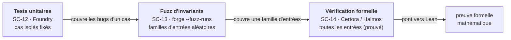

# 03-Foundry-Testing - Tests, Fuzzing et Verification Formelle

**Navigation** : [Sommaire de la serie](../README.md) | [<< SC-11 LLM-Assisted](../02-Solidity-Advanced/SC-11-LLM-Assisted.ipynb) | [SC-15 Zero-Knowledge Proofs >>](../04-Privacy-Cryptography/SC-15-Zero-Knowledge-Proofs.ipynb)

Cette troisieme sous-serie (SC-12 a SC-14) introduit le **testing rigoureux** des smart contracts : la suite d'outils Foundry (forge, cast, anvil), le fuzz testing d'invariants, puis la verification formelle avec Certora Prover et le langage CVL. C'est le passage du « code qui semble marcher » au « code dont on prouve les proprietes ». Ces notebooks ont une signature pedagogique particuliere : le code Solidity y est presente comme chaines de caracteres avec les sorties de tests correspondantes ([PASS]/[FAIL]) documentees comme illustration. Une installation locale de Foundry et Certora permet de reproduire les tests pour de vrai.

---

## Notebooks

| # | Notebook | Duree | Contenu |
|---|----------|-------|---------|
| 12 | [SC-12-Foundry-Testing](SC-12-Foundry-Testing.ipynb) | 45 min | Installation Foundry, structure de projet, tests Solidity (DSTest), cheatcodes, assertions |
| 13 | [SC-13-Fuzz-Invariants](SC-13-Fuzz-Invariants.ipynb) | 40 min | Fuzz testing, parametres aleatoires, invariants de contrats, `vm.assume` |
| 14 | [SC-14-Formal-Verification](SC-14-Formal-Verification.ipynb) | 50 min | Verification formelle, Certora Prover, CVL, specifications, regles |

**Total** : 3 notebooks, ~2h15.

Cette sous-série est une **escalade de l'assurance** : chaque étape couvre une classe de bugs plus large que la précédente — du « ça marche sur mes exemples » au « propriété garantie quelles que soient les entrées ».

---

## Parcours d'apprentissage

### Etape 1 : Suite Foundry (SC-12, 45 min)

Installation et configuration de **Foundry** (forge, cast, anvil), creation d'un projet avec la structure standard, ecriture de tests en Solidity avec DSTest, utilisation des **cheatcodes** (`vm.prank`, `vm.warp`, `vm.expectRevert`) pour simuler des scenarios, et application des assertions avec logging.

### Etape 2 : Fuzz et invariants (SC-13, 40 min)

Le **fuzz testing** : passer des parametres aleatoires aux fonctions de test, tester des **invariants** (proprietes qui doivent toujours tenir, quelles que soient les entrees), et filtrer les entrees invalides avec `vm.assume`. Cette etape change la maniere de penser les tests : on ne verifie plus des cas isolés mais des familles entieres de comportements.

### Etape 3 : Verification formelle (SC-14, 50 min)

La **verification formelle** comme niveau au-dessus du testing : **Certora Prover** et le langage de specification **CVL** (Certora Verification Language), ecriture de **specifications** et de **regles**, verification d'invariants mathematiques. Pont naturel avec la serie Lean (preuve formelle de proprietes).

---

## Prerequis

### Par notebook

| Notebook | Fondations requises | Dependances |
|----------|---------------------|-------------|
| SC-12 Foundry-Testing | SC-3 a SC-6 completes ([01-Solidity-Foundation](../01-Solidity-Foundation/SC-3-Solidity-Basics.ipynb)) ; terminal/bash | Foundry (`forge`, `cast`, `anvil`) |
| SC-13 Fuzz-Invariants | SC-12 complete ; tests unitaires Solidity | Foundry |
| SC-14 Formal-Verification | SC-12 + SC-13 completes ; notions de logique formelle | Foundry ; Certora Prover ou Halmos (recommande) |

### Configuration requise

- **Foundry installe** : `curl -L https://foundry.paradigm.xyz | bash && foundryup`. Les notebooks SC-12/13 invoquent `forge test` / `forge build`.
- **Certora Prover** (SC-14) : compte Certora + acces cloud ; alternative open-source **Halmos** (symbolic execution).
- **Python 3.10+** pour les cellules d'orchestration.
- Aucun faucet, aucun ETH reel necessaire : les tests tournent en local via `anvil` ou en simulation.

---

## Ponts inter-series

| Serie | Lien | Relation |
|-------|------|----------|
| [SmartContracts (parent)](../README.md) | Vue d'ensemble | Contexte, parcours global, glossaire |
| [02-Solidity-Advanced](../02-Solidity-Advanced/SC-7-Token-Standards.ipynb) | Prerequis | SC-7..11 (standards ERC, DeFi, DAO, AA, LLM) |
| [04-Privacy-Cryptography](../04-Privacy-Cryptography/SC-15-Zero-Knowledge-Proofs.ipynb) | Suite | SC-15..17 (ZK proofs, chiffrement homomorphe, vote verifiable) |
| [SymbolicAI/Lean](../../Lean/) | SC-14 (formal verif) | Verification formelle = meme paradigme que la preuve Lean (CVL vs tactiques Lean) |

---

## Points de vigilance (execution Foundry)

- **Foundry doit etre installe localement** pour reproduire les tests pour de vrai (`forge`, `cast`, `anvil` sur le PATH). Les notebooks orchestrent les commandes `forge` depuis des cellules Python.
- **Signature pedagogique** : le code Solidity est presente comme chaines de caracteres avec les sorties de tests ([PASS]/[FAIL]) documentees. Avec une installation Foundry locale, ces tests se reproduisent ; sans elle, les sorties committes servent d'illustration (honetement disclosees dans le notebook).
- **SC-14 Certora** : la verification formelle requiere un acces Certora (commercial) ou Halmos (open-source). Les regles CVL ne sont pas toutes verifiables sans ces outils.
- **Audit #3164** : cette sous-serie a ete auditee (fidélité) — les resultats de tests sont honnetement documentes comme illustration, pas comme execution masquee. 1 finding de labeling (SC-12) resolu via #3369.

---

## Ressources

- **Foundry Book** (Foundry contributors) -- `forge test`, `forge build`, fuzzing, cheatcodes. book.getfoundry.sh.
- **Certora Documentation** (Certora Inc.) -- Certora Prover, langage CVL, ecriture de specifications. docs.certora.com.
- **Halmos** (a16z, 2023) -- symbolic execution open-source pour tests Foundry.
- Wilkinson, M. (2022) -- "Foundry: A Blazing Fast, Portable, and Modular Toolkit for Ethereum Application Development".
- Voir aussi les references transversales dans le [README parent de la serie](../README.md).

---

## Conclusion / Prochaines étapes

### Ce que vous avez appris

Cette troisième sous-série introduit le **testing rigoureux** : le passage du « code qui semble marcher » au « code dont on prouve les propriétés ». L'arc pédagogique est une **escalade de l'assurance** — chaque étape couvre une classe de bugs plus large que la précédente :

- **La suite Foundry** (SC-12) — installation et configuration de `forge`/`cast`/`anvil`, structure de projet, tests en Solidity avec DSTest, **cheatcodes** (`vm.prank`, `vm.warp`, `vm.expectRevert`) pour simuler des scénarios, et assertions avec logging.
- **Le fuzz et les invariants** (SC-13) — passer des paramètres aléatoires aux fonctions de test, vérifier des **invariants** (propriétés qui doivent toujours tenir), filtrer les entrées invalides avec `vm.assume`. Cette étape change la manière de penser les tests : on ne vérifie plus des cas isolés mais des **familles entières** de comportements.
- **La vérification formelle** (SC-14) — le niveau au-dessus du testing : **Certora Prover** et le langage de spécification **CVL**, écriture de spécifications et de règles, vérification d'invariants mathématiques. Pont naturel avec la série [Lean](../../Lean/) (même paradigme de preuve formelle).

Cette sous-série a une signature pédagogique particulière : le code Solidity y est présenté comme chaînes de caractères avec les sorties de tests (`[PASS]`/`[FAIL]`) documentées comme illustration — une installation locale de Foundry et Certora permet de reproduire les tests pour de vrai.

### Prochaines étapes

- **Appliquer la preuve à la confidentialité** : la suite est [04-Privacy-Cryptography](../04-Privacy-Cryptography/README.md) (SC-15 à SC-17), où la rigueur formelle des protocoles cryptographiques (ZKP, chiffrement homomorphe) devient centrale.
- **Approfondir la preuve formelle** : [SymbolicAI/Lean](../../Lean/README.md) développe le même paradigme (spécifier puis prouver) dans un cadre mathématique pur — CVL et Lean sont deux instances du même idéal de vérification.
- **La série dans son ensemble** : le [sommaire SmartContracts](../README.md) cartographie les six sous-séries — celle-ci est le garde-fous qualité.

### Le fil rouge

Le testing des smart contracts propose un changement de regard sur la fiabilité : ne plus demander « est-ce que ça marche sur mes exemples ? » mais **« quelles propriétés sont garanties quelles que soient les entrées ? »**. L'escalade tests unitaires → fuzz → vérification formelle n'est pas un luxe : sur une chaîne où le code est immuable et où une faille coûte des millions, prouver un invariant (qu'il résiste à toute entrée, même aléatoire, même adversariale) est précisément ce qui distingue un protocole déployable d'une démonstration de prototype — et cette exigence d'assurance est le pont vers les protocoles cryptographiques de la sous-série suivante.
